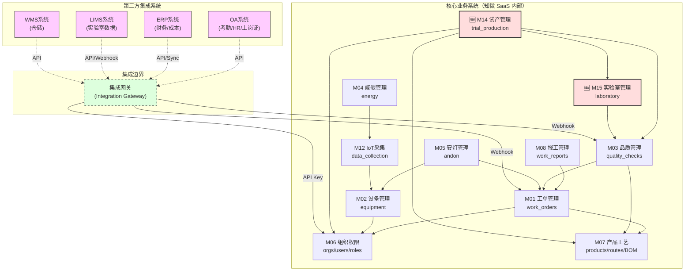
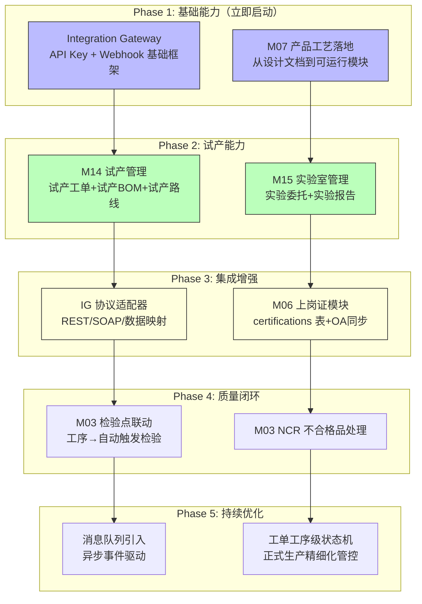

# 架构全面复盘报告

> **评估范围**：基于用户反馈的两大核心关切（系统关联性/NPI试产流程），对知微 SaaS 现有架构进行 8 维度全面复盘
> **评估日期**：2026-06-19
> **评估人**：Bob（架构师）
> **前置文档**：`architecture-impact-assessment.md`（上次架构评估）、`product-route-capability-model-v2.md`、`tenant-sysadmin-design-v2.md`、`manufacturing-scenario-simulation.md`

---

## 第1章：架构现状评估

### 1.1 当前架构全景

```
┌──────────────────────────────────────────────────────────────────┐
│                         API Layer                                │
│  /api/v1/{resource}  router → Depends(get_current_user)          │
│         ↓                                                        │
├──────────────────────────────────────────────────────────────────┤
│                       Service Layer                               │
│  ProductionService / QualityService / TpmService / EnergyService  │
│         ↓                                                        │
├──────────────────────────────────────────────────────────────────┤
│                    Repository Layer                                │
│  MultiTenantRepository (自动注入 tenant_id 行级隔离)              │
│  Raw SQL (参数化绑定, SQL注入防护)                                 │
│         ↓                                                        │
├──────────────────────────────────────────────────────────────────┤
│                    Database (SQLite/PostgreSQL)                    │
└──────────────────────────────────────────────────────────────────┘

跨切面组件:
  - JWT 认证 (sub + tenant_id + features)
  - DataRouteResolver (6 DataType × 9 RouteStrategy)
  - feature_flags (M00-M12 模块开关)
```

### 1.2 核心优势

| 维度 | 评分 | 说明 |
|------|:----:|------|
| **层间解耦** | ⭐⭐⭐⭐⭐ | API → Service → Repository 三层严格分离，每层职责单一 |
| **租户隔离** | ⭐⭐⭐⭐⭐ | MultiTenantRepository 自动注入 tenant_id，UPDATE/DELETE 有防护 |
| **扩展模式** | ⭐⭐⭐⭐ | 新增模块 = 新 API + Service + Repository + feature_flag，对既有代码零侵入 |
| **安全防护** | ⭐⭐⭐⭐⭐ | 参数化绑定 + 字段名白名单，SQL注入防护到位 |
| **路由灵活性** | ⭐⭐⭐⭐ | DataRouteResolver 支持 feature_flag 驱动的路由策略切换 |
| **单元测试** | ⭐⭐⭐ | 111 个测试，Mock DB 模式 |

### 1.3 核心弱点

| 弱点 | 严重程度 | 说明 |
|------|:--------:|------|
| **无领域模型层** | **高** | 当前只有数据模型(Model)+Repository，缺少领域层抽象。复杂业务逻辑（如工序流转状态机、试产策略）将散落在 Service 层，难以维护 |
| **缺少集成抽象层** | **高** | DataRouteResolver 只是一个路由选择器，不负责数据格式转换/协议适配/错误重试。对接第三方系统时，集成逻辑将散落在各 Service 中 |
| **工单模型过度简化** | **中** | `work_orders` 表只有 `wo_type` 字段区分类型，工单与工艺路线没有结构化的关联关系 |
| **无异步事件机制** | **中** | 所有操作都是同步的。跨模块联动（如工序完工→自动触发质检→自动生成安灯）需要硬编码调用链 |
| **API Key 体系缺失** | **高** | 当前只有 JWT 用户认证，没有第三方系统认证机制。第三方调用知微 API 时无法使用 API Key |

### 1.4 模块负载分析

| 模块 | feature_flag | 成熟度 | 说明 |
|------|:------------:|:------:|------|
| **M00 租户/认证** | — | ✅ **成熟** | 租户开通、JWT认证、套餐配置已就绪 |
| **M01 生产工单** | `M01_WORK_ORDER` | ⚠️ **基础就绪** | CRUD 已完成，缺工序级流转、缺工艺路线关联、缺试产类型 |
| **M02 设备管理** | `M02_EQUIPMENT` | ⚠️ **基础就绪** | 设备台账已就绪，缺实时监控/OEE/PM |
| **M03 品质管理** | — | ⚠️ **基础就绪** | 检验单基本API已就绪，缺检验点联动/NCR/SPC |
| **M04 能碳管理** | `M11_ENERGY` | ⚠️ **基础就绪** | 能碳数据采集展示已就绪 |
| **M05 安灯管理** | `M05_ANDON_CALL` | ⚠️ **基础就绪** | 安灯呼叫响应已就绪 |
| **M06 组织权限** | — | ⚠️ **设计完成** | v2 设计已完成（组织树+三维权限），实施进行中 |
| **M07 产品/工艺** | — | ❌ **暂无** | 产品 v2 设计已出（`product-route-capability-model-v2.md`），未开发 |
| **M08 报工管理** | `M01_WORK_REPORT` | ⚠️ **基础就绪** | 报工CRUD已就绪，缺审批流程、缺工序级报工验证 |
| **M12 IoT采集** | `M12_IOT_GATEWAY` | ⚠️ **基础就绪** | /api/v1/collect/iot/ingest 入口已就绪 |
| **M14 试产管理** | — | ❌ **完全缺失** | 本次复盘核心议题 |
| **M15 实验室管理** | — | ❌ **完全缺失** | 本次复盘核心议题 |

---

## 第2章：系统关联性分析

### 2.1 核心系统关系图



### 2.2 模块集成依赖矩阵

| 模块 | 依赖内部模块 | 可能对接第三方 | 集成方式 | 现状 |
|------|------------|---------------|---------|:----:|
| **M01 工单** | M06(组织), M07(产品/路线) | ERP(成本核算) | API | ❌ 未集成 |
| **M02 设备** | M06(组织) | — | — | ⚠️ 基础台账 |
| **M03 品质** | M01(工单), M07(检验标准) | LIMS(实验室数据) | API | ❌ 未集成 |
| **M04 能碳** | M12(IoT) | — | — | ⚠️ 基础 |
| **M05 安灯** | M01(工单), M02(设备) | — | — | ⚠️ 基础 |
| **M06 组织权限** | — | **OA/HR(上岗证/组织同步)** | **API + Webhook** | ❌ **关键缺口** |
| **M07 产品工艺** | M06(组织) | ERP(物料主数据同步) | API | ❌ 未开发 |
| **M08 报工** | M01(工单), M06(组织) | — | — | ⚠️ 基础 |
| **M12 IoT** | M02(设备), M04(能碳) | DCS/SCADA(OPC UA) | MQTT/Modbus | ⚠️ 基础入口 |
| **M14 试产(新)** | M07(产品/路线), M03(品质), M15(实验室) | LIMS(实验报告) | API | ❌ 不存在 |
| **M15 实验室(新)** | M03(品质) | LIMS(检验数据) | API/Webhook | ❌ 不存在 |

### 2.3 关键发现：上岗资格证的集成路径

**问题**：上岗资格证（`labor_cert`）当前仅在工序定义的 `operations.labor_cert` 字段中作为 JSON 存储，与 OA/HR 系统无关联。

**方案分析**：

| 方案 | 描述 | 优缺点 |
|------|------|--------|
| **方案 A（推荐）** | 知微内部维护上岗资格证台账，通过 API Key 从 OA 系统定时同步 | ✓ 数据在知微内部，查询快<br/>✓ OA 系统故障不影响生产操作<br/>✗ 需要开发同步任务 |
| **方案 B** | 实时调用 OA 系统 API 查验上岗资格 | ✗ OA 系统故障时工位终端无法开工<br/>✗ 网络延迟影响车间效率<br/>✗ OA 系统并发压力 |

**推荐方案 A**：知微内部建立 `certifications` 表（上岗资格证台账），通过 Integration Gateway 的定时同步任务从 OA/HR 系统拉取数据。操作员报工时，系统校验 `work_center → wc_labor.cert_requirements → certifications` 链路。

---

## 第3章：3个关键架构决策

### 决策A：是否需要新增 NPI/试产/实验室模块？

**结论：需要。新增 M14 试产管理 + M15 实验室管理。**

#### 方案对比

| 维度 | 方案1：新增 M14+M15（推荐） | 方案2：在现有工单系统中标记试产类型 |
|:-----|:--------------------------:|:--------------------------------:|
| **数据隔离** | 独立表/独立状态机，与正式生产严格隔离 | 同表同字段，试产与正式数据混合 |
| **BOM隔离** | 试产BOM可灵活修改，不污染正式BOM | 必须共享正式BOM，修改会影响正式生产 |
| **工艺路线** | 试产工艺路线独立版本，支持快速迭代 | 必须使用正式工艺路线，不支持试产专用路线 |
| **检验标准** | 试产检验标准可更宽松或更严格 | 必须使用正式检验标准 |
| **成本核算** | 试产成本独立核算，不影响正式成本 | 成本混在正式工单中 |
| **状态机** | 试产专用状态机（规划→小试→中试→小批量→评审→转量产） | 必须复用正式工单状态机 |
| **实验室关联** | 天然关联实验室模块，试产结果与实验报告联动 | 无实验室概念 |
| **工作量** | **中等（8-12天）** | 小（3-5天） |

#### 推荐方案理由

1. **数据安全原则**：试产数据（新配方/新工艺）与正式生产数据混在一起是严重的质量风险。试产BOM的错误会直接导致正式工单的物料错误
2. **状态机不一致**：试产工单的状态流转完全不同（小试→中试→小批量→评审→转量产 vs 正式工单的 draft→released→in_progress→completed）
3. **实验室数据是试产的天然关联物**：没有实验室模块，试产结果（材料分析报告、性能测试数据）无处存放
4. **已有类似设计范式**：当前 M01-M12 的模块划分方式本身就是按功能领域独立划分，M14/M15 遵循同一模式

#### 推荐架构位置

```
M14 试产管理 ←→ M15 实验室管理
  │                    │
  ├─ trial_orders      ├─ lab_tests
  ├─ trial_routes      ├─ lab_reports
  ├─ trial_bom         ├─ test_specimens
  └─ trial_reviews     └─ test_equipment
       │                     │
       └────────┬────────────┘
                │
          M03 品质管理（检验结论校验）
```

### 决策B：第三方集成架构选型

**结论：方案2（新增 Integration Gateway 层）+ 方案3（消息队列）的组合方案。**

#### 方案对比

| 维度 | 方案1：增强 DataRouteResolver | 方案2：Integration Gateway（推荐核心） | 方案3：消息队列（推荐辅助） |
|:-----|:---------------------------:|:-----------------------------------:|:------------------------:|
| **职责定位** | 数据路由策略选择（已有） | 协议转换+认证+数据映射+重试 | 异步解耦+削峰填谷+事件驱动 |
| **协议适配** | ❌ 不支持 | ✅ 支持 REST/SOAP/Webhook/FTP | ✅ 通过队列适配 |
| **错误重试** | ❌ 不支持 | ✅ 内置重试+退避策略 | ✅ 消息投递保证 |
| **数据映射** | ❌ 不支持 | ✅ 字段映射+格式转换 | ❌ 不支持 |
| **认证管理** | ❌ 不支持 | ✅ API Key管理+OAuth代理 | ✅ 仅消息认证 |
| **实时性** | 同步 | 同步+异步 | 异步 |
| **复杂度** | 低（易扩展） | 中（独立模块） | 中（需消息中间件） |
| **运维成本** | 无 | 低（无状态服务） | 中（需维护消息队列） |

#### 推荐方案：Integration Gateway（主）+ 消息队列（辅）

**架构定位**：

```
第三方系统 ↔ Integration Gateway ↔ 知微核心系统
                 │
          ┌──────┴──────┐
          │              │
    同步API调用      异步消息队列
   (实时查询)      (事件通知/数据同步)
```

**Integration Gateway 职责**：

| 功能 | 说明 | 优先级 |
|------|------|:------:|
| **API Key 认证代理** | 第三方系统使用 API Key 调用 Gateway，Gateway 转发到内部 API | **P0** |
| **协议适配器** | REST ↔ SOAP, JSON ↔ XML 转换 | **P1** |
| **数据映射引擎** | 第三方系统字段 ↔ 知微系统字段映射（如 OA 的 dept_name → know_org.name） | **P1** |
| **重试+熔断** | 网络超时自动重试（3次退避），连续失败熔断 | **P1** |
| **Webhook 管理** | 注册第三方 Webhook URL，事件触发时推送数据 | **P1** |
| **同步任务调度** | 定时批量同步（如每晚同步 HR 组织架构） | **P1** |
| **操作审计** | 记录所有第三方调用的请求/响应日志 | **P2** |

**消息队列适用场景**：

| 场景 | 消息队列方案 | 说明 |
|------|------------|------|
| 工单状态变更通知 ERP | 事件 → 队列 → ERP Webhook | ERP 不关心实时性，异步通知足够 |
| 上岗证变更通知 | 事件 → 队列 → 更新 certifications 表 | OA 触发变更事件，知微异步更新 |
| 实验室检验结果回传 | 事件 → 队列 → M15 实验室模块 | LIMS 完成检验后异步推送结果 |
| 设备报警联动安灯 | 直接 API 调用（实时要求高） | 安灯需要秒级响应，不经过队列 |

### 决策C：是否需要推倒重来？

**结论：NO — 不需要推倒重来。**

#### 判断依据

| 维度 | 评估 | 说明 |
|:-----|:----:|------|
| **现有架构对新需求的覆盖度** | ~70% | 当前三层架构(MultiTenantRepository + JWT + DataRouteResolver) 对 8 个评估维度中的 6 个有良好扩展基础 |
| **架构负债严重程度** | 中等 | 主要缺口在集成层抽象、异步机制、API Key 认证，这些属于**增量扩展**而非**架构重构** |
| **模块耦合度** | 低 | 模块间通过 Service 调用，没有循环依赖 |
| **重来成本 vs 收益比** | 1:8 | 重来成本高（约 4-6 周），而增量扩展仅需 2-3 周 |

#### 关键理由

1. **核心架构的设计是正确的**：API → Service → Repository 三层架构、MultiTenantRepository 的租户隔离、JWT 认证体系、DataRouteResolver 的路由策略，这些都不是瓶颈
2. **缺口是"缺失"而非"错误"**：缺少集成抽象层、API Key 机制、消息队列，这些是**没有建**而不是**建错了**
3. **模块化的扩展路径清晰**：新增 M14/M15 模块只需要遵循现有模式（新增 route + service + repo + model + feature_flag），不需要修改任何现有模块
4. **底层数据库/ORM 不需要变更**：SQLite 兼容语法、参数化绑定、MultiTenantRepository 的 SQL 注入防护，这些在新增模块时完全复用

#### 替代方案：3 次中等规模增量扩展

```
扩展1: 集成能力（Integration Gateway + API Key + 消息队列）
  → 解决第三方集成、异步通知、认证代理
  → 估算：5-8 天

扩展2: 试产+实验室模块（M14 + M15）
  → 解决 NPI 流程覆盖
  → 估算：8-12 天

扩展3: 工单扩展（工序级工单 + 工艺路线关联）
  → 解决正式生产精细化管控
  → 估算：5-7 天
```

---

## 第4章：架构增强方案（推荐方案）

### 4.1 新增模块清单

| 模块 | 模块编码 | 说明 | 前置依赖 | 工作量 |
|:----:|:--------:|------|---------|:------:|
| **试产管理** | **M14** | 试产工单、试产BOM、试产工艺路线、试产评审 | M07(产品/工艺) + M06 + M03 | **8-12天** |
| **实验室管理** | **M15** | 实验委托、实验报告、检验标准维护、试样管理 | M03(品质) | **5-8天** |
| **集成网关** | **IG** | API Key管理、协议适配、Webhook、同步调度、操作审计 | M06(认证为基础) | **5-8天** |

### 4.2 现有模块扩展清单

| 模块 | 扩展内容 | 原因 | 工作量 |
|:----:|---------|------|:------:|
| **M07 产品工艺** | 从设计文档落地为实际模块（products + BOM + operations + routes + work_centers + factory_calendars） | Phase 2 生产核心前置依赖 | **7-10天** |
| **M01 工单管理** | 新增 `work_order_steps` 表、工序级状态机、BOM展开为工序级物料需求、工艺路线快照 | 正式生产精细化管控 | **5-7天** |
| **M03 品质管理** | 检验点联动（工序到达自动触发检验单）、NCR 不合格品处理、SPC 统计分析 | 质量闭环 | **5-8天** |
| **M06 组织权限** | 扩展 `users` 表字段（primary_org_id）、`role_permissions` 表重构、DataScopeService 实现 | v2 设计落地 | **4-5天** |

### 4.3 集成层设计（Integration Gateway）

#### 4.3.1 架构位置

```
┌────────────────────────────────────────────────────────────────┐
│                     第三方系统                                    │
│  OA/HR  |  ERP  |  LIMS  |  WMS  |  DCS/SCADA                  │
└─────────────────┬──────────────────────────────────────────────┘
                  │ HTTPS / MQTT / Webhook
┌─────────────────▼──────────────────────────────────────────────┐
│                  Integration Gateway                             │
│                                                                  │
│  ┌──────────┐ ┌──────────┐ ┌──────────┐ ┌──────────────────┐  │
│  │API Key   │ │协议适配器│ │数据映射 │ │Webhook 管理      │  │
│  │认证代理  │ │REST/SOAP │ │字段转换  │ │注册/推送/重试    │  │
│  └──────────┘ └──────────┘ └──────────┘ └──────────────────┘  │
│  ┌──────────┐ ┌──────────┐ ┌──────────┐                        │
│  │重试+熔断 │ │同步调度  │ │操作审计  │                        │
│  └──────────┘ └──────────┘ └──────────┘                        │
└─────────────────┬──────────────────────────────────────────────┘
                  │ 内部 API 调用 / 消息队列
┌─────────────────▼──────────────────────────────────────────────┐
│                   知微 SaaS 核心系统                              │
│  M01 工单 | M03 品质 | M06 组织 | M14 试产 | M15 实验室          │
└────────────────────────────────────────────────────────────────┘
```

#### 4.3.2 API Key 认证机制

```python
# Integration Gateway 的 API Key 认证中间件
# 用于第三方系统调用知微 API 时的身份验证

# api_keys 表
CREATE TABLE api_keys (
    id              INTEGER PRIMARY KEY AUTOINCREMENT,
    tenant_id       VARCHAR(64) NOT NULL,        # 所属租户
    key_name        VARCHAR(128) NOT NULL,        # 密钥名称（如"HR系统对接"）
    key_hash        VARCHAR(256) NOT NULL,        # API Key 的 bcrypt hash
    key_prefix      VARCHAR(8) NOT NULL,          # 密钥前缀（便于识别，如 "zw_hr_"）
    permissions     TEXT NOT NULL,                # JSON数组：允许调用的API权限
    allowed_ips     TEXT,                         # JSON数组：IP白名单（可选）
    webhook_url     VARCHAR(256),                 # 回调URL（可选）
    is_active       INTEGER DEFAULT 1,
    expires_at      TIMESTAMP,                    # 过期时间
    last_used_at    TIMESTAMP,
    created_at      TIMESTAMP DEFAULT CURRENT_TIMESTAMP
);

# 认证流程
# 1. 第三方请求携带 X-API-Key header
# 2. IG 根据 key_prefix 查找对应的 api_keys 记录
# 3. 校验 key_hash（bcrypt verify）
# 4. 校验 IP 白名单（如有）
# 5. 校验请求路径是否在 permissions 范围内
# 6. 校验是否过期
# 7. 全部通过 → 转发到内部 API
# 8. 记录操作审计日志
```

#### 4.3.3 API Key vs JWT 使用场景对比

| 维度 | API Key（第三方集成） | JWT（用户认证） |
|:-----|:-------------------:|:--------------:|
| 适用方 | OA/ERP/LIMS/WMS 等第三方系统 | 知微前端用户（操作员/主管/admin） |
| 身份粒度 | 系统级（一个API Key代表一个集成场景） | 用户级（每个用户独立） |
| 权限模型 | 预授权的 API 路径白名单 | 基于角色+数据作用域的三维权限 |
| 有效期 | 长期（季度/年度），需手动吊销 | 短期（30分钟）+ Refresh Token |
| 审计粒度 | 按 API Key 聚合 | 按用户 ID 精细审计 |

### 4.4 Webhook 机制完善

```python
# webhook_subscriptions 表
CREATE TABLE webhook_subscriptions (
    id              INTEGER PRIMARY KEY AUTOINCREMENT,
    tenant_id       VARCHAR(64) NOT NULL,
    name            VARCHAR(128) NOT NULL,           # 订阅名称
    api_key_id      INTEGER REFERENCES api_keys(id), # 关联的 API Key
    event_type      VARCHAR(64) NOT NULL,            # 事件类型
    target_url      VARCHAR(512) NOT NULL,           # 回调 URL
    secret          VARCHAR(256),                    # 签名密钥（用于校验回调来源）
    retry_policy    VARCHAR(32) DEFAULT '3x_backoff',# 重试策略
    is_active       INTEGER DEFAULT 1,
    last_trigger_at TIMESTAMP,
    created_at      TIMESTAMP DEFAULT CURRENT_TIMESTAMP,
    UNIQUE(tenant_id, name)
);

# 预定义事件类型
EVENT_TYPES = {
    "work_order.status_changed": "工单状态变更",
    "work_order.step_completed": "工序完工",
    "quality.check_completed": "检验完成",
    "trial.review_created": "试产评审创建",
    "trial.status_changed": "试产状态变更",
    "lab.report_ready": "实验报告完成",
    "equipment.status_changed": "设备状态变更",
    "andon.call_created": "安灯呼叫创建",
}

# Webhook 推送流程
# 1. 业务操作完成 → 触发事件
# 2. IG 查询匹配的 webhook_subscriptions
# 3. 生成 HMAC 签名（使用 secret）
# 4. POST 到 target_url（含签名 header）
# 5. 超时/失败 → 按 retry_policy 重试（3次指数退避）
# 6. 全部失败 → 记录到 failed_webhooks 表，人工介入
```

---

## 第5章：推倒重来的方案评估（如未来需要）

> **当前结论：不需要推倒重来。** 本章仅作预案，供未来架构演进参考。

### 5.1 触发条件（何时需要考虑重来）

| 条件 | 阈值 | 说明 |
|:----|:----:|------|
| 第三方集成系统数量 > 10 | 10+ | 当前纯同步API模式无法支撑多系统编排 |
| 单租户日活用户 > 500 | 500+ | Raw SQL + 单库模式可能出现性能瓶颈 |
| 模块数量 > 20 | 20+ | 平铺模块管理模式不可持续 |
| 单表数据量 > 5000万行 | 50M+ | 需要分库分表或读写分离 |
| 需支持实时协同编辑 | — | 当前架构未设计 OT/CRDT 协同能力 |

### 5.2 目标架构建议（如需重来）

```
┌────────────────────────────────────────────────────────────┐
│                   API Gateway Layer                          │
│   Rate Limiting | API Key Auth | Request Validation         │
├────────────────────────────────────────────────────────────┤
│                   BFF Layer (Backend For Frontend)           │
│   前端适配 | 聚合查询 | 数据裁剪                              │
├────────────────────────────────────────────────────────────┤
│                   Domain Service Layer                       │
│   ┌────────┐┌────────┐┌────────┐┌────────┐┌────────┐      │
│   │工单领域││品质领域││设备领域││试产领域││实验室  │      │
│   └────────┘└────────┘└────────┘└────────┘└────────┘      │
├────────────────────────────────────────────────────────────┤
│                   Event Bus (消息总线)                        │
│   领域事件发布/订阅 | 跨模块解耦 | 最终一致性                  │
├────────────────────────────────────────────────────────────┤
│                   CQRS Layer                                 │
│   Command → Write DB (SQL)                                   │
│   Query   → Read DB / Search Engine (Elasticsearch)          │
├────────────────────────────────────────────────────────────┤
│                   Integration Layer                           │
│   Outbox Pattern | SaaS → SaaS Connectors | ETL Pipelines   │
└────────────────────────────────────────────────────────────┘
```

### 5.3 迁移路径（如果需要）

```
Phase 1：基础设施（2-3周）
  ├── 引入 Event Bus（如 RabbitMQ / Redis Stream）
  ├── 建立 Outbox Pattern（确保领域事件可靠投递）
  └── 引入 Domain Service 抽象层（包一层领域服务，不改动现有代码）

Phase 2：模块解耦（3-4周）
  ├── 将现有 Service 层拆分为领域服务
  ├── 建立 CQRS 基础（读模型 vs 写模型分离）
  └── 迁移第三方集成到 Integration Gateway

Phase 3：数据层演进（2-3周）
  ├── 引入 ORM 完整能力（SQLAlchemy 关联查询替代 Raw SQL JOIN）
  ├── 读库建立（Elasticsearch / Read Replica）
  └── 数据迁移脚本 + 双写验证

Phase 4：旧代码退役（1-2周）
  ├── 废弃旧 API 路由
  ├── 删除旧 Service 层
  └── 全量回归测试
```

### 5.4 成本估算

| 类型 | 工作量 | 人力 | 总成本 |
|:----|:------:|:----:|:------:|
| 架构设计 | 1周 | 1架构师 | 1人周 |
| 基础设施搭建 | 2-3周 | 2后端 | 4-6人周 |
| 模块迁移（12模块） | 8-12周 | 3-4后端 | 24-48人周 |
| 数据迁移 | 2-3周 | 2后端 | 4-6人周 |
| 测试+回归 | 3-4周 | 2测试 | 6-8人周 |
| **总计** | **16-23周** | **3-4人** | **39-69人周** |

### 5.5 风险与收益分析

| 维度 | 风险 | 收益 |
|:-----|------|------|
| **业务连续性** | 迁移期间需要停机或双系统并行（高风险） | 新架构更稳定、可维护性更高 |
| **功能开发停滞** | 迁移期间新功能开发暂停，影响产品竞争力 | 迁移后新功能开发速度提升 2-3 倍 |
| **数据一致性** | 双写期可能出现数据不一致 | CQRS + Event Sourcing 后数据链路清晰 |
| **团队学习成本** | 团队成员需要学习新架构模式 | 长期维护成本降低 50%+ |
| **性价比** | **成本高（39-69人周）** | **收益在 10+ 第三方集成时开始体现** |

---

## 第6章：结论与建议

### 6.1 一句话结论

**当前架构不需要推倒重来；核心短板在于集成抽象层和 NPI 流程域的缺失，通过 3 次增量扩展（Integration Gateway + M14试产管理 + M15实验室管理）即可覆盖用户关切，总预估工作量 3-4 周。**

### 6.2 推荐后续行动（Phase 顺序）



### 6.3 各 Phase 详细说明

#### Phase 1：基础能力（预估 7-10 天）

| 任务 | 产出 | 工作量 |
|:----|:-----|:------:|
| Integration Gateway 基础框架 | `api_keys` 表 + API Key 认证中间件 + Webhook 推送基础能力 | **3-4天** |
| M07 产品工艺落地 | `products` + `product_bom` + `operations` + `process_routes` + `route_steps` + `work_centers` 表 + CRUD API | **7-10天** |

#### Phase 2：试产能力（预估 8-12 天）

| 任务 | 产出 | 工作量 |
|:----|:-----|:------:|
| M14 试产管理 | `trial_orders` 表（独立于 work_orders）、`trial_routes` 表（试产专用工艺路线）、`trial_bom` 表（试产BOM）、`trial_reviews` 表（试产评审记录） | **5-7天** |
| M15 实验室管理 | `lab_tests` 表（实验委托）、`lab_reports` 表（实验报告）、`test_standards` 表（检验标准库） | **3-5天** |

#### Phase 3：集成增强（预估 5-8 天）

| 任务 | 产出 | 工作量 |
|:----|:-----|:------:|
| IG 协议适配器 | REST ↔ SOAP 转换、JSON ↔ XML 映射、字段映射引擎、重试+熔断机制 | **3-5天** |
| M06 上岗证模块 | `certifications` 表 + HR/OA 同步任务 + 工位终端上岗校验 | **2-3天** |

#### Phase 4：质量闭环（预估 5-8 天）

| 任务 | 产出 | 工作量 |
|:----|:-----|:------:|
| M03 检验点联动 | 工序 `is_inspection_point` 标记 → 工序到达自动创建检验单 | **2-3天** |
| M03 NCR 处理 | NCR 全流程（发现→隔离→评审→处置→验证关闭） | **3-5天** |

#### Phase 5：持续优化（预估 5-7 天）

| 任务 | 产出 | 工作量 |
|:----|:-----|:------:|
| 消息队列引入 | RabbitMQ/Redis Stream + 事件发布/订阅 + Outbox Pattern | **3-4天** |
| 工单工序级状态机 | `work_order_steps` 表 + F-to-S 流转控制 + 批次追踪 | **2-3天** |

### 6.4 关键风险提示

| 风险 | 概率 | 影响 | 应对措施 |
|:-----|:----:|:----:|---------|
| **M07 产品工艺落地延误** | **高** | 阻塞 M14 试产模块和工单扩展 | 优先开发 M07，试产工单可使用简化版产品数据先行 |
| **Integration Gateway 过度设计** | 中 | 增加不必要的开发成本 | 严格 MVP 范围：Phase 1 仅做 API Key + Webhook 基础，不引入复杂协议适配 |
| **第三方系统配合度不足** | **高** | OA/HR 系统可能不开放 API | 先做"知微内部维护上岗证台账"方案，支持手动录入和Excel导入 |
| **试产流程需求变更频繁** | 中 | 已开发功能需要调整 | M14 状态机设计为可配置（`trial_order_types` 字典），支持用户自定义试产阶段 |
| **M06 组织权限 v2 落地进度** | 中 | DataScopeService 未就绪影响试产数据隔离 | 试产数据先用 `tenant_id` 隔离，DataScopeService 就绪后再叠加组织级隔离 |

### 6.5 用户关切问题逐条回应

| 用户关切 | 回应 |
|---------|------|
| **上岗资格证与OA HR关联** | Phase 3 建立 `certifications` 表 + 定时同步任务。不上岗资格证的实时校验不影响产线开工，OA 故障时工位终端仍可使用本地缓存数据开工 |
| **QA以外模块对接第三方** | Integration Gateway（Phase 1）提供统一的 API Key 认证 + Webhook 推送机制，任何模块对接第三方时无需重复开发认证逻辑 |
| **小试/中试/小批量试产** | M14 试产管理模块（Phase 2）原生支持。试产类型通过字典可配置，支持用户自定义试产阶段 |
| **新工艺/新原料试产** | M14 的 `trial_routes` 和 `trial_bom` 独立于正式数据，支持快速迭代 |
| **试产结果结合QA检验** | M14 与 M03 品质管理模块联动，试产完成后自动汇总检验结论 |
| **实验室模块/实验报告** | M15 实验室管理模块（Phase 2）管理实验委托、实验报告、检验标准 |
| **试产工单与正式工单差异** | 采用独立表策略（`trial_orders` 表），试产BOM、试产工艺路线、试产状态机均与正式生产隔离 |
| **系统兼容性与集成能力** | Integration Gateway 提供协议适配 + 数据映射，支持 REST/SOAP/Webhook/FTP 等多种对接方式 |

---

## 附录：8维度评估汇总表

| # | 评估维度 | 结论 | 关键动作 |
|:-:|:---------|:----:|---------|
| 1 | **现有模块架构** | ✅ 模块划分方式自然支持 M14/M15 扩展 | 遵循 M00-M12 命名惯例新增模块 |
| 2 | **第三方集成能力** | ❌ 当前缺失，需新建 Integration Gateway | Phase 1 建立 API Key + Webhook 基础框架 |
| 3 | **NPI/试产流程** | ❌ 当前完全缺失 | Phase 2 新增 M14 + M15，独立表策略 |
| 4 | **数据路由机制** | ⚠️ DataRouteResolver 足够管理内部路由，不负责外部集成 | 内部路由用 DataRouteResolver，外部集成用 IG |
| 5 | **认证/授权边界** | ⚠️ 仅 JWT 用户认证，缺少 API Key | Phase 1 新增 `api_keys` 表 + 认证中间件 |
| 6 | **同步/异步机制** | ⚠️ 当前全同步，缺少异步事件驱动 | Phase 5 引入消息队列，在此之前 Webhook 可满足基础需求 |
| 7 | **架构天花板** | 在第三方集成 > 10 或日活 > 500 时碰到天花板 | 当前远未到天花板（估算 < 50 用户），3-4 周内无需担心 |
| 8 | **重构成本** | 推倒重来需 39-69 人周，收益在 10+ 集成时才体现 | **不需要重构**，增量扩展 3-4 周即可 |
