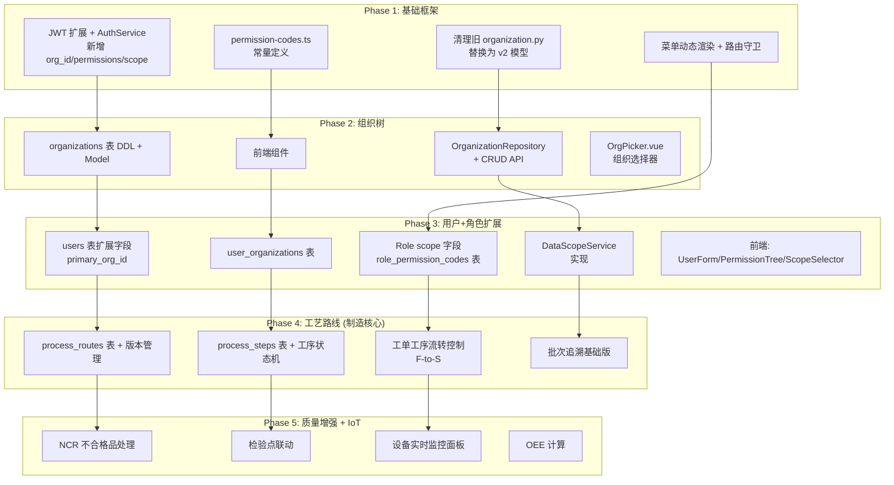
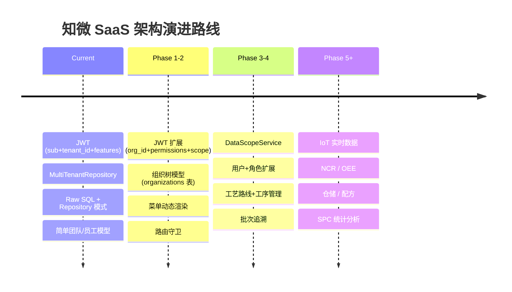

# 架构影响评估报告

> **评估范围**：基于《租户系统管理设计 v2》+《制造场景仿真与覆盖度评审》需求，评估现有技术架构是否需要根本性调整  
> **评估日期**：2026-06-16  
> **评估人**：Bob（架构师）

---

## 1. 架构总体评价

**结论：不需要根本性调整，但需要 3 次中等规模增量扩展。**

当前架构（FastAPI + Raw SQL Repository + JWT 认证 + MultiTenantRepository）的设计是合理的，具备良好的扩展性。新需求的引入不会颠覆现有架构，但需要在以下三个维度进行增量扩展：

| 扩展维度 | 影响范围 | 工作量评级 |
|---------|---------|:---------:|
| **维度 A：组织树 + 三维权限** | 数据模型、认证/授权、API 层、Service 层、前端 | ★★★ 中等 |
| **维度 B：工序级工艺路线** | 数据模型、API 层、Service 层 | ★★☆ 较小 |
| **维度 C：IoT 设备监控** | 数据模型、IoT 网关层 | ★★☆ 较小 |

**三个维度彼此正交**，可以独立开发、并行推进，互不阻塞。

---

## 2. 逐层评估

| 层次 | 是否需要调整 | 调整类型 | 说明 |
|------|:-----------:|:--------:|------|
| **数据模型** | ✅ 是 | 增量扩展 | 新增 `organizations`、`user_organizations`、`role_permissions`（代码级）、`process_routes`、`process_steps` 等表；`users`/`roles` 表各扩展 2-3 个字段。现有表不受影响，无需迁移 |
| **API 层** | ✅ 是 | 增量扩展 | 新增 `/api/v1/orgs/*` 路由前缀（6+ API）；扩展已有的 `/api/v1/users`、`/api/v1/roles` 端点。现有路由模式（`/api/v1/{resource}`）完全兼容 |
| **Service 层** | ✅ 是 | 增量扩展 | 新增 `DataScopeService`，在 Service 层（非 Repo 层）注入 WHERE 条件。现有 Service 无需大规模改造，仅需在关键查询方法中添加 `apply_scope()` 调用 |
| **认证/授权** | ✅ 是 | 增量扩展 | JWT payload 需扩展 `org_id`、`permissions`、`scope` 三个字段；`AuthService.login()` 需从用户角色查询组装这些字段。`get_current_user` 依赖注入逻辑不变 |
| **前端架构** | ✅ 是 | 增量扩展 | 需新增：权限编码常量表、菜单动态渲染逻辑、路由守卫扩展、`<OrgTree>`/`<PermissionTree>` 等组件。当前 Vue Router + Pinia 架构完全兼容 |
| **多租户隔离** | ✅ 是 | 增量扩展 | `MultiTenantRepository` 的 `tenant_id` 注入逻辑不变。新增的 `org_id` 维度在 `DataScopeService` 层实现，与现有租户隔离层正交叠加，不影响现有隔离逻辑 |
| **IoT/监控** | ✅ 是 | 增量扩展 | 现有 `data_collection` 模块已有 IoT 数据采集入口（`/api/v1/collect/iot/ingest`），可复用。需新增设备状态实时展示模块，架构层面无新增挑战 |

---

## 3. 需要调整的详细清单

### 3.1 数据模型层调整

#### 3.1.1 新增表

| 表名 | 说明 | 生成方式 | 依赖 |
|------|------|---------|------|
| `organizations` | 组织树节点（物化路径模型） | SQLAlchemy 新 Model | 无 |
| `user_organizations` | 用户-组织多对多关联 | SQLAlchemy 新 Model | `organizations` + `users` |
| `role_permissions` (代码级) | 注意：当前已有 `role_permissions` 表但关联 `permission_id`。v2 设计需要改为关联 `permission_code` 以支持自由扩展权限编码 | DDL 变更 | `roles` |
| `process_routes` | 工艺路线主表（含版本管理） | SQLAlchemy 新 Model | 无 |
| `process_steps` | 工序/工步表 | SQLAlchemy 新 Model | `process_routes` |
| `audit_logs` | 操作审计日志 | SQLAlchemy 新 Model | `users` |

#### 3.1.2 现有表扩展字段

**`users` 表** — 追加 3 个字段：
```sql
ALTER TABLE users ADD COLUMN primary_org_id INTEGER;
ALTER TABLE users ADD COLUMN is_primary_owner INTEGER NOT NULL DEFAULT 0;
ALTER TABLE users ADD COLUMN is_system INTEGER NOT NULL DEFAULT 0;
```

**`roles` 表** — 追加 1 个字段：
```sql
ALTER TABLE roles ADD COLUMN scope VARCHAR(32) NOT NULL DEFAULT 'scope:self';
```

**`role_permissions` 表** — 关键变更：
- 当前结构：`role_id` → `permission_id` → `permissions.code`
- v2 目标：`role_id` → `permission_code`（直接存储编码字符串，如 `"work_order:read"`）
- **建议方案**：保留现有 `permissions` 表作为权限编码的元数据仓库，但 `role_permissions` 新增 `permission_code` 字段直接存储编码字符串，同时保留 `permission_id` 为 NULLABLE 以实现过渡兼容。
- **或者**：直接新建 `role_permission_codes` 表（`role_id`, `permission_code`, UNIQUE(role_id, permission_code)），逐步废弃旧的 `role_permissions` 表。

**建议采用过渡方案**：创建新表 `role_permission_codes`，新旧并行运行一个版本后废弃旧表。

#### 3.1.3 迁移策略

```
Phase 1: 建新表（CREATE TABLE）— 无损操作
Phase 2: 已有表加字段（ALTER TABLE ADD COLUMN）— 无损操作，设 DEFAULT 值
Phase 3: seed.py 更新初始化流程
Phase 4: 数据迁移脚本（如需要）
```

所有 DDL 操作均为 ADDITIVE（仅增加不删除），不涉及现有数据的迁移风险。

### 3.2 API 层调整

#### 3.2.1 新增 API（完全新建，不影响现有）

| API | 用途 | 说明 |
|-----|------|------|
| `GET /api/v1/orgs/tree` | 获取组织树 | 新路由前缀 `/api/v1/orgs` |
| `GET /api/v1/orgs/{id}` | 组织节点详情 | |
| `GET /api/v1/orgs/{id}/children` | 子节点列表 | |
| `POST /api/v1/orgs` | 创建组织节点 | |
| `PUT /api/v1/orgs/{id}` | 编辑组织节点 | |
| `PUT /api/v1/orgs/{id}/move` | 拖拽移动 | |
| `DELETE /api/v1/orgs/{id}` | 删除组织节点 | |
| `PUT /api/v1/roles/{id}/scope` | 设置数据作用域 | 新增端点 |
| `PUT /api/v1/users/{id}/reset-password` | 密码重置 | 新增端点 |
| `PUT /api/v1/users/{id}/org` | 用户组织归属变更 | 新增端点 |
| `GET /api/v1/system/overview` | 系统概览 | 替代 `/system/config` |
| `PUT /api/v1/tenant/modules` | 模块启停 | 新增端点 |
| `GET /api/v1/audit-logs` | 操作日志 | 新增端点 |

#### 3.2.2 扩展现有 API

| 现有 API | 扩展内容 |
|----------|---------|
| `POST /api/v1/users` | 增加 `org_id` + `role_ids` 字段 |
| `PUT /api/v1/users/{id}` | 支持修改 `org_id` |
| `GET /api/v1/users` | 返回值增加 `org_id`、`org_name`、`org_path` |
| `GET /api/v1/roles/{id}` | 返回值增加 `scope` + `permissions`（编码数组） |
| `POST /api/v1/roles` | 创建时同时指定 `permissions` + `scope` |

### 3.3 Service 层调整

#### 3.3.1 新建 DataScopeService

```python
class DataScopeService:
    """数据作用域过滤服务 — 在 Service 层注入 WHERE 条件"""
    
    def __init__(self, org_repo: OrganizationRepository):
        self.org_repo = org_repo

    async def apply_scope(
        self, 
        query: str,              # Raw SQL query string
        params: dict,            # Query params
        user: dict,              # Current user (from JWT)
        scope: str,              # Role's scope code
        org_id_field: str = "org_id"  # Target table's org field
    ) -> Tuple[str, dict]:
        """根据数据作用域追加 WHERE 条件"""
```

**设计决策**：在 Service 层实现，而不是 Repo 层。

**理由**：
1. 数据作用域是基于**当前用户角色**的运行时上下文，不是 Repo 的固有属性
2. 不同的 API 调用同一 Repo 方法时可能需要不同的作用域
3. Repo 层保持纯净，只处理 tenant_id 隔离

#### 3.3.2 现有 Service 的影响范围

直接影响查询需要"数据作用域"过滤的 Service：

| Service | 影响程度 | 改造内容 |
|---------|:-------:|---------|
| `ProductionService` | 中等 | 工单、报工查询追加 `org_id` 作用域 |
| `TpmService` | 中等 | 设备查询追加 `org_id` 作用域 |
| `QualityService` | 中等 | 质检记录查询追加 `org_id` 作用域 |
| `EnergyService` | 低 | 能碳数据查询追加 `org_id` 作用域 |
| `AndonService` | 低 | 安灯记录查询追加 `org_id` 作用域 |
| `UserService` | 低 | 用户列表追加组织过滤 |
| `OrganizationService` | 低 | 仅 admin 可管理组织树 |

**改造模式**（伪代码）：
```python
# Before
async def list_work_orders(self, page, page_size):
    sql = "SELECT * FROM work_orders WHERE tenant_id = :tenant_id"
    return await self.repo.query_page(sql, {"tenant_id": self.repo.tenant_id}, page, page_size)

# After
async def list_work_orders(self, page, page_size, user, scope):
    sql = "SELECT * FROM work_orders WHERE tenant_id = :tenant_id"
    params = {"tenant_id": self.repo.tenant_id}
    sql, params = await self.data_scope_svc.apply_scope(sql, params, user, scope)
    return await self.repo.query_page(sql, params, page, page_size)
```

### 3.4 认证/授权层调整

#### 3.4.1 JWT Payload 扩展

当前 JWT payload：
```json
{"sub": "1", "tenant_id": "default", "features": {"M01_WORK_ORDER": true}}
```

扩展后：
```json
{
  "sub": "1",
  "tenant_id": "default",
  "org_id": 5,
  "roles": ["department_head"],
  "permissions": ["work_order:read", "work_order:create"],
  "scope": "dept_child",
  "features": {"M01_WORK_ORDER": true}
}
```

#### 3.4.2 AuthService 改造

`AuthService.login()` 方法需要增加以下查询逻辑：

```python
# 1. 查用户主组织
org_id = await self.user_repo.get_primary_org(user["id"])

# 2. 查用户角色列表
roles = await self.role_repo.get_user_roles(user["id"])
role_codes = [r["code"] for r in roles]

# 3. 查所有角色的权限编码集合（去重合并）
permissions = await self.role_repo.get_user_permission_codes(user["id"])

# 4. 取最大数据作用域（安全原则：取最大可见范围）
scope = calculate_max_scope([r["scope"] for r in roles])

# 5. 写入 JWT
access_token = create_access_token({
    "sub": str(user["id"]),
    "tenant_id": user["tenant_id"],
    "org_id": org_id,
    "roles": role_codes,
    "permissions": permissions,
    "scope": scope,
}, features=features)
```

### 3.5 前端架构调整

#### 3.5.1 新建设

| 建设项 | 类型 | 说明 |
|--------|------|------|
| `@/config/permission-codes.ts` | 常量文件 | 所有权限编码定义 + 菜单-权限映射 |
| 菜单动态渲染逻辑 | 逻辑改造 | 基于 `user.permissions` 过滤菜单树 |
| 路由守卫扩展 | 逻辑改造 | `router.beforeEach` 检查 `meta.permissions` |
| `<OrgTree.vue>` | 新组件 | 组织树展示/拖拽/右键菜单 |
| `<OrgPicker.vue>` | 新组件 | 组织选择器（树形下拉） |
| `<PermissionTree.vue>` | 新组件 | 权限编码勾选树 |
| `<ScopeSelector.vue>` | 新组件 | 数据作用域单选项 |
| `<RolePicker.vue>` | 新组件 | 角色多选组件 |
| `<UserForm.vue>` | 新组件 | 用户表单（集成了OrgPicker+RolePicker） |

#### 3.5.2 现有架构兼容性

- 当前 Pinia `authStore` 存储 `user` 对象 → 扩展 `user.org_id`, `user.permissions`, `user.scope`
- 当前 Vue Router 路由定义 → 在 `meta` 中添加 `permissions` 字段
- 当前菜单渲染 → 改为 computed 过滤

### 3.6 多租户隔离层调整

**当前 `MultiTenantRepository`** 自动注入 `tenant_id` 到 WHERE 子句。

**新增 `org_id` 维度** 的设计方案：

```
隔离层次：
  L3: tenant_id 隔离（现有 MultiTenantRepository）→ 行级租户隔离
  L4: org_id 作用域（新增 DataScopeService）→ 租户内数据可见范围
  
两者关系：正交叠加，互不干扰
执行顺序：先 tenant_id 过滤，再 org_id 作用域过滤
```

**`MultiTenantRepository` 不需要扩展为 `MultiTenantOrgRepository`**。原因：
- 职责分离：`MultiTenantRepository` 管租户隔离，`DataScopeService` 管数据作用域
- 如果合并到一个类，会增加 Repo 的复杂度，且违背单一职责原则
- 数据作用域是业务语义，不应内嵌到数据访问层

### 3.7 IoT/监控调整

**当前架构**：
- `data_collection` 模块已有 `/api/v1/collect/iot/ingest` 入口
- `energy` 模块已有能耗设备监控
- IoT 数据采集管线已定义（`data-routing-integrated-design.md`）

**新增需求**：
- 设备实时状态监控（运行/待机/故障/停机）
- OEE 计算（可用性 × 性能 × 质量）
- 预防性维护(PM)

**架构影响**：低。当前 IoT 入口可以复用，仅需：
1. 新增设备监控数据模型（`equipment_monitor_points` 表）
2. 新增 WebSocket 或轮询端点推送实时数据
3. OEE 计算逻辑作为新 Service 实现

---

## 4. JWT 扩展方案（关键）

### 4.1 扩展后 Payload 结构

```json
{
  "sub": "1",                          // 用户 ID（已有）
  "tenant_id": "tenant_abc",           // 租户 ID（已有）
  "org_id": 5,                         // 用户主组织 ID（新增）
  "roles": ["department_head"],        // 用户角色编码列表（新增）
  "permissions": [                     // 所有角色的权限编码并集（新增）
    "work_order:read",
    "work_order:create",
    "work_order:update",
    "schedule:read",
    "dashboard:read"
  ],
  "scope": "dept_child",               // 最大数据作用域（新增）
  "features": {"M01_WORK_ORDER": true},// 租户套餐功能标记（已有）
  "exp": 1718534400                    // 过期时间（已有）
}
```

### 4.2 各字段来源

| JWT 字段 | 来源表 | 查询逻辑 |
|----------|-------|---------|
| `org_id` | `users.primary_org_id` + `organizations.id` | `SELECT primary_org_id FROM users WHERE id = :uid` |
| `roles` | `user_roles` + `roles` | `SELECT r.code FROM roles r JOIN user_roles ur ON r.id = ur.role_id WHERE ur.user_id = :uid` |
| `permissions` | `role_permission_codes` + `user_roles` | `SELECT DISTINCT rpc.permission_code FROM role_permission_codes rpc JOIN user_roles ur ON rpc.role_id = ur.role_id WHERE ur.user_id = :uid` |
| `scope` | `roles.scope` | `SELECT MAX(scope_priority) FROM roles WHERE id IN (:user_role_ids)` → 映射为 scope 编码 |

### 4.3 Scope 优先级计算

```
SELF       → priority=0
DEPT       → priority=1
DEPT_CHILD → priority=2
ALL        → priority=3

用户同时有多个角色 → 取最大 priority 对应的 scope
```

### 4.4 关键风险

| 风险 | 影响 | 缓解措施 |
|------|------|---------|
| JWT 体积膨胀 | permissions 数组可能包含 40+ 编码，增加 token 大小 | ① 限制在 50 个以内（当前约 40 个）；② 启用 JWT 压缩（如支持）|
| 权限变更生效延迟 | 角色权限修改后，已签发的 JWT 仍包含旧权限，直到 token 过期 | ① 设置较短的 access_token 过期时间（如 30 分钟）；② 提供强制刷新接口 |
| token 刷新时机 | 用户权限变更后，refresh_token 刷新时是否需要重新计算 permissions | 是。`/auth/refresh` 端点在签发新 access_token 时需要重新查询 permissions 和 scope |

---

## 5. DataScopeService 集成方案

### 5.1 设计定位

```
┌──────────────────────────────────────────────────────┐
│                    API Layer                         │
│  router → Depends() → get_current_user → call Service│
└──────────────────┬───────────────────────────────────┘
                   │ user (含 org_id, permissions, scope)
┌──────────────────▼───────────────────────────────────┐
│                  Service Layer                        │
│  WorkOrderService.list(page, user)                    │
│      ↓                                               │
│  DataScopeService.apply_scope(sql, params, user,     │
│      "dept_child", "org_id")                         │
│      ↓ 返回增强后的 SQL + params                     │
│  self.repo.query_page(enhanced_sql, params, ...)     │
└──────────────────┬───────────────────────────────────┘
                   │
┌──────────────────▼───────────────────────────────────┐
│   MultiTenantRepository (自动注入 tenant_id)          │
│   1. 注入 tenant_id                                   │
│   2. 执行查询                                         │
└──────────────────────────────────────────────────────┘
```

### 5.2 是在 Repo 层还是 Service 层？

**决策：Service 层**。

| 维度 | Repo 层方案 | Service 层方案（推荐） |
|------|:----------:|:--------------------:|
| 职责清晰度 | Repo 需感知用户角色上下文，职责模糊 | Repo 只负责数据访问，Service 负责业务逻辑 |
| 灵活性 | 所有查询统一注入 scope，无法灵活控制 | 每个 Service 方法可独立决定是否/如何 apply_scope |
| 测试难度 | 需要 mock 用户上下文 | 直接传入 scope 参数，纯函数，易测 |
| 改造成本 | 需改造 `MultiTenantRepository` 基类，影响面大 | 新建独立 Service，按需注入 |

### 5.3 MultiTenantRepository 是否需要扩展？

**不需要。** 结论已在 3.6 节阐述。`org_id` 维度在 Service 层通过 `DataScopeService` 叠加，不侵入 Repo 层。

### 5.4 对现有查询的影响

**影响范围量化**：

| 业务模块 | 总查询方法数 | 需追加 scope 的方法数 | 占比 |
|---------|:-----------:|:-------------------:|:----:|
| 工单管理 | ~10 | ~4（列表+统计+详情） | 40% |
| 设备管理 | ~8 | ~3（列表+统计） | 37% |
| 品质管理 | ~8 | ~3（列表+统计） | 37% |
| 安灯管理 | ~6 | ~2（列表+统计） | 33% |
| 能碳管理 | ~6 | ~2（列表+统计） | 33% |
| **总计** | **~38** | **~14** | **~37%** |

约 **37%** 的现有查询方法需要追加 `apply_scope()` 调用。改造模式是**添加一行代码**，不影响现有逻辑。

### 5.5 未追加 scope 的查询的行为

- 不追加 scope = 默认显示全租户数据（等同于 `scope:all` 行为）
- 对于不需要数据作用域的场景（如系统管理员的统计查询），可直接跳过
- 不会对现有功能产生副作用

---

## 6. 结论与建议

### 6.1 架构健康度

**当前架构健康状况：良好 ✅**

| 评估维度 | 评分 | 说明 |
|---------|:---:|------|
| 耦合度 | ⭐⭐⭐⭐ | 层间耦合低，API→Service→Repo 层次清晰 |
| 扩展性 | ⭐⭐⭐⭐ | 新增模块只需新增路由+Service+Repo，对现有代码零修改 |
| 租户隔离 | ⭐⭐⭐⭐⭐ | `MultiTenantRepository` 设计精良，SQL注入防护到位 |
| 认证机制 | ⭐⭐⭐ | JWT 基础结构好，但 payload 字段少，需扩展 |
| 标准化程度 | ⭐⭐⭐⭐ | 统一的错误码格式、路由前缀、响应格式 |
| 测试覆盖 | ⭐⭐⭐ | 111 个单元测试，Mock DB 模式 |

### 6.2 需要立即处理的技术债

| 技术债 | 严重程度 | 建议处理时机 |
|--------|:-------:|:-----------:|
| **`organization.py` 路由与 v2 组织模型冲突** | **高** | **Phase 1 优先处理** |
| 当前 `organization.py` 提供 `/teams` 和 `/employees` 端点（简单团队模型）。v2 设计将其替换为完整的 `organizations` 树模型。需要**清理旧端点**，避免路由冲突。 |
| **`role_permissions` 表模型需要过渡** | 中 | Phase 1 |
| 当前 `role_permissions` 通过 `permission_id` 关联 `permissions` 表。v2 需要直接存储 `permission_code`。建议新建 `role_permission_codes` 表过渡。 |
| **JWT 无 `org_id` 字段** | 中 | Phase 1 |
| 认证流程需扩展，见第 4 节方案。 |

### 6.3 Phase 1-5 建议技术实施顺序

基于架构依赖关系，建议以下实施顺序：



| Phase | 核心交付 | 前置依赖 | 工作量估计 |
|:-----:|---------|---------|:---------:|
| **Phase 1** | JWT 扩展、权限框架、组织旧模型清理 | 无 | **2-3 天** |
| **Phase 2** | 组织树管理（后端+前端组件） | Phase 1 | **3-4 天** |
| **Phase 3** | 用户扩展、角色扩展、DataScopeService | Phase 1 + Phase 2 | **4-5 天** |
| **Phase 4** | 工艺路线+工序管理+批次 | 无（与 Phase 1-3 正交） | **5-7 天** |
| **Phase 5** | NCR、IoT 监控、OEE | Phase 2（组织树为 OEE 提供工位上下文） | **5-8 天** |

### 6.4 关键风险提示

| 风险 | 概率 | 影响 | 应对措施 |
|------|:----:|:----:|---------|
| **JWT 体积过大** | 中 | 低 | 监控 token 大小，必要时启用压缩或缩短权限编码 |
| **组织树重建 path 性能** | 低 | 中 | 移动节点时重建 path 为递归操作，节点数 < 500 性能可接受 |
| **数据作用域性能衰减** | 中 | 中 | `path LIKE` 查询在有索引的情况下性能良好，监控慢查询 |
| **旧 `organization.py` 与 v2 路由冲突** | **高** | **高** | **需在 Phase 1 立即处理**：清理或废弃 `/teams` 和 `/employees` 端点 |
| **`role_permissions` 双表并行** | 中 | 中 | 明确一个过渡窗口（建议 1 个版本），之后废弃旧表 |

---

## 附录：架构演进路线图


