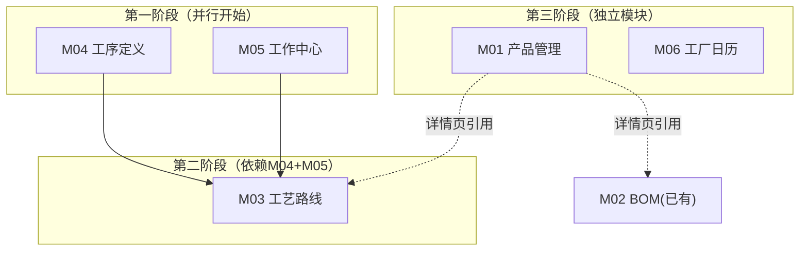

# 基础数据模块编码计划

> **文档目的**：为 M01（产品管理）/ M03（工艺路线）/ M04（工序定义）/ M05（工作中心）/ M06（工厂日历）的全栈编码提供详细设计依据
> **对应规格**：product-functional-specification.md（第3章）
> **前端交互**：frontend-page-map.md（4.3节）
> **参照实现**：M02 BOM 管理（api/bom.py, services/bom_service.py, repositories/bom_repo.py）
> **实施顺序**：M04 → M05 → M03 → M01 → M06

---

## 全局约定

### 后端

| 项目 | 约定 |
|:-----|:------|
| 模型文件 | `backend/app/models/basic_data.py`（新建，与 production.py 分离）|
| Schema 文件 | `backend/app/schemas/basic_data.py`（新建）|
| Repository | 继承 `MultiTenantRepository`，base 路径 `backend/app/repositories/base.py` |
| Service | 与 BOM 风格一致：`__init__(self, repo: RepoClass)` |
| API 路由 | `backend/app/api/basic_data.py`（新建，可拆分子文件）|
| API 前缀 | `/api/v1/products`, `/api/v1/operations`, `/api/v1/work-centers`, `/api/v1/routes`, `/api/v1/calendars` |
| 分页参数 | `page`(default=1), `page_size`(default=20, max=100) |
| 响应格式 | `{"code": 0, "message": "...", "data": ...}` |
| JSON 字段 | 用 `TEXT` 存储（SQLite 兼容），Service 层做 `json.dumps`/`json.loads` |
| 多租户 | Repository 继承 `MultiTenantRepository`，自动 `tenant_id` 行级隔离 |
| 用户上下文 | API 层通过 `get_current_user` 获取，手动传入 `tenant_id` 给 Service |

### 前端

| 项目 | 约定 |
|:-----|:------|
| 目录 | `frontend/src/pages/basics/`（新建）|
| 技术栈 | Vue 3 + TypeScript + Vite + Tailwind + Vant |
| 代码风格 | 参照 `BomList.vue`：`<script setup lang="ts">`, `ref`, `onMounted`, 全局 API 函数 `get/post/put/del` |
| 路由 | 注册在 `frontend/src/router/` 中，路径见各模块 |
| API 调用 | `import { get, post, put, del } from '@/api/client'` |

---

## 一、M04 工序定义（Operation Definition）

**优先级**：P0（无依赖，M03 的前置模块）  
**核心数据表**：`operations`

### 1.1 模型设计（`models/basic_data.py` 新增）

```python
# ── M04 工序定义 ────────────────────────────────────────────────

class Operation(Base):
    """工序定义表"""
    __tablename__ = "operations"

    id            = Column(BigInteger, primary_key=True, autoincrement=True)
    tenant_id     = Column(String(50), nullable=False, comment="租户ID")
    code          = Column(String(100), nullable=False, comment="工序编码")
    name          = Column(String(200), nullable=False, comment="工序名称")
    op_type       = Column(String(50), nullable=False, comment="工序类型: machining/assembly/heat_treat/surface_treat/inspect/pack/reaction/blend/separation/filling/transport")
    setup_time    = Column(Float, default=0, comment="准备时间(分钟)")
    unit_time     = Column(Float, default=0, comment="单件加工时间(分钟/件)")
    labor_cert    = Column(Text, comment="人员资质要求(JSON): [{cert_type, cert_level, min_count}]")
    equip_req     = Column(Text, comment="设备能力要求(JSON): [{equip_type, capability, count}]")
    material_reqs = Column(Text, comment="物料要求(JSON): [{material_type, spec}]")
    sop_refs      = Column(Text, comment="作业标准/法(JSON): [{sop_code, sop_name, doc_url}]")
    env_req       = Column(Text, comment="环境要求(JSON): {temp_min, temp_max, humidity_min, humidity_max, clean_level}")
    remark        = Column(Text, comment="备注")
    is_active     = Column(Boolean, default=True, comment="启用状态")
    created_at    = Column(DateTime(timezone=True), server_default=func.now())
    updated_at    = Column(DateTime(timezone=True), server_default=func.now(), onupdate=func.now())
```

**NOT NULL 约束**：`tenant_id`, `code`, `name`, `op_type`

### 1.2 Repository（`repositories/operation_repo.py`）

| 方法 | 说明 | SQL 概要 |
|:-----|:------|:---------|
| `list_ops(page, page_size, keyword, op_type)` | 分页列表 + 模糊搜索 + 类型过滤 | `SELECT * FROM operations WHERE name LIKE :kw OR code LIKE :kw` |
| `get_op(id)` | 按 ID 查询 | `SELECT * FROM operations WHERE id = :id` |
| `create_op(data)` | 新增 | `INSERT INTO operations (...) VALUES (...)` |
| `update_op(id, data)` | 更新（`_build_set_clause`） | `UPDATE operations SET ... WHERE id = :id` |
| `delete_op(id)` | 删除 | `DELETE FROM operations WHERE id = :id` |
| `get_op_by_code(code)` | 编码唯一校验 | `SELECT id FROM operations WHERE code = :code` |
| `get_referenced_routes(op_id)` | 引用查询 | `SELECT rs.*, pr.name as route_name FROM route_steps rs JOIN process_routes pr ON rs.route_id = pr.id WHERE rs.operation_id = :op_id` |
| `count_references(op_id)` | 引用计数 | `SELECT COUNT(*) FROM route_steps WHERE operation_id = :op_id` |

### 1.3 Service（`services/operation_service.py`）

| 方法 | 说明 |
|:-----|:------|
| `list(page, page_size, keyword, op_type)` | 委托 repo.list_ops |
| `get(id)` | 委托 repo.get_op |
| `create(data)` | 编码唯一校验 → JSON 字段序列化 → repo.create_op |
| `update(id, data)` | JSON 字段序列化 → repo.update_op |
| `delete(id)` | 检查引用计数 → 引用>0 时抛出异常 → 委托删除 |
| `get_references(id)` | 委托 repo.get_referenced_routes |

### 1.4 API 路由（`api/basic_data.py`）

| 路径 | 方法 | 说明 |
|:-----|:-----|:------|
| `/api/v1/operations` | GET | 分页列表（keyword, op_type, page, page_size）|
| `/api/v1/operations` | POST | 创建工序（require_auth: 仅 admin, process_eng）|
| `/api/v1/operations/{id}` | GET | 详情 |
| `/api/v1/operations/{id}` | PUT | 编辑 |
| `/api/v1/operations/{id}` | DELETE | 删除（有引用时禁止）|
| `/api/v1/operations/{id}/references` | GET | 引用查询 → 被哪些工艺路线引用 |

### 1.5 前端（`pages/basics/OperationList.vue`）

| 项目 | 内容 |
|:-----|:------|
| 路由 | `/basics/operations` |
| 入口文件 | `OperationList.vue`（主页面）+ `OperationDialog.vue`（创建/编辑弹窗）|
| 页面布局 | 顶部搜索栏 + 类型下拉筛选 + 视图切换（卡片/列表） + 操作按钮 |
| 交互 | ① 列表/卡片视图展示工序 ② 点击行 → 右侧滑出详情面板 ③ 编码唯一校验 |
| 分页 | Vant 列表滚动加载 |

### 1.6 预估工作量

| 层 | 文件 | 预估行数 | 工时 |
|:---|:-----|:--------:|:----:|
| 模型 | `models/basic_data.py`（Operations 部分） | 30 | 0.5h |
| Schema | `schemas/basic_data.py`（OperationCreate/Update/Response） | 60 | 0.5h |
| Repository | `repositories/operation_repo.py` | 100 | 1.5h |
| Service | `services/operation_service.py` | 80 | 1h |
| API | `api/basic_data.py`（operations 部分） | 100 | 1h |
| 前端 | `pages/basics/OperationList.vue` + `OperationDialog.vue` | 350 | 4h |
| **合计** | | **~720** | **~8.5h** |

---

## 二、M05 工作中心（Work Center）

**优先级**：P0（M03 的前置模块）  
**核心数据表**：`work_centers`, `wc_equipments`, `wc_teams`

### 2.1 模型设计（`models/basic_data.py` 新增）

```python
# ── M05 工作中心 ────────────────────────────────────────────────

class WorkCenter(Base):
    """工作中心表"""
    __tablename__ = "work_centers"

    id              = Column(BigInteger, primary_key=True, autoincrement=True)
    tenant_id       = Column(String(50), nullable=False, comment="租户ID")
    code            = Column(String(100), nullable=False, comment="工作中心编码")
    name            = Column(String(200), nullable=False, comment="工作中心名称")
    wc_type         = Column(String(50), nullable=False, comment="类型: production_line/work_cell/workstation")
    org_id          = Column(BigInteger, comment="所属组织ID")
    efficiency      = Column(Float, default=0.85, comment="效率因子(0~1)")
    equipment_count = Column(Integer, default=0, comment="设备数")
    labor_count     = Column(Integer, default=0, comment="人员数")
    capacity_per_shift = Column(Float, comment="每班产能(件)")
    is_esd          = Column(Boolean, default=False, comment="ESD静电防护标识")
    shift_config    = Column(Text, comment="班次配置(JSON): [{shift_name, start_time, end_time, hours}]")
    calendar_override = Column(Text, comment="工作日历覆盖(JSON): {weekend_days, work_days_override}")
    description     = Column(Text, comment="描述")
    is_active       = Column(Boolean, default=True, comment="启用状态")
    created_at      = Column(DateTime(timezone=True), server_default=func.now())
    updated_at      = Column(DateTime(timezone=True), server_default=func.now(), onupdate=func.now())


class WcEquipment(Base):
    """工作中心关联设备表"""
    __tablename__ = "wc_equipments"

    id            = Column(BigInteger, primary_key=True, autoincrement=True)
    tenant_id     = Column(String(50), nullable=False, comment="租户ID")
    wc_id         = Column(BigInteger, nullable=False, comment="工作中心ID")
    equip_id      = Column(BigInteger, nullable=False, comment="设备ID")
    is_primary    = Column(Boolean, default=False, comment="是否主设备")
    capability_params = Column(Text, comment="能力参数(JSON)")
    created_at    = Column(DateTime(timezone=True), server_default=func.now())


class WcTeam(Base):
    """工作中心关联班组表"""
    __tablename__ = "wc_teams"

    id         = Column(BigInteger, primary_key=True, autoincrement=True)
    tenant_id  = Column(String(50), nullable=False, comment="租户ID")
    wc_id      = Column(BigInteger, nullable=False, comment="工作中心ID")
    team_name  = Column(String(200), nullable=False, comment="班组名称")
    leader_id  = Column(BigInteger, comment="班组长用户ID")
    member_ids = Column(Text, comment="成员用户ID列表(JSON)")
    team_type  = Column(String(50), default="regular", comment="班组类型: regular/rotating/shift")
    is_active  = Column(Boolean, default=True, comment="启用状态")
    created_at = Column(DateTime(timezone=True), server_default=func.now())
    updated_at = Column(DateTime(timezone=True), server_default=func.now(), onupdate=func.now())
```

**NOT NULL 约束**：WorkCenter → `tenant_id`, `code`, `name`, `wc_type`；WcEquipment → `tenant_id`, `wc_id`, `equip_id`；WcTeam → `tenant_id`, `wc_id`, `team_name`

### 2.2 Repository（`repositories/work_center_repo.py`）

| 方法 | 说明 |
|:-----|:------|
| `list_wcs(page, page_size, keyword, wc_type, org_id)` | 分页列表 + 搜索 + 筛选 |
| `get_wc(id)` | 详情 |
| `create_wc(data)` | 新增工作中心 |
| `update_wc(id, data)` | 更新工作中心 |
| `delete_wc(id)` | 删除（关联设备/班组时禁止）|
| `get_wc_by_code(code)` | 编码唯一校验 |
| `list_equipments(wc_id)` | 关联设备列表 |
| `add_equipment(data)` | 添加关联设备 |
| `remove_equipment(id)` | 移除关联设备 |
| `list_teams(wc_id)` | 关联班组列表 |
| `create_team(data)` | 添加班组 |
| `update_team(id, data)` | 编辑班组 |
| `delete_team(id)` | 删除班组 |

### 2.3 Service（`services/work_center_service.py`）

| 方法 | 说明 |
|:-----|:------|
| `list(page, page_size, keyword, wc_type, org_id)` | 委托 repo |
| `get(id)` | 获取详情 + JSON 字段反序列化 |
| `create(data)` | 编码校验 + JSON 序列化 |
| `update(id, data)` | JSON 序列化 |
| `delete(id)` | 检查引用 → route_steps 中引用该工作中心的禁止删除 |
| `list_equipments(wc_id)` | 委托 repo |
| `add_equipment(wc_id, equip_id, ...)` | 追加设备 |
| `remove_equipment(id)` | 移除设备 |
| `list_teams(wc_id)` | 委托 repo |
| `create_team(data)` | 新增班组 |
| `update_team(id, data)` | 更新班组 |
| `delete_team(id)` | 删除班组 |

### 2.4 API 路由（`api/basic_data.py`）

| 路径 | 方法 | 说明 |
|:-----|:-----|:------|
| `/api/v1/work-centers` | GET | 分页列表 |
| `/api/v1/work-centers` | POST | 创建工作中心 |
| `/api/v1/work-centers/{id}` | GET | 详情 |
| `/api/v1/work-centers/{id}` | PUT | 编辑 |
| `/api/v1/work-centers/{id}` | DELETE | 删除 |
| `/api/v1/work-centers/{id}/equipments` | GET | 关联设备列表 |
| `/api/v1/work-centers/{id}/equipments` | POST | 添加关联设备 |
| `/api/v1/work-centers/{id}/equipments/{eq_id}` | DELETE | 移除关联设备 |
| `/api/v1/work-centers/{id}/teams` | GET | 关联班组列表 |
| `/api/v1/work-centers/{id}/teams` | POST | 添加班组 |
| `/api/v1/work-centers/{id}/teams/{team_id}` | PUT | 编辑班组 |
| `/api/v1/work-centers/{id}/teams/{team_id}` | DELETE | 删除班组 |

### 2.5 前端

| 页面 | 路由 | 文件 | 交互概要 |
|:-----|:-----|:-----|:---------|
| 工作中心列表 | `/basics/work-centers` | `WorkCenterList.vue` | 左侧组织树筛选 + 右侧列表；搜索/筛选/创建/编辑/删除 |
| 工作中心详情 | `/basics/work-centers/:id` | `WorkCenterDetail.vue` | 3个页签：设备列表 / 班组列表 / 产能日历 |
| 创建/编辑弹窗 | — | `WorkCenterDialog.vue` | 编码/名称/类型/效率因子/ESD标识/班次配置/描述 |

### 2.6 预估工作量

| 层 | 文件 | 预估行数 | 工时 |
|:---|:-----|:--------:|:----:|
| 模型 | `models/basic_data.py`（WorkCenter 系列） | 60 | 1h |
| Schema | `schemas/basic_data.py`（WorkCenter/WcEquip/WcTeam 相关） | 120 | 1.5h |
| Repository | `repositories/work_center_repo.py` | 180 | 2.5h |
| Service | `services/work_center_service.py` | 150 | 2h |
| API | `api/basic_data.py`（work-centers 部分） | 180 | 2h |
| 前端 | `WorkCenterList.vue` + `WorkCenterDetail.vue` + `WorkCenterDialog.vue` | 600 | 8h |
| **合计** | | **~1290** | **~17h** |

---

## 三、M03 工艺路线（Process Route）

**优先级**：P1（依赖 M04 + M05 完成后开始）  
**核心数据表**：`process_routes`, `route_steps`, `product_routes`

> **注意**：现有 `production.py` 中的 `RouteStep` 表（第94-109行）与 M03 的设计不兼容——它使用 `product_id` 直接关联产品且缺少版本/状态管理等关键字段。以下设计将新建模型替代原有 RouteStep。

### 3.1 模型设计（`models/basic_data.py` 新增）

```python
# ── M03 工艺路线 ────────────────────────────────────────────────

class ProcessRoute(Base):
    """工艺路线主表"""
    __tablename__ = "process_routes"

    id              = Column(BigInteger, primary_key=True, autoincrement=True)
    tenant_id       = Column(String(50), nullable=False, comment="租户ID")
    code            = Column(String(100), nullable=False, comment="路线编码")
    name            = Column(String(200), nullable=False, comment="路线名称")
    version         = Column(Integer, default=1, comment="版本号")
    status          = Column(String(20), default="draft", comment="状态: draft/published/archived")
    source_route_id = Column(BigInteger, comment="源路线ID(复制创建时)")
    route_type      = Column(String(20), default="discrete", comment="路线类型: discrete(离散)/process(流程)")
    effective_from  = Column(Date, comment="生效日期")
    effective_to    = Column(Date, comment="失效日期")
    description     = Column(Text, comment="描述")
    created_by      = Column(BigInteger, comment="创建人ID")
    created_at      = Column(DateTime(timezone=True), server_default=func.now())
    updated_at      = Column(DateTime(timezone=True), server_default=func.now(), onupdate=func.now())
    published_at    = Column(DateTime(timezone=True), comment="发布时间")
    archived_at     = Column(DateTime(timezone=True), comment="归档时间")


class RouteStep(Base):
    """工艺路线工序步骤表"""
    __tablename__ = "route_steps"

    id                = Column(BigInteger, primary_key=True, autoincrement=True)
    tenant_id         = Column(String(50), nullable=False, comment="租户ID")
    route_id          = Column(BigInteger, nullable=False, comment="工艺路线ID")
    operation_id      = Column(BigInteger, nullable=False, comment="工序ID(引用operations.id)")
    step_name         = Column(String(200), comment="步骤名称(可覆盖工序名称)")
    step_seq          = Column(Integer, nullable=False, comment="步骤序号")
    step_type         = Column(String(20), default="production", comment="步骤类型: production/inspect/outsource")
    wc_id             = Column(BigInteger, comment="执行工作中心ID(引用work_centers.id)")
    setup_time_override   = Column(Float, comment="准备时间覆盖(分钟)")
    unit_time_override    = Column(Float, comment="单件加工时间覆盖(分钟)")
    is_parallel_eligible  = Column(Boolean, default=False, comment="是否允许并行")
    is_outsource          = Column(Boolean, default=False, comment="是否为外协工序")
    next_step_seq         = Column(Integer, comment="下一工序序号(串行) / 空表示末工序")
    parallel_group        = Column(String(50), comment="并行组标识(同组工序可并行执行)")
    remark                = Column(Text, comment="备注")
    created_at            = Column(DateTime(timezone=True), server_default=func.now())
    updated_at            = Column(DateTime(timezone=True), server_default=func.now(), onupdate=func.now())


class ProductRoute(Base):
    """产品-工艺路线关联表"""
    __tablename__ = "product_routes"

    id              = Column(BigInteger, primary_key=True, autoincrement=True)
    tenant_id       = Column(String(50), nullable=False, comment="租户ID")
    product_id      = Column(BigInteger, nullable=False, comment="产品ID")
    route_id        = Column(BigInteger, nullable=False, comment="工艺路线ID")
    is_default      = Column(Boolean, default=False, comment="是否为默认路线")
    effective_from  = Column(Date, comment="关联生效日期")
    effective_to    = Column(Date, comment="关联失效日期")
    created_at      = Column(DateTime(timezone=True), server_default=func.now())
```

**NOT NULL 约束**：ProcessRoute → `tenant_id`, `code`, `name`, `version`；RouteStep → `tenant_id`, `route_id`, `operation_id`, `step_seq`；ProductRoute → `tenant_id`, `product_id`, `route_id`

**迁移说明**：原 `production.py` 中的 `RouteStep` 模型（第94-109行）将被新的 `RouteStep` 替代。旧模型使用 `product_id` 直接关联产品，新模型通过 `route_id` 关联工艺路线主表，再由 `product_routes` 关联产品。

### 3.2 Repository（`repositories/route_repo.py`）

| 方法 | 说明 |
|:-----|:------|
| `list_routes(page, page_size, keyword, status)` | 工艺路线分页列表 |
| `get_route(id)` | 详细（含关联产品数统计）|
| `create_route(data)` | 新建 |
| `update_route(id, data)` | 更新 |
| `delete_route(id)` | 删除（仅草稿、无产品关联）|
| `get_route_by_code(code)` | 编码唯一校验 |
| `list_steps(route_id)` | 按 step_seq 排序获取步骤列表 |
| `create_step(data)` | 新增步骤 |
| `update_step(id, data)` | 更新步骤 |
| `delete_step(id)` | 删除步骤 |
| `batch_update_steps(route_id, steps)` | 批量更新步骤顺序（工序编排保存）|
| `get_max_seq(route_id)` | 获取当前最大序号 |
| `list_product_routes(product_id)` | 产品关联路线列表 |
| `create_product_route(data)` | 关联产品 |
| `delete_product_route(id)` | 解除关联 |
| `set_default_route(product_id, route_id)` | 设为默认 |
| `get_versions(route_code)` | 获取该路线所有版本 |
| `clone_route(source_id, new_data)` | 复制路线（含步骤）|

### 3.3 Service（`services/route_service.py`）

| 方法 | 说明 |
|:-----|:------|
| `list(page, page_size, keyword, status)` | 列表 |
| `get(id)` | 详情 + 关联产品列表 + 步骤列表 |
| `create(data)` | 编码校验 + 版本号处理 + 创建 |
| `clone(source_id, new_data)` | 从源路线复制 |
| `update(id, data)` | 仅草稿状态可编辑 |
| `delete(id)` | 仅草稿状态、无产品关联 |
| `publish(id)` | 状态变更为 published + 校验步骤完整性 |
| `archive(id)` | 状态变更为 archived |
| `list_steps(route_id)` | 获取步骤序列 |
| `save_steps(route_id, steps)` | 批量保存步骤（工序编排保存）|
| `add_step(route_id, data)` | 追加步骤 |
| `remove_step(step_id)` | 删除步骤 |
| `reorder_steps(route_id, step_ids)` | 拖拽排序 |
| `list_product_routes(product_id)` | 产品关联查询 |
| `link_product(product_id, route_id, ...)` | 关联产品 |
| `unlink_product(product_id, route_id)` | 解除关联 |
| `set_default(product_id, route_id)` | 设为默认路线 |
| `compare_versions(v1_id, v2_id)` | 版本差异对比 |

### 3.4 API 路由（`api/basic_data.py`）

| 路径 | 方法 | 说明 |
|:-----|:-----|:------|
| `/api/v1/routes` | GET | 分页列表 |
| `/api/v1/routes` | POST | 创建 |
| `/api/v1/routes/clone` | POST | 从已有路线复制 |
| `/api/v1/routes/{id}` | GET | 详情（含步骤）|
| `/api/v1/routes/{id}` | PUT | 编辑基本信息 |
| `/api/v1/routes/{id}` | DELETE | 删除 |
| `/api/v1/routes/{id}/publish` | POST | 发布 |
| `/api/v1/routes/{id}/archive` | POST | 归档 |
| `/api/v1/routes/{id}/steps` | GET | 步骤列表 |
| `/api/v1/routes/{id}/steps` | POST | 新增步骤 |
| `/api/v1/routes/{id}/steps/batch` | PUT | 批量保存步骤 |
| `/api/v1/routes/{id}/steps/reorder` | PUT | 拖拽排序 |
| `/api/v1/routes/{id}/steps/{step_id}` | PUT | 编辑步骤 |
| `/api/v1/routes/{id}/steps/{step_id}` | DELETE | 删除步骤 |
| `/api/v1/routes/{id}/versions` | GET | 版本历史 |
| `/api/v1/routes/{id}/compare` | GET | 版本对比(?v1= &v2=) |
| `/api/v1/routes/{id}/products` | GET | 关联产品列表 |
| `/api/v1/routes/{id}/products` | POST | 关联产品 |
| `/api/v1/routes/{id}/products/{pr_id}` | DELETE | 解除关联 |
| `/api/v1/routes/{id}/products/{pr_id}/default` | PUT | 设为默认路线 |

### 3.5 前端

| 页面 | 路由 | 文件 | 交互概要 |
|:-----|:-----|:-----|:---------|
| 工艺路线列表 | `/basics/routes` | `RouteList.vue` | 搜索/筛选/创建按钮；表格展示编码/名称/版本/状态/关联产品数 |
| 创建工艺路线 | `/basics/routes/create` | `RouteCreate.vue` | 基础信息区 + 工序编排画布（左侧工序库面板 + 中间画布 + 右侧属性面板）|
| 工艺路线详情 | `/basics/routes/:id` | `RouteDetail.vue` | 3个页签：路线图 / 版本对比 / 关联产品 |
| 工序编排画布 | — | `StepCanvas.vue`（嵌入 RouteCreate/RouteEdit）| 拖拽放置 + 拖拽排序 + 连线 + 缩放平移；属性编辑面板 |

### 3.6 预估工作量

| 层 | 文件 | 预估行数 | 工时 |
|:---|:-----|:--------:|:----:|
| 模型 | `models/basic_data.py`（ProcessRoute/RouteStep/ProductRoute） | 70 | 1.5h |
| Schema | `schemas/basic_data.py`（Route 系列） | 150 | 2h |
| Repository | `repositories/route_repo.py` | 300 | 4h |
| Service | `services/route_service.py` | 250 | 3.5h |
| API | `api/basic_data.py`（routes 部分） | 250 | 3h |
| 前端 | `RouteList.vue` + `RouteCreate.vue` + `RouteDetail.vue` + `StepCanvas.vue` | 1200 | 16h |
| **合计** | | **~2220** | **~30h** |

---

## 四、M01 产品管理（Product Management）

**优先级**：P2（业务独立，但详情页集成 BOM 和工艺路线）  
**核心数据表**：`products`, `product_versions`

### 4.1 模型设计（`models/basic_data.py` 新增）

```python
# ── M01 产品管理 ────────────────────────────────────────────────

class Product(Base):
    """产品主数据表"""
    __tablename__ = "products"

    id              = Column(BigInteger, primary_key=True, autoincrement=True)
    tenant_id       = Column(String(50), nullable=False, comment="租户ID")
    code            = Column(String(100), nullable=False, comment="产品编码")
    name            = Column(String(200), nullable=False, comment="产品名称")
    spec            = Column(String(200), comment="规格型号")
    unit            = Column(String(20), nullable=False, comment="单位: 个/件/套/Kg/m")
    product_type    = Column(String(50), nullable=False, comment="产品类型: final(成品)/semi(半成品)/raw(原材料)")
    category        = Column(String(100), comment="产品分类")
    weight          = Column(Float, comment="重量(kg)")
    drawing_url     = Column(Text, comment="图纸附件URL(JSON数组)")
    is_active       = Column(Boolean, default=True, comment="启用状态")
    remark          = Column(Text, comment="备注")
    created_at      = Column(DateTime(timezone=True), server_default=func.now())
    updated_at      = Column(DateTime(timezone=True), server_default=func.now(), onupdate=func.now())


class ProductVersion(Base):
    """产品版本表（M01-06 版本管理）"""
    __tablename__ = "product_versions"

    id              = Column(BigInteger, primary_key=True, autoincrement=True)
    tenant_id       = Column(String(50), nullable=False, comment="租户ID")
    product_id      = Column(BigInteger, nullable=False, comment="产品ID")
    version_label   = Column(String(50), nullable=False, comment="版本标签 e.g. V1.0")
    status          = Column(String(20), default="draft", comment="状态: draft/published/archived")
    effective_from  = Column(Date, comment="生效日期")
    effective_to    = Column(Date, comment="失效日期")
    description     = Column(Text, comment="版本描述")
    created_by      = Column(BigInteger, comment="创建人ID")
    created_at      = Column(DateTime(timezone=True), server_default=func.now())
    published_at    = Column(DateTime(timezone=True), comment="发布时间")
```

**NOT NULL 约束**：Product → `tenant_id`, `code`, `name`, `unit`, `product_type`；ProductVersion → `tenant_id`, `product_id`, `version_label`

### 4.2 Repository（`repositories/product_repo.py`）

| 方法 | 说明 |
|:-----|:------|
| `list_products(page, page_size, keyword, product_type, category, is_active)` | 分页列表 |
| `get_product(id)` | 详情 |
| `create_product(data)` | 新增 |
| `update_product(id, data)` | 更新 |
| `delete_product(id)` | 删除（有工单引用禁止）|
| `get_product_by_code(code)` | 编码唯一校验 |
| `count_work_orders(product_id)` | 关联工单计数 |
| `list_versions(product_id)` | 版本列表 |
| `create_version(data)` | 新增版本 |
| `update_version(id, data)` | 更新版本 |
| `publish_version(id)` | 发布版本 |
| `get_active_version(product_id, date)` | 获取当前生效版本 |

### 4.3 Service（`services/product_service.py`）

| 方法 | 说明 |
|:-----|:------|
| `list(page, page_size, keyword, product_type, category, is_active)` | 列表 |
| `get(id)` | 详情 |
| `create(data)` | 编码唯一校验 |
| `update(id, data)` | 更新 |
| `delete(id)` | 工单引用检查 |
| `list_versions(product_id)` | 版本列表 |
| `create_version(data)` | 新建版本（自动从上一版本复制BOM/路线关联）|
| `update_version(id, data)` | 更新版本状态/日期 |
| `publish_version(id)` | 发布版本 |
| `get_active_version(product_id, date)` | 获取生效版本 |

### 4.4 API 路由（`api/basic_data.py`）

| 路径 | 方法 | 说明 |
|:-----|:-----|:------|
| `/api/v1/products` | GET | 分页列表 |
| `/api/v1/products` | POST | 创建 |
| `/api/v1/products/{id}` | GET | 详情 |
| `/api/v1/products/{id}` | PUT | 编辑 |
| `/api/v1/products/{id}` | DELETE | 删除 |
| `/api/v1/products/{id}/versions` | GET | 版本列表 |
| `/api/v1/products/{id}/versions` | POST | 新增版本 |
| `/api/v1/products/{id}/versions/{ver_id}` | PUT | 更新版本 |
| `/api/v1/products/{id}/versions/{ver_id}/publish` | POST | 发布版本 |
| `/api/v1/products/{id}/boms` | GET | BOM清单（调用M02 API）|
| `/api/v1/products/{id}/routes` | GET | 关联工艺路线（调用M03 API）|
| `/api/v1/products/{id}/work-orders` | GET | 关联工单 |
| `/api/v1/products/{id}/inventory` | GET | 库存概览（调用WMS API）|

### 4.5 前端

| 页面 | 路由 | 文件 | 交互概要 |
|:-----|:-----|:-----|:---------|
| 产品列表 | `/basics/products` | `ProductList.vue` | 搜索/筛选/创建按钮；表格展示 |
| 创建/编辑弹窗 | — | `ProductDialog.vue` | 编码/名称/规格/单位/类型/分类/重量/图纸附件/备注 |
| 产品详情 | `/basics/products/:id` | `ProductDetail.vue` | 5个页签：基本信息 / BOM清单 / 工艺路线 / 关联工单 / 库存概览 |

### 4.6 预估工作量

| 层 | 文件 | 预估行数 | 工时 |
|:---|:-----|:--------:|:----:|
| 模型 | `models/basic_data.py`（Product/ProductVersion） | 45 | 1h |
| Schema | `schemas/basic_data.py`（Product 系列） | 100 | 1.5h |
| Repository | `repositories/product_repo.py` | 150 | 2h |
| Service | `services/product_service.py` | 120 | 1.5h |
| API | `api/basic_data.py`（products 部分） | 150 | 2h |
| 前端 | `ProductList.vue` + `ProductDetail.vue` + `ProductDialog.vue` | 500 | 7h |
| **合计** | | **~1065** | **~15h** |

---

## 五、M06 工厂日历（Factory Calendar）

**优先级**：P2（业务独立，排产模块依赖）  
**核心数据表**：`factory_calendars`

### 5.1 模型设计（`models/basic_data.py` 新增）

```python
# ── M06 工厂日历 ────────────────────────────────────────────────

class FactoryCalendar(Base):
    """工厂日历表"""
    __tablename__ = "factory_calendars"

    id            = Column(BigInteger, primary_key=True, autoincrement=True)
    tenant_id     = Column(String(50), nullable=False, comment="租户ID")
    year          = Column(Integer, nullable=False, comment="年份")
    cal_date      = Column(Date, nullable=False, comment="日期")
    day_type      = Column(String(20), nullable=False, comment="类型: workday/rest/holiday/adjust_work/adjust_rest")
    name          = Column(String(200), comment="名称(如'国庆节')")
    is_system     = Column(Boolean, default=False, comment="是否系统预设(周末规则)")
    weekday       = Column(Integer, comment="星期几(1~7, 1=周一)")
    created_at    = Column(DateTime(timezone=True), server_default=func.now())
    updated_at    = Column(DateTime(timezone=True), server_default=func.now(), onupdate=func.now())
```

**索引建议**：`(tenant_id, year, cal_date)` 组合唯一索引
**NOT NULL 约束**：`tenant_id`, `year`, `cal_date`, `day_type`  
**业务规则**：每个租户每年约365条记录；日历规则是：工作中心覆盖 > 调休/加班规则 > 默认周末规则

### 5.2 Repository（`repositories/calendar_repo.py`）

| 方法 | 说明 |
|:-----|:------|
| `list_calendar(year, month, page, page_size)` | 年份/月份日历数据 |
| `get_calendar(date)` | 单日查询 |
| `create_or_update(data)` | 插入或更新单日记录 |
| `batch_create(records)` | 批量导入（年度初始化/节假日批量设置）|
| `delete(id)` | 删除单条 |
| `clear_year(year)` | 清空某年数据（重新初始化）|
| `get_workday_count(year, month)` | 统计某月工作日数 |
| `is_workday(date)` | 判断是否为工作日 |

### 5.3 Service（`services/calendar_service.py`）

| 方法 | 说明 |
|:-----|:------|
| `get_year_view(year)` | 全年日历年视图数据（12个月）|
| `get_month_view(year, month)` | 月视图 |
| `init_year(year)` | 按默认周末规则初始化全年日历 |
| `set_holiday(date, name)` | 设为节假日 |
| `set_adjust_work(date, name)` | 设为调休上班日 |
| `set_adjust_rest(date, name)` | 设为调休放假日 |
| `batch_set_holidays(dates, name)` | 批量设置节假日 |
| `reset_to_default(date)` | 重置为默认规则 |
| `is_workday(date)` | 供排产模块调用（后续集成）|
| `import_excel(file)` | 导入Excel |
| `export_excel(year)` | 导出Excel |

### 5.4 API 路由（`api/basic_data.py`）

| 路径 | 方法 | 说明 |
|:-----|:-----|:------|
| `/api/v1/calendars/{year}` | GET | 全年日历视图 |
| `/api/v1/calendars/{year}/{month}` | GET | 月视图 |
| `/api/v1/calendars` | POST | 设置单日类型 |
| `/api/v1/calendars/batch` | POST | 批量设置 |
| `/api/v1/calendars/init/{year}` | POST | 初始化全年 |
| `/api/v1/calendars/{id}` | DELETE | 删除单条 |
| `/api/v1/calendars/workday/{date}` | GET | 判断是否为工作日 |
| `/api/v1/calendars/export/{year}` | GET | 导出Excel |
| `/api/v1/calendars/import` | POST | 导入Excel |

### 5.5 前端（`pages/basics/CalendarView.vue`）

| 项目 | 内容 |
|:-----|:------|
| 路由 | `/basics/calendar` |
| 入口文件 | `CalendarView.vue` |
| 页面布局 | 年份切换器 + 年度日历网格（12个月）|
| 交互 | ① 左右箭头 + 下拉切换年份 ② 颜色编码：绿色(工作日)/红色(休息日)/橙色(调休上班)/蓝色(调休放假) ③ 点击日期 → 弹窗设置类型 ④ 导入/导出按钮 |
| 节假日配置弹窗 | 选择日期 + 类型下拉 + 名称输入 + 批量范围选择 |

### 5.6 预估工作量

| 层 | 文件 | 预估行数 | 工时 |
|:---|:-----|:--------:|:----:|
| 模型 | `models/basic_data.py`（FactoryCalendar） | 20 | 0.5h |
| Schema | `schemas/basic_data.py`（Calendar 系列） | 50 | 0.5h |
| Repository | `repositories/calendar_repo.py` | 120 | 1.5h |
| Service | `services/calendar_service.py` | 100 | 1h |
| API | `api/basic_data.py`（calendars 部分） | 100 | 1h |
| 前端 | `CalendarView.vue` | 300 | 4h |
| **合计** | | **~690** | **~8.5h** |

---

## 六、依赖关系与实施顺序图



## 七、总量估算

| 模块 | 后端行数 | 前端行数 | 合计行数 | 预估工时 |
|:----:|:--------:|:--------:|:--------:|:--------:|
| M04 工序定义 | 280 | 350 | 630 | 8.5h |
| M05 工作中心 | 390 | 600 | 990 | 17h |
| M03 工艺路线 | 600 | 1200 | 1800 | 30h |
| M01 产品管理 | 315 | 500 | 815 | 15h |
| M06 工厂日历 | 240 | 300 | 540 | 8.5h |
| **合计** | **~1825** | **~2950** | **~4775** | **~79h** |

## 八、公共文件清单

### 8.1 后端新建文件

| 文件路径 | 内容 |
|:---------|:------|
| `backend/app/models/basic_data.py` | 全部5个模块的 ORM 模型 |
| `backend/app/schemas/basic_data.py` | 全部5个模块的 Pydantic schema |
| `backend/app/repositories/operation_repo.py` | M04 Repository |
| `backend/app/repositories/work_center_repo.py` | M05 Repository（含 WcEquipment/WcTeam）|
| `backend/app/repositories/route_repo.py` | M03 Repository（含 RouteStep/ProductRoute）|
| `backend/app/repositories/product_repo.py` | M01 Repository（含 ProductVersion）|
| `backend/app/repositories/calendar_repo.py` | M06 Repository |
| `backend/app/services/operation_service.py` | M04 Service |
| `backend/app/services/work_center_service.py` | M05 Service |
| `backend/app/services/route_service.py` | M03 Service |
| `backend/app/services/product_service.py` | M01 Service |
| `backend/app/services/calendar_service.py` | M06 Service |
| `backend/app/api/basic_data.py` | 全部5个模块的 API 路由组 |

### 8.2 后端修改文件

| 文件路径 | 修改内容 |
|:---------|:---------|
| `backend/app/models/production.py` | 移除旧 `RouteStep` 模型（第94-109行），迁移到 `basic_data.py` |
| `backend/app/__init__.py` 或 `main.py` | 注册 `router_basic_data` 到 FastAPI app |
| `backend/app/repositories/base.py` | 无需修改 |

### 8.3 前端新建文件

| 文件路径 | 内容 |
|:---------|:------|
| `frontend/src/pages/basics/OperationList.vue` | M04 列表页 |
| `frontend/src/pages/basics/OperationDialog.vue` | M04 创建/编辑弹窗 |
| `frontend/src/pages/basics/WorkCenterList.vue` | M05 列表页 |
| `frontend/src/pages/basics/WorkCenterDetail.vue` | M05 详情页（3个页签）|
| `frontend/src/pages/basics/WorkCenterDialog.vue` | M05 创建/编辑弹窗 |
| `frontend/src/pages/basics/RouteList.vue` | M03 列表页 |
| `frontend/src/pages/basics/RouteCreate.vue` | M03 创建页（工序编排画布）|
| `frontend/src/pages/basics/RouteDetail.vue` | M03 详情页（3个页签）|
| `frontend/src/pages/basics/StepCanvas.vue` | M03 工序编排画布组件 |
| `frontend/src/pages/basics/ProductList.vue` | M01 列表页 |
| `frontend/src/pages/basics/ProductDetail.vue` | M01 详情页（5个页签）|
| `frontend/src/pages/basics/ProductDialog.vue` | M01 创建/编辑弹窗 |
| `frontend/src/pages/basics/CalendarView.vue` | M06 日历年视图 |

### 8.4 前端修改文件

| 文件路径 | 修改内容 |
|:---------|:---------|
| `frontend/src/router/index.ts` | 注册所有新区页面路由 |
| `frontend/src/layout/MenuConfig.ts` | 在"基础数据"分组下添加菜单项 |

---

## 九、风险与注意事项

1. **旧 RouteStep 模型冲突**：`models/production.py` 中现有 `RouteStep`（第94-109行）与新设计的 `RouteStep` 表名/字段冲突。需要在实施 M03 时将该旧模型移除或在 `basic_data.py` 中定义新模型、删除旧文件的 `RouteStep`。
2. **前端路由结构**：基础数据页面应归入 `/basics/*` 路由分组，导航在侧边栏"基础数据"分组下（参见 frontend-page-map.md 1.2 节）。
3. **多租户注入**：所有 API 用 `get_tenant_repo(RepoClass, require_auth=True)`，其中 `require_auth=True` 标识需要认证的接口。
4. **JSON 字段处理**：人机料法环、班次配置、工作日历覆盖等 JSON 字段在 Service 层面做序列化/反序列化，Repository 层以 TEXT 存储。
5. **M03 工序编排画布**：前端工序编排画布开发量较大（拖拽 + 缩放 + 平移 + 连线），建议评估使用现成的 Vue 拖拽库（如 `vue-flow` 或自定义实现）。
6. **M01 详情页集成**：产品详情页的 BOM 清单、工艺路线、关联工单、库存概览 4 个页签需调用其他模块 API，需协调后端跨模块查询接口。
