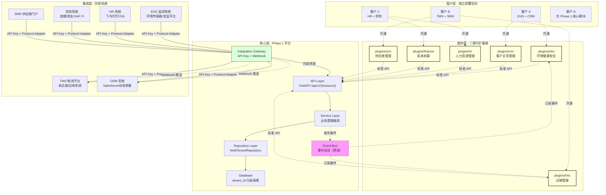
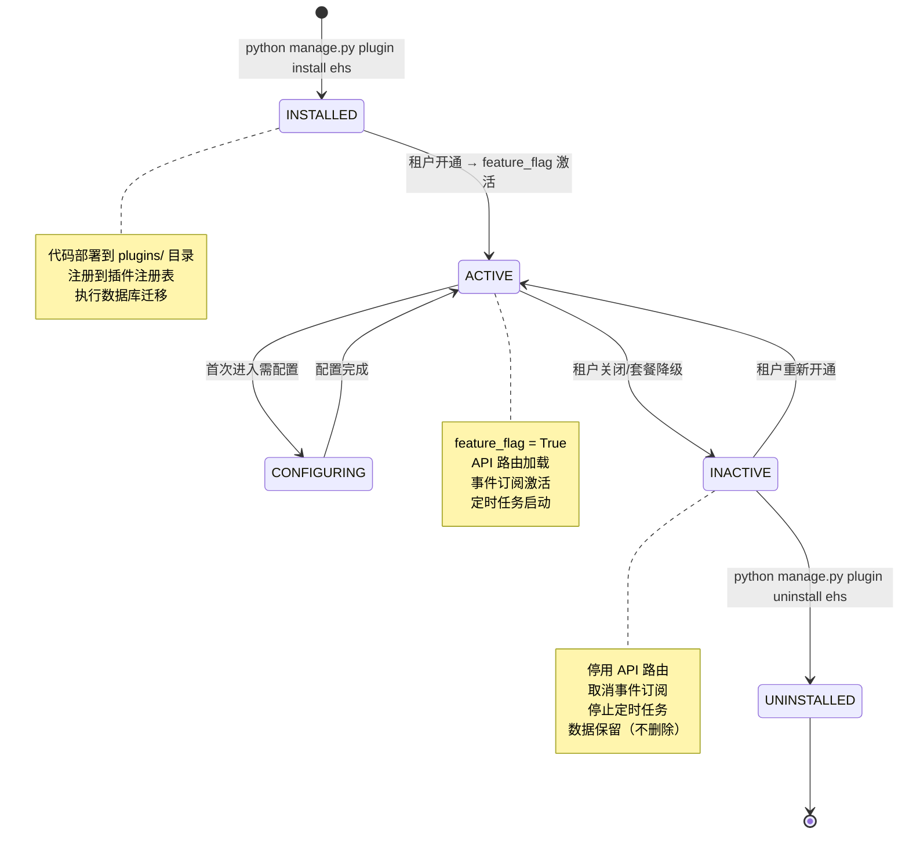
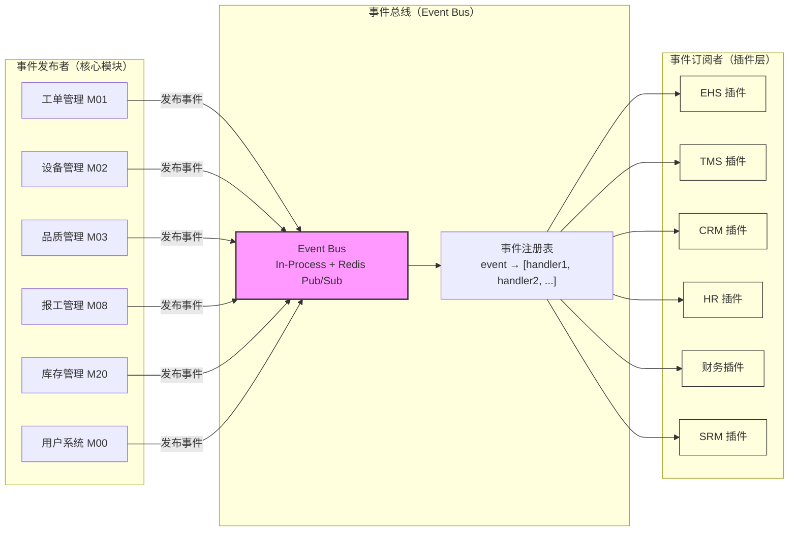

# 知微云 SaaS 二期可扩展架构方案

> **文档编号**：ZIWI-ARCH-EXT-v1.0  
> **编制人**：Bob（架构师 / 高见远）  
> **编制日期**：2026-06-22  
> **审核人**：Alice（PM / 许清楚）  
> **状态**：待评审  
> **关联文档**：`product-functional-specification.md`、`architecture-comprehensive-review.md`、`architecture-impact-assessment.md`、`sap-dingjie-review-response.md`（第十五部分）

---

## 修订记录

| 版本 | 日期 | 修订内容 | 作者 |
|:----:|:----:|:---------|:----:|
| v1.0 | 2026-06-22 | 初始版本：完整可扩展架构方案 | Bob |

---

## 目录

1. [可扩展总体架构](#1-可扩展总体架构)
2. [模块插件化方案](#2-模块插件化方案核心)
3. [扩展点与事件钩子](#3-扩展点与事件钩子核心)
4. [Integration Gateway 扩展方案](#4-integration-gateway-扩展方案)
5. [数据模型预留策略](#5-数据模型预留策略)
6. [二开标准与约束](#6-二开标准与约束)
7. [六个域的具体扩展路径](#7-六个域的具体扩展路径)

---

## 1. 可扩展总体架构

### 1.1 架构分层图



### 1.2 架构分层说明

| 层次 | 职责 | Phase 1 状态 | 二开策略 |
|:----:|------|:-----------:|---------|
| **核心层** | 知微云平台基础能力：认证/租户隔离/业务模块/MultiTenantRepository | ✅ 已实现 | ❌ **不可修改** — 二开不碰核心 |
| **插件层** | 二期可扩展域的独立代码包，通过标准 API + 事件钩子与核心交互 | ❌ 预留中 | ✅ **独立开发部署** |
| **集成层** | Integration Gateway 统一外部系统接入，协议适配/数据映射/Webhook | ⚠️ 基础框架 | ✅ **可扩展适配器** |

### 1.3 核心原则（五项铁律）

| # | 原则 | 说明 | 违反后果 |
|:-:|:----|:-----|:---------|
| 1 | **模块插件化** | 二期域代码以独立插件模块存在，与核心代码物理隔离 | 核心代码被污染，升级困难 |
| 2 | **扩展点 + 钩子** | 仅通过预埋事件钩子联动，不硬编码调用链 | 插件与核心耦合，无法独立升级 |
| 3 | **IG 统一入口** | 所有外部数据交换通过 Integration Gateway，禁止直连核心 API | 认证/审计失效，安全漏洞 |
| 4 | **数据模型预留** | 核心表预留 `ext_attrs` JSONB 字段，二期不改表结构 | 核心表与二开表耦合，数据迁移风险 |
| 5 | **标准 API 契约** | 二开通过 OpenAPI 规范调用知微 API，禁止直接操作数据库 | 绕过租户隔离，数据泄露 |

---

## 2. 模块插件化方案（核心）

### 2.1 插件目录结构规范

每个插件是一个独立的 Python package，遵循统一目录结构：

```
plugins/
├── ehs/                          # EHS 环境健康安全插件
│   ├── plugin_manifest.json      # 插件清单（必选）
│   ├── __init__.py               # 插件入口（必选）
│   ├── api/                      # 插件 API 路由（可选）
│   │   ├── __init__.py
│   │   ├── environment.py        # 环境监测 API
│   │   └── safety.py             # 安全管理 API
│   ├── services/                 # 插件业务逻辑（可选）
│   │   ├── __init__.py
│   │   ├── environment_service.py
│   │   └── safety_service.py
│   ├── models/                   # 插件数据模型（可选）
│   │   ├── __init__.py
│   │   ├── environment_record.py
│   │   └── safety_incident.py
│   ├── repositories/             # 插件数据访问（可选）
│   │   ├── __init__.py
│   │   ├── environment_repo.py
│   │   └── safety_repo.py
│   ├── adapters/                 # 插件专用适配器（可选）
│   │   └── ehs_sensor_adapter.py
│   ├── hooks.py                  # 事件订阅/钩子注册（可选）
│   ├── config.py                 # 插件配置（可选）
│   └── migrations/               # 插件专属数据库迁移
│       └── v1_init.sql
├── tms/
│   ├── plugin_manifest.json
│   ├── __init__.py
│   ├── api/
│   ├── services/
│   ├── models/
│   ├── repositories/
│   ├── adapters/
│   │   └── tms_carrier_adapter.py
│   ├── hooks.py
│   └── migrations/
├── crm/
│   └── ...
├── hr/
│   └── ...
├── finance/
│   └── ...
└── srm/
    └── ...
```

### 2.2 插件生命周期



**各阶段详细说明**：

| 阶段 | 操作方 | 触发动作 | 系统行为 |
|:----:|:------:|---------|---------|
| **INSTALLED** | 平台运维 | `plugin install <name>` | ① 解压插件包到 `plugins/<name>/`；② 注册到 `plugin_registry` 表；③ 执行 `migrations/` 下的 DDL；④ 注册默认配置到 `plugin_configs` 表 |
| **ACTIVE** | 租户管理员 / 自动 | 开通套餐含该模块 | ① feature_flag 设为 true；② 加载插件 API 路由；③ 注册事件订阅回调；④ 启动插件定时任务 |
| **CONFIGURING** | 租户管理员 | 首次进入插件配置页 | ① 插件提供配置 UI（可选）；② 配置 `adapters/` 连接参数；③ 配置数据映射规则 |
| **INACTIVE** | 租户管理员 / 自动 | 关闭模块/套餐降级 | ① 卸载 API 路由；② 取消事件订阅；③ 停止定时任务；④ 数据保留（软删除不可见） |
| **UNINSTALLED** | 平台运维 | `plugin uninstall <name>` | ① 从 `plugin_registry` 移除；② 清理插件配置；③ **谨慎：数据保留策略由运维决定** |

### 2.3 插件与核心的边界定义

#### ✅ 插件可以做什么

| 可操作项 | 说明 | 示例 |
|:---------|:-----|:-----|
| **读取核心数据** | 通过标准 API 读取核心表数据（需认证） | EHS 插件读取 `work_orders` 工单数据 |
| **写入核心扩展字段** | 通过 API 写入 `ext_attrs` JSONB 字段 | TMS 插件写入 `issue_orders.ext_attrs` |
| **订阅事件钩子** | 注册事件回调，在核心事件触发时执行插件逻辑 | HR 插件订阅 `user.created` 事件 |
| **创建插件专属表** | 在 `ext_` 前缀下创建自己的表 | `ext_ehs_monitoring_points` |
| **注册 API 路由** | 在 `/api/v1/ext/<plugin_name>/` 下注册路由 | EHS: `/api/v1/ext/ehs/environment` |

#### ❌ 插件禁止做什么

| 禁止操作 | 原因 | 替代方案 |
|:---------|:-----|:---------|
| **修改核心表结构** | 破坏核心数据模型，影响所有租户 | 使用 `ext_attrs` JSONB 扩展字段 |
| **修改核心 API 响应格式** | 破坏前端契约，影响已有功能 | API 版本化（`/api/v2/`）|
| **直接操作核心数据库** | 绕过租户隔离和审计 | 通过标准 API 读写 |
| **插件间直接调用** | 产生隐式耦合 | 通过事件总线解耦 |
| **修改核心配置文件** | 影响平台级行为 | 使用插件级 `config.py` |

### 2.4 插件清单注册机制

每个插件根目录必须包含 `plugin_manifest.json`，格式如下：

```json
{
  "plugin_id": "ziwi.plugin.ehs",
  "name": "环境健康安全 (EHS)",
  "version": "1.0.0",
  "min_core_version": "1.0.0",
  "description": "环境监测、职业健康、安全管理插件",
  "author": "知微云二开团队",

  "dependencies": {
    "core_modules": ["M01", "M03", "M07", "M12"],
    "plugins": []
  },

  "api_routes": {
    "prefix": "/api/v1/ext/ehs",
    "modules": ["environment", "safety"]
  },

  "event_subscriptions": [
    {
      "event": "work_order.completed",
      "handler": "hooks.on_work_order_completed",
      "async": true
    },
    {
      "event": "equipment.status_changed",
      "handler": "hooks.on_equipment_status_changed",
      "async": true
    }
  ],

  "config_fields": [
    {
      "key": "sensor_api_url",
      "type": "string",
      "label": "传感器数据接口 URL",
      "required": true
    },
    {
      "key": "auto_alert_enabled",
      "type": "boolean",
      "label": "自动告警启用",
      "default": true
    }
  ],

  "scheduled_tasks": [
    {
      "name": "sync_environment_data",
      "interval_minutes": 15,
      "handler": "services.environment_service.sync_data"
    }
  ],

  "permissions": [
    "ehs:environment:read",
    "ehs:environment:write",
    "ehs:safety:read",
    "ehs:safety:write",
    "ehs:alert:read"
  ]
}
```

**核心字段说明**：

| 字段 | 类型 | 必选 | 说明 |
|:-----|:----:|:----:|:-----|
| `plugin_id` | string | ✅ | 全局唯一插件标识，格式 `ziwi.plugin.<name>` |
| `min_core_version` | string | ✅ | 最低兼容核心版本，版本不匹配时拒绝安装 |
| `dependencies.core_modules` | string[] | ✅ | 依赖的核心模块编码列表，缺失时将提示 |
| `api_routes.prefix` | string | ✅ | 插件 API 路由前缀，统一 `/api/v1/ext/<name>/` |
| `event_subscriptions` | object[] | 可选 | 订阅的事件列表，每个事件绑定处理函数 |
| `config_fields` | object[] | 可选 | 插件配置字段定义，用于自动生成配置 UI |
| `scheduled_tasks` | object[] | 可选 | 插件定时任务定义，由核心 Task Scheduler 统一调度 |
| `permissions` | string[] | 可选 | 插件引入的权限编码，自动注册到权限系统 |

### 2.5 插件注册表（数据库）

```sql
-- plugin_registry 表：记录所有已安装的插件
CREATE TABLE plugin_registry (
    id              INTEGER PRIMARY KEY AUTOINCREMENT,
    plugin_id       VARCHAR(128) NOT NULL UNIQUE,   -- 如 "ziwi.plugin.ehs"
    name            VARCHAR(256) NOT NULL,
    version         VARCHAR(32) NOT NULL,
    manifest_json   TEXT NOT NULL,                   -- 完整 manifest 内容
    installed_at    TIMESTAMP DEFAULT CURRENT_TIMESTAMP,
    installed_by    INTEGER REFERENCES users(id),
    UNIQUE(plugin_id)
);

-- plugin_tenants 表：记录租户开通的插件（多对多）
CREATE TABLE plugin_tenants (
    id              INTEGER PRIMARY KEY AUTOINCREMENT,
    tenant_id       VARCHAR(64) NOT NULL,
    plugin_id       VARCHAR(128) NOT NULL,           -- 关联 plugin_registry.plugin_id
    is_active       INTEGER DEFAULT 1,               -- 1=启用 0=停用
    config_json     TEXT,                            -- 租户级插件配置（JSON）
    activated_at    TIMESTAMP DEFAULT CURRENT_TIMESTAMP,
    deactivated_at  TIMESTAMP,
    UNIQUE(tenant_id, plugin_id)
);
```

### 2.6 插件加载机制（核心）

```python
# 核心启动时的插件加载逻辑（伪代码）
class PluginLoader:
    """插件加载器 — 在 FastAPI 应用启动时加载已安装的插件"""

    def __init__(self, app: FastAPI, db: AsyncSession):
        self.app = app
        self.db = db
        self.loaded_plugins: Dict[str, PluginInfo] = {}

    async def load_all(self):
        """扫描 plugins/ 目录，加载所有已注册的插件"""
        plugins_dir = Path("plugins")
        if not plugins_dir.exists():
            return

        for plugin_dir in plugins_dir.iterdir():
            manifest_path = plugin_dir / "plugin_manifest.json"
            if not manifest_path.exists():
                continue

            manifest = json.loads(manifest_path.read_text())
            plugin_id = manifest["plugin_id"]

            # ① 版本检查
            if not self._check_version_compatibility(manifest):
                logger.warning(f"插件 {plugin_id} 版本不兼容，跳过加载")
                continue

            # ② 加载 API 路由
            if manifest.get("api_routes"):
                api_module = importlib.import_module(
                    f"plugins.{plugin_dir.name}.api"
                )
                prefix = manifest["api_routes"]["prefix"]
                self.app.include_router(
                    api_module.router,
                    prefix=prefix,
                    tags=[f"[Ext] {manifest['name']}"],
                )

            # ③ 注册事件订阅
            if manifest.get("event_subscriptions"):
                hooks_module = importlib.import_module(
                    f"plugins.{plugin_dir.name}.hooks"
                )
                for sub in manifest["event_subscriptions"]:
                    EventBus.register(
                        sub["event"],
                        getattr(hooks_module, sub["handler"].split(".")[-1]),
                        async_mode=sub.get("async", True),
                    )

            # ④ 注册定时任务
            if manifest.get("scheduled_tasks"):
                for task in manifest["scheduled_tasks"]:
                    TaskScheduler.register(
                        task["name"],
                        task["interval_minutes"],
                        f"plugins.{plugin_dir.name}.{task['handler']}",
                    )

            # ⑤ 注册权限编码
            if manifest.get("permissions"):
                PermissionRegistry.bulk_register(manifest["permissions"])

            self.loaded_plugins[plugin_id] = PluginInfo(
                manifest=manifest, loaded_at=datetime.utcnow()
            )
            logger.info(f"插件 {plugin_id} v{manifest['version']} 加载成功")
```

---

## 3. 扩展点与事件钩子（核心）

### 3.1 事件总线架构



### 3.2 Phase 1 预留事件钩子清单

以下事件钩子在 Phase 1 核心模块中预留，二期插件可直接订阅。每个钩子包含事件名称、数据结构、触发位置、订阅示例。

#### 3.2.1 事件钩子总表

| 事件名称 | 所属域 | 所在模块 | 触发时机 | 事件载荷（payload） | 异步/同步 |
|:---------|:------:|:--------:|:---------|:-------------------|:---------:|
| `work_order.completed` | EHS/CRM | M07 工单 | 工单完成状态变更时 | `{work_order_id, wo_type, product_id, completed_at, ext_attrs}` | 异步 |
| `equipment.status_changed` | EHS | M12 设备 | 设备状态变更（运行/故障/停机/保养） | `{equipment_id, old_status, new_status, changed_at, ext_attrs}` | 异步 |
| `issue_order.confirmed` | TMS | M20 出库 | 出库单确认时 | `{issue_order_id, material_id, quantity, warehouse_id, carrier, tracking_no, ext_attrs}` | 异步 |
| `quality.check_completed` | CRM/SRM | M10 品质 | 检验完成并生成结论时 | `{check_id, check_type, product_id, result, passed, ext_attrs}` | 异步 |
| `user.created` | HR | M00 用户 | 新用户创建成功时 | `{user_id, username, email, org_id, role_ids, ext_attrs}` | 异步 |
| `certification.expiring` | HR | M00 认证 | 资质证书到期前30天/7天 | `{cert_id, user_id, cert_type, expires_at, days_remaining}` | 异步（定时） |
| `work_report.approved` | 财务 | M08 报工 | 报工审批通过时 | `{report_id, work_order_id, operation_seq, quantity, unit_price, total_amount, ext_attrs}` | 异步 |
| `inventory_transaction.created` | 财务 | M20 库存 | 库存变动记录创建时 | `{transaction_id, material_id, transaction_type, quantity, unit_cost, total_cost, ext_attrs}` | 异步 |
| `quality.iqc_passed` | SRM | M10 IQC | IQC 检验结论为通过时 | `{check_id, material_id, supplier_id, quantity, result, ext_attrs}` | 异步 |
| `ncr.created` | SRM | M10 NCR | 不合格品报告创建时 | `{ncr_id, check_id, material_id, severity, description, ext_attrs}` | 异步 |
| `work_report.created` | 财务/HR | M08 报工 | 报工创建时 | `{report_id, user_id, work_order_id, operation_seq, quantity, report_time}` | 异步 |
| `quality.check_created` | CRM/SRM | M10 品质 | 检验单创建时 | `{check_id, check_type, source_type, source_id, inspector_id}` | 异步 |
| `inventory.alert_triggered` | 财务/TMS | M20 预警 | 库存预警触发时 | `{alert_id, material_id, alert_type, threshold, current_value}` | 异步 |
| `andon.call_created` | EHS | M11 安灯 | 安灯呼叫创建时 | `{call_id, equipment_id, andon_type, severity, description}` | 异步 |
| `andon.call_resolved` | EHS | M11 安灯 | 安灯呼叫解决时 | `{call_id, resolved_by, resolution, resolved_at}` | 异步 |

#### 3.2.2 Phase 1 必留钩子（高优先级）

根据第十五部分产品负责人确认的6个域，**以下钩子必须在 Phase 1 实现**（P0 优先级）：

| # | 事件名称 | 是否必须 | 原因 | 实现工作 |
|:-:|:---------|:--------:|:-----|:--------|
| 1 | `work_order.completed` | ✅ P0 | EHS 环境触发 + CRM 交付通知双域依赖 | 在 `production_service.complete_work_order()` 末尾发布事件 |
| 2 | `equipment.status_changed` | ✅ P0 | EHS 安全告警触发 | `tpm_service` 中状态变更后发布事件 |
| 3 | `issue_order.confirmed` | ✅ P0 | TMS 物流单创建 | 在 M20 `issue_order_service` 确认操作中发布 |
| 4 | `quality.check_completed` | ✅ P0 | CRM 投诉登记 + SRM 评分双域依赖 | `quality_service` 判定结论后发布 |
| 5 | `user.created` | ✅ P0 | HR 系统同步 | `user_service.create()` 末尾发布 |
| 6 | `certification.expiring` | ✅ P0 | HR 培训提醒 | 新增定时任务，检查资质到期 |
| 7 | `work_report.approved` | ✅ P0 | 财务成本核算 | `approval_service` 审批通过后发布 |
| 8 | `inventory_transaction.created` | ✅ P0 | 财务记账 | M20 库存变动记录创建时发布 |
| 9 | `quality.iqc_passed` | ✅ P0 | SRM 评分 | IQC 检验通过后发布 |
| 10 | `ncr.created` | ✅ P0 | SRM 整改通知 | NCR 创建时发布 |

#### 3.2.3 事件数据结构定义

核心事件数据结构示例（以 `work_order.completed` 为例）：

```python
# 事件载荷 = EventBus 发布的内容
from dataclasses import dataclass, field
from datetime import datetime
from typing import Any, Dict, Optional

@dataclass
class WorkOrderCompletedEvent:
    """工单完成事件载荷"""
    event_name: str = "work_order.completed"
    work_order_id: int
    wo_type: str                    # "production" | "trial" | "maintenance"
    product_id: int
    product_name: str
    quantity: float
    completed_at: datetime
    ext_attrs: Dict[str, Any] = field(default_factory=dict)

    def to_dict(self) -> dict:
        return {
            "event": self.event_name,
            "timestamp": datetime.utcnow().isoformat(),
            "data": {
                "work_order_id": self.work_order_id,
                "wo_type": self.wo_type,
                "product_id": self.product_id,
                "product_name": self.product_name,
                "quantity": self.quantity,
                "completed_at": self.completed_at.isoformat(),
                "ext_attrs": self.ext_attrs,
            },
        }
```

#### 3.2.4 事件发布示例（核心代码嵌入点）

以工单完成事件为例，Phase 1 核心代码嵌入位置：

```python
# 在 production_service.py 中的工单完成方法末尾

class ProductionService:
    def __init__(self, event_bus: EventBus):
        self.event_bus = event_bus

    async def complete_work_order(self, wo_id: int, user: dict) -> dict:
        # ... 原有工单完成逻辑（状态变更、快照等）...

        # === 扩展点：发布工单完成事件（Phase 1 预留）===
        await self.event_bus.publish(WorkOrderCompletedEvent(
            work_order_id=wo_id,
            wo_type=work_order["wo_type"],
            product_id=work_order["product_id"],
            product_name=work_order.get("product_name", ""),
            quantity=work_order.get("quantity", 0),
            completed_at=datetime.utcnow(),
            ext_attrs=work_order.get("ext_attrs", {}),
        ))

        return work_order
```

#### 3.2.5 事件订阅示例（插件侧）

```python
# plugins/ehs/hooks.py — EHS 插件的事件订阅处理

async def on_work_order_completed(event_payload: dict):
    """工单完成 → 记录环境数据"""
    wo_data = event_payload["data"]

    # 从 ext_attrs 读取 EHS 扩展字段（由 EHS 插件在前序流程中写入）
    ehs_data = wo_data.get("ext_attrs", {}).get("ehs", {})

    # 如果工单包含环境数据，写入 EHS 环境记录表
    if ehs_data:
        await EnvironmentRecordService.create(
            work_order_id=wo_data["work_order_id"],
            data_type=ehs_data.get("data_type", "general"),
            values=ehs_data.get("values", {}),
            recorded_at=datetime.utcnow(),
        )

    # 如果产品类别需要客户通知，触发 CRM 交付通知
    if wo_data.get("wo_type") == "production":
        await EventBus.trigger("crm.delivery_notification", event_payload)
```

### 3.3 EventBus 核心实现

```python
# backend/app/core/event_bus.py — 事件总线（Phase 1 预留实现）

import asyncio
import logging
from dataclasses import dataclass, field
from datetime import datetime
from typing import Any, Callable, Coroutine, Dict, List, Optional

logger = logging.getLogger(__name__)

EventHandler = Callable[[dict], Coroutine[Any, Any, None]]


@dataclass
class Subscription:
    """事件订阅记录"""
    event_name: str
    handler: EventHandler
    plugin_id: Optional[str] = None      # 所属插件（用于 INACTIVE 时批量取消）
    async_mode: bool = True               # True=异步(不等待), False=同步(等待)
    created_at: datetime = field(default_factory=datetime.utcnow)


class EventBus:
    """事件总线 — 进程内事件发布/订阅

    设计原则:
    - Phase 1 使用进程内模式（In-Process），无需额外中间件
    - Phase 5+ 可升级为 Redis Pub/Sub 或消息队列，接口不变
    - 订阅者之间隔离：一个订阅者异常不影响其他订阅者
    - 同步订阅者超时影响发布者（默认 5s 超时）
    """

    _subscriptions: Dict[str, List[Subscription]] = {}
    _lock = asyncio.Lock()

    @classmethod
    def register(
        cls,
        event_name: str,
        handler: EventHandler,
        plugin_id: Optional[str] = None,
        async_mode: bool = True,
    ):
        """注册事件处理器

        Args:
            event_name: 事件名称（如 "work_order.completed"）
            handler: 事件处理函数（接受 dict 参数）
            plugin_id: 所属插件 ID（用于批量注销）
            async_mode: True=异步（不等待），False=同步（等待执行完成）
        """
        sub = Subscription(
            event_name=event_name,
            handler=handler,
            plugin_id=plugin_id,
            async_mode=async_mode,
        )
        if event_name not in cls._subscriptions:
            cls._subscriptions[event_name] = []
        cls._subscriptions[event_name].append(sub)
        logger.info(f"[EventBus] 注册事件订阅: {event_name} (plugin={plugin_id})")

    @classmethod
    def unregister_plugin(cls, plugin_id: str):
        """注销某插件的所有事件订阅（插件停用时调用）"""
        for event_name in list(cls._subscriptions.keys()):
            cls._subscriptions[event_name] = [
                sub
                for sub in cls._subscriptions[event_name]
                if sub.plugin_id != plugin_id
            ]
            if not cls._subscriptions[event_name]:
                del cls._subscriptions[event_name]
        logger.info(f"[EventBus] 注销插件 {plugin_id} 的所有订阅")

    @classmethod
    async def publish(cls, event_payload: Any):
        """发布事件

        Args:
            event_payload: 事件载荷对象（含 event_name 属性）

        行为:
            - 无订阅者时静默通过（无副作用）
            - 同步订阅者：按注册顺序执行，单个超时不影响其他
            - 异步订阅者：创建 task，不等待结果
            - 订阅者异常：捕获并记录日志，不影响主流程
        """
        event_name = event_payload.event_name if hasattr(event_payload, "event_name") else None
        if not event_name:
            event_name = event_payload.get("event", "unknown")

        if event_name not in cls._subscriptions:
            return  # 无订阅者，静默通过

        payload_dict = event_payload.to_dict() if hasattr(event_payload, "to_dict") else event_payload

        for sub in cls._subscriptions[event_name]:
            try:
                if sub.async_mode:
                    # 异步执行：创建任务，不等待
                    asyncio.create_task(sub.handler(payload_dict))
                else:
                    # 同步执行：等待完成（带超时）
                    await asyncio.wait_for(
                        sub.handler(payload_dict),
                        timeout=5.0,
                    )
            except asyncio.TimeoutError:
                logger.warning(
                    f"[EventBus] 事件 {event_name} 处理器超时 (handler={sub.handler.__name__})"
                )
            except Exception as e:
                logger.error(
                    f"[EventBus] 事件 {event_name} 处理器异常: {e} (handler={sub.handler.__name__})",
                    exc_info=True,
                )
```

### 3.4 Phase 1 事件钩子实现嵌入点

以下清单标识 Phase 1 核心代码中需要插入事件发布的**确切位置**：

| 事件名称 | 文件 | 方法 | 插入位置 |
|:---------|:-----|:------|:---------|
| `work_order.completed` | `app/services/production_service.py` | `complete_work_order()` | 状态变更为 "completed" 之后 |
| `equipment.status_changed` | `app/services/tpm_service.py` | `update_equipment_status()` | 状态更新 DB 写入之后 |
| `issue_order.confirmed` | `app/services/warehouse_service.py` | `confirm_issue_order()` | 出库单确认逻辑末尾 |
| `quality.check_completed` | `app/services/quality_service.py` | `complete_check()` | 判定结论写入之后 |
| `user.created` | `app/services/user_service.py` | `create_user()` | 用户创建成功、DB 提交之后 |
| `certification.expiring` | `app/services/user_service.py` | 新增 `check_expiring_certs()` | 新增定时任务，每天检查 |
| `work_report.approved` | `app/services/approval_service.py` | `approve_work_report()` | 审批通过逻辑末尾 |
| `inventory_transaction.created` | `app/services/warehouse_service.py` | `create_transaction()` | 库存变动记录创建之后 |
| `quality.iqc_passed` | `app/services/quality_service.py` | `complete_iqc()` | IQC 判定通过时 |
| `ncr.created` | `app/services/quality_service.py` | `create_ncr()` | NCR 创建成功之后 |

---

## 4. Integration Gateway 扩展方案

### 4.1 二期域适配器模板设计

Integration Gateway 通过**适配器基类**为二期域提供可复用的外部系统对接模板。每个二期域只需继承基类，实现特定协议转换逻辑。

```python
# backend/app/ig/adapters/base_adapter.py — 适配器基类

from abc import ABC, abstractmethod
from typing import Any, Dict, Optional
from datetime import datetime
import logging

logger = logging.getLogger(__name__)


class BaseIntegrationAdapter(ABC):
    """集成适配器基类 — 所有二期域适配器的通用模板

    子类必须实现的方法:
    - connect(): 建立与外部系统的连接
    - send(): 发送数据到外部系统
    - receive(): 从外部系统接收数据
    - transform(): 数据格式转换（知微格式 ↔ 外部格式）

    可选覆盖的方法:
    - validate(): 数据校验
    - handle_error(): 错误处理
    - retry_policy(): 重试策略
    """

    def __init__(self, config: Dict[str, Any]):
        """
        Args:
            config: {
                "base_url": "https://api.external-system.com",
                "api_key": "...",
                "api_secret": "...",
                "timeout": 30,
                "retry_count": 3,
                ...
            }
        """
        self.config = config
        self.connected = False
        self.last_connected_at: Optional[datetime] = None

    # ── 子类必须实现 ──

    @abstractmethod
    async def connect(self) -> bool:
        """建立与外部系统的连接（认证握手）"""
        ...

    @abstractmethod
    async def send(self, endpoint: str, data: dict) -> dict:
        """发送数据到外部系统"""
        ...

    @abstractmethod
    async def receive(self, endpoint: str, params: dict) -> dict:
        """从外部系统接收数据"""
        ...

    @abstractmethod
    def transform_to_external(self, internal_data: dict) -> dict:
        """知微内部格式 → 外部系统格式"""
        ...

    @abstractmethod
    def transform_to_internal(self, external_data: dict) -> dict:
        """外部系统格式 → 知微内部格式"""
        ...

    # ── 可选覆盖 ──

    async def validate(self, data: dict, direction: str = "outbound") -> bool:
        """数据校验（格式/必填字段/值范围）"""
        return True

    async def handle_error(self, error: Exception, context: dict) -> dict:
        """统一的错误处理"""
        logger.error(f"适配器错误: {error}, context={context}")
        return {"success": False, "error": str(error), "context": context}

    def retry_policy(self, attempt: int) -> float:
        """重试退避策略（默认: 指数退避）
        Returns: 等待秒数，返回 0 表示不再重试
        """
        if attempt >= self.config.get("retry_count", 3):
            return 0  # 不再重试
        return 2 ** attempt  # 1s, 2s, 4s
```

### 4.2 预置适配器模板

#### EHS 传感器适配器

```python
# plugins/ehs/adapters/ehs_sensor_adapter.py

from app.ig.adapters.base_adapter import BaseIntegrationAdapter
import httpx


class EhsSensorAdapter(BaseIntegrationAdapter):
    """EHS 环境传感器数据采集适配器

    对接 EHS 监测平台（如环境传感器 API、安监平台 API）
    """

    async def connect(self) -> bool:
        async with httpx.AsyncClient() as client:
            try:
                resp = await client.post(
                    f"{self.config['base_url']}/auth/token",
                    json={
                        "api_key": self.config["api_key"],
                        "api_secret": self.config["api_secret"],
                    },
                    timeout=self.config.get("timeout", 30),
                )
                if resp.status_code == 200:
                    self.token = resp.json()["access_token"]
                    self.connected = True
                    self.last_connected_at = datetime.utcnow()
                    return True
            except Exception as e:
                logger.error(f"EHS 传感器适配器连接失败: {e}")
        return False

    async def send(self, endpoint: str, data: dict) -> dict:
        raise NotImplementedError("EHS 适配器为只读模式，不支持发送")

    async def receive(self, endpoint: str, params: dict) -> dict:
        async with httpx.AsyncClient() as client:
            resp = await client.get(
                f"{self.config['base_url']}/{endpoint}",
                headers={"Authorization": f"Bearer {self.token}"},
                params=params,
                timeout=self.config.get("timeout", 30),
            )
            return self.transform_to_internal(resp.json())

    def transform_to_external(self, internal_data: dict) -> dict:
        raise NotImplementedError("EHS 适配器不为只读模式")

    def transform_to_internal(self, external_data: dict) -> dict:
        """EHS 传感器数据 → 知微 EHS 插件数据格式"""
        return {
            "sensor_id": external_data.get("device_id"),
            "data_type": external_data.get("metric_type"),
            "value": external_data.get("value"),
            "unit": external_data.get("unit"),
            "recorded_at": external_data.get("timestamp"),
            "location": external_data.get("location"),
            "ext_attrs": {
                "ehs_raw": external_data,
            },
        }
```

#### TMS 物流适配器（模板）

```python
# plugins/tms/adapters/tms_carrier_adapter.py

from app.ig.adapters.base_adapter import BaseIntegrationAdapter
import httpx


class TmsCarrierAdapter(BaseIntegrationAdapter):
    """TMS 承运商对接适配器（模板）

    对接物流平台（如货拉拉企业版、顺丰API、德邦API）
    二开团队实现具体的物流平台协议。
    """

    async def connect(self) -> bool:
        # 实现：承运商 API 认证
        # 模板代码...
        pass

    async def send(self, endpoint: str, data: dict) -> dict:
        # 实现：创建运单、取消运单等
        # 模板代码...
        pass

    async def receive(self, endpoint: str, params: dict) -> dict:
        # 实现：查询运单状态、轨迹等
        # 模板代码...
        pass

    def transform_to_external(self, internal_data: dict) -> dict:
        """知微出库单 → 承运商运单格式"""
        return {
            "order_no": internal_data.get("issue_order_no"),
            "pickup_address": internal_data.get("warehouse_address"),
            "delivery_address": internal_data.get("customer_address"),
            "items": [
                {
                    "sku": item.get("material_code"),
                    "name": item.get("material_name"),
                    "quantity": item.get("quantity"),
                }
                for item in internal_data.get("items", [])
            ],
            "remark": internal_data.get("remark", ""),
        }

    def transform_to_internal(self, external_data: dict) -> dict:
        """承运商回传数据 → 知微格式"""
        return {
            "tracking_no": external_data.get("waybill_no"),
            "carrier": external_data.get("carrier_name"),
            "status": external_data.get("status"),
            "estimated_arrival": external_data.get("estimated_delivery_time"),
            "tracking_url": external_data.get("tracking_url"),
        }
```

### 4.3 数据映射规则

#### 4.3.1 知微核心字段 ↔ 二期域字段映射

| 知微核心字段 | 类型 | EHS 映射 | TMS 映射 | CRM 映射 | HR 映射 | 财务映射 | SRM 映射 |
|:------------|:----:|:---------|:---------|:---------|:--------|:---------|:---------|
| `work_orders.id` | int | 环境监测关联工单 | — | 交付通知关联工单 | — | 成本核算关联工单 | — |
| `work_orders.ext_attrs.ehs` | JSONB | ✅ 环境数据载体 | — | — | — | — | — |
| `work_orders.ext_attrs.crm` | JSONB | — | — | ✅ 客户交付通知 | — | — | — |
| `equipment.id` | int | ✅ 安全告警关联设备 | — | — | — | — | — |
| `equipment.ext_attrs.ehs` | JSONB | ✅ 安全关联信息 | — | — | — | — | — |
| `issue_orders.id` | int | — | ✅ 运单创建来源 | — | — | — | — |
| `issue_orders.carrier` | VARCHAR | — | ✅ 承运商名称 | — | — | — | — |
| `issue_orders.tracking_no` | VARCHAR | — | ✅ 运单号 | — | — | — | — |
| `quality_checks.id` | int | — | — | ✅ 投诉关联检验 | — | — | ✅ 评分关联检验 |
| `quality_checks.ext_attrs.srm` | JSONB | — | — | — | — | — | ✅ 评分输出 |
| `users.id` | int | — | — | — | ✅ HR 同步标识 | — | — |
| `users.ext_attrs.hr` | JSONB | — | — | — | ✅ 工号/部门/岗位 | — | — |
| `work_reports.id` | int | — | — | — | — | ✅ 成本核算源 | — |
| `work_reports.unit_price` | REAL | — | — | — | — | ✅ 单价 | — |
| `work_reports.ext_attrs.fin` | JSONB | — | — | — | — | ✅ 成本科目编码 | — |
| `inventory_transactions.id` | int | — | — | — | — | ✅ 财务过账源 | — |
| `inventory_transactions.ext_attrs.fin` | JSONB | — | — | — | — | ✅ 过账标识 | — |

#### 4.3.2 数据映射配置文件

每个适配器通过 YAML 配置文件定义字段映射规则：

```yaml
# plugins/tms/data_mapping.yaml — TMS 数据映射配置
version: "1.0"
domain: "tms"

mappings:
  # 出库单确认 → 创建运单
  - source: "issue_order.confirmed"    # 知微事件
    target: "tms.create_waybill"       # 承运商 API
    field_mapping:
      - from: "data.issue_order_no"
        to: "order_no"
        transform: null
      - from: "data.warehouse_address"
        to: "pickup_address"
        transform: null
      - from: "data.customer_address"
        to: "delivery_address"
        transform: null
      - from: "data.items[].material_code"
        to: "items[].sku"
        transform: null
      - from: "data.items[].quantity"
        to: "items[].quantity"
        transform: "float_to_int"
      - from: "data.ext_attrs.tms.carrier_code"
        to: "carrier_code"
        transform: null

  # 承运商回传运单状态 → 更新出库单
  - source: "tms.status_update"
    target: "issue_order.update_tracking"
    field_mapping:
      - from: "waybill_no"
        to: "data.tracking_no"
        transform: null
      - from: "status"
        to: "data.ext_attrs.tms.delivery_status"
        transform: "tms_status_mapping"
      - from: "estimated_delivery_time"
        to: "data.ext_attrs.tms.estimated_arrival"
        transform: "iso_datetime"
```

### 4.4 Webhook 事件扩展机制

Integration Gateway 支持新增二期域事件类型的动态注册。

#### 4.4.1 Webhook 事件注册表

```python
# backend/app/ig/webhook_registry.py — Webhook 事件注册表

from typing import Dict, List
from dataclasses import dataclass, field


@dataclass
class WebhookEventType:
    """Webhook 事件类型定义"""
    event_name: str
    display_name: str
    description: str
    payload_schema: dict                 # JSON Schema 描述事件载荷
    is_core: bool = True                 # True=核心事件, False=插件事件
    plugin_id: Optional[str] = None      # 插件 ID（插件事件时使用）


class WebhookEventRegistry:
    """Webhook 事件类型注册表

    核心事件: Phase 1 内置
    插件事件: 插件安装时通过 plugin_manifest 注册

    所有事件类型统一管理，Webhook 订阅时可选择任何注册的事件。
    """

    _events: Dict[str, WebhookEventType] = {}

    @classmethod
    def register_core_events(cls):
        """注册核心事件（Phase 1 内置）"""
        core_events = [
            WebhookEventType(
                event_name="work_order.status_changed",
                display_name="工单状态变更",
                description="工单状态变更时触发...",
                payload_schema={...},  # JSON Schema
                is_core=True,
            ),
            # ... 其他核心事件
        ]
        for evt in core_events:
            cls._events[evt.event_name] = evt

    @classmethod
    def register_plugin_event(cls, event_type: WebhookEventType):
        """注册插件事件（插件安装时调用）"""
        if event_type.event_name in cls._events:
            raise ValueError(f"事件 {event_type.event_name} 已注册")
        cls._events[event_type.event_name] = event_type
        logger.info(f"[WebhookRegistry] 注册插件事件: {event_type.event_name}")

    @classmethod
    def get_all_events(cls) -> List[WebhookEventType]:
        """获取所有可用事件（供 Webhook 订阅 UI 使用）"""
        return list(cls._events.values())

    @classmethod
    def get_plugin_events(cls, plugin_id: str) -> List[WebhookEventType]:
        """获取某插件注册的所有事件"""
        return [
            evt for evt in cls._events.values()
            if evt.plugin_id == plugin_id
        ]
```

#### 4.4.2 二期域 Webhook 事件扩展

| 二期域 | 插件事件名称 | 触发时机 | Webhook 推送目标 |
|:------|:------------|:---------|:----------------|
| EHS | `ehs.alert.triggered` | 环境指标超阈值 | 安监平台、企业微信 |
| EHS | `ehs.safety_incident.created` | 安全事故报告创建 | EHS 管理平台 |
| TMS | `tms.waybill.created` | 运单创建成功 | 承运商系统 |
| TMS | `tms.delivery.confirmed` | 签收确认 | 客户系统 |
| CRM | `crm.complaint.created` | 投诉单创建 | CRM 系统（如纷享销客）|
| CRM | `crm.delivery_notification` | 交付完成通知 | 客户 CRM |
| HR | `hr.user.synced` | 用户同步完成 | HR 系统（飞书/钉钉）|
| HR | `hr.certification.updated` | 资质证书更新 | OA 系统 |
| 财务 | `fin.costing.calculated` | 成本核算完成 | 财务系统（金蝶/用友）|
| 财务 | `fin.gl_posting.completed` | 总账过账完成 | ERP FI 模块 |
| SRM | `srm.supplier.scored` | 供应商评分完成 | SRM 门户 |
| SRM | `srm.ncr.notified` | NCR 整改通知发出 | 供应商系统 |

---

## 5. 数据模型预留策略

### 5.1 扩展字段规范

#### 5.1.1 `ext_attrs` JSONB 字段（通用扩展）

所有核心主表预留 `ext_attrs` JSONB 字段，用于存储二期域扩展数据。

```json
{
  "ehs": {
    "environment_data": {
      "water_quality": {"ph": 7.2, "cod": 45},
      "waste_gas": {"so2": 0.5, "nox": 0.3}
    },
    "safety_incident_id": 1001
  },
  "crm": {
    "customer_id": "CUST-001",
    "delivery_notification_sent": true,
    "complaint_id": "COMP-20261001"
  },
  "hr": {
    "employee_id": "EMP-001",
    "department_code": "DEPT-01",
    "position": "操作员"
  },
  "fin": {
    "cost_center": "CC-1001",
    "gl_account": "50010201",
    "posting_status": "pending"
  },
  "tms": {
    "carrier_code": "SF",
    "tracking_no": "SF1234567890",
    "delivery_status": "in_transit"
  },
  "srm": {
    "supplier_id": "SUP-001",
    "score": 92.5,
    "ncr_id": "NCR-20261001"
  }
}
```

**命名规范**：

| 规范项 | 规则 | 示例 |
|:-------|:-----|:------|
| 顶级 Key | 域代码（全小写英文） | `ehs`, `tms`, `crm`, `hr`, `fin`, `srm` |
| 二级 Key | 业务概念（snake_case） | `environment_data`, `delivery_status` |
| Value 类型 | 仅 JSON 原生类型 | string, number, boolean, null, object, array |
| 最大嵌套 | ≤3 层 | `ehs.environment_data.water_quality` |

#### 5.1.2 `custom_fields` 自定义字段表（租户级）

用于支持租户级别的自定义配置，当 JSONB 字段不足以表达复杂的自定义结构时使用。

```sql
CREATE TABLE custom_fields (
    id              INTEGER PRIMARY KEY AUTOINCREMENT,
    tenant_id       VARCHAR(64) NOT NULL,
    entity_type     VARCHAR(64) NOT NULL,       -- 实体类型，如 "work_order", "equipment"
    entity_id       INTEGER NOT NULL,            -- 实体 ID
    field_name      VARCHAR(128) NOT NULL,       -- 自定义字段名称
    field_value     TEXT,                        -- 字段值（JSON 字符串）
    field_type      VARCHAR(32) DEFAULT 'text',  -- 字段类型: text/number/date/boolean/json
    created_at      TIMESTAMP DEFAULT CURRENT_TIMESTAMP,
    updated_at      TIMESTAMP DEFAULT CURRENT_TIMESTAMP,
    UNIQUE(tenant_id, entity_type, entity_id, field_name)
);

-- 索引
CREATE INDEX idx_custom_fields_entity ON custom_fields(tenant_id, entity_type, entity_id);
```

### 5.2 扩展字段添加清单

以下为 Phase 1 核心表需要**立即添加**扩展字段的完整清单：

| 表名 | 当前字段 | 新增字段 | 变更类型 | 用途 |
|:----|:---------|:---------|:--------:|:-----|
| `work_orders` | 已有字段完整 | `ext_attrs JSONB DEFAULT '{}'` | **ALTER TABLE ADD** | EHS 环境数据/CRM 客户项目编号 |
| `work_reports` | 已有字段完整 | `unit_price REAL DEFAULT 0` | **ALTER TABLE ADD** | 财务成本核算-单价 |
| `work_reports` | — | `ext_attrs JSONB DEFAULT '{}'` | **ALTER TABLE ADD** | 财务成本科目编码 |
| `inventory_transactions` | 已有字段完整 | `ext_attrs JSONB DEFAULT '{}'` | **ALTER TABLE ADD** | 财务过账标识/凭证号 |
| `quality_checks` | 已有字段完整 | `ext_attrs JSONB DEFAULT '{}'` | **ALTER TABLE ADD** | SRM 评分输出/CRM 投诉关联 |
| `equipment` | 已有字段完整 | `ext_attrs JSONB DEFAULT '{}'` | **ALTER TABLE ADD** | EHS 安全关联/位置/风险等级 |
| `users` | 已有字段完整 | `ext_attrs JSONB DEFAULT '{}'` | **ALTER TABLE ADD** | HR 工号/部门/岗位/入职日期 |
| `issue_orders` | 已有字段完整 | `carrier VARCHAR(128)` | **ALTER TABLE ADD** | TMS 承运商名称 |
| `issue_orders` | — | `tracking_no VARCHAR(128)` | **ALTER TABLE ADD** | TMS 运单号 |
| `issue_orders` | — | `ext_attrs JSONB DEFAULT '{}'` | **ALTER TABLE ADD** | TMS 额外物流字段 |

**DDL 执行规范**：

```sql
-- 所有 ALTER TABLE 操作使用 ADD COLUMN + DEFAULT，确保向后兼容
-- 禁止：NOT NULL（无默认值旧数据报错）
-- 禁止：DROP COLUMN（破坏已有查询）
-- 禁止：RENAME COLUMN（破坏已有查询）

ALTER TABLE work_orders ADD COLUMN ext_attrs TEXT DEFAULT '{}';
ALTER TABLE work_reports ADD COLUMN unit_price REAL DEFAULT 0;
ALTER TABLE work_reports ADD COLUMN ext_attrs TEXT DEFAULT '{}';
ALTER TABLE inventory_transactions ADD COLUMN ext_attrs TEXT DEFAULT '{}';
ALTER TABLE quality_checks ADD COLUMN ext_attrs TEXT DEFAULT '{}';
ALTER TABLE equipment ADD COLUMN ext_attrs TEXT DEFAULT '{}';
ALTER TABLE users ADD COLUMN ext_attrs TEXT DEFAULT '{}';
ALTER TABLE issue_orders ADD COLUMN carrier VARCHAR(128);
ALTER TABLE issue_orders ADD COLUMN tracking_no VARCHAR(128);
ALTER TABLE issue_orders ADD COLUMN ext_attrs TEXT DEFAULT '{}';
```

> **注意**：SQLite 不原生支持 JSONB 类型。在 SQLite 中使用 `TEXT` 类型存储 JSON 字符串（通过 `json_extract()` 查询）；PostgreSQL 使用 `JSONB` 类型。`MultiTenantRepository` 的 SQL 注入防护对 JSON 操作同样有效。

### 5.3 扩展字段在代码层的使用

```python
# 核心 Model 层扩展字段定义
from sqlalchemy import Column, Integer, String, Float, Text
from sqlalchemy.ext.mutable import MutableDict
from sqlalchemy.dialects.postgresql import JSONB
import json

class WorkOrder(Base):
    __tablename__ = "work_orders"

    id = Column(Integer, primary_key=True)
    # ... 现有字段 ...

    # Phase 1 新增扩展字段
    ext_attrs = Column(Text, default="{}", server_default="{}")

    @property
    def ext_attrs_dict(self) -> dict:
        """安全解析 ext_attrs JSON"""
        if isinstance(self.ext_attrs, str):
            return json.loads(self.ext_attrs) if self.ext_attrs else {}
        return self.ext_attrs or {}

    def set_ext_attr(self, domain: str, key: str, value):
        """设置扩展字段值，如 set_ext_attr('ehs', 'environment_data', {...})"""
        attrs = self.ext_attrs_dict
        if domain not in attrs:
            attrs[domain] = {}
        attrs[domain][key] = value
        self.ext_attrs = json.dumps(attrs)

    def get_ext_attr(self, domain: str, key: str, default=None):
        """读取扩展字段值"""
        return self.ext_attrs_dict.get(domain, {}).get(key, default)
```

---

## 6. 二开标准与约束

### 6.1 二开约束总则

| # | 约束 | 违规后果 | 检查方式 |
|:-:|:-----|:---------|:---------|
| 1 | **禁止直接修改核心表结构**（DDL 只能通过 ALTER TABLE ADD COLUMN + DEFAULT 方式扩展） | CI 阻断，PR 不通过 | CI 检查 `git diff` 是否修改核心模型文件 |
| 2 | **禁止修改核心 API 路径和响应结构**（必须通过 API 版本化 `/api/v2/`） | 前端故障，兼容性测试失败 | API 兼容性自动化测试 |
| 3 | **插件间禁止直接依赖**（必须通过事件总线解耦） | 耦合，无法独立升级/停用 | 代码审查：import 检查 |
| 4 | **二开代码必须通过标准 OpenAPI 规范** | 无法生成 API 文档 | CI 验证 OpenAPI schema |
| 5 | **二开与核心代码物理隔离**（独立目录/独立 Git 仓库） | 核心代码被污染 | 目录结构检查 |
| 6 | **禁止绕过认证直接访问数据库**（必须通过标准 API 调用） | 安全漏洞，数据泄露 | 代码审查：数据库连接检查 |

### 6.2 物理隔离方案

#### 方案 A：同仓库独立目录（推荐 Phase 1）

```
ziwi_project_SaaS/code/
├── backend/
│   ├── app/             ← 核心代码（Phase 1 团队维护）
│   │   ├── api/
│   │   ├── services/
│   │   ├── models/
│   │   ├── repositories/
│   │   └── core/
│   └── plugins/         ← 二开插件代码（隔离目录）
│       ├── ehs/
│       ├── tms/
│       ├── crm/
│       ├── hr/
│       ├── finance/
│       └── srm/
├── frontend/
│   ├── src/
│   │   ├── core/        ← 核心前端代码
│   │   └── plugins/     ← 插件前端代码
│   │       ├── ehs/
│   │       └── ...
└── docs/
```

#### 方案 B：独立 Git 仓库（推荐生产环境）

```
Git Repo 1: ziwi-core          ← 知微核心平台
  - backend/app/
  - frontend/src/core/

Git Repo 2: ziwi-plugin-ehs    ← EHS 插件
  - backend/plugins/ehs/
  - frontend/src/plugins/ehs/

Git Repo 3: ziwi-plugin-tms    ← TMS 插件
  - backend/plugins/tms/
  - frontend/src/plugins/tms/

... 每个插件独立仓库
```

### 6.3 API 版本化策略

```python
# 核心 API 路径: /api/v1/{resource}
# 插件 API 路径: /api/v1/ext/{plugin_name}/{resource}
# 核心 API 下一版本: /api/v2/{resource}

# 核心 API 路由注册示例
core_router = APIRouter(prefix="/api/v1")
plugin_router = APIRouter(prefix="/api/v1/ext/ehs")

@core_router.get("/work-orders")
async def list_work_orders():
    """核心 API v1 — Phase 1 实现"""

@plugin_router.get("/environment")
async def list_environment():
    """插件 API — EHS 插件实现"""
```

**版本化规则**：

| 场景 | 做法 |
|:-----|:-----|
| 核心 API 新增字段 | 在 v1 响应中添加可选字段（客户端兼容） |
| 核心 API 删除字段 | 先弃用（deprecated），2 版本后删除 |
| 核心 API 彻底重构 | 新建 `/api/v2/`，旧 `/api/v1/` 并行至少 1 个版本 |
| 插件 API | 始终 `/api/v1/ext/<name>/`，版本号由插件管理 |

### 6.4 代码审查清单

二开代码 PR 审查时必须检查以下项目：

```yaml
# .workbuddy/code-review-checks.yaml — 二开代码审查清单
checks:
  - id: "CR-01"
    name: "禁止修改核心模型"
    rule: "git diff --name-only | grep 'backend/app/models/' 应返回空"
    severity: "blocker"

  - id: "CR-02"
    name: "禁止修改核心 API 路由"
    rule: "git diff --name-only | grep 'backend/app/api/' | grep -v '__init__' 应返回空"
    severity: "blocker"

  - id: "CR-03"
    name: "插件 API 路径规范"
    rule: "插件 API 路由前缀必须为 /api/v1/ext/{plugin_name}/"
    severity: "error"

  - id: "CR-04"
    name: "事件订阅注册"
    rule: "插件与核心交互必须通过事件总线，禁止直接 import 核心 Service"
    severity: "error"

  - id: "CR-05"
    name: "数据库操作审计"
    rule: "所有写操作必须通过 MultiTenantRepository，禁止 Raw SQL 直写"
    severity: "blocker"

  - id: "CR-06"
    name: "OpenAPI 文档"
    rule: "所有插件 API 端点必须有 OpenAPI 文档注释"
    severity: "warning"
```

### 6.5 前端插件扩展机制

前端同样支持插件化扩展，二期域的页面组件以独立 Vue 组件形式放置于 `frontend/src/plugins/<name>/`：

```typescript
// frontend/src/plugins/plugin-registry.ts — 前端插件注册表

interface FrontendPlugin {
  pluginId: string;
  name: string;
  routes: RouteRecordRaw[];         // 插件路由
  menuItems: MenuItem[];            // 插件菜单项
  components: Record<string, Component>;  // 插件组件（可在核心页面嵌入）
  hooks: {
    onAppInit?: () => void;
    onRouteEnter?: (to: Route) => void;
  };
}

class FrontendPluginRegistry {
  private plugins: Map<string, FrontendPlugin> = new Map();

  register(plugin: FrontendPlugin) {
    this.plugins.set(plugin.pluginId, plugin);
    // ① 注册路由到 Vue Router
    // ② 注册菜单项（feature_flag 控制可见性）
    // ③ 注册钩子回调
  }

  getActivePlugins(): FrontendPlugin[] {
    // 从 authStore 获取当前租户已开通的插件列表
    // 返回对应的插件对象
  }
}
```

---

## 7. 六个域的具体扩展路径

### 7.1 EHS（环境健康安全）

| 维度 | 说明 |
|:-----|:------|
| **插件 ID** | `ziwi.plugin.ehs` |
| **接入条件** | ① 客户有环境监测设备（水质/废气/噪声传感器）或安监平台；② 需要安全管理合规报告；③ 已开通 Phase 1 M13 能碳管理模块 |
| **预计开发工作量** | **3-4 人月**（含后端 2 人月 + 前端 1 人月 + 集成联调 0.5 人月 + 文档/测试 0.5 人月） |
| **数据就绪度** | |
| | `work_orders.ext_attrs` — EHS 环境数据写入（Phase 1 预留 ✅） |
| | `equipment.ext_attrs` — 安全关联信息（Phase 1 预留 ✅） |
| | `work_order.completed` 事件 — 工单完成触发 EHS 记录（Phase 1 预留 ✅） |
| | `equipment.status_changed` 事件 — 设备状态变更触发安全告警（Phase 1 预留 ✅） |
| | `andon.call_created` / `andon.call_resolved` 事件 — 安灯联动安全事件（Phase 1 预留 ✅） |
| | M13 能碳管理 — 环境指标（水质/废气/噪声）扩展字段（Phase 1 预留 ✅） |
| **与知微现有模块的集成点** | |
| | M13 能碳 → 扩展为 EHS 环境监测（数据源扩展） |
| | M12 设备管理 → EHS 安全设备关联（设备风险等级/巡检周期） |
| | M11 安灯 → EHS 安全事件联动（安灯→安全事件自动升级） |
| | M01 工单 → 环保合规工单（废弃物处置工单） |
| | M00 用户/组织 → EHS 岗位资质（特种作业证管理） |
| **核心功能** | 环境监测（实时数据看板/超标告警/趋势分析）、职业健康（体检管理/职业病预防）、安全管理（隐患排查/事故报告/安全巡检） |
| **核心新增表** | `ext_ehs_monitoring_points`（监测点）、`ext_ehs_environment_records`（环境数据）、`ext_ehs_safety_incidents`（安全事故）、`ext_ehs_hazard_records`（隐患排查） |

---

### 7.2 TMS（运输管理）

| 维度 | 说明 |
|:-----|:------|
| **插件 ID** | `ziwi.plugin.tms` |
| **接入条件** | ① 客户有成品出库运输管理需求；② 需要对接物流承运商（顺丰/德邦/货拉拉等）；③ 已开通 Phase 1 M20 仓储管理模块 |
| **预计开发工作量** | **3-5 人月**（含后端 2.5 人月 + 前端 1 人月 + 集成联调 1 人月 + 文档/测试 0.5 人月） |
| **数据就绪度** | |
| | `issue_orders.carrier` — 承运商字段（Phase 1 预留 ✅） |
| | `issue_orders.tracking_no` — 运单号字段（Phase 1 预留 ✅） |
| | `issue_orders.ext_attrs` — 额外物流信息（Phase 1 预留 ✅） |
| | `issue_order.confirmed` 事件 — 出库确认触发运单创建（Phase 1 预留 ✅） |
| | Integration Gateway TMS 适配器模板（Phase 1 预留 ✅） |
| **与知微现有模块的集成点** | |
| | M20 出库管理 → TMS 运单创建（出库确认→自动创建运单） |
| | M20 批次/库存 → TMS 发货批次追踪 |
| | M01 工单 → TMS 成品发货关联工单 |
| | M10 品质 → TMS 出库质检联动（检验通过方可发货） |
| **核心功能** | 运单管理（创建/查询/取消）、承运商管理（对接/切换/评价）、运输跟踪（轨迹/状态/电子回单）、运费结算（计费规则/对账/支付） |
| **核心新增表** | `ext_tms_waybills`（运单）、`ext_tms_carriers`（承运商）、`ext_tms_tracking_records`（轨迹）、`ext_tms_freight_bills`（运费结算） |

---

### 7.3 CRM（客户关系管理）

| 维度 | 说明 |
|:-----|:------|
| **插件 ID** | `ziwi.plugin.crm` |
| **接入条件** | ① 客户需要管理客户交付通知和投诉闭环；② 需要与外部 CRM 系统（纷享销客/Salesforce）对接；③ 已开通 Phase 1 M10 品质模块 |
| **预计开发工作量** | **3-4 人月**（含后端 2 人月 + 前端 1 人月 + 集成联调 0.5 人月 + 文档/测试 0.5 人月） |
| **数据就绪度** | |
| | `work_orders.ext_attrs` — 客户项目编号/交付通知（Phase 1 预留 ✅） |
| | `quality.check_completed` 事件 — 检验完成触发客户投诉登记（Phase 1 预留 ✅） |
| | `work_order.completed` 事件 — 工单完成触发客户交付通知（Phase 1 预留 ✅） |
| | Integration Gateway CRM 客户同步接口（Phase 1 预留 ✅） |
| | M10 品质预留客户投诉处理入口（Phase 1 预留 ✅） |
| **与知微现有模块的集成点** | |
| | M01 工单 → CRM 交付通知（工单完成→通知客户发货） |
| | M10 品质 → CRM 投诉闭环（检验异常→创建投诉/投诉回复→复检） |
| | M20 出库 → CRM 发货通知（出库确认→客户收货确认） |
| | M00 租户/组织 → CRM 客户组织架构 |
| **核心功能** | 客户台账（基本信息/联系人/合同/历史交付）、客户交付通知（工单完成自动通知）、客户投诉闭环（投诉登记→调查→回复→关闭）、售后管理（售后工单/退换货） |
| **核心新增表** | `ext_crm_customers`（客户）、`ext_crm_complaints`（投诉单）、`ext_crm_delivery_notifications`（交付通知）、`ext_crm_after_sales`（售后工单） |

---

### 7.4 HR（人力资源管理）

| 维度 | 说明 |
|:-----|:------|
| **插件 ID** | `ziwi.plugin.hr` |
| **接入条件** | ① 客户需要 HR 系统（飞书/钉钉/OA）与 MES 用户数据同步；② 需要管理员工资质证书和培训；③ 已开通 Phase 1 M00 用户/组织模块 |
| **预计开发工作量** | **2-3 人月**（含后端 1.5 人月 + 前端 0.5 人月 + 集成联调 0.5 人月 + 文档/测试 0.5 人月） |
| **数据就绪度** | |
| | `users.ext_attrs` — HR 扩展属性（工号/部门/岗位/入职日期）（Phase 1 预留 ✅） |
| | `user.created` 事件 — 用户创建触发 HR 同步（Phase 1 预留 ✅） |
| | `certification.expiring` 事件 — 资质到期触发培训提醒（Phase 1 预留 ✅） |
| | Integration Gateway HR 组织同步接口（Phase 1 预留 ✅） |
| **与知微现有模块的集成点** | |
| | M00 用户/组织 → HR 人员主数据（用户创建→HR 同步） |
| | M00 认证/资质 → HR 资格证管理（上岗证/特种作业证） |
| | M08 报工 → HR 考勤/工时统计（报工数据→工时/效率分析） |
| | M05 工作班组 → HR 班组人员配置 |
| **核心功能** | 人员主数据同步（HR 系统↔知微用户双向同步）、资质证书管理（上岗证/特种作业证/到期预警/续期）、培训管理（培训计划/签到/考核）、考勤/工时统计（报工数据→考勤分析） |
| **核心新增表** | `ext_hr_employee_sync`（同步记录）、`ext_hr_trainings`（培训记录）、`ext_hr_attendance_summary`（考勤汇总） |

---

### 7.5 财务（成本核算）

| 维度 | 说明 |
|:-----|:------|
| **插件 ID** | `ziwi.plugin.finance` |
| **接入条件** | ① 客户需要工序级/工单级成本核算；② 需要与财务系统（金蝶/用友/SAP FI）对接；③ 已开通 Phase 1 M08 报工和 M20 库存模块 |
| **预计开发工作量** | **3-5 人月**（含后端 2.5 人月 + 前端 1 人月 + 集成联调 1 人月 + 文档/测试 0.5 人月） |
| **数据就绪度** | |
| | `work_reports.unit_price` — 报工单价（Phase 1 预留 ✅） |
| | `work_reports.ext_attrs` — 成本科目编码（Phase 1 预留 ✅） |
| | `inventory_transactions.ext_attrs` — 财务过账标识/凭证号（Phase 1 预留 ✅） |
| | `work_report.approved` 事件 — 报工审批通过触发成本核算（Phase 1 预留 ✅） |
| | `inventory_transaction.created` 事件 — 库存变动触发财务记账（Phase 1 预留 ✅） |
| | Integration Gateway 财务数据推送 Webhook（Phase 1 预留 ✅） |
| **与知微现有模块的集成点** | |
| | M08 报工 → 财务成本核算（报工单价→工序级人工成本） |
| | M20 库存 → 财务物料成本（库存变动→材料成本核算） |
| | M20 物料凭证 → 财务凭证关联 |
| | M01 工单 → 工单级成本汇总 |
| | M07 产品/BOM → 产品标准成本计算 |
| **核心功能** | 成本核算规则（人工费率/材料费率/制造费用分摊）、工单成本汇总（材料+人工+费用）、成本分析（实际 vs 标准成本差异）、财务过账推送（凭证生成→推送财务系统） |
| **核心新增表** | `ext_fin_cost_rules`（成本规则）、`ext_fin_work_order_cost`（工单成本）、`ext_fin_gl_postings`（总账过账记录）、`ext_fin_cost_analysis`（成本分析） |

---

### 7.6 SRM（供应商管理）

| 维度 | 说明 |
|:-----|:------|
| **插件 ID** | `ziwi.plugin.srm` |
| **接入条件** | ① 客户需要供应商来料质量评分和绩效跟踪；② 需要供应商门户进行 NCR 整改协同；③ 已开通 Phase 1 M10 品质管理模块 |
| **预计开发工作量** | **3-4 人月**（含后端 2 人月 + 前端 1 人月 + 集成联调 0.5 人月 + 文档/测试 0.5 人月） |
| **数据就绪度** | |
| | `quality_checks.ext_attrs` — SRM 评分输出（Phase 1 预留 ✅） |
| | `quality.iqc_passed` 事件 — IQC 合格触发供应商评分（Phase 1 预留 ✅） |
| | `ncr.created` 事件 — NCR 创建触发供应商整改通知（Phase 1 预留 ✅） |
| | Integration Gateway SRM 双向适配器模板（Phase 1 预留 ✅） |
| **与知微现有模块的集成点** | |
| | M10 IQC → SRM 来料质量评分（IQC 检验数据→供应商评分） |
| | M10 NCR → SRM 整改协同（NCR→供应商整改→验证关闭） |
| | M10 检验标准 → SRM 供应商检验规范 |
| | M20 入库 → SRM 供应商来料统计 |
| **核心功能** | 供应商台账（基本信息/资质/供货范围）、来料质量评分（IQC 自动评分/评分规则/趋势分析）、NCR 供应商整改（NCR 推送→供应商回复→验证关闭）、供应商门户（子域名/供应商登录/查看评分/回复 NCR） |
| **核心新增表** | `ext_srm_suppliers`（供应商）、`ext_srm_supplier_scores`（评分记录）、`ext_srm_ncr_responses`（NCR 供应商回复）、`ext_srm_supplier_portal`（门户配置） |

---

### 7.7 六个域汇总

| 域 | 插件 ID | 工作量（人月） | Phase 1 数据就绪度 | 核心依赖模块 | 复杂度 |
|:--|:--------|:-------------:|:------------------:|:-----------|:------:|
| **EHS** | `ziwi.plugin.ehs` | 3-4 | ✅ 高（5 个事件+2 张表扩展） | M13 能碳 + M12 设备 + M11 安灯 | ★★★ |
| **TMS** | `ziwi.plugin.tms` | 3-5 | ✅ 高（3 个字段+1 个事件+适配器） | M20 仓储 + 承运商对接 | ★★★★ |
| **CRM** | `ziwi.plugin.crm` | 3-4 | ✅ 高（2 个事件+2 个预留点） | M01 工单 + M10 品质 | ★★★ |
| **HR** | `ziwi.plugin.hr` | 2-3 | ✅ 高（2 个事件+1 个字段扩展） | M00 用户 + M08 报工 | ★★ |
| **财务** | `ziwi.plugin.finance` | 3-5 | ✅ 高（3 个字段+2 个事件） | M08 报工 + M20 库存 + 财务系统对接 | ★★★★ |
| **SRM** | `ziwi.plugin.srm` | 3-4 | ✅ 高（2 个事件+1 个字段扩展） | M10 品质 + 供应商门户 | ★★★ |

**二开实施建议顺序**：HR → CRM → SRM → EHS → 财务 → TMS（按依赖复杂度递增排列）

---

## 附录

### 附录 A：术语表

| 术语 | 含义 |
|:-----|:------|
| **插件 (Plugin)** | 二期可扩展域的独立代码包，遵循统一目录结构和清单文件 |
| **事件总线 (Event Bus)** | 进程内事件发布/订阅机制，解耦核心与插件 |
| **扩展点 (Extension Point)** | 核心代码中预留的事件发布位置 |
| **钩子 (Hook)** | 插件注册的回调函数，在事件触发时执行 |
| **Integration Gateway (IG)** | 统一外部系统接入层，协议适配/数据映射/Webhook |
| **Feature Flag** | 模块级别功能开关，控制插件对特定租户的可见性 |
| **plugin_manifest.json** | 插件声明文件，定义插件元数据/路由/事件订阅/配置等 |
| **ext_attrs** | 核心表预留的 JSON 扩展字段，二期域写入数据 |

### 附录 B：与现有架构文档的关联

| 现有文档 | 关联章节 | 可扩展设计对应的增强 |
|:---------|:---------|:--------------------|
| `architecture-comprehensive-review.md` | 第4章 集成层设计 | Integration Gateway → 扩展插件适配器模板 |
| `architecture-comprehensive-review.md` | 第4章 Webhook 机制 | Webhook 事件类型 → 扩展二期域事件 |
| `architecture-impact-assessment.md` | JWT 扩展 | JWT `features` → 包含插件 feature_flag |
| `sap-dingjie-review-response.md` 第十五部分 | 六个域预留 | 从"设计描述" → "可执行的可扩展架构方案" |
| `product-functional-specification.md` | 系统架构全景图 | 新增插件层 + Event Bus |
| `product-functional-specification.md` | 模块配置 | 插件启停纳入模块配置管理 |
