# 知微云 SaaS 前端页面全景交互文档

> **文档编号**：ZIWI-FRONTEND-PAGEMAP-v1.0  
> **文档状态**：V1.1（评审复盘更新）  
> **编制人**：Alice（许清楚，Product Manager）  
> **版本说明**：本文档基于产品规格 v1.3、三端角色矩阵 v1.0、租户管理端设计 v2、WMS 规格 v1.0 编制，覆盖三端（SaaS 管理端/租户管理端/租户用户端）全部页面的完整交互规划。  
> **核心原则**：先不编码，先出交互方案。文档评审通过后再推进编码。

---

## 第0章 全局交互与UI设计规范

本章定义知微SaaS三端统一的全局交互规范、UI规范和PDA端专用规范。所有页面实现均需遵循本章约定。

### 0.1 全局交互规范

#### 0.1.1 菜单折叠/展开状态记忆
- 侧边栏菜单折叠/展开状态默认存储到 `localStorage`（key: `sidebar_collapsed`），用户切换页面后保持上次的展开/折叠状态
- 租户用户端和租户管理端的菜单状态独立记忆
- 用户可收藏常用菜单项，收藏的菜单在侧边栏顶部"我的收藏"分组中展示

#### 0.1.2 批量操作进度反馈
- 批量导入/批量删除/批量导出等操作超过5条时，展示操作进度条（显示当前处理数/总数）
- 操作完成后展示结果弹窗：成功N条，失败M条（点击展开查看失败原因明细）
- 批量操作期间不可关闭页面，系统提示"正在处理中，关闭页面将中断操作"
- 批量操作支持后台异步执行（超过50条时），用户可离开页面并在操作完成后收到通知

#### 0.1.3 拖拽交互视觉反馈
- 拖拽工单/工序/组织节点时显示半透明拖拽代理（跟随鼠标/手指）
- 目标位置显示蓝色指示线（水平拖拽）或高亮区域（画布拖拽）
- 可放置区域显示绿色边框高亮，不可放置区域显示红色禁止标识
- 拖拽到达可放置区域时触发轻微震动反馈（移动端）或视觉脉冲

#### 0.1.4 数据表格列自定义
- 所有数据表格（列表页）支持列自定义：点击表格右上角"列设置"图标按钮
- 列设置弹窗：勾选/取消勾选显示的列、拖拽调整列顺序
- 列自定义设置存储到 `localStorage`（按页面路由分别存储）
- 提供"恢复默认"按钮

#### 0.1.5 列表筛选保存功能
- 筛选栏右侧提供"保存为我的视图"按钮
- 保存时命名（如"今日待检验"、"本周超期工单"），支持最多10个自定义视图
- 已保存的视图在筛选栏上方以标签页形式展示（点击切换）
- 视图存储内容包括：所有筛选条件、排序方式、表格列自定义配置
- 提供"管理我的视图"弹窗（重命名、删除、设为默认）

#### 0.1.6 表单草稿自动保存
- 长表单（创建/编辑页，含10个以上字段）每30秒自动保存草稿到 `localStorage`
- 页面顶部显示"草稿已自动保存"提示（绿色toast，3秒后自动消失）
- 离开页面时检测是否有未保存修改，弹窗提示"您有未保存的修改，是否保存草稿？"
- 重新进入创建页时检测是否有草稿，弹窗提示"检测到未提交的草稿，是否恢复？"
- 表单提交成功后清除草稿

#### 0.1.7 字段级帮助提示
- 复杂字段（如"效率因子"、"损耗率"、"AQL值"等）右侧显示帮助图标（`ⓘ`）
- 鼠标悬停/点击帮助图标显示 tooltip，内容为字段含义、填写规则和示例值
- tooltip 内容由后端字段定义配置（M17数据字典扩展），支持动态加载

#### 0.1.8 角色切换时页面状态保持
- 从租户管理端切换到租户用户端（或反之）时，保持当前业务上下文
- 切换后默认跳转到目标端的首页（驾驶舱/系统概览），不强制回到登录页

### 0.2 全局UI规范

#### 0.2.1 空状态设计
- 列表无数据时展示引导性空状态：插图（根据页面定制）+ 文案（"暂无数据"）+ 建议操作（"点击创建第一条记录"按钮或"了解如何使用"链接）
- 搜索结果为空时展示：插图 + "未找到匹配结果" + 建议调整筛选条件

#### 0.2.2 加载状态
- 列表页/详情页数据加载时显示骨架屏（Skeleton），而非 loading 转圈
- 骨架屏结构与实际页面结构一致（表格行、卡片、图表占位）
- 操作按钮加载时显示按钮内 spinner，禁用重复点击

#### 0.2.3 全局Toast反馈
- 所有关键操作（创建/编辑/删除/提交/审批）完成后触发全局 Toast
- 成功：绿色 Toast + 操作描述（如"工单已成功创建"）
- 失败：红色 Toast + 错误原因（如"创建失败：产品编码已存在"）
- Toast 默认停留 3 秒，可手动关闭
- 重要操作（如删除、吊销）Toast 停留 5 秒

#### 0.2.4 权限不足友好提示
- 用户无权限访问某页面时，展示权限不足页（非 403 空白页）
- 页面内容：锁图标 + "您没有访问此功能的权限" + "请联系管理员申请权限" + 返回首页按钮
- 用户无权限执行某操作时，操作按钮置灰并显示 tooltip"您没有执行此操作的权限"

#### 0.2.5 导出进度反馈
- 大数据量导出（>1000条）时显示导出进度弹窗：进度条 + 当前处理行数 + 预计剩余时间
- 导出完成时弹出文件下载提示（可选保存位置）
- 后台异步导出（>10000条）时支持离线导出：用户可离开页面，导出完成后通过系统通知推送下载链接

#### 0.2.6 数据修改的保存指示
- 表单修改后显示顶部状态标识："已保存"（绿色 ✓）或"未保存"（黄色 ●）
- 内容与草稿一致时显示"已保存"，不一致时显示"未保存"
- 自动保存触发时闪烁"正在保存..."图标0.5秒后变为"已保存"

### 0.3 PDA端专用规范

#### 0.3.1 扫码成功/失败反馈
- 扫码成功：PDA 震动（100ms）+ 短促"嘀"声 + 绿色边框闪烁
- 扫码失败：PDA 震动（300ms）+ 长"嘀"声 + 红色边框闪烁 + 错误提示文字（如"未识别到有效条码"）
- 扫码识别中：展示扫描动画（取景框+转动图标）

#### 0.3.2 移动端触摸优化
- 所有可点击元素触控区域 ≥44px × 44px（遵循 Apple HIG）
- 表单输入框自动放大（focus 时），避免误触相邻控件
- 支持手势操作：左滑删除/右滑确认、下拉刷新、长按拖拽排序
- 列表项间距 ≥8px，减少误触

#### 0.3.3 PDA物理按键适配
- 扫码枪触发回车键后自动提交当前操作（无需点击"确认"按钮）
- 物理返回键（Android）支持返回上一级页面
- 音量键可用于快速确认/取消（可配置）

#### 0.3.4 批量扫码连续模式
- 巡检多个设备时，扫码成功后自动保持扫码状态（无需反复点击"扫码"按钮）
- 支持连续快速扫码，每次扫码成功后系统自动清空输入框并聚焦等待下一次扫码
- 连续扫码过程中顶部显示已扫码计数

#### 0.3.5 PDA大按钮安全区设计
- 屏幕边缘 20px 内的操作按钮放大至 ≥56px 或增加防误触确认步骤
- 危险操作（删除/取消/报废）按钮置于屏幕中央区域（非边缘）
- 确认按钮置于右侧/底部常规位置，取消按钮置于左侧

### 0.4 版本记录

| 版本 | 日期 | 修订内容 |
|:----:|:----:|:---------|
| v1.1 | 2026-06 | 新增第0章全局交互与UI规范：菜单折叠记忆/批量进度/拖拽反馈/表格自定义/筛选保存/草稿保存/字段帮助/角色切换保持/空状态/骨架屏/Toast/权限提示/导出进度/保存指示/PDA扫码反馈/触摸优化/物理按键/批量扫码/安全区等32项全局规范 |

---

## 第1章 整体页面架构

### 1.1 三端入口关系图

```mermaid
graph TB
    subgraph "端1: SaaS管理端 admin.ziwi.cn / admin.mfg.ziwi.cn"
        SA_LOGIN["/login<br/>登录页"]
        SA_DASHBOARD["/dashboard<br/>多产品线选择首页"]
        SA_CLOUD["/cloud/dashboard<br/>知微云管理首页"]
        SA_TENANTS["/cloud/tenants<br/>租户管理"]
        SA_LICENSES["/cloud/licenses<br/>License管理"]
        SA_TOKENS["/cloud/tokens<br/>Token/API Key管理"]
        SA_MONITOR["/cloud/monitor<br/>平台监控"]
        SA_CONFIG["/cloud/config<br/>平台配置"]
        SA_AUDIT["/cloud/audit-logs<br/>操作日志"]
        SA_LOGIN --> SA_DASHBOARD --> SA_CLOUD
        SA_CLOUD --> SA_TENANTS & SA_LICENSES & SA_TOKENS & SA_MONITOR & SA_CONFIG & SA_AUDIT
    end

    subgraph "端2: 租户管理端 {tenant}.ziwi.cn/system"
        TS_OVERVIEW["/system/overview<br/>系统概览"]
        TS_ORGS["/system/orgs<br/>组织架构"]
        TS_USERS["/system/users<br/>用户管理"]
        TS_ROLES["/system/roles<br/>角色管理"]
        TS_DICT["/system/dictionaries<br/>数据字典"]
        TS_MODULES["/system/modules<br/>模块配置"]
        TS_AUDIT["/system/audit-logs<br/>操作日志"]
        TS_PROFILE["/system/profile<br/>个人中心"]
        TS_OVERVIEW --> TS_ORGS & TS_USERS & TS_ROLES & TS_DICT & TS_MODULES & TS_AUDIT & TS_PROFILE
    end

    subgraph "端3: 租户用户端 {tenant}.ziwi.cn"
        TU_LOGIN["/login<br/>登录页"]
        TU_DASHBOARD["/dashboard<br/>驾驶舱"]
        TU_WORKSHOP["/dashboard/workshop<br/>车间大屏"]
        TU_MES["/dashboard/mes-overview<br/>MES概览"]
        TU_COMP["/dashboard/comprehensive<br/>综合看板"]

        TU_WO["/production/work-orders<br/>工单管理"]
        TU_WR["/production/work-reports<br/>报工管理"]
        TU_REP["/production/reports<br/>生产报表"]
        TU_SCH["/production/schedule<br/>生产排产"]

        TU_PROD["/basics/products<br/>产品管理"]
        TU_BOM["/basics/bom<br/>BOM管理"]
        TU_OP["/basics/operations<br/>工序定义"]
        TU_ROUTE["/basics/routes<br/>工艺路线"]
        TU_WC["/basics/work-centers<br/>工作中心"]
        TU_CAL["/basics/calendar<br/>工厂日历"]

        TU_QUAL["/manufacturing/quality<br/>品质管理"]
        TU_EQ["/manufacturing/equipment<br/>设备管理"]
        TU_ANDON["/manufacturing/andon<br/>安灯管理"]
        TU_ENERGY["/manufacturing/energy<br/>能碳管理"]
        TU_TRIAL["/manufacturing/trial<br/>试产管理"]
        TU_LAB["/manufacturing/lab<br/>实验室管理"]
        TU_WMS["/manufacturing/warehouse<br/>仓储管理"]
        TU_COLL["/manufacturing/collect<br/>数据采集"]

        TU_LOGIN --> TU_DASHBOARD
        TU_DASHBOARD --> TU_WORKSHOP & TU_MES & TU_COMP
        TU_DASHBOARD --> TU_WO & TU_WR & TU_REP & TU_SCH
        TU_DASHBOARD --> TU_PROD & TU_BOM & TU_OP & TU_ROUTE & TU_WC & TU_CAL
        TU_DASHBOARD --> TU_QUAL & TU_EQ & TU_ANDON & TU_ENERGY & TU_TRIAL & TU_LAB & TU_WMS & TU_COLL
    end

    SA_CLOUD -.->|"创建/管理租户"| TS_OVERVIEW
    TS_OVERVIEW -.->|"同用户切换"| TU_DASHBOARD
```



### 1.2 全局导航结构

#### SaaS 管理端导航结构

```
顶部导航栏 [Logo: 知微云平台] [产品选择 ▾: 知微云 | 教育 | ...] [当前用户: xxx] [退出]
     │
     侧边栏 ──────────────────────────────────
     │  📊 知微云管理首页      /cloud/dashboard
     │  🏢 租户管理            /cloud/tenants
     │  🔑 License 管理        /cloud/licenses
     │  🔐 Token/API Key 管理  /cloud/tokens
     │  📈 平台监控            /cloud/monitor
     │  ⚙️ 平台配置            /cloud/config
     │  📋 操作日志            /cloud/audit-logs
     └────────────────────────────────────────
```

#### 租户管理端导航结构

```
顶部导航栏 [Logo: 知微云] [租户名称] [系统管理 ▾] [当前用户: admin] [退出]
     │
     侧边栏 ──────────────────────────────────
     │  🏠 系统概览            /system/overview
     │  🏗️ 组织架构            /system/orgs
     │  👥 用户管理            /system/users
     │  🛡️ 角色管理            /system/roles
     │  📖 数据字典            /system/dictionaries
     │  🧩 模块配置            /system/modules
     │  📋 操作日志            /system/audit-logs
     │  👤 个人中心            /system/profile
     └────────────────────────────────────────
```

#### 租户用户端导航结构

```
顶部导航栏 [Logo: 知微云] [租户名称] [导航菜单] [当前用户: xxx] [退出]
     │
     侧边栏 ──────────────────────────────────────────────────────
     │  🏠 首页
     │     ├── 📊 驾驶舱              /dashboard
     │     ├── 🖥️ 车间大屏            /dashboard/workshop
     │     ├── 📊 MES 概览            /dashboard/mes-overview
     │     └── 📊 综合看板            /dashboard/comprehensive
     │
     │  📋 基础数据
     │     ├── 📦 产品管理            /basics/products
     │     ├── 📋 BOM 管理            /basics/bom
     │     ├── 🔧 工序定义            /basics/operations
     │     ├── 🗺️ 工艺路线            /basics/routes
     │     ├── 🏭 工作中心            /basics/work-centers
     │     └── 📅 工厂日历            /basics/calendar
     │
     │  📊 生产管理
     │     ├── 📝 工单管理            /production/work-orders
     │     ├── ✅ 报工管理            /production/work-reports
     │     ├── 📈 生产报表            /production/reports
     │     └── 🎯 生产排产            /production/schedule
     │
     │  🔧 制造执行
     │     ├── ✅ 品质管理            /manufacturing/quality
     │     ├── ⚙️ 设备管理            /manufacturing/equipment
     │     ├── 🚨 安灯管理            /manufacturing/andon
     │     ├── ⚡ 能碳管理            /manufacturing/energy
     │     ├── 🔬 试产管理            /manufacturing/trial
     │     ├── 🧪 实验室管理          /manufacturing/lab
     │     ├── 📦 仓储管理            /manufacturing/warehouse
     │     └── 📡 数据采集            /manufacturing/collect
     │
     │  ⚙️ 系统管理（仅 admin 可见）
     │     ├── 🏠 系统概览            /system/overview
     │     ├── 🏗️ 组织架构            /system/orgs
     │     ├── 👥 用户管理            /system/users
     │     ├── 🛡️ 角色管理            /system/roles
     │     ├── 📖 数据字典            /system/dictionaries
     │     ├── 🧩 模块配置            /system/modules
     │     └── 📋 操作日志            /system/audit-logs
     └────────────────────────────────────────────────────────────
```

### 1.3 角色→菜单可见性矩阵（三端统一）

详见本文档第4.12节（租户用户端12角色可见性矩阵）。

---

## 第2章 SaaS 管理端（admin.ziwi.cn / admin.mfg.ziwi.cn）

**目标用户**：知微运营团队  
**已有页面**：`Login.vue`, `Dashboard.vue`, `CloudDashboard.vue`, `TenantList.vue`, `LicenseList.vue`, `TokenList.vue`, `PlatformMonitor.vue`

### 2.1 完整页面清单

#### P01 登录页

| 项目 | 内容 |
|:-----|:------|
| **路由** | `/login` |
| **功能描述** | SaaS 管理端运营人员登录入口，后台账号密码认证 |
| **交互元素** | ①品牌 Logo + 平台名称展示 ②用户名输入框 + 密码输入框 ③记住密码复选框 ④登录按钮（提交表单 → JWT 认证）⑤登录失败错误提示（toast） |
| **适用角色** | super_admin, operations, viewer |

#### P02 产品选择首页（Dashboard）

| 项目 | 内容 |
|:-----|:------|
| **路由** | `/dashboard` |
| **功能描述** | 登录后首页，展示多产品线选择卡片。当前产品线：知微云（制造执行MES）、教育（后续拓展） |
| **交互元素** | ①产品线卡片网格展示（每个卡片含产品Logo/名称/简要描述）②点击卡片跳转至对应产品线管理首页 ③底部版本信息+平台状态指示 |
| **适用角色** | super_admin, operations, viewer |

#### P03 知微云管理首页（CloudDashboard）

| 项目 | 内容 |
|:-----|:------|
| **路由** | `/cloud/dashboard` |
| **功能描述** | 知微云产品线概要信息看板：租户总数、运行状态、License 用量概览 |
| **交互元素** | ①统计卡片组（租户总数/活跃数/停用数、License 总数/已分配数、今日操作数）②租户活跃度趋势折线图（近30天）③最新创建租户列表（最近5条，点击跳转详情）④系统运行状态指示灯（健康/告警/异常）⑤快速入口按钮组（创建租户/License 分配/平台配置） |
| **适用角色** | super_admin, operations, viewer |

#### P04 租户列表页

| 项目 | 内容 |
|:-----|:------|
| **路由** | `/cloud/tenants` |
| **功能描述** | 分页展示所有租户，支持创建/编辑/启停/删除租户 |
| **交互元素** | ①搜索栏（租户名称/编码/域名前缀关键字搜索）②筛选栏（状态：全部/启用/停用、创建时间范围）③操作按钮组：创建租户按钮、批量导出按钮 ④表格展示列：租户编码、名称、域名前缀、联系人、联系电话、状态(启用/停用标签)、创建时间、操作列 ⑤操作列：查看详情、编辑、启用/停用切换开关、删除（仅super_admin）⑥分页控件 ⑦空状态提示 |
| **适用角色** | super_admin (全部操作), operations (查看/创建/编辑/启停), viewer (仅查看) |

##### 创建租户弹窗

| 项目 | 内容 |
|:-----|:------|
| **触发** | 点击「创建租户」按钮 |
| **交互元素** | ①表单：租户名称（必填）、租户编码（自动生成+手动修改）、域名前缀（必填，关联 {tenant}.ziwi.cn）、联系人（必填）、联系电话（必填）、邮箱、备注 ②保存按钮（校验后提交 → 自动创建根组织+主账号）③取消按钮 ④加载状态（创建中防重复提交） |

##### 编辑租户弹窗

| 项目 | 内容 |
|:-----|:------|
| **触发** | 点击行内「编辑」按钮 |
| **交互元素** | ①表单预填当前数据：租户名称、联系人、联系电话、邮箱、备注（租户编码和域名前缀不可编辑）②保存/取消按钮 |

##### 租户详情页

| 项目 | 内容 |
|:-----|:------|
| **路由** | `/cloud/tenants/:id` |
| **交互元素** | 页面含三个页签：|

**页签1：基本信息**
- 展示租户完整信息：编码、名称、域名前缀、联系人、电话、邮箱、状态、创建时间、更新时间
- 编辑按钮 → 编辑弹窗
- 启用/停用按钮 → 确认弹窗

**页签2：License**
- 嵌入 License 子列表（展示该租户关联的所有 License 记录）
- 表格列：许可证号、授权模块、用户数上限、生效日期、到期日期、状态
- 操作：查看详情、续期、升级、吊销

**页签3：操作日志**
- 嵌入该租户相关的操作日志子列表
- 筛选：操作类型、时间范围
- 表格列：操作时间、操作人、操作类型、操作内容、结果

#### P05 License 管理页

| 项目 | 内容 |
|:-----|:------|
| **路由** | `/cloud/licenses` |
| **功能描述** | 管理平台所有 License 记录 |
| **交互元素** | ①搜索栏（租户名称/许可证号关键字搜索）②筛选栏（状态：有效/即将到期/已过期/已吊销、到期时间范围）③操作按钮：创建 License ④表格列：许可证号、租户名称、授权模块（标签列表）、用户数上限/已使用、生效日期、到期日期、状态（有效/即将到期/已过期/已吊销）、操作列 ⑤操作列：详情、续期、升级、吊销 ⑥即将到期（30天内）标记高亮黄色 ⑦已过期标记红色 ⑧分页控件 |

##### 创建 License 弹窗

| 项目 | 内容 |
|:-----|:------|
| **交互元素** | ①租户选择器（下拉搜索，选择目标租户）②授权模块勾选（多选 checkbox 列表，按模块分组：M01~M20）③用户数上限输入（数字）④有效期起止日期选择器 ⑤保存/取消按钮 ⑥表单校验（模块至少选1个、有效期>=30天） |

##### License 续期弹窗

| 项目 | 内容 |
|:-----|:------|
| **交互元素** | ①当前到期日期展示（只读）②新的到期日期选择器（必须晚于当前到期日）③续期备注 ④保存/取消按钮 |

##### License 吊销确认弹窗

| 项目 | 内容 |
|:-----|:------|
| **交互元素** | ①显示吊销的 License 信息（许可证号/租户/到期日）②吊销原因填写（必填）③确认按钮（二次确认："吊销后该租户对应模块功能将不可用，是否继续？"）④取消按钮 |

#### P06 Token/API Key 管理页

| 项目 | 内容 |
|:-----|:------|
| **路由** | `/cloud/tokens` |
| **功能描述** | 管理所有 API Key |
| **交互元素** | ①搜索栏（租户名称/Key 名称关键字搜索）②筛选栏（状态：活跃/已吊销）③操作按钮：创建 API Key ④表格列：Key 名称、租户名称、权限范围、有效期、最后调用时间、状态、操作列 ⑤操作列：查看详情、吊销 ⑥分页控件 ⑦审计日志入口按钮 → 跳转至 API 调用审计详细页 |

##### 创建 API Key 弹窗

| 项目 | 内容 |
|:-----|:------|
| **交互元素** | ①Key 名称（必填）②租户选择器（关联目标租户）③权限范围勾选（API 路径白名单多选）④有效期选择 ⑤创建后一次性展示 Key 值（"请保存此 Key，关闭后将无法再次查看"）⑥复制到剪贴板按钮 |

##### API Key 审计日志页

| 项目 | 内容 |
|:-----|:------|
| **路由** | `/cloud/tokens/audit`（或在 Token 列表页内页签）|
| **交互元素** | ①筛选栏：时间范围、租户、Key 名称、调用结果（成功/失败）②表格列：调用时间、Key 名称、租户、请求路径、请求方法、响应状态码、IP 地址、耗时 ③点击行展开请求/响应详情 ④导出按钮 |

#### P07 平台监控页

| 项目 | 内容 |
|:-----|:------|
| **路由** | `/cloud/monitor` |
| **功能描述** | 平台系统状态、资源使用、告警管理 |
| **交互元素** | 页面含四个板块：|

**板块1：系统运行状态**
- 服务健康检查卡片：API 服务（绿色/红色指示灯）、数据库连接、缓存服务（Redis）、消息队列
- 每个服务显示：状态、响应时间、上次检查时间
- 手动刷新按钮

**板块2：资源使用监控**
- CPU 使用率趋势图（实时曲线，近1h/6h/24h 切换）
- 内存使用率趋势图
- 磁盘使用率仪表盘
- 网络流量实时曲线
- 各指标支持阈值线标注

**板块3：租户资源排行**
- TOP10 租户资源消耗排行表格（API 调用量/存储用量/用户数）
- 柱状图对比展示

**板块4：告警管理**
- 告警列表：告警级别（紧急/高/中/低）、告警内容、触发时间、状态（未确认/已确认/已处理）
- 已确认/处理按钮
- **告警规则配置入口**（仅 super_admin）

##### 告警规则配置弹窗

| 项目 | 内容 |
|:-----|:------|
| **触发** | 点击「告警规则配置」按钮 |
| **交互元素** | ①规则列表（规则名称/指标类型/阈值/通知方式/启用状态）②新增规则按钮 → 弹窗（指标选择、阈值设置、通知方式多选）③编辑/删除/启停开关 |

#### P08 平台配置页

| 项目 | 内容 |
|:-----|:------|
| **路由** | `/cloud/config` |
| **功能描述** | 全局平台级参数配置 |
| **适用角色** | super_admin（仅此角色） |
| **交互元素** | 页面含四个分组：|

**分组1：全局参数**
- 登录策略：密码复杂度规则、会话超时时长（分钟）、最大登录失败次数
- 平台参数：默认语言、时区、日期格式
- 每个参数右侧为编辑按钮 → 内联编辑/弹窗编辑

**分组2：SMTP 配置**
- 表单：SMTP 服务器地址（必填）、端口（必填，默认465/587）、加密方式（SSL/TLS/无）、发件人地址（必填）、用户名、密码
- 测试发送按钮（发送测试邮件到指定邮箱）

**分组3：短信通道配置**
- 表单：服务商（阿里云/腾讯云/其他）、AccessKey、SecretKey、签名名称、短信模板
- 测试发送按钮

**分组4：平台品牌配置**
- Logo 上传（图片 + 预览）
- 平台名称编辑
- 登录页背景图片上传
- favicon 上传
- 预览效果展示（右侧手机/PC 模拟器预览）

#### P09 操作日志页

| 项目 | 内容 |
|:-----|:------|
| **路由** | `/cloud/audit-logs` |
| **功能描述** | 平台层操作审计记录查询与导出 |
| **交互元素** | ①筛选栏：操作人（输入框）、操作类型（下拉选择：租户创建/启停/License 变更/ API Key 管理/平台配置变更/登录）、时间范围（日期选择器）②搜索按钮 ③表格列：操作时间、操作人、操作类型、操作对象（如租户名/许可证号）、操作内容摘要、IP 地址、结果（成功/失败）④敏感操作（租户停用/删除、License 吊销等）行高亮/特殊标记 ⑤点击行 → 操作详情弹窗（展示请求头/请求体/响应结果等完整审计信息）⑥导出按钮 → 格式选择（Excel/CSV）→ 按当前筛选条件导出 |

---

## 第3章 租户管理端（{tenant}.ziwi.cn/system）

**目标用户**：租户 admin / org_admin  
**当前状态**：需新建独立入口，与租户用户端共享同一登录 session

> **说明**：用户登录 {tenant}.ziwi.cn 后，如果角色包含 `system:access` 权限，顶部导航显示"系统管理"入口，点击进入 `/system/*` 路由区域。租户管理端与租户用户端共享同一 JWT token，同一用户身份。

### 3.1 完整页面清单

#### TS01 系统概览

| 项目 | 内容 |
|:-----|:------|
| **路由** | `/system/overview` |
| **功能描述** | 展示租户基本信息、版本、组织统计、模块启停状态摘要 |
| **交互元素** | 页面含四个统计卡片 + 一个模块状态表格：|

**统计卡片组（4个）：**
1. **租户信息卡**：租户名称、编码、版本号、创建时间、主账号信息
2. **组织统计卡**：组织树层级数、总部门数、总用户数、总角色数
3. **系统版本卡**：当前系统版本号、最近更新时间、Build ID
4. **模块状态卡**：已授权模块数、已启用模块数、即将到期 License 数

**模块状态表格：**
- 表格列：模块编码、模块名称、版本、授权状态（已授权/未授权）、启用状态（开关 toggle）
- 状态开关 → 切换确认弹窗（"启用/停用后将影响前端菜单和后端 API 访问"）

**适用角色**：admin（全部查看）、org_admin（部分查看，组织范围）

#### TS02 组织架构管理

| 项目 | 内容 |
|:-----|:------|
| **路由** | `/system/orgs` |
| **功能描述** | 树形展示租户内部组织层级，支持创建/编辑/删除/拖拽移动组织节点 |
| **交互元素** | ①左侧组织树区域（Element Plus `<el-tree>`）：展开/折叠节点；节点显示组织名称+编码+启用状态图标；右键菜单（新建子节点、编辑、删除、移动）②右侧详情面板：选中节点后展示组织详情（名称、编码、级别、父级、排序号、描述、启用状态、创建时间）③顶部操作栏：新建根部门按钮、展开/折叠全部按钮、刷新按钮 ④拖拽交互：拖拽节点变更父级归属和同级排序，拖拽时显示目标位置指示线 |

##### 创建子组织弹窗

| 项目 | 内容 |
|:-----|:------|
| **触发** | 右键菜单「新建子节点」/ 顶部「新建根部门」按钮 |
| **交互元素** | ①父级组织名称（自动带出，只读）②组织名称（必填）③组织编码（必填，唯一校验）④排序号（数字，默认追加到末尾）⑤描述（可选）⑥保存/取消按钮 |

##### 编辑组织弹窗

| 项目 | 内容 |
|:-----|:------|
| **交互元素** | ①名称（可修改）②编码（可修改，唯一校验）③排序号 ④启用/禁用切换 ⑤描述 ⑥保存/取消 |

##### 删除组织确认弹窗

| 项目 | 内容 |
|:-----|:------|
| **交互元素** | ①展示组织名称和路径 ②"此操作将删除该组织节点"提示 ③有子节点时禁止删除（显示"请先删除子节点"）④有用户挂载时禁止删除（显示"请先移除组织下的用户"）⑤确认/取消按钮 |

#### TS03 用户管理

| 项目 | 内容 |
|:-----|:------|
| **路由** | `/system/users` |
| **功能描述** | 用户列表展示、创建/编辑/禁用/启用/删除/密码重置/批量导入导出 |
| **交互元素** | ①搜索栏（用户名/姓名/邮箱关键字模糊搜索）②筛选栏（组织树下拉选择、状态：全部/启用/禁用）③操作按钮组：创建用户、批量导入、批量导出（Excel）④表格列：用户名、姓名、邮箱、手机、归属组织（组织路径展示）、角色列表（标签展示）、状态（启用/禁用标签）、创建时间、操作列 ⑤操作列：编辑、禁用/启用切换、重置密码、删除 ⑥分页控件 |

##### 创建/编辑用户弹窗

| 项目 | 内容 |
|:-----|:------|
| **交互元素** | ①表单：用户名（必填，唯一校验）、姓名（必填）、密码（创建时必填，编辑时可留空不修改）、邮箱、手机号、归属组织（组织选择器 `<OrgPicker.vue>` 树形下拉，单选主组织）、角色分配（多选 `<RolePicker.vue>`）②保存/取消按钮 ③表单校验 |

##### 重置密码弹窗

| 项目 | 内容 |
|:-----|:------|
| **交互元素** | ①目标用户名（只读）②新密码输入框（必填，含密码复杂度提示）③确认新密码输入框 ④"强制下次登录修改密码"复选框（默认勾选）⑤保存/取消按钮 ⑥保存后记录审计日志 |

##### 禁用/启用确认弹窗

| 项目 | 内容 |
|:-----|:------|
| **交互元素** | ①"确定禁用/启用用户 xxx？"文本 ②禁用时：禁用原因输入（可选）③确认/取消按钮 |

#### TS04 角色管理

| 项目 | 内容 |
|:-----|:------|
| **路由** | `/system/roles` |
| **功能描述** | 角色列表展示、创建自定义角色、编辑权限勾选、设置数据作用域、删除角色、角色-用户关联 |
| **交互元素** | ①搜索栏（角色名称关键字搜索）②筛选：系统角色/自定义角色 ③操作按钮：创建角色 ④表格列：角色名称、编码、类型（系统内置/自定义）、数据作用域、用户数（已分配人数）、创建时间、操作列 ⑤系统内置角色（admin）标记"系统保护"标签，不可删除 ⑥操作列：编辑权限、设置作用域、用户列表、删除 |

##### 创建角色弹窗

| 项目 | 内容 |
|:-----|:------|
| **交互元素** | ①角色名称（必填）②角色编码（必填，唯一校验，如 `custom_supervisor`）③描述（可选）④保存/取消按钮（创建后进入编辑权限页面） |

##### 编辑权限弹窗/抽屉

| 项目 | 内容 |
|:-----|:------|
| **交互元素** | ①权限编码勾选树 `<PermissionTree.vue>`：按模块分组（系统管理/基础数据/生产执行/制造执行/试产实验室/仓储管理），checkbox 勾选，已选/未选/半选状态清晰可辨 ②全选/全不选按钮 ③搜索权限编码 ④已选计数显示 ⑤数据作用域选择器 `<ScopeSelector.vue>`：SELF / DEPT / DEPT_CHILD / ALL 单选 ⑥保存/取消按钮 |

##### 角色-用户关联弹窗

| 项目 | 内容 |
|:-----|:------|
| **交互元素** | ①角色名称（只读）②当前已关联用户列表（表格：用户名/姓名/组织/分配时间）③添加用户按钮 → 用户选择器（树形组织下拉，多选）④移除用户按钮（确认弹窗） |

#### TS05 数据字典

| 项目 | 内容 |
|:-----|:------|
| **路由** | `/system/dictionaries` |
| **功能描述** | 字典类型列表 & 字典项维护 |
| **交互元素** | 页面分左右两栏：|

**左栏：字典类型列表**
- 搜索框（字典类型名称/编码搜索）
- 操作按钮：创建字典类型
- 列表列：类型编码、类型名称、项数、操作列（编辑、删除）
- 点击某行 → 右栏加载对应字典项列表

**右栏：字典项列表**（点击字典类型后加载）
- 字典类型名称（标题显示）
- 操作按钮：添加字典项
- 表格列：排序号、字典项编码、字典项名称、启用状态、引用次数、操作列（编辑、删除、排序上移/下移）
- 引用次数 → 点击查看被哪些业务模块引用

##### 创建/编辑字典类型弹窗

| 项目 | 内容 |
|:-----|:------|
| **交互元素** | ①编码（必填，编辑时不可修改）②名称（必填）③保存/取消按钮 |

##### 添加/编辑字典项弹窗

| 项目 | 内容 |
|:-----|:------|
| **交互元素** | ①编码（必填，同一类型下唯一）②名称（必填）③排序号（数字）④启用/禁用 ⑤保存/取消按钮 |

#### TS06 模块配置

| 项目 | 内容 |
|:-----|:------|
| **路由** | `/system/modules` |
| **功能描述** | 查看已授权模块列表，启用/停用模块开关 |
| **交互元素** | ①卡片列表展示各授权模块（每个卡片含模块名称、编码、版本号、描述）②模块启用/停用开关 `<ModuleToggle.vue>`（带有 License 状态指示）③拖拽排序（调整模块在侧边栏的显示顺序）④保存排序按钮 |
| **适用角色** | admin（全部操作）、org_admin（查看） |

##### 模块启停确认弹窗

| 项目 | 内容 |
|:-----|:------|
| **交互元素** | ①"确定启用/停用模块 xxx？"②停用影响提示："停用后该模块的前端菜单和后端 API 将不可访问，历史数据保留"③确认/取消按钮 |

#### TS07 操作日志审计

| 项目 | 内容 |
|:-----|:------|
| **路由** | `/system/audit-logs` |
| **功能描述** | 查询操作审计记录和登录日志 |
| **交互元素** | 页面含两个页签：|

**页签1：操作日志**
- 筛选栏：操作人（输入框）、操作类型（下拉选择）、时间范围（日期选择器）、敏感操作仅筛选（复选框）
- 表格列：操作时间、操作人、操作类型、操作内容、IP 地址、结果（成功/失败）
- 敏感操作行（密码重置/禁用用户/角色删除）红色高亮/标记 ⚠️
- 点击行 → 操作详情弹窗（完整请求/响应审计信息）
- 导出按钮（Excel/CSV）

**页签2：登录日志**
- 筛选栏：用户（输入框）、时间范围、结果（成功/失败）
- 表格列：登录时间、用户名、姓名、IP 地址、设备信息、登录结果（成功/失败/锁定）
- 导出按钮

#### TS08 个人中心

| 项目 | 内容 |
|:-----|:------|
| **路由** | `/system/profile` |
| **功能描述** | 当前用户修改密码、查看基本信息、安全设置、登录历史 |
| **交互元素** | 页面含四个分组：|

**分组1：基本信息（只读）**
- 展示用户名、姓名、邮箱、手机号、归属组织、角色列表
- 编辑个人信息按钮（姓名/邮箱/手机 可编辑）

**分组2：修改密码**
- 当前密码输入框（必填）
- 新密码输入框（必填，密码复杂度提示）
- 确认新密码输入框
- 保存按钮

**分组3：安全设置**
- MFA 双因素认证开关（如已实现）
- 登录 IP 限制配置（可选）
- 会话管理：当前活跃会话列表，强制登出按钮

**分组4：登录历史**
- 最近登录记录表格（登录时间、IP、设备、结果）
- 按时间倒序展示，最近30条

---

## 第4章 租户用户端（{tenant}.ziwi.cn）⭐ 核心

**目标用户**：所有业务角色（12个角色）  
**现有页面**：已有 Dashboard, Workshop, Cockpit, WorkOrderList/Create/Detail, WorkReportList/Form, ReportView, ScheduleGantt, EquipmentList/Create/Detail, AndonList/Detail, EscalationRules, Quality(InspectionList/Create/Detail), SPC(ControlLimits/Chart/Capability), PPAP(Levels/Submissions/Elements), FMEA(List/Editor/Actions/ControlPlan), EnergyDeviceList, CollectTaskList, BomList 等页面。

### 4.1 首页模块

#### TU01 驾驶舱（Dashboard）

| 项目 | 内容 |
|:-----|:------|
| **路由** | `/dashboard` |
| **功能描述** | 用户登录后的默认首页，展示角色相关概览信息 |
| **交互元素** | ①通知汇总卡片组（待执行任务/待审批/待处理报警等角色相关）②快捷入口（常用功能图标链接）③今日生产概览（如角色有权限）④最近操作记录 |
| **适用角色** | 全部12个角色 |

#### TU02 车间大屏

| 项目 | 内容 |
|:-----|:------|
| **路由** | `/dashboard/workshop` |
| **功能描述** | 车间级大屏展示，全屏模式自动轮播 |
| **交互元素** | ①全屏沉浸式展示 ②生产数据大字号仪表盘 ③设备工况实时看板 ④**安灯实时报警**——设备故障/安灯报警时全屏闪烁警示（红色闪烁背景 + 报警详情弹窗），报警消除后自动恢复。支持音频播报（蜂鸣器/语音播报，可配置开关）⑤自动刷新（≤15秒）⑥**轮播配置**：大屏模式下自动进入全屏，无操作30秒后自动循环轮播各看板页面。轮播间隔可在配置中调整（默认每页15秒），支持按需启用/停用单个页面 ⑦**大屏内容可配置**：车间主任可在设置中选择大屏展示哪些指标板块（产量/品质/设备/OEE/安灯），拖拽调整布局 |
| **适用角色** | admin, key_user, dept_head |

#### TU03 MES 概览

| 项目 | 内容 |
|:-----|:------|
| **路由** | `/dashboard/mes-overview` |
| **功能描述** | MES 生产模块统一入口概览（已有 Cockpit.vue） |
| **交互元素** | ①通知汇总卡片（待执行任务/待处理报警/待审批/系统通知，含数字角标，点击跳转）②当日生产实时仪表盘（计划/实际/达成率+各产线柱状图）③人员出勤实时卡（应到/实到/休假/旷工）④设备工况实时卡（运行/停机/维修/离线数量+占比）⑤实时不良率（趋势折线图+目标线/警戒线）⑥物料状况看板（已齐套/缺料工单数+齐套率）⑦数据自动刷新≤30秒 |
| **适用角色** | admin, key_user, dept_head, team_leader, operator, scheduler, viewer, process_eng |

#### TU04 综合看板

| 项目 | 内容 |
|:-----|:------|
| **路由** | `/dashboard/comprehensive` |
| **功能描述** | 独立综合大屏看板（详见4.11节 M19） |
| **适用角色** | admin, key_user, dept_head, viewer |

### 4.2 生产管理模块

#### TU05 工单管理（已有 WorkOrderList / CreateWorkOrder / WorkOrderDetail）

##### 列表页（WorkOrderList.vue）

| 项目 | 内容 |
|:-----|:------|
| **路由** | `/production/work-orders` |
| **交互元素** | ①搜索栏（工单号/产品名称关键字搜索）②筛选栏：状态（全部/draft/released/in_progress/completed/closed/cancelled）、日期范围、产品类型、工单类型、缺料下发标识 ③操作按钮组：创建工单（跳转创建页）、批量删除 ④表格列：工单号、产品编码/名称、数量、交付日期、状态标签（颜色编码）、缺料标识、创建时间、操作列 ⑤操作列：查看详情、编辑（草稿状态）、下达（显示"下达"按钮，触发齐套检查）、挂起、关闭、删除（草稿状态）⑥分页控件 ⑦多选批量操作 |

##### 创建页（CreateWorkOrder.vue）

| 项目 | 内容 |
|:-----|:------|
| **路由** | `/production/work-orders/create` |
| **交互元素** | ①产品选择器（搜索+下拉选择，选择后自动带出默认工艺路线）②数量输入 ③交付日期选择器 ④工艺路线选择器（展示可用路线列表+版本号）⑤展开为工序预览（选择路线后自动展示各工序名称/工作中心/标准工时）⑥计划员输入（自动带出当前用户）⑦备注文本框 ⑧保存按钮（→ 工单草稿）⑨取消按钮 |

##### 详情页（WorkOrderDetail.vue）

| 项目 | 内容 |
|:-----|:------|
| **路由** | `/production/work-orders/:id` |
| **交互元素** | 页面含6个页签：|

**页签1：工单信息**
- 展示工单全部基础信息（工单号、产品名称/编码、数量、交付日期、状态、工艺路线、计划员、创建时间等）
- 编辑按钮（仅草稿状态）
- 下达按钮（触达前齐套检查）
- 关闭/删除按钮
- 状态变更时间线（全生命周期记录）

**页签2：工序进度**
- 各工序状态列表（序号、工序名称、工作中心、计划工时、已报工工时、状态（pending/in_progress/completed）、操作按钮）
- 状态颜色编码

**页签3：BOM 快照（只读）**
- 工单下达时的 BOM 快照展示
- 表格列：物料编码、名称、规格、单件用量、总需求、已领用量、缺料量、投料工序
- 仅查看，不可编辑

**页签4：物料齐套状态**
- 齐套率进度条 + 各物料齐套明细表
- 缺料物料红色高亮
- 强制下发记录（如有）

**页签5：报工记录**
- 嵌入该工单的报工记录子列表
- 表格列：报工单号、工序、产出数量、合格数、不良数、报工人、报工时间、审批状态

**页签6：质量记录**
- 嵌入该工单相关的检验记录子列表
- 表格列：检验单号、检验类型、检验项、判定结果、检验员、检验时间

##### 齐套检查弹窗（下达时触发）

| 项目 | 内容 |
|:-----|:------|
| **触发** | 点击「下达」按钮后自动执行齐套检查 |
| **交互元素** | ①检查结果标题：齐套/缺料 ②缺料明细表格：物料编码/名称/需求数量/可用数量/短缺数量 ③整体齐套率进度条 ④缺料时：强制下发原因输入框（必填）+ 强制下发确认按钮（"确认缺料下发？"）⑤齐套时：直接显示"齐套，可下达" + 确认下达按钮 ⑥取消按钮 |

#### TU06 BOM 管理（已有 BomList.vue）

| 项目 | 内容 |
|:-----|:------|
| **路由** | `/basics/bom` |
| **功能描述** | BOM 物料清单管理（产品详情页内嵌入 + 独立列表页） |
| **交互元素** | ①产品选择器（先选产品，加载其 BOM）②BOM 表格：物料编码/名称/规格/单位/单件用量/损耗率/类型/替代物料/投料工序 ③操作按钮：添加物料（弹窗）、批量导入（Excel）、全量替换、导出模板 ④右侧工序物料关联预览（按工序分组展示物料）⑤BOM 版本信息（生效日期/版本号） |

#### TU07 报工管理（已有 WorkReportList / WorkReportForm）

##### 列表页（WorkReportList.vue）

| 项目 | 内容 |
|:-----|:------|
| **路由** | `/production/work-reports` |
| **交互元素** | ①搜索栏（工单号/派工单号）②筛选栏：状态（待审批/已通过/已驳回）、日期范围、人员、工序 ③操作按钮：创建报工（跳转表单页）④表格列：报工单号、工单号、工序、产出数量/合格数/不良数、人工工时、机器工时、报工人、报工时间、审批状态（待审批✅/已通过✅/已驳回❌）、**PQC检验状态（待检🔵/检验中🟡/已完成🟢/不合格🔴——标签+颜色编码）**、**FQC检验状态（同上）**、操作列 ⑤操作列：查看详情、编辑（未审批时）、审批（有权限角色显示通过/驳回按钮） ⑥**按产线/工作中心视图**：多派工单数量并列展示时，列数超过5列自动启用水平滚动（滚动条+左右箭头按钮），也可切换为折叠模式（默认显示前5列，"+N"展开剩余列） |

##### 表单页（WorkReportForm.vue）

| 项目 | 内容 |
|:-----|:------|
| **路由** | `/production/work-reports/create` |
| **交互元素** | ①工单选择器（支持扫码自动带出—输入/扫描工单号）②工序选择器（自动带出该工单的工序列表）③产出数量（必填）④合格数量（必填）⑤不良数量（选填）⑥不良原因（选填，不良数>0时必填）⑦人工工时（必填，分钟）——**自动带出上一次同工序/同操作员的常用值**⑧机器工时（必填，分钟）——同上⑨**班组字段自动带出上一次填写值**⑩备注 ⑪提交按钮 → 创建报工记录 ⑫支持扫码模式：扫描派工单二维码自动带出工单/工序信息 |

##### 审批弹窗

| 项目 | 内容 |
|:-----|:------|
| **触发** | 在列表页或详情页点击「通过」或「驳回」按钮 |
| **交互元素** | 【通过】确认弹窗：通过后报工数据生效；【驳回】弹窗：驳回原因（必填），驳回后操作员可重新提交 |

#### TU08 生产报表（已有 ReportView.vue）

| 项目 | 内容 |
|:-----|:------|
| **路由** | `/production/reports` |
| **交互元素** | 页面含5个页签：|

**页签1：日报**
- 当日/选择日期的产量与达成率报表（表格+柱状图）
- 不良率分析（折线图）
- 多维筛选：产品型号/线别/车间

**页签2：周报**
- 本周/选择周的产量趋势（柱状图+折线）
- 不良率周趋势

**页签3：月报**
- 本月产量达成汇总
- 不良率月趋势
- 总耗能分析

**页签4：自定义周期**
- 选择起止日期，自由组合筛选条件
- 报表自动生成

**页签5：导出**
- 支持 Excel/CSV/PDF 格式
- 勾选导出字段
- 定时发送配置（可选）

#### TU09 生产排产（已有 ScheduleGantt.vue）

| 项目 | 内容 |
|:-----|:------|
| **路由** | `/production/schedule` |
| **交互元素** | 页面含3个板块：|

**板块1：排产甘特图**
- 日/周/月视图切换（顶部按钮组）
- 横轴：时间，纵轴：工作中心/产线
- 工序条带：颜色按状态编码（已排产/已投产/已完成），宽度映射工时
- **时间轴缩放**：支持鼠标滚轮缩放时间轴粒度（日视图：小时级 ↔ 天级；周视图：天级；月视图：周级）。提供缩放滑块控件（底部或右侧），滑块拖拽调整时间轴显示范围
- 拖拽交互：拖拽条带调整时间/更换工作中心（实时显示产能冲突提示）
- **拖拽约束反馈**：已投产的派工单不可拖动，灰色显示并带锁定标记（🔒）。拖拽工序到不允许的位置时（已投产工序/非工作日/超负荷工作中心），显示红色禁止标识（🚫）和提示文字（如"该工序已投产，不可拖动"、"该时段为非工作日"、"目标工作中心产能不足"）
- **冲突可视化**：排产冲突（超负荷/时间重叠）在甘特图上以红色高亮醒目标注。超负荷工作中心对应的时段背景变红，冲突工序条带红色边框
- **排产调整影响范围预览**：拖拽调整某个工单时，高亮显示受影响的其他工单（黄色高亮标记），并在侧边面板展示影响分析摘要（哪些工单受影响、延迟多少时间、超负荷情况）
- 悬停显示详情 tooltip
- 插单按钮 → 插单弹窗
- **优化策略切换差异对比**：切换优化策略（产量最大化/设备寿命优先/能耗最小化）时，甘特图动态刷新并显示优化前后的差异对比（优化前方案半透明悬浮在优化后方案之上，新增/移除/移动的工序条带颜色高亮标注）

**板块2：负荷甘特图**
- 按工作中心展示产能利用率百分比
- 颜色编码：>100%红色，80-100%黄色，<80%绿色

**板块3：排产配置弹窗**
- 工厂日历关联
- 标准节拍调整（逐工序）
- 排产策略选择（正向/倒推）
- 优化策略（产量最大化/设备寿命优先/能耗最小化）

##### 插单弹窗

| 项目 | 内容 |
|:-----|:------|
| **交互元素** | ①工单选择器（选择要插入的工单）②选择插入位置（线别+时间点）③系统自动重算后续工序时间和产能负荷 ④超负荷红色标注 ⑤**排产变更影响分析报告**：插单后系统自动生成影响分析报告（卡片形式），展示受影响的工单列表（工单号/产品/原完成时间/新完成时间/延迟天数），超负荷时段标注红色 ⑥确认插入/取消按钮 |

### 4.3 基础数据模块

#### M01 产品管理

##### TP01 产品列表页

| 项目 | 内容 |
|:-----|:------|
| **路由** | `/basics/products` |
| **功能描述** | 分页展示产品列表，支持搜索/筛选/创建/编辑/删除 |
| **交互元素** | ①搜索栏（产品编码/名称模糊搜索）②筛选栏（产品类型：全部/成品/半成品/原材料、产品分类、状态：启用/禁用）③操作按钮：创建产品 ④表格列：产品编码、名称、规格型号、单位、类型（标签）、分类、状态、创建时间、操作列 ⑤操作列：查看详情、编辑、删除 ⑥分页控件 |

##### 创建/编辑产品弹窗

| 项目 | 内容 |
|:-----|:------|
| **交互元素** | ①产品编码（必填，唯一校验）②名称（必填）③规格型号 ④单位（下拉选择：个/件/套/Kg/m 等）⑤产品类型（下拉：成品/半成品/原材料）⑥产品分类（树形选择）⑦重量 ⑧图纸附件上传 ⑨备注 ⑩保存/取消按钮 |

##### TP02 产品详情页

| 项目 | 内容 |
|:-----|:------|
| **路由** | `/basics/products/:id` |
| **交互元素** | 页面含5个页签：|

**页签1：基本信息**
- 展示产品全部基础信息（只读视图）
- 编辑按钮 → 编辑弹窗

**页签2：BOM 清单**
- BOM 物料清单表格：物料编码/名称/规格/单位/单件用量/损耗率/类型/投料工序
- 添加物料 / 批量导入 / 导出 按钮
- 替代物料展示

**页签3：工艺路线**
- 关联工艺路线列表：路线编码/名称/版本/状态/有效期/是否默认
- 关联路线按钮
- 设为默认路线按钮
- 点击路线 → 跳转至工艺路线详情页

**页签4：关联工单**
- 引用该产品的工单列表：工单号、数量、状态、计划日期

**页签5：库存概览**
- 关联 WMS 物料库存展示（如已关联物料主数据）
- 各仓库库存分布表格

**适用角色** | admin, dept_head, process_eng, viewer |

#### M02 BOM 管理（详见 TU06）

#### M03 工艺路线管理

##### TP03 工艺路线列表页

| 项目 | 内容 |
|:-----|:------|
| **路由** | `/basics/routes` |
| **功能描述** | 分页展示工艺路线，支持创建/编辑/删除 |
| **交互元素** | ①搜索栏（路线编码/名称/关联产品名称搜索）②筛选栏（状态：全部/draft/published/archived）③操作按钮：创建工艺路线 ④表格列：路线编码、名称、版本号、关联产品数、状态（草稿/已发布/已归档标签）、创建时间、操作列 ⑤操作列：详情、编辑（仅草稿）、删除（仅草稿）、发布/归档 ⑥分页控件 |

##### 创建工艺路线 → 工序编排画布

| 项目 | 内容 |
|:-----|:------|
| **路由** | `/basics/routes/create` |
| **交互元素** | ①基础信息区：路线编码（必填）、名称（必填）、版本号（自动）、有效期起止 ②从已有路线载入（可选：选择源路线 → 复制其工序到新路线）③工序编排画布（核心）：左侧工序库面板（可搜索/筛选的工序列表，拖拽把手），中间画布区域（工序节点 + 连线，支持拖拽放置、拖拽排序、删除工序），画布支持缩放（鼠标滚轮放大/缩小，缩放范围50%-200%）和拖拽平移（按住空格+鼠标拖拽平移画布，适用于20+工序的复杂工艺路线），右侧工序属性面板（选中工序后显示：步骤序号/名称、工作中心选择、工时设置、前后关系、并行属性、工序类型设置）④保存草稿/发布按钮 |

##### TP04 工艺路线详情页

| 项目 | 内容 |
|:-----|:------|
| **路由** | `/basics/routes/:id` |
| **交互元素** | 页面含3个页签：|

**页签1：路线图**
- 展示工艺路线工序序列图（只读版画布，步骤节点 + 前后关系连线）
- 工序列表（序号、名称、工作中心、工时、类型）

**页签2：版本对比**
- 选择对比版本（下拉选择历史版本）
- 并排显示两个版本的工序差异
- 新增工序绿色高亮、删除工序红色高亮、修改工序黄色高亮

**页签3：关联产品**
- 关联该路线的产品列表
- 每个产品显示：名称/编码、是否默认路线、有效期

**适用角色** | admin, dept_head, process_eng, viewer |

#### M04 工序定义

##### TP05 工序库列表页

| 项目 | 内容 |
|:-----|:------|
| **路由** | `/basics/operations` |
| **功能描述** | 工序库管理，支持卡片/列表视图、分组、搜索 |
| **交互元素** | ①视图切换（卡片视图/列表视图）②搜索栏（编码/名称搜索）③分组筛选（按工序类型下拉选择：machining/assembly/heat_treat/inspect/pack 等）④操作按钮：创建工序 ⑤卡片/列表展示：工序编码、名称、类型、工时（准备时间+单件加工时间）、引用计数 ⑥点击卡片/行 → 工序详情面板（右侧滑出）⑦删除按钮（仅未引用时可删除） |

##### 创建/编辑工序弹窗

| 项目 | 内容 |
|:-----|:------|
| **交互元素** | ①工序编码（必填，唯一）②工序名称（必填）③工序类型（下拉列表）④工时配置：准备时间(分钟)、单件加工时间(分钟/件) ⑤人机料法环参数（结构化配置）：人员资质要求（多选）、设备能力要求、物料要求、作业标准/法（SOP）、环境要求（温湿度/洁净度）⑥保存/取消按钮 |

##### 工序详情面板

| 项目 | 内容 |
|:-----|:------|
| **触发** | 点击工序卡片/行 |
| **交互元素** | ①右侧滑出面板 ②展示工序全部信息 ③引用查询按钮 → 展示被哪些工艺路线引用（列表）④编辑/删除按钮 |

**适用角色** | admin, dept_head, process_eng, viewer |

#### M05 工作中心与产能

##### TP06 工作中心列表页

| 项目 | 内容 |
|:-----|:------|
| **路由** | `/basics/work-centers` |
| **功能描述** | 管理工作中心，展示所属设备/人员/工装 |
| **交互元素** | ①组织树筛选（左侧组织树选择，右侧展示该组织下的工作中心）②搜索栏（编码/名称搜索）③操作按钮：创建工作中心 ④表格列：编码、名称、类型、所属组织、设备数、人员数、效率因子、状态、操作列 ⑤操作列：详情、编辑、删除 |

##### 创建/编辑工作中心弹窗

| 项目 | 内容 |
|:-----|:------|
| **交互元素** | ①编码（必填）②名称（必填）③类型（下拉：产线/工作单元/工位）④所属组织（组织选择器）⑤效率因子（0~1，默认0.85）⑥ESD 标识开关（静电防护区域）⑦班次配置 ⑧描述 ⑨保存/取消 |

##### TP07 工作中心详情页

| 项目 | 内容 |
|:-----|:------|
| **路由** | `/basics/work-centers/:id` |
| **交互元素** | 页面含3个页签：|

**页签1：设备列表**
- 关联设备表格：设备编码/名称/型号/状态/是否为工装模具
- 添加/移除设备按钮

**页签2：班组列表**
- 关联班组表格：班组名称/班组长/成员数/班组类型/状态
- 添加/移除班组按钮

**页签3：产能日历**
- 工作日历展示（继承工厂日历，支持独立覆盖）
- 班次计划
- 产能负荷率图表

**适用角色** | admin, dept_head, process_eng, scheduler, viewer |

#### M06 工厂日历

##### TP08 年度日历视图

| 项目 | 内容 |
|:-----|:------|
| **路由** | `/basics/calendar` |
| **功能描述** | 年度日历展示全年工作日/休息日，支持节假日配置 |
| **交互元素** | ①年份切换器（左右箭头+下拉选择年份）②年度日历网格（12个月，每月一列或按周排列）③工作日/休息日颜色编码（绿色=工作日，红色=休息日，橙色=调休上班日，蓝色=调休放假）④节假日/调休配置弹窗入口 ⑤工作日判定规则配置入口 ⑥导入/导出按钮（Excel）|

##### 节假日/调休配置弹窗

| 项目 | 内容 |
|:-----|:------|
| **交互元素** | ①选择日期（日期选择器）②类型选择（法定节假日/调休上班/调休放假/公司自定义假日）③名称输入（如"国庆节"）④批量设置：选择日期范围+每周重复规则 ⑤保存/取消按钮 |

**适用角色** | admin, scheduler |

### 4.4 生产执行模块

#### 工单管理 → 详见 TU05（完整覆盖）

#### 报工管理 → 详见 TU07（完整覆盖）

#### 生产排产 → 详见 TU09（完整覆盖）

### 4.5 品质管理模块（M10）

#### TP09 品质概览页

| 项目 | 内容 |
|:-----|:------|
| **路由** | `/manufacturing/quality` |
| **功能描述** | 品质管理统一入口，含概览看板 |
| **交互元素** | 顶部概览区域 + 下方业务表格 |

**概览区域（4个板块）：**
1. **通知汇总**：待检验任务数、车间质量报警、待判定数（数字角标卡片，点击跳转）
2. **当日质量实况**：不良率数值（大字号）、各产线不良率柱状图
3. **不良率趋势**：周/月不良率折线图，目标线/警戒线标注
4. **TOP5 不良**：当月不良原因 TOP5 柱状图

**业务表格区域：**
- 检验记录列表（最近/待处理优先）
- 切换页签：全部/IQC/IPQC/FQC/OQC

#### TP10 检验记录列表（InspectionList.vue）

| 项目 | 内容 |
|:-----|:------|
| **路由** | `/manufacturing/quality`（或 `/manufacturing/quality/inspections`）|
| **交互元素** | ①筛选栏：检验类型（IQC/IPQC/FQC/OQC/全部）、状态（待检验/检验中/已判定/已关闭）、日期范围 ②搜索栏（检验单号/工单号/产品名称）③操作按钮：创建检验单 ④表格列：检验单号、检验类型（标签）、关联工单/来源、产品名称、检验员、检验日期、判定结果（ACC ✅/REJ ❌/UAI ⚠️）、状态、操作列 ⑤操作列：详情、判定、编辑 ⑥分页控件 |

#### TP11 创建检验单（InspectionCreate.vue）

| 项目 | 内容 |
|:-----|:------|
| **路由** | `/manufacturing/quality/create` |
| **交互元素** | ①检验类型选择（IQC/IPQC/FQC/OQC）②来源单据关联（工单号/派工单号/入库单号 — 根据类型自动匹配）③产品/物料自动带出 ④抽样方案选择（全检/抽样—AQL 值/检验级别）⑤检验项目模板加载（按产品/产线自动匹配检验项模板）⑥样品数量 ⑦保存/取消按钮 |

#### TP12 检验详情页（InspectionDetail.vue）

| 项目 | 内容 |
|:-----|:------|
| **路由** | `/manufacturing/quality/:id` |
| **交互元素** | 页面含多个区域：|

**区域1：检验单基本信息**
- 检验单号、类型、状态、关联单据、产品/物料信息、检验员、检验日期

**区域2：检验数据录入**
- 按检验项目模板逐行展示：项目编号、名称、标准值/公差、实测值输入框（数值型或 OK/NG）、判定结果（自动计算 pass/fail）
- 附件上传按钮（图片/文件）
- 支持移动端/PAD 录入

**区域3：判定结论**
- 自动判定结果显示（ACC/REJ/UAI）
- 手动覆盖判定按钮（需填写原因）
- UAI 特采：特采人选择 + 特采原因输入
- REJ：自动创建 NCR 按钮

**区域4：合格证打印**（ACC/UAI 时显示）
- 合格证预览/打印按钮

#### TP13 NCR 不合格品处理

| 项目 | 内容 |
|:-----|:------|
| **触发** | 在检验详情页判定为 REJ 时自动创建，或单独 NCR 列表页进入 |
| **路由** | `/manufacturing/quality/ncr`（NCR 列表）→ `/manufacturing/quality/ncr/:id`（详情）|
| **交互元素** | 页面含3个区域：|

**区域1：NCR 基本信息**
- NCR 编号、来源检验单、产品/物料、不合格描述、责任部门、创建时间

**区域2：评审与处置方案**（支持多选）
- 处置方案选项：返工 / 让步接收 / 报废 / 降级使用
- **支持多选组合**：勾选多种处置方式（如部分返工+部分报废），每种方案填写对应数量和责任人
- 方案说明输入
- 评审人/参与部门
- **不合格时强制拍照**：NCR创建时支持配置是否强制要求拍照上传（配置开关），开启后不合格项必须至少上传1张照片才能提交判定，照片自动关联到NCR记录形成质量追溯证据链

**区域3：验证关闭**
- 处置方案执行结果录入
- 验证人/验证时间
- 关闭 NCR 按钮

#### TP14 SPC 控制限配置

| 项目 | 内容 |
|:-----|:------|
| **路由** | `/quality/spc/control-limits` |
| **功能描述** | 配置 SPC 控制图的控制限参数 |
| **交互元素** | ①列表展示已有控制限配置（产品/工序/检验项目/CL/UCL/LCL/数据点数/更新时间）②创建控制限配置弹窗：选择产品、工序、检验项目，自动计算/手动输入 UCL/CL/LCL ③生成控制图按钮 → 跳转至控制图查看页 |

#### TP15 SPC 控制图查看页

| 项目 | 内容 |
|:-----|:------|
| **路由** | `/quality/spc/control-limits/:id/chart` |
| **功能描述** | Canvas 渲染控制图（X̄-R/p-np 图） |
| **交互元素** | ①控制图 Canvas 渲染（计量型 X̄-R / 计数型 p-np 按配置切换）②CL/UCL/LCL 水平线标注 ③数据点按时间序列排列 ④异常点红色高亮/自动标记 ⑤判异规则展示（触发的 Nelson 规则编号+说明）⑥时间范围筛选 ⑦数据点剔除（点击数据点 → 剔除确认弹窗）|

#### TP16 过程能力分析

| 项目 | 内容 |
|:-----|:------|
| **路由** | `/quality/spc/control-limits/:id/capability` |
| **交互元素** | ①Cp/Cpk/Pp/Ppk 四格卡片展示（大字号数值+评级标签：优/良/一般/差）②分布直方图（数据频次分布 + 正态曲线叠加）③USL/LSL 规格限竖线标注 ④过程能力评级说明表 ⑤导出报告按钮 |

#### TP17 SPC 告警列表

| 项目 | 内容 |
|:-----|:------|
| **路由** | `/quality/spc/alerts`（或嵌入 SPC 管理区）|
| **交互元素** | ①告警列表：触发规则、关联控制图、产品、触发时间、状态（未确认/已确认）②确认弹窗：确认人/确认意见输入 ③点击告警跳转至对应控制图 |

#### TP18 PPAP 等级配置

| 项目 | 内容 |
|:-----|:------|
| **路由** | `/quality/ppap/levels` |
| **交互元素** | ①等级列表（1~5级）：等级名称、描述、要素数量、操作列 ②编辑弹窗：勾选该等级需包含的文件包要素 |

#### TP19 PPAP 要素模板

| 项目 | 内容 |
|:-----|:------|
| **路由** | `/quality/ppap/elements` |
| **交互元素** | ①按等级筛选展示要素模板 ②要素列表：名称、描述、必填/可选标签、模板文件下载、操作列 ③编辑弹窗：上传模板文件、填写指南、设置必填/可选 |

#### TP20 PPAP 提交管理

| 项目 | 内容 |
|:-----|:------|
| **路由** | `/quality/ppap/submissions` |
| **交互元素** | ①提交列表：产品/客户/等级/提交日期/状态（pending/approved/rejected/conditional）、操作列 ②创建提交弹窗：选择产品、客户、等级 → 自动载入对应等级要素清单 → 逐项上传文件 → 提交前完整性检查 ③详情页：要素清单及状态（未开始/进行中/已完成/不适用）、审批操作按钮（批准/拒绝/有条件批准）、被拒后重新提交按钮（自动创建新版本） |

#### TP21 FMEA 文档列表

| 项目 | 内容 |
|:-----|:------|
| **路由** | `/quality/fmea` |
| **交互元素** | ①按类型（DFMEA/PFMEA）筛选 ②搜索栏（文档名称/关联产品搜索）③创建弹窗：类型选择、关联产品/工序、文档名称 ④文档列表：名称、类型、产品/工序、版本、状态（草稿/发布/修订）、RPN 最高值、操作列 |

#### TP22 FMEA 文档编辑页

| 项目 | 内容 |
|:-----|:------|
| **路由** | `/quality/fmea/:id/edit` |
| **交互元素** | 左侧结构树（DFMEA：系统→子系统→组件；PFMEA：工序→工步→过程要素）+ 右侧 FMEA 项矩阵表格（功能/要求、失效模式、失效影响、失效原因、现行控制预防/探测、S/O/D 评分、RPN 自动计算+高亮）|

#### TP23 FMEA 整改措施页

| 项目 | 内容 |
|:-----|:------|
| **路由** | `/quality/fmea/:id/actions` |
| **交互元素** | ①措施列表：来源 FMEA 项、措施描述、责任人、完成日期、状态（待执行/执行中/已完成/已复评）②创建措施弹窗 ③复评弹窗：复评后 S/O/D 评分输入，RPN 自动重算 ④RPN 变化趋势展示（折线图） |

#### TP24 控制计划页

| 项目 | 内容 |
|:-----|:------|
| **路由** | `/quality/fmea/:id/control-plan` |
| **交互元素** | ①控制计划表格：工序 → 控制项 → 控制方法 → 频次 → 责任人 ②从 FMEA 自动生成草稿按钮 ③编辑弹窗 ④导出按钮 |

### 4.6 安灯管理（M11）

#### TP25 安灯列表（AndonList.vue）

| 项目 | 内容 |
|:-----|:------|
| **路由** | `/manufacturing/andon` |
| **交互元素** | ①概览区域：实时报警图示（工序点阵图/颜色编码：红=紧急/橙=高/黄=中/绿=低）、**数显看板（今日呼叫/当前报警/待响应数字实时刷新，刷新频率≤5秒，数字变更时带动画效果——递增/递减滚动动画，重要数字变更时颜色闪烁提醒）**、故障时长柱状图 ②列表区域：按状态/类型/日期范围/发生源筛选；表格列：序列号、时间、类型、发生源/设备、优先级、状态（报警/已确认/处理中/已解除/已取消）、响应时长、操作列 ③发起安灯呼叫按钮 ④实时自动刷新 |

#### TP26 安灯详情页（AndonDetail.vue）

| 项目 | 内容 |
|:-----|:------|
| **路由** | `/manufacturing/andon/:id` |
| **交互元素** | 页面含3个页签：|

**页签1：基本信息**
- 安灯编号、呼叫类型、优先级、发生源（设备/工位/工序）、问题描述、发起人、发起时间
- 关联工单/设备链接

**页签2：处理记录**
- 响应人、响应时间、处理说明、处理方式、更换备件
- 处理时长统计
- 关闭记录（关闭人、关闭时间）

**页签3：升级日志**
- 升级触发记录：升级级别、升级时间、通知对象、通知方式、响应状态
- 升级耗时

#### TP27 升级规则配置页（EscalationRules.vue）

| 项目 | 内容 |
|:-----|:------|
| **路由** | `/manufacturing/andon/escalation-rules` |
| **交互元素** | ①规则列表：规则名称、异常类型、级别数、启用状态、操作列 ②创建/编辑弹窗：配置多级升级序列（每级：超时时长、通知对象（角色/人员/小组）、通知通道（看板/广播/微信/钉钉/短信/邮箱））③保存/取消 |

### 4.7 设备管理 TPM（M12）

#### TP28 设备列表（EquipmentList.vue）

| 项目 | 内容 |
|:-----|:------|
| **路由** | `/manufacturing/equipment` |
| **交互元素** | ①筛选栏：设备分类（设备/模具/工装/仪器）、设备状态（运行/停机/维修/封存/报废）、位置/所属组织（树形下拉）②搜索栏（编码/名称）③操作按钮：创建新设备档案、导入/导出 ④统计卡片：各状态设备数量汇总 ⑤表格列：编码、名称、型号、分类、状态（颜色标签）、位置、责任人、稼动率、操作列 ⑥操作列：详情、编辑、删除 |

#### TP29 设备详情页（EquipmentDetail.vue）

| 项目 | 内容 |
|:-----|:------|
| **路由** | `/manufacturing/equipment/:id` |
| **交互元素** | 页面含7个页签：|

**页签1：基本信息**
- 展示设备全部档案信息（20+字段）
- 编辑按钮、删除按钮
- 二维码标签打印按钮
- **角色区分**：设备信息中"使用者"（操作工，蓝色标签）和"大保/维修责任人"（维护工程师，橙色标签）分别展示，权限不同

**页签2：运行参数**
- 实时工况数据（如已对接 IoT）
- OEE 仪表盘、稼动率趋势图

**页签3：保养计划**
- 保养任务列表（按状态筛选）
- 创建保养任务弹窗（选择保养模板/手动创建）
- 保养延期申请弹窗（延期天数/原因）

**页签4：维修记录**
- 维修任务列表（7种状态流转）
- 故障代码选择
- SOP 附件查看
- 维修记录详情
- 维修记录详情

**页签5：备件清单**
- 该设备关联备件列表
- 备件库存、领用记录
- **备件属性标识**：备件列表中"属性"列（耗材/易损件）以标签展示（耗材=绿色标签，易损件=橙色标签）。易损件在领用时弹出提示"该备件为易损件，换领时需强制关联旧件回收"，并在备件详情中展示历史换领记录（旧件编号/回收日期/回收人）

**页签6：模具寿命（工装/模具类型时显示）**
- 已使用次数/寿命上限
- 寿命预警指示
- 维修记录关联

**页签7：ESD 检测（如启用了 ESD）**
- ESD 检测点列表
- 检测记录表格（检测值/合格状态/检测人/时间）
- 最新检测结果展示

#### TP30 保养任务列表

| 项目 | 内容 |
|:-----|:------|
| **路由** | `/manufacturing/equipment/maintenance`（或嵌入设备列表页导航）|
| **交互元素** | ①筛选：状态（待分配/待执行/执行中/待验收/已完成/已取消）、设备、保养级别、责任人、时间段 ②表格列：任务号、设备名称、保养级别、责任人、计划时间、实际完成时间、状态、操作列 ③创建保养任务弹窗 ④延期申请弹窗 |

#### TP31 维修任务列表

| 项目 | 内容 |
|:-----|:------|
| **路由** | `/manufacturing/equipment/repairs` |
| **交互元素** | ①筛选：状态（7种）、设备、故障级别、责任人、时间段 ②表格列：任务号、设备名称、故障说明、故障级别、责任人、提交时间、要求完成时间、状态、操作列 ③维修记录新建弹窗（维修完成后填写闭环）|

### 4.8 能碳管理（M13）

#### TP32 能碳概览页

| 项目 | 内容 |
|:-----|:------|
| **路由** | `/manufacturing/energy` |
| **交互元素** | 页面含3个页签/区域：|

**区域1：能耗趋势**
- 能耗趋势折线图（日/周/月切换）
- 关键指标卡片：当日总能耗、环比增长、单位产品能耗

**区域2：碳排放**
- 碳排放总量（大字号）
- 碳排放趋势图
- 碳强度对比

**区域3：分车间占比**
- 各车间能耗占比饼图
- 各车间能耗排行柱状图

#### TP33 能碳设备列表（EnergyDeviceList.vue）

| 项目 | 内容 |
|:-----|:------|
| **路由** | `/manufacturing/energy/devices`（或嵌入能碳页）|
| **交互元素** | ①设备列表：设备名称、类型、数据源、状态、最后采集时间 ②CRUD 弹窗 ③数据查看按钮 → 展示采集的历史数据曲线 |

### 4.9 数据采集（M14）

#### TP34 采集任务列表（CollectTaskList.vue）

| 项目 | 内容 |
|:-----|:------|
| **路由** | `/manufacturing/collect` |
| **交互元素** | ①任务列表：任务名称、数据源类型（MQTT/Modbus/OPC UA）、关联设备、采集频率、最后采集时间、状态（运行中/停止/异常）②创建/编辑弹窗：选择数据源类型、配置连接参数、设置采集频率、选择关联设备 ③手动触发采集按钮 ④采集数据查看入口 |

### 4.10 试产管理 NPI（M16）

#### TP35 试产工单列表页

| 项目 | 内容 |
|:-----|:------|
| **路由** | `/manufacturing/trial` |
| **功能描述** | 试产工单全生命周期管理 |
| **交互元素** | ①筛选栏：试产类型（新产品/新工艺/新材料/工程变更/工装验证/其他）、阶段（planning/lab_trial/pilot_run/batch_verify/review/terminated）、状态 ②搜索栏（工单号/产品名称）③操作按钮：创建试产工单 ④表格列：工单号、试产类型、产品名称、阶段（进度条/标签）、数量、创建人、创建时间、操作列 ⑤操作列：详情、推进阶段、提交评审、终止 |

#### TP36 创建试产工单

| 项目 | 内容 |
|:-----|:------|
| **路由** | `/manufacturing/trial/create` |
| **交互元素** | ①试产类型选择（单选：新产品/新工艺/新材料/工程变更/工装验证/其他——选择后自动跳过不适用阶段）②产品选择/手动输入产品信息 ③数量输入 ④试产方案描述 ⑤BOM 配置（JSON 编辑器或从正式 BOM 载入修改）⑥工艺路线配置（从正式路线载入修改或新建）⑦保存/取消按钮 |

#### TP37 试产详情页

| 项目 | 内容 |
|:-----|:------|
| **路由** | `/manufacturing/trial/:id` |
| **交互元素** | 页面含5个页签：|

**页签1：基本信息**
- 试产工单全部信息
- 阶段进度条（可视化展示当前阶段 및 已完成阶段）
- 推进阶段按钮

**页签2：BOM**
- 试产物料清单（JSON 只读/可编辑取决于状态）
- 从正式 BOM 载入 / 导出为正式 BOM 按钮

**页签3：工艺路线**
- 试产工艺路线展示（JSON 只读/可编辑）
- 从正式路线载入 / 导出为正式路线按钮

**页签4：检验记录**
- 嵌入关联的品质检验记录列表

**页签5：评审记录**
- 评审列表：评审编号、评审人、评审结论（通过/有条件通过/终止/调整）、评审意见、评审日期
- 提交评审按钮 → 填写评审意见 → 选择结论
- 一键转量产按钮（评审通过后）

### 4.11 实验室管理（M15）

#### TP38 实验委托列表页

| 项目 | 内容 |
|:-----|:------|
| **路由** | `/manufacturing/lab` |
| **交互元素** | ①筛选栏：状态（pending/received/assigned/in_progress/reviewing/done）、来源（试产/品质/客诉/手动）、优先级、类型 ②搜索栏（委托单号/样品名称）③操作按钮：创建实验委托（弹窗/页面）④表格列：委托单号、实验标题、来源（标签）、样品信息、优先级、状态（含进度标签）、检测负责人、创建时间、操作列 ⑤操作列：接收样品、分派、录入检测数据、审核、发布报告（根据状态显示可用操作） |

#### TP39 创建实验委托

| 项目 | 内容 |
|:-----|:------|
| **交互元素** | ①委托标题（必填）②来源类型（下拉：试产/品质/客诉/手动）+ 来源 ID 选择（关联对应单据）③样品信息：样品名称、数量、规格、描述 ④检测项（从检测标准库选择 / 手动输入）⑤优先级 ⑥期望完成日期 ⑦保存/取消按钮 |

#### TP40 实验委托详情页

| 项目 | 内容 |
|:-----|:------|
| **路由** | `/manufacturing/lab/:id` |
| **交互元素** | 页面含4个页签：|

**页签1：样品信息**
- 样品基本信息、来源单据链接
- 样品接收确认按钮

**页签2：检测数据**
- 各检测项录入表格：项目名称、标准值/范围、实测值（输入框+自动采集数据展示）、判定（pass/fail/n/a）
- 附件上传
- 检测报表生成按钮（图表渲染）

**页签3：报告**
- 实验报告预览
- 审核操作按钮
- 发布报告按钮
- 导出 PDF/邮件发送

**页签4：计量记录**
- 关联计量设备的校准记录

### 4.12 仓储管理 WMS（M20）

#### TP41 仓库主数据页

| 项目 | 内容 |
|:-----|:------|
| **路由** | `/manufacturing/warehouse` → 默认进入仓库列表 |
| **交互元素** | 页面分两区：|

**左区：仓库树形视图**（仓库→库区→库位三级）
- 树形结构展示，展开/折叠
- 节点显示：编码+名称+类型图标
- 右键菜单：新建库区/库位、编辑、删除

**右区：详情面板**（选中节点后展示）
- 仓库详情：编码、名称、类型、地址、联系人、状态
- 库区列表/详情
- 库位列表/详情 + 库位状态看板（网格图颜色编码：空/部分占用/满/锁定）
- CRUD 按钮组
- 库位批量生成按钮 → 弹窗（前缀+起止号+步长 → 预览 → 确认生成）

#### TP42 物料主数据页

| 项目 | 内容 |
|:-----|:------|
| **路由** | `/manufacturing/warehouse/materials` |
| **交互元素** | ①搜索栏（物料编码/名称搜索）②筛选栏（物料类型、分类）③操作按钮：创建物料、批量导入、导出 ④左侧物料分类树（无限级分类树，可管理）⑤表格列：编码、名称、规格、单位、类型、分类、批次管理标记、安全库存/当前库存、状态、操作列 ⑥操作列：详情（跳转物料详情页，含库存分布）、编辑、删除 |

#### TP43 入库管理页

| 项目 | 内容 |
|:-----|:------|
| **路由** | `/manufacturing/warehouse/receipts` |
| **交互元素** | ①筛选栏：入库类型（采购入库/生产入库/退货入库/调拨入库）、状态（pending/inspecting/partially_stored/stored/cancelled）、供应商、日期范围 ②搜索栏（入库单号/来源单号）③操作按钮：创建入库单 ④表格列：入库单号、类型、来源单号、供应商、仓库、总数量/已收/已上架、状态、创建时间、操作列 ⑤操作列：收货登记、上架确认、详情、取消/冲销 |

##### 创建入库单弹窗

| 项目 | 内容 |
|:-----|:------|
| **交互元素** | ①入库类型选择 ②来源单据号输入（采购单/工单号）③仓库选择 ④供应商选择（采购入库时）⑤逐行添加物料：物料选择器、数量、批次号（批次管理物料必填）、目标库位建议 ⑥保存/取消按钮 |

##### 入库单详情页（含页签）

| 项目 | 内容 |
|:-----|:------|
| **交互元素** | 页签1：入库单信息（完整信息+状态流转记录）；页签2：明细列表（逐行状态：待收货/已收货/已上架）；页签3：IQC 检验记录（关联检验单链接）**+ IQC状态控制标识——IQC检验通过前，上架按钮置灰显示"IQC检验中，通过后可上架"，IQC检验通过后按钮激活为蓝色"上架确认"。页签3顶部显示当前IQC状态指示器：待检🟡/检验中🔵/通过🟢/未通过🔴** |

#### TP44 出库管理页

| 项目 | 内容 |
|:-----|:------|
| **路由** | `/manufacturing/warehouse/issues` |
| **交互元素** | ①筛选栏：出库类型（生产领料/销售出库/报废出库/调拨出库）、状态（pending/approved/picking/partially_issued/issued/cancelled）、领用部门、日期范围 ②搜索栏（出库单号/来源单号）③操作按钮：创建出库单 ④表格列：出库单号、类型、来源单号、领用部门、领料人、仓库、总数量/已发、状态、创建时间、操作列 ⑤操作列：审批、拣料任务（生成/查看）、出库确认、详情、取消/冲销 |

##### 创建出库单弹窗

| 项目 | 内容 |
|:-----|:------|
| **交互元素** | ①出库类型选择 ②来源单据号（工单号/销售单号）③领用部门/领料人 ④仓库选择 ⑤逐行添加物料：物料选择器、数量、批次选择（FIFO 建议）、源库位建议 ⑥保存/取消按钮 |

#### TP45 库存查询页

| 项目 | 内容 |
|:-----|:------|
| **路由** | `/manufacturing/warehouse/inventory` |
| **交互元素** | ①查询维度选择：现存量/可用量/在途量 ②筛选：物料（搜索+选择）、仓库、库区、批次 ③矩阵展示（物料行×库位列交叉表）或列表展示 ④表格列：物料编码/名称/规格/单位、仓库、库区、库位、批次、现存量、锁定量、可用量、更新时间 ⑤导出按钮 ⑥库存多维汇总（饼图/柱状图展示） |

#### TP46 库存移动页

| 项目 | 内容 |
|:-----|:------|
| **路由** | `/manufacturing/warehouse/transfers` |
| **交互元素** | ①移库任务列表：类型（库内移库/跨仓库转库）、源仓库/目标仓库、物料、状态（草稿/已审批/进行中/已完成）、操作列 ②创建移库弹窗：选择类型、物料、源库位、目标库位、数量、批次 ③跨仓库转库：转库单审批流程、调拨在途状态跟踪 ④移库记录查询（时间/物料/操作人筛选） |

#### TP47 盘点管理页

| 项目 | 内容 |
|:-----|:------|
| **路由** | `/manufacturing/warehouse/counts` |
| **交互元素** | ①筛选栏：盘点类型（全盘/周期/抽盘）、状态（draft/in_progress/completed/adjusted/closed）、仓库、日期 ②操作按钮：创建盘点单 ③表格列：盘点单号、类型、仓库、总物料数/已盘数/差异数、状态、盘点人、盘点日期、操作列 ④操作列：打印盘点清单、录入实盘数据、差异计算、差异审核、调整（根据状态显示可用操作） |

##### 创建盘点单弹窗

| 项目 | 内容 |
|:-----|:------|
| **交互元素** | ①盘点类型选择（全盘/周期/抽盘）②仓库/库区选择 ③物料范围（周期/抽盘时选择具体物料或库区）④计划盘点日期 ⑤保存/取消按钮 |

##### 差异审核弹窗

| 项目 | 内容 |
|:-----|:------|
| **交互元素** | ①差异汇总表：物料/库位/系统量/实盘量/差异量（正=盘盈/负=盘亏）②逐条勾选审核 ③差异原因填写（必填，下拉选择：盘点错误/入库错误/出库错误/损坏/丢失/其他）④批量审核按钮 ⑤驳回重盘按钮 |

#### TP48 批次管理页

| 项目 | 内容 |
|:-----|:------|
| **路由** | `/manufacturing/warehouse/batches` |
| **交互元素** | ①筛选栏：物料、批次状态（available/inspection/frozen/locked/expired/blocked）、生产日期/到期日范围 ②搜索栏（批次号/供应商批次号）③表格列：批次号、物料编码/名称、供应商批次号、生产日期、有效期、状态（标签+颜色编码）、锁定标记、总库存/可用量、操作列 ④操作列：详情、锁定/解锁、状态变更 |

##### 批次详情（含追溯链路图）

| 项目 | 内容 |
|:-----|:------|
| **交互元素** | ①批次完整信息展示 ②追溯链路图（可视化：正向——批次→入库单→采购单→IQC；反向——批次→出库单→工单→客户）③库存分布（仓库×库位表格）④交易流水列表 |

##### 批次锁定/解锁弹窗

| 项目 | 内容 |
|:-----|:------|
| **交互元素** | ①锁定原因（质量异常/客户投诉/其他，必填）②备注 ③确认/取消按钮 ④解锁时需主管授权确认

**批次状态转换规则**：
| 当前状态 | 可转换至 | 转换条件 |
|:---------|:---------|:---------|
| available（可用） | frozen（冻结）/ inspection（质检中） | 质量异常手动冻结，IQC检验自动标记质检中 |
| frozen（冻结） | available（可用）/ locked（锁定） | 异常解除后手动解冻，严重异常升级为锁定 |
| inspection（质检中） | available（可用）/ frozen（冻结） | IQC通过⇒available，不合格⇒frozen |
| locked（锁定） | —（不可转换） | 需admin解锁，解锁后恢复为available |
| expired（过期） | —（不可转换） | 系统自动标记，不可手动变更 |
| blocked（封存） | —（不可转换） | 需admin操作，封存解除后恢复为available |

#### TP49 库存预警页

| 项目 | 内容 |
|:-----|:------|
| **路由** | `/manufacturing/warehouse/alerts` |
| **交互元素** | ①筛选栏：预警类型（安全库存/最高库存/呆滞料/批次到期）、状态（open/acknowledged/resolved）、物料 ②表格列：预警类型、物料编码/名称、仓库、当前库存/阈值、预警消息、触发时间、状态、操作列 ③操作列：确认、处理（填写处理措施）、解决 ④预警参数配置入口按钮 → 配置弹窗（呆滞天数/到期提前天数等）|

#### TP50 库存报表页

| 项目 | 内容 |
|:-----|:------|
| **路由** | `/manufacturing/warehouse/reports` |
| **交互元素** | 页面含5个报表页签：|

**页签1：收发存汇总**
- 时间段选择 + 仓库/物料筛选
- 期初库存/本期收入/本期发出/期末库存 表格+柱状图

**页签2：周转率分析**
- 月/季/年周期切换
- 周转率排名（TOP10 最快/最慢）
- 趋势折线图

**页签3：呆滞料分析**
- 展示呆滞物料清单
- 最后出入库日期/呆滞天数/金额

**页签4：入库汇总**
- 按时间段/仓库/入库类型 汇总
- 趋势图展示

**页签5：出库汇总**
- 按时间段/仓库/出库类型/领用部门 汇总
- 趋势图展示

各报表均支持导出 Excel/CSV/PDF

### 4.13 综合看板（M19）

#### TP51 生产看板

| 项目 | 内容 |
|:-----|:------|
| **路由** | `/dashboard/comprehensive` → 生产看板页签 |
| **交互元素** | ①工单进度：在产工单数、完工数、未开工数、甘特条（按产线分组，颜色按进度渐变）②产量达成：计划/实际/达成率环形图、各产线排行柱状图、历史7日趋势折线图 ③人员出勤：应到/实到/休假/旷工卡片、各车间出勤率对比条形图 |

#### TP52 设备看板

| 项目 | 内容 |
|:-----|:------|
| **路由** | `/dashboard/comprehensive` → 设备看板页签 |
| **交互元素** | ①实时工况：设备各状态数量及占比环形图、OEE 仪表盘（目标值/实际值指针）②OEE 分析：日/周/月趋势折线图、三要素叠加柱状图、TOP5 低 OEE 排行 |

#### TP53 质量看板

| 项目 | 内容 |
|:-----|:------|
| **路由** | `/dashboard/comprehensive` → 质量看板页签 |
| **交互元素** | ①不良率趋势：实时不良率大字号、日/周/月趋势折线图（目标线+警戒线）、各产线对比柱状图 ②TOP5 不良：当月 TOP5 柱状图、各产线对比矩阵 |

#### TP54 能碳看板

| 项目 | 内容 |
|:-----|:------|
| **路由** | `/dashboard/comprehensive` → 能碳看板页签 |
| **交互元素** | ①能耗趋势：总能耗大字号、日/周/月趋势折线图、分车间占比饼图、单位产品能耗趋势 ②碳排放：总量大字号、趋势图、各车间占比 |

#### 大屏模式

| 项目 | 内容 |
|:-----|:------|
| **交互元素** | ①全屏按钮 → 进入大屏模式（自动隐藏导航）②自动轮播切换（按配置时间间隔轮播各看板页）③数据自动刷新（≤15秒）④左上角显示最后更新时间戳 ⑤点击卡片钻取（新标签页打开明细）⑥布局自定义（admin 可拖拽调整，2~4列网格，卡片4种尺寸）⑦看板模板（预置3种视图模板）⑧**轮播间隔配置**：在设置中可配置每页停留时长（默认15秒），支持按需启用/停用单个看板页面 ⑨**自动全屏**：进入大屏模式后，无操作30秒自动进入全屏状态，鼠标移动时临时退出全屏 |

### 4.14 角色-菜单可见性矩阵

以下为租户用户端12个角色对所有菜单项的可见性矩阵。包含新增角色 `key_user`（关键用户）、`wh_supervisor`（仓库主管）、`wh_keeper`（仓库管理员）、`quality_engineer`（品质工程师）、`maintenance_tech`（维护技术员）。

| 菜单项 | 路由 | admin | key_user | dept_head | team_leader | operator | scheduler | inspector | viewer | process_eng | wh_supervisor | wh_keeper | quality_eng | maintenance_tech |
|:-------|:----:|:-----:|:--------:|:---------:|:-----------:|:--------:|:---------:|:---------:|:------:|:-----------:|:------------:|:---------:|:-----------:|:---------------:|
| **驾驶舱** | `/dashboard` | ✅ | ✅ | ✅ | ✅ | ✅ | ✅ | ✅ | ✅ | ✅ | ✅ | ✅ | ✅ | ✅ |
| **车间大屏** | `/dashboard/workshop` | ✅ | ✅ | ✅ | ❌ | ❌ | ❌ | ❌ | ❌ | ❌ | ❌ | ❌ | ❌ | ❌ |
| **MES概览** | `/dashboard/mes-overview` | ✅ | ✅ | ✅ | ✅ | ✅ | ✅ | ❌ | ✅ | ✅ | ❌ | ❌ | ❌ | ❌ |
| **综合看板** | `/dashboard/comprehensive` | ✅ | ✅ | ✅ | ❌ | ❌ | ❌ | ❌ | ✅ | ❌ | ✅ | ❌ | ✅ | ❌ |
| **工单管理** | `/production/work-orders` | ✅ | ✅ | ✅ | ✅ | ✅ | ✅ | ❌ | ✅ | ✅ | ❌ | ❌ | ❌ | ❌ |
| **报工管理** | `/production/work-reports` | ✅ | ✅ | ✅ | ✅ | ✅ | ❌ | ❌ | ✅ | ❌ | ❌ | ❌ | ❌ | ❌ |
| **生产报表** | `/production/reports` | ✅ | ✅ | ✅ | ❌ | ❌ | ✅ | ❌ | ✅ | ❌ | ❌ | ❌ | ✅ | ❌ |
| **生产排产** | `/production/schedule` | ✅ | ✅ | ✅ | ❌ | ❌ | ✅ | ❌ | ❌ | ❌ | ❌ | ❌ | ❌ | ❌ |
| **产品管理** | `/basics/products` | ✅ | ✅ | ✅ | ❌ | ❌ | ❌ | ❌ | ✅ | ✅ | ❌ | ❌ | ❌ | ❌ |
| **BOM管理** | `/basics/bom` | ✅ | ✅ | ✅ | ❌ | ❌ | ❌ | ❌ | ✅ | ✅ | ❌ | ❌ | ❌ | ❌ |
| **工序定义** | `/basics/operations` | ✅ | ✅ | ❌ | ❌ | ❌ | ❌ | ❌ | ✅ | ✅ | ❌ | ❌ | ❌ | ❌ |
| **工艺路线** | `/basics/routes` | ✅ | ✅ | ❌ | ❌ | ❌ | ❌ | ❌ | ✅ | ✅ | ❌ | ❌ | ❌ | ❌ |
| **工作中心** | `/basics/work-centers` | ✅ | ✅ | ✅ | ❌ | ❌ | ✅ | ❌ | ✅ | ✅ | ❌ | ❌ | ❌ | ❌ |
| **工厂日历** | `/basics/calendar` | ✅ | ✅ | ❌ | ❌ | ❌ | ✅ | ❌ | ❌ | ❌ | ❌ | ❌ | ❌ | ❌ |
| **品质管理** | `/manufacturing/quality` | ✅ | ✅ | ✅ | ❌ | ❌ | ❌ | ✅ | ✅ | ❌ | ❌ | ❌ | ✅ | ❌ |
| **设备管理** | `/manufacturing/equipment` | ✅ | ✅ | ✅ | ❌ | ❌ | ❌ | ❌ | ✅ | ❌ | ❌ | ❌ | ❌ | ✅ |
| **安灯管理** | `/manufacturing/andon` | ✅ | ✅ | ✅ | ✅ | ✅ | ❌ | ❌ | ✅ | ❌ | ❌ | ❌ | ❌ | ✅ |
| **能碳管理** | `/manufacturing/energy` | ✅ | ✅ | ✅ | ❌ | ❌ | ❌ | ❌ | ✅ | ❌ | ❌ | ❌ | ❌ | ❌ |
| **试产管理** | `/manufacturing/trial` | ✅ | ✅ | ✅ | ❌ | ❌ | ❌ | ❌ | ❌ | ✅ | ❌ | ❌ | ❌ | ❌ |
| **实验室管理** | `/manufacturing/lab` | ✅ | ✅ | ✅ | ❌ | ❌ | ❌ | ✅ | ❌ | ✅ | ❌ | ❌ | ❌ | ❌ |
| **仓储管理** | `/manufacturing/warehouse` | ✅ | ✅ | ❌ | ❌ | ❌ | ✅ | ❌ | ✅ | ✅ | ✅ | ✅ | ❌ | ❌ |
| **数据采集** | `/manufacturing/collect` | ✅ | ✅ | ✅ | ❌ | ❌ | ❌ | ❌ | ✅ | ❌ | ❌ | ❌ | ❌ | ❌ |
| **系统管理** | `/system/*` | ✅ | ❌ | ❌ | ❌ | ❌ | ❌ | ❌ | ❌ | ❌ | ❌ | ❌ | ❌ | ❌ |

> **说明**：
> * `key_user` 角色的可见性取决于管理员为其配置的模块级授权范围，上表展示的是全部授权后的最大可见范围。
> * `wh_supervisor` 和 `wh_keeper` 主要聚焦仓储管理模块的完整功能。`wh_supervisor` 还可见库存报表和预警。
> * `quality_engineer` 主要聚焦品质管理的 SPC/PPAP/FMEA 子模块以及质量看板。
> * `maintenance_tech` 主要聚焦设备管理（TPM）的维保执行，以及安灯管理的工单响应。
> * 所有角色均可访问驾驶舱（首页）。

---

## 附录：页面路由汇总表

| 序号 | 所属端 | 页面名称 | 路由路径 | 现有状态 |
|:----:|:------:|:---------|:---------|:--------:|
| 1 | SaaS管理端 | 登录页 | `/login` | ✅ 已有 |
| 2 | SaaS管理端 | 产品选择首页 | `/dashboard` | ✅ 已有 |
| 3 | SaaS管理端 | 知微云管理首页 | `/cloud/dashboard` | ✅ 已有 |
| 4 | SaaS管理端 | 租户列表 | `/cloud/tenants` | ✅ 已有 |
| 5 | SaaS管理端 | 租户详情 | `/cloud/tenants/:id` | ❌ 需新建（含3个页签）|
| 6 | SaaS管理端 | License 管理 | `/cloud/licenses` | ✅ 已有 |
| 7 | SaaS管理端 | Token/API Key 管理 | `/cloud/tokens` | ✅ 已有 |
| 8 | SaaS管理端 | Token 审计日志 | `/cloud/tokens/audit` | ❌ 需新建 |
| 9 | SaaS管理端 | 平台监控 | `/cloud/monitor` | ✅ 已有 |
| 10 | SaaS管理端 | 平台配置 | `/cloud/config` | ❌ 需新建 |
| 11 | SaaS管理端 | 操作日志 | `/cloud/audit-logs` | ❌ 需新建 |
| 12 | 租户管理端 | 系统概览 | `/system/overview` | ❌ 需新建 |
| 13 | 租户管理端 | 组织架构 | `/system/orgs` | ❌ 需新建 |
| 14 | 租户管理端 | 用户管理 | `/system/users` | ❌ 需新建 |
| 15 | 租户管理端 | 角色管理 | `/system/roles` | ❌ 需新建 |
| 16 | 租户管理端 | 数据字典 | `/system/dictionaries` | ❌ 需新建 |
| 17 | 租户管理端 | 模块配置 | `/system/modules` | ❌ 需新建 |
| 18 | 租户管理端 | 操作日志 | `/system/audit-logs` | ❌ 需新建 |
| 19 | 租户管理端 | 个人中心 | `/system/profile` | ❌ 需新建 |
| 20 | 租户用户端 | 登录页 | `/login` | ✅ 已有 |
| 21 | 租户用户端 | 驾驶舱 | `/dashboard` | ✅ 已有 |
| 22 | 租户用户端 | 车间大屏 | `/dashboard/workshop` | ✅ 已有 |
| 23 | 租户用户端 | MES概览 | `/dashboard/mes-overview` (cockpit) | ✅ 已有 |
| 24 | 租户用户端 | 综合看板 | `/dashboard/comprehensive` | ❌ 需新建（含4个看板页签+大屏模式）|
| 25 | 租户用户端 | 工单列表 | `/production/work-orders` | ✅ 已有 |
| 26 | 租户用户端 | 创建工单 | `/production/work-orders/create` | ✅ 已有 |
| 27 | 租户用户端 | 工单详情 | `/production/work-orders/:id` | ✅ 已有（需补充6个页签）|
| 28 | 租户用户端 | BOM管理 | `/basics/bom` | ✅ 已有 |
| 29 | 租户用户端 | 报工列表 | `/production/work-reports` | ✅ 已有 |
| 30 | 租户用户端 | 创建报工 | `/production/work-reports/create` | ✅ 已有 |
| 31 | 租户用户端 | 生产报表 | `/production/reports` | ✅ 已有（需补充5个页签）|
| 32 | 租户用户端 | 生产排产 | `/production/schedule` | ✅ 已有（需补充甘特图交互）|
| 33 | 租户用户端 | 产品列表 | `/basics/products` | ❌ 需新建 |
| 34 | 租户用户端 | 产品详情 | `/basics/products/:id` | ❌ 需新建（含5个页签）|
| 35 | 租户用户端 | 工序定义 | `/basics/operations` | ❌ 需新建 |
| 36 | 租户用户端 | 工艺路线列表 | `/basics/routes` | ❌ 需新建 |
| 37 | 租户用户端 | 创建工艺路线 | `/basics/routes/create` | ❌ 需新建（含工序编排画布）|
| 38 | 租户用户端 | 工艺路线详情 | `/basics/routes/:id` | ❌ 需新建（含3个页签）|
| 39 | 租户用户端 | 工作中心列表 | `/basics/work-centers` | ❌ 需新建 |
| 40 | 租户用户端 | 工作中心详情 | `/basics/work-centers/:id` | ❌ 需新建（含3个页签）|
| 41 | 租户用户端 | 工厂日历 | `/basics/calendar` | ❌ 需新建 |
| 42 | 租户用户端 | 品质检验列表 | `/manufacturing/quality` | ✅ 已有 |
| 43 | 租户用户端 | 创建检验 | `/manufacturing/quality/create` | ✅ 已有 |
| 44 | 租户用户端 | 检验详情 | `/manufacturing/quality/:id` | ✅ 已有（需补充NCR/合格证区域）|
| 45 | 租户用户端 | SPC控制限配置 | `/manufacturing/quality/spc/control-limits` | ✅ 已有 |
| 46 | 租户用户端 | SPC控制图 | `/manufacturing/quality/spc/control-limits/:id/chart` | ✅ 已有 |
| 47 | 租户用户端 | SPC过程能力分析 | `/manufacturing/quality/spc/control-limits/:id/capability` | ✅ 已有 |
| 48 | 租户用户端 | SPC告警列表 | `/manufacturing/quality/spc/alerts` | ❌ 需新建 |
| 49 | 租户用户端 | PPAP等级配置 | `/manufacturing/quality/ppap/levels` | ✅ 已有 |
| 50 | 租户用户端 | PPAP提交管理 | `/manufacturing/quality/ppap/submissions` | ✅ 已有 |
| 51 | 租户用户端 | PPAP要素模板 | `/manufacturing/quality/ppap/elements` | ✅ 已有 |
| 52 | 租户用户端 | FMEA列表 | `/manufacturing/quality/fmea` | ✅ 已有 |
| 53 | 租户用户端 | FMEA编辑 | `/manufacturing/quality/fmea/:id/edit` | ✅ 已有 |
| 54 | 租户用户端 | FMEA整改措施 | `/manufacturing/quality/fmea/:id/actions` | ✅ 已有 |
| 55 | 租户用户端 | FMEA控制计划 | `/manufacturing/quality/fmea/:id/control-plan` | ✅ 已有 |
| 56 | 租户用户端 | 设备列表 | `/manufacturing/equipment` | ✅ 已有 |
| 57 | 租户用户端 | 创建设备 | `/manufacturing/equipment/create` | ✅ 已有 |
| 58 | 租户用户端 | 设备详情 | `/manufacturing/equipment/:id` | ✅ 已有（需补充7个页签）|
| 59 | 租户用户端 | 保养任务列表 | `/manufacturing/equipment/maintenance` | ❌ 需新建 |
| 60 | 租户用户端 | 维修任务列表 | `/manufacturing/equipment/repairs` | ❌ 需新建 |
| 61 | 租户用户端 | 安灯列表 | `/manufacturing/andon` | ✅ 已有 |
| 62 | 租户用户端 | 安灯详情 | `/manufacturing/andon/:id` | ✅ 已有（需补充3个页签）|
| 63 | 租户用户端 | 升级规则配置 | `/manufacturing/andon/escalation-rules` | ✅ 已有 |
| 64 | 租户用户端 | 能碳概览 | `/manufacturing/energy` | ✅ 已有（需补充3个区域）|
| 65 | 租户用户端 | 采集任务列表 | `/manufacturing/collect` | ✅ 已有 |
| 66 | 租户用户端 | 试产工单列表 | `/manufacturing/trial` | ❌ 需新建 |
| 67 | 租户用户端 | 创建试产工单 | `/manufacturing/trial/create` | ❌ 需新建 |
| 68 | 租户用户端 | 试产工单详情 | `/manufacturing/trial/:id` | ❌ 需新建（含5个页签）|
| 69 | 租户用户端 | 实验委托列表 | `/manufacturing/lab` | ❌ 需新建 |
| 70 | 租户用户端 | 实验委托详情 | `/manufacturing/lab/:id` | ❌ 需新建（含4个页签）|
| 71 | 租户用户端 | 仓库主数据 | `/manufacturing/warehouse` | ❌ 需新建（含树形视图）|
| 72 | 租户用户端 | 物料主数据 | `/manufacturing/warehouse/materials` | ❌ 需新建 |
| 73 | 租户用户端 | 入库管理 | `/manufacturing/warehouse/receipts` | ❌ 需新建 |
| 74 | 租户用户端 | 出库管理 | `/manufacturing/warehouse/issues` | ❌ 需新建 |
| 75 | 租户用户端 | 库存查询 | `/manufacturing/warehouse/inventory` | ❌ 需新建 |
| 76 | 租户用户端 | 库存移动 | `/manufacturing/warehouse/transfers` | ❌ 需新建 |
| 77 | 租户用户端 | 盘点管理 | `/manufacturing/warehouse/counts` | ❌ 需新建 |
| 78 | 租户用户端 | 批次管理 | `/manufacturing/warehouse/batches` | ❌ 需新建 |
| 79 | 租户用户端 | 库存预警 | `/manufacturing/warehouse/alerts` | ❌ 需新建 |
| 80 | 租户用户端 | 库存报表 | `/manufacturing/warehouse/reports` | ❌ 需新建（含5个页签）|

---

> **文档版本记录**

| 版本 | 日期 | 修订内容 | 作者 |
|:----:|:----:|:---------|:----:|
| v1.0 | 2026-06 | 初始版本：覆盖三端（SaaS管理端11页/租户管理端8页/租户用户端61页）共计80个页面的完整交互规划；含角色-菜单可见性矩阵（13角色×23菜单项）；附录路由汇总表 | Alice（许清楚） |
| v1.1 | 2026-06 | 评审复盘修订：①新增第0章全局交互与UI规范（32项：菜单折叠记忆/批量进度/拖拽反馈/表格自定义/筛选保存/草稿保存/字段帮助/角色切换/空状态/骨架屏/Toast/权限提示/导出进度/保存指示/PDA扫码反馈/触摸优化/物理按键/批量扫码/安全区等）②甘特图增强（时间轴缩放/冲突可视化/拖拽约束/排产调整影响预览/优化策略差异对比）③安灯数显看板动画刷新④NCR多选处置+强制拍照⑤PQC/FQC状态可视化⑥入库单IQC状态控制⑦批次状态转换矩阵⑧工艺画布缩放平移⑨大屏轮播配置⑩设备角色区分+备件属性标识+ESD Phase2标注 | Alice（许清楚） |
