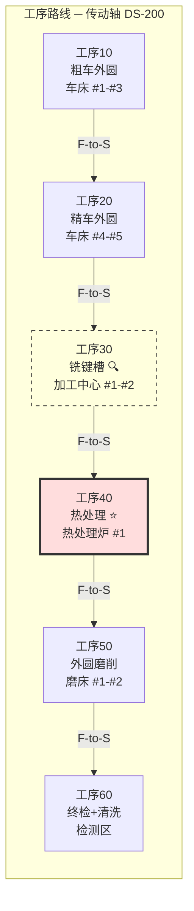
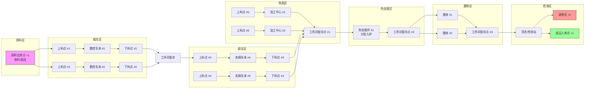
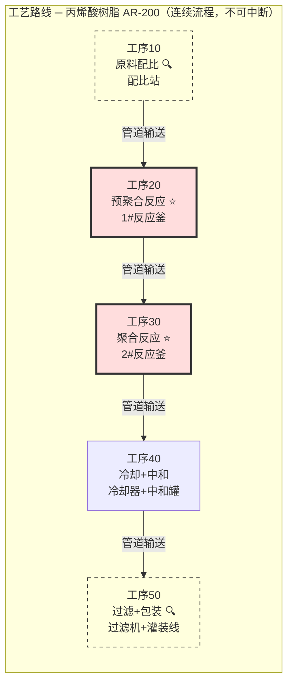
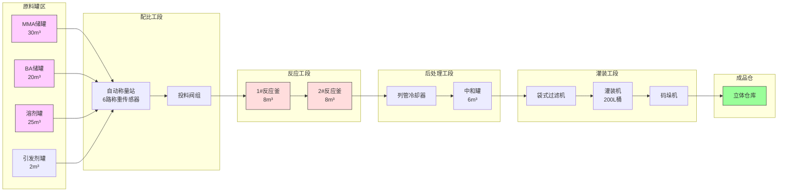
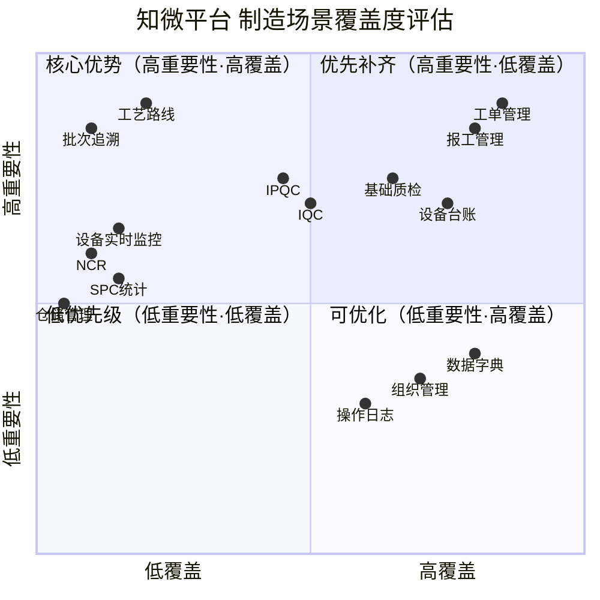
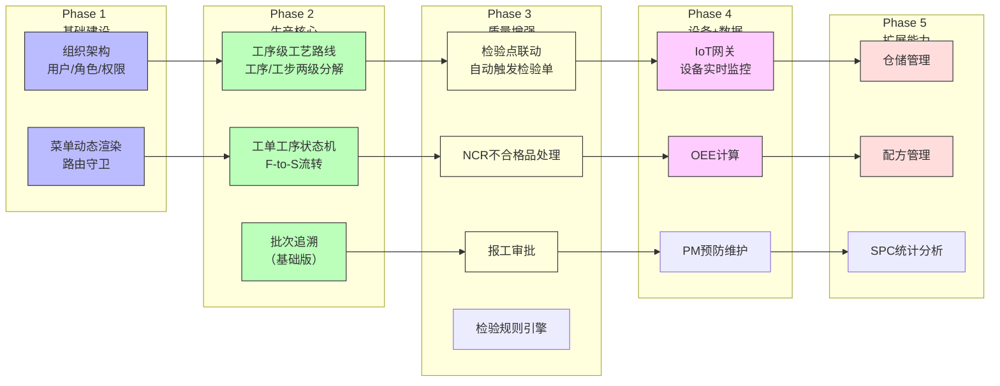

# 制造场景模拟与系统覆盖度评审

> **文档目的**：通过离散型制造（汽车零部件）和流程型制造（精细化工）两个典型场景的完整模拟，验证知微 SaaS 平台对制造业务需求的覆盖度，识别功能缺口，明确优先级。
>
> **前置文档**：`tenant-sysadmin-design-v2.md`（租户/组织/角色/权限设计）、`data-routing-integrated-design.md`（数据架构）

---

## 1. 行业定位

知微 SaaS 平台的目标覆盖范围：

| 维度 | 主攻方向 | 兼顾方向 | 说明 |
|------|---------|---------|------|
| **制造类型** | 离散型制造 | 流程型制造 | 以汽车零部件、机械装备、电子组装为切入点，逐步覆盖化工/制药/食品 |
| **企业规模** | 中小型（100-500人） | 大型集团（子租户模式） | 100-500人规模的企业数字化意愿最强、实施周期最短 |
| **核心场景** | 工单驱动+报工+质检+设备 | 配方+连续流程+能碳 | 离散型为 MVP 主场景，流程型为 Phase 2+ 扩展 |
| **地域** | 国内制造业密集区域 | — | 长三角/珠三角优先 |

**产品定位总结**：面向中小型离散制造企业的 SaaS MES 平台，提供工单管理、工艺路线、质量检测、设备管理、报工统计等核心能力，同时具备扩展到流程型制造和生产能碳管理的基础架构。

---

## 2. 离散型制造场景模拟

### 2.0 企业画像

| 维度 | 设定值 |
|------|--------|
| 企业名称 | 恒达精密制造有限公司 |
| 行业 | 汽车零部件制造 |
| 规模 | 约 300 人 |
| 产品 | 发动机支架（Engine Bracket）、传动轴（Drive Shaft） |
| 生产模式 | 多品种小批量 + 按订单生产（MTO） |
| 车间面积 | 约 5000 m² |
| 设备总数 | 约 25 台 |

### 2.1 工艺路线模拟 — 传动轴

**产品信息**：传动轴 D/T: DS-200

| 属性 | 值 |
|------|-----|
| 产品编码 | DS-200 |
| 产品名称 | 传动轴 |
| BOM 结构 | 轴体毛坯(1) + 轴承座(2) + 法兰盘(2) + 紧固件(8) |
| 总重量 | 12.5 kg |
| 批量 | 50 件/批 |
| 工艺版本 | v1.0（生效日期 2025-03-01） |

**工序10 — 粗车外圆**

| 参数 | 值 |
|------|-----|
| 工序编号 | 10 |
| 工序名称 | 粗车外圆 |
| 工作中心 | 粗车区（WC-001） |
| 设备 | 数控车床 #1 (CNC-Lathe-01)、#2 (CNC-Lathe-02)、#3 (CNC-Lathe-03) |
| 标准工时 | 准备时间 8 min + 单件加工时间 4.5 min |
| 所需工装 | 三爪自定心卡盘、顶尖 |
| 所需刀具 | 外圆粗车刀（CNMG120408），刀片寿命 120 件 |
| 所需量具 | 外径千分尺（0-50mm）、游标卡尺 |
| 质检要求 | 自检：首件必检，后续每 20 件抽检 1 件；控制尺寸 φ48±0.2mm |
| 流转规则 | F-to-S（工序10完成后进入工序20） |

**工序20 — 精车外圆**

| 参数 | 值 |
|------|-----|
| 工序编号 | 20 |
| 工序名称 | 精车外圆 |
| 工作中心 | 精车区（WC-002） |
| 设备 | 高精数控车床 #4 (CNC-Lathe-04)、#5 (CNC-Lathe-05) |
| 标准工时 | 准备时间 10 min + 单件加工时间 6.0 min |
| 所需刀具 | 外圆精车刀（DNMG150408），刀片寿命 80 件 |
| 所需量具 | 外径千分尺（25-50mm）、粗糙度对比块 |
| 质检要求 | 自检：首件必检，后续每 20 件抽检 1 件；尺寸 φ45±0.05mm，Ra≤1.6μm |
| 流转规则 | F-to-S |

**工序30 — 铣键槽（检验点 🔍）**

| 参数 | 值 |
|------|-----|
| 工序编号 | 30 |
| 工序名称 | 铣键槽 |
| 工作中心 | 铣削区（WC-003） |
| 设备 | 加工中心 #1 (MC-01)、#2 (MC-02) |
| 标准工时 | 准备时间 12 min + 单件加工时间 5.0 min |
| 所需刀具 | 键槽铣刀 φ12mm，刀片寿命 60 件 |
| 所需量具 | 键槽塞规、深度千分尺 |
| 质检要求 | **IPQC 检验点**：首检+每 20 件抽检；键槽宽度 12H9，深度 5.0±0.1mm；生成 IPQC 检验单 |
| 关键属性 | `is_inspection_point = true` — 到达此工序自动触发检验任务 |
| 流转规则 | F-to-S（检验合格方可流转至工序40） |

**工序40 — 热处理（关键工序 ⭐）**

| 参数 | 值 |
|------|-----|
| 工序编号 | 40 |
| 工序名称 | 热处理 |
| 工作中心 | 热处理区（WC-004） |
| 设备 | 热处理炉 #1 (HT-Furnace-01) |
| 标准工时 | 准备时间 20 min + 每炉加工时间 90 min（批量 50 件/炉） |
| 工艺参数 | 加热至 860°C → 保温 45min → 油淬 → 回火 400°C × 60min |
| 能源消耗 | 约 180 kWh/炉 |
| 所需工装 | 热处理料框、淬火油槽 |
| 质检要求 | **关键工序**：每炉抽检 3 件测硬度 HRC 38-42；记录炉温曲线 |
| 关键属性 | `is_critical = true` — 参数偏差直接触发质量警报 |
| 流转规则 | F-to-S（硬度合格方可流转） |

**工序50 — 外圆磨削**

| 参数 | 值 |
|------|-----|
| 工序编号 | 50 |
| 工序名称 | 外圆磨削 |
| 工作中心 | 磨削区（WC-005） |
| 设备 | 外圆磨床 #1 (Grinder-01)、#2 (Grinder-02) |
| 标准工时 | 准备时间 15 min + 单件加工时间 8.0 min |
| 所需砂轮 | 白刚玉砂轮 WA60L5V，修整频次 每 50 件 |
| 所需量具 | 外径千分尺、圆度仪 |
| 质检要求 | **IPQC 检验点**：首检+每 10 件抽检；尺寸 φ45h6（-0.016/-0.025），圆度≤0.005mm |
| 流转规则 | F-to-S |

**工序60 — 终检 + 清洗**

| 参数 | 值 |
|------|-----|
| 工序编号 | 60 |
| 工序名称 | 终检 + 清洗 |
| 工作中心 | 检测区（WC-006） |
| 设备 | 清洗机、磁粉探伤机、三坐标测量机 |
| 标准工时 | 准备时间 5 min + 单件检测时间 10 min |
| 所需量具 | 三坐标、粗糙度仪、磁粉探伤仪 |
| 质检要求 | **FQC 完工检验**：全尺寸检测 + 形位公差 + 表面粗糙度 + 磁粉探伤（裂纹检测）；逐件检验 |
| 产出 | 检验合格 → 清洗防锈 → 进入成品库；不合格 → 返修区或报废 |

### 2.2 生产点位模拟

**点位统计表**

| 点位类型 | 数量 | 说明 |
|---------|:----:|------|
| 原料出库点 | 1 | 原料仓库发料至车间 |
| 上料点 | 6 | 每个工位前一个（共 6 个工位） |
| 下料点 | 6 | 每个工位后一个 |
| 工序间暂存点 | 5 | 区域间流转缓存 |
| 返修区 | 1 | 不合格品返修 |
| 成品入库点 | 1 | 完工品入库 |
| **合计** | **20** | — |

### 2.3 设备监控点位

**数控车床（每台，共 5 台）**

| 监控项目 | 传感器/数据源 | 采集频率 | 报警阈值 |
|---------|-------------|:--------:|---------|
| 主轴转速 (RPM) | 主轴编码器 | 1s | 超限 ±10% |
| 主轴负载率 (%) | 伺服驱动器 | 1s | > 85% |
| 进给速度 (mm/min) | 伺服编码器 | 1s | 偏离设定值 |
| 主轴温度 (°C) | 温度传感器 | 10s | > 60°C |
| 主轴振动 (mm/s) | 振动传感器 | 10s | > 4.5 mm/s |
| 刀具寿命 (已加工件数) | PLC 计数 | 每件 | 接近寿命时预警 |
| 运行状态 | PLC 信号 | 实时 | 运行/待机/故障/停机 |

**加工中心（每台，共 2 台）**

| 监控项目 | 传感器/数据源 | 采集频率 | 报警阈值 |
|---------|-------------|:--------:|---------|
| 主轴负载 (%) | 伺服驱动器 | 1s | > 80% |
| 主轴转速 (RPM) | 编码器 | 1s | 偏差 ±5% |
| 主轴振动 (mm/s) | 振动传感器 | 10s | > 3.5 mm/s |
| 冷却液温度 (°C) | 温度传感器 | 30s | > 45°C |
| 冷却液流量 (L/min) | 流量计 | 30s | < 10 L/min |
| 刀库刀位状态 | PLC | 换刀时 | 刀位空/满 |
| 换刀次数累计 | PLC 计数 | 每次换刀 | > 500 次维护提醒 |

**热处理炉（1 台）**

| 监控项目 | 传感器/数据源 | 采集频率 | 报警阈值 |
|---------|-------------|:--------:|---------|
| 1区温度（预热） | 热电偶 | 5s | 偏差 ±10°C |
| 2区温度（保温） | 热电偶 | 5s | 偏差 ±5°C |
| 3区温度（冷却） | 热电偶 | 5s | 偏差 ±10°C |
| 炉膛压力 (Pa) | 压力变送器 | 10s | 超限预警 |
| 运行时间 (min) | PLC | 实时 | > 设定保温时间自动报警 |
| 能耗 (kW/h) | 电能表 | 1min | — |
| 故障报警 | PLC DI | 实时 | 超温/断偶/开门异常 |

**外圆磨床（每台，共 2 台）**

| 监控项目 | 传感器/数据源 | 采集频率 | 报警阈值 |
|---------|-------------|:--------:|---------|
| 砂轮转速 (RPM) | 编码器 | 1s | 超限 ±5% |
| 主轴负载 (%) | 伺服驱动器 | 1s | > 70% |
| 工作台进给速度 | 光栅尺 | 1s | 偏离设定值 |
| 砂轮修整次数 | PLC 计数 | 每次修整 | > 20 次更换砂轮 |

**监控点位汇总**：5 类设备 × 设备数量 = **共约 60 个实时监控测点**

### 2.4 质检点位

| 检验类型 | 检验点位置 | 检验项目 | 抽样规则 | 检验设备 | 判定标准 |
|---------|-----------|---------|---------|---------|---------|
| **IQC** | 原料入库区 | 轴体毛坯尺寸 φ50±0.5mm、材质报告核验 | 每批次抽 5 件 | 游标卡尺、光谱仪 | 尺寸/材质合格 |
| **IPQC-1** | 工序10 后（粗车） | 外径 φ48±0.2mm | 首检 + 每 20 件 | 外径千分尺 | ≤ φ48.2 ≥ φ47.8 |
| **IPQC-2** | 工序30 后（铣键槽） | 键槽宽度 12H9、深度 5.0±0.1mm、位置度 | 首检 + 每 20 件 | 键槽塞规、深度尺 | 塞规通止合格 |
| **IPQC-3** | 工序40 后（热处理） | 硬度 HRC 38-42、表面无裂纹 | 每炉抽 3 件 | 洛氏硬度计、磁粉探伤 | HRC 38-42 |
| **IPQC-4** | 工序50 后（磨削） | 外径 φ45h6、圆度 ≤0.005mm、Ra≤0.8μm | 首检 + 每 10 件 | 千分尺、圆度仪、粗糙度仪 | 全部在公差内 |
| **FQC** | 工序60（终检） | 全尺寸/形位公差/表面/磁粉探伤 | 逐件 | 三坐标、粗糙度仪、探伤仪 | 全部合格 |
| **OQC** | 成品发货区 | 包装/标识/数量/随附文件 | 每批次抽 5 件 | 目视/称重 | 包装完整/标识清晰 |

**质检点位数量**：7 个检验节点（1 IQC + 4 IPQC + 1 FQC + 1 OQC）

### 2.5 物流点位

| 物流节点 | 类型 | 说明 |
|---------|------|------|
| 原料入库 → 待检区 | 入库物流 | 供应商送货，IQC 待检 |
| 待检区 → 原料库位 | 仓储物流 | IQC 合格后上架 |
| 原料库位 → 线边仓 | 领料物流 | 按工单配料（每个工单批次配料一次） |
| 线边仓 → 各工位上料点 | 配送物流 | 人工叉车/AGV 配送至 6 个上料点 |
| 工序间流转（粗车→精车→铣削→热处理→磨削→检测） | 车间内流转 | 人工叉车或 AGV 搬运；5 个暂存点缓存 |
| 成品下线 → 待检区 | 待检物流 | FQC 待检 |
| 待检区 → 成品库位 | 入库物流 | FQC 合格后上架 |
| 成品库位 → 发货区 | 出库物流 | 按发货通知拣货出库 |

---

## 3. 流程型制造场景模拟

### 3.0 企业画像

| 维度 | 设定值 |
|------|--------|
| 企业名称 | 华源精细化工有限公司 |
| 行业 | 精细化工（特种涂料/树脂） |
| 规模 | 约 150 人 |
| 产品 | 丙烯酸树脂（AR-200）、聚氨酯涂料（PU-100） |
| 生产模式 | 大批量连续生产 + 按预测/按库存生产（MTS） |
| 工厂面积 | 约 3000 m² |
| 主要设备 | 反应釜 2 台、配比站 1 套、灌装线 1 条 |

### 3.1 工艺路线模拟 — 丙烯酸树脂

**产品信息**：丙烯酸树脂 AR-200

| 属性 | 值 |
|------|-----|
| 产品编码 | AR-200 |
| 产品名称 | 丙烯酸树脂 |
| 配方 | 甲基丙烯酸甲酯(40%) + 丙烯酸丁酯(30%) + 引发剂(2%) + 溶剂(28%) |
| 批次量 | 5000 kg/批 |
| 批号规则 | 年月日+流水号（如 AR-20250401-001） |
| 工艺版本 | v2.1（生效日期 2025-02-15） |

**工序10 — 原料配比（检验点 🔍）**

| 参数 | 值 |
|------|-----|
| 工序编号 | 10 |
| 工序名称 | 原料自动配比 |
| 工作中心 | 配料站（WC-C01） |
| 设备 | 自动称量站（含 6 路称重传感器） |
| 标准工时 | 准备时间 10 min + 称量时间 15 min/批 |
| 监控参数 | 各组分实时称重值、投料阀状态、配比偏差 |
| 质检要求 | **IPQC 检验点**：验证各组分配比精度（偏差 ≤ 0.5%），记录称量数据 |
| 流转规则 | 配比验证合格 → 管道泵送至 1#反应釜 |

**工序20 — 预聚合反应（关键工序 ⭐）**

| 参数 | 值 |
|------|-----|
| 工序编号 | 20 |
| 工序名称 | 预聚合反应 |
| 工作中心 | 反应工段（WC-C02） |
| 设备 | 1#反应釜（夹套加热/锚式搅拌/冷凝回流） |
| 标准工时 | 升温 30min + 保温 30min + 搅拌 |
| 工艺参数 | 升温至 80°C，保温 30min，搅拌转速 120rpm |
| 监控参数 | 釜内温度(上/中/下3点)、夹套温度、搅拌扭矩、釜内压力、液位 |
| 质检要求 | **关键工序**：取样测预聚物粘度（目标 500-800 mPa·s）+ 转化率（≥ 60%） |
| 关键属性 | `is_critical = true` — 温度曲线偏差自动报警 |

**工序30 — 聚合反应（关键工序 ⭐）**

| 参数 | 值 |
|------|-----|
| 工序编号 | 30 |
| 工序名称 | 聚合反应 |
| 工作中心 | 反应工段（WC-C02） |
| 设备 | 2#反应釜（夹套加热/框式搅拌/冷凝回流） |
| 标准工时 | 升温 45min + 恒温 120min + 搅拌 |
| 工艺参数 | 升温至 120°C（梯度 2°C/min），恒温 2h，搅拌转速 80rpm |
| 监控参数 | 釜内温度(上/中/下3点)、夹套温度、搅拌扭矩、pH值（在线）、釜内压力 |
| 质检要求 | **关键工序**：每批次取样测分子量(GPC) + 固含量(目标 55±2%) |
| 关键属性 | `is_critical = true` — 温度超限自动切断加热 |

**工序40 — 冷却 + 中和**

| 参数 | 值 |
|------|-----|
| 工序编号 | 40 |
| 工序名称 | 冷却 + 中和 |
| 工作中心 | 后处理工段（WC-C03） |
| 设备 | 列管冷却器 + 中和罐 |
| 标准工时 | 冷却 30min + 中和 15min |
| 工艺参数 | 降温至 40°C，加入中和剂调节 pH 至 7.0±0.5 |
| 监控参数 | 出口温度、pH 值（在线）、中和剂流量 |
| 质检要求 | 在线 pH 验证 + 离线取样复核；化验室测色度(≤50 APHA) |

**工序50 — 过滤 + 包装（检验点 🔍）**

| 参数 | 值 |
|------|-----|
| 工序编号 | 50 |
| 工序名称 | 过滤 + 包装 |
| 工作中心 | 灌装包装线（WC-C04） |
| 设备 | 袋式过滤机（5μm）+ 自动灌装机（200L/桶） |
| 标准工时 | 过滤 20min + 灌装 30min（10桶/批） |
| 监控参数 | 过滤压力、灌装重量、封口温度 |
| 质检要求 | **FQC 检验点**：粘度(2000-3000 mPa·s)、固含量(53-57%)、细度(≤30μm)、附着力、耐候性 |
| 产出 | 检验合格 → 贴标/码垛 → 成品仓；不合格 → 回炼/降级 |

### 3.2 生产点位模拟

**点位统计表**

| 点位类型 | 数量 | 说明 |
|---------|:----:|------|
| 原料储罐/料仓 | 8 | MMA/BA/溶剂/引发剂/助剂等 |
| 投料口 | 3 | 配比站投料阀组 |
| 反应釜 | 2 | 1#预聚釜 + 2#聚合釜 |
| 中间体暂存罐 | 2 | 中和后暂存 |
| 成品罐 | 3 | 灌装前暂存 |
| 灌装工位 | 2 | 双头灌装线 |
| 码垛工位 | 1 | 自动码垛 |
| **合计** | **21** | — |

### 3.3 设备监控点位

**反应釜（每台，共 2 台）**

| 监控项目 | 传感器/数据源 | 采集频率 | 报警阈值 |
|---------|-------------|:--------:|---------|
| 釜内温度-上部 | PT100 热电阻 | 2s | 偏差 ±3°C |
| 釜内温度-中部 | PT100 热电阻 | 2s | 偏差 ±3°C |
| 釜内温度-下部 | PT100 热电阻 | 2s | 偏差 ±3°C |
| 夹套温度 | PT100 热电阻 | 5s | — |
| 夹套压力 (MPa) | 压力变送器 | 5s | > 0.6 MPa |
| 搅拌转速 (rpm) | 编码器 | 2s | 偏差 ±5% |
| 搅拌扭矩 (N·m) | 扭矩传感器 | 5s | > 80% 额定扭矩 |
| 釜内压力 (kPa) | 压力变送器 | 5s | 正压 > 50kPa / 负压 < -30kPa |
| 在线 pH 值 | pH 电极 | 10s | —（仅配置在 2#釜） |
| 液位 (%) | 雷达液位计 | 5s | > 85% 高位预警 |
| 运行状态/批次号 | PLC | 实时 | — |

**配比站（1 套）**

| 监控项目 | 传感器/数据源 | 采集频率 | 报警阈值 |
|---------|-------------|:--------:|---------|
| 各组分实时重量 (kg) | 称重传感器 ×6 | 1s | 配比偏差 > 0.5% |
| 投料阀状态 | PLC DI | 实时 | 阀门故障 |
| 累计投料量 | PLC 累计 | 每批次 | 偏离配方量 ±1% |

**公用工程（车间级）**

| 监控项目 | 传感器/数据源 | 采集频率 | 报警阈值 |
|---------|-------------|:--------:|---------|
| 蒸汽压力 (MPa) | 压力变送器 | 10s | < 0.4 MPa |
| 蒸汽温度 (°C) | PT100 | 10s | < 160°C |
| 蒸汽流量 (kg/h) | 涡街流量计 | 30s | — |
| 冷却水进水温度 (°C) | PT100 | 30s | > 32°C |
| 冷却水压力 (MPa) | 压力变送器 | 30s | < 0.2 MPa |
| 压缩空气压力 (MPa) | 压力变送器 | 30s | < 0.5 MPa |
| 氮气纯度 (%) | 氧分析仪 | 1min | < 99.5% |
| 氮气压力 (MPa) | 压力变送器 | 30s | < 0.3 MPa |

**监控点位汇总**：反应釜 22 测点 + 配比站 8 测点 + 公用工程 8 测点 = **共约 38 个实时监控测点**

### 3.4 质检点位

| 检验类型 | 检验点位置 | 检验项目 | 抽样规则 | 方法/设备 | 判定标准 |
|---------|-----------|---------|---------|----------|---------|
| **IQC** | 原料入厂 | 纯度/外观/水分 | 每槽车/每桶 | 化验室滴定/色谱 | 符合原料规格书 |
| **IPQC-1** | 工序20 后（预聚） | 粘度 500-800mPa·s、转化率 ≥60% | 每批次取样 | 旋转粘度计、烘箱法 | 粘度/转化率双合格 |
| **IPQC-2** | 工序30 后（聚合） | 分子量分布、固含量 55±2% | 每批次取样 | GPC、烘箱法 | 分子量在控制范围 |
| **IPQC-3** | 工序40 后（中和） | pH 7.0±0.5、色度 ≤50APHA | 在线+离线双验证 | pH计、比色计 | 在线与离线一致 |
| **FQC** | 工序50（成品） | 固含量 53-57%、粘度 2000-3000mPa·s、细度 ≤30μm、附着力、耐候性 | 每批次 | 粘度计/细度计/附着力试验 | 全部指标合格 |

**质检点位数量**：5 个检验节点（1 IQC + 3 IPQC + 1 FQC；流程型无 OQC，以 FQC 作为出厂放行依据）

### 3.5 物流点位

| 物流节点 | 类型 | 说明 |
|---------|------|------|
| 原料槽车/桶装 → 原料罐区 | 入库 | 泵送/叉车卸货至指定储罐 |
| 原料罐区 → 配比站 | 管道输送 | 管线 + 泵组输送（无物理搬运） |
| 配比站 → 1#反应釜 | 管道输送 | 重力/泵送 |
| 1#反应釜 → 2#反应釜 | 管道输送 | 重力/泵送 |
| 2#反应釜 → 冷却器 → 中和罐 | 管道输送 | 重力/泵送 |
| 中和罐 → 过滤机 → 灌装机 | 管道输送 | 重力/泵送 |
| 灌装 → 封口 → 贴标 → 码垛 | 包装物流 | 自动灌装线 |
| 码垛 → 立体仓库 | 成品入库 | 叉车/AGV |
| 立体仓库 → 发货区 | 成品出库 | 叉车 |

> **流程型物流特点**：工序间全部为管道/传送带输送，无中间半成品物理搬运、无暂存点。物流核心在"原料入库"和"成品出库"两端。

---

## 4. 系统覆盖度评审

### 4.1 工艺路线模块覆盖度

| 场景需求 | 离散需求 | 流程需求 | 系统现状 | 缺口分析 | 优先级 |
|---------|:--------:|:--------:|:--------:|---------|:------:|
| 工序级管理 | ✅ | ✅ | ⚠️ 工单表有 `process_route` 字段存储路线 JSON | 字段级存储而非表级模型，不支持结构化查询和版本管理 | **P0** |
| 工序/工步两级分解 | ✅ | ⚠️ | ❌ 未实现两级分解模型 | 需新建 `process_steps` 表（工序）+ `process_operations` 表（工步），支持工序级父子关系 | **P0** |
| 工艺路线版本管理 | ✅ | ✅ | ❌ 未实现 | 需新增 `process_routes` 表 + 版本号字段，支持版本生效日期 | **P0** |
| 关键工序标记 | ✅ | ✅ | ❌ | 新增 `process_steps.is_critical` 字段（布尔） | **P1** |
| 检验节点自动生成检验单 | ✅ | ✅ | ❌ | 新增 `process_steps.is_inspection_point` 字段；工序到达自动触发质检任务 | **P1** |
| 串行流转控制(F-to-S) | ✅ | ✅ | ❌ | 需工序状态机（待产→生产中→完工→检验→流转），控制前道未完工时后道不可开工 | **P1** |
| 并行/分流流转 | ✅ | ❌ | ❌ | 同一工序多设备并行加工 | **P1** |
| 配方管理（含 BOM% 比例） | ❌ | ✅ | ❌ | 需独立配方模块，支持成分百分比 + 允差范围 + 版本管理 | **P2** |
| 批次追踪（批号生成+追溯） | ✅ | ✅ | ⚠️ 工单有批次概念但无独立批号管理 | 需批号规则引擎、批次谱系链（批次→原料批次→工单→设备→人员） | **P0** |
| 设备-工序绑定 | ✅ | ✅ | ❌ | 需新增 `process_steps.work_center_id` 字段，支持一个工序多设备 | **P1** |
| S-to-S 流转 | ❌ | ✅ | ❌ | 紧耦合流水线模式，前道开始后道即可开始 | **P2** |

### 4.2 质检模块覆盖度

| 场景需求 | 离散需求 | 流程需求 | 系统现状 | 缺口分析 | 优先级 |
|---------|:--------:|:--------:|:--------:|---------|:------:|
| IQC（来料检验） | ✅ | ✅ | ✅ 已有质控点 + 检验标准 API | ⚠️ 需对接采购订单/入库单，当前质检与采购/仓储无关联 | **P1** |
| IPQC（过程检验） | ✅ | ✅ | ✅ 已有检验单基础 API | ⚠️ 需与工序路由联动（工序到达自动触发对应检验标准），当前 IPQC 需手动触发 | **P1** |
| FQC（完工检验） | ✅ | ✅ | ✅ 已有检验单基础 API | ⚠️ 需关联生产批次/工单完工状态 | **P1** |
| OQC（出货检验） | ✅ | ❌ | ❌ 无 OQC 概念 | 需新增出货检验单类型 + 关联发货通知 | **P2** |
| SPC 统计分析 | ✅ | ✅ | ❌ 无统计模块 | 需控制图（X-bar/R/p） + 过程能力指数(Cp/Cpk) 计算 | **P1** |
| 首检+巡检+抽检规则引擎 | ✅ | ❌ | ❌ | 需可配置的检验规则（频率/抽样量/判定基准），支持按工序/设备/产品配置 | **P1** |
| 在线质检（pH/温度） | ❌ | ✅ | ❌ | 需对接 DCS/PLC 实时数据，在线数据直接写入检验记录 | **P2** |
| 不合格品处理(NCR) | ✅ | ✅ | ❌ | 需 NCR 全流程（发现→隔离→评审→处置→验证关闭），支持返工/返修/报废/让步接收 | **P1** |
| 检验量具管理 | ✅ | ✅ | ❌ | 量具台账 + 校准计划 + 校准记录 | **P2** |

### 4.3 设备监控模块覆盖度

| 场景需求 | 离散需求 | 流程需求 | 系统现状 | 缺口分析 | 优先级 |
|---------|:--------:|:--------:|:--------:|---------|:------:|
| 设备台账 | ✅ | ✅ | ✅ 已有 `equipment` 表 + CRUD API | 基本满足，需补充设备分类/技术参数等扩展字段 | ✅ 基本就绪 |
| 设备状态监控 | ✅ | ✅ | ❌ 无实时数据接入 | 需 IoT 网关（Modbus/OPC UA/MQTT）接入 PLC/DCS 数据；实时展示运行/待机/故障/停机状态 | **P1** |
| OEE 计算 | ✅ | ✅ | ❌ | 需设备运行时间 + 计划运行时间 + 合格品数量三个数据源联动计算：可用性×性能×质量 | **P1** |
| 预防性维护(PM) | ✅ | ✅ | ❌ | 维护计划（日历/运行时长触发）+ 维护工单 + 维护记录 | **P1** |
| 备件管理 | ✅ | ⚠️ | ⚠️ 有 `spare_parts` 表 | 需补充备件领用/消耗/库存预警；流程型企业备件需求较低 | **P2** |
| DCS 数据接入 | ❌ | ✅ | ❌ | 需 DCS/PLC 网关（OPC UA Server 对接），当前能碳模块已有 IoT 基础可复用 | **P2** |
| 设备维保履历 | ✅ | ✅ | ❌ | 维护历史记录 + 故障记录 + 维修工单闭环 | **P1** |

### 4.4 物流/仓储覆盖度

| 场景需求 | 离散需求 | 流程需求 | 系统现状 | 缺口分析 | 优先级 |
|---------|:--------:|:--------:|:--------:|---------|:------:|
| 原料入库/出库 | ✅ | ✅ | ❌ 仓储模块完全缺失 | 全链路缺失：收货→质检→上架→拣料→出库 | **P2** |
| 线边仓管理 | ✅ | ❌ | ❌ | 离散型关键需求：线边仓库存、补货预警 | **P2** |
| 半成品周转 | ✅ | ❌ | ❌ | 工序间暂存点管理、周转批次追踪 | **P2** |
| 成品入库/出库 | ✅ | ✅ | ❌ | 成品入库→质检→上架→发货拣选→出库 | **P2** |
| 批次/序列号追溯 | ✅ | ✅ | ❌ | 全程追溯链：原料批次→工单→工序→设备→人员→成品批次 | **P0** |
| 库存看板 | ✅ | ✅ | ❌ | 实时库存可视化 | **P2** |

### 4.5 工单/报工覆盖度

| 场景需求 | 离散需求 | 流程需求 | 系统现状 | 缺口分析 | 优先级 |
|---------|:--------:|:--------:|:--------:|---------|:------:|
| 工单创建/派工 | ✅ | ✅ | ✅ 已有 `work_orders` 表 + API | 基本满足 | ✅ 就绪 |
| 工单工序流转 | ✅ | ⚠️ | ❌ | 工单级管理已有，工序级状态机缺失 | **P0** |
| 工单报工 | ✅ | ✅ | ✅ 已有 `work_reports` API | 基本满足，需增加工序级报工支持 | ✅ 就绪 |
| 报工审批 | ✅ | ⚠️ | ❌ | 部门主管需审批报工（离散型批量报工后审批；流程型以批次完工报告为准） | **P1** |
| 工时统计 | ✅ | ✅ | ⚠️ 有基础统计 | 需增加按工序/人员/设备汇总工时 | **P1** |
| 批次完工报告 | ❌ | ✅ | ❌ | 流程型专用：批次生产记录汇总（含温度曲线/检验数据/物料消耗） | **P2** |

### 4.6 系统覆盖度综合图

---

## 5. 结论与建议

### 5.1 完全覆盖的场景（系统当前已满足）

| 场景 | 说明 | 对应模块 |
|------|------|---------|
| 工单创建与派工 | `work_orders` 表的 CRUD + 状态管理 | 工单管理 |
| 工单报工 | `work_reports` 提交 + 工时记录 | 报工管理 |
| 设备台账管理 | `equipment` 表的 CRUD + 设备分类 | 设备管理 |
| 基础质检 | 检验单创建 + 检验项 + 合格判定 | 品质管理 |
| 数据字典 | 字典类型 + 字典项维护 | 系统管理 |
| 组织架构（权限层） | `organizations` 表就绪（v2 设计） | 组织管理 |

### 5.2 需要扩展的场景（按优先级）

**P0 — 核心生产流程必备（产品差异化关键）**

| 需求 | 估算工作量 | 前置依赖 | 建议 Phase |
|------|-----------|---------|:---------:|
| **工序级工艺路线管理**：`process_routes` 表 + `process_steps` 表 + 工序/工步分解 + 版本控制 | 5-7 天 | 无 | Phase 2 |
| **批次全程追溯**：批号规则 + 批次谱系链（原料→工单→工序→设备→人员→成品） | 3-5 天 | 工序管理就绪 | Phase 2.5 |
| **工单工序状态机**：待产→生产中→完工→检验→流转；F-to-S 控制 | 3-4 天 | 工序管理就绪 | Phase 2.5 |

**P1 — 制造执行质量提升**

| 需求 | 估算工作量 | 建议 Phase |
|------|-----------|:---------:|
| 关键工序标记 + 检验节点联动 | 2-3 天 | Phase 3 |
| IPQC 与工序路由联动（工序到达自动触发检验标准） | 2-3 天 | Phase 3 |
| NCR 不合格品处理流程 | 3-5 天 | Phase 3 |
| 首检+巡检+抽检规则引擎 | 3-4 天 | Phase 3.5 |
| SPC 统计分析（控制图 + Cp/Cpk） | 3-5 天 | Phase 3.5 |
| 设备状态实时监控（IoT 数据接入） | 5-8 天 | Phase 4 |
| OEE 计算 | 2-3 天 | Phase 4 |
| 预防性维护(PM) | 3-4 天 | Phase 4 |
| 报工审批流程 | 2-3 天 | Phase 3 |

**P2 — 增强功能**

| 需求 | 说明 | 建议 Phase |
|------|------|:---------:|
| 仓储管理（原料/成品/线边仓） | 独立仓储模块，可与后续 WMS 集成 | Phase 5 |
| 配方管理（流程型专用） | 独立配方模块，支持百分比+版本 | Phase 5+ |
| DCS/PLC 深度集成 | 打通 DCS 数据到质检/设备监控/能碳 | Phase 5+ |
| OQC 出货检验 | 发货前最终检验 | Phase 5 |
| 量具管理 | 量具台账+校准计划 | Phase 5+ |
| S-to-S 流转模式 | 紧耦合流水线 | Phase 5+ |

### 5.3 不在当前规划范围内的场景

| 场景 | 说明 | 建议引入时机 |
|------|------|-------------|
| **APS 高级排程** | 基于约束的自动排程，涉及复杂算法 | 用户规模 > 50 工单/天时引入 |
| **MES-PLM 集成** | 与 PLM 系统的 EBOM → MBOM 同步 | 客户明确需求时引入 |
| **全流程追溯（条码/RFID）** | 依赖硬件投入（条码打印机/RFID 读写器/工位扫码枪） | 硬件方案确定后引入 |
| **3D 数字孪生** | 工厂 3D 建模 + 设备实时映射 | 阶段 3+ 后考虑 |
| **AI 质检（机器视觉）** | 基于摄像头+AI 的表面缺陷检测 | 客户明确需求且已完成基础数字化 |

### 5.4 推荐实施路线

---

## 附录 A：场景模拟数据汇总

| 统计项 | 离散型（汽车零部件） | 流程型（精细化工） |
|-------|:------------------:|:-----------------:|
| 产品 | 传动轴 DS-200 | 丙烯酸树脂 AR-200 |
| 工序数 | 6 | 5 |
| 工步数 | 13 | —（连续流程无工步概念） |
| 设备数 | 10 台 | 2 釜 + 1 配比站 + 1 灌装线 |
| 监控测点数 | ~60 | ~38 |
| 质检节点数 | 7 | 5 |
| 物流节点数 | 12 | 8 |
| 生产点数 | 20 | 21 |
| 批次量 | 50 件 | 5000 kg |
| 标准工时/批 | ~45h（6 工序串行） | ~5h（连续流程） |

## 附录 B：与相关文档的映射关系

| 本文章节 | 关联文档 | 说明 |
|---------|---------|------|
| 组织树与权限模型 | `tenant-sysadmin-design-v2.md` 第2-4章 | 岗位角色（operator/department_head/scheduler等）的制造场景实例化 |
| 质检 API | `data-routing-integrated-design.md` 质检管线 | IQC/IPQC/FQC 的数据流转路径已定义 |
| 设备数据 | `data-routing-integrated-design.md` 设备管线 | 设备监控测点的数据采集路由已定义 |
| 能碳测点 | `data-routing-integrated-design.md` 能碳管线 | 热处理炉能耗/公用工程能耗的采集已定义 |
