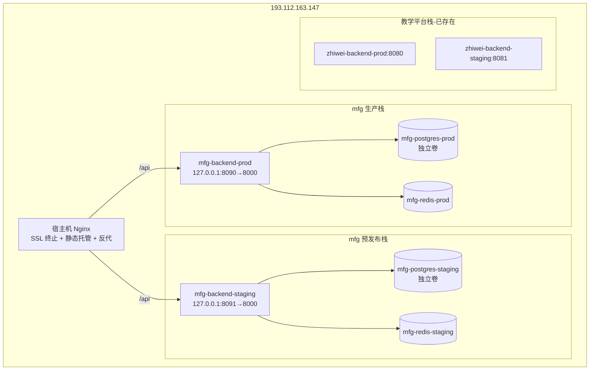

# mfg.ziwi.cn 线上预发布环境与生产环境部署规划

> 文档类型：部署规划 / Runbook（方案稿，待评审）
> 生成日期：2026-07-09
> 目标服务器：`193.112.163.147`（Ubuntu 22.04.5，腾讯云 CVM）
> 范围：制造 SaaS 平台（mfg.ziwi.cn）的 **预发布（staging）+ 生产（prod）** 双环境部署
> 状态：⚠️ **仅规划，未执行任何云端写入操作**

---

## 0. 重要前提与现状澄清（务必先读）

排查服务器后发现一个**关键事实**，直接影响方案设计：

| 项目 | 现状 |
|:-----|:-----|
| 服务器上正在运行的 Docker 栈（`zhiwei-*-prod` / `zhiwei-*-staging`，8 个容器） | 实际是 **教学平台（school 系统）**，compose 头明确写"知微教学平台"，代码来自 `ziwi_school` 仓库；前端 dist 在 `/opt/zhiwei/code/frontend/dist`，由宿主机 nginx 托管 |
| `mfg.ziwi.cn` 当前状态 | 仅有一个 nginx 占位配置（`root /var/www/html`），返回 403；**制造 SaaS 尚未部署**，后端容器不存在 |
| `mfg.ziwi.cn` 证书 | ✅ 已存在且有效（`/etc/nginx/ssl/mfg.ziwi.cn.crt`，acme.sh 签发 2026-06-26，到期 2026-09-24） |
| `admin.mfg.ziwi.cn` 等子域 | ❌ 无 DNS 记录、无 nginx 配置 |

**结论**：你之前说的"school 有预发布+生产"= 服务器上那套 `zhiwei-*` Docker；而 **mfg（制造 SaaS）需要本次从零规划部署**。两者是**不同代码库、不同域名体系**，必须作为独立栈共存于同一台服务器，端口/容器名/卷都要隔离，避免冲突。

> 📌 **2026-07-09 补充决策**：用户确认——预发布环境用 `mfg1.ziwi.cn`（**纯 HTTP，不配 SSL**），生产环境用 `mfg.ziwi.cn`（配 SSL）。SSL/域名/DNS/nginx 各节已据此更新。

---

## 1. 目标架构总览

制造 SaaS 由 3 个可独立构建的部件组成（已在本地代码确认）：

| 部件 | 本地路径 | 技术 | 对应域名（V2.1） |
|:-----|:--------|:----|:----------------|
| 后端 API | `backend/`（含 `Dockerfile`，uvicorn :8000） | FastAPI + Python 3.13 | 各端 `/api` 反代 |
| 用户端前端 | `frontend/`（Vue3 + Vite） | 租户用户工作台 | `{tenant}.cloud.ziwi.cn` |
| 管理端前端 | `admin/`（Vue3 + Vite） | SaaS 管理端 + 租户管理端 | `admin.mfg.ziwi.cn` / `manage.mfg.ziwi.cn` |

### 1.1 域名与环境映射

**环境根域（已确认）**：
- 预发布（staging）：`mfg1.ziwi.cn` —— **纯 HTTP，不配 SSL**
- 生产（prod）：`mfg.ziwi.cn` —— HTTPS（需 SSL 证书）

**预发布（mfg1.ziwi.cn，单域 + 路径路由，无 SSL）**：

| 路径 | 服务内容 | 后端反代目标 |
|:----|:--------|:-------------|
| `/` | 制造线门户/落地页 | （静态） |
| `/admin/` | SaaS 平台管理端 | `127.0.0.1:8091` |
| `/manage/` | 租户管理端 | `127.0.0.1:8091` |
| `/app/` | 租户用户端（演示租户） | `127.0.0.1:8091` |
| `/api/` | 后端 API | `127.0.0.1:8091` |

**生产（mfg.ziwi.cn，按 V2.1 子域路由，HTTPS）**：

| 域名 | 服务内容 | 后端反代目标 |
|:----|:--------|:-------------|
| `mfg.ziwi.cn` | 制造线门户/落地页 | （静态） |
| `admin.mfg.ziwi.cn` | SaaS 平台管理端 | `127.0.0.1:8090` |
| `manage.mfg.ziwi.cn` | 租户管理端 | `127.0.0.1:8090` |
| `{tenant}.cloud.ziwi.cn` | 租户用户端 | `127.0.0.1:8090` |

> ⚠️ **待确认**：生产环境子应用沿用 V2.1 子域策略（上表），还是也改为 `mfg.ziwi.cn` 下的路径路由（如 `mfg.ziwi.cn/admin/`）？子域策略需通配符证书，路径策略只需 `mfg.ziwi.cn` 单证书（更简单）。见第 9 节。
> 注：`{tenant}` 为动态租户标识（如 `acme.cloud.ziwi.cn`）。

### 1.2 容器拓扑（Mermaid）



### 1.3 端口分配（避免与 school 栈冲突）

| 服务 | school 已占 | mfg 生产 | mfg 预发布 |
|:-----|:-----------|:--------|:----------|
| 后端映射（宿主机→容器） | 8080 / 8081 | **8090 → 8000** | **8091 → 8000** |
| PostgreSQL | 容器内 5432 | 容器内 5432（独立卷，不暴露宿主机） | 容器内 5432（独立卷） |
| Redis | 容器内 6379 | 容器内 6379（独立卷） | 容器内 6379（独立卷） |

> ⚠️ 制造后端 Dockerfile **硬编码 `--port 8000`**，容器内端口固定为 8000（不像 school 用 `PORT` 环境变量）。映射必须写 `宿主机:8000`，不是 `宿主机:8080`。

---

## 2. 环境隔离设计

| 维度 | 生产（prod） | 预发布（staging） |
|:-----|:------------|:-----------------|
| Docker Compose 项目名 | `mfg-prod` | `mfg-staging` |
| 容器名前缀 | `mfg-*-prod` | `mfg-*-staging` |
| 数据库名 | `mfg_prod` | `mfg_staging` |
| 数据卷 | `mfg_postgres_data_prod` / `mfg_redis_data_prod` | `mfg_postgres_data_staging` / `mfg_redis_data_staging` |
| JWT_SECRET | 独立随机值（`.env`） | 独立随机值（`.env.staging`） |
| 构建源 | 发布分支 / 特定 tag | 主干或预发布分支 |
| 租户隔离 | 应用层 `tenant_id` 行级隔离（沿用现有 MultiTenantRepository） | 同左，独立库 |

> 预发布与生产**数据库完全物理隔离**（独立容器 + 独立卷），杜绝误删生产数据。

---

## 3. 域名与 DNS 规划

需在 DNS 解析（ziwi.cn 域名控制台）新增/确认以下 **A 记录**，全部指向 `193.112.163.147`：

| 主机记录 | 类型 | 值 | 用途 | SSL |
|:---------|:----|:---|:-----|:----|
| `mfg` | A | 193.112.163.147 | 生产门户（已有证书） | ✅ 需 |
| `admin.mfg` | A | 193.112.163.147 | 生产 SaaS 管理端 | ✅ 需 |
| `manage.mfg` | A | 193.112.163.147 | 生产租户管理端 | ✅ 需 |
| `*.cloud` | A | 193.112.163.147 | 生产租户用户端通配 | ✅ 需 |
| `mfg1` | A | 193.112.163.147 | **预发布环境（单域，纯 HTTP）** | ❌ 不需要 |

> 预发布 `mfg1.ziwi.cn` 纯 HTTP，无需证书、无需子域；生产沿用 V2.1 子域体系。
> 若生产子应用改走路径路由（见第 9 节），则只需 `mfg` 一条 A 记录 + 单证书。

---

## 4. SSL 证书策略

**预发布 `mfg1.ziwi.cn` 不配 SSL**（纯 HTTP），因此证书只需覆盖**生产环境**。

若生产沿用 V2.1 子域策略，规划 **2 张通配符证书**，全部走 acme.sh + DNS-01（腾讯云 DNSPod API，已在 crontab 配 `TENCENT_SECRETID/KEY`，但明文存于 crontab，**建议轮换**）：

| 证书 | 涵盖域名 | 申请命令（示例） |
|:----|:--------|:----------------|
| Cert A | `mfg.ziwi.cn` + `*.mfg.ziwi.cn` | `acme.sh --issue --dns dns_dp -d mfg.ziwi.cn -d '*.mfg.ziwi.cn'` |
| Cert B | `*.cloud.ziwi.cn` | `acme.sh --issue --dns dns_dp -d '*.cloud.ziwi.cn'` |

若生产子应用改走 `mfg.ziwi.cn` 路径路由（见第 9 节），则**只需 1 张证书**：`mfg.ziwi.cn` + `*.mfg.ziwi.cn`（Cert A），`*.cloud.ziwi.cn` 可暂缓。

- 已存在 `49 21 * * *` 的 `acme.sh --cron` 自动续期任务，新增证书会被自动纳入续期。
- nginx 证书路径统一到 `/etc/nginx/ssl/`：
  - `/etc/nginx/ssl/mfg.ziwi.cn.fullchain.crt` + `.key`
  - `/etc/nginx/ssl/cloud.ziwi.cn.fullchain.crt` + `.key`

---

## 5. Nginx 路由方案

### 5.1 预发布（mfg1.ziwi.cn，纯 HTTP，路径路由）

单 server block，按路径区分子应用，静态 dist 由宿主机 nginx 托管，`/api` 反代到预发布后端（8091）：

```nginx
# /etc/nginx/sites-available/mfg1.ziwi.cn （预发布，无 SSL）
server {
    listen 80;
    server_name mfg1.ziwi.cn;

    # 门户
    location = / { root /var/www/mfg/staging/portal; index index.html; try_files /index.html =404; }

    # SaaS 管理端
    location /admin/ { alias /var/www/mfg/staging/admin/; try_files $uri $uri/ /admin/index.html; }

    # 租户管理端
    location /manage/ { alias /var/www/mfg/staging/manage/; try_files $uri $uri/ /manage/index.html; }

    # 租户用户端（演示租户）
    location /app/ { alias /var/www/mfg/staging/frontend/; try_files $uri $uri/ /app/index.html; }

    # 后端 API
    location /api/ {
        proxy_pass http://127.0.0.1:8091/api/;
        proxy_set_header Host $host;
        proxy_set_header X-Real-IP $remote_addr;
        proxy_set_header X-Forwarded-For $proxy_add_x_forwarded_for;
    }
}
```

> ⚠️ 路径路由下，前端构建需设置 `base`/`publicPath` 为对应前缀（`/admin/`、`/manage/`、`/app/`），否则资源 404；Vue Router 需用 `createWebHistory('/admin/')` 等。

### 5.2 生产（mfg.ziwi.cn，HTTPS，子域路由）

每个子域一个 server block（沿用原方案）：

```nginx
# /etc/nginx/sites-available/mfg.ziwi.cn （生产）
server { listen 80; server_name mfg.ziwi.cn admin.mfg.ziwi.cn manage.mfg.ziwi.cn; return 301 https://$host$request_uri; }

server {
    listen 443 ssl http2;
    server_name admin.mfg.ziwi.cn manage.mfg.ziwi.cn;
    ssl_certificate     /etc/nginx/ssl/mfg.ziwi.cn.fullchain.crt;
    ssl_certificate_key /etc/nginx/ssl/mfg.ziwi.cn.key;
    root /var/www/mfg/admin; index index.html;
    location / { try_files $uri $uri/ /index.html; }
    location /api/ { proxy_pass http://127.0.0.1:8090/api/;
        proxy_set_header Host $host; proxy_set_header X-Real-IP $remote_addr;
        proxy_set_header X-Forwarded-For $proxy_add_x_forwarded_for;
        proxy_set_header X-Forwarded-Proto $scheme; }
}

server {
    listen 443 ssl http2;
    server_name mfg.ziwi.cn;
    ssl_certificate     /etc/nginx/ssl/mfg.ziwi.cn.fullchain.crt;
    ssl_certificate_key /etc/nginx/ssl/mfg.ziwi.cn.key;
    root /var/www/mfg/portal; index index.html;
    location / { try_files $uri $uri/ /index.html; }
}

server {
    listen 443 ssl http2;
    server_name ~^(?<tenant>[^.]+)\.cloud\.ziwi\.cn$;
    ssl_certificate     /etc/nginx/ssl/cloud.ziwi.cn.fullchain.crt;
    ssl_certificate_key /etc/nginx/ssl/cloud.ziwi.cn.key;
    root /var/www/mfg/frontend; index index.html;
    location / { try_files $uri $uri/ /index.html; }
    location /api/ { proxy_pass http://127.0.0.1:8090/api/;
        proxy_set_header Host $host; proxy_set_header X-Real-IP $remote_addr;
        proxy_set_header X-Forwarded-For $proxy_add_x_forwarded_for;
        proxy_set_header X-Forwarded-Proto $scheme; }
}
```

> 部署目录约定：`/var/www/mfg/{admin,frontend,portal}/`（生产）与 `/var/www/mfg/staging/{admin,frontend,portal}/`（预发布）。
> 若生产改走路径路由，则合并为单 server block（同 5.1 结构，端口改 8090、加 SSL）。

---

## 6. 部署流水线（Deploy Workflow）

沿用 school 栈已有的 `.deploy_snapshots` 回滚机制，新增 mfg 专属目录 `/opt/mfg/code/`。

### 6.1 构建

| 部件 | 构建方式 | 说明 |
|:-----|:--------|:----|
| 后端镜像 | `docker build -t mfg-backend:${TAG} backend/` | 已有 Dockerfile，直接可用 |
| 用户端 dist | `npm run build`（frontend/）→ 产物 `dist/` | 需在**有 node 的环境**构建（服务器此前 `node:20-alpine` 拉取失败，docker.io 超时） |
| 管理端 dist | `npm run build`（admin/）→ 产物 `dist/` | 同上 |

> **构建位置决策**（见第 9 节）：方案 A 本地构建后 scp 到服务器；方案 B 服务器装 Node 后构建；方案 C 接入 CI（GitHub Actions）。当前服务器直连 docker.io 不稳定，**推荐方案 A 或 C**。

### 6.2 部署步骤（每次发版）

1. 打快照：`cp -r /opt/mfg/code /var/www/.deploy_snapshots/mfg-$(date +%Y%m%d-%H%M%S)`（回滚用）
2. 构建并推送镜像（或本地 build 后 load）
3. 更新 `.env` / `.env.staging` 中的 `JWT_SECRET`、`DATABASE_URL` 等
4. `cd /opt/mfg/code/deploy && docker compose -f docker-compose.prod.yml up -d`（生产）
5. 上传 frontend/admin 的 `dist/` 到 `/var/www/mfg/{admin,frontend,portal}/`
6. 写入 nginx server block → `ln -s` 到 `sites-enabled/` → `nginx -t && nginx -s reload`
7. 健康检查：`curl -f http://127.0.0.1:8090/health`（后端 HEALTHCHECK 端点）

### 6.3 回滚

- 镜像回滚：`docker compose -f docker-compose.prod.yml up -d --force-recreate`（用上一 tag）
- 前端回滚：从 `.deploy_snapshots/<ts>/` 恢复对应 `dist/`
- nginx 回滚：从 `nginx-backup-<时间戳>/` 恢复配置

---

## 7. 资源评估与风险

服务器现状：内存 3.6G（已用 1.6G，可用 ~1.7G）、磁盘 40G（用 19G）、Swap 4G。

**风险点**：school 栈已占 8 个容器；新增 mfg 双环境若照搬 school 全量（backend+postgres+redis+ai-service ×2 = 8 容器），内存将吃紧，可能触发 OOM。

**缓解建议**：
- mfg 预发布环境 **postgres 限 512M**、后端限 512M~1G；生产环境按 school 配（postgres 1G）
- **评估 mfg 是否需要 ai-service**：制造 SaaS 核心为 MES/能碳/质量，AI 非必需；若不需要，**staging 与生产都不起 ai-service 容器**（省 2 容器 + 内存）
- 生产环境后端可参考 school 设 `memory: 1G` 上限；预发布设 512M
- 定期 `docker image prune` / `docker builder prune` 回收已用 5.7G 的 build cache

---

## 8. 前置条件 Checklist（Prerequisites）

| 项 | 状态 | 说明 |
|:---|:----:|:----|
| 后端 `Dockerfile` | ✅ | `backend/Dockerfile` 可用 |
| 用户端前端构建配置 | ✅ | `frontend/package.json` + `vite.config.ts` |
| 管理端前端构建配置 | ✅ | `admin/package.json` + `vite.config.ts` |
| 前端 Dockerfile | ❌ | 前端以静态 dist 托管（同 school），**不需要** Dockerfile |
| mfg 专属 compose 文件 | ❌ | 需新建 `docker-compose.prod.yml` / `.staging.yml`（仿 school 结构，改端口/卷/库名） |
| 服务器上 mfg 代码目录 | ❌ | 需建 `/opt/mfg/code`（git clone 或 scp 本地代码） |
| DNS 记录 | ❌ | 第 3 节 8 条 A 记录待添加 |
| 通配符证书 | ❌ | 第 4 节 2 张证书待签发 |
| nginx server block | ❌ | 第 5 节配置待写入 |
| 构建环境（node） | ⚠️ | 服务器 docker.io 访问不稳，建议本地/CI 构建 |

---

## 9. 待你确认的关键决策（Decisions Needed）

已确认：预发布 `mfg1.ziwi.cn` 纯 HTTP 不配 SSL；生产 `mfg.ziwi.cn` 配 SSL。剩余待确认：

1. **生产子应用路由方式**：沿用 V2.1 子域（`admin.mfg.ziwi.cn` 等，需通配符证书）✅ / 还是改走 `mfg.ziwi.cn` 路径路由（`/admin/` 等，只需单证书，更简单）？ —— **影响证书数量**
2. **前端构建位置**：本地构建 scp（A）/ 服务器装 Node 构建（B）/ 接 CI（C）？
3. **mfg 是否需要 ai-service 容器**？不需要则双环境各省 1 容器、省内存。
4. **端口方案**：生产 8090、预发布 8091 是否 OK？（避免与 school 8080/8081 冲突）
5. **数据库初始化**：首次部署是否跑 Alembic 迁移 + 种子数据？种子参考 `alpha_seed.py`？

---

## 10. 后续执行步骤大纲（评审通过后）

1. 添加 DNS 记录（第 3 节）
2. 签发通配符证书（第 4 节），校验有效期
3. 在 `/opt/mfg/code` 部署代码 + 新建 compose 文件（第 2/8 节）
4. 构建后端镜像 + 前端 dist（第 6.1 节）
5. 启动 mfg 双栈容器（`docker compose up -d`）
6. 写入 nginx 配置、reload、公网验证各域名证书匹配 + `/health` 通过
7. 跑数据库迁移 + 种子（若确认）
8. 输出部署验证报告

> 全程每步均为低风险操作，reload 前必 `nginx -t`，数据库操作前必备份卷。
