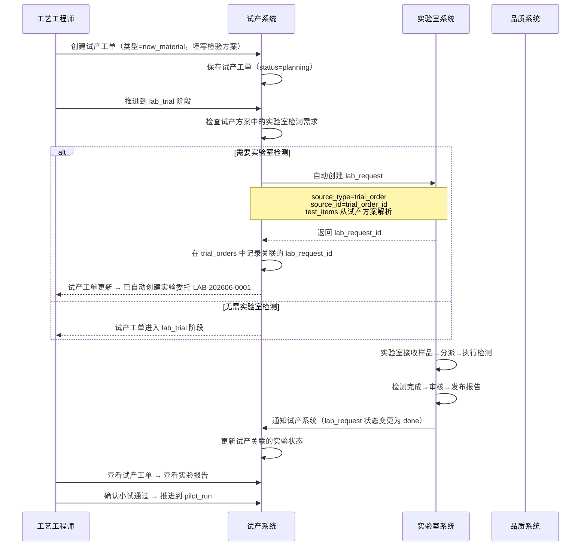
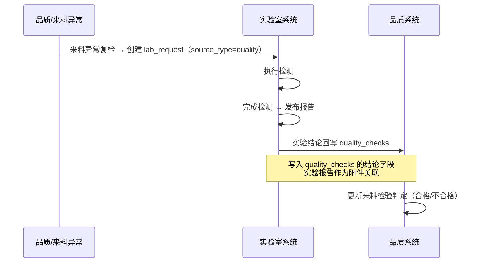
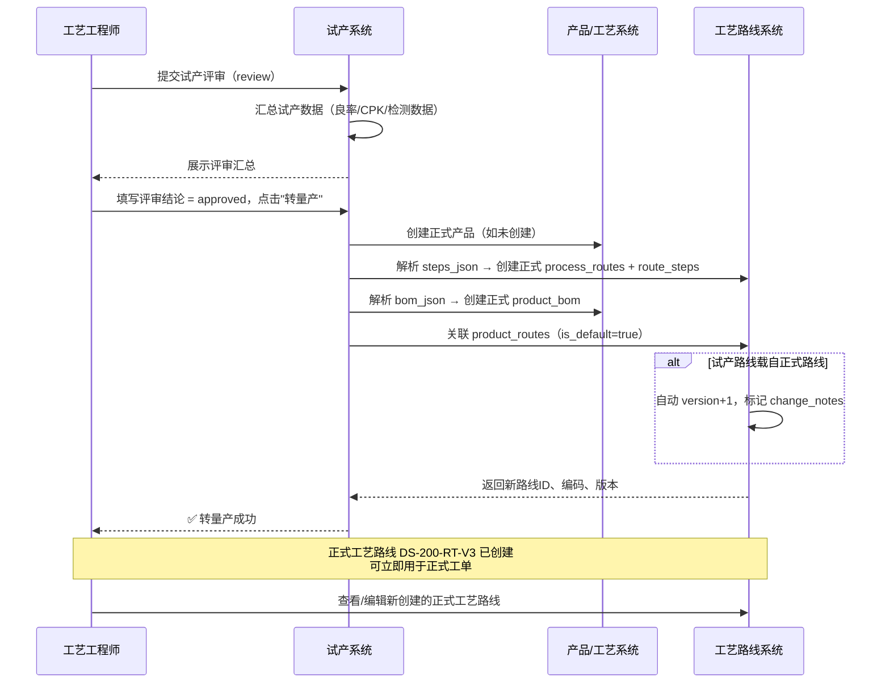

# 试产（NPI）与实验室模块详细设计

> **版本**：v1.0  
> **作者**：Alice（PM）  
> **关联文档**：`product-route-capability-model-v2.md`（产品/工艺路线/产能模型）、`architecture-comprehensive-review.md`（架构评估）、`manufacturing-scenario-simulation.md`（制造场景仿真）  
> **设计前提**：Phase 2 范围内，M07 产品/工艺路线模块已落地为前置依赖

---

## 0. 设计总览

### 0.1 设计范围

```
┌─────────────────────────────────────────────────────────────┐
│  M14 试产管理（本文档）                                        │
│  ┌────────────────┐  ┌────────────────┐  ┌──────────────┐   │
│  │ 试产工单        │  │ 试产BOM        │  │ 试产评审      │   │
│  │ trial_orders   │  │ trial_bom      │  │ trial_reviews │   │
│  └────────────────┘  └────────────────┘  └──────────────┘   │
│  ┌────────────────┐  ┌────────────────┐                      │
│  │ 试产工艺路线    │  │ 试产状态机      │                      │
│  │ trial_routes   │  │ 可配置阶段      │                      │
│  └────────────────┘  └────────────────┘                      │
├─────────────────────────────────────────────────────────────┤
│  M15 实验室管理（本文档）                                       │
│  ┌────────────────┐  ┌────────────────┐  ┌──────────────┐   │
│  │ 实验委托        │  │ 实验报告        │  │ 检验标准库    │   │
│  │ lab_requests   │  │ lab_reports    │  │ test_standards│   │
│  └────────────────┘  └────────────────┘  └──────────────┘   │
├─────────────────────────────────────────────────────────────┤
│  集成场景                                                     │
│  试产→实验室 | 实验室→品质 | 试产→转量产 | 试产→终止          │
└─────────────────────────────────────────────────────────────┘
```

### 0.2 核心设计原则

| 原则 | 说明 |
|------|------|
| **数据严格隔离** | 试产数据（BOM/工艺路线/工单）与正式生产数据物理隔离，独立表存储 |
| **状态机独立** | 试产工单状态机与正式工单状态机完全不同，不可混用 |
| **BOM 灵活** | 试产 BOM 用 JSON 存储，允许快速修改迭代，不污染正式 BOM |
| **实验室中立** | 实验室接收三类委托来源：试产/来料检验/客诉，产出结构化实验报告 |
| **一键转量产** | 试产验证通过后，试产 BOM 和工艺路线可一键导出为正式版本 |

### 0.3 前置依赖

| 依赖模块 | 依赖关系 | 状态 |
|---------|---------|:----:|
| M07 产品/工艺路线 | 试产工单需引用产品主数据；转量产时导出为正式工艺路线 | 设计完成，待开发 |
| M06 组织权限 | 试产数据需租户隔离 + 组织级数据作用域 | v2 设计完成 |
| M03 品质管理 | 实验室结论写入 quality_checks；试产评审需检验数据 | 基础就绪 |

---

## 1. M14 试产管理

### 1.1 设计理念

**试产（NPI）≠ 正式生产**。试产是研发/工艺部门主导的验证性活动，与正式生产的批量制造在目标、流程、数据要求上完全不同：

| 维度 | 正式工单 | 试产工单 |
|------|---------|---------|
| **BOM** | 严格的 product_bom | 灵活的 bom_json（JSON 存储） |
| **工艺路线** | 正式 process_routes | 简化版/局部验证的 trial_routes |
| **状态机** | pending→released→in_progress→completed→closed | planning→lab_trial→pilot_run→batch_verify→review→production/terminated |
| **批次追溯** | 全链条（原料批次→工单→工序→设备→人员→成品） | 仅关键参数（温度/压力/配方比例等） |
| **质检** | 按标准执行（IQC/IPQC/FQC/OQC） | 按试产方案执行，可增加/减少检验项 |
| **排产** | 正式排产计划，经排产员确认下发 | 独立排产，优先级低于正式工单，不影响正式产能 |
| **成本核算** | 计入标准成本 | 独立核算，计入 R&D 费用 |
| **创建者** | 排产员/计划员 | 工艺工程师/研发人员 |

### 1.2 试产类型枚举

| 试产类型 | 编码 | 说明 | 典型场景 |
|---------|:----:|------|---------|
| 新产品试产 | `new_product` | 全新产品的首次试制 | 首次生产传动轴 DS-200 |
| 新工艺试产 | `new_process` | 已有产品采用新工艺 | 传动轴改用高速精车工艺 |
| 新材料试产 | `new_material` | 已有产品使用替代材料 | 传动轴改用 40Cr 代替 45# 钢 |
| 工程变更验证 | `eco_verification` | ECO/ECN 变更后的验证 | BOM 变更或工序调整后的小批量验证 |
| 模具/工装验证 | `tooling_trial` | 新模具/工装的首件验证 | 新开锻造模具的首件试制 |

### 1.3 试产状态机

```
                    ┌──────────────┐
                    │   planning   │  ← 试产规划阶段
                    │   (规划)     │     填写试产方案、预期目标
                    └──────┬───────┘
                           │ 提交评审
                           ▼
                    ┌──────────────┐
                    │   lab_trial  │  ← 小试阶段
                    │   (小试)     │     实验室级验证（如需）
                    └──────┬───────┘
                           │ 小试通过
                           ▼
                    ┌──────────────┐
                    │  pilot_run   │  ← 中试阶段
                    │   (中试)     │     车间级小批量试产
                    └──────┬───────┘
                           │ 中试通过
                           ▼
                    ┌──────────────┐
                    │ batch_verify │  ← 小批量验证
                    │   (小批量)   │     正式产线小批量（通常为正式批量的10%）
                    └──────┬───────┘
                           │ 验证完成
                           ▼
                    ┌──────────────┐
                    │   review     │  ← 试产评审
                    │   (评审)     │     汇总所有数据，决策转量产/终止/调整
                    └──┬───────┬──┘
                       │       │
            ┌──────────┤       ├──────────┐
            ▼          │       │          ▼
    ┌──────────┐      │       │   ┌──────────────┐
    │production│◄─────┘       └──►│ terminated   │
    │ (转量产)  │                  │ (终止/关闭)  │
    └──────────┘                  └──────────────┘
                                           │
                                           ▼
                                    ┌──────────────┐
                                    │   archived   │
                                    │   (归档)     │
                                    └──────────────┘
```

**状态流转说明**：
- `planning` → `lab_trial`：试产方案评审通过，进入小试
- `lab_trial` → `pilot_run`：实验室验证通过（可跳过，由试产类型决定）
- `pilot_run` → `batch_verify`：中试通过，进入小批量验证
- `batch_verify` → `review`：小批量完成，提交评审
- `review` → `production`：评审通过，一键转量产
- `review` → `terminated`：评审结论为终止
- `terminated` → `archived`：数据归档保留

**阶段跳过规则**：
- `new_product` 类型：所有阶段均需执行
- `new_process` 类型：可跳过 `lab_trial`，直接从 `planning` → `pilot_run`
- `new_material` 类型：可跳过 `pilot_run`，直接从 `lab_trial` → `batch_verify`
- `eco_verification` / `tooling_trial`：可直接从 `planning` → `batch_verify`

### 1.4 表设计

#### 1.4.1 trial_orders — 试产工单主表

```sql
-- =============================================
-- 试产工单主表
-- 独立于 work_orders，使用自有编号规则和状态机
-- =============================================
CREATE TABLE trial_orders (
    id              INTEGER PRIMARY KEY AUTOINCREMENT,
    tenant_id       VARCHAR(64) NOT NULL,
    order_no        VARCHAR(64) NOT NULL,              -- 编号规则：NP-YYYYMM-NNNN（如 NP-202606-0001）
    -- 产品信息
    product_id      INTEGER REFERENCES products(id),   -- 关联产品（可为 NULL，全新产品可能尚未创建产品主数据）
    product_name    VARCHAR(128) NOT NULL,              -- 产品名称
    product_spec    VARCHAR(256),                       -- 产品规格
    -- 试产信息
    trial_type      VARCHAR(32) NOT NULL,               -- 试产类型：new_product/new_process/new_material/eco_verification/tooling_trial
    trial_phase     VARCHAR(32) NOT NULL DEFAULT 'planning',  -- 当前阶段：planning/lab_trial/pilot_run/batch_verify/review
    quantity        INTEGER,                            -- 试产数量
    priority        INTEGER DEFAULT 500,                -- 优先级（越小越高），默认低于正式工单
    -- 工艺路线（试产可使用简化版独立路线，也可引用正式路线局部验证）
    source_route_id INTEGER REFERENCES process_routes(id),  -- 引用的正式路线ID（如果有）
    route_id        INTEGER REFERENCES trial_routes(id),    -- 试产专用路线ID（如果有）
    -- BOM（灵活的 JSON 存储）
    bom_json        TEXT,                               -- JSON: [{"material_code":"M-001","material_name":"...","qty":2.0,"unit":"件","remark":"试产用料"}]
    bom_verified    INTEGER DEFAULT 0,                  -- BOM 是否已验证确认
    -- 检验方案
    inspection_plan TEXT,                               -- JSON: 试产专用检验方案
    -- 评审
    review_result   VARCHAR(32),                        -- 评审结论：approved/terminated/adjust
    review_notes    TEXT,                               -- 评审意见
    reviewed_by     INTEGER REFERENCES users(id),       -- 评审人
    reviewed_at     TIMESTAMP,                          -- 评审时间
    -- 技术参数（试产关注的关键参数）
    key_params      TEXT,                               -- JSON: {"temp":"860±10°C","pressure":"0.5MPa"}
    -- 控制
    status          VARCHAR(16) DEFAULT 'active',       -- active/archived
    created_by      INTEGER REFERENCES users(id),       -- 创建人（工艺工程师）
    created_at      TIMESTAMP DEFAULT CURRENT_TIMESTAMP,
    updated_at      TIMESTAMP DEFAULT CURRENT_TIMESTAMP,
    UNIQUE(tenant_id, order_no)
);

CREATE INDEX idx_trial_tenant ON trial_orders(tenant_id);
CREATE INDEX idx_trial_type ON trial_orders(trial_type);
CREATE INDEX idx_trial_phase ON trial_orders(trial_phase);
CREATE INDEX idx_trial_status ON trial_orders(tenant_id, status);
CREATE INDEX idx_trial_product ON trial_orders(product_id);
CREATE INDEX idx_trial_created_by ON trial_orders(created_by);
```

#### 1.4.2 trial_routes — 试产工艺路线表

```sql
-- =============================================
-- 试产工艺路线表
-- 试产可使用简化版/局部验证的工艺路线
-- 评审通过后可一键导出为正式 process_routes
-- =============================================
CREATE TABLE trial_routes (
    id              INTEGER PRIMARY KEY AUTOINCREMENT,
    tenant_id       VARCHAR(64) NOT NULL,
    trial_order_id  INTEGER NOT NULL REFERENCES trial_orders(id) ON DELETE CASCADE,
    name            VARCHAR(128) NOT NULL,              -- 路线名称
    description     TEXT,                               -- 路线描述（试产目的/验证要点）
    -- 来源（标记是否基于正式路线修改）
    source_route_id INTEGER REFERENCES process_routes(id),  -- 源正式路线ID
    change_notes    TEXT,                               -- 变更说明
    -- 路线定义（JSON 存储，灵活支持局部验证）
    steps_json      TEXT NOT NULL,                      -- JSON: [{"step_seq":10,"operation_name":"粗车外圆","work_center":"WC-001","setup_min":8,"run_min":4.5,"params":{...}},...]
    -- 验证要点
    verify_points   TEXT,                               -- JSON: [{"point":"尺寸精度","target":"φ45±0.05mm","method":"千分尺测量"},...]
    -- 状态
    is_active       INTEGER DEFAULT 1,
    created_at      TIMESTAMP DEFAULT CURRENT_TIMESTAMP,
    updated_at      TIMESTAMP DEFAULT CURRENT_TIMESTAMP
);

CREATE INDEX idx_tr_routes_order ON trial_routes(trial_order_id);
```

**设计说明**：试产工艺路线采用 `steps_json` 字段（而非正式路线的 `route_steps` 表结构），原因如下：

| 原因 | 说明 |
|------|------|
| **灵活性** | 试产路线经常变，JSON 结构无需 DDL 变更 |
| **局部验证** | 试产可能只验证某几个工序，而非完整路线 |
| **快速迭代** | 试产周期短（1-3天），没有版本管理的必要性 |
| **转量产** | 评审通过后，从 JSON 解析转化为正式 `process_routes` + `route_steps` |

#### 1.4.3 trial_bom — 试产BOM明细表（可选结构化存储）

```sql
-- =============================================
-- 试产BOM明细表（可选）
-- 当试产BOM需要结构化存储时使用
-- 也可直接用 trial_orders.bom_json 存储
-- =============================================
CREATE TABLE trial_bom (
    id              INTEGER PRIMARY KEY AUTOINCREMENT,
    tenant_id       VARCHAR(64) NOT NULL,
    trial_order_id  INTEGER NOT NULL REFERENCES trial_orders(id) ON DELETE CASCADE,
    material_code   VARCHAR(64),                        -- 物料编码
    material_name   VARCHAR(128) NOT NULL,               -- 物料名称
    quantity        REAL NOT NULL,                       -- 单件用量
    unit            VARCHAR(32),                         -- 单位
    -- 试产专用字段
    is_trial_material INTEGER DEFAULT 0,                -- 标记是否为试产专用物料（非正式BOM中的物料）
    substitute_for  VARCHAR(64),                         -- 替代的正式物料编码（如有）
    -- 供应商信息
    supplier        VARCHAR(128),                        -- 试产物料供应商（可能尚未正式准入）
    batch_no        VARCHAR(64),                         -- 试产物料批号
    -- 备注
    remark          TEXT,
    sort_order      INTEGER DEFAULT 0,
    created_at      TIMESTAMP DEFAULT CURRENT_TIMESTAMP
);

CREATE INDEX idx_tb_order ON trial_bom(trial_order_id);
```

#### 1.4.4 trial_reviews — 试产评审记录表

```sql
-- =============================================
-- 试产评审记录表
-- 一次试产可能经历多次评审
-- =============================================
CREATE TABLE trial_reviews (
    id              INTEGER PRIMARY KEY AUTOINCREMENT,
    tenant_id       VARCHAR(64) NOT NULL,
    trial_order_id  INTEGER NOT NULL REFERENCES trial_orders(id) ON DELETE CASCADE,
    review_round    INTEGER NOT NULL DEFAULT 1,          -- 评审轮次（1=首次评审，2+=复评）
    -- 评审结论
    conclusion      VARCHAR(32) NOT NULL,                -- approved/terminated/adjust/conditional_approve
    -- 评审数据汇总
    summary_data    TEXT,                                -- JSON: 汇总的试产数据（良率/关键尺寸CPK/不良原因等）
    -- 转量产相关（结论为 approved/conditional_approve 时填写）
    target_route_code   VARCHAR(64),                     -- 目标正式路线编码
    target_route_version VARCHAR(16),                    -- 目标正式路线版本
    transfer_notes  TEXT,                                -- 转量产说明
    -- 终止相关（结论为 terminated 时填写）
    termination_reason  TEXT,                            -- 终止原因
    termination_category VARCHAR(32),                    -- 终止分类：technical/quality/cost/schedule
    -- 调整相关（结论为 adjust 时填写）
    adjust_plan     TEXT,                                -- 调整方案说明
    -- 评审参与人
    reviewers       TEXT,                                -- JSON array: [{"user_id":1,"role":"工艺工程师","opinion":"同意"},...]
    -- 控制
    created_by      INTEGER REFERENCES users(id),
    created_at      TIMESTAMP DEFAULT CURRENT_TIMESTAMP
);

CREATE INDEX idx_tr_review_order ON trial_reviews(trial_order_id);
CREATE INDEX idx_tr_review_conclusion ON trial_reviews(conclusion);
```

### 1.5 API 设计

| 方法 | 路径 | 功能 | 优先级 |
|------|------|------|:------:|
| `GET` | `/api/v1/trial/orders` | 试产工单列表（分页+按类型/阶段/状态搜索） | **P0** |
| `GET` | `/api/v1/trial/orders/{id}` | 试产工单详情（含 BOM/路线/评审记录） | **P0** |
| `POST` | `/api/v1/trial/orders` | 创建试产工单 | **P0** |
| `PUT` | `/api/v1/trial/orders/{id}` | 编辑试产工单（规划阶段可编辑全部字段；进行中阶段仅可编辑备注/参数） | **P0** |
| `PUT` | `/api/v1/trial/orders/{id}/phase` | 变更试产阶段（状态机推进） | **P0** |
| `POST` | `/api/v1/trial/orders/{id}/bom` | 更新试产BOM（全量替换） | **P0** |
| `PUT` | `/api/v1/trial/orders/{id}/route` | 设置试产工艺路线 | **P1** |
| `POST` | `/api/v1/trial/orders/{id}/review` | 提交评审 | **P0** |
| `POST` | `/api/v1/trial/orders/{id}/transfer` | 转量产（评审通过后调用） | **P0** |
| `DELETE` | `/api/v1/trial/orders/{id}` | 删除试产工单（仅 planning 阶段可删） | **P1** |
| `GET` | `/api/v1/trial/orders/{id}/lab-requests` | 查看该试产关联的实验委托 | **P1** |

### 1.6 前端设计说明

**试产管理页**（`/制造执行/试产管理`）：

```
┌─────────────────────────────────────────────────────────────────┐
│  试产管理                                    [+ 新建试产工单]     │
├─────────────────────────────────────────────────────────────────┤
│  筛选：类型[全部 ▼]  阶段[全部 ▼]  状态[全部 ▼]                 │
├─────────────────────────────────────────────────────────────────┤
│  ┌─────────────────────────────────────────────────────────────┐│
│  │ 工单编号        | 产品  | 类型    | 阶段      | 状态   | 操作││
│  │ NP-202606-0001 | DS-200| 新产品  | ⏳ 小试   | active | 查看││
│  │ NP-202606-0002 | DS-200| 新工艺  | ✅ 评审中  | active | 评审││
│  │ NP-202606-0003 | AR-200| 新材料  | ❌ 已终止  | archived| 查看││
│  └─────────────────────────────────────────────────────────────┘│
│  [📊 试产看板视图]                                               │
└─────────────────────────────────────────────────────────────────┘
```

**试产工单详情页**（Tab 布局）：
- Tab 1 — 基本信息：编号、产品、类型、阶段、数量、创建人
- Tab 2 — BOM 清单：表格展示物料 + 行内编辑 + 批量导入
- Tab 3 — 工艺路线：查看/编辑试产路线步骤（拖拽排序 + 参数配置）
- Tab 4 — 检验方案：试产专用检验项目配置
- Tab 5 — 实验委托：关联的 lab_request 列表
- Tab 6 — 评审记录：历次评审结论 + 评审数据汇总
- Tab 7 — 操作日志：所有状态变更和操作记录

---

## 2. M15 实验室管理

### 2.1 设计理念

实验室是**中立检测服务提供方**，接收来自三类来源的实验委托：

```
委托来源：
├── 试产模块（trial_order） — 最核心来源
│   如：新材料的力学性能测试、新工艺的工艺参数验证
├── 品质/来料检验（quality） — 来料异常复检
│   如：供应商来料材质报告存疑，送实验室复检
├── 客诉/售后（customer_complaint） — 客诉原因分析
│   如：客户反馈传动轴断裂，送实验室做失效分析
└── 手动创建（manual） — 其他内部需求
    如：年度型式检验、设备校准验证
```

**实验室工作流程**：

```
发起委托 → 样品接收 → 任务分派 → 实验执行 → 数据录入 → 审核 → 报告发布
  │          │          │           │           │         │       │
  └──┐       └──┐       └──┐        └──┐        └──┐      └──┐    │
     │          │          │           │           │         │     │
     ▼          ▼          ▼           ▼           ▼         ▼     ▼
  pending   received   assigned   in_progress  testing   reviewing done
```

### 2.2 实验类型枚举

| 实验类型 | 编码 | 说明 |
|---------|:----:|------|
| 力学性能测试 | `mechanical` | 拉伸/压缩/弯曲/冲击/硬度 |
| 金相分析 | `metallographic` | 显微组织/晶粒度/非金属夹杂物 |
| 化学成分分析 | `chemical` | 光谱/滴定/碳硫分析 |
| 尺寸测量 | `dimensional` | 三坐标/精密测量/形位公差 |
| 环境试验 | `environmental` | 高低温/湿热/盐雾/振动 |
| 物理性能 | `physical` | 密度/粘度/粒度/电导率 |
| 老化试验 | `aging` | 紫外老化/热老化/疲劳 |
| 无损检测 | `ndt` | 超声波/磁粉/渗透/X射线 |
| 洁净度检测 | `cleanliness` | 颗粒度/油污残留 |
| 其他 | `other` | 不在以上分类中的特殊检测 |

### 2.3 实验室状态机

```
                    ┌──────────┐
                    │  pending │  ← 委托创建，待实验室接收
                    │  (待接收) │
                    └─────┬────┘
                          │ 实验室接收样品
                          ▼
                    ┌──────────┐
                    │ received │  ← 样品已接收，待分派
                    │  (已接收  │
                    └─────┬────┘
                          │ 指定检测人员
                          ▼
                    ┌──────────┐
                    │ assigned │  ← 已分派，待开始实验
                    │  (已分派) │
                    └─────┬────┘
                          │ 开始执行
                          ▼
                    ┌───────────┐
                    │ in_progress│  ← 实验进行中
                    │  (进行中)  │
                    └─────┬─────┘
                          │ 检测完成，提交数据
                          ▼
                    ┌───────────┐
                    │ reviewing │  ← 审核中（主管复核数据）
                    │  (审核中)  │
                    └─────┬─────┘
                          │ 审核通过
                          ▼
                    ┌──────────┐
                    │   done   │  ← 实验完成，报告已发布
                    │  (已完成) │
                    └──────────┘

可回退状态：
  assigned → received     (重新分派)
  in_progress → assigned  (任务调整)
  reviewing → in_progress (数据补充/复测)
```

### 2.4 表设计

#### 2.4.1 lab_requests — 实验委托主表

```sql
-- =============================================
-- 实验委托主表
-- 实验室接收实验委托的入口表
-- 支持三类来源：试产/品质/客诉 + 手动创建
-- =============================================
CREATE TABLE lab_requests (
    id              INTEGER PRIMARY KEY AUTOINCREMENT,
    tenant_id       VARCHAR(64) NOT NULL,
    request_no      VARCHAR(64) NOT NULL,              -- 编号规则：LAB-YYYYMM-NNNN
    title           VARCHAR(256) NOT NULL,              -- 实验委托标题
    request_type    VARCHAR(32) NOT NULL,               -- 实验类型：mechanical/metallographic/chemical/...
    -- 来源
    source_type     VARCHAR(32),                        -- 来源类型：trial_order/quality/complaint/manual
    source_id       INTEGER,                            -- 来源ID（如 trial_order_id）
    source_ref      VARCHAR(128),                       -- 来源编号（冗余：如试产工单编号 NP-202606-0001）
    -- 样品信息
    sample_name     VARCHAR(128),                       -- 样品名称
    sample_qty      INTEGER,                            -- 样品数量
    sample_desc     TEXT,                               -- 样品描述（批次号/生产日期/外观描述等）
    sample_photo    TEXT,                               -- 样品照片（JSON array of URLs）
    sample_disposal VARCHAR(32) DEFAULT 'return',       -- 样品处理方式：return(归还)/destroy(销毁)/retain(留样)
    -- 检测需求
    priority        VARCHAR(16) DEFAULT 'normal',       -- 优先级：urgent/high/normal/low
    expected_date   TIMESTAMP,                          -- 期望完成日期
    test_items      TEXT NOT NULL,                      -- JSON: [{"item":"拉伸强度","standard":"GB/T 228.1","target":"≥800MPa","method":"万能试验机"},...]
    -- 委托方
    requester_name  VARCHAR(128),                       -- 委托方姓名
    requester_dept  VARCHAR(128),                       -- 委托方部门
    -- 执行
    status          VARCHAR(32) DEFAULT 'pending',      -- 状态：pending/received/assigned/in_progress/reviewing/done
    assigned_to     INTEGER REFERENCES users(id),       -- 检测负责人
    assigned_at     TIMESTAMP,                          -- 分派时间
    started_at      TIMESTAMP,                          -- 开始时间
    completed_at    TIMESTAMP,                          -- 完成时间
    -- 结论
    conclusion      VARCHAR(32),                        -- 结论：pass/fail/inconclusive
    conclusion_summary TEXT,                            -- 结论摘要
    -- 报告
    report_attachments TEXT,                            -- JSON array: 报告附件文件列表
    report_template  VARCHAR(128),                      -- 使用的报告模板
    -- 控制
    created_by      INTEGER REFERENCES users(id),
    created_at      TIMESTAMP DEFAULT CURRENT_TIMESTAMP,
    updated_at      TIMESTAMP DEFAULT CURRENT_TIMESTAMP,
    UNIQUE(tenant_id, request_no)
);

CREATE INDEX idx_lab_tenant ON lab_requests(tenant_id);
CREATE INDEX idx_lab_status ON lab_requests(status);
CREATE INDEX idx_lab_type ON lab_requests(request_type);
CREATE INDEX idx_lab_source ON lab_requests(source_type, source_id);
CREATE INDEX idx_lab_priority ON lab_requests(priority);
CREATE INDEX idx_lab_assigned ON lab_requests(assigned_to);
```

#### 2.4.2 lab_test_results — 实验结果明细表

```sql
-- =============================================
-- 实验结果明细表
-- 每个实验委托包含多个检测项的测试结果
-- =============================================
CREATE TABLE lab_test_results (
    id              INTEGER PRIMARY KEY AUTOINCREMENT,
    tenant_id       VARCHAR(64) NOT NULL,
    request_id      INTEGER NOT NULL REFERENCES lab_requests(id) ON DELETE CASCADE,
    -- 检测项
    item_name       VARCHAR(128) NOT NULL,              -- 检测项名称（如"拉伸强度"）
    item_seq        INTEGER DEFAULT 0,                  -- 排序
    -- 标准/方法
    standard_ref    VARCHAR(128),                       -- 检测标准引用（如"GB/T 228.1-2010"）
    test_method     VARCHAR(256),                       -- 检测方法描述
    -- 目标值/判定基准
    target_value    VARCHAR(64),                        -- 目标值
    upper_limit     VARCHAR(64),                        -- 上限（如"800MPa"）
    lower_limit     VARCHAR(64),                        -- 下限（如"600MPa"）
    unit            VARCHAR(32),                        -- 单位
    -- 实测值
    actual_value    VARCHAR(256),                       -- 实测值（单值或多值，如"815MPa"）
    raw_data        TEXT,                               -- JSON: 原始数据（如应力-应变曲线数据点）
    -- 判定
    result          VARCHAR(16),                        -- 单项判定：pass/fail/n/a
    remark          TEXT,                               -- 备注
    -- 附件
    attachments     TEXT,                               -- JSON: 该检测项的附件（曲线图/照片等）
    -- 执行
    tested_by       INTEGER REFERENCES users(id),       -- 检测人员
    tested_at       TIMESTAMP,                          -- 检测时间
    created_at      TIMESTAMP DEFAULT CURRENT_TIMESTAMP
);

CREATE INDEX idx_ltr_request ON lab_test_results(request_id);
```

#### 2.4.3 test_standards — 检验标准库

```sql
-- =============================================
-- 检验标准库
-- 可复用的检测标准/方法定义
-- 实验委托时从标准库选择检测项，避免每次重复输入
-- =============================================
CREATE TABLE test_standards (
    id              INTEGER PRIMARY KEY AUTOINCREMENT,
    tenant_id       VARCHAR(64) NOT NULL,
    code            VARCHAR(64) NOT NULL,               -- 标准编码（如"STD-MECH-001"）
    name            VARCHAR(128) NOT NULL,              -- 标准名称
    category        VARCHAR(32) NOT NULL,               -- 分类：mechanical/metallographic/chemical/...
    -- 标准引用
    standard_ref    VARCHAR(128),                       -- 国家标准/行业标准引用（如"GB/T 228.1-2010"）
    test_method     TEXT,                               -- 检测方法详细描述
    -- 默认判定基准
    default_target  VARCHAR(64),                        -- 默认目标值
    default_upper   VARCHAR(64),                        -- 默认上限
    default_lower   VARCHAR(64),                        -- 默认下限
    default_unit    VARCHAR(32),                        -- 默认单位
    -- 设备要求
    required_equipment VARCHAR(256),                    -- 所需设备
    -- 样品要求
    sample_req      TEXT,                               -- 样品要求（尺寸/数量/状态调节等）
    -- 模板（生成报告时的描述模板）
    report_template TEXT,                               -- 报告模板文本（含占位符）
    -- 控制
    is_active       INTEGER DEFAULT 1,
    created_by      INTEGER REFERENCES users(id),
    created_at      TIMESTAMP DEFAULT CURRENT_TIMESTAMP,
    updated_at      TIMESTAMP DEFAULT CURRENT_TIMESTAMP,
    UNIQUE(tenant_id, code)
);

CREATE INDEX idx_ts_tenant ON test_standards(tenant_id);
CREATE INDEX idx_ts_category ON test_standards(category);
```

#### 2.4.4 lab_equipment — 实验室设备台账

```sql
-- =============================================
-- 实验室设备/仪器台账
-- 管理实验室专用的检测设备（与生产设备分开管理）
-- =============================================
CREATE TABLE lab_equipment (
    id              INTEGER PRIMARY KEY AUTOINCREMENT,
    tenant_id       VARCHAR(64) NOT NULL,
    code            VARCHAR(64) NOT NULL,               -- 设备编码（如"LE-UTM-001"）
    name            VARCHAR(128) NOT NULL,              -- 设备名称（如"万能试验机"）
    model           VARCHAR(128),                       -- 型号
    spec            VARCHAR(256),                       -- 规格参数
    -- 校准管理
    calibration_cycle INTEGER,                          -- 校准周期（天）
    last_calibrated TIMESTAMP,                          -- 上次校准日期
    next_calibration TIMESTAMP,                         -- 下次校准日期
    calibration_org VARCHAR(128),                       -- 校准机构
    -- 状态
    status          VARCHAR(16) DEFAULT 'available',    -- available/in_use/maintenance/out_of_order
    location        VARCHAR(128),                       -- 存放位置
    is_active       INTEGER DEFAULT 1,
    created_at      TIMESTAMP DEFAULT CURRENT_TIMESTAMP,
    updated_at      TIMESTAMP DEFAULT CURRENT_TIMESTAMP,
    UNIQUE(tenant_id, code)
);

CREATE INDEX idx_le_tenant ON lab_equipment(tenant_id);
CREATE INDEX idx_le_status ON lab_equipment(status);
```

### 2.5 API 设计

| 方法 | 路径 | 功能 | 优先级 |
|------|------|------|:------:|
| `GET` | `/api/v1/lab/requests` | 实验委托列表（分页+按状态/类型/来源搜索） | **P0** |
| `GET` | `/api/v1/lab/requests/{id}` | 委托详情（含检测项结果明细） | **P0** |
| `POST` | `/api/v1/lab/requests` | 创建实验委托（手动创建） | **P0** |
| `PUT` | `/api/v1/lab/requests/{id}` | 编辑委托信息（仅 pending 状态可编辑） | **P1** |
| `PUT` | `/api/v1/lab/requests/{id}/receive` | 接收样品（pending → received） | **P0** |
| `PUT` | `/api/v1/lab/requests/{id}/assign` | 分派检测人员（received → assigned） | **P0** |
| `PUT` | `/api/v1/lab/requests/{id}/start` | 开始检测（assigned → in_progress） | **P0** |
| `POST` | `/api/v1/lab/requests/{id}/results` | 批量更新检测结果 | **P0** |
| `PUT` | `/api/v1/lab/requests/{id}/review` | 提交审核（in_progress → reviewing） | **P0** |
| `PUT` | `/api/v1/lab/requests/{id}/complete` | 完成/发布报告（reviewing → done） | **P0** |
| `DELETE` | `/api/v1/lab/requests/{id}` | 删除委托（仅 pending 状态可删） | **P1** |
| `GET` | `/api/v1/lab/standards` | 检验标准库列表 | **P1** |
| `POST` | `/api/v1/lab/standards` | 创建检验标准 | **P1** |
| `GET` | `/api/v1/lab/equipment` | 实验室设备列表 | **P1** |
| `GET` | `/api/v1/lab/requests/{id}/report` | 导出实验报告（PDF/Excel） | **P1** |

### 2.6 前端设计说明

**实验室管理页**（`/制造执行/实验室管理`）：

```
┌─────────────────────────────────────────────────────────────────┐
│  实验室管理                                [+ 新建委托] [标准库]  │
├─────────────────────────────────────────────────────────────────┤
│  筛选：状态[全部 ▼]  类型[全部 ▼]  优先级[全部 ▼]               │
├─────────────────────────────────────────────────────────────────┤
│  ┌─ 待办区（高优先级在前）─────────────────────────────────────┐│
│  │ 🔴 紧急 | LAB-202606-001 | 传动轴断裂分析    | ⏳ pending  ││
│  │ 🟡 高   | LAB-202606-002 | AR-200粘度检测    | assigned   ││
│  └────────────────────────────────────────────────────────────┘│
│  ┌─ 全部委托 ─────────────────────────────────────────────────┐│
│  │ 编号            | 类型    | 样品    | 状态       | 负责人  ││
│  │ LAB-202606-001 | 力学    | 传动轴  | pending   | —        ││
│  │ LAB-202606-002 | 物理    | AR-200 | assigned  | 张三     ││
│  │ LAB-202606-003 | 金相    | DS-200 | done      | 李四     ││
│  └────────────────────────────────────────────────────────────┘│
└─────────────────────────────────────────────────────────────────┘
```

**实验委托详情页**：
- 顶部：委托编号、标题、来源、优先级、状态进度条
- 基本信息：样品信息、委托方、期望日期
- Tab 检测项：表格展示所有检测项（标准/方法/目标值/实测值/判定/操作）
  - 支持批量录入实测值
  - 支持上传曲线图/照片等附件
- Tab 原始数据：展示结构化原始数据（JSON/图表）
- Tab 报告：预览/导出实验报告（PDF）
- Tab 操作日志：所有状态变更记录

---

## 3. 试产工艺路线（特殊处理）

### 3.1 试产工艺路线 vs 正式工艺路线

| 维度 | 正式工艺路线（process_routes） | 试产工艺路线（trial_routes） |
|------|:----------------------------:|:--------------------------:|
| **存储方式** | 表结构（route_steps 子表） | steps_json 字段 |
| **版本管理** | 版本号 + 生效日期 + 发布归档 | 无版本管理，试产结束后归档 |
| **工序来源** | 从工序库（operations）选择 | 自由输入或从正式路线载入修改 |
| **完整性** | 完整的工序序列 | 可局部（仅验证某几个工序） |
| **并行处理** | is_parallel_eligible 属性标记 | JSON 中直接标注 |
| **检验点** | is_inspection 标记 + 联动 quality_checks | 在 steps_json 中标注 |
| **修改限制** | 已发布不可编辑，只能新建版本 | 全阶段可修改 |
| **关联正式路线** | 无 | 通过 source_route_id 关联，记录变更说明 |

### 3.2 试产工艺路线创建方式

**方式一：从正式路线载入修改**（推荐）
```
1. 选择正式工艺路线 → 系统 deep-copy steps 到 steps_json
2. 在 steps_json 中修改：调整工时/更换工作中心/新增工序/删除工序
3. source_route_id + change_notes 自动记录变更基线
4. 试产结束后，变更过的步骤高亮展示在评审页面
```

**方式二：全新创建**
```
1. 手动输入工序步骤（从工序库选择或自由输入）
2. 配置各步骤参数
3. 不关联任何正式路线（全新产品试产）
```

**方式三：快速验证**
```
1. 仅指定验证的工序和验证参数
2. 不定义完整工艺路线（适用于单工序验证场景）
```

### 3.3 steps_json 数据结构

```json
{
  "version": "1.0",
  "source_route_id": 5,
  "source_route_name": "传动轴标准工艺路线 v2.0",
  "change_summary": "将工序20精车工作中心从WC-002改为WC-008，新增工序25去毛刺",
  "steps": [
    {
      "step_seq": 10,
      "operation_name": "粗车外圆",
      "operation_code": "OP-010",
      "work_center": "粗车区 WC-001",
      "setup_time_min": 8,
      "run_time_min": 4.5,
      "is_inspection": false,
      "is_critical": false,
      "params": {
        "spindle_rpm": 800,
        "feed_mm_per_rev": 0.2,
        "depth_mm": 2.0
      },
      "verify_points": ["外径 φ48±0.2mm"]
    },
    {
      "step_seq": 20,
      "operation_name": "精车外圆",
      "operation_code": "OP-020",
      "work_center": "高速精车区 WC-008",
      "setup_time_min": 10,
      "run_time_min": 4.5,
      "is_inspection": false,
      "is_critical": false,
      "change_type": "modified",
      "change_detail": "工作中心从WC-002改为WC-008，工时从6.0min缩短为4.5min",
      "params": {
        "spindle_rpm": 1500,
        "feed_mm_per_rev": 0.15,
        "depth_mm": 0.5
      },
      "verify_points": ["外径 φ45±0.05mm", "粗糙度 Ra≤1.6μm"]
    },
    {
      "step_seq": 25,
      "operation_name": "去毛刺",
      "operation_code": null,
      "work_center": "钳工台 WC-007",
      "setup_time_min": 3,
      "run_time_min": 2.0,
      "is_inspection": true,
      "is_critical": false,
      "change_type": "added",
      "change_detail": "新增去毛刺工序以提升表面质量",
      "verify_points": ["棱边倒角 C0.5", "无毛刺"]
    }
  ],
  "verify_focus": "验证高速精车工艺的尺寸稳定性，验证去毛刺工序的必要性"
}
```

### 3.4 转量产：一键导出为正式工艺路线

```python
def transfer_trial_to_production(trial_order_id: int, review_id: int) -> dict:
    """
    试产评审通过后，将试产数据转量产
    
    输入：
      - trial_order_id: 试产工单ID
      - review_id: 评审记录ID
    
    输出：
      - 创建正式产品、正式工艺路线、正式BOM
      - 关联 product_routes 表
    """
    # 1. 获取试产数据
    trial_order = get_trial_order(trial_order_id)
    trial_route = get_trial_route(trial_order.route_id)
    review = get_trial_review(review_id)
    
    # 2. 校验评审结论
    if review.conclusion not in ('approved', 'conditional_approve'):
        raise BusinessError("评审未通过，不能转量产")
    
    # 3. 如果产品尚未创建（全新产品试产），创建正式产品
    if not trial_order.product_id:
        product = create_product(
            name=trial_order.product_name,
            spec=trial_order.product_spec
        )
    else:
        product = get_product(trial_order.product_id)
    
    # 4. 解析 steps_json 为正式工艺路线
    steps_data = json.loads(trial_route.steps_json)
    route = create_process_route(
        name=f"{trial_order.product_name}工艺路线",
        version="v1.0",
        source_route_id=trial_route.source_route_id,
        change_notes=trial_route.change_notes
    )
    
    for step in steps_data["steps"]:
        # 从工序库查找匹配工序，如果不存在则创建
        operation = find_or_create_operation(step)
        create_route_step(
            route_id=route.id,
            operation_id=operation.id,
            step_seq=step["step_seq"],
            step_name=step["operation_name"],
            work_center_id=resolve_work_center(step["work_center"]),
            setup_time_min=step["setup_time_min"],
            run_time_min=step["run_time_min"],
            is_inspection=step.get("is_inspection", False),
            is_critical=step.get("is_critical", False)
        )
    
    # 5. 解析 bom_json 为正式 BOM
    if trial_order.bom_json:
        bom_data = json.loads(trial_order.bom_json)
        for item in bom_data:
            if not item.get("is_trial_material"):  # 排除试产专用物料
                create_product_bom(
                    product_id=product.id,
                    material_code=item["material_code"],
                    material_name=item["material_name"],
                    quantity=item["quantity"],
                    unit=item["unit"]
                )
    
    # 6. 关联产品与工艺路线
    link_product_route(product.id, route.id, is_default=True)
    
    # 7. 更新评审记录
    update_review(review_id, target_route_code=route.code, target_route_version=route.version)
    
    # 8. 更新试产工单状态
    update_trial_order_phase(trial_order_id, 'production')
    
    return {
        "product_id": product.id,
        "route_id": route.id,
        "route_code": route.code,
        "route_version": route.version,
        "message": "转量产成功"
    }
```

### 3.5 转量产数据映射规则

| 试产数据来源 | 正式数据目标 | 处理规则 |
|------------|------------|---------|
| `trial_orders.product_name` | `products.name` | 直接复制；如果产品已存在则跳过 |
| `trial_orders.bom_json` | `product_bom` 行 | 排除 `is_trial_material=true` 的物料；`substitute_for` 写备注 |
| `trial_routes.steps_json` | `process_routes` + `route_steps` | 每步创建一个 route_step；`change_type=added` 的步骤需要确保工序存在于 operations 表 |
| `trial_routes.steps_json[].work_center` | `route_steps.work_center_id` | 按名称模糊匹配工作中心 |
| `trial_routes.verify_points` | `route_steps` 备注 | 写入 step 的 description 或关联的检验标准 |
| `trial_reviews.summary_data` | 不迁移 | 保留在评审记录中供追溯 |

---

## 4. 集成场景

### 4.1 试产 → 实验室：自动创建实验委托

**触发条件**：试产工单进入 `lab_trial` 阶段，且试产方案中标记了需要实验室检测

**流程时序**：



**API 调用示例**（试产系统自动调用）：

```json
POST /api/v1/lab/requests
{
    "title": "新材料AR-200替代料力学性能验证",
    "request_type": "mechanical",
    "source_type": "trial_order",
    "source_id": 1,
    "source_ref": "NP-202606-0001",
    "sample_name": "AR-200树脂试样",
    "sample_qty": 10,
    "sample_desc": "批次号：AR-20260601，新材料配方MMA+BA+引发剂+溶剂",
    "priority": "high",
    "expected_date": "2026-06-25",
    "test_items": [
        {"item": "拉伸强度", "standard": "GB/T 1040.2", "target": "≥60MPa"},
        {"item": "断裂伸长率", "standard": "GB/T 1040.2", "target": "≥5%"},
        {"item": "粘度", "standard": "GB/T 2794", "target": "2000-3000 mPa·s"}
    ]
}
```

### 4.2 实验室 → 品质：实验结论写入质量数据

**触发条件**：实验室完成检测（lab_request 状态变更为 done），且委托来源为 quality

**流程时序**：



**其他集成场景**：

| 来源 | 触发动作 | 写入品质表 |
|------|---------|-----------|
| 来料异常复检 | lab_request done | 更新 `quality_checks` 中对应检验单的判定为 pass/fail，填入复检结论 |
| 试产工序检验 | lab_request done | 在 `quality_checks` 中创建新的检验记录，标记为"试产"类型 |
| 客诉分析 | lab_request done | 在客诉处理记录中关联实验报告 |

### 4.3 试产 → 转量产：一键导出

**触发条件**：试产评审通过（review → production）

**流程时序**：



**转量产前置检查清单**：

| 检查项 | 说明 | 通过条件 |
|--------|------|---------|
| 评审结论 | 必须是 approved 或 conditional_approve | ✅ |
| 实验委托 | 所有关联的 lab_request 必须为 done 状态 | ✅ |
| BOM 验证 | bom_json 非空且 bom_verified=1 | ✅ |
| 工艺路线 | steps_json 非空且包含至少一个步骤 | ✅ |
| 产品信息 | product_name 非空 | ✅ |
| 权限 | 当前用户拥有 `trial:transfer` 权限 | ✅ |

### 4.4 试产 → 终止：保留数据

**触发条件**：
1. 试产评审结论为 terminated
2. 试产过程中判断无法继续并手动终止

**数据处理**：

| 数据类型 | 处理方式 |
|---------|---------|
| 试产工单 | 状态变更为 terminated，数据保留不删除 |
| 试产BOM | 保留在 bom_json / trial_bom 中，标记状态为 terminated |
| 试产工艺路线 | 保留在 trial_routes 中，标记 is_active=0 |
| 实验委托 | lab_request 状态不变（已完成的不回退），通过 source_id 仍可关联 |
| 实验报告 | 完整的实验结果保留，为后续类似试产提供参考 |
| 评审记录 | 保留终止原因和分类，可用于统计分析（试产失败率/原因分布） |

**统计分析价值**：已终止的试产数据应作为知识资产保留：
```
试产终止原因分布（季度）：
├── 技术原因 45%（未达性能指标/工艺不可行）
├── 质量原因 30%（良率低于目标值）
├── 成本原因 15%（试产成本超出预算）
└── 进度原因 10%（周期过长错过窗口）
```

### 4.5 试产排产集成

试产工单可创建独立的生产计划，或标记为"试产"类型插入正式排产表：

**方案 A：独立排产（推荐）**
```
试产工单不进入正式排产甘特图
→ 在试产管理页面内置简易排产功能
→ 排产结果仅对试产相关方可见
→ 优先级固定低于正式工单
```

**方案 B：标记试产类型插入正式排产**
```
试产工单出现在正式排产甘特图
→ 但以不同颜色区分（如黄色标记"试产"）
→ 可被正式工单抢占资源（试产优先级低）
→ 试产排产调整不影响正式工单排产
```

**推荐方案 A**，理由：
1. 试产不占用正式产能计算，排产逻辑简单
2. 不影响正式排产员的甘特图视图
3. 试产通常数量少（几件到几十件），无需复杂排产

---

## 5. 菜单与权限

### 5.1 菜单位置

```
知微云 SaaS 主菜单
├── 🏠 首页
│
├── 📊 生产管理
│   ├── 工单管理
│   ├── 生产计划
│   ├── 生产排产
│   ├── 报工记录
│   └── 生产报表
│
├── 🔧 制造执行            ← M14/M15 归属此一级菜单
│   ├── 品质管理
│   ├── 设备管理
│   ├── 安灯管理
│   ├── 能碳管理
│   ├── 试产管理           ← M14 入口（工艺工程师/部门主管）
│   └── 实验室管理          ← M15 入口（实验室人员/质检员）
│
├── 📋 基础数据
│   ├── 产品管理
│   ├── 工序定义
│   ├── 工作中心
│   ├── 工艺路线
│   ├── 工厂日历
│   └── 检验标准库          ← M15 标准库入口（工艺工程师/实验室人员）
│
└── ⚙️ 系统管理
    ├── 组织架构
    ├── 用户管理
    ├── 角色权限
    ├── 数据字典
    └── 操作日志
```

### 5.2 菜单可见性控制

| 菜单项 | 路径 | 可见角色 | 说明 |
|--------|------|---------|------|
| 试产管理 | `/manufacturing/trial` | admin, process_engineer, department_head | 试产工单的CRUD和状态管理 |
| 实验室管理 | `/manufacturing/lab` | admin, inspector, process_engineer, department_head | 实验委托管理和报告查看 |
| 检验标准库 | `/basics/test-standards` | admin, process_engineer, inspector | 检测标准/方法的维护 |

### 5.3 权限编码扩展

依据 `product-route-capability-model-v2.md` 中的角色权限矩阵，新增以下权限编码：

#### M14 试产管理权限

| 编码 | 说明 | admin | process_engineer | department_head | team_leader | operator | scheduler | inspector | viewer |
|:-----|:----|:-----:|:----------------:|:---------------:|:-----------:|:--------:|:---------:|:---------:|:------:|
| `trial:create` | 创建试产工单 | ✅ | ✅ | ❌ | ❌ | ❌ | ❌ | ❌ | ❌ |
| `trial:read` | 查看试产工单 | ✅ | ✅ | ✅ | ✅ | ✅ | ✅ | ✅ | ✅ |
| `trial:update` | 编辑试产工单 | ✅ | ✅ | ❌ | ❌ | ❌ | ❌ | ❌ | ❌ |
| `trial:delete` | 删除试产工单 | ✅ | ✅ | ❌ | ❌ | ❌ | ❌ | ❌ | ❌ |
| `trial:phase` | 推进试产阶段 | ✅ | ✅ | ✅ | ❌ | ❌ | ❌ | ❌ | ❌ |
| `trial:review` | 提交/审批评审 | ✅ | ✅ | ✅ | ❌ | ❌ | ❌ | ❌ | ❌ |
| `trial:transfer` | 转量产 | ✅ | ✅ | ✅ | ❌ | ❌ | ❌ | ❌ | ❌ |
| `trial:terminate` | 终止试产 | ✅ | ✅ | ✅ | ❌ | ❌ | ❌ | ❌ | ❌ |

**补充说明**：
- `trial:phase` 单独控制阶段推进权限，防止未授权人员跳过必要阶段
- `trial:review` 要求评审人同时拥有此权限，确保评审由有资格的人执行
- `trial:transfer` 是高权限操作，转量产会创建正式数据和版本，部门主管及以上才能操作
- `trial:terminate` 同样需要较高权限，终止试产意味着资源投入的中止

#### M15 实验室管理权限

| 编码 | 说明 | admin | inspector | process_engineer | department_head | team_leader | operator | scheduler | viewer |
|:-----|:----|:-----:|:---------:|:----------------:|:---------------:|:-----------:|:--------:|:---------:|:------:|
| `lab:create` | 创建实验委托 | ✅ | ✅ | ✅ | ✅ | ❌ | ❌ | ❌ | ❌ |
| `lab:read` | 查看实验委托 | ✅ | ✅ | ✅ | ✅ | ✅ | ✅ | ✅ | ✅ |
| `lab:update` | 编辑委托信息 | ✅ | ✅ | ❌ | ❌ | ❌ | ❌ | ❌ | ❌ |
| `lab:delete` | 删除委托 | ✅ | ✅ | ❌ | ❌ | ❌ | ❌ | ❌ | ❌ |
| `lab:receive` | 接收样品 | ✅ | ✅ | ❌ | ❌ | ❌ | ❌ | ❌ | ❌ |
| `lab:assign` | 分派检测人员 | ✅ | ✅ | ❌ | ❌ | ❌ | ❌ | ❌ | ❌ |
| `lab:execute` | 执行检测+录入结果 | ✅ | ✅ | ❌ | ❌ | ❌ | ❌ | ❌ | ❌ |
| `lab:review` | 审核实验数据 | ✅ | ✅ | ❌ | ✅ | ❌ | ❌ | ❌ | ❌ |
| `lab:complete` | 完成/发布报告 | ✅ | ✅ | ❌ | ❌ | ❌ | ❌ | ❌ | ❌ |
| `lab:standard:manage` | 管理检验标准库 | ✅ | ✅ | ✅ | ❌ | ❌ | ❌ | ❌ | ❌ |

**权限说明**：
- 实验委托的创建（`lab:create`）多个角色均可，因来源不同（试产/品质/手动）
- 实验室内部操作（receive/assign/execute/review/complete）仅 inspector 角色（实验室人员）拥有
- 审核（`lab:review`）需要主管级权限（inspector + department_head），确保实验数据经过复核
- 检验标准库的维护（`lab:standard:manage`）由工艺工程师和实验室人员共同负责

### 5.4 角色适用场景

| 角色 | 在 M14/M15 中的典型操作 |
|------|------------------------|
| **工艺工程师** (process_engineer) | 创建试产工单 → 设置BOM/路线 → 推进阶段 → 查看实验报告 → 提交评审 → 转量产 |
| **实验室人员** (inspector) | 接收样品 → 分派任务 → 执行检测 → 录入结果 → 审核数据 → 发布报告 |
| **部门主管** (department_head) | 查看试产进度 → 审批评审 → 审批终止 → 查看实验报告（不参与实验室日常操作） |
| **排产员** (scheduler) | 查看试产工单（了解试产占用资源情况，不参与操作） |
| **操作员** (operator) | 查看试产工单（仅当试产涉及本工位时知情） |

---

## 附录 A：数据字典汇总

### A.1 试产类型字典

| 值 | 名称 | 说明 |
|:---|:-----|------|
| `new_product` | 新产品试产 | 全新产品的首次试制 |
| `new_process` | 新工艺试产 | 已有产品采用新工艺 |
| `new_material` | 新材料试产 | 已有产品使用替代材料 |
| `eco_verification` | 工程变更验证 | ECO/ECN 变更后的验证 |
| `tooling_trial` | 模具/工装验证 | 新模具/工装的首件验证 |

### A.2 试产阶段字典

| 值 | 名称 | 说明 |
|:---|:-----|------|
| `planning` | 规划 | 试产方案制定阶段 |
| `lab_trial` | 小试 | 实验室级验证 |
| `pilot_run` | 中试 | 车间级小批量试产 |
| `batch_verify` | 小批量验证 | 正式产线小批量验证 |
| `review` | 评审 | 试产数据汇总和评审决策 |
| `production` | 转量产 | 评审通过，已转为正式生产 |
| `terminated` | 终止/关闭 | 试产终止 |

### A.3 评审结论字典

| 值 | 名称 | 说明 |
|:---|:-----|------|
| `approved` | 通过 | 全部指标达标，同意转量产 |
| `conditional_approve` | 有条件通过 | 主要指标达标，需整改次要问题后转量产 |
| `terminated` | 终止 | 技术/质量/成本不可行，终止试产 |
| `adjust` | 调整 | 部分指标未达标，调整方案后重新评审 |

### A.4 实验室状态字典

| 值 | 名称 | 说明 |
|:---|:-----|------|
| `pending` | 待接收 | 委托创建，实验室未接收 |
| `received` | 已接收 | 样品收到，待分派检测人员 |
| `assigned` | 已分派 | 已指定检测人员，待执行 |
| `in_progress` | 进行中 | 检测执行中 |
| `reviewing` | 审核中 | 检测完成，主管复核数据 |
| `done` | 已完成 | 报告已发布，委托完成 |

### A.5 实验结论字典

| 值 | 名称 | 说明 |
|:---|:-----|------|
| `pass` | 合格 | 全部检测项合格 |
| `fail` | 不合格 | 关键检测项不合格 |
| `inconclusive` | 无法判定 | 数据不足以判定，需复测或补充实验 |

### A.6 终止分类字典

| 值 | 名称 | 说明 |
|:---|:-----|------|
| `technical` | 技术原因 | 工艺不可行/性能未达标 |
| `quality` | 质量原因 | 良率低于目标值 |
| `cost` | 成本原因 | 试产成本超出预算 |
| `schedule` | 进度原因 | 周期过长错过窗口 |

---

## 附录 B：编号规则

| 模块 | 编号格式 | 示例 | 说明 |
|------|---------|:----:|------|
| 试产工单 | NP-YYYYMM-NNNN | NP-202606-0001 | YYYYMM = 年月，NNNN = 每月从 0001 开始 |
| 实验委托 | LAB-YYYYMM-NNNN | LAB-202606-0001 | 同上 |
| 检验标准 | STD-{CAT}-NNN | STD-MECH-001 | CAT = 分类缩写（MECH/METAL/CHEM/DIM/ENV...） |
| 实验室设备 | LE-{TYPE}-NNN | LE-UTM-001 | TYPE = 设备类型缩写 |

---

## 附录 C：与架构评估的对照

| 架构评估建议 | 本文档对应设计 | 覆盖情况 |
|-------------|-------------|:--------:|
| 决策A：新增 M14+M15 独立模块 | 第1章+第2章：独立表、独立状态机、独立BOM管理 | ✅ 完全覆盖 |
| 架构位置：trial_orders / trial_routes / trial_bom / trial_reviews | 第1.3-1.4 节：全部4张表 DDL 已定义 | ✅ 完全覆盖 |
| 架构位置：lab_tests / lab_reports / test_standards | 第2.3-2.4 节：lab_requests / lab_test_results / test_standards 已定义 | ✅ 完全覆盖 |
| 试产与实验室的集成（trial→lab→quality） | 第4章：集成场景 1-4 | ✅ 完全覆盖 |
| Webhook 事件：trial.status_changed / trial.review_created / lab.report_ready | 第4章各场景中标注了通知时机 | ✅ 已规划 |
| 菜单可见性与角色权限 | 第5章：菜单分层 + 权限编码矩阵 | ✅ 完全覆盖 |
| 转量产一键导出 | 第3.4 节：transfer_trial_to_production 逻辑 | ✅ 完全覆盖 |
| 试产数据保留（终止不删除） | 第4.4 节：终止数据处理规则 | ✅ 完全覆盖 |

---

## 附录 D：文档版本历史

| 版本 | 日期 | 修订内容 |
|:----:|:----:|---------|
| v1.0 | 2026-06 | 初始版本：M14 试产管理 + M15 实验室管理 + 试产工艺路线 + 集成场景 + 菜单权限 |
