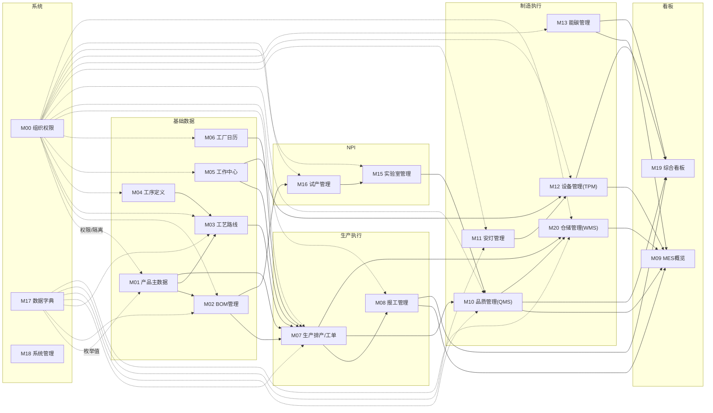

# 知微 ziwi SaaS 产品功能规格书 v1.4

> **文档编号**：ZIWI-SPEC-v1.4  
> **文档状态**：定稿（评审复盘更新）  
> **适用范围**：知微云 SaaS 制造执行系统  
> **参考标准**：SAP 最佳实践蓝图 / 鼎捷产品规格书风格

---

## 第1章 产品概述

### 1.1 产品定位

**知微 ziwi SaaS** 是一款面向中小型离散制造企业的轻量 MES（制造执行系统）平台，覆盖从工单管理、排产调度、报工跟踪到品质管控、设备运维、能碳管理的完整生产执行链路，并延伸至 NPI 试产与实验室管理，帮助企业以 SaaS 低成本实现生产数字化。

### 1.2 目标行业

按 SAP 行业分类方法论，知微平台采用三层覆盖策略：

| 优先级 | 行业 | 生产特征 | 知微覆盖度 |
|:------:|------|---------|:----------:|
| **P0** | 汽车零部件 | 多品种小批量、工序级管控、批次追溯 | ⭐ 核心覆盖 |
| **P0** | 机械装备 | BOM 多层级、装配复杂、外协加工 | ⭐ 核心覆盖 |
| **P0** | 电子组装 | SMT 贴片、防错料、质检联动 | ⭐ 核心覆盖 |
| **P1** | 金属加工 | CNC 加工、热处理、表面处理 | ✅ 完全覆盖 |
| **P1** | 家电制造 | 流水线装配、零部件多 | ✅ 完全覆盖 |
| **P1** | 模具制造 | 单件/小批量、工序复杂 | ✅ 完全覆盖 |
| **P2** | 化工（批次管理） | 配方驱动、批次追溯 | ⚠️ 核心需求覆盖 |
| **P2** | 食品饮料 | 配方、保质期、原料追溯 | ⚠️ 核心需求覆盖 |

**明确排除**：服装纺织、鞋帽箱包、石油天然气、矿业、电力能源、航空航天、半导体。

### 1.3 目标用户画像

| 角色 | 典型岗位 | 核心关注 |
|------|---------|---------|
| 主账号/系统管理员 | IT 主管、厂长 | 系统开通、组织设置、用户管理、模块配置 |
| 生产主管 | 生产经理、车间主任 | 生产进度、工单执行、排产计划、异常处理 |
| 计划员/排产员 | 生产计划员 | 排产调度、甘特图、工单下达 |
| 班组长 | 生产班组长 | 工单派工、报工审批、人员管理 |
| 操作工 | 一线工人 | 工单接收、报工、安灯呼叫 |
| 工艺工程师 | 工艺技术人员 | 工序定义、工艺路线编排、试产管理 |
| 质检员 | 品质检验员 | 检验记录、判定结论、SPC |
| 设备管理员 | 设备维护人员 | 设备台账、维保计划、维修管理 |
| 只读用户 | 参观/演示 | 查看所有数据（不可编辑） |

### 1.4 系统架构全景图

```mermaid
graph TB
    subgraph "应用层（前端）"
        UI1["驾驶舱/车间大屏"]
        UI2["生产管理<br/>工单/报工/排产/报表"]
        UI3["基础数据<br/>产品/BOM/工序/路线/工作中心"]
        UI4["制造执行<br/>品质/设备/安灯/能碳/试产/实验室/仓储WMS"]
        UI5["系统管理<br/>组织/用户/角色/字典"]
        UI6["PDA 手持终端<br/>WMS收货/拣料/盘点/移库"]
    end

    subgraph "API 层"
        API["/api/v1/{resource}"]
        AUTH["JWT 认证<br/>sub + tenant_id + roles + scope"]
    end

    subgraph "Service 层"
        S1["Production Service"]
        S2["Quality Service"]
        S3["Equipment Service"]
        S4["Energy Service"]
        S5["Trial Service"]
        S6["Lab Service"]
        S7["Admin Service"]
        S8["DataScope Service"]
        S9["Warehouse Service"]
    end

    subgraph "Repository 层"
        R1["MultiTenantRepository<br/>自动 tenant_id 行级隔离"]
        R2["DataRouteResolver<br/>策略路由"]
    end

    subgraph "数据层"
        DB1["业务数据库<br/>tenant_id 隔离"]
        DB2["缓存/消息队列<br/>Phase 5+"]

    subgraph "集成层 - Integration Gateway"
        IG1["API Key 认证代理"]
        IG2["协议适配器<br/>REST/SOAP"]
        IG3["数据映射引擎"]
        IG4["Webhook 管理"]
        IG5["重试+熔断"]
    end

    UI1 --> API
    UI2 --> API
    UI3 --> API
    UI4 --> API
    UI5 --> API
    UI6 --> API
    API --> AUTH
    AUTH --> S1
    AUTH --> S2
    AUTH --> S3
    AUTH --> S4
    AUTH --> S5
    AUTH --> S6
    AUTH --> S7
    AUTH --> S8
    AUTH --> S9
    S1 --> R1
    S2 --> R1
    S3 --> R1
    S4 --> R1
    S5 --> R1
    S6 --> R1
    S7 --> R1
    S8 --> R1
    S9 --> R1
    R1 --> DB1
    R1 --> DB2

    THIRD["第三方系统<br/>OA/ERP/LIMS/WMS"] --> IG1
    IG1 --> IG2
    IG2 --> IG3
    IG3 --> IG4
    IG4 --> IG5
    IG5 --> API

    style IG1 fill:#dfd,stroke:#333
    style IG2 fill:#dfd,stroke:#333
    style IG3 fill:#dfd,stroke:#333
    style IG4 fill:#dfd,stroke:#333
    style IG5 fill:#dfd,stroke:#333
    style THIRD fill:#fcf,stroke:#333
```

**架构分层说明**：

| 层次 | 职责 | 关键技术 |
|:----:|------|---------|
| 应用层 | 前端 SPA 应用，按角色动态渲染菜单 | Vite + React + MUI + Tailwind |
| API 层 | RESTful API 入口，JWT 鉴权 | FastAPI / Flask |
| Service 层 | 业务逻辑编排，含 DataScopeService 数据权限注入 | Python |
| Repository 层 | 数据持久化，自动 tenant_id 隔离 | SQLAlchemy / Raw SQL |
| 数据层 | 租户隔离存储 | SQLite / PostgreSQL |
| 集成层 | 第三方系统对接，协议适配，Webhook | Integration Gateway |

---

### 1.5 UI 设计原则（3-5-8 原则）

根据 SAP 评审建议，知微平台 UI 设计遵循 **3-5-8 原则**：

| 原则 | 说明 | 适用端 |
|:----|:-----|:------:|
| **3 次点击** | 核心生产操作（报工/安灯呼叫/检验判定/PDA 扫码等）≤3 次点击完成 | PC + PDA |
| **5 秒加载** | 列表页/详情页 SSR 首屏加载 ≤5 秒；数据聚合看板（M09/M19）≤3 秒 | PC + 大屏 |
| **8 秒响应** | 事务型操作（创建/提交/审批等）后端 95 分位响应 ≤8 秒 | 全端 |

**三端适配规范**：
- **大屏端**（M19 综合看板）：信息密度高/自动轮播/≥42 寸，大字号（关键指标≥48px）
- **PC 端**（业务操作）：功能完整/鼠标交互/键鼠快捷键，信息密度适中
- **PDA 端**（仓储现场）：大按钮（≥44px 触控区域）/扫码优先/三步操作范式

> 完整 UI 设计规范详见 `docs/ui-design-guidelines.md`

---

### 1.6 产品路线图（Phase 划分）

| 阶段 | 代号 | 交付模块 | 核心能力 | 目标客户 |
|:----:|:----:|:---------|:---------|:---------|
| **Phase 1** | MVP | M00 组织权限、M01 产品主数据、M02 BOM、M03 工艺路线、M04 工序定义、M05 工作中心、M06 工厂日历、M07 工单管理（不含外协）、M08 报工管理、M09 MES概览、M10 品质管理（基础检验+合格证+SIP模板）、M11 安灯管理、M12 TPM设备管理（基础）、M17 数据字典、M18 系统管理、M19 综合看板、M20 WMS仓储（完整PDA） | 核心MES闭环：工单→排产→报工→品质→入库；基础TPM+安灯；完整WMS+PDA | 汽配/装备/电子中型单工厂 |
| **Phase 2** | 扩展 | M10 SPC/PPAP/FMEA（品质高阶）、M10 AQL抽样标准（MIL-STD-105E）、M10 OQC出货检验、M07 外协工序管理（M07-20~24）、M08 流水线节拍统计、M05 ESD静电防护、M11 换线计时/工厂布局联动、M12 维护计划引擎（日历+运行时触发）、M12 模具寿命增强、M02 多级BOM展开、M13 能碳管理（进阶）、M14 数据采集 IoT | 品质高阶分析+外协闭环+智能维护+数据采集 | 汽配/装备多工厂客户、品质要求高的电子行业 |
| **Phase 3** | 生态 | M16 试产管理（NPI）、M15 实验室管理、轻量ERP（进销存/采购/销售）、Integration Gateway深度对接、多工厂支持 | NPI+实验室+轻量ERP+多工厂协同 | 有试产需求+实验室需求的客户、需要轻量ERP的中小企业 |

### 1.7 模块间数据流向图



**数据流向说明**：
1. **生产主线**：产品(M01)→BOM(M02)→工艺路线(M03)→排产(M07)→报工(M08)→品质(M10)→入库(M20)
2. **设备支线**：工作中心(M05)→设备管理(M12)→安灯(M11)→IoT采集(M14)
3. **NPI支线**：试产(M16)→实验室(M15)→品质(M10)→正式生产
4. **权限基座**：M00 和 M17 为所有模块提供权限和字典服务
5. **看板消费**：M09/M19 跨模块聚合数据，提供全景视图

### 1.8 核心用户故事（端到端场景）

| # | 用户角色 | 用户故事 | 涉及的模块 | 说明 |
|:-:|:---------|:---------|:-----------|:------|
| US-01 | 排产员 | 作为排产员，我希望创建生产工单并排产到工作中心/班组，以便生产计划可以被一线执行 | M01, M03, M05, M06, M07 | 核心生产启动流程 |
| US-02 | 班组长 | 作为班组长，我希望查看本班组的排产任务、确认开工并派工到操作员，以便生产任务有序执行 | M07 | 工单下达→派工执行 |
| US-03 | 操作员 | 作为操作员，我希望按派工单进行报工（产出/工时/不良），以便生产数据被准确记录 | M07, M08 | 一线数据采集 |
| US-04 | 质检员 | 作为质检员，我希望按质控点配置自动/手动创建检验单、录入实测值并判定结论，以便品质数据完整追溯 | M03, M07, M10 | 检验执行闭环 |
| US-05 | 仓管员 | 作为仓管员，我希望通过PDA扫码完成收货→IQC→上架全流程，以便库存数据实时准确 | M10, M20 | WMS+PDA执行 |
| US-06 | 维护技术员 | 作为维护技术员，我希望收到保养/维修任务通知、执行并记录维保结果，以便设备保持良好状态 | M11, M12 | TPM执行闭环 |
| US-07 | 生产主管 | 作为生产主管，我希望通过MES概览和综合看板实时了解产量/品质/设备/能耗全局，以便快速决策 | M09, M19 | 管理看板 |
| US-08 | 工艺工程师 | 作为工艺工程师，我希望编排工艺路线、管理BOM并进行试产验证，以便产品工艺标准化 | M01, M02, M03, M16 | 基础数据+试产 |
| US-09 | 仓库主管 | 作为仓库主管，我希望管理出入库审核、库存预警、批次追溯和库存报表，以便仓储运营高效且合规 | M20 | WMS管理闭环 |
| US-10 | 系统管理员 | 作为系统管理员，我希望管理用户/角色/权限和模块启停，以便租户团队可以安全地使用系统 | M00, M18 | 系统管理 |

---

## 第2章 角色与权限

### 2.1 角色定义总表

系统预置 **13 个角色**，租户管理员可在管理端修改非保护角色的权限编码组合和数据作用域。

| 角色编码 | 角色名称 | 数据作用域 | 适用岗位 | 是否系统保护 | 管理员可修改 |
|:---------:|:---------:|:----------:|---------|:------------:|:------------:|
| `admin` | 系统管理员 | ALL | 租户主账号 | ⚠️ 不可删除/降权 | ❌ |
| `key_user` | 关键用户 | DEPT_CHILD | 业务模块负责人/流程Owner | ❌ | ✅ |
| `department_head` | 部门主管 | DEPT_CHILD | 部门经理/车间主任 | ❌ | ✅ |
| `team_leader` | 小组长 | DEPT | 班组长 | ❌ | ✅ |
| `operator` | 操作员 | SELF | 一线工人 | ❌ | ✅ |
| `scheduler` | 排产员 | DEPT_CHILD | 计划员 | ❌ | ✅ |
| `inspector` | 质检员 | DEPT | 品质检验员 | ❌ | ✅ |
| `process_engineer` | 工艺工程师 | DEPT | 工艺技术人员 | ❌ | ✅ |
| `viewer` | 只读用户 | DEPT | 演示/参观 | ❌ | ✅ |
| `wh_supervisor` | 仓库主管 | DEPT_CHILD | 仓库经理/主管 | ❌ | ✅ |
| `wh_keeper` | 仓库管理员 | DEPT | 仓管员/收货员/发料员 | ❌ | ✅ |
| `quality_engineer` | 品质工程师 | DEPT | 品质分析/SPC工程师 | ❌ | ✅ |
| `maintenance_tech` | 维护技术员 | DEPT | 设备维护技术员 | ❌ | ✅ |

> **说明**：`key_user` 角色在 SAP+鼎捷评审后新增，介于 admin 和 dept_head 之间，可配置模块级管理权限和审批权限，适用于各业务模块的流程Owner。`process_engineer` 角色在 v2 设计评审中建议新增，用于专职负责工序定义、工艺路线编排、版本管理等工作。`wh_supervisor`/`wh_keeper` 为 WMS 仓储模块新增角色，`quality_engineer` 为品质高阶分析（SPC/PPAP/FMEA）角色，`maintenance_tech` 为 TPM 设备维保执行角色。正式角色数量仍以开发阶段实际落地为准。

### 2.2 数据作用域定义

| 级别 | 编码 | 含义 | SQL 过滤逻辑 |
|:----:|:----:|------|-------------|
| SELF | `scope:self` | 仅本人创建/负责的数据 | `WHERE created_by = :current_user_id` |
| DEPT | `scope:dept` | 所属组织及直属子组织 | `WHERE org_id IN (:current_org_id, :direct_child_ids)` |
| DEPT_CHILD | `scope:dept_child` | 所属组织及所有下级组织 | `WHERE org_id IN (SELECT id FROM organizations WHERE path LIKE :prefix || '%')` |
| ALL | `scope:all` | 全租户数据 | 不追加 scope 条件 |

**各角色实际数据范围示例**：

| 角色 | 典型归属组织 | 数据范围 |
|:----:|:-----------:|---------|
| admin | 租户根节点 | 全租户 |
| key_user | 各业务模块（如品质/设备/仓储） | 所属模块及下级部门（可跨部门配置） |
| department_head | 生产部门（level=1） | 生产部 + 一车间 + 二车间 + 各班组 |
| team_leader | 一车间（level=2） | 一车间 + 班组A + 班组B |
| operator | 班组A（level=3） | 仅本人 |
| scheduler | 生产部门（level=1） | 生产部 + 一车间 + 二车间 |
| inspector | 品质部门（level=2） | 品质部门 + 来料检验组 + 过程检验组 |
| process_engineer | 工艺部门（level=2） | 工艺部门及其下级组织 |
| viewer | 任意组织 | 所属组织及直属子组织（只读） |

### 2.3 角色-菜单可见性矩阵

完整 9 角色 × 菜单项可见性矩阵：

| 菜单分组 | 菜单子项 | 路由 | admin | key_user | dept_head | team_leader | operator | scheduler | inspector | process_eng | viewer |
|:--------:|:--------:|:----:|:-----:|:-------:|:---------:|:-----------:|:--------:|:---------:|:---------:|:-----------:|:------:|
| **首页** | 驾驶舱 | `/dashboard` | ✅ | ✅ | ✅ | ✅ | ✅ | ✅ | ✅ | ✅ | ✅ |
| | 车间大屏 | `/dashboard/workshop` | ✅ | ✅ | ✅ | ❌ | ❌ | ❌ | ❌ | ❌ | ❌ |
| | MES概览 | `/dashboard/mes-overview` | ✅ | ✅ | ✅ | ✅ | ✅ | ✅ | ❌ | ✅ | ✅ |
| **生产管理** | 工单管理 | `/production/work-orders` | ✅ | ✅ | ✅ | ✅ | ✅ | ✅ | ❌ | ✅ | ✅ |
| | 报工管理 | `/production/work-reports` | ✅ | ✅ | ✅ | ✅ | ✅ | ❌ | ❌ | ❌ | ✅ |
| | 生产报表 | `/production/reports` | ✅ | ✅ | ✅ | ❌ | ❌ | ✅ | ❌ | ❌ | ✅ |
| | 生产排产 | `/production/schedule` | ✅ | ✅ | ✅ | ❌ | ❌ | ✅ | ❌ | ❌ | ❌ |
| **基础数据** | 产品管理 | `/basics/products` | ✅ | ✅ | ✅ | ❌ | ❌ | ❌ | ❌ | ✅ | ✅ |
| | 工序定义 | `/basics/operations` | ✅ | ✅ | ❌ | ❌ | ❌ | ❌ | ❌ | ✅ | ✅ |
| | 工作中心 | `/basics/work-centers` | ✅ | ✅ | ✅ | ❌ | ❌ | ❌ | ❌ | ✅ | ✅ |
| | 工艺路线 | `/basics/routes` | ✅ | ✅ | ❌ | ❌ | ❌ | ❌ | ❌ | ✅ | ✅ |
| | 工厂日历 | `/basics/calendar` | ✅ | ✅ | ❌ | ❌ | ❌ | ❌ | ❌ | ❌ | ❌ |
| | 基础数据配置 | `/basics/config` | ✅ | ✅ | ✅ | ❌ | ❌ | ❌ | ❌ | ✅ | ✅ |
| **制造执行** | 品质管理 | `/manufacturing/quality` | ✅ | ✅ | ✅ | ❌ | ❌ | ❌ | ✅ | ❌ | ✅ |
| | 设备管理 | `/manufacturing/equipment` | ✅ | ✅ | ✅ | ❌ | ❌ | ❌ | ❌ | ❌ | ✅ |
| | 安灯管理 | `/manufacturing/andon` | ✅ | ✅ | ✅ | ✅ | ✅ | ❌ | ❌ | ❌ | ✅ |
| | 能碳管理 | `/manufacturing/energy` | ✅ | ✅ | ✅ | ❌ | ❌ | ❌ | ❌ | ❌ | ✅ |
| | 试产管理 | `/manufacturing/trial` | ✅ | ✅ | ✅ | ❌ | ❌ | ❌ | ❌ | ✅ | ❌ |
| | 实验室管理 | `/manufacturing/lab` | ✅ | ✅ | ✅ | ❌ | ❌ | ❌ | ✅ | ✅ | ❌ |
| | 综合看板 | `/dashboard/comprehensive` | ✅ | ✅ | ✅ | ❌ | ❌ | ❌ | ❌ | ❌ | ✅ |
| **系统管理** | 系统概览 | `/system/overview` | ✅ | ❌ | ❌ | ❌ | ❌ | ❌ | ❌ | ❌ | ❌ |
| | 组织架构 | `/system/orgs` | ✅ | ❌ | ❌ | ❌ | ❌ | ❌ | ❌ | ❌ | ❌ |
| | 用户管理 | `/system/users` | ✅ | ❌ | ❌ | ❌ | ❌ | ❌ | ❌ | ❌ | ❌ |
| | 角色管理 | `/system/roles` | ✅ | ❌ | ❌ | ❌ | ❌ | ❌ | ❌ | ❌ | ❌ |
| | 数据字典 | `/system/dictionaries` | ✅ | ❌ | ❌ | ❌ | ❌ | ❌ | ❌ | ❌ | ❌ |
| | 模块配置 | `/system/modules` | ✅ | ❌ | ❌ | ❌ | ❌ | ❌ | ❌ | ❌ | ❌ |
| | 操作日志 | `/system/audit-logs` | ✅ | ❌ | ❌ | ❌ | ❌ | ❌ | ❌ | ❌ | ❌ |

> **说明**：
> - 上表角色列已扩展为 13 个角色（新增 `wh_supervisor`、`wh_keeper`、`quality_engineer`、`maintenance_tech`）。WMS、品质管理、设备管理相关菜单项对这些新角色有针对性可见性配置，详见前端页面全景文档中的完整角色-菜单可见性矩阵。
> - `key_user` 角色的可见性取决于管理员为其配置的模块级授权范围。

### 2.4 外部人员角色

针对供应商、客户、审计方等非内部用户，系统提供三种外部访问模式：

| 外部角色类型 | 访问方式 | 可见范围 | 适用场景 |
|:-----------:|:---------|:---------|:---------|
| **供应商只读门户** | 供应商专属账号（`supplier_portal`），独立域名或子路径 | 仅限该供应商相关的采购订单、外协订单、IQC检验结果 | 供应商查看订单进度和品质数据，不可查看其他供应商数据 |
| **客户综合门户** | 客户专属账号（`customer_portal`） | 仅限该客户相关的订单进度、PPAP状态、出货检验报告、合格证 | 客户跟踪订单履行状态、下载品质文件 |
| **审计只读账号** | 审计人员临时账号（`auditor`），带有效期 | 按审计范围配置的只读数据权限（产品/BOM/工单/品质/设备等） | ISO体系审计、客户验厂、内部审核 |

**外部账号管理规则**：
1. 外部账号由租户 admin 在用户管理中创建，标记为"外部人员"类型
2. 外部账号不可访问系统管理区、不可修改任何数据（只读门户）
3. 供应商/客户门户使用独立登录入口或系统内嵌 iframe 模式
4. 审计账号含有效期设置，到期自动禁用
5. 所有外部账号的访问记录计入审计日志

### 2.5 多工厂数据共享与权限模型

面向多工厂/多地点客户，数据共享遵循以下权限模型：

| 维度 | 数据隔离模式 | 共享模式 |
|:-----|:------------|:---------|
| **工厂级隔离** | 每个工厂独立组织树，数据按 `org_id` 物理隔离 | 管理员可通过数据作用域 `ALL` 跨工厂查看 |
| **跨工厂查看** | 创建"集团视图"角色，数据作用域跨多个工厂组织节点 | 集团管理层可见所有工厂聚合数据 |
| **跨工厂操作** | 标准操作限定在本工厂范围内，可在不同工厂间切换上下文 | 支持"当前工厂"切换，切换后数据范围随之变化 |
| **物料主数据** | 物料编码全局唯一，可在多个工厂共享 | 物料在工厂间的库存和可用量分别独立 |
| **客户/供应商** | 客户和供应商主数据可在工厂间共享 | 同一客户在不同工厂的订单/品质记录隔离 |

**实现方式**：通过组织树的多根节点（每个工厂一个根组织）+ 数据作用域的配置组合实现。集团用户通过 `DEPT_CHILD` 或 `ALL` 作用域跨工厂访问数据。

---

## 第3章 功能模块规格

### M00 组织权限与认证

**功能定位**：多租户组织树管理、用户账号体系、角色权限控制与数据作用域的三维权限模型  
**适用角色**：admin、key_user  
**前置依赖**：无  
**核心数据表**：`organizations`、`users`、`user_organizations`、`roles`、`role_permissions`

#### 功能清单

| 编号 | 功能点 | 功能描述 | 输入/前置 | 输出/后置 | 适用角色 | 关联模块 |
|:----:|:-------|:---------|:----------|:----------|:---------|:---------|
| M00-01 | 租户开通与初始化 | 平台创建租户，自动创建根组织节点、预置部门结构、创建7个默认角色、创建主账号 | 平台侧操作 | 租户根组织 + 5个部门 + 班组 + 角色 + 主账号 | admin(平台) | — |
| M00-02 | 组织树管理 | 树形展示租户内部组织层级；支持创建子节点、编辑、删除、拖拽移动 | 无 | 组织树结构更新 | admin | M00-03 |
| M00-03 | 用户管理 | 用户列表展示、创建用户（含组织归属+角色分配）、编辑、禁用/启用、密码重置 | 组织树已建立 | 用户账号可用 | admin | M00-02, M00-04 |
| M00-04 | 角色管理 | 角色列表、创建自定义角色、编辑权限编码（树形勾选）、设置数据作用域、删除角色 | 权限编码体系已定义 | 角色权限可用 | admin | M00-05 |
| M00-04-B | 批量角色分配 | 批量创建用户时可一次性为多个用户分配相同角色。支持在创建用户弹窗中直接选择角色（多选），也支持在角色详情页的"用户关联"中批量添加用户。批量操作需显示进度反馈（如20个用户分配完成/失败数） | 角色已定义、用户列表已存在 | 批量分配完成 | admin | M00-03, M00-05 |
| M00-05 | 角色-用户关联 | 在角色详情中查看已关联用户列表；添加/移除用户 | 角色和用户已创建 | 用户获得角色权限 | admin | M00-03, M00-04 |
| M00-06 | JWT 认证 | 用户登录后签发 JWT token，携带 tenant_id、org_id、roles、permissions、scope | 用户凭据 | Token 用于后续 API 鉴权 | 所有角色 | — |
| M00-07 | 数据作用域过滤 | DataScopeService 根据用户角色作用域自动注入 WHERE 条件，控制数据可见范围 | 用户已认证 | 业务数据按作用域过滤 | 所有角色 | 全模块 |
| M00-08 | Key User 关键用户管理 | 为 key_user 角色配置模块级管理范围：①授权模块列表（可管理哪些业务模块的全功能操作）②授权审批范围（可审批哪些模块的流程）③授权部门范围（跨部门管理时指定可见的部门节点）④模块级权限覆盖（在 admin 不介入的情况下，key_user 可在授权模块内完成配置/审批/查看全数据操作） | 角色体系已建立 | Key User 管理权限生效 | admin | M00-04, M00-05 |

#### 业务规则

1. **租户即组织**：每个租户在 `organizations` 表中有一条 `level=0` 的根记录，不再区分"租户"和"组织"两个独立概念
2. **组织层级限制**：固定 4 级深度（level 0-3：租户根→部门→车间→班组），超出需联系平台方
3. **主账号保护**：主账号不可被删除、不可被降权、不可被禁用；admin 角色不可修改权限和删除
4. **用户多组织兼任**：一个用户可属于多个组织节点，一个主组织（primary）+ 多个兼任组织；在不同组织可担任不同角色
5. **鉴权两步判定**：先检查角色是否包含操作权限编码；再检查请求数据的 org_id 是否在角色数据作用域范围内
6. **Key User 角色定位**：key_user 介于 admin 和 dept_head 之间。与 admin 的差异：key_user 不可访问系统管理区（组织/用户/角色/字典/模块/日志），不可创建/删除用户和角色；与 dept_head 的差异：key_user 通过模块级授权可跨部门管理指定模块的全功能操作（含配置和审批），而 dept_head 仅限本部门数据的数据级管理

#### 集成关系

| 关联模块 | 关系说明 |
|---------|---------|
| 全模块 | 所有业务模块依赖 M00 的组织隔离、用户认证和数据作用域；key_user 角色通过模块级授权访问各业务模块 |
| Integration Gateway | API Key 认证基于 M00 的租户体系 |

---

### M01 产品主数据

**功能定位**：产品核心主数据管理，是生产制造的核心业务对象  
**适用角色**：admin、process_engineer  
**前置依赖**：M00 组织权限  
**核心数据表**：`products`

#### 功能清单

| 编号 | 功能点 | 功能描述 | 输入/前置 | 输出/后置 | 适用角色 | 关联模块 |
|:----:|:-------|:---------|:----------|:----------|:---------|:---------|
| M01-01 | 产品列表 | 分页展示产品，按编码/名称模糊搜索，按类型/分类/状态筛选 | 无 | 产品列表（含基础信息） | admin, process_eng, dept_head, viewer | — |
| M01-02 | 创建产品 | 填写产品编码、名称、规格、单位、类型、分类、重量、图纸等基础信息 | 无 | 产品主数据记录 | admin | M02 |
| M01-03 | 编辑产品 | 修改产品基础信息 | 产品已存在 | 产品信息更新 | admin | — |
| M01-04 | 删除产品 | 删除产品主数据（已有工单关联时禁止删除） | 产品无关联工单 | 产品数据删除 | admin | M06(工单) |
| M01-05 | 产品详情 | 查看产品完整信息，含 BOM 清单和关联工艺路线 | 产品已存在 | 产品详情展示 | admin, process_eng, dept_head, viewer | M02, M03 |
| M01-06 | **产品版本管理** | 支持产品多版本定义（V1.0/V2.0/...）。每个版本独立关联 BOM 和工艺路线。①版本属性：版本号（如 V1.0）、生效日期（`effective_from`）、失效日期（`effective_to`）、描述、版本状态（draft/published/archived）②创建新版本时自动复制上一版本的 BOM 和工艺路线关联，支持修改③工单创建时自动选用产品当前生效版本（生效日期 ≤ 当前日期 < 失效日期）的 BOM 和工艺路线④无生效版本时提示"产品未配置当前生效版本"⑤版本变更历史记录（操作人/时间/变更内容） | 产品已存在 | 产品版本配置 | admin, process_eng | M02, M03, M07 |

#### 业务规则

1. **产品编码唯一**：同一租户下产品编码（code）唯一
2. **产品类型区分**：`product_category` 区分成品(final)/半成品(semi)/原材料(raw)
3. **全租户共享**：产品主数据与组织架构解耦，可在全租户范围内共享

#### 集成关系

| 关联模块 | 关系说明 |
|---------|---------|
| M02 BOM 管理 | 产品通过 `product_id` 关联 BOM 物料清单 |
| M03 工艺路线 | 产品通过 `product_routes` 关联工艺路线 |
| M06 工单管理 | 工单创建时选择产品，自动展开工艺路线 |

---

### M02 BOM 管理

**功能定位**：产品物料清单管理，定义产品与原材料/零部件的组成关系  
**适用角色**：admin、process_engineer  
**前置依赖**：M01 产品主数据  
**核心数据表**：`product_bom`

#### 功能清单

| 编号 | 功能点 | 功能描述 | 输入/前置 | 输出/后置 | 适用角色 | 关联模块 |
|:----:|:-------|:---------|:----------|:----------|:---------|:---------|
| M02-01 | BOM 清单查看 | 在产品详情中查看 BOM 物料清单，按物料类型/工序筛选 | 产品已存在 | BOM 表格展示 | admin, process_eng, dept_head, viewer | M01 |
| M02-02 | BOM 批量更新 | 全量替换产品 BOM 清单，支持逐行编辑和 Excel/CSV 批量导入。**工单下达时自动锁定当前 BOM 版本**（生成 BOM 快照 `bom_snapshot`），后续 BOM 变更不影响已下发工单。**BOM 版本变更新增生效日期**（`effective_from`），生效前的工单继续使用旧版本 BOM | 产品已存在 | BOM 清单更新（含版本快照） | admin, process_eng, key_user | M01 |
| M02-03 | BOM 物料添加 | 添加物料到 BOM，填写物料编码、名称、单件用量、单位、类型、损耗率、**替代物料（含优先级+有效期）**、投料工序 | 产品已存在 | BOM 新增行 | admin, process_eng | M01, M03 |
| M02-03-B | **替代物料管理** | 每个 BOM 物料可配置多个替代物料，支持：①**替代优先级**（数字越小优先级越高，1=首选替代，2=次选替代...）②**替代有效期**（`effective_from` / `effective_to`，有效期外的替代不可用）③**替代类型**（同等替代/降级替代）④**替代原因**（成本优化/供应保障/性能提升）⑤系统在齐套检查时按照优先级顺序检测替代物料可用性：首选替代可用 → 使用首选；不可用 → 检测次选；次选不可用 → 标记缺料。替代物料的使用记录计入工单 BOM 快照 | BOM 物料已存在 | 替代物料配置 | admin, process_eng | M07(齐套检查) |
| M02-03-C | **BOM 变更管理（ECN/ECO）** | BOM 变更的发起/审批/生效/追溯全流程管理：①**ECN（工程变更通知）**：变更请求的发起，填写变更原因、变更内容（物料新增/替换/删除/用量修改）、影响评估（库存影响/工单影响/采购影响）②**ECO（工程变更订单）**：ECN 审批通过后自动生成 ECO，执行实际 BOM 修改③**审批流程**：ECN 提交→主管审批→（可选）客户确认→生效。支持多人会签④**生效方式**：立即生效/按日期生效/按批次生效（指定切换批号）⑤**变更追溯**：ECN/ECO 编号与 BOM 版本关联，变更历史可查（操作人/时间/变更前后内容对比）⑥**影响工单处理**：已下达但未开工的工单自动提示"BOM 已变更，是否更新 BOM 快照？" | BOM 已存在 | ECN/ECO 全流程闭环 | admin, process_eng, dept_head, key_user | M00(审批流) |
| M02-04 | BOM 工序关联 | 指定物料在哪个工序投入（`issue_operation_seq`），支持工序级齐套性检查 | 工艺路线已定义 | 工序物料关联 | admin, process_eng | M03, M06 |
| M02-05 | **多级 BOM 展开** | Phase 2 功能。支持多级 BOM 展开：①将物料类型为 `semi`（半成品）的子 BOM 递归展开为完整 BOM 树 ②支持虚拟件（`phantom` 类型物料，BOM 展开时自动压缩、不生成独立工单）③展开深度不限、支持循环检测 ④多级 BOM 树形视图展示（可折叠/展开）⑤BOM 下级用量自动累加到父级。此功能依赖半成品作为独立产品在 M01 中定义并拥有自己的 BOM | 半成品 BOM 已定义 | 多级 BOM 展开树 | admin, process_eng | M01, M07 |

#### 业务规则

1. **单级 BOM**：当前采用单级 BOM，仅管理直接物料；通过 `material_type='semi'` 标记半成品，Phase 2 可扩展多级 BOM 展开（见 M02-05）
2. **BOM 版本锁定**：工单下达时生成 BOM 快照（`bom_snapshot`），后续 BOM 变更不影响已下发工单；BOM 版本变更新增生效日期（`effective_from`）字段，支持分时生效
3. **关键物料标记**：`is_key_material=1` 的物料需要批次追溯
3. **损耗率**：`scrap_rate` 字段记录损耗百分比，在物料需求计算时自动放大用量
4. **投料工序**：`issue_operation_seq` 为空时表示首工序投料

#### 集成关系

| 关联模块 | 关系说明 |
|---------|---------|
| M01 产品主数据 | BOM 归属产品 |
| M03 工艺路线 | BOM 物料按 `issue_operation_seq` 关联到具体工序 |
| M06 工单管理 | 工单下达时根据 BOM 展开物料需求 |
| M14 试产管理 | 试产 BOM 可一键导出为正式 BOM |

---

### M03 工艺路线管理

**功能定位**：工艺路线编排与版本管理，定义产品从投料到完工的完整工序序列  
**适用角色**：admin、process_engineer  
**前置依赖**：M01 产品主数据、M04 工序定义、M05 工作中心  
**核心数据表**：`process_routes`、`route_steps`、`product_routes`

#### 功能清单

| 编号 | 功能点 | 功能描述 | 输入/前置 | 输出/后置 | 适用角色 | 关联模块 |
|:----:|:-------|:---------|:----------|:----------|:---------|:---------|
| M03-01 | 工艺路线列表 | 分页展示工艺路线，按产品/状态/版本搜索 | 无 | 路线列表 | admin, process_eng, dept_head, viewer | M01 |
| M03-02 | 创建工艺路线 | 创建全新路线或从已有路线载入（`source_route_id`），填写路线编码/名称/版本/有效期 | 工序库已建立 | 工艺路线草稿 | admin, process_eng | M04 |
| M03-03 | 工序编排 | 从工序库拖拽工序到路线画布，设置步骤序号、前后关系、并行属性、**工序类型（生产/检验/外协）**、工作中心分配、工时覆盖、工序物料。外协类型步骤自动标记 `is_outsource=1`，在工单执行时触发外协流程 | 工序已定义、工作中心已建立 | 路线步骤编排完成 | admin, process_eng | M04, M05 |
| M03-04 | 状态管理 | 变更路线状态：draft → published → archived，已发布路线不可编辑 | 路线步骤完整 | 路线状态更新 | admin, process_eng | — |
| M03-05 | 版本对比 | 并排显示当前版本与源版本的步骤差异，高亮新增/删除/修改的工序 | 路线有多个版本 | 版本差异展示 | admin, process_eng | — |
| M03-06 | 产品关联 | 为产品关联工艺路线，标记默认路线，设置有效期 | 产品和路线均存在 | 产品-路线关联 | admin, process_eng | M01 |
| M03-07 | 删除路线 | 删除草稿状态路线（已关联产品的路线禁止删除） | 路线为草稿、无产品关联 | 路线删除 | admin, process_eng | — |

#### 业务规则

1. **版本状态机**：draft（可编辑）→ published（不可编辑，可被工单引用）→ archived（归档）
2. **默认路线**：一个产品仅一个默认路线（`is_default=1`），创建工单时自动选用
3. **并行语义**：`is_parallel_eligible` 仅表示"工艺上允许并行"，实际是否并行排产由排产引擎根据资源可用性决定
4. **流程型路线**：`route_type='process'` 时所有工序强制串行，不支持并行
5. **有效期控制**：关联有效期 `effective_from` / `effective_to`，过期路线的工单创建将提示

#### 集成关系

| 关联模块 | 关系说明 |
|---------|---------|
| M01 产品主数据 | 工艺路线通过 `product_routes` 关联产品 |
| M04 工序定义 | 路线步骤引用工序库中的工序定义 |
| M05 工作中心 | 路线步骤指定执行工作中心 |
| M06 工单管理 | 工单创建时自动展开为工序级工单 |
| M07 生产排产 | 排产引擎基于路线步骤工时+工作中心产能+工厂日历计算 |
| M14 试产管理 | 试产路线可从正式路线载入修改，试产通过后一键导出为正式路线 |

---

### M04 工序定义

**功能定位**：工序作为制造能力的原子单位独立管理，可被多个产品的工艺路线引用  
**适用角色**：admin、process_engineer  
**前置依赖**：M00 组织权限  
**核心数据表**：`operations`

#### 功能清单

| 编号 | 功能点 | 功能描述 | 输入/前置 | 输出/后置 | 适用角色 | 关联模块 |
|:----:|:-------|:---------|:----------|:----------|:---------|:---------|
| M04-01 | 工序列表 | 卡片/列表展示工序库，按类型分组，按编码/名称/类型搜索 | 无 | 工序列表 | admin, process_eng, dept_head, viewer | — |
| M04-02 | 创建工序 | 定义工序编码、名称、类型、工时（准备时间+单件加工时间）、人机料法环参数 | 无 | 工序定义记录 | admin, process_eng | — |
| M04-03 | 编辑工序 | 修改工序定义信息（人机料法环各字段） | 工序已存在 | 工序信息更新 | admin, process_eng | — |
| M04-04 | 删除工序 | 删除未被工艺路线引用的工序 | 工序未被引用 | 工序删除 | admin, process_eng | M03(引用检查) |
| M04-05 | 工序引用查询 | 查看该工序被哪些工艺路线引用 | 工序已存在 | 引用列表 | admin, process_eng | M03 |

#### 业务规则

1. **租户级共享**：工序定义在租户范围内共享，所有产品共用工序库；不同产品的特殊要求通过工艺路线步骤的覆盖字段满足
2. **人机料法环结构**：工序的 labor_cert（人）、equip_capability（机）、step_material_reqs（料）、os_refs（法）、env_requirements（环）均采用结构化 JSON 字段存储
3. **工序类型枚举**：支持 machining/assembly/heat_treat/surface_treat/inspect/pack/reaction/blend/separation/filling/transport 共 11 种类型

#### 集成关系

| 关联模块 | 关系说明 |
|---------|---------|
| M03 工艺路线 | 路线步骤引用工序定义 |
| M05 工作中心 | 工序关联所需工作中心类型 |
| M06 工单管理 | 工序报工时校验上岗资格 |

---

### M05 工作中心与产能 & 基础数据配置

**功能定位**：工作中心作为生产能力的物理载体，管理设备、人员、工装等资源的集合；同时集中管理生产所需的基础数据配置，包括车间-线别-工站层级、工序设备关联与标准产能、工作班组、排班计划、产品-工艺路线-BOM关联、补数原因项及权限审批流程，为生产执行提供完整的配置基础  
**适用角色**：admin、department_head、process_engineer、scheduler  
**前置依赖**：M00 组织权限、M01 产品主数据、M02 BOM 管理、M03 工艺路线  
**核心数据表**：`work_centers`、`wc_equipment`、`wc_labor`、`tooling`、`work_shift_teams`、`shift_plans`、`supplement_reasons`、`workshop_hierarchies`、`equipment_takt_times`

#### 功能清单

| 编号 | 功能点 | 功能描述 | 输入/前置 | 输出/后置 | 适用角色 | 关联模块 |
|:----:|:-------|:---------|:----------|:----------|:---------|:---------|
| M05-01 | 工作中心列表 | 按组织树展示工作中心，可查看所属设备/人员/工装 | 组织树已建立 | 工作中心列表 | admin, dept_head, process_eng, viewer | M00(组织) |
| M05-02 | 创建/编辑工作中心 | 定义工作中心编码、名称、类型、所属组织、工作日历、班次、**效率因子（0-1之间，用于计算有效工作时长 = 排班时长 × 效率因子，默认0.85）**、产能 | 组织树已建立 | 工作中心记录 | admin, dept_head, key_user | M00 |
| M05-03 | 设备关联管理 | 从设备库选择设备，标记主设备，填写能力参数 | 设备台账已建立 | 工作中心-设备关联 | admin, dept_head | M11(设备) |
| M05-04 | 人员工种配置 | 添加工种/技能要求、人数、资质认证要求 | 无 | 工作中心-人员关联 | admin, dept_head | — |
| M05-05 | 工装治具管理 | 工装台账创建/编辑，寿命追踪，保养周期 | 工作中心已创建 | 工装记录 | admin, dept_head, process_eng | — |
| M05-06 | 产能看板 | 按工作中心展示实时产能、负荷率 | 工作中心和排产数据存在 | 产能可视化 | admin, dept_head, scheduler | M07(排产) |

##### 基础数据配置（M05-07 ~ M05-15）

| 编号 | 功能点 | 功能描述 | 输入/前置 | 输出/后置 | 适用角色 | 关联模块 |
|:----:|:-------|:---------|:----------|:----------|:---------|:---------|
| M05-07 | 车间-线别/工作中心-工站/工序层级配置 | 配置生产车间层级结构：车间 → 线别/工作中心 → 工站 → 工序。支持树形展示和拖拽调整层级关系。每个工站/工序可关联至具体设备（多选），形成"车间-线别-工站-设备-工序"的完整生产资源链路。设备关联后自动带入设备类型/规格/状态信息 | 无 | 生产层级结构树 | admin, dept_head, process_eng | M04(工序), M12(设备) |
| M05-08 | 工序-设备关联与标准产能/节拍配置 | 为每个工序（按工作中心/工站维度）配置：①标准产能（件/班/天）②标准节拍（秒/件或分钟/件）③节拍类型（手动/自动/复合）④同时加工数。节拍数据与TPM设备管理模块双向同步——TPM侧修改设备节拍自动更新本配置，本配置修改也回写TPM。支持按产品型号覆盖标准节拍（不同产品在同工序可不同节拍） | 工序已定义、设备已关联 | 工序-设备产能/节拍配置生效 | admin, dept_head, process_eng | M04, M12(TPM) |
| M05-09 | 开机预备工时损耗配置 | 为每个工序/设备配置开机预备时间损耗：①开机准备时长（分钟，如设备预热/点检/首件确认）②关机收尾时长（分钟，如清理/关机记录）③换型/换线时间（分钟，如切换产品/模具的停机时间）④班次交接耗时（分钟）。损耗工时在排产计算时自动加入工序总工时，影响甘特图排程。数据与TPM维保数据同步 | 工序-设备关联已建立 | 损耗工时配置生效 | admin, dept_head, process_eng | M05-08, M07(排产), M12(TPM) |
| M05-10 | 工作班组管理 | 管理工作班组（生产班组）的配置：①班组CRUD：班组名称/编码、班组长、成员（多选，取自组织架构中的操作员/班组长角色）②班组与车间-线别/工作中心关联（一个班组可关联多个线别/工作中心，一个线别也可配置多个班组）③班组类型（常白班/倒班/轮班）④当前启用/禁用状态。报工和派工单分配时可选班组维度 | 组织/用户已维护 | 班组配置生效 | admin, dept_head | M00(组织), M07 |
| M05-11 | 工作日历排班计划扩展 | 在M06工厂日历基础上扩展排班计划：①班次模板管理：定义班次名称（早班/中班/夜班）、起止时间、工时定额（h）②排班计划：为每个工作中心/线别按周/月维度配置每日各班组执行的班次模板，支持批量复制（如上月排班复制到本月）③排班甘特图展示：按工作中心维度展示人员-班次-时间网格④人员出勤统计对接M09概览。排产引擎自动引用排班计划计算可用工时 | M06工厂日历已配置、M05-10班组已配置 | 排班计划生效 | admin, scheduler | M06, M05-10, M09 |
| M05-12 | 产品-工艺路线-BOM关联配置 | 统一配置产品的生产链路关联：①选择产品 → 配置默认工艺路线（从M03已发布路线中选择）→ 校验路线与产品一致性②配置BOM与工序的投料关联（在已有M02基础上，提供"按产品"视角的关联总览）③展示产品→默认路线→各工序BOM物料的完整链路图（可视化一览）④支持批量导入产品-路线-物料关联关系（Excel）⑤变更记录留痕，记录操作人/时间/变更内容 | M01产品、M03工艺路线、M02 BOM已存在 | 产品-路线-BOM关联生效 | admin, process_eng | M01, M02, M03 |
| M05-13 | 补数原因项配置 | 管理生产过程中的补数原因字典：①补数原因CRUD（编码、名称、启用/禁用、排序）②预置常见原因：来料不良、加工不良、设备异常、模具异常、工艺调整、试验损耗、客户补单、其他③补数原因在创建补数工单/派工单时作为必选字段④支持按原因统计补数频次（对接生产报表分析） | 无 | 补数原因字典 | admin | M07(工单), M08(报表) |
| M05-14 | 基础数据权限及审批流程配置 | 统一管理基础数据模块的操作权限和审批流程：①基础数据各子项（线别/班组/产能/排班等）的操作权限勾选（谁可查看/编辑/删除）②审批流程配置：关键数据变更（如标准节拍修改、产能调整、班组撤并）可选择是否启用审批，指定审批人/审批角色③数据变更日志：记录所有基础数据变更的时间/操作人/变更前后内容，支持审计追溯 | M00角色权限已建立 | 权限及审批配置生效 | admin | M00(角色), M18(审计) |
| M05-15 | 基础数据批量导入/导出 | 基础数据支持批量操作：①导出：将各配置项（层级结构/产能节拍/班组/排班/产品关联/补数原因）导出为Excel模板②导入：按模板格式批量导入或更新基础数据，系统校验数据合法性后写入③导入预览：导入前展示预览差异（新增/修改/冲突行），确认后执行④导入日志：记录每次导入的操作人/时间/成功/失败行数及错误原因 | 基础数据已配置或模板已准备 | Excel文件/导入结果报告 | admin | M05-07~M05-14 |
| M05-16 | **ESD 静电防护管理** | Phase 2 功能。管理工作中心/设备的 ESD 静电防护检测记录：①ESD 检测点配置（为工作中心/设备绑定 ESD 检测点，设定检测周期和标准值）②ESD 检测记录（记录每次检测的检测点/检测值/合格状态/检测人/检测时间）③ESD 不合格告警（检测不合格时自动触发安灯告警，通知责任人）④ESD 检测统计报表（检测合格率趋势/不合格项排行） | 工作中心/设备已建立 | ESD 检测配置与记录 | admin, dept_head, key_user | M05-01, M12, M11 |

#### 业务规则

1. **工作中心归属**：工作中心通过 `org_id` 归属到车间/班组，与组织架构关联
2. **效率因子**：效率因子 `efficiency` 应用于工作时间（而非产出数量），即有效工作时长 = 排班时长 × 效率因子
3. **产能计算**：优先基于主设备节拍计算；无设备时基于工序工时和 `capacity_per_shift` 计算
4. **工作日历**：工作中心默认继承工厂日历，可通过 `work_days`/`shifts_per_day` 单独覆盖
5. **层级链路唯一性**：同一车间下线别-工站-工序-设备的组合链路必须唯一，避免排产冲突
6. **产能/节拍同步规则**：M05-08的节拍数据与TPM模块双向同步，以最后一次修改为准（记录修改来源模块和时间戳）；产品级节拍覆盖优先级高于工序默认节拍
7. **排班计划优先级**：排班计划 > 工作中心工作日历覆盖 > 工厂日历默认；排班计划为空时回退至工作中心级排班配置
8. **班组与排班联动**：班组变更（如成员调整）不影响已发布的排班计划，仅在下一次排班时生效
9. **审批生效控制**：启用审批的基础数据项，变更内容在审批通过前处于"待生效"草案状态，审批通过后正式生效并记录日志
10. **基础数据版本**：关键变更（节拍/产能/排班）自动生成版本快照，支持历史版本回溯和差异对比

#### 集成关系

| 关联模块 | 关系说明 |
|---------|---------|
| M00 组织架构 | 工作中心归属到组织节点；班组人员取自组织架构用户 |
| M01 产品主数据 | 产品-工艺路线-BOM关联引用产品主数据 |
| M02 BOM 管理 | 产品-工艺路线-BOM关联中的物料清单引用BOM数据 |
| M03 工艺路线 | 路线步骤指定执行工作中心；产品关联配置引用路线版本 |
| M04 工序定义 | 工序关联工作中心/工站；层级配置引用工序库 |
| M06 工厂日历 | 工作中心继承或覆盖工厂日历；排班计划扩展日历至班次级 |
| M07 生产排产 | 排产引擎基于工作中心产能、节拍、损耗工时、排班计划计算；补数原因在补数工单中使用 |
| M08 报工管理 | 报工时校验上岗资格（工作中心→人员要求→认证） |
| M09 MES概览 | 排班计划数据对接人员出勤实时看板 |
| M11 设备管理 | 工作中心关联设备台账；标准产能/节拍与TPM双向同步 |
| M18 系统管理 | 基础数据变更日志对接系统审计日志 |

---

### M06 工厂日历

**功能定位**：设定工厂级的节假日/调休日规则，为排产计算提供工作日基准  
**适用角色**：admin  
**前置依赖**：无  
**核心数据表**：`factory_calendars`

#### 功能清单

| 编号 | 功能点 | 功能描述 | 输入/前置 | 输出/后置 | 适用角色 | 关联模块 |
|:----:|:-------|:---------|:----------|:----------|:---------|:---------|
| M06-01 | 年度日历视图 | 年度日历展示全年工作日/休息日 | 无 | 日历视图 | admin | — |
| M06-02 | 节假日/调休配置 | 配置法定节假日、批量设置调休日、设置默认周末规则 | 无 | 日历规则更新 | admin | — |
| M06-03 | 日历导入/导出 | 支持导入/导出日历配置（Excel） | 无 | Excel 文件 | admin | — |
| M06-04 | 工作日判定 | 判断指定日期是否为工作日；优先级：工作中心覆盖 > 调休规则 > 默认规则 | 日期 | 工作日/非工作日标记 | 系统自动 | M05, M07 |

#### 业务规则

1. **优先级规则**：工作中心级覆盖（若配置）> 工厂日历调休/加班规则 > 默认周末规则 > 默认为工作日
2. **年度唯一**：每个租户每年仅一条工厂日历记录
3. **批量规则**：`weekend_days` 字段定义默认休息日（如 6=周六，7=周日）

#### 集成关系

| 关联模块 | 关系说明 |
|---------|---------|
| M05 工作中心 | 工作中心继承工厂日历，支持单独覆盖 |
| M07 生产排产 | 排产计算时跳过非工作日 |

---

### M07 生产排产

**功能定位**：生产工单全生命周期管理 + 排产计划调度（甘特图可视化、插单拖拽、负荷分析）+ 派工单执行跟踪  
**适用角色**：admin、scheduler、department_head、team_leader、operator  
**前置依赖**：M01 产品主数据、M03 工艺路线、M05 工作中心、M06 工厂日历  
**核心数据表**：`work_orders`、`work_order_steps`、`dispatch_tickets`、`production_schedules`

#### 功能清单

| 编号 | 功能点 | 功能描述 | 输入/前置 | 输出/后置 | 适用角色 | 关联模块 |
|:----:|:-------|:---------|:----------|:----------|:---------|:---------|
| M07-01 | 工单列表 | 分页展示工单，按状态/日期/产品/类型筛选。列表字段：工单号、产品编码/名称、数量、交付日期、状态（draft/released/in_progress/completed/closed）、创建时间 | 无 | 工单列表（支持分页+关键字搜索） | admin, dept_head, team_leader, operator, scheduler, viewer | — |
| M07-02 | 创建工单 | 选择产品、数量、交付日期，系统自动选用默认工艺路线展开为工序级工单（`work_order_steps`），记录路线快照 | 产品、工艺路线已存在 | 工单草稿 | admin, scheduler | M01, M03 |
| M07-03 | 编辑工单 | 修改计划数量、计划时间、工艺路线等信息。约束：已下达工单不可编辑工艺路线；已投产工单仅可延期 | 工单未下达 | 工单信息更新 | admin, dept_head, scheduler | — |
| M07-04 | 下达工单 | 将工单下发到指定班组/工作中心，工单状态变为 released。**下达前自动执行齐套性检查**：校验 BOM 物料可用库存是否满足工单需求（含损耗率），检查结果分为"齐套"和"缺料"两类。**缺料时页面提示缺料清单**（物料编码/名称/需求数量/可用数量/短缺数量），**允许用户选择强制下发**（记录强制下发原因和操作人日志，在工单详情中留存齐套检查记录） | 工单已完成编辑 | 工单进入执行阶段 | admin, dept_head, key_user, scheduler | M05(工作中心) |
| M07-05 | 工单详情与状态追踪 | 查看工单内各工序的执行状态（pending/in_progress/completed）和工单状态变更日志（含操作人、时间、变更前/后状态）。以时间线形式展示全生命周期轨迹 | 工单已下达 | 工序状态列表+变更日志 | 所有角色 | M03 |
| M07-06 | 关闭/删除工单 | 完工确认后关闭工单（所有工序已完成→closed）；删除未下达的工单（软删除） | 工单可关闭/可删除 | 工单关闭/删除 | admin, dept_head | M08(报工) |

##### 排产计划（M07-07 ~ M07-12）

| 编号 | 功能点 | 功能描述 | 输入/前置 | 输出/后置 | 适用角色 | 关联模块 |
|:----:|:-------|:---------|:----------|:----------|:---------|:---------|
| M07-07 | 排产生成 | 根据任务单交期/型号产量/库存量/设备工况自动排出投产队列，生成排产甘特图预览。支持两种排产策略：①**正向排产**（From-Now）：从最早可用时间开始正向推算各工序时间。②**倒推排产**（Backward）：从交付日期倒推各工序开工/完工时间。系统自动进行可行性检查：如首工序开工时间<当前时间，提示"无法按时交付" | 工单已创建、工艺路线/工作中心产能/工厂日历已配置 | 投产队列+甘特图预览 | admin, scheduler | M05, M06, M12 |
| M07-08 | 排产甘特图查看 | 按工作中心/时间维度展示排产甘特图，支持日/周/月视图切换。工序条带按状态着色（已排产/已投产/已完成），显示工序编号、产品名称、计划数量、时间范围。条带宽度映射工时时长，支持悬停显示详情 | 排产计划已生成 | 排产甘特图视图 | admin, dept_head, scheduler, viewer | M05 |
| M07-09 | 负荷甘特图查看 | 按工作中心展示产能负荷甘特图，支持日/周/月视图切换。纵轴为工作中心/产线，横轴为时间，每个单元格显示产能利用率百分比。超负荷（>100%）红色预警，接近满负荷（80%-100%）黄色预警 | 排产计划已生成 | 负荷甘特图视图 | admin, dept_head, scheduler, viewer | M05 |
| M07-10 | 排产编辑-插单 | 在已有排产计划中插入新工单：按线别排列现有投产队列，选择插入位置，系统自动重算后续工序时间和产能负荷。已投产工单不可拖动/不可插入前置。插入后超负荷时段自动红色标注 | 排产计划已存在、新任务单已创建 | 更新后排产计划 | admin, scheduler | M07-07 |
| M07-11 | 排产拖拽调整 | 在排产甘特图上直接拖拽工序条带调整起止时间/更换工作中心。支持前后拖拽，拖拽时实时显示目标工作中心的产能冲突提示和日历非工作日阻隔。约束：已投产工序不可拖拽 | 排产计划已存在 | 调整后排产计划 | admin, scheduler | M05, M06 |
| M07-12 | 排产配置 | ①**工厂日历**：关联M06工厂日历，配置工作班次/工作日/假日，排产自动跳过非工作日，支持工作中心级日历覆盖。②**标准节拍调整**：按瓶颈工序倒序排列各工序当前节拍值，支持逐工序调整标准节拍（分钟/件），调整后自动重算工序工时。③**排产优化策略**：选择优化目标（产量最大化/设备寿命优先/能耗最小化），系统自动调整排产权重和资源分配优先级 | 工厂日历/工艺路线/设备数据存在 | 排产参数配置生效 | admin, scheduler | M06, M05, M12 |

##### 外协工序管理（M07-20 ~ M07-24，Phase 2 新增）

| 编号 | 功能点 | 功能描述 | 输入/前置 | 输出/后置 | 适用角色 | 关联模块 |
|:----:|:-------|:---------|:----------|:----------|:---------|:---------|
| M07-20 | 外协订单创建 | 工单中外协工序（步骤类型=outsource 且 `is_outsource=1`）自动触发外协订单创建。支持手动创建外协订单（选择外协工序/外协供应商）。字段：外协订单号、关联工单/工序、外协供应商、外协数量、加工要求、计划发出日、计划收回日、价格/单价、状态（draft→sent→received→closed） | 工单中外协工序已编排 | 外协订单创建 | admin, scheduler, dept_head | M03, M07 |
| M07-21 | 外协发料管理 | 外协订单发出时登记发料记录：①选择外协订单→选择发出物料（BOM 中该工序关联的物料）②填写发出数量、批次号③打印外协发料单（随货同行）④记录发出日期/经手人。发料后系统自动扣减可用库存，库存转入"外协在途"状态 | 外协订单已创建 | 外协发料记录、库存扣减 | admin, wh_keeper | M20(仓储) |
| M07-22 | 外协收货管理 | 外协加工完成后收货登记：①扫码/选择外协订单→录入实收数量/合格数量/不良数量②支持分批收货（部分交货）③关联IQC检验（如配置了IQC则收货后自动创建IQC检验单）④收货确认后库存更新（外协半成品入库）⑤记录收回日期/经手人 | 外协已发出、外协加工完成 | 外协收货记录、IQC检验触发 | admin, wh_keeper, inspector | M10(IQC), M20 |
| M07-23 | 外协报工管理 | 外协加工完成后关联报工：①在外协订单界面可查看关联工单的报工状态②外协工序按正常报工流程执行，报工时标记"外协"类型③报工数据（产出/工时）自动回写外协订单完成量④外协报工审批流程与正式报工一致 | 外协加工完成 | 外协工时报工记录 | admin, operator | M08 |
| M07-24 | 外协供应商评估 | 按外协供应商统计：外协订单量、准时交付率、合格率、不良率，支持供应商 ABC 分级管理 | 外协订单已积累 | 供应商评估报表 | admin, dept_head | M10(品质) |

| 编号 | 功能点 | 功能描述 | 输入/前置 | 输出/后置 | 适用角色 | 关联模块 |
|:----:|:-------|:---------|:----------|:----------|:---------|:---------|
| M07-13 | 派工单新建 | 选择任务单→指定线别（班组）→输入派工数量/全检量/包装量→设定计划完成时间→预览高亮确认→创建派工单。系统自动生成派工单号（规则：PG+日期+流水号），状态初始为"待开工" | 排产已确认、工单已下达 | 派工单（待开工） | admin, scheduler, team_leader | M07-04, M05 |
| M07-14 | 派工单列表 | 分页展示派工单列表，支持按派工单号/产品/客户/线别/责任人/状态/日期筛选。列表字段：派工单号、产品名称、客户名称、派工数量、全检量、包装量、责任人、计划完成日期、状态 | 派工单已创建 | 派工单列表 | admin, dept_head, team_leader, operator, viewer | — |
| M07-15 | 派工单详情 | 查看派工单完整信息。详情字段：派工单号、关联任务单号、产品编码/名称/规格、客户名称、线别（班组）、派工数量、已开工数量、已全检数量、已包装数量、已入库数量、责任人、计划完成时间、实际完成时间、当前状态、操作记录时间线（含各状态变更时间/操作人）。**派工单一对多关系展示**：详情页顶部展示"关联工单"信息（一个工单可对应多个派工单），以卡片列表形式展示该工单下所有派工单（含派工单号/数量/状态/责任人），支持点击跳转至其他派工单详情。一个工单已排产后可拆分为多个派工单（按班组/线别/工序拆分），拆分后的派工单在工单详情页的"工序进度"页签中以分组形式展示 | 派工单存在 | 派工单详情页（含1对多卡片列表） | admin, dept_head, team_leader, operator, viewer | M07-13 |
| M07-16 | 派工单-报开工 | 操作员/班组长确认派工单开工，填写实际开工时间、作业员名单。支持扫码开工（扫描派工单二维码或工单二维码）。状态由"待开工"变为"已报开工" | 派工单已下达、人员已上岗 | 派工单状态→已报开工 | admin, team_leader, operator | M07-14 |
| M07-17 | 派工单-确认开工 | 班组长/主管确认开工，状态由"已报开工"变为"已确认开工"。确认后工序正式进入生产状态，系统锁定派工数量和完成时间不可修改 | 派工单已报开工 | 派工单状态→已确认开工 | admin, dept_head, team_leader | M07-16 |
| M07-18 | 派工单-全检/入库/取消 | ①**全检完成**：填写全检数量、合格数量、不良数量，状态→"已全检"，联动触发FQC检验（如配置）。②**入库完成**：填写入库数量，状态→"已入库"（完成）。③**取消**：填写取消原因，状态→"已取消"。所有状态变更自动记录操作人和时间 | 派工单在执行 | 派工单状态更新 | admin, dept_head, team_leader | M08(报工), M10(品质) |
| M07-19 | **工单项目关联** | Phase 2 功能。工单创建时增加项目关联：①选择关联项目（从项目字典中选择）和销售订单号 ②支持按项目维度汇总产量/工时/成本（在报表中新增项目筛选维度）③项目字段在工单详情和列表中展示 ④工单完成时项目完成量自动累加 | 项目字典已建立 | 工单-项目关联 | admin, dept_head, scheduler | M08(报表), M01 |

#### 业务规则

1. **工单状态机**：`draft → released → in_progress → completed → closed`
   - draft：工单草稿，可编辑/删除
   - released：已下达执行，生成工序级记录
   - in_progress：至少一道工序已开工
   - completed：所有工序完工报工完成
   - closed：主管确认关闭
   - 从任意状态可取消（cancelled），需填写取消原因

2. **路线快照**：工单下达时对工艺路线进行快照（`route_snapshot`），后续工艺路线变更不影响已下发的工单

3. **工序流转**：F-to-S（串行）模式下，后序工序在前序工序完成后才可开始；并行模式下工序可同时开工

4. **排产策略**：
   - 正向排产：从当前时间或指定时间开始，依次计算各工序的开工/完工时间
   - 倒推排产：从交付日期倒推各工序开工/完工时间，尽早开始
   - 可行性检查：如首工序开工时间<当前时间，提示"无法按时交付"

5. **排产默认手动下发**：系统提供排产建议但不自动下发，需排产员手动确认后下发为正式工单

6. **插单规则**：已投产工单不可拖动/不可在其之前插单；插单后自动重算后续工序时间和负荷，超负荷红色预警

7. **派工单状态机**：`待开工 → 已报开工 → 已确认开工 → 已全检 → 已入库(完成) → 已取消`
   - 待开工→已报开工：操作员扫码/手动报开工
   - 已报开工→已确认开工：班组长确认
   - 已确认开工→已全检：全检完成录入数据
   - 已全检→已入库：入库确认
   - 任意状态→已取消（除已入库外）：需填写取消原因

8. **只读用户**：viewer 仅可查看工单列表/详情/甘特图，不可创建/编辑/下达/关闭
9. **齐套性检查规则**：下达前自动校验 BOM 物料可用库存，可用量 = 现存量 - 锁定量 + 在途入库量。缺料时允许用户强制下发，须填写强制下发原因（原因项可配置），系统记录操作人和时间。强制下发的工单在列表中标记"缺料下发"标识
10. **外协工序流转**：外协工序在工单执行时自动创建外协订单，外协订单状态影响工单工序状态。外协完成收货后，该工序状态自动推进至 completed
11. **项目维度汇总**：关联项目的工单在产量/工时/成本报表中按项目聚合，项目维度作为独立筛选条件出现在生产报表（M08-10~15）和综合看板（M19）中

#### 集成关系

| 关联模块 | 关系说明 |
|---------|---------|
| M01 产品主数据 | 工单/派工单引用产品主数据 |
| M03 工艺路线 | 工单展开为工序级工单，记录路线快照 |
| M05 工作中心 | 各工序步骤分配到指定工作中心；排产考虑产能和效率因子 |
| M06 工厂日历 | 排产计算时跳过非工作日；支持工作中心级日历覆盖 |
| M08 报工管理 | 派工单开工/全检/入库联动报工；报工数据回写派工单状态 |
| M10 品质管理 | 检验点在工序完成后触发检验；派工单全检联动FQC |
| M11 安灯管理 | 安灯呼叫关联工单/派工单 |
| M12 设备管理 | 设备工况/稼动率数据影响排产决策 |
| M20 仓储管理 | 齐套性检查读取 WMS 库存数据；外协发料/收货与 WMS 库存联动 |

---

### M08 报工管理

**功能定位**：操作员按工序/派工单进行完工报工（记录产出/工时/不良）+ 当日报工实时看板（按派工单/按产线双维度）+ 往日报工追溯 + 生产报表（多周期/多维度/多指标 + 导出）  
**适用角色**：admin、operator、team_leader、department_head  
**前置依赖**：M07 生产排产  
**核心数据表**：`work_reports`、`work_order_steps`（实际工时字段）、`dispatch_tickets`、`production_reports`

#### 功能清单

| 编号 | 功能点 | 功能描述 | 输入/前置 | 输出/后置 | 适用角色 | 关联模块 |
|:----:|:-------|:---------|:----------|:----------|:---------|:---------|
| M08-01 | 报工列表 | 按工单/派工单/日期/人员筛选查看报工记录，含产出/工时/合格/不良数。支持分页+关键字搜索 | 无 | 报工列表 | admin, dept_head, team_leader, operator, viewer | M07 |
| M08-02 | 创建报工 | 选择派工单/工单→工序，输入产出数量、合格数量、不良数量、**人工工时**、**机器工时（机器工时与人工工时分别记录，用于区分人工作业和机器自动作业的成本核算）**。支持移动端扫码报工（扫描派工单二维码自动带出任务信息） | 工单已下达/派工单已开工 | 报工记录 | admin, operator, key_user | M07 |
| M08-03 | 编辑报工 | 修改报工记录中的产出/工时/不良数据。约束：已审批的报工不可编辑，需发起审批驳回流程 | 报工未审批 | 报工更新 | admin | — |
| M08-04 | 审批报工 | 通过/驳回报工记录。通过后报工数据生效，自动更新派工单已开工/全检/入库数量。驳回后操作员可修改重新提交 | 报工已提交 | 报工状态更新 | admin, dept_head, team_leader | M07-16~M07-18 |
| M08-05 | 工序流转控制 | 前序工序报工完成后自动解锁后序工序的可开始状态。串行（F-to-S）模式下工序 n 报工完成后工序 n+1 才可开始；并行模式下工序可同时报工 | 工序完成报工 | 后序工序可开始 | 系统自动 | M07 |

##### 报工记录看板（M08-06 ~ M08-09）

| 编号 | 功能点 | 功能描述 | 输入/前置 | 输出/后置 | 适用角色 | 关联模块 |
|:----:|:-------|:---------|:----------|:----------|:---------|:---------|
| M08-06 | 当日报工实时看板 | 实时展示当日所有产线的报工汇总概览：总产出/总合格数/总不良数/达成率（%）。数据自动刷新（≤30秒间隔），支持点击跳转至明细 | 当日报工数据存在 | 当日报工实时看板 | admin, dept_head, team_leader, operator, viewer | M08-01 |
| M08-07 | 当日报工-按派工单维度 | 按派工单展示当日实时报工明细。每张派工单显示：派工单号、已开工数量、已全检数量、已包装数量、当前作业员、PQC检验状态、FQC检验状态。支持点击派工单号跳转至派工单详情 | 当日派工单存在 | 派工单位维度的报工明细表 | admin, dept_head, team_leader, operator, viewer | M07-14 |
| M08-08 | 当日报工-按产线/工作中心维度 | 按产线/工作中心展示当日实时报工汇总。每条产线/工作中心显示：总派工量、已开工量、完成率（%）、当前在线作业员数、PQC待检数、FQC待检数。支持产线/工作中心树形展开查看下属班组/线别 | 当日产线数据存在 | 产线维度报工汇总表 | admin, dept_head, team_leader | M05 |
| M08-09 | 往日报工查询 | 切换日期+起止时间筛选历史报工记录。支持按派工单/产线/产品型号维度查询历史报工明细。展示字段同当日报工，含历史报工详情入口 | 历史报工数据存在 | 历史报工记录列表 | admin, dept_head, team_leader, viewer | — |

##### 生产报表（M08-10 ~ M08-15）

| 编号 | 功能点 | 功能描述 | 输入/前置 | 输出/后置 | 适用角色 | 关联模块 |
|:----:|:-------|:---------|:----------|:----------|:---------|:---------|
| M08-10 | 生产报表-产量与达成率 | 按日/周/月/半年/年周期统计产量与达成率。支持按产品型号/线别/车间别维度下钻。指标：计划产量、实际产量、达成率（%）、环比增长（%）。以表格+柱状图展示，标注目标线 | 报工数据存在 | 产量与达成率报表 | admin, dept_head, viewer | M08-01 |
| M08-11 | 生产报表-不良率分析 | 按日/周/月/半年/年周期统计不良率。支持按产品型号/线别/车间别维度下钻。指标：总产量、不良数、不良率（%）、同比/环比趋势。以表格+折线图展示，标注目标线和警戒线 | 报工+品质数据存在 | 不良率分析报表 | admin, dept_head, viewer | M10(品质) |
| M08-12 | 生产报表-总耗能分析 | 按日/周/月/半年/年周期统计总耗能。支持按车间别维度下钻。指标：总能耗（kWh）、单位产品能耗、能耗环比趋势、碳排放估算值。以表格+趋势图展示 | 能耗数据存在 | 总耗能分析报表 | admin, dept_head, viewer | M13(能碳) |
| M08-13 | 生产报表-多维筛选 | 支持自由组合筛选条件：产品型号（多选）、线别/工作中心（多选）、车间别（多选）、日期范围。筛选条件联动刷新报表数据，当前维度自动汇总 | 报表数据存在 | 筛选后报表视图 | admin, dept_head, viewer | M01, M05 |
| M08-14 | 生产报表-周期切换 | 支持一键切换报表统计周期：日/周/月/半年/年。周期切换时图表自适应展示（日报柱状、周报柱状+折线、月报折线+趋势、半年/年报告汇总+对比分析） | 多周期数据存在 | 对应周期报表 | admin, dept_head, viewer | — |
| M08-15 | 生产报表-导出 | 将当前报表（含筛选条件+周期+维度+指标）导出为Excel/CSV/PDF。导出内容：表头信息（报表名称/统计周期/生成时间）、维度字段、各指标数值。支持勾选导出字段和定时自动发送至指定邮箱 | 报表数据已生成 | Excel/CSV/PDF文件 | admin, dept_head | — |
| M08-16 | **流水线节拍统计** | Phase 2 功能。统计每条产线/工作中心的每小时实际产出 vs 标准节拍：①实时节拍看板（当前小时产出/标准节拍/偏差率）②节拍趋势图（过去24h/7天/30天每小时的产出节拍曲线）③节拍偏差告警（实际产出低于标准节拍的80%时自动标注）④按产品型号/工单维度分析节拍差异 | 报工数据存在 | 节拍统计看板 | admin, dept_head, scheduler, key_user | M05(标准节拍) |

#### 业务规则

1. **工序级报工**：按工单内的工序步骤逐一报工，而非整单报工
2. **工时区分**：报工时分别记录人工工时和机器工时，两者独立统计。机器工时用于设备稼动率/OEE 计算，人工工时用于人工成本核算
3. **前置校验**：报工时校验前置工序已完成、上岗资格满足、工序物料齐套
3. **审批机制**：操作员提交报工后需班组长/主管审批，审批通过后记录生效并同步更新派工单数量
4. **流转控制**：F-to-S 串行模式下，工序 n 报工完成后工序 n+1 才可开始
5. **报工与派工单联动**：报工通过后自动更新关联派工单的已开工/已全检/已入库数量；派工单状态到达"已全检"时自动触发FQC检验
6. **当日报工实时性**：报工数据实时刷新（≤30秒），支持多终端同时查看
7. **生产报表数据源**：产量数据来自报工记录，不良率数据来自品质检验模块，能耗数据来自能碳管理模块
8. **报表权限**：生产报表按数据作用域控制可见范围，班组长仅见本班组数据，主管见本部门数据

#### 集成关系

| 关联模块 | 关系说明 |
|---------|---------|
| M07 生产排产 | 报工关联工单/工序和派工单；报工数据回写派工单数量状态；排产时间为报工提供计划基准 |
| M10 品质管理 | 检验点工序报工完成触发检验；全检通过后更新派工单状态；不良率数据源 |
| M11 安灯管理 | 报工异常时可发起安灯 |
| M12 设备管理 | 报工工时数据影响设备稼动率计算 |
| M13 能碳管理 | 能耗数据用于生产报表总耗能分析 |
| M05 工作中心 | 校验上岗资格（labor_cert 链路） |

---

### M09 MES 概览（生产模块入口）

**功能定位**：MES 生产模块的统一入口概览看板，聚合展示通知汇总、当日生产实时数据、人员出勤、设备工况、实时不良率与物料状况，帮助管理者快速掌握生产全局  
**适用角色**：admin、department_head、team_leader、operator、viewer  
**前置依赖**：M07 生产排产、M08 报工管理  
**核心数据表**：无（数据聚合视图，从各业务模块实时读取）

#### 功能清单

| 编号 | 功能点 | 功能描述 | 输入/前置 | 输出/后置 | 适用角色 | 关联模块 |
|:----:|:-------|:---------|:----------|:----------|:---------|:---------|
| M09-01 | 通知汇总 | 聚合展示四类待处理通知并显示数字角标：①待执行生产任务（已排产未开工工单数）②待处理报警（安灯未响应/未处理数）③待审批流程（报工审批/派工单确认/排产审批）④系统通知。每类支持点击跳转至对应功能页面 | 任务/报警/审批数据存在 | 通知汇总卡片组 | admin, dept_head, team_leader, viewer, operator | M07, M11, M08 |
| M09-02 | 当日生产实时数据（仪表盘） | 仪表盘展示当日关键生产指标：①计划产量/实际产量/达成率（%）②当前在产工单数/已完成工单数③各产线实时产出柱状图对比④当日整体 OEE 概览。数据自动刷新（≤30秒），支持按产线/车间维度切换 | 当日生产数据存在 | 生产实时仪表盘 | admin, dept_head, team_leader, viewer | M07, M08 |
| M09-03 | 人员出勤实时 | 展示当日在岗人员概况：应到人数/实到人数/休假人数/旷工人数。支持按车间/产线下钻查看各班组出勤明细。数据来自排班计划和考勤数据，实时刷新 | 排班/考勤数据存在 | 出勤概览卡片 | admin, dept_head, team_leader, viewer | M00(组织), M05 |
| M09-04 | 设备工况实时 | 展示设备运行概况卡片：运行中/停机/维修/离线设备数量及占比。提供统一入口：①二维工厂布局图（设备位置标注+状态颜色编码）②数字孪生看板入口。支持点击设备跳转至设备详情 | 设备数据/IoT数据存在 | 设备工况看板 | admin, dept_head, viewer | M12(TPM) |
| M09-05 | 实时不良率 | 展示当日生产综合不良率（%），按产线/产品维度展示不良率排行。以进度条+折线图展示趋势，标注目标线和警戒线（目标绿/警戒红）。数据源来自报工记录中的不良数和品质检验判定 | 报工/品质数据存在 | 不良率实时卡片+趋势图 | admin, dept_head, team_leader, viewer | M08, M10 |
| M09-06 | 物料状况实时 | 展示当日生产物料齐套状态：已齐套工单数/缺料工单数/齐套率（%）。缺料工单按优先级排列，显示缺料物料名称/编码/缺料数量。支持点击钻取查看工单物料需求明细 | BOM/库存/工单数据存在 | 物料齐套看板 | admin, dept_head, scheduler, viewer | M02(BOM), M07 |

#### 业务规则

1. **数据实时性**：所有概览数据均为实时聚合查询（非缓存快照），数据刷新间隔≤30秒，支持手动刷新
2. **通知聚合逻辑**：通知数据来自各业务模块的待处理记录统计，点击跳转时携带筛选条件（如状态=pending）直达目标页面
3. **出勤数据来源**：人员出勤数据从 M00 组织架构的人员排班计划和考勤系统获取（支持手动补录）
4. **设备工况颜色编码**：运行=绿色、停机=黄色、维修=红色、离线=灰色
5. **不良率计算**：实时不良率 = 当日不良总数 / 当日总检验数 × 100%，数据来源优先使用品质检验模块（M10）的实时判定数据，降级使用报工不良数（M08）
6. **齐套性检查**：物料齐套状态基于工单 BOM 用量与当前可用库存实时计算，缺料阈值=可用库存 < 需求用量 × 110%（含损耗余量）
7. **数据作用域**：概览数据按用户角色数据作用域过滤，班组长仅见本班组数据，主管见本部门数据

#### 集成关系

| 关联模块 | 关系说明 |
|---------|---------|
| M07 生产排产 | 通知汇总读取待执行排产工单；仪表盘读取产量/达成率 |
| M08 报工管理 | 仪表盘读取当日报工产出；实时不良率从报工不良数获取 |
| M10 品质管理 | 实时不良率从品质检验实时判定获取 |
| M11 安灯管理 | 通知汇总读取未响应/未处理安灯数 |
| M12 设备管理 | 设备工况实时数据取自设备台账与 IoT 采集 |
| M02 BOM 管理 | 物料齐套性基于 BOM 用量计算 |
| M05 工作中心 | 人员出勤按工作中心/产线维度聚合 |
| M00 组织权限 | 出勤数据基于组织架构的排班计划 |

---

### M10 品质管理（QMS）

**功能定位**：生产全过程的品质检验管理，涵盖品质概览看板、检验单全流程（首检/巡检/抽检）、合格证管理、记录与统计分析、质控点配置（IQC/IPQC/FQC/OQC四级）及基础配置  
**适用角色**：admin、inspector、department_head、team_leader、quality_engineer、key_user  
**前置依赖**：M07 生产排产、M03 工艺路线  
**核心数据表**：`quality_checks`、`quality_notifications`、`inspection_certificates`、`quality_records`、`qc_config_iqc`、`qc_config_ipqc`、`qc_config_fqc`、`qc_config_oqc`、`inspection_teams`、`inspection_standards`、`judgment_rules`、`inspection_templates`、`test_projects`

#### 功能清单

| 编号 | 功能点 | 功能描述 | 输入/前置 | 输出/后置 | 适用角色 | 关联模块 |
|:----:|:-------|:---------|:----------|:----------|:---------|:---------|
| M10-01 | 检验记录列表 | 按检验类型（首检/巡检/抽检）/状态/日期筛选查看检验记录。列表字段：检验单号、分类、产品、工单、检查员、日期、判定结果（ACC/REJ/UAI）、特采人、备注 | 无 | 检验记录列表（支持分页+关键字搜索） | admin, dept_head, team_leader, inspector, viewer | — |
| M10-02 | 创建检验记录 | 选择质检点类型，填写检验标准，关联工单/工序。支持三种检验模式：首检（First-Article）/巡检（Patrol）/抽检（Sampling） | 工单在产 | 检验记录（draft 状态） | admin, inspector | M07 |
| M10-03 | 录入检验数据 | 按检验项目模板逐项填写实测值、定性判定（pass/fail）、上传检验附件（图片/文件），支持移动端离线录入后同步 | 检验记录已创建 | 检验数据录入完成 | admin, inspector | M10-34 |
| M10-04 | 判定检验结论 | 依据判定准则自动计算结论：ACC（合格）/REJ（不合格）/UAI（特采）。不合格时自动触发 NCR；UAI 需指定特采人并填写特采原因 | 检验数据已录入 | 检验结论（ACC/REJ/UAI） | admin, dept_head, inspector | M10-33 |
| M10-05 | NCR 处理 | 不合格品评审→**处置方案（支持多选：同时选择返工+报废、部分返工+部分报废等多种组合方式）**→验证关闭。记录 NCR 编号、来源检验单、责任部门、原因分析、处置措施、验证结果。**处置方案为必选字段，支持多选组合（如部分返工+部分报废），每种处置方案指定对应数量和责任人**。不同处置方案触发不同后续流程：返工→创建返工工单（标记返工数量）；报废→触发报废出库（标记报废数量）；让步接收→客户/授权人批准；降级使用→标记降级等级 | 检验判定为 REJ | NCR 全流程闭环 | admin, dept_head, inspector, key_user | — |
| M10-06 | 编辑检验记录 | 修改检验数据与附件，约束：已判定（判定结论已写入）的记录不可编辑；UAI 特采记录需特采人授权方可编辑 | 检验未判定 | 检验记录更新 | admin, inspector | — |
| M10-07 | 检验点联动 | 工艺路线标记 `is_inspection=1` 的工序，在工单工序完工报工后自动按预设模式（首检/巡检/抽检）创建检验单，继承工单/产品/客户信息 | 工序完工报工 | 自动创建检验单（系统自动） | 系统自动 | M03, M07, M08 |

#### 概览功能（新增）

| 编号 | 功能点 | 功能描述 | 输入/前置 | 输出/后置 | 适用角色 | 关联模块 |
|:----:|:-------|:---------|:----------|:----------|:---------|:---------|
| M10-08 | 品质概览-通知汇总 | 聚合展示四类待处理通知：①待检验任务数 ②车间质量报警（不良率超阈值）③客户退货报警（ERP退货入库自动激发）④待判定/非ACC检验单数。支持点击跳转至对应功能页 | 检验/退货/报警数据存在 | 通知汇总卡片（含数字角标） | admin, dept_head, inspector | ERP(退货接口) |
| M10-09 | 品质概览-当日质量实况 | 展示当日整体不良率（%）、各产线不良率柱状图、各产线检验批次/合格批次/不良批次汇总。数据实时刷新（≤30秒间隔） | 当日检验数据存在 | 质量实况仪表盘 | admin, dept_head, team_leader, inspector | — |
| M10-10 | 品质概览-不良率趋势图 | 折线图展示周不良率/月不良率变化趋势，支持按产线/产品维度切换。标注目标线、上限警戒线 | 历史检验数据存在 | 不良率趋势图 | admin, dept_head, inspector | — |
| M10-11 | 品质概览-月度TOP5不良 | 柱状图展示当月不良原因TOP5（按不良频次排序），展示各原因占比和趋势。支持钻取查看具体检验单 | 月度检验数据存在 | TOP5不良分析图 | admin, dept_head, inspector | — |

#### 检验单扩展（新增）

| 编号 | 功能点 | 功能描述 | 输入/前置 | 输出/后置 | 适用角色 | 关联模块 |
|:----:|:-------|:---------|:----------|:----------|:---------|:---------|
| M10-12 | 检验单-移动终端执行 | 在移动/PAD终端执行检验操作：扫码识别工单/产品→自动带出检验项目模板→逐项录入实测值→拍照上传附件→提交判定。支持三种模式：首检（工单首件必检）/巡检（按频次提醒）/抽检（按抽样标准抽取） | 工单在生产、质控点已配置 | 检验记录（已录入） | inspector | M10-02, M10-24~M10-30 |
| M10-13 | 检验单-详情查看 | 查看检验单完整信息：检验单号、分类（首检/巡检/抽检）、产品编码/名称、工单号、检查员、检验日期、判定结果（ACC/REJ/UAI）、特采人/特采原因、备注。扩展信息：订单号、客户名称、型号规格、特殊要求（来自工单/订单） | 检验单存在 | 检验单详情页 | admin, dept_head, inspector, viewer | M07 |
| M10-14 | 测试申请表（对接实验室） | 当检验项涉及需实验室检测时（如材质分析、环境试验），在检验单中创建测试申请表。字段：申请单号、来源检验单、实验室、测试项目（多选）、样品信息、期望完成日期。提交后自动在实验室模块创建委托 | 检验单存在、且检验项标记需实验室检测 | lab_request 自动创建 | admin, inspector | M15 实验室管理 |
| M10-15 | 检验单-UAI特采审批 | 判定为UAI（特采）时触发审批流程。字段：特采人、特采原因、特采数量、风险说明。流程：检验员提交→部门主管审批→（可选）特采人确认。UAI记录在检验单中永久留存 | 检验结论判定为UAI | UAI审批通过/驳回 | admin, dept_head, inspector | M00(审批流) |

#### 合格证管理（新增）

| 编号 | 功能点 | 功能描述 | 输入/前置 | 输出/后置 | 适用角色 | 关联模块 |
|:----:|:-------|:---------|:----------|:----------|:---------|:---------|
| M10-16 | 合格证-成品抽检筛选 | 基于成品检验结论为ACC（合格）+UAI（特采）的检验单，按批次/产品/日期范围筛选可生成合格证的记录。支持勾选多批次合并生成 | 成品检验已判定（ACC/UAI） | 待生成合格证的记录列表 | admin, inspector | — |
| M10-17 | 合格证-查看 | 查看合格证详情。内容：合格证编号、产品名称/规格/批号、检验日期、检验结论、检验员、合格数量、质检章（电子签章）、生成日期。支持预览PDF样式 | 合格证已生成 | 合格证详情（含PDF预览） | admin, dept_head, inspector, viewer | — |
| M10-18 | 合格证-打印 | 支持多选合格证批量打印。打印前预览，选择打印份数。格式：标准合格证模板（A5尺寸），含公司Logo、产品信息、检验结论、质检章。支持导出PDF后打印 | 合格证已生成/已筛选 | 打印输出/PDF文件 | admin, inspector | — |

#### 记录与统计（新增）

| 编号 | 功能点 | 功能描述 | 输入/前置 | 输出/后置 | 适用角色 | 关联模块 |
|:----:|:-------|:---------|:----------|:----------|:---------|:---------|
| M10-19 | 记录与统计-日报表 | 按日期查看每日品质统计报表。指标：检验批次总数、合格批次、不合格批次、批次合格率、不良品总数、不良率（%）。以表格+柱状图展示 | 当日检验数据存在 | 日报表（表格+图表） | admin, dept_head, inspector, viewer | — |
| M10-20 | 记录与统计-周/月报表 | 按周/月维度查看品质统计报表。指标同上，增加环比趋势。以折线图展示不良率周/月变化趋势 | 周期检验数据存在 | 周/月报表（含趋势图） | admin, dept_head, inspector, viewer | — |
| M10-21 | 记录与统计-自定义报表 | 支持自定义时间范围（自选起止日期）生成品质统计报表。支持按产线/产品/检验类型筛选 | 检验数据存在 | 自定义报表 | admin, dept_head, inspector | — |
| M10-22 | 记录与统计-多维汇总 | 按四种维度汇总品质数据：按产线（各产线不良率对比）、按派工单（工单级合格率）、按订单（订单级品质汇总）、按客户（客户退货率/合格率）。支持表格+图表展示 | 检验数据存在 | 多维汇总报表 | admin, dept_head, inspector | M07, ERP(订单) |
| M10-23 | 记录与统计-导出 | 将当前报表数据导出为 Excel/CSV，含表头、统计周期、维度、指标数值。支持按当前筛选条件导出 | 报表数据已生成 | Excel/CSV文件 | admin, dept_head, inspector | — |

#### 质控点配置（新增）

| 编号 | 功能点 | 功能描述 | 输入/前置 | 输出/后置 | 适用角色 | 关联模块 |
|:----:|:-------|:---------|:----------|:----------|:---------|:---------|
| M10-24 | 质控点配置-IQC启用与抽样标准 | 配置来料检验（IQC）质控点：①启用/禁用IQC模块 ②选择抽样标准（国标GB/T 2828.1 / 企标 / 自定义）③设置AQL值（可接受质量水平）④设置检验级别（正常/加严/放宽）**⑤IQC 与 M20 入库联动开关：开启后 M20 收货登记时自动创建 IQC 检验单，IQC 检验通过后方可上架入库** | 无 | IQC基础配置生效 | admin | M20 |
| M10-25 | 质控点配置-IQC材料明细检验项 | 在IQC已启用基础上，按材料明细（原料/零部件）逐一配置检验项：选择材料→关联检验项目模板（方式/工具/单位/公差/环境/不合格项/SIP/附件）→关联测试项目（需实验室检测的项）。支持批量导入/复制已有配置 | IQC已启用、材料主数据已维护 | 材料-检验项映射表 | admin | M01(产品) |
| M10-26 | 质控点配置-IPQC启用与抽样标准 | 配置过程检验（IPQC）质控点：①启用/禁用IPQC模块 ②选择抽样标准 ③设置AQL值和检验级别 | 无 | IPQC基础配置生效 | admin | — |
| M10-27 | 质控点配置-IPQC巡检频次配置 | 配置IPQC巡检频次：支持全局设置（1H/2H/自定义分钟数）和单产线覆盖。频次决定系统自动生成巡检提醒/任务的间隔时间 | IPQC已启用 | 巡检频次配置生效 | admin | M05(工作中心/产线) |
| M10-28 | 质控点配置-IPQC产线工序检验配置 | 在IPQC已启用基础上，配置各产线各工序的检验要求：①选择产线→工序→关联检验项目模板 ②关联测试项目 ③设置独立节拍（覆盖全局节拍，单位：分钟/件）。支持按工序复制配置 | IPQC已启用、产线/工序已维护 | 产线-工序-检验项映射表 | admin | M03(工序), M05(产线) |
| M10-29 | 质控点配置-FQC启用与检验项 | 配置成品检验（FQC）质控点：①启用/禁用FQC模块 ②选择抽样标准 ③关联检验项目模板 ④关联测试项目。FQC检验在成品入库前触发 | 无 | FQC配置生效 | admin | M07 |
| M10-30 | 质控点配置-OQC启用与检验项 | 配置出货检验（OQC）质控点：①启用/禁用OQC模块 ②选择抽样标准 ③关联检验项目模板 ④关联测试项目。OQC检验在出货前触发 | 无 | OQC配置生效 | admin | — |

#### 基础配置（新增）

| 编号 | 功能点 | 功能描述 | 输入/前置 | 输出/后置 | 适用角色 | 关联模块 |
|:----:|:-------|:---------|:----------|:----------|:---------|:---------|
| M10-31 | 配置-检验团队管理 | 配置检验人员/小组。字段：小组名称、组长、成员（多选，取自组织架构中的质检员角色）、负责类型（IQC/IPQC/FQC/OQC多选）、负责产线/区域。检验单创建时自动按负责类型和产线分配检查员 | 组织/用户已维护 | 检验团队配置 | admin | M00 |
| M10-32 | 配置-检验标准管理 | 管理检验标准库。字段：标准编号、标准名称、标准类型（国标/企标/行标/客户标准）、版本号、发布机构、生效日期、作废日期、附件（标准文件PDF）。同一标准支持版本管理 | 无 | 检验标准库 | admin | — |
| M10-33 | 配置-判定准则配置 | 配置判定规则引擎：设定轻微缺陷（minor）和严重缺陷（major）的判定阈值。规则：轻微*n + 严重*m → ACC（合格）/ REJ（不合格）/ UAI（特采）。n和m阈值可配置。UAI需额外配置特采审批流程 | 无 | 判定规则生效 | admin | M10-04, M10-15 |
| M10-34 | 配置-检验项目模板管理 | 管理可复用的检验项目模板。每个检验项包含字段：序号、项目编号、项目名称、类目（尺寸/外观/功能/材质/环保）、检查方法（方式/目视/测量/测试）、仪器工具（名称/编号/精度要求）、单位、标准值+公差上限/下限、环境要求（温度/湿度/洁净度等）、不合格项描述（严重/轻微）、记录形式（数值/OK-NG/定性描述）、SIP文件（作业指导书附件）、其他附件。支持目视类和测量类两种模式切换。**模板层级管理**：检验项模板支持分组（按类目：尺寸/外观/功能/材质/环保）和继承：①父模板定义通用检验项，子模板继承父模板的全部检验项并允许新增/覆盖 ②模板分组用于快速筛选和批量配置 ③模板版本管理（V1.0/V2.0...），版本变更影响引用该模板的质控点配置 | 无 | 检验项目库 | admin, inspector | — |
| M10-35 | 配置-测试项目管理 | 管理需转实验室检测的测试项目。字段：项目编号、项目名称、所属分类（物理/化学/综合/原料/环保）、测试能力（内部/委外）、参考标准、标准值/范围、实验室设备要求。测试项目与实验室模块同步，在实验室模块中统一执行和回写结论 | 无 | 测试项目库 | admin, inspector | M15 |

#### 扩展功能（新增）

| 编号 | 功能点 | 功能描述 | 输入/前置 | 输出/后置 | 适用角色 | 关联模块 |
|:----:|:-------|:---------|:----------|:----------|:---------|:---------|
| M10-36 | 不合格品评审与处置方案 | NCR触发后进行不合格品评审。评审字段：评审编号、关联NCR、评审日期、评审人、参与部门、不合格描述、原因分析（人员/设备/工艺/材料/其他）、**处置方案（支持多选组合：返工/让步接收/报废/降级使用，每种处置方案填写数量和责任人）**、方案说明、评审结论。**不同处置方案的后续动作：返工→自动创建返工工单（关联原工单，标记返工数量）；让步接收→记录客户/授权人批准信息；报废→联动M20报废出库（标记报废数量）；降级使用→记录降级等级和用途。支持同一NCR多种处置组合。** 支持多人会签 | NCR已创建 | 评审记录（处置方案确定） | admin, dept_head, inspector, key_user | M07(返工工单), M20(报废出库) |
| M10-37 | 不合格品验证关闭 | 处置方案执行完成后进行验证关闭。返工方案→验证返工后是否合格；报废方案→确认报废执行；让步接收→确认客户/授权人批准。验证通过后NCR关闭，不合格品流程终结 | 处置方案已执行 | NCR闭环（closed） | admin, dept_head, inspector | — |
| M10-38 | **客户退货报警联动与品质闭环** | 监听ERP客户退货入库事件（Webhook/API），当某产品被客户退货时自动创建品质报警记录。报警信息：退货单号、产品编码/名称、退货数量、退货日期、退货原因（来自ERP）、客户名称。报警在概览通知汇总中展示，支持点击创建客退检验单。**完整品质闭环**：退货→创建客退检验单→检验判定（合格/不合格）→不合格时创建 NCR→NCR 评审与处置（返工/报废/让步接收）→纠正措施（8D/CAPA）→验证关闭→改进措施回写品质体系。**客退分析报表**：按产品/客户/时间周期统计退货率、TOP5退货原因、退货趋势 | ERP退货入库事件 | 品质报警记录（待处理）→ 客退检验→NCR→纠正措施→闭环 | 系统自动 | ERP(集成), M10-05, M10-36 |
| M10-39 | 品质移动端看板 | 移动端品质看板（适配手机/PAD），展示：①今日待检验任务（扫码直达）②当日产线不良率（各线卡片）③紧急报警（不良超限/客退）④快速判定入口。支持离线缓存已下载的检验单 | 检验/报警数据存在 | 移动端品质看板 | inspector, team_leader | — |
| M10-40 | 品质报表导出 | 将品质记录与统计报表（日报/周报/月报/多维汇总）导出为标准格式文件。格式：Excel（含图表）或PDF。导出字段与当前筛选视图一致，可选择补充字段。支持计划导出（定时发送至指定邮箱） | 报表数据已生成 | Excel/PDF文件/邮件发送 | admin, dept_head, inspector, key_user | — |
| M10-41 | **AQL 抽样标准配置（MIL-STD-105E）** | Phase 2 功能。在 IQC/IPQC/OQC 质控点配置中增加 MIL-STD-105E 抽样标准支持：①**正常/加严/放宽三级切换**——根据连续检验批次的合格历史自动切换检验级别（正常→加严：连续5批中有2批被拒；加严→正常：连续5批全部合格；正常→放宽：连续10批全部合格）②**抽样方案自动计算**——根据批量大小和 AQL 值自动查表确定样本量字码和抽样方案（正常/加严/放宽对应不同样本量）③**AQL 值多段配置**——支持按严重缺陷/轻微缺陷分别设置 AQL 值 ④**转移得分记录**——记录每个供应商/物料的转移得分和当前检验级别状态 | MIL-STD-105E 标准库 | AQL 抽样自动方案生效 | admin, inspector, key_user | M10-24~M10-26, M10-29~M10-30 |
| M10-42 | **OQC 出货检验执行** | Phase 2 功能。OQC 出货检验前端执行：①**触发方式**：成品出库前自动触发（M20 出库单确认时创建 OQC 检验单），也支持手动创建 ②**关联单据**：关联发货单/批次/销售订单 ③**检验执行**：按 OQC 配置的抽样标准和检验项目模板执行检验，流程同其他检验模式（录入实测值→判定→结论）④**OQC 通过/拒收**：通过后方可出库发货；拒收时自动创建 NCR 并阻止出库 ⑤**客户特殊要求**：支持在 OQC 检验单中展示客户特殊检验要求（来自销售订单/合同） | OQC 已启用、出库单已创建 | OQC 检验记录、出库放行/阻止 | admin, inspector, wh_keeper, key_user | M20(出库), M10-30(OQC配置) |

#### SPC 统计分析子模块（M10-43 ~ M10-46，Phase 2 新增）

| 编号 | 功能点 | 功能描述 | 输入/前置 | 输出/后置 | 适用角色 | 关联模块 |
|:----:|:-------|:---------|:----------|:----------|:---------|:---------|
| M10-43 | 控制图生成（计量型） | 基于检验数据实时生成 **X̄-R 控制图**（均值-极差图）：①按产品/工序/检验项目维度选择数据源 ②自动计算中心线（CL）、上控制限（UCL）、下控制限（LCL）③数据点按时间序列排列，超限点自动红色标注 ④支持时间范围筛选和数据点剔除（含剔除原因记录）⑤控制限支持自动计算（基于历史数据）和手动设定两种模式 | 检验数据已积累（≥25个子组） | X̄-R 控制图 | quality_eng, admin, key_user | M10-03 |
| M10-44 | 控制图生成（计数型） | 基于不良品/缺陷数据生成 **p 控制图（不良率）** 和 **np 控制图（不良品数）**：①p 图适用于子组容量不等场景，np 图适用于子组容量相等场景 ②自动计算平均不良率和控制限 ③支持按产品/产线/时间维度切换 ④异常点自动标记 | 检验判定数据存在 | p/np 控制图 | quality_eng, admin, key_user | M10-04 |
| M10-45 | 过程能力分析 | 计算过程能力指数：**Cp（过程能力指数）、Cpk（过程能力指数-考虑偏移）、Pp（过程性能指数）、Ppk（过程性能指数-考虑偏移）**。以直方图展示数据分布，叠加正态曲线，标注规格上下限（USL/LSL）。提供过程能力评级（Cp≥1.67 优/1.33≤Cp<1.67 良/1.00≤Cp<1.33 一般/Cp<1.00 差） | 检验数据已积累 | 过程能力报告（含直方图） | quality_eng, admin, key_user | — |
| M10-46 | 判异规则预警 | 内置 **7 种 Nelson 判异规则**，控制图数据点触发任一规则时自动告警：①1点超出控制限（UCL/LCL之外）②连续7点在中心线同侧 ③连续7点递增或递减 ④连续14点交替上下 ⑤2/3的点在2σ之外（同一侧）⑥4/5的点在1σ之外（同一侧）⑦连续15点在1σ之内（中心线附近）。告警自动推送到品质概览通知汇总（M10-08），支持查看告警详情和关联控制图 | 控制图数据点更新 | 判异告警记录 | 系统自动 | M10-08 |

#### PPAP 提交管理子模块（M10-47 ~ M10-50，Phase 2 新增）

| 编号 | 功能点 | 功能描述 | 输入/前置 | 输出/后置 | 适用角色 | 关联模块 |
|:----:|:-------|:---------|:----------|:----------|:---------|:---------|
| M10-47 | PPAP 等级定义 | 配置 PPAP 提交等级（1~5级）：①按 IATF 16949 标准预置 5 个等级（等级1：仅保证书；等级2：保证书+样品+有限数据；等级3：保证书+样品+完整数据；等级4：客户特殊要求；等级5：保证书+样品+数据+现场审核）②支持自定义等级配置（选择该等级需提交的文件包项）③为产品/客户指定默认提交等级 | 无 | PPAP 等级配置 | admin, quality_eng, key_user | M01(产品) |
| M10-48 | PPAP 文件包模板 | 管理 PPAP 各等级的文件包模板：①预置 IATF 16949 要求的 18 项要素（设计记录/工程变更/DFMEA/PFMEA/流程图/过程能力/控制计划/MSA/尺寸结果/材料报告/性能报告/外观批准/样品/标准样品/检查辅具/客户特殊/零件提交保证书/散装材料）②每项要素支持上传模板文件、设定填写指南、标记必填/可选③支持按客户自定义文件包要素组合 | PPAP 等级已定义 | 文件包模板 | admin, quality_eng, key_user | — |
| M10-49 | PPAP 客户提交 | 按等级要求组织 PPAP 提交包：①选择产品/客户/提交等级→自动关联该等级所需的文件包要素清单和模板 ②逐项上传文件/填写数据（含状态标记：未开始/进行中/已完成/不适用）③支持多人协作（不同要素分配给不同责任人）④提交前完整性检查（必填要素缺失时无法提交）⑤一键打包生成 PPAP 提交包（ZIP 压缩，含清单索引文件） | PPAP 等级和模板已配置 | PPAP 提交包 | quality_eng, admin, key_user | M01 |
| M10-50 | PPAP 批准跟踪 | 跟踪 PPAP 提交后的客户批准状态：①提交记录列表（产品/客户/等级/提交日期/当前状态）②审批状态流转：pending（待客户回复）→ approved（批准）/ rejected（拒绝）/ conditional（有条件批准）③被拒后支持重新提交（记录版本号和变更说明）④到期提醒（提交后超过30天无回复自动提醒跟进）⑤PPAP 批准状态在工单创建时展示（未批准的 PPAP 等级 3+ 产品提示"PPAP 未批准"） | PPAP 已提交 | PPAP 批准状态跟踪 | quality_eng, admin, dept_head, key_user | M07(工单) |

#### FMEA 失效模式分析子模块（M10-51 ~ M10-53，Phase 2 新增）

| 编号 | 功能点 | 功能描述 | 输入/前置 | 输出/后置 | 适用角色 | 关联模块 |
|:----:|:-------|:---------|:----------|:----------|:---------|:---------|
| M10-51 | DFMEA/PFMEA 管理 | 创建和管理设计失效模式分析（DFMEA）和过程失效模式分析（PFMEA）：①创建 FMEA 文档（类型：DFMEA/PFMEA，关联产品/工序/项目）②结构树编辑：DFMEA 按系统→子系统→组件层级；PFMEA 按工序→工步→过程要素层级 ③功能/要求描述、失效模式、失效影响、失效原因、现行控制预防、现行控制探测逐行填写 ④支持从模板/历史 FMEA 复制加载 ⑤版本管理（草稿→发布→修订） | 产品/工艺路线已定义 | FMEA 文档 | quality_eng, process_eng, admin, key_user | M01, M03 |
| M10-52 | RPN 风险评级与措施跟踪 | FMEA 风险优先级评估和整改跟踪：①**S（严重度/1-10）、O（频度/1-10）、D（探测度/1-10）** 三维度评分 ②**RPN = S × O × D** 自动计算 ③RPN 阈值配置（如 RPN≥100 或 S≥9 必须采取整改措施）④对高风险项制定整改措施（责任人/完成日期/措施描述）⑤措施完成后复评（S/O/D 降分、RPN 重算）⑥历史 RPN 变化趋势追踪 | FMEA 已创建 | RPN 评级与措施清单 | quality_eng, process_eng, admin, key_user | — |
| M10-53 | FMEA 与工艺路线联动 | FMEA 分析结果联动到工艺路线和检验计划：①PFMEA 中的高风险工序自动在工艺路线中标记为关键工序（`is_critical=1`，在工单执行时特殊管控）②高风险失效模式的现行控制措施自动生成检验项建议（推荐添加到该工序的 IPQC 检验项目模板中）③控制计划（Control Plan）从 FMEA 自动生成草稿（工序→控制项→控制方法→频次→责任人）④FMEA 更新后控制计划自动同步变更 | PFMEA 已发布 | 关键工序标记、检验项建议 | 系统自动 | M03, M10-26~M10-28 |

#### 业务规则

1. **检验单状态机**：`draft（待检验）→ in_progress（检验中）→ completed（已判定）→ closed（已关闭）`
   - draft → in_progress：检验员开始录入检验数据
   - in_progress → completed：检验员提交判定结论（ACC/REJ/UAI），状态自动推进
   - completed → closed：NCR处理完成（REJ）/ 合格证已生成（ACC、UAI）/ 人工关闭
   - 驳回回退：审核不通过时从 completed 回退至 in_progress

2. **判定规则引擎**：根据配置的判定准则（M10-33）自动计算综合结论
   - 轻微缺陷（minor）计数 × minor权重 + 严重缺陷（major）计数 × major权重 ≥ 阈值 → REJ（不合格）
   - 全部检验项 pass → ACC（合格）
   - 介于ACC与REJ之间且配置了UAI → UAI（特采），须指定特采人及原因
   - 结论为REJ时自动创建NCR（不合格品报告）

3. **检验单三种模式差异**：
   - **首检（First-Article）**：工单首件/首批生产时必须执行，未完成首检不可批量生产
   - **巡检（Patrol）**：按IPQC配置的频次（M10-27）自动生成巡检任务，检验员按频次到产线执行
   - **抽检（Sampling）**：按抽样标准（AQL/检验级别）从批次中抽取样品进行检验，抽样方案自动计算样本量

4. **质控点配置层级**：四级质控点（IQC/IPQC/FQC/OQC）独立启用，每级需先启用→选抽样标准→配检验项。IPQC支持三层配置：全局巡检频次 → 产线/工序级检验项 → 工序独立节拍，下层配置覆盖上层

5. **合格证生成规则**：仅成品检验结论为ACC或UAI可生成合格证。一个检验单可生成多个合格证副本。合格证编号规则：HG+日期+流水号（自定义前缀可配置）

6. **数据作用域**：质检员仅看到所属品质部门及其下级组织的检验记录；检验团队配置影响任务自动分配范围

7. **UAI特采规则**：UAI判定需填写特采人和特采原因（必填），特采人不可与检验员为同一人。UAI记录在检验单明细中永久留存，支持追溯

8. **NCR唯一性**：一个检验单仅可创建一个NCR。NCR编号规则：NCR+年月+流水号
9. **SPC 控制图数据要求**：X̄-R 图至少需要 25 个子组（每个子组 3-5 个样本）才能建立初始控制限；控制限每 25 个子组自动重算一次
10. **PPAP 等级 3 默认**：未特别指定时，PPAP 默认按等级 3 执行（保证书+样品+完整数据）
11. **FMEA 修订规则**：PFMEA 在工艺路线变更、新缺陷模式出现或客户投诉时触发修订，修订版本号递增（V1.0→V1.1→V2.0）

#### 集成关系

| 关联模块 | 关系说明 |
|---------|---------|
| M03 工艺路线 | 工艺路线标记 `is_inspection=1` 的工序联动自动创建检验单；质控点配置引用工序库 |
| M05 工作中心 | IPQC产线工序配置引用工作中心（产线）；品质概览按产线维度统计 |
| M07 生产排产 | 检验单关联工单/工序和派工单；合格证关联工单批次；记录统计按派工单/订单维度汇总 |
| M08 报工管理 | 检验点联动在工序完工报工后触发；检验数据中不良数量回写给报工记录 |
| M00 组织权限 | 检验团队取自组织架构；数据作用域控制检验记录可见范围 |
| M15 实验室管理 | 测试申请表自动创建lab_request；测试结论回写品质检验单 |
| ERP(集成) | 客户退货报警监听ERP退货入库事件；订单信息同步用于检验单详情展示 |
| M01 产品主数据 | IQC材料检验项引用产品主数据中的材料明细；SPC/PPAP/FMEA 分析关联产品 |
| M04 工序定义 | IPQC产线各工序检验项引用工序定义库；PFMEA 分析关联工序定义 |

---

### M11 安灯管理

**功能定位**：生产现场异常呼叫与响应管理，支持安灯发起、响应、处理、关闭全流程，提供实时概览看板、统计分析及灵活配置  
**适用角色**：admin、operator、team_leader、department_head  
**前置依赖**：M07 生产排产、M12 设备管理  
**核心数据表**：`andon_records`、`andon_config`、`andon_message_channel`

#### 功能清单

| 编号 | 功能点 | 功能描述 | 输入/前置 | 输出/后置 | 适用角色 | 关联模块 |
|:----:|:-------|:---------|:----------|:----------|:---------|:---------|
| M11-01 | 安灯列表（日志） | 按时间倒序展示安灯记录，字段含：序列号/时间/类型/发生源/订单号/发起时间/响应时间/处理时长/状态。支持按状态/类型/日期范围/发生源筛选 | 无 | 安灯日志列表 | admin, dept_head, team_leader, operator, viewer | — |
| M11-02 | 发起安灯呼叫 | 选择呼叫类型/优先级/发生源（工位/设备/工序），填写问题描述，关联工单/设备/订单 | 生产异常发生 | 安灯记录（报警状态） | admin, operator | M07, M12 |
| M11-03 | 响应安灯（确认） | 响应人确认接单，系统记录响应时间，状态变更为已确认 | 安灯已发起 | 安灯状态→已确认 | admin, dept_head, team_leader | — |
| M11-04 | 处理安灯 | 到场处理，填写处理说明/处理方式/更换备件，状态变更为处理中 | 安灯已确认 | 安灯状态→处理中 | admin, dept_head, team_leader | — |
| M11-05 | 关闭/取消安灯 | 处理完成后关闭安灯（状态→已解除），系统自动计算处理时长；或标记为误报取消（状态→已取消） | 安灯处理完成/判定为误报 | 安灯关闭/取消 | admin, dept_head, team_leader | — |

##### 概览板块（新增）

| 编号 | 功能点 | 功能描述 | 输入/前置 | 输出/后置 | 适用角色 | 关联模块 |
|:----:|:-------|:---------|:----------|:----------|:---------|:---------|
| M11-06 | 概览-实时报警图示 | 展示实时报警的工序点阵图/二维表格/数字孪生入口，按报警类型使用颜色编码（红/橙/黄）标示严重程度 | 报警数据存在 | 实时报警可视化 | admin, dept_head, team_leader, operator, viewer | — |
| M11-07 | 概览-数显看板 | 数字显示屏展示关键指标：今日呼叫总数、当前正在报警数、待响应数，数字实时刷新 | 报警数据存在 | 数显看板 | admin, dept_head, team_leader, operator, viewer | — |
| M11-08 | 概览-故障时长柱状图 | 柱状图展示当日故障总时长、各产线/工作中心故障总时长对比，支持按日/周切换 | 报警数据存在 | 柱状图 | admin, dept_head, viewer | — |
| M11-09 | 概览-分类百分比分析 | 饼图/环形图展示当日/当月异常类型分布百分比（设备/模具/缺料/质量/材料/工艺），支持钻取查看明细 | 报警数据存在 | 分类百分比图表 | admin, dept_head, viewer | — |
| M11-10 | 概览-响应超时统计 | 统计并展示平均响应时长、超10分钟比例、超20分钟比例、超30分钟比例 | 报警数据存在 | 响应超时统计报表 | admin, dept_head, viewer | — |
| M11-11 | 概览-处理时长统计 | 统计并展示平均处理时长、超1小时比例、超2小时比例、超3小时比例、超1天比例 | 报警数据存在 | 处理时长统计报表 | admin, dept_head, viewer | — |

##### 统计分析（新增）

| 编号 | 功能点 | 功能描述 | 输入/前置 | 输出/后置 | 适用角色 | 关联模块 |
|:----:|:-------|:---------|:----------|:----------|:---------|:---------|
| M11-12 | 统计-呼叫次数趋势 | 折线图展示日/月维度呼叫次数变化趋势，支持按异常类型/产线筛选 | 历史报警数据存在 | 呼叫次数趋势图 | admin, dept_head, viewer | — |
| M11-13 | 统计-异常大类分析 | 按异常大类（设备/模具/缺料/质量/材料/工艺）聚合展示频次与占比，支持日/月/自定义时间范围，支持导出 | 历史报警数据存在 | 异常大类分析报表 | admin, dept_head, viewer | — |
| M11-14 | 统计-异常原因汇总 | 按原因维度（人员/设备/工艺/材料）汇总分析，展示各类原因占比及趋势，支持钻取查看具体安灯记录 | 历史报警数据存在 | 异常原因汇总报表 | admin, dept_head, viewer | — |
| M11-15 | 统计-响应度与处理时效 | 展示平均响应时长/平均处理时长、TOP5最慢响应/处理工位、产能影响度分析（因安灯停线时长占总工时比例） | 历史报警数据存在 | 响应度与时效分析报表 | admin, dept_head, viewer | — |

##### 配置（新增）

| 编号 | 功能点 | 功能描述 | 输入/前置 | 输出/后置 | 适用角色 | 关联模块 |
|:----:|:-------|:---------|:----------|:----------|:---------|:---------|
| M11-16 | 配置-异常大类启用/禁用 | 管理异常大类字典（设备/模具/缺料/质量/材料/工艺），每个类型可独立启用或禁用，禁用的类型不可被安灯呼叫选择 | 无 | 异常大类启用/禁用配置生效 | admin | M17(字典) |
| M11-17 | 配置-异常大类通知对象与时段 | 为每个已启用的异常大类配置：默认通知对象（角色/人员）、响应时段配置（正常/延时/严重延时三段阈值及对应通知方式）、目标处理时长设定 | 异常大类已配置 | 通知对象及时段配置生效 | admin | M00(组织) |
| M11-18 | 配置-消息通道 | 配置消息推送通道，支持多选：看板（大屏弹窗）、广播（语音播报）、微信/钉钉/短信/邮箱。配置各通道的启用状态和连接参数（如Webhook URL、短信模板、邮箱地址） | 无 | 消息通道配置生效 | admin | — |
| M11-19 | 配置-消息升级规则 | 配置消息升级规则：**支持多级升级序列配置**（一级→二级→三级超时，每级指定不同通知对象和通道）。例：普通级超10分钟→升级通知班组长（看板+微信），超20分钟→升级通知主管（短信+电话），超30分钟→升级通知厂长（短信+电话+邮件）。升级规则按问题类型/严重级别独立配置，每级可指定：超时时长、通知对象（角色/人员/小组）、通知通道（看板/广播/微信/钉钉/短信/邮箱）。**升级历史记录**：每次升级触发自动记录升级对象/时间/方式/响应状态 | 异常大类已配置、消息通道已配置 | 升级规则生效 | admin | — |
| M11-20 | **换线计时管理** | Phase 2 功能。安灯与换线事件联动计时：①安灯类型新增"换线"分类，发起安灯时选择"换线"类型即自动开始换线计时 ②换线计时看板：展示当前换线中的产线/工位、已耗时、标准换线时长、超时状态 ③换线完成时关闭安灯，系统自动计算换线耗时（分钟）④换线效率统计报表：各产线换线平均耗时、月度趋势、超时占比、TOP5超长换线 | 安灯已发起（换线类型） | 换线计时记录 | admin, dept_head, team_leader | — |
| M11-21 | **工厂布局图与安灯报警联动** | Phase 2 功能。二维工厂布局图与安灯实时报警联动：①在工厂布局图上标注各设备/工位位置 ②报警设备位置自动高亮闪烁（颜色编码：红=紧急/橙=高/黄=中/绿=低）③点击布局图上的设备/工位弹出安灯详情窗口（当前报警列表、历史报警统计）④布局图支持 SVG 导入或在线绘制，设备位置可拖拽编辑 ⑤支持楼层切换（多楼层工厂） | 工厂布局图已配置 | 布局图联动报警 | admin, dept_head | M09-04(二维工厂布局图入口) |

#### 业务规则

1. **安灯状态机**：`报警（发起）→ 已确认（响应）→ 处理中 → 已解除（关闭）→ 已取消（误报）`
   - 报警：操作员发起安灯呼叫后自动进入
   - 已确认：响应人确认接单，系统记录响应时间
   - 处理中：响应人开始处理，填写处理说明
   - 已解除：处理完成，主管确认关闭，系统自动计算处理时长
   - 已取消：判定为误报，填写误报原因后取消
2. **优先级管理**：安灯按优先级（urgent/high/normal/low）排列，高优先级在概览和列表中醒目提示（红色高亮+闪烁）
3. **响应时效计算**：响应时长 = 已确认时间 - 发起时间；处理时长 = 已解除时间 - 已确认时间；总耗时 = 已解除时间 - 发起时间
4. **超时升级触发**：系统根据配置的升级规则（M11-19）自动检测超时，当安灯状态在某个阶段超过阈值时长且未推进到下一状态时，自动触发消息升级通知
5. **消息推送**：安灯创建后根据异常大类配置的通道（M11-18）自动推送通知；升级事件触发后按升级规则推送
6. **关联追溯**：安灯关联工单或设备/订单，便于事后追溯根因；关联信息在统计报表中作为分析维度

#### 集成关系

| 关联模块 | 关系说明 |
|---------|---------|
| M07 生产排产 | 安灯呼叫关联工单/派工单，工单执行中异常触发安灯 |
| M12 设备管理 | 安灯呼叫关联设备，设备故障安灯可自动创建设备维修任务 |
| M17 数据字典 | 异常大类/异常原因枚举值统一从数据字典读取 |
| M00 组织权限 | 通知对象配置引用组织架构中的角色和人员 |

---

### M12 设备管理（TPM）

**功能定位**：设备全生命周期管理，涵盖设备档案、维保任务中心、维修保养记录、备品备件管理及基础配置  
**适用角色**：admin、department_head、maintenance_team、viewer  
**前置依赖**：M00 组织权限  
**核心数据表**：`equipment`, `maintenance_task`, `repair_task`, `spare_parts`, `fault_item`, `maintenance_template`

#### 功能清单

| 编号 | 功能点 | 功能描述 | 输入/前置 | 输出/后置 | 适用角色 | 关联模块 |
|:----:|:-------|:---------|:----------|:----------|:---------|:---------|
| M12-01 | 设备列表 | 按分类(设备/模具/工装/仪器)/状态(运行/停机/维修/封存/报废)/位置/归属组织筛选查看。列表字段：设备编码、名称、型号、规格、分类、状态、位置、归属组织、责任人、稼动率。支持分页和关键字搜索 | 无 | 设备列表 | admin, dept_head, viewer, maintenance_team | — |
| M12-02 | 设备详情 | 查看设备完整信息(20+字段明细)、维保履历(维修/保养/备件更换记录)、工况实时数据入口。详情字段：设备编码、名称、型号、规格、分类、状态、位置、归属组织、责任人、供应商、出厂编号、出厂日期、安装日期、使用年限、总功率、可生产产品、稼动率、OEE、设备参数 | 设备存在 | 设备详情页 | admin, dept_head, viewer, maintenance_team | M13 数据采集 |
| M12-03 | 创建设备档案 | 创建设备档案(生产设备)。字段：设备编码(自动/手动)、名称、型号、规格、设备分类(设备/模具/工装/仪器)、归属组织、位置(车间/线别/工站)、责任人、供应商、出厂编号、出厂日期、安装日期、使用年限(年)、总功率(kW)、可生产产品(多选)、设备参数(自定义KV)、稼动率基准值、OEE目标值、备注、附件(照片/说明书/合格证) | 无 | 设备档案 | admin | M00, M05 |
| M12-04 | 编辑设备 | 修改设备全部档案信息，变更记录留痕。冻结字段：设备编码(不可修改) | 设备存在 | 设备信息更新 | admin, dept_head | — |
| M12-05 | 删除设备 | 删除设备档案(软删除)。约束：有关联未完成维保任务/工单的设备不可删除，需先完成或取消关联任务 | 设备无关联活跃记录 | 设备移至回收站 | admin | — |
| M12-06 | 保养任务-新建 | 基于保养模板或手动创建保养任务。字段：任务号(自动)、设备名称/编号、保养级别(日/周/月/季/半年/年度)、保养项(多选)、作业指导书附件、责任人、要求完成时间、备注。支持从保养模板一键生成保养任务 | 设备存在/保养模板存在 | 保养任务(待分配) | admin, dept_head, maintenance_team | M12-31 保养模板 |
| M12-07 | 维修任务-新建 | 创建维修任务。字段：任务号(自动)、关联设备、故障说明、故障级别(紧急/高/中/低)、报修人/时间、要求完成时间、故障附件(图片/视频)、责任人、关联安灯号。支持从安灯呼叫自动创建 | 设备故障/安灯触发 | 维修任务(待提交) | admin, dept_head, maintenance_team, operator | M11 安灯管理 |
| M12-08 | TPM概览-通知汇总 | 聚合展示待处理通知：待确认维修任务数、到期保养任务数、备件库存预警数、待审批流程数(含延期申请)。支持按类型筛选和点击快捷跳转至对应任务列表 | 任务/库存数据存在 | 通知汇总卡片 | admin, dept_head, maintenance_team | M12-11, M12-13, M12-16 |
| M12-09 | TPM概览-工况实时数据 | 设备工况实时看板：运行/停机/维修/离线设备数量统计、设备OEE实时值、稼动率仪表盘。支持二维工厂布局图展示(设备位置标注颜色标识状态)及数字孪生入口 | 设备数据/IoT接入 | 工况看板 | admin, dept_head, viewer | M13 数据采集 |
| M12-10 | TPM概览-统计分析简报 | 设备运行统计简报，支持日/周/月维度切换。指标：设备综合效率(OEE)、稼动率、故障率、平均维修时间(MTTR)、平均故障间隔(MTBF)、维修任务完成率、保养计划达成率。数据以图表(折线/柱状/饼图)+表格展示，支持导出 | 维保数据/采集数据存在 | 统计简报(图表+表格) | admin, dept_head | — |
| M12-11 | 维修任务-列表 | 按状态/设备/责任人/时间段/故障级别筛选维修任务。列表字段：任务号、设备名称/编号、故障说明、故障级别、责任人、提交时间、要求完成时间、状态。支持批量操作(转派、关闭) | 维修任务存在 | 维修任务列表 | admin, dept_head, maintenance_team | — |
| M12-12 | 维修任务-详情 | 查看维修任务完整信息及状态流转日志。详情含：创建信息、设备信息、故障信息、维修记录(异常现象/故障描述附件/原因分析/处理方案/经验总结)、更换备件清单、责任人处理轨迹(7种状态时间线)、关联设备维保履历 | 维修任务存在 | 维修任务详情页 | admin, dept_head, maintenance_team, viewer | M12-19 维修记录 |
| M12-13 | 保养任务-列表 | 按状态/设备/保养级别/责任人/时间段筛选保养任务。列表字段：任务号、设备名称/编号、保养级别、责任人、计划时间、实际完成时间、状态。支持批量操作(转派、延期审批) | 保养任务存在 | 保养任务列表 | admin, dept_head, maintenance_team | — |
| M12-14 | 保养任务-详情 | 查看保养任务完整信息及状态流转日志。详情含：创建信息、设备信息、保养项明细(逐项)、作业指导书预览、执行记录、更换备件清单、延期审批记录、状态时间线(6种状态) | 保养任务存在 | 保养任务详情页 | admin, dept_head, maintenance_team, viewer | M12-21 保养记录 |
| M12-15 | 保养任务-延期申请 | 保养任务到期无法按时完成时发起延期申请。字段：申请延期天数(≤7天)、延期原因、新完成时间、附件。流程：提交→责任人审批→通过/驳回。通过后任务完成时间更新；驳回后按原计划执行。延期次数≤2次 | 保养任务执行中且到期前24h内 | 延期审批通过/驳回 | maintenance_team | M00 审批流程 |
| M12-16 | 采购任务-备件请购 | 备品备件在库量低于安全水位时自动触发请购任务，也支持手动创建。字段：采购单号、备件名称/编号、当前库存/安全库存/建议采购量、供应商、请购人、审批状态。支持合并同类请购生成正式采购单 | 备件库存数据 | 采购请购单 | admin, dept_head, maintenance_team | M12-24, M12-33 |
| M12-17 | 采购任务-到库验收 | 备品备件到库后验收登记。字段：关联采购单、备件名称/编号、到货数量、合格数量、不合格数量、验收人、验收时间、备注。不合格备件自动触发退换流程 | 采购单已下发 | 备件入库/退换 | admin, warehouse | M12-24 |
| M12-18 | 采购任务-领用/换领 | 备品备件领用登记。领用类型：直接领用(新件)、换领(以旧换新)。字段：领用单号、备件名称/编号、数量、领用类型、领用人、领用时间、用途(关联维修/保养任务号)、旧件回收确认。换领时须扫描/录入旧件编号 | 备件在库 | 备件出库/库存扣减 | maintenance_team | M12-12, M12-14 |
| M12-19 | 维修记录-新建 | 维修完成后填写维修记录(任务闭环)。字段：关联维修任务号、异常现象描述、故障描述(支持图片/视频附件)、故障原因分析(可关联故障项字典)、处理方案、处理人/时间、更换备件(关联备件编号及用量)、经验总结(文本)、维修工时(h)。提交后维修任务自动推进至下一状态 | 维修任务已完成 | 维修记录归档 | maintenance_team | M12-12, M12-30 |
| M12-20 | 维修记录-列表/详情 | 按设备/时间/故障项/处理人筛选查看维修记录。列表字段：维修记录编号、设备名称/编号、故障项、处理人、处理时间、工时。详情展示完整维修记录(含所有附件、经验总结)。支持导出维修记录报表 | 维修记录存在 | 维修记录列表/详情 | admin, dept_head, maintenance_team, viewer | — |
| M12-21 | 保养记录-新建 | 保养完成后填写保养记录(任务闭环)。字段：关联保养任务号、保养项目(逐项确认完成/异常)、保养结果(正常/异常)、异常描述及处理、保养人/时间、更换备件(关联备件编号及用量)、建议事项、保养工时(h)。支持逐项勾选确认后一键提交 | 保养任务已完成 | 保养记录归档 | maintenance_team | M12-14, M12-31 |
| M12-22 | 保养记录-列表/详情 | 按设备/保养级别/时间/保养人筛选查看保养记录。列表字段：保养记录编号、设备名称/编号、保养级别、保养人、计划时间、完成时间、结果(正常/异常)。详情展示逐项确认状态及完整记录。支持导出保养记录报表 | 保养记录存在 | 保养记录列表/详情 | admin, dept_head, maintenance_team, viewer | — |
| M12-23 | 工装/模具管理 | 工装/模具独立管理（与生产设备分开）。CRUD操作，列表/详情。字段：编号、名称、型号、规格、类别(工装/模具)、关联生产设备、使用寿命(次数/时间)、已使用次数、状态(可用/维修/报废)、存放位置、责任人、图纸附件。**模具寿命增强管理（Phase 2）**：①模次追踪——每次模具使用后自动累加模次（关联生产报工/工单），支持手动校正 ②寿命预警——达到寿命的80%/90%/100%三级预警 ③维修记录关联——每次模具维修后重置部分寿命或延长寿命④状态自动变更——达到寿命上限自动标记"报废"，未达寿命的维修后恢复"可用"。支持使用寿命预警 | 无 | 工装/模具档案 | admin, dept_head, key_user | M05 工作中心 |
| M12-24 | 备品备件-档案管理 | 备品备件档案CRUD。字段：编号、品名、规格型号、用途描述、类别(耗材/易损件/标准件/其他)、关联设备(多选/M对M)、计量单位、在库量、安全库存量、库位、供应商、单价、备注。列表支持库存预警标识(在库量≤安全量时红色预警) | 无 | 备品备件档案 | admin, warehouse | M12-16, M12-33 |
| M12-25 | 备品备件-入库/出库/盘点 | 库存操作管理：入库(采购到库/退货入库/盘盈入库)、出库(领用/换领/报废出库/盘亏出库)、盘点(新建盘点单→录入实盘数→差异计算→审核确认→调整库存)。每次库存变动自动更新在库量并记录库存流水(含变动类型/数量/经办人/时间) | 备件档案存在 | 库存流水/盘点记录 | warehouse, admin | M12-24 |
| M12-26 | 基建设备管理 | 非生产类设备管理(锅炉/空调/配电/电梯等)。CRUD操作，列表/详情。字段：编号、名称、型号、类型(锅炉/空调/配电/其他)、位置、责任人、检验周期(月)、下次检验日期、状态(运行/停机/维修/报废)。维修保养纳入统一维保体系 | 无 | 基建设备档案 | admin, dept_head, maintenance_team | M12-06, M12-07 |
| M12-27 | 团队配置-维修小组 | 配置维修响应小组。字段：小组名称、组长、组员(多选)、负责设备(多选/按设备分类范围)、响应级别(一级/二级/三级)。系统按小组负责范围自动分配维修任务。支持设置小组值班排期 | 组织/人员已维护 | 维修小组配置 | admin | M00 组织权限 |
| M12-28 | 团队配置-维护小组 | 配置保养执行小组。字段：小组名称、组长、组员(多选)、负责设备(多选)、负责保养级别(日/周/月/季/半年/年度 多选)。保养任务按设备归属和保养级别自动分配至对应小组 | 组织/人员已维护 | 维护小组配置 | admin | M00 组织权限 |
| M12-29 | 设备分类配置 | 配置设备分类体系。内置基础分类：设备、模具、工装、仪器。支持自定义扩展子分类(无限级)。字段：分类编码、分类名称、父级分类、排序号、启用/禁用。分类用于设备列表筛选、故障项关联和报表聚合 | 无 | 设备分类配置 | admin | — |
| M12-30 | 故障项配置 | 配置常见故障字典库。字段：故障编码、故障名称、所属设备分类、故障级别(紧急/高/中/低)、故障现象描述、常见原因、处理建议、附件(SOP/图示/视频)。维修时支持从故障项字典中选择，系统自动带入故障级别和参考处理方案 | 无 | 故障项字典 | admin, dept_head | M12-19 维修记录 |
| M12-31 | 保养项配置-模板管理 | 配置保养任务模板。字段：模板名称、关联设备(多选/按分类批量选择)、保养级别(日/周/月/季/半年/年度 多选)、保养项明细(序号、保养项目名称、保养内容/标准、参考工时)、默认责任人/小组。支持新增/编辑/复制/删除保养模板 | 无 | 保养模板 | admin, dept_head | M12-06, M12-14 |
| M12-32 | 保养项配置-作业指导书 | 为保养模板或具体保养项上传作业指导书(SOP)。支持文件格式：PDF/图片/视频。支持版本管理：版本号、上传人、上传时间、更新说明。保养任务执行时可在移动端在线预览指导书 | 保养模板存在 | 作业指导书(关联模板) | admin, dept_head | M12-31 |
| M12-33 | 备品备件配置-类别与安全库存 | 配置备品备件基础参数。字段：类别编码、类别名称(耗材/易损件/标准件/其他)、默认安全库存天数、预警阈值(百分比，默认80%)。备件档案中安全库存量可独立覆盖类别默认值。**备件安全库存自动计算（基于历史消耗）**：系统根据过去90天/180天/365天的备件领用数据自动计算建议安全库存：①平均月消耗量 = 历史总消耗量 / 统计月数 ②建议安全库存 = 平均月消耗量 × 安全系数（默认1.5，可配置）③建议再订货点 = 建议安全库存 × 提前期系数（默认0.5）④系统自动计算后生成"安全库存建议"，仓库主管确认后生效。支持手动覆盖自动计算值 | 无 | 备件配置（含自动计算） | admin | M12-24 |
| M12-34 | 设备台账导出 | 按筛选条件导出设备台账(Excel/PDF)。支持勾选导出字段(设备编码/名称/型号/分类/位置/责任人/状态/安装日期/供应商等)。支持批量打印设备二维码/铭牌标签 | 设备数据存在 | Excel/PDF文件 | admin, dept_head | — |
| M12-35 | 设备维保履历查询 | 按设备查询完整维保履历。包含：维修记录列表(时间线)、保养记录列表(时间线)、备件更换记录、OEE趋势图、故障频次统计(TOP5)。支持时间范围筛选和导出为PDF/Excel | 设备存在/维保数据存在 | 维保履历报告(含图表) | admin, dept_head, viewer, maintenance_team | M12-02, M12-20, M12-22 |
| M12-36 | **维护计划引擎-日历触发** | Phase 2 功能。基于日历的自动保养任务生成：①创建维护计划（选择设备/保养模板/保养级别/周期天数/计划责任人）②系统根据日历自动计算下次执行日期，在到期日自动创建保养任务（继承模板中的保养项明细）③支持周期跳过（如春节/停产周不生成任务）④计划调整后自动重算后续任务日期⑤维护计划列表（设备/计划名称/周期/下次执行日/状态：active/paused/completed）⑥**运行时触发**：支持基于设备运行时长（累计运行小时数/公里数/模次等）触发保养任务创建。需 IoT 运行时数据支撑（从 M14 数据采集获取设备实际运行时长） | 设备已建立、保养模板已配置 | 保养任务自动生成 | admin, dept_head, maintenance_tech, key_user | M12-06, M12-31, M14 |
| M12-37 | **维护计划执行跟踪** | 维护计划执行状态跟踪：①计划完成率仪表盘（当月应执行/实际完成/完成率）②计划逾期看板（已逾期未执行的保养任务列表，按逾期天数排序）③计划调整记录（计划变更时间/操作人/变更内容）④预计负荷（未来30天计划执行量，用于资源调配参考） | 维护计划已配置 | 计划执行跟踪报告 | admin, dept_head, maintenance_tech, key_user | M12-36 |

#### 业务规则

1. **设备编码规则**：设备编码支持自动生成(分类前缀+流水号)或手动录入，编码全局唯一不可重复
2. **设备状态机**：运行→停机(计划维护)→维修(故障)→恢复运行；运行→封存→报废。维修状态由关联维修任务自动控制，不可手动修改
3. **维修任务状态机(7种)**：`待提交(草稿)→已提交(待确认)→已确认(待维修)→维修中→已完成(待验收)→已关闭→已取消`
   - 待提交→已提交：维修人/报修人提交任务
   - 已提交→已确认：主管审核确认并分配维修人
   - 已确认→维修中：维修人开始维修操作
   - 维修中→已完成：维修人填写维修记录后提交
   - 已完成→已关闭：主管验收确认，任务关闭
   - 任意状态→已取消：主管取消任务(须填写取消原因)
4. **保养任务状态机(6种)**：`待分配→待执行→执行中→待验收→已完成→已取消`
   - 待分配→待执行：主管分配保养人/小组
   - 待执行→执行中：保养人开始执行保养(到期前可发起延期申请)
   - 执行中→待验收：保养人填写保养记录后提交验收
   - 待验收→已完成：主管验收通过，任务完成
   - 待分配/待执行→已取消：主管取消任务(须填写取消原因)
5. **保养延期规则**：保养任务到期前24h内可发起延期申请，单次延期≤7天，累计延期次数≤2次。延期审批通过后方可延期，驳回则按原计划执行
6. **备件安全水位预警**：在库量≤安全库存量时标记黄色预警(通知汇总展示)；低于安全量的80%时标记红色预警并自动生成请购建议
7. **备件领用规则**：换领须关联旧件回收(录入旧件编号)，旧件状态标记为"待报废"；直接领用无需回收。所有领用记录自动归入关联设备的维保履历
8. **维保记录不可删除**：维修/保养记录一旦归档，仅管理员可隐藏(软删除)，不可物理删除。记录自动归入设备维保履历
9. **故障项统计**：维修记录选择故障项后，系统自动累计设备及设备分类维度的故障频次，用于TOP故障分析和MTBF计算
10. **权限隔离**：维修小组/维护小组成员仅可见自己小组负责的设备及任务；admin和dept_head可见全部数据
11. **设备稼动率/OEE计算**：OEE = 可用率 × 性能率 × 合格率，数据来源为IoT采集或人工报工；稼动率 = 实际运行时间 / 计划运行时间
12. **维护计划规则**：日历触发的保养任务在到期日 00:00 自动创建（如遇非工作日则延至下一个工作日）；运行时触发的保养任务在 IoT 上报运行时长达到阈值时创建（精度 ±1 小时）。两种触发方式可同时配置，以先到者为准
13. **模具寿命计算**：模具寿命基于 M08 报工数据中的机器工时自动累加（每次报工完成时更新该模具的已使用次数），支持手动校正。寿命预警在概览通知汇总中展示

#### 集成关系

| 关联模块 | 关系说明 |
|---------|---------|
| M00 组织架构 | 设备归属组织节点；维修/维护小组人员取自组织架构 |
| M05 工作中心 | 设备/工装关联工作中心(车间/线别/工站)；工况数据影响排产 |
| M07 生产排产 | 设备工况/稼动率数据影响排产决策；标准产能/节拍与TPM双向同步 |
| M11 安灯管理 | 设备故障安灯可自动创建维修任务；安灯报警关联设备工况数据 |
| M13 数据采集 | IoT 数据采集关联设备，提供工况实时数据、OEE/稼动率计算；维护计划运行时触发依赖 IoT 运行时长数据 |
| M08 报工管理 | 报工数据中的机器工时用于模具寿命自动累加 |

---

### M13 能碳管理

**功能定位**：能源消耗与碳排放数据的采集、展示、监控  
**适用角色**：admin、department_head、viewer  
**前置依赖**：M13 数据采集  
**核心数据表**：`energy_records`

#### 功能清单

| 编号 | 功能点 | 功能描述 | 输入/前置 | 输出/后置 | 适用角色 | 关联模块 |
|:----:|:-------|:---------|:----------|:----------|:---------|:---------|
| M13-01 | 能碳设备列表 | 查看已接入的能耗监测设备和数据源 | 数据源已配置 | 设备列表 | admin, dept_head, viewer | M13 |
| M13-02 | KPI 摘要视图 | 展示能耗/碳排放关键指标摘要（日/周/月） | 采集数据存在 | KPI 看板 | admin, dept_head, viewer | M13 |
| M13-03 | 碳排放核算 | 基于能耗数据和排放因子自动计算碳排放量 | 能耗数据存在 | 碳排放报告 | admin, dept_head, viewer | — |
| M13-04 | 能耗告警 | 配置告警阈值，超阈值时触发告警 | 采集数据存在 | 告警通知 | admin, dept_head | — |
| M13-05 | 配置能碳参数 | 设置排放因子、告警阈值、核算规则 | 无 | 能碳参数配置 | admin | — |

#### 业务规则

1. **数据来源**：能碳数据通过 IoT 采集网关接入，也可手动录入
2. **碳排放计算**：基于能耗数据 × 排放因子自动核算（排放因子可配置）

#### 集成关系

| 关联模块 | 关系说明 |
|---------|---------|
| M13 数据采集 | 能碳数据通过 IoT 采集通道获取 |

---

### M14 数据采集

**功能定位**：IoT 数据采集管理，连接设备与系统，实现生产数据的自动化采集  
**适用角色**：admin、department_head、viewer  
**前置依赖**：M12 设备管理  
**核心数据表**：`data_collection`（采集记录）

#### 功能清单

| 编号 | 功能点 | 功能描述 | 输入/前置 | 输出/后置 | 适用角色 | 关联模块 |
|:----:|:-------|:---------|:----------|:----------|:---------|:---------|
| M14-01 | 采集任务列表 | 查看所有数据采集任务及数据源状态 | 无 | 采集任务列表 | admin, dept_head, viewer | — |
| M14-02 | 查看采集数据 | 查看已采集的设备数据、能碳数据记录 | 采集任务运行中 | 数据展示 | admin, dept_head, viewer | M12, M13 |
| M14-03 | 配置采集规则 | 创建/编辑数据源、配置采集频率、设置数据转换规则 | 无 | 采集规则 | admin | — |
| M14-04 | 数据源管理 | 管理 IoT 网关连接、MQTT/Modbus 通道配置 | 无 | 数据源配置 | admin | — |

#### 业务规则

1. **数据入口**：`/api/v1/collect/iot/ingest` 作为统一数据接入入口
2. **数据关联**：采集数据通过设备ID/组织ID关联到业务对象

#### 集成关系

| 关联模块 | 关系说明 |
|---------|---------|
| M12 设备管理 | 采集数据关联设备 |
| M13 能碳管理 | 能碳数据通过采集通道获取 |

---

### M15 实验室管理

**功能定位**：中立的检测服务管理平台，接收试产/品质/客诉等来源的实验委托，提供四视图（实验员/需求方/主管/计量员）协同工作环境  
**适用角色**：admin、inspector、process_engineer、department_head  
**前置依赖**：M10 品质管理、M12 设备管理（TPM）、M14 数据采集  
**核心数据表**：`lab_requests`、`lab_test_results`、`test_standards`、`lab_equipment`、`lab_calibration`、`lab_test_tasks`、`lab_test_templates`、`lab_workbenches`

#### 功能清单

| 编号 | 功能点 | 功能描述 | 输入/前置 | 输出/后置 | 适用角色 | 关联模块 |
|:----:|:-------|:---------|:----------|:----------|:---------|:---------|
| M15-01 | 实验委托列表 | 按状态/类型/优先级/来源筛选查看委托 | 无 | 委托列表 | admin, inspector, process_eng, dept_head | — |
| M15-02 | 创建实验委托 | 填写委托标题、实验类型、样品信息、检测项、优先级、期望日期（注明来源类型和来源ID） | 无 | 委托(pending) | admin, inspector, process_eng, dept_head | M16, M10 |
| M15-03 | 接收样品 | 实验室确认接收样品（pending → received） | 委托已创建 | 样品接收确认 | admin, inspector | — |
| M15-04 | 分派检测人员 | 指定检测负责人（received → assigned） | 样品已接收 | 任务分派 | admin, inspector | — |
| M15-05 | 执行检测 | 开始检测，录入检测项实测值、上传原始数据/附件（assigned → in_progress） | 检测项已定义 | 检测数据 | admin, inspector | — |
| M15-06 | 审核实验数据 | 主管复核检测数据（in_progress → reviewing） | 检测完成 | 数据审核 | admin, inspector, dept_head | — |
| M15-07 | 发布报告 | 完成实验报告并发布（reviewing → done） | 审核通过 | 实验报告发布 | admin, inspector | — |
| M15-08 | 检验标准库管理 | 创建/编辑/查询可复用的检测标准/方法定义（含标准引用、默认判定基准、设备要求、样品要求、报告模板） | 无 | 标准库 | admin, inspector, process_eng | — |
| M15-09 | 实验室设备管理 | 管理实验室专用检测设备（含校准周期、有效期追踪、状态管理） | 无 | 设备台账 | admin, inspector | — |
| M15-10 | 导出实验报告 | 将实验数据和结论导出为 PDF/Excel 报告 | 委托已完成 | 报告文件 | admin, inspector, process_eng | — |
| M15-11 | **实验员-测试任务单管理** | 实验员查看、查询、排序、新建测试任务单。支持从模板快速创建和直接创建两种方式 | 无 | 测试任务单列表 | admin, inspector | — |
| M15-12 | **实验员-测试任务模板创建** | 基于预定义模板批量创建测试任务单，自动填充检测项、方法、标准值、合格判定规则 | 模板已配置 | 测试任务单（批量） | admin, inspector | M15-08 |
| M15-13 | **实验员-测试记录列表** | 以测试申请单为单位展示测试记录，可展开查看各测试项的详细检测数据（实测值/判定/备注） | 测试任务已完成 | 测试记录列表 | admin, inspector | — |
| M15-14 | **实验员-检测数据录入** | 支持自动采集设备数据+手动输入两种方式录入检测数据，可上传原始数据附件 | 测试任务分派 | 检测数据录入 | admin, inspector | M14(数据采集) |
| M15-15 | **实验员-检测报表生成** | 将检测结果渲染为折线图/柱状图/饼状图/鱼骨图，支持保存、导出PDF、打印/发送 | 检测数据已录入 | 报表文件 | admin, inspector | — |
| M15-16 | **实验员-测试报告管理** | 实验员查询/搜索/排序测试报告，支持发送PDF到邮箱、打印、下载报告文件 | 测试完成 | 报告操作 | admin, inspector | — |
| M15-17 | **实验员-设备保养通知** | 查看实验室设备的保养通知（与TPM模块同步），记录保养执行结果 | TPM保养计划已配置 | 保养记录 | admin, inspector | M12(TPM) |
| M15-18 | **实验员-点检与校对管理** | 日常点检任务执行、校对通知查看（内校/外校）、校对结果与维修记录录入，与TPM同步 | 点检/校对计划已配置 | 点检/校对/维修记录 | admin, inspector | M12(TPM) |
| M15-19 | **需求方-我的测试任务** | 需求方查看自己创建的测试任务列表，按状态/日期筛选任务进展 | 无 | 任务列表 | process_eng, dept_head, inspector | — |
| M15-20 | **需求方-创建测试申请单** | 需求方填写样品信息、检测项要求、优先级、期望完成日期，提交测试申请 | 无 | 测试申请单(pending) | process_eng, dept_head, inspector | — |
| M15-21 | **需求方-查看测试报告** | 需求方查看已完成的测试报告详情和检测结论 | 测试已完成 | 报告查看 | process_eng, dept_head, inspector | — |
| M15-22 | **主管-所有测试报告** | 主管查看全部测试报告，支持查询/搜索/排序/发送/打印/下载 | 无 | 报告全列表 | admin, dept_head | — |
| M15-23 | **主管-统计与分析** | 统计测试数量/通过率/设备利用率/人员工作量等，按日/周/月/自选周期展示趋势 | 测试数据已积累 | 统计报表 | admin, dept_head | — |
| M15-24 | **主管-人员与工装管理** | 配置实验室人员角色分工；管理测试用工装夹具台账（校准周期/状态追踪） | 无 | 人员配置+工装台账 | admin | M00, M12 |
| M15-25 | **计量员-计量任务** | 计量员查看待处理计量任务（内校/外校），按设备/日期筛选，执行校准操作 | 计量计划已配置 | 计量任务列表 | admin, inspector | — |
| M15-26 | **计量员-计量记录** | 记录每次计量操作的详细数据：校准结果、误差值、校准证书、有效期 | 计量执行完成 | 计量记录 | admin, inspector | — |
| M15-27 | **计量员-计量管理配置** | 配置计量计划、校准周期、校准标准、提醒规则（到期前自动通知） | 无 | 计量规则 | admin | — |
| M15-28 | **配置-测试项分类** | 管理测试项分类体系：物理性能/化性检测/综合测试/原料检测/环保RoHS | 无 | 分类树 | admin | — |
| M15-29 | **配置-测试能力** | 按测试项标记能力类型（内部可测试/需委外），委外测试自动生成委外单据 | 测试项已定义 | 能力标记 | admin | — |
| M15-30 | **配置-测试项目配置** | 管理测试项目详细定义（同QMS检验项目结构）：检查方法/仪器工具/标准值+公差/环境要求/不合格项描述/SIP/附件 | 无 | 测试项目库 | admin | M10 |
| M15-31 | **配置-人员角色管理** | 管理实验室专用角色体系：实验员、审核员、主管、计量员、需求方，配置各角色的数据可见范围 | 无 | 角色权限 | admin | M00 |
| M15-32 | **配置-测试设备管理** | 管理实验室测试设备台账（资产台账同步TPM），维护保养计划、校准周期、状态追踪 | 无 | 设备台账 | admin | M12(TPM) |
| M15-33 | **配置-测试工装管理** | 管理测试用工装夹具的台账信息，含编号/型号/精度/校准周期/当前状态/关联设备 | 无 | 工装台账 | admin, inspector | M12(TPM) |

#### 业务规则

1. **四视图体系**：系统按四个角色视图呈现——实验员（核心执行）、测试需求方（委托发起）、实验室主管（管理与分析）、计量员（校准与计量），各视图功能菜单和数据范围独立控制
2. **三类来源**：委托来源包括试产(trial_order)、品质/来料检验(quality)、客诉(customer_complaint) + 手动创建(manual)
3. **实验室状态机**：pending → received → assigned → in_progress → reviewing → done（支持回退）
4. **单项判定**：每个检测项基于目标值/上下限自动判定 pass/fail/n/a，支持手动覆盖
5. **标准库复用**：检测项可从 `test_standards` 标准库选择，避免每次重复输入
6. **实验室设备校准**：记录校准周期和有效期，到期自动提醒
7. **委外测试流程**：标记为"需委外"的测试项自动生成委外申请单，委外结果回写后进入审核流程
8. **报表引擎**：检测数据支持折线/柱状/饼状/鱼骨四种图表渲染，渲染结果可保存为报告模板并导出PDF/打印/邮件发送
9. **TPM同步**：实验室设备保养/点检/校对/维修记录与TPM模块双向同步，统一设备生命周期管理

#### 集成关系

| 关联模块 | 关系说明 |
|---------|---------|
| M10 品质管理 | 品质来源的委托，结论回写 quality_checks |
| M16 试产管理 | 试产来源的委托自动创建，结论供试产评审使用 |
| M12 设备管理（TPM） | 实验室设备保养/点检/校对/维修双向同步；工装台账与TPM资产联动 |
| M14 数据采集 | 检测数据自动采集通道对接，支持从检测设备实时获取测量值 |

---

### M16 试产管理（NPI）

**功能定位**：新产品/新工艺/新材料的试产验证管理，与正式生产严格隔离  
**适用角色**：admin、process_engineer、department_head  
**前置依赖**：M01 产品主数据、M03 工艺路线  
**核心数据表**：`trial_orders`、`trial_routes`、`trial_bom`、`trial_reviews`

#### 功能清单

| 编号 | 功能点 | 功能描述 | 输入/前置 | 输出/后置 | 适用角色 | 关联模块 |
|:----:|:-------|:---------|:----------|:----------|:---------|:---------|
| M16-01 | 试产工单列表 | 按类型/阶段/状态筛选查看试产工单 | 无 | 试产工单列表 | admin, process_eng, dept_head | — |
| M16-02 | 创建试产工单 | 选择试产类型（新产品/新工艺/新材料/工程变更/工装验证）、产品、数量，填写试产方案 | 产品已创建或手动输入产品信息 | 试产工单(planning) | admin, process_eng | M01 |
| M16-03 | 试产BOM管理 | 用JSON灵活管理试产物料清单，支持从正式BOM载入修改 | 试产工单已创建 | 试产BOM | admin, process_eng | M02 |
| M16-04 | 试产工艺路线 | 创建/编辑试产专用工艺路线（JSON存储），支持从正式路线载入修改 | 试产工单已创建 | 试产路线 | admin, process_eng | M03 |
| M16-05 | 阶段推进 | 按规划→小试→中试→小批量→评审推进阶段（根据试产类型跳过适用阶段） | 当前阶段条件满足 | 阶段变更 | admin, process_eng, dept_head | — |
| M16-06 | 提交评审 | 汇总试产数据，提交评审 | 试产执行完成 | 评审记录 | admin, process_eng, dept_head | — |
| M16-07 | 评审决策 | 记录评审结论（通过/有条件通过/终止/调整），填写评审意见 | 评审提交 | 评审结论 | admin, dept_head | — |
| M16-08 | 一键转量产 | 评审通过后，将试产BOM和工艺路线一键导出为正式版本 | 评审结论为approved/conditional_approve | 正式产品/路线/BOM | admin, process_eng, dept_head | M01, M02, M03 |
| M16-09 | 终止试产 | 终止试产并保留所有数据（不删除），记录终止原因和分类 | 试产进行中 | 试产终止状态 | admin, process_eng, dept_head | — |
| M16-10 | 试产-实验室联动 | 推进到 lab_trial 阶段时，自动创建实验委托 | 需要实验室检测 | lab_request 自动创建 | 系统自动 | M15 |

#### 业务规则

1. **数据严格隔离**：试产数据（BOM/工艺路线/工单）与正式生产数据物理隔离，独立表存储
2. **试产状态机**：planning → lab_trial → pilot_run → batch_verify → review → production/terminated
3. **阶段跳过规则**：new_process 可跳过 lab_trial，new_material 可跳过 pilot_run，eco_verification 可直接从 planning → batch_verify
4. **试产排产独立**：试产不进入正式排产甘特图，使用独立排产，优先级低于正式工单
5. **终止保留数据**：已终止的试产数据作为知识资产保留，不删除
6. **转量产前置检查**：评审结论 approved/conditional_approve + 所有关联 lab_request 为 done + BOM 已验证 + 路线非空 + 产品信息完整 + 权限满足

#### 集成关系

| 关联模块 | 关系说明 |
|---------|---------|
| M01 产品主数据 | 试产关联产品，转量产时创建正式产品 |
| M02 BOM 管理 | 试产 BOM 可导出为正式 BOM |
| M03 工艺路线 | 试产路线从正式路线载入修改，转量产时导出为正式路线 |
| M07 生产排产 | 试产排产独立管理，不混入正式工单 |
| M15 实验室管理 | 试产推进到 lab_trial 阶段时自动创建实验委托 |

---

### M17 数据字典

**功能定位**：系统级可配置字典管理，支持工单类型/报工类型/安灯类型等枚举值的自定义维护  
**适用角色**：admin  
**前置依赖**：无  
**核心数据表**：`dictionaries`（字典类型 + 字典项）

#### 功能清单

| 编号 | 功能点 | 功能描述 | 输入/前置 | 输出/后置 | 适用角色 | 关联模块 |
|:----:|:-------|:---------|:----------|:----------|:---------|:---------|
| M17-01 | 字典类型列表 | 分页展示字典类型（如工单类型、报工类型、安灯类型、试产类型等） | 无 | 字典类型列表 | admin | — |
| M17-02 | 创建字典类型 | 创建字典类型编码和名称 | 无 | 字典类型 | admin | — |
| M17-03 | 字典项维护 | 在字典类型下添加/编辑/删除/排序字典项（编码、名称、排序号） | 字典类型已存在 | 字典项更新 | admin | — |
| M17-04 | 编辑字典类型 | 修改字典类型信息 | 字典类型存在 | 字典类型更新 | admin | — |
| M17-05 | 删除字典类型 | 删除未被引用的字典类型 | 无业务引用 | 字典类型删除 | admin | — |

#### 业务规则

1. **可配置**：字典项支持自定义扩展，满足不同工厂的业务差异
2. **引用保护**：已被业务数据引用的字典项不可删除
3. **缓存策略**：数据字典数据采用前端缓存 + 后端缓存两级策略。后端缓存 TTL 默认 5 分钟，前端缓存 TTL 默认 30 分钟。字典数据修改后，前端在 TTL 过期后自动拉取最新数据。支持管理员手动刷新缓存（在字典管理页提供"刷新缓存"按钮）。**缓存生效时间**：常规修改→最迟 30 分钟后前端全部生效；紧急修改→点击"刷新缓存"后立即生效

#### 集成关系

| 关联模块 | 关系说明 |
|---------|---------|
| 全模块 | 各模块枚举值（工单类型、报工类型、安灯类型、试产类型等）统一从数据字典读取 |

---

### M18 系统管理

**功能定位**：租户系统运行的全局配置、监控与审计  
**适用角色**：admin  
**前置依赖**：M00 组织权限  
**核心数据表**：`audit_logs`（审计日志）、`feature_flags`（模块开关）

#### 功能清单

| 编号 | 功能点 | 功能描述 | 输入/前置 | 输出/后置 | 适用角色 | 关联模块 |
|:----:|:-------|:---------|:----------|:----------|:---------|:---------|
| M18-01 | 系统概览 | 展示租户名称/编码/版本、组织树高度、用户数、角色数、模块授权状态摘要 | 无 | 系统概览面板 | admin | — |
| M18-02 | 模块配置 | 查看已授权模块列表，启用/停用模块开关，模块状态影响左侧菜单可见性 | 无 | 模块启停控制 | admin | 全模块 |
| M18-03 | 操作日志 | 分页查询操作审计记录，按操作人/操作类型/时间筛选，敏感操作（密码重置/用户停用）特殊标记 | 无 | 审计日志 | admin | M00 |
| M18-04 | 登录日志 | 查看用户登录记录 | 无 | 登录日志 | admin | M00 |
| M18-05 | **系统通知分类管理** | 系统通知按类型分类管理，不同分类有不同展示方式和优先级：①**系统通知**（图标🔵）：版本更新、系统维护、功能上线等低频系统级通知，展示在系统管理区的通知中心，标记为"系统通知"分类 ②**业务通知**（图标🟢）：工单超时、报工待审批、品质报警等高频业务通知，展示在驾驶舱通知汇总（M09-01），支持数字角标和跳转 ③**预警通知**（图标🔴）：库存预警、设备故障、安灯超时等紧急通知，推送至概览通知汇总并触发报警。**通知优先级分级**：紧急（红色）、高（橙色）、普通（蓝色）、低（灰色），影响通知展示顺序和视觉样式 | 无 | 通知分类展示 | admin | M09, M11, M12, M20 |

#### 业务规则

1. **模块启停**：模块启用/停用影响前端菜单可见性和后端 API 访问权限
2. **日志保留策略**：活跃日志在业务库保留 90 天，超出部分归档到冷存储（支持 6-12 个月历史查询）
3. **敏感操作审计**：密码重置、用户禁用/启用、角色删除等敏感操作单独标记

#### 集成关系

| 关联模块 | 关系说明 |
|---------|---------|
| 全模块 | 模块配置控制各功能模块的启停 |
| M00 组织权限 | 操作日志记录所有用户管理操作的审计信息 |

---

### M19 看板（综合展示）

**功能定位**：独立于各模块概览的综合大屏看板，整合生产/设备/质量/能碳四大维度的关键指标数据，适用于车间大屏、管理驾驶舱与展厅展示  
**适用角色**：admin、department_head、viewer  
**前置依赖**：M07 生产排产、M08 报工管理、M09 MES 概览、M10 品质管理、M11 安灯管理、M12 设备管理、M13 能碳管理  
**核心数据表**：无（纯数据聚合视图，实时读取各业务模块数据）

#### 功能清单

| 编号 | 功能点 | 功能描述 | 输入/前置 | 输出/后置 | 适用角色 | 关联模块 |
|:----:|:-------|:---------|:----------|:----------|:---------|:---------|
| M19-01 | 生产看板-工单进度 | 展示在产工单的整体执行进度：①在产工单总数/已完工数/未开工数 ②各工单甘特条（按产线/工作中心分组），条带颜色按进度百分比渐变 ③关键路径工单标识（红色边框+闪烁）④即将到期工单（24h内）自动置顶提醒。支持点击工单跳转至工单详情 | 工单/排产数据存在 | 工单进度看板 | admin, dept_head, viewer | M07 |
| M19-02 | 生产看板-产量达成 | 展示当日/当月产量达成情况：①计划产量/实际产量/达成率环形图 ②各产线产量达成排行柱状图 ③历史7日达成率趋势折线图 ④当前小时产出速率（件/h）。数据自动刷新（≤30秒） | 报工数据存在 | 产量达成看板 | admin, dept_head, viewer | M08 |
| M19-03 | 生产看板-人员出勤 | 展示全厂人员出勤总览：①应到/实到/休假/旷工四格卡片 ②各车间出勤率横向对比条形图 ③实时在岗人员名单滚动显示 ④缺勤TOP3车间/班组高亮告警 | 排班/考勤数据存在 | 人员出勤看板 | admin, dept_head, viewer | M00, M09 |
| M19-04 | 设备看板-实时工况 | 展示全厂设备运行状态总览：①运行/停机/维修/离线设备数量及占比环形图 ②OEE实时值仪表盘（含目标值/实际值对照指针）③异常设备列表（红色高亮，显示设备名称/异常类型/持续时长）④设备状态矩阵图（按车间/产线网格排列，色块标示状态） | 设备/IoT数据存在 | 设备工况看板 | admin, dept_head, viewer | M12 |
| M19-05 | 设备看板-OEE分析 | 展示设备综合效率 OEE 趋势：①OEE 日/周/月趋势折线图，标注目标线（85%世界级标准）②OEE 分解三要素（可用率/性能率/合格率）叠加柱状图③TOP5 低 OEE 设备排行④MTBF/MTTR 双轴趋势图 | 设备/报工/品质数据存在 | OEE分析看板 | admin, dept_head, viewer | M12, M08, M10 |
| M19-06 | 质量看板-不良率趋势 | 展示全厂品质全局视图：①整体不良率实时数值（大字号展示）②不良率日/周/月趋势折线图，标注目标线和警戒线③各产线不良率实时对比柱状图④SPC控制图（X̄-R chart，按产线/工序维度切换，超限自动标注红色） | 品质检验数据存在 | 质量趋势看板 | admin, dept_head, viewer | M10 |
| M19-07 | 质量看板-TOP5不良 | 展示不良品分析的焦点视图：①当月不良原因TOP5柱状图（含占比和数量）②TOP5不良的周趋势折线图③各产线/各产品的TOP5不良对比矩阵④不良品图片/缺陷位置示意图（如配置）。支持钻取查看具体不良检验单 | 品质判定/不良数据存在 | TOP5不良分析看板 | admin, dept_head, viewer | M10 |
| M19-08 | 能碳看板-能耗趋势 | 展示能源消耗全景视图：①当日/当月总能耗(kWh)大字号显示及环比增长②能耗日/周/月趋势折线图③分车间/分能源类型（电/水/气/蒸汽）能耗占比饼图④单位产品能耗(kWh/件)趋势与目标线对比 | 能碳采集数据存在 | 能耗趋势看板 | admin, dept_head, viewer | M13 |
| M19-09 | 能碳看板-碳排放 | 展示碳排放关键指标：①碳排放总量(tCO₂e)大字号显示 ②碳排放日/周/月趋势图 ③各车间碳排放占比 ④碳强度（tCO₂e/万元产值）趋势与行业基准线对比 ⑤碳排放达标/超标标识 | 能碳数据存在 | 碳排放看板 | admin, dept_head, viewer | M13 |

#### 业务规则

1. **大屏模式**：看板默认以大屏模式全屏展示，支持16:9和4:3两种比例布局自适应。大屏模式下隐藏浏览器工具栏和页面导航，无操作30秒后自动进入全屏循环轮播（每15秒切换页面）
2. **数据刷新**：综合看板数据实时刷新，生产/设备类数据刷新间隔≤15秒，质量/能碳类数据刷新间隔≤30秒。大屏模式下左上角显示 "数据最后更新：HH:mm:ss" 时间戳
3. **看板切换**：支持顶部标签页切换（生产看板/设备看板/质量看板/能碳看板），也支持自动轮播模式（可配置每页停留时长），可按需启用/停用单个看板页面
4. **钻取逻辑**：看板中的图表和数据卡片支持点击钻取，一级钻取展示关联明细列表，二级钻取跳转至对应业务模块详情页。钻取操作在大屏模式下新标签页打开，不影响大屏正常轮播
5. **权限控制**：综合看板数据范围默认 ALL（全租户可见），但 viewer 角色仅能查看不可钻取编辑；department_head 可查看本部门及下级数据（按数据作用域过滤）
6. **布局自定义**：支持看板布局拖拽自定义（仅 admin 可配置），每个看板页可配置 2~4 列网格布局，卡片大小支持 1×1/1×2/2×1/2×2 四种尺寸
7. **看板模板**：预置"生产主管视图"（默认展示生产看板+质量看板）/ "设备主管视图"（默认展示设备看板）/ "厂长视图"（四页全展示循环轮播）三种看板模板，支持另存为自定义模板

#### 集成关系

| 关联模块 | 关系说明 |
|---------|---------|
| M07 生产排产 | 生产看板工单进度/即将到期工单数据源 |
| M08 报工管理 | 生产看板产量达成/实际产出数据源；OEE 合格率计算 |
| M09 MES 概览 | 人员出勤数据复用 MES 概览的出勤聚合逻辑 |
| M10 品质管理 | 质量看板不良率/SPC/TOP5 数据源 |
| M11 安灯管理 | 设备看板异常设备列表与安灯联动 |
| M12 设备管理 | 设备看板工况/OEE/MTBF/MTTR 数据源 |
| M13 能碳管理 | 能碳看板能耗趋势/碳排放数据源 |

---

### M20 仓储管理（WMS）

**功能定位**：仓储与库存管理核心模块，覆盖仓库主数据配置、物料主数据管理、入库/出库全流程执行、库存台账实时监控、库存移动/调拨、定期盘点、批次追溯、库存预警到 PDA 手持终端现场执行的全链路能力，支持 **PC 端后台管理 + PDA 端现场执行** 的双端协同模式  
**适用角色**：admin、wh_supervisor（仓库主管，新增）、wh_keeper（仓库管理员，新增）、inspector、scheduler、operator、process_engineer、viewer  
**前置依赖**：M00 组织权限、M01 产品主数据、M07 生产排产、M10 品质管理、M12 设备管理、M16 试产管理、M17 数据字典  
**核心数据表**：warehouses（仓库）、warehouse_zones（库区）、warehouse_locations（库位）、materials（物料主数据）、batches（批次）、inventory（库存台账）、inventory_transactions（库存交易流水）、receipt_orders（入库单）、receipt_order_items（入库单明细）、issue_orders（出库单）、issue_order_items（出库单明细）、inventory_counts（盘点单）、inventory_count_items（盘点明细）、inventory_alerts（库存预警记录）、material_requests（领料申请单）

#### PC 端功能清单

| 编号 | 功能点 | 功能描述 | 输入/前置 | 输出/后置 | 适用角色 | 关联模块 |
|:----:|:-------|:---------|:----------|:----------|:---------|:---------|
| M20-01 | 仓库/库区/库位主数据 | 树形视图展示「仓库→库区→库位」三级层级。**仓库 CRUD**（编码/名称/**类型：raw_material(原材料)/semi(半成品)/finished(成品)/defective(不良品)/consumable(耗材)**/地址/联系人）；库区管理（编码/名称/**类型：存储区/待检区/不良品区/待发区/退货区**）；库位管理（编码/类型/最大容量/占用状态），支持库位批量生成（输入前缀+起止号→批量创建）。库位状态看板以网格图彩色标识空/部分占用/满/锁定 | 无 | 仓库主数据 | admin, wh_supervisor, viewer | — |
| M20-02 | 物料主数据管理 | 物料 CRUD：编码/名称/规格/单位/类型（原料/半成品/成品/包材/耗材）/分类/批次管理开关/存储条件/安全库存/最低库存/最高库存/再订货点/采购提前期。物料分类树管理（无限级，预置常用分类）。物料批量导入/导出 Excel。物料可关联 M01 产品主数据，产品详情页可查看对应物料库存 | 无 | 物料主数据 | admin, wh_supervisor, process_eng, viewer | M01 |
| M20-03 | 入库管理 | 入库单全生命周期：创建入库单（采购入库/生产入库/退货入库/调拨入库）→采购收货登记（分批收货，库存进入待检区）→自动创建 IQC 检验单联动 → IQC 合格后上架确认（PDA 扫码或 PC 指定库位）→ 库存更新。支持生产完工入库、退货入库、入库单打印/取消/冲销。状态机：pending→inspecting→partially_stored→stored→cancelled | 仓库/物料已配置 | 入库完成，库存台账更新 | admin, wh_supervisor, wh_keeper | M10(IQC), M07(生产入库) |
| M20-04 | 出库管理 | 出库单全生命周期：创建出库单（生产领料/销售出库/报废出库/调拨出库）→领料申请管理（含审批、核准数量可小于需求量）→自动生成拣料任务（按库位路径优化排序）→PDA 扫码拣料下架（库存锁定）→出库确认（正式扣减库存）→物料凭证生成。支持销售出库、报废出库、出库单打印/取消/冲销、紧急领料。状态机：pending→approved→picking→partially_issued→issued→cancelled | 出库单已创建核准 | 出库完成，库存扣减 | admin, wh_supervisor, wh_keeper | M07(工单领料), M12(备件领用) |
| M20-05 | 库存查询 | 多维度库存查询：现存量（按物料/仓库/库区/批次筛选，列表+矩阵视图）、可用量（现存量-锁定量+在途入库）、在途量（已收货未上架/采购在途/调拨在途）、库存多维汇总（按物料类型/分类/仓库/时间维度，含图表展示）。支持导出 Excel/CSV | 库存数据存在 | 库存查询结果 | admin, wh_supervisor, wh_keeper, scheduler, viewer | — |
| M20-06 | 库存移动 | 库内移库（同一仓库不同库位之间移动，库存实时更新）；跨仓库转库（创建转库单→审批→A仓出库→B仓入库，含调拨在途状态）；调拨出入库。所有移动记录可追溯（移动前后库位/数量变化） | 库存数据存在 | 移库完成，库存台账更新 | admin, wh_supervisor, wh_keeper | — |
| M20-07 | 库存盘点 | 盘点单全生命周期：创建盘点单（全盘/周期盘点/抽盘）→打印盘点清单→PDA 扫码录入实盘数据或 PC 端手工录入→差异计算（diff_qty=实盘-账面）→差异审核（逐条/批量，需填写原因）→盘点调整（盘盈增加/盘亏扣减，自动生成物料凭证）→盘点关闭。盘点执行期间被盘点库位库存自动锁定出库。状态机：draft→in_progress→completed→adjusted→closed | 仓库/物料已配置 | 盘点完成，库存差异调整 | admin, wh_supervisor, wh_keeper | PDA-03 |
| M20-08 | 批次管理 | 批次列表/详情/**批次状态管理（available(可用)/frozen(冻结)/inspection(质检中)/locked(锁定)/expired(过期)/blocked(封存)——状态决定了该批次是否可参与出库/移库操作）**；批次锁定/解锁（锁定后不可出库/移库，需填写原因）；批次追溯（正向：批次→入库单→采购单/供应商→IQC；反向：批次→出库单→工单/销售单→客户，链路图展示）；批次合并/拆分；批次到期预警（30/15/7天）；批次属性模板配置 | 批次数据存在 | 批次管理全功能 | admin, wh_supervisor, process_eng, viewer, key_user | M10(品质异常锁定) |
| M20-09 | 库存预警 | 自动预警规则：安全库存预警（低于安全量黄色/低于最低量红色）、最高库存预警（库存积压风险）、**呆滞料预警（客户自定义呆滞天数：默认90天，可在预警参数配置中逐物料或全局设置，无出入库天数超过阈值的物料自动标记为"呆滞"并展示在呆滞料分析报表中）**、批次到期预警（30/15/7天三级）。预警列表/确认/处理/解决闭环。预警参数可配置（呆滞天数/到期提前天数） | 物料库存/批次数据 | 预警通知及处理 | admin, wh_supervisor | — |
| M20-10 | 库存报表 | 收发存汇总表（期初/本期收入/本期发出/期末，日/周/月/自定义）、库存周转率分析（月/季/年，TOP10最快/最慢排名）、呆滞料分析报表、入库/出库汇总报表（趋势图+对比分析）。支持 Excel/CSV/PDF 导出，支持定时发送至指定邮箱 | 库存交易数据 | 报表输出 | admin, wh_supervisor, viewer | — |
| M20-11 | 物料凭证查询 | 库存交易流水全量查询（按时间/交易类型/物料/仓库/凭证号/操作人筛选），点击查看单笔交易详情（含来源单据链），凭证号反向追溯完整业务单据链（凭证→入库/出库/盘点单→采购单/工单/销售单）。支持导出 | 交易数据存在 | 交易流水列表/详情 | admin, wh_supervisor, viewer | M20-03, M20-04, M20-07 |

#### PDA 手持终端功能清单

| 编号 | 功能点 | 功能描述 | 适用角色 | 对应 PC 功能 |
|:----:|:-------|:---------|:---------|:------------|
| PDA-01 | 收货上架 | 首页「收货上架」大按钮。扫码送货单/物料条码自动载入入库单→录入实收数量→查看 IQC 结果→扫码目标库位上架确认→完成反馈。支持数量差异处理（按实收/拒收/备注） | wh_keeper | M20-03 |
| PDA-02 | 拣料下架 | 首页「拣料下架」大按钮。扫码领料单载入拣料任务→按库位路径优化导航→扫码库位+物料+批次确认下架→批次状态校验（锁定/过期禁止出库）→下架完成反馈。支持实拣不足按实确认（差额标记缺料）、紧急领料（事后 PC 补单对冲） | wh_keeper | M20-04 |
| PDA-03 | 库存盘点 | 首页「库存盘点」大按钮。扫码/选择盘点单载入任务→扫码库位查看系统账面数量→录入实盘数量→实时差异计算（颜色标识）→提交。支持快速连续盘点模式、复盘模式（差异大的自动重盘）。盘点数据断点续传 | wh_keeper | M20-07 |
| PDA-04 | 库存移库 | 首页「库存移库」大按钮。扫码物料→选择源库位→输入数量→扫码目标库位→校验目标库位有效性（同仓库/非冻结/容量充足）→确认移库。支持跨仓库转库（源仓出库→目标仓入库） | wh_keeper | M20-06 |
| PDA-05 | 库存查询 | 首页「库存查询」大按钮。扫码/手动输入物料条码展示各仓库/库位/批次库存分布（现存量/可用量/锁定量）。也可扫描库位码查看该库位下所有物料清单 | wh_keeper, wh_supervisor | M20-05 |
| PDA-06 | 批次查询 | 首页「批次查询」大按钮。扫码批次条码展示批次完整信息（批次号/物料/供应商批次号/生产日期/有效期/状态/锁定原因），下方展示该批次各仓库/库位库存分布 | wh_keeper, wh_supervisor | M20-08 |

#### PDA 设计原则

- **首页布局**：六大功能大按钮（2×3 网格，≥44px 触控区域），顶部显示当前仓库/操作员，底部导航（首页/通知/我的）
- **操作范式**：统一「扫码 → 确认 → 提交」三步流程。扫码自动识别条码类型（物料/库位/批次/单据），系统校验合法性后展示预览，用户确认后提交
- **离线策略**：弱网时本地缓存物料/库位字典加速扫码解析；离线时操作数据暂存本地 SQLite，网络恢复后自动同步（断点续传+乐观锁冲突处理）
- **数据同步**：在线模式实时提交 API；离线模式批量同步；PC 端创建的任务推送到 PDA，PDA 操作完成后 PC 端自动刷新

#### 新增角色

| 角色编码 | 角色名称 | 数据作用域 | 适用岗位 | 职责描述 |
|:--------:|:--------:|:----------:|---------|---------|
| `wh_supervisor` | 仓库主管 | DEPT_CHILD | 仓库经理/主管 | 仓库配置、入库/出库审核、盘点审批、预警管理、报表分析 |
| `wh_keeper` | 仓库管理员 | DEPT | 仓管员/收货员/发料员 | PDA 现场执行入库/出库/盘点/移库操作、库存查询 |

#### 业务规则

1. **库存不可为负**：所有库存扣减操作校验 `quantity - locked_qty >= 扣减量`，禁止负库存
2. **待检区隔离**：收货未上架物料进入待检区，不计入可用量，IQC 通过后方可上架
3. **IQC 前置**：默认采购入库需 IQC 检验通过后上架（可按物料关闭 IQC 要求）
4. **批次 FIFO**：出库时系统按到期日升序建议批次，临近到期批次优先出库
5. **拣料锁定**：拣料确认后先锁定库存（locked_qty+），出库确认后正式扣减
6. **盘点锁定**：盘点执行期间被盘点库位库存自动锁定出库
7. **批次状态管控**：available(可用)/inspection(质检中)/frozen(冻结)/locked(锁定)/expired(过期)/blocked(封存) 六种状态。**可用批次可正常出入库；质检中批次在 IQC 检验期间自动标记，结束后自动切换为 available 或 frozen；冻结批次仅管理员可操作；锁定/过期/封存批次禁止出库**，PDA 扫码时提示不可用并显示原因
8. **物料凭证唯一性**：每次库存变动生成唯一物料凭证号，凭证不可修改/删除

#### 集成关系

| 关联模块 | 关系说明 |
|---------|---------|
| M00 组织权限 | wh_supervisor/wh_keeper 角色定义与数据作用域 |
| M01 产品主数据 | 物料主数据可与 M01 产品关联 |
| M02 BOM 管理 | 工单领料按 BOM 展开物料需求 |
| M07 生产排产 | 工单下达后自动展开 BOM 生成领料申请；工单完工触发生产入库 |
| M10 品质管理 | 入库待检→IQC 联动；NCR 不合格品触发批次锁定 |
| M12 设备管理 | 备品备件领用出库 |
| M16 试产管理 | 试产物料领用/半成品入库 |
| M17 数据字典 | 库存交易类型/入库类型等枚举值 |
| M19 看板 | 库存概览/预警卡片可展示于看板 |
| Integration Gateway | 与外部 ERP 同步库存/采购/销售数据 |

---

## 第4章 系统集成（Integration Gateway）

### 4.1 Integration Gateway 架构定位

Integration Gateway 是知微 SaaS 与第三方系统（OA/ERP/LIMS/WMS 等）的统一集成入口，承担协议转换、认证代理、数据映射、Webhook 管理等职责。

```
第三方系统 ↔ Integration Gateway ↔ 知微核心系统
                │
         ┌──────┴──────┐
         │              │
   同步 API 调用    异步消息队列
  (实时查询)      (事件通知/数据同步)
```

### 4.2 功能模块

| 功能 | 说明 | 优先级 |
|:----|:-----|:------:|
| **API Key 认证代理** | 第三方系统使用 API Key 调用 Gateway，Gateway 转发到内部 API | **P0** |
| **协议适配器** | REST ↔ SOAP，JSON ↔ XML 转换 | **P1** |
| **数据映射引擎** | 第三方系统字段 ↔ 知微系统字段映射 | **P1** |
| **重试+熔断** | 网络超时自动重试（3次退避），连续失败熔断 | **P1** |
| **Webhook 管理** | 注册第三方 Webhook URL，事件触发时推送数据 | **P1** |
| **同步任务调度** | 定时批量同步（如每晚同步 HR 组织架构） | **P1** |
| **操作审计** | 记录所有第三方调用的请求/响应日志 | **P2** |

### 4.3 预定义 Webhook 事件类型

| 事件类型 | 说明 | 推送时机 |
|:---------|:-----|:---------|
| `work_order.status_changed` | 工单状态变更 | 工单状态变更时 |
| `work_order.step_completed` | 工序完工 | 工序报工完成时 |
| `quality.check_completed` | 检验完成 | 检验结论判定时 |
| `trial.review_created` | 试产评审创建 | 评审提交时 |
| `trial.status_changed` | 试产状态变更 | 试产阶段推进时 |
| `lab.report_ready` | 实验报告完成 | 报告发布时 |
| `equipment.status_changed` | 设备状态变更 | 设备状态变更时 |
| `andon.call_created` | 安灯呼叫创建 | 安灯发起时 |

### 4.4 API Key vs JWT 使用场景

| 维度 | API Key（第三方集成） | JWT（用户认证） |
|:-----|:--------------------:|:---------------:|
| 适用方 | OA/ERP/LIMS/WMS 等第三方系统 | 知微前端用户 |
| 身份粒度 | 系统级（一个 Key 代表一个集成场景） | 用户级（每个用户独立） |
| 权限模型 | 预授权的 API 路径白名单 | 基于角色+数据作用域的三维权限 |
| 有效期 | 长期（季度/年度），可手动吊销 | 短期（30分钟）+ Refresh Token |
| 审计粒度 | 按 API Key 聚合 | 按用户 ID 精细审计 |

### 4.5 典型集成场景

| 场景 | 集成方式 | 说明 |
|:----|:--------|:-----|
| OA/HR 组织同步 | API Key + 定时同步 | 每晚同步部门组织和用户信息 |
| OA 上岗资格证同步 | API Key + 定时同步 | 同步 certifications 表 |
| ERP 物料主数据同步 | API Key + 定时同步 | 同步物料编码和描述 |
| ERP 成本核算 | Webhook 推送 | 工单完成时推送成本数据 |
| LIMS 检验结果回传 | Webhook 接收 | LIMS 完成检验后推送结果到 lab_request |
| WMS 领料通知 | API Key + 实时查询 | 工单下发后查询物料库存 |

---

## 第5章 附录

### 5.1 权限编码总表

#### 系统管理权限（20个）

| 编码 | 说明 | 归属模块 |
|:----|:-----|:---------|
| `system:access` | 访问系统管理区 | M18 系统管理 |
| `system:config` | 系统配置（概览/模块启停） | M18 |
| `org:create` | 创建组织节点 | M00 |
| `org:edit` | 编辑组织节点 | M00 |
| `org:delete` | 删除组织节点 | M00 |
| `org:move` | 拖拽移动组织节点 | M00 |
| `user:create` | 创建用户 | M00 |
| `user:edit` | 编辑用户 | M00 |
| `user:delete` | 删除用户 | M00 |
| `user:disable` | 禁用/启用用户 | M00 |
| `user:reset_password` | 重置用户密码 | M00 |
| `role:create` | 创建角色 | M00 |
| `role:edit` | 编辑角色权限 | M00 |
| `role:delete` | 删除角色 | M00 |
| `role:assign` | 为用户分配角色 | M00 |
| `dictionary:create` | 创建字典类型 | M17 |
| `dictionary:edit` | 编辑字典项 | M17 |
| `dictionary:delete` | 删除字典项 | M17 |
| `audit:read` | 查看操作日志 | M18 |
| `dashboard:read` | 查看驾驶舱 | 首页 |
| `dashboard:workshop` | 查看车间大屏 | 首页 |
| `dashboard:mes_overview` | 查看MES概览 | M09 |
| `dashboard:comprehensive` | 查看综合看板 | M19 |
| `key_user:module_config` | 配置授权模块的管理权限 | M00 |
| `key_user:approval_scope` | 配置授权模块的审批范围 | M00 |
| `key_user:dept_scope` | 配置跨部门数据可见范围 | M00 |

#### 产品/基础数据权限（34个）

| 编码 | 说明 | 归属模块 |
|:----|:-----|:---------|
| `product:create` | 创建产品 | M01 |
| `product:read` | 查看产品 | M01 |
| `product:update` | 编辑产品 | M01 |
| `product:delete` | 删除产品 | M01 |
| `operation:create` | 创建工序 | M04 |
| `operation:read` | 查看工序 | M04 |
| `operation:update` | 编辑工序 | M04 |
| `operation:delete` | 删除工序 | M04 |
| `route:create` | 创建工艺路线 | M03 |
| `route:read` | 查看工艺路线 | M03 |
| `route:update` | 编辑工艺路线 | M03 |
| `route:delete` | 删除工艺路线 | M03 |
| `route:publish` | 发布/归档路线 | M03 |
| `work_center:create` | 创建工作中心 | M05 |
| `work_center:read` | 查看工作中心 | M05 |
| `work_center:update` | 编辑工作中心 | M05 |
| `work_center:delete` | 删除工作中心 | M05 |
| `tooling:create` | 创建工装治具 | M05 |
| `tooling:read` | 查看工装治具 | M05 |
| `tooling:update` | 编辑工装治具 | M05 |
| `tooling:delete` | 删除工装治具 | M05 |
| `calendar:config` | 配置工厂日历 | M06 |
| `team:create` | 创建/编辑工作班组 | M05-B |
| `team:read` | 查看工作班组 | M05-B |
| `team:delete` | 删除工作班组 | M05-B |
| `shift:config` | 配置排班计划 | M05-B |
| `shift:read` | 查看排班计划 | M05-B |
| `takt:config` | 配置标准节拍/产能 | M05-B |
| `takt:read` | 查看标准节拍/产能 | M05-B |
| `hierarchy:config` | 配置生产层级结构 | M05-B |
| `hierarchy:read` | 查看生产层级结构 | M05-B |
| `config:import_export` | 基础数据导入/导出 | M05-B |
| `config:audit` | 查看基础数据变更日志 | M05-B |

#### 生产执行权限（20个）

| 编码 | 说明 | 归属模块 |
|:----|:-----|:---------|
| `work_order:create` | 创建工单 | M07 |
| `work_order:read` | 查看工单 | M07 |
| `work_order:update` | 编辑工单 | M07 |
| `work_order:delete` | 删除工单 | M07 |
| `work_order:release` | 下达工单（派工） | M07 |
| `work_order:close` | 关闭工单 | M07 |
| `work_report:create` | 创建报工记录 | M08 |
| `work_report:read` | 查看报工记录 | M08 |
| `work_report:update` | 编辑报工记录 | M08 |
| `work_report:approve` | 审批报工 | M08 |
| `schedule:read` | 查看排产计划 | M07 |
| `schedule:create` | 创建排产计划 | M07 |
| `schedule:update` | 调整排产计划 | M07 |
| `plan:create` | 创建生产计划 | M07 |
| `plan:read` | 查看生产计划 | M07 |
| `plan:update` | 编辑生产计划 | M07 |
| `plan:dispatch` | 下发生产计划 | M07 |
| `report:read` | 查看报表 | M08 |

#### 制造执行权限（18个）

| 编码 | 说明 | 归属模块 |
|:----|:-----|:---------|
| `equipment:create` | 创建设备档案 | M12 |
| `equipment:read` | 查看设备信息 | M12 |
| `equipment:update` | 编辑设备信息 | M12 |
| `equipment:delete` | 删除设备档案 | M12 |
| `equipment:maintain` | 发起设备保养 | M12 |
| `equipment:repair` | 发起设备维修 | M12 |
| `andon:create` | 发起安灯呼叫 | M11 |
| `andon:read` | 查看安灯记录 | M11 |
| `andon:action` | 处理安灯呼叫 | M11 |
| `andon:response` | 回复安灯 | M11 |
| `quality:create` | 创建检验记录 | M10 |
| `quality:read` | 查看检验记录 | M10 |
| `quality:update` | 编辑检验记录 | M10 |
| `quality:judge` | 判定检验结论 | M10 |
| `energy:read` | 查看能碳数据 | M13 |
| `energy:config` | 配置能碳参数 | M13 |
| `collect:read` | 查看采集数据 | M14 |
| `collect:config` | 配置采集规则 | M14 |
| `spc:read` | 查看 SPC 控制图与过程能力 | M10 |
| `spc:config` | 配置 SPC 控制限和判异规则 | M10 |
| `ppap:create` | 创建 PPAP 提交包 | M10 |
| `ppap:read` | 查看 PPAP 提交记录 | M10 |
| `ppap:approve` | 批准/拒绝 PPAP 提交 | M10 |
| `fmea:create` | 创建/编辑 FMEA | M10 |
| `fmea:read` | 查看 FMEA | M10 |
| `fmea:action` | 处理 FMEA 整改措施 | M10 |

#### 试产/实验室权限（34个）

| 编码 | 说明 | 归属模块 |
|:----|:-----|:---------|
| `trial:create` | 创建试产工单 | M16 |
| `trial:read` | 查看试产工单 | M16 |
| `trial:update` | 编辑试产工单 | M16 |
| `trial:delete` | 删除试产工单 | M16 |
| `trial:phase` | 推进试产阶段 | M16 |
| `trial:review` | 提交/审批评审 | M16 |
| `trial:transfer` | 转量产 | M16 |
| `trial:terminate` | 终止试产 | M16 |
| `lab:create` | 创建实验委托 | M15 |
| `lab:read` | 查看实验委托 | M15 |
| `lab:update` | 编辑委托信息 | M15 |
| `lab:delete` | 删除委托 | M15 |
| `lab:receive` | 接收样品 | M15 |
| `lab:assign` | 分派检测人员 | M15 |
| `lab:execute` | 执行检测+录入结果 | M15 |
| `lab:review` | 审核实验数据 | M15 |
| `lab:complete` | 完成/发布报告 | M15 |
| `lab:standard:manage` | 管理检验标准库 | M15 |
| `lab:task:manage` | 管理测试任务单 | M15 |
| `lab:task:template` | 管理测试任务模板 | M15 |
| `lab:record:view` | 查看测试记录 | M15 |
| `lab:data:input` | 录入检测数据（手动+自动采集） | M15 |
| `lab:report:generate` | 生成检测报表（图表渲染） | M15 |
| `lab:report:export` | 导出/打印/发送检测报告 | M15 |
| `lab:maintenance:view` | 查看保养通知与点检任务 | M15 |
| `lab:calibration:execute` | 执行设备校对（内校/外校） | M15 |
| `lab:requester:create` | 创建测试申请单（需求方） | M15 |
| `lab:requester:view` | 查看本人创建的测试任务 | M15 |
| `lab:supervisor:viewall` | 查看全部测试报告（主管） | M15 |
| `lab:supervisor:stats` | 查看统计与分析（主管） | M15 |
| `lab:supervisor:config` | 配置实验室人员与工装（主管） | M15 |
| `lab:meter:task` | 处理计量任务 | M15 |
| `lab:meter:record` | 查看/录入计量记录 | M15 |
| `lab:config:category` | 配置测试项分类与能力 | M15 |
| `lab:config:items` | 配置测试项目 | M15 |
| `lab:config:equipment` | 配置测试设备与工装 | M15 |
| `lab:config:calibration` | 配置计量规则 | M15 |
| `warehouse:read` | 查看仓库模块 | M20 |
| `warehouse:config` | 配置仓库/库区/库位主数据 | M20 |
| `warehouse:material` | 管理物料主数据 | M20 |
| `warehouse:receipt` | 执行入库操作（收货/上架） | M20 |
| `warehouse:issue` | 执行出库操作（拣料/出库确认） | M20 |
| `warehouse:transfer` | 执行库存移动/转库 | M20 |
| `warehouse:count` | 执行/管理库存盘点 | M20 |
| `warehouse:batch` | 管理批次 | M20 |
| `warehouse:alert` | 管理库存预警 | M20 |
| `warehouse:report` | 查看库存报表 | M20 |
| `warehouse:pda` | 使用 PDA 终端操作 | M20 |

### 5.2 菜单完整树形结构

```
知微云 SaaS 主菜单
│
├── 🏠 首页
│   ├── 驾驶舱            /dashboard                    (dashboard:read)
│   ├── 车间大屏          /dashboard/workshop           (dashboard:workshop)
│   ├── MES概览           /dashboard/mes-overview       (dashboard:mes_overview)
│   └── 综合看板          /dashboard/comprehensive      (dashboard:comprehensive)
│
├── 📊 生产管理
│   ├── 工单管理          /production/work-orders       (work_order:read)
│   ├── 报工管理          /production/work-reports      (work_report:read)
│   ├── 生产报表          /production/reports           (report:read)
│   └── 生产排产          /production/schedule          (schedule:read)
│
├── 📋 基础数据
│   ├── 产品管理          /basics/products              (product:read)
│   ├── 工序定义          /basics/operations            (operation:read)
│   ├── 工作中心          /basics/work-centers          (work_center:read)
│   ├── 工艺路线          /basics/routes                (route:read)
│   └── 工厂日历          /basics/calendar              (calendar:config)
│
├── 🔧 制造执行
│   ├── 品质管理          /manufacturing/quality        (quality:read)
│   ├── 设备管理          /manufacturing/equipment      (equipment:read)
│   ├── 安灯管理          /manufacturing/andon          (andon:read)
│   ├── 能碳管理          /manufacturing/energy         (energy:read)
│   ├── 试产管理          /manufacturing/trial          (trial:read)
│   ├── 实验室管理        /manufacturing/lab            (lab:read)
│   ├── 仓储管理          /manufacturing/warehouse      (warehouse:read)
│   └── 数据采集          /manufacturing/collect        (collect:read)
│
└── ⚙️ 系统管理            (system:access — 仅 admin 可见)
    ├── 系统概览          /system/overview              (system:config)
    ├── 组织架构          /system/orgs                  (org:create/org:edit/org:delete)
    ├── 用户管理          /system/users                 (user:create/user:edit)
    ├── 角色管理          /system/roles                 (role:create/role:edit)
    ├── 数据字典          /system/dictionaries          (dictionary:create)
    ├── 模块配置          /system/modules               (system:config)
    └── 操作日志          /system/audit-logs            (audit:read)
```

### 5.3 术语表

| 术语 | 英文 | 定义 |
|:----|:-----|:-----|
| 租户 | Tenant | SaaS 平台上的独立客户，对应一个组织根节点 |
| 组织树 | Organization Tree | 租户内部的部门/车间/班组层级结构，固定 4 级 |
| 数据作用域 | Data Scope | 控制用户可见数据范围的机制（SELF/DEPT/DEPT_CHILD/ALL） |
| 产品 | Product | 生产制造的核心业务对象，包含基础信息和属性 |
| BOM | Bill of Materials | 物料清单，定义产品与原材料/零部件的组成关系 |
| 工序 | Operation | 制造能力的原子单位，独立主数据，可被多个工艺路线引用 |
| 工艺路线 | Process Route | 产品从投料到完工的工序序列，含工时、资源、控制参数 |
| 工作中心 | Work Center | 生产能力的物理载体，组织设备/人员/工装资源 |
| 工厂日历 | Factory Calendar | 工厂年度工作日历，含节假日/调休日规则 |
| 工单 | Work Order | 生产任务的执行载体，可展开为工序级执行记录 |
| 排产 | Scheduling | 对生产任务进行时间维度和资源维度的计划安排 |
| 报工 | Work Report | 操作员对完工工序的产出/工时/质量的申报记录 |
| 安灯 | Andon | 生产现场异常呼叫与响应机制 |
| NCR | Non-Conformance Report | 不合格品报告，品质异常的处理记录 |
| NPI | New Product Introduction | 新产品导入流程，含试产与验证 |
| 试产 | Trial Production | 新产品/新工艺/新材料的验证性生产活动 |
| 实验委托 | Lab Request | 向实验室发出的检测服务请求 |
| 检验标准 | Test Standard | 可复用的检测标准/方法定义 |
| IG | Integration Gateway | 知微 SaaS 与第三方系统统一集成网关 |
| Webhook | — | 事件触发的 HTTP 回调通知机制 |
| API Key | — | 第三方系统调用知微 API 的认证凭据 |
| JWT | JSON Web Token | 用户认证的令牌机制 |
| MTO | Make to Order | 按订单生产模式 |
| F-to-S | Front-to-Successive | 串行工序流转（前道完成→后道开始） |
| S-to-S | Start-to-Start | 紧耦合工序流转（后序在前序开始后即可开始） |
| 倒推排产 | Backward Scheduling | 从交付日期倒推各工序开工/完工时间的排产方法 |

---

### 5.4 非功能需求

#### 5.4.1 页面性能指标（SLA）

| 指标类型 | 目标值 | 测量方式 |
|:---------|:------:|:---------|
| 列表页首屏加载时间（SSR） | ≤3 秒 | Lighthouse / 浏览器 Performance API |
| 详情页加载时间 | ≤2 秒 | 同上 |
| 报表查询响应时间（月报表） | ≤5 秒 | 后端 API 响应时间监控 |
| 事务型操作（创建/提交/审批） | ≤3 秒（P95） | APM 监控 |
| 看板数据刷新延迟 | ≤15 秒（生产/设备）≤30 秒（质量/能碳） | 前端定时刷新间隔 |
| 大屏模式自动刷新 | ≤15 秒 | 前端配置 |

#### 5.4.2 并发与数据量级

| 指标 | 基线值 | 说明 |
|:-----|:------:|:------|
| 同时在线用户数 | ≥200 用户/租户 | 首批上线目标，后续根据压测结果扩展 |
| 并发操作数 | ≥50 并发/P95 | 模拟多用户同时操作场景 |
| 最大工单数 | ≥100万条/租户 | 单表容量，需分区表支持 |
| 最大报工记录数 | ≥500万条/租户 | 按年月分区，自动归档 |
| 最大BOM条目数 | ≥10万条/产品 | 支持复杂产品BOM |
| 最大仓库/库位/物料数 | 仓库≤100/库位≤10000/物料≤50000 | 满足中型离散制造需求 |
| API 响应时间（P95） | ≤500ms | 核心业务API，不含报表类聚合查询 |

#### 5.4.3 浏览器兼容性

| 浏览器 | 最低版本 | 推荐版本 |
|:-------|:--------:|:---------|
| Google Chrome | 90+ | 最新稳定版 |
| Microsoft Edge | 90+ | 最新稳定版 |
| Mozilla Firefox | 88+ | 最新稳定版 |
| Apple Safari | 14+ | 最新稳定版 |

#### 5.4.4 移动端适配断点规则

| 断点 | 宽度范围 | 布局模式 | 适用端 |
|:----:|:---------|:---------|:-------|
| 手机端 | <768px | 单列布局，简化表单，全宽控件 | PDA/手机H5 |
| 平板端 | 768px - 1024px | 双列布局，适配触摸操作 | 车间PAD |
| 桌面端 | 1024px - 1920px | 标准多列布局 | PC浏览器 |
| 大屏端 | >1920px | 信息密度高，大字号 | 车间大屏/展厅 |

#### 5.4.5 可访问性（a11y）规范

| 规范项 | 要求 |
|:-------|:-----|
| 键盘导航 | 所有交互元素可通过 Tab/Enter/Esc 等键盘操作，不可存在仅鼠标可操作的功能 |
| 屏幕阅读器 | 表单控件、图表数据、状态变更等关键元素设置 ARIA 标签，支持 NVDA/JAWS 阅读 |
| 颜色对比度 | 文本与背景的对比度 ≥4.5:1（AA标准），大字号文本 ≥3:1 |
| 焦点指示 | 所有可聚焦元素有清晰的焦点环（focus-ring） |
| 非文本替代 | 图表/图标提供文字替代描述，视频提供字幕 |

#### 5.4.6 系统升级停机策略

| 升级类型 | 停机策略 | 说明 |
|:---------|:---------|:------|
| 常规版本升级（月度） | 零停机滚动更新 | 后端多实例滚动更新，前端 SPA 热加载 |
| 紧急安全补丁 | 零停机热修复 | 通过 Feature Flag 灰度发布 |
| 重大版本升级（季度） | 计划停机窗口 ≤4h | 在非生产时段（如周六晚 22:00-02:00）执行，提前 7 天通告 |
| 数据库迁移 | 计划停机窗口 ≤2h | 数据库只读模式 + 增量迁移，滚动回退方案 |
| 数据模型变更 | 向后兼容 | 新增字段允许旧版本正常运行，双写支持过渡期 |

---

---

> **文档版本历史**
>
> | 版本 | 日期 | 修订内容 | 作者 |
> |:----:|:----:|---------|:----:|
> | v1.0 | 2026-06 | 初始版本：整合组织权限、产品工艺、工单排产、品质安灯、设备能碳、数据采集、试产实验室、系统管理等 18 个模块的完整功能规格书 | Alice |
> | v1.1 | 2026-06 | 升级看板模块：新增 M09 MES 概览（生产模块入口看板，6个功能点）+ M19 综合看板（生产/设备/质量/能碳四类大屏，9个功能点），看板功能点从 2 扩展至 15+ | Alice |
> | v1.2 | 2026-06 | 新增 M20 仓储管理（WMS）模块：覆盖仓库/库区/库位主数据、物料主数据、入库/出库全流程、库存查询/移动/盘点/批次/预警/报表/物料凭证，以及 PDA 手持终端 6 大功能（收货上架/拣料下架/盘点/移库/查询），共 71 个 PC 子功能 + 39 个 PDA 子功能 | Alice |
> | v1.3 | 2026-06 | SAP+鼎捷评审 P0/P1 落实：①新增 key_user 关键用户角色（M00）；②BOM 版本锁定增强+多级 BOM（M02）；③工序类型扩展（M03）；④效率因子+ESD（M05）；⑤工单项目关联+齐套检查+外协子模块（M07）；⑥人工/机器工时区分+节拍统计（M08）；⑦SPC/PPAP/FMEA 子模块+IQC 联动+NCR 细化+AQL+OQC（M10）；⑧多级升级序列+换线计时+布局联动（M11）；⑨维护计划引擎+模具寿命管理（M12）；⑩仓储类型+批次状态（M20）；⑪key_user 权限编码+UI 3-5-8 原则 | Alice |
> | **v1.4** | **2026-06** | **179条评审复盘修订：①新增产品路线图(1.6)+数据流向图(1.7)+端到端用户故事(1.8)；②产品多版本管理(M01)；③替代物料优先级与有效期、ECN/ECO变更管理(M02)；④路线版本对比高亮规则(M03)；⑤M20角色补充到角色总表(2.1)；⑥检验项目模板层级(M10)；⑦客户退货品质闭环(M10)；⑧备件安全库存自动计算(M12)；⑨呆滞料判定自定义(M20)；⑩用户角色批量分配(M00)；⑪系统通知分类(M18)；⑫数据字典缓存策略(M17)；⑬外部人员角色(2.1)；⑭多工厂数据共享权限(2.2)；⑮NCR处置方案多选支持(M10)；⑯外协批次追溯(M20)；⑰派工单一对多关系展示(M07)；⑱非功能需求(第5章)；⑲跨模块一致性问题修复；⑳术语统一** | **Alice** |
>
> **参考文档**
> - `tenant-sysadmin-design-v2.md` — 组织权限与三维权限模型
> - `role-permission-matrix-full.md` — 完整角色权限矩阵
> - `product-route-capability-model-v2.md` — 产品/工艺路线/产能模型
> - `npi-trial-module-design.md` — 试产与实验室管理
> - `industry-boundary-analysis.md` — 行业边界分析
> - `architecture-comprehensive-review.md` — 架构评估与 Integration Gateway
