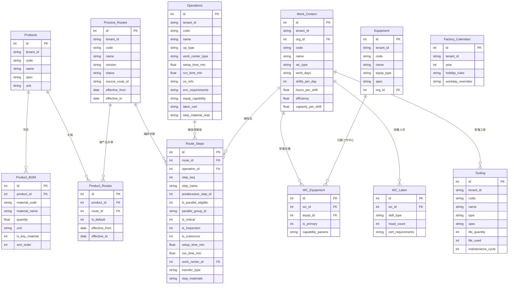
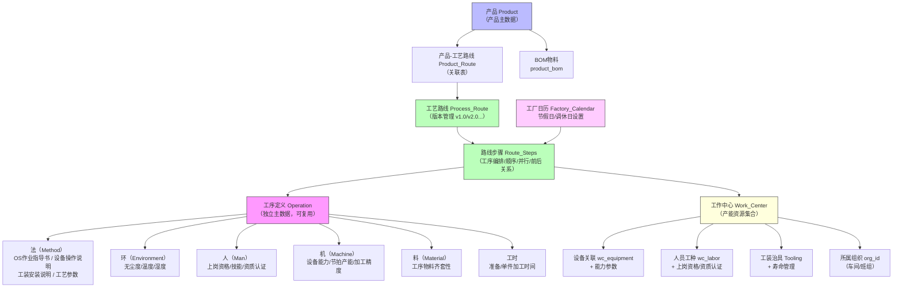
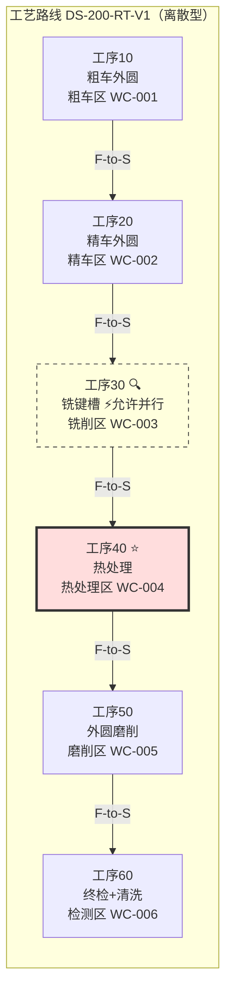
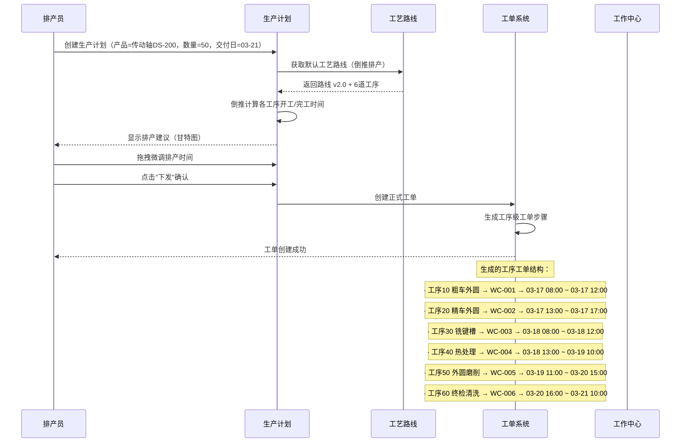
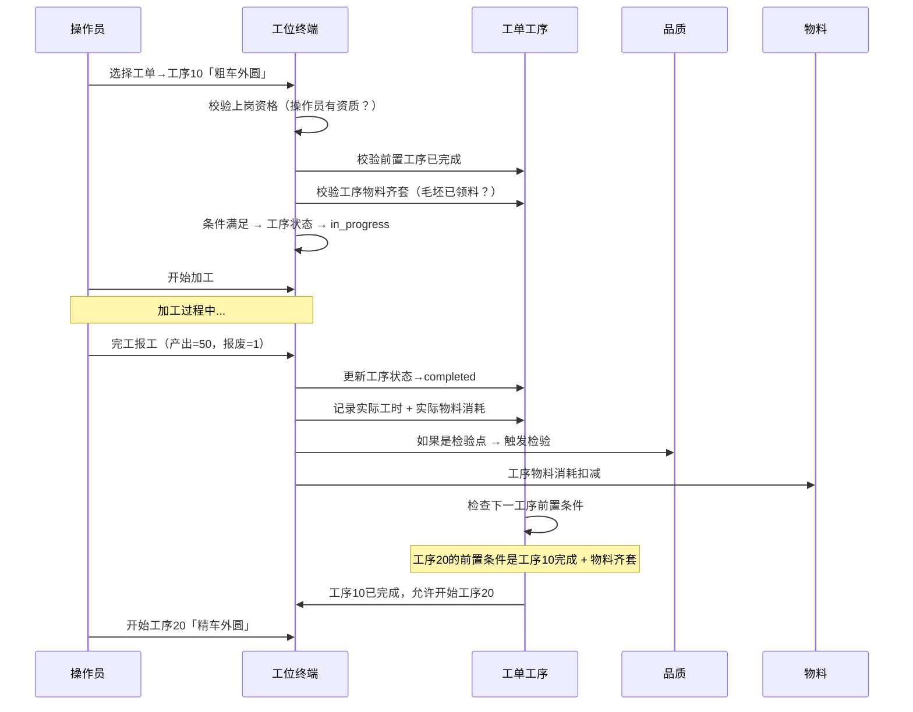

# 产品-工艺路线-产能资源模型设计（v2）

> **版本**：v2.0（修订版）  
> **作者**：Alice（PM）  
> **关联文档**：`tenant-sysadmin-design-v2.md`（组织/角色/权限框架）、`manufacturing-scenario-simulation.md`（场景模拟与覆盖度评估）、`architecture-impact-assessment.md`（架构影响评估）、`role-permission-matrix-full.md`（角色权限矩阵）  
> **设计背景**：用户反馈指出当前系统缺失产品主数据、产品-工艺路线关联、工序产能资源（人机料法环）定义。本文档提供完整的数据模型设计，覆盖产品管理→工艺路线编排→工作中心与产能资源→排产集成全链路。  
> **修订说明**：v2.0 基于用户6条反馈进行系统性修订，新增工厂日历、载入修改功能、排产策略、菜单分层设计、角色覆盖度分析、SAP PP参考对照。

---

## 0. 设计前提与约束（Phase 2 范围边界）

### 0.1 当前设计范围

本文档覆盖 **知微云 SaaS Phase 2（制造核心）** 的数据模型。模块边界如下：

```
┌─────────────────────────────────────────────────────────┐
│  Phase 2 范围（本文档）                                    │
│  ┌──────────┐  ┌──────────────┐  ┌──────────────────┐   │
│  │ 产品主数据 │  │ 工序定义库   │  │ 工作中心与产能资源 │   │
│  ├──────────┤  ├──────────────┤  ├──────────────────┤   │
│  │ BOM管理   │  │ 工艺路线编排  │  │ 工厂日历         │   │
│  └──────────┘  └──────────────┘  └──────────────────┘   │
│                                                         │
│  ┌──────────────────────────────────────────────────┐   │
│  │ 集成场景：工单工序展开 / 排产计算 / 工序报工       │   │
│  └──────────────────────────────────────────────────┘   │
├─────────────────────────────────────────────────────────┤
│  Phase 1 已建设（前置依赖）                               │
│  组织架构 / 用户管理 / 角色权限 / JWT认证                 │
├─────────────────────────────────────────────────────────┤
│  Phase 3+ 待建设（不在本文档范围）                         │
│  仓储管理 / 采购管理 / 成本核算 / SPC统计 / IoT实时监控    │
└─────────────────────────────────────────────────────────┘
```

### 0.2 与现有系统的集成关系

| 模块 | 集成对象 | 关系 |
|------|---------|------|
| 产品主数据 | 工单模块 | 工单创建时选择产品，自动展开为工序级工单 |
| 工序定义 | 品质模块 | 检验工序触发检验点，关联检验标准 |
| 工作中心 | 组织架构（organizations） | 工作中心通过 org_id 归属到车间/班组 |
| 工作中心 | 设备管理（equipment） | wc_equipment 关联设备库 |
| 工艺路线 | 权限体系 | 新增 route:create/read/update/delete/publish 权限编码 |
| 工厂日历 | 排产模块 | 排产计算基础，倒推算交付日期 |

### 0.3 SAP PP 概念对照（参考对标）

| 知微云概念 | SAP PP 概念 | 说明 |
|-----------|------------|------|
| 产品（Product） | Material（物料主数据） | 产品主数据相当于 SAP 的物料主数据中的成品视图 |
| BOM | BOM（物料清单） | 单级 BOM，SAP 支持多级展开 |
| 工序（Operation） | Operation | 工序是独立主数据，SAP 中工序存在于工艺路线内部 |
| 工艺路线（Process Route） | Routing | SAP 中工艺路线包含工序序列、工作中心分配、工时计算 |
| 工作中心（Work Center） | Work Center | SAP 中工作中心包含能力(容量)、成本中心、调度信息 |
| 工序步骤（Route Step） | Operation + Activity | 每个工序包含若干个作业活动 |
| 工厂日历（Factory Calendar） | Factory Calendar | SAP 中工厂日历用于排产和 MRP，支持假期规则 |
| 工序级工单 | Production Order + Operation | SAP 生产订单包含工序级组件，用于工序确认 |
| 倒推排产（Backward Scheduling） | Backward Scheduling | 从交付日期倒推各工序开始时间 |
| 手动排产（Manual Dispatch） | Manual Scheduling | 排产员手动在甘特图上分配资源 |

---

## 1. 核心概念关系图



### 数据流转



---

## 2. 产品主数据

### 2.1 设计理念

产品主数据是生产制造的**核心业务对象**。每个产品通过工艺路线关联工序定义，通过 BOM 关联物料需求。产品主数据与组织架构解耦，产品可在全租户范围内共享。

**产品变体策略**：同一产品不同规格型号（变体）可共用一套工艺路线母版，通过工艺路线的"载入修改"功能快速派生新版本。

### 2.2 Products 表 DDL

```sql
-- =============================================
-- 产品主数据表
-- =============================================
CREATE TABLE products (
    id          INTEGER PRIMARY KEY AUTOINCREMENT,
    tenant_id   VARCHAR(64) NOT NULL,                          -- 租户隔离
    code        VARCHAR(64) NOT NULL,                          -- 产品编码（如 "DS-200"）
    name        VARCHAR(128) NOT NULL,                         -- 产品名称（如 "传动轴"）
    spec        VARCHAR(256),                                  -- 规格型号
    unit        VARCHAR(32) DEFAULT '件',                      -- 计量单位
    -- 产品属性
    product_type VARCHAR(32) DEFAULT 'discrete',               -- 产品类型：discrete(离散)/process(流程)
    product_category VARCHAR(64),                              -- 产品分类：成品/半成品/原材料
    weight_kg   REAL,                                          -- 单件重量（kg）
    -- 图片与附件
    image_url   VARCHAR(256),                                  -- 产品图片
    drawing_ref VARCHAR(256),                                  -- 图纸编号/引用
    description TEXT,                                          -- 产品描述
    -- 控制
    is_active   INTEGER NOT NULL DEFAULT 1,                    -- 1=启用，0=停用
    created_at  TIMESTAMP DEFAULT CURRENT_TIMESTAMP,
    updated_at  TIMESTAMP DEFAULT CURRENT_TIMESTAMP,
    UNIQUE(tenant_id, code)
);

CREATE INDEX idx_products_tenant ON products(tenant_id);
CREATE INDEX idx_products_active ON products(tenant_id, is_active);
```

**字段说明**：

| 字段 | 类型 | 说明 |
|------|------|------|
| `product_category` | VARCHAR(64) | 产品分类：成品（final）/ 半成品（semi）/ 原材料（raw），用于区分产品层级 |
| `product_type` | VARCHAR(32) | 制造方式：discrete（离散型，按件加工）、process（流程型，按批次/连续生产） |

### 2.3 Product_BOM 表 DDL

```sql
-- =============================================
-- 产品物料清单（BOM）
-- 单级 BOM：直接物料清单，多级由业务逻辑层拼装
-- =============================================
CREATE TABLE product_bom (
    id              INTEGER PRIMARY KEY AUTOINCREMENT,
    tenant_id       VARCHAR(64) NOT NULL,
    product_id      INTEGER NOT NULL REFERENCES products(id) ON DELETE CASCADE,
    material_code   VARCHAR(64) NOT NULL,                     -- 物料编码（引用外部ERP或内部物料编码）
    material_name   VARCHAR(128) NOT NULL,                    -- 物料名称
    quantity        REAL NOT NULL,                            -- 单件用量
    unit            VARCHAR(32),                              -- 单位
    -- 物料属性
    material_type   VARCHAR(32) DEFAULT 'raw',                -- 物料类型：raw(原材料)/semi(半成品)/pack(包装)/consumable(消耗品)
    is_key_material INTEGER DEFAULT 0,                       -- 关键物料（需要批次追溯）
    -- 损耗与替代
    scrap_rate      REAL DEFAULT 0,                           -- 损耗率（%）
    substitute_codes TEXT,                                    -- 可替代物料编码（逗号分隔）
    -- 工序关联（可选）：指定该物料在哪个工序投入
    issue_operation_seq INTEGER,                              -- 投料工序序号（NULL=首工序投料）
    -- 排序
    sort_order      INTEGER DEFAULT 0,                        -- 排序序号
    created_at      TIMESTAMP DEFAULT CURRENT_TIMESTAMP,
    UNIQUE(product_id, material_code)
);

CREATE INDEX idx_bom_product ON product_bom(product_id);
CREATE INDEX idx_bom_material ON product_bom(tenant_id, material_code);
```

**新增字段说明**：

| 字段 | 说明 |
|------|------|
| `issue_operation_seq` | 物料在特定工序投入。如：毛坯在工序10投入，键槽铣刀在工序30投入。NULL 表示在首工序一次性投入。这支持了工序级物料齐套性检查。 |

### 2.4 API 设计

| 方法 | 路径 | 功能 | 优先级 |
|------|------|------|:------:|
| `GET` | `/api/v1/products` | 产品列表（分页+搜索，按 code/name 模糊匹配） | **P0** |
| `GET` | `/api/v1/products/{id}` | 产品详情（含 BOM 列表） | **P0** |
| `POST` | `/api/v1/products` | 创建产品（含 BOM 物料清单） | **P0** |
| `PUT` | `/api/v1/products/{id}` | 编辑产品基础信息 | **P0** |
| `PUT` | `/api/v1/products/{id}/bom` | 批量更新 BOM 清单（全量替换） | **P0** |
| `DELETE` | `/api/v1/products/{id}` | 删除产品（已有工单关联时禁止删除） | **P1** |
| `GET` | `/api/v1/products/{id}/routes` | 查看产品的所有工艺路线 | **P0** |
| `POST` | `/api/v1/products/{id}/routes` | 为产品关联工艺路线 | **P0** |
| `PUT` | `/api/v1/products/{id}/routes/default` | 设置默认工艺路线 | **P0** |

### 2.5 前端管理页说明

**产品列表页**（`/基础数据/产品管理`）：
- 表格展示：编码、名称、规格、单位、类型、分类、BOM 物料数、关联路线数、状态
- 搜索过滤：编码/名称模糊搜索、类型下拉过滤、启用/停用状态过滤
- 行操作：编辑、查看详情、启用/停用

**产品详情/编辑页**（弹窗或详情页）：
- Tab 1 — 基本信息：编码、名称、规格、单位、类型、分类、重量、图纸、图片、描述
- Tab 2 — BOM 清单：物料编码、名称、用量、单位、类型、损耗率、替代物料、投料工序
  - 表格行内编辑或弹窗编辑
  - 支持批量导入 BOM（Excel/CSV）
  - 支持按工序（issue_operation_seq）筛选查看物料齐套性
- Tab 3 — 关联工艺路线：展示该产品关联的所有工艺路线（版本、状态、生效日期）

---

## 3. 工序定义（Operation Master）

### 3.1 工序作为独立主数据的理念与价值

**核心设计**：工序（Operation）是**基础能力单元**，独立于产品定义，可被多个产品的工艺路线引用。

```
工序 = 制造能力的原子单位

传统做法：每产品一整套工序定义 → 重复定义、维护困难
本设计：工序集中定义 → 产品工艺路线从工序库中选择编排

示例场景：
  工序「粗车外圆」在工厂中是一台车床+一位车工的固定能力
  ✓ 产品A（传动轴）的工艺路线中用到它，排在步骤10
  ✓ 产品B（齿轮轴）的工艺路线中也用到它，排在步骤20
  ✓ 工序本身只定义一次，工时/参数/SOP统一维护
```

### 3.2 人机料法环精确定义（v2 增强）

基于用户反馈，每个生产要素在 operations 表中映射为专门的 JSON 结构化字段：

```
人（Man）         → labor_cert 字段
                     上岗资格 / 技能等级 / 资质认证要求
                     如：[{"cert":"数控车床操作证","level":"中级","required":true}]

机（Machine）     → equip_capability 字段
                     设备能力参数 / 节拍产能 / 加工精度范围
                     如：{"max_diameter_mm":200,"accuracy":"±0.05mm","cycle_time_min":4.5,"power_kw":15}

料（Material）    → step_material_reqs 字段（工序层面物料需求说明）
                     工序所需的特定物料/辅助物料/工装物料
                     如：[{"material":"键槽铣刀","type":"tool","qty":1},{"material":"冷却液","type":"consumable","qty_per_hr":0.5}]
                     （注意：产品级BOM在 product_bom 管理，工序级物料在此标注齐套性要求）

法（Method）      → os_refs + 工艺参数_json 字段
                     OS（Operation Standard）= 作业指导书集合
                     包含：设备操作说明 / 工装安装说明 / SOP文档引用 / 工艺参数范围
                     如：[{"type":"sop","ref":"SOP-MC-001","title":"粗车操作规程"},
                          {"type":"equipment","ref":"EQ-OP-003","title":"CK6150车床操作手册"},
                          {"type":"tooling","ref":"TG-INST-005","title":"三爪卡盘安装说明"}]

环（Environment） → env_requirements 字段
                     环境要求结构化描述
                     如：{"cleanliness":"Class1000","temp":"22±2°C","humidity":"45±5%RH","ventilation":"required","special":"无振动源"}
```

### 3.3 Operations 表 DDL（v2 增强版）

```sql
-- =============================================
-- 工序定义主表
-- 工序 = 制造能力的原子单位，独立主数据
-- v2 增强：人机料法环精确定义为结构化 JSON 字段
-- =============================================
CREATE TABLE operations (
    id              INTEGER PRIMARY KEY AUTOINCREMENT,
    tenant_id       VARCHAR(64) NOT NULL,
    code            VARCHAR(64) NOT NULL,                     -- 工序编码（如 "OP-010"）
    name            VARCHAR(128) NOT NULL,                    -- 工序名称（如 "粗车外圆"）
    op_type         VARCHAR(32) NOT NULL,                     -- 工序类型
    description     TEXT,                                     -- 工序描述
    work_center_type VARCHAR(32),                             -- 所需工作中心类型（如"车削中心"、"热处理炉"）
    -- 工时（默认值，工艺路线步骤可覆盖）
    setup_time_min  REAL DEFAULT 0,                           -- 准备时间（分钟）
    run_time_min    REAL DEFAULT 0,                           -- 单件加工时间（分钟）
    -- 人（Man）：上岗资格/技能/资质认证要求
    labor_cert      TEXT,                                     -- JSON数组: [{"cert":"数控车床操作证","level":"中级","required":true}]
    -- 机（Machine）：设备能力要求
    equip_capability TEXT,                                    -- JSON: {"max_diameter_mm":200,"accuracy":"±0.05mm","cycle_time_min":4.5}
    -- 料（Material）：工序级物料需求（齐套性检查）
    step_material_reqs TEXT,                                  -- JSON数组: [{"material":"键槽铣刀","type":"tool","qty":1}]
    -- 法（Method）：OS作业指导书集合
    os_refs         TEXT,                                     -- JSON数组: [{"type":"sop","ref":"SOP-001","title":"粗车规程"},{"type":"equipment","ref":"EQ-OP-003"}]
    工艺参数_json    TEXT,                                     -- JSON: {"spindle_rpm":800,"feed_mm_per_rev":0.2,"depth_mm":2.0}
    -- 环（Environment）：环境要求
    env_requirements TEXT,                                    -- JSON: {"cleanliness":"Class1000","temp":"22±2°C","humidity":"45±5%RH"}
    -- 质检
    default_inspection_standard VARCHAR(256),                  -- 默认检验标准引用
    -- 控制
    is_active       INTEGER DEFAULT 1,
    created_at      TIMESTAMP DEFAULT CURRENT_TIMESTAMP,
    updated_at      TIMESTAMP DEFAULT CURRENT_TIMESTAMP,
    UNIQUE(tenant_id, code)
);

CREATE INDEX idx_ops_tenant ON operations(tenant_id);
CREATE INDEX idx_ops_type ON operations(op_type);
```

### 3.4 工序类型枚举

| 编码 | 名称 | 说明 | 适用场景 |
|------|------|------|---------|
| `machining` | 机加工 | 车/铣/刨/磨/钻等金属切削 | 离散型 |
| `assembly` | 装配 | 零部件组装 | 离散型 |
| `heat_treat` | 热处理 | 淬火/回火/渗碳/退火 | 离散型 |
| `surface_treat` | 表面处理 | 电镀/喷涂/氧化 | 离散型 |
| `inspect` | 检验 | 尺寸/性能/外观检验 | 通用 |
| `pack` | 包装 | 清洗/防锈/包装/贴标 | 通用 |
| `reaction` | 反应 | 聚合/合成/发酵等化学反应 | 流程型 |
| `blend` | 配比/混合 | 原料称量/配比/混合 | 流程型 |
| `separation` | 分离 | 过滤/离心/蒸馏/萃取 | 流程型 |
| `filling` | 灌装 | 液体/粉体灌装 | 流程型 |
| `transport` | 流转 | 工序间转运/暂存 | 通用 |

### 3.5 API 设计

| 方法 | 路径 | 功能 | 优先级 |
|------|------|------|:------:|
| `GET` | `/api/v1/operations` | 工序列表（分页+按类型/名称搜索） | **P0** |
| `GET` | `/api/v1/operations/{id}` | 工序详情 | **P0** |
| `POST` | `/api/v1/operations` | 创建工序 | **P0** |
| `PUT` | `/api/v1/operations/{id}` | 编辑工序 | **P0** |
| `DELETE` | `/api/v1/operations/{id}` | 删除工序（被工艺路线引用时禁止删除） | **P1** |
| `GET` | `/api/v1/operations/{id}/usages` | 查看该工序被哪些工艺路线引用 | **P1** |

### 3.6 前端管理页说明

**工序库管理页**（`/基础数据/工序定义`）：
- 卡片/列表展示所有已定义工序，按类型分组
- 搜索过滤：编码/名称、工序类型
- 工序卡片展示：编码、名称、类型、工时、所需工作中心类型、关联路线数

**工序创建/编辑弹窗**（v2 增强版表单）：
- Tab 1 — 基本信息：编码、名称、类型、工作中心类型、描述
- Tab 2 — 工时：准备时间、单件加工时间
- Tab 3 — 人（Man）：上岗资格/资质要求（表格：证书名称、等级、是否必须）
- Tab 4 — 机（Machine）：设备能力参数（最大加工直径、精度、节拍、功率等）
- Tab 5 — 料（Material）：工序级所需物料/辅助物料清单（用于齐套性检查）
- Tab 6 — 法（Method）：
  - OS作业指导书列表（类型：SOP/设备操作说明/工装安装说明，引用编号，标题）
  - 工艺参数（结构化表单：转速/进给/温度/压力等，或 JSON 编辑器）
- Tab 7 — 环（Environment）：无尘度、温度、湿度、通风要求

---

## 4. 工作中心与产能资源

### 4.1 设计理念

**工作中心（Work Center）** = 生产/加工能力的物理载体。它组织了一个生产单元所需的所有资源：

```
工作中心 = 组织节点(车间/班组) + 设备集合（含能力参数）+ 人员工种（含上岗资格）
         + 工装治具 + 工作日历（继承工厂日历，可覆盖）
```

### 4.2 WorkCenters 表 DDL

```sql
-- =============================================
-- 工作中心定义表
-- 一个工作中心 = 一个生产单元（产线/工段/班组）
-- =============================================
CREATE TABLE work_centers (
    id              INTEGER PRIMARY KEY AUTOINCREMENT,
    tenant_id       VARCHAR(64) NOT NULL,
    org_id          INTEGER NOT NULL REFERENCES organizations(id),  -- 所属组织（车间/班组）
    code            VARCHAR(64) NOT NULL,                           -- 工作中心编码（如 "WC-001"）
    name            VARCHAR(128) NOT NULL,                          -- 工作中心名称（如 "粗车区"）
    wc_type         VARCHAR(32) NOT NULL,                           -- 类型：production(生产)/inspection(检验)/warehouse(仓储)
    -- 位置
    location        VARCHAR(256),                                   -- 位置描述
    -- 工作日历（默认值，优先继承工厂日历，可在此覆盖）
    work_days       VARCHAR(32) DEFAULT '1,2,3,4,5',               -- 工作周：1-7 表示周一到周日
    shifts_per_day  INTEGER DEFAULT 1,                              -- 每天班次
    hours_per_shift REAL DEFAULT 8,                                 -- 每班小时数
    efficiency      REAL DEFAULT 0.85,                              -- 效率因子（85% = 8小时实际6.8小时）
    -- 产能
    capacity_per_shift REAL,                                        -- 每班产能（件/批）
    capacity_unit  VARCHAR(32) DEFAULT '件',                        -- 产能单位
    -- 控制
    is_active       INTEGER DEFAULT 1,
    created_at      TIMESTAMP DEFAULT CURRENT_TIMESTAMP,
    updated_at      TIMESTAMP DEFAULT CURRENT_TIMESTAMP,
    UNIQUE(tenant_id, code)
);

CREATE INDEX idx_wc_tenant ON work_centers(tenant_id);
CREATE INDEX idx_wc_org ON work_centers(org_id);
CREATE INDEX idx_wc_type ON work_centers(wc_type);
```

### 4.3 资源关联表 DDL（v2 增强版）

```sql
-- =============================================
-- 工作中心-设备关联（v2：增加能力参数）
-- =============================================
CREATE TABLE wc_equipment (
    id          INTEGER PRIMARY KEY AUTOINCREMENT,
    wc_id       INTEGER NOT NULL REFERENCES work_centers(id) ON DELETE CASCADE,
    equip_id    INTEGER NOT NULL REFERENCES equipment(id) ON DELETE CASCADE,
    is_primary  INTEGER DEFAULT 0,                               -- 1=主设备（用于产能计算基准）
    capability_params TEXT,                                       -- JSON: 该设备在此工作中心的能力参数
    -- 如：{"accuracy":"±0.05mm","max_diameter":200,"cycle_time_min":4.5,"power_kw":15}
    UNIQUE(wc_id, equip_id)
);

CREATE INDEX idx_wc_eq_wc ON wc_equipment(wc_id);
CREATE INDEX idx_wc_eq_eq ON wc_equipment(equip_id);

-- =============================================
-- 工作中心-人员工种要求（v2：强化资质认证）
-- =============================================
CREATE TABLE wc_labor (
    id              INTEGER PRIMARY KEY AUTOINCREMENT,
    wc_id           INTEGER NOT NULL REFERENCES work_centers(id) ON DELETE CASCADE,
    skill_type      VARCHAR(64) NOT NULL,                          -- 工种/技能类型（如"车工"、"热处理工"）
    head_count      INTEGER DEFAULT 1,                             -- 所需人数（该工作中心正常运转所需）
    cert_requirements TEXT,                                        -- JSON数组: 资质要求清单
    -- 如：[{"cert":"数控车床操作证","level":"中级","required":true,"description":"需持有效数控车床中级以上证书"},
    --      {"cert":"安全生产培训","level":"初级","required":true}]
    UNIQUE(wc_id, skill_type)
);

CREATE INDEX idx_wc_labor_wc ON wc_labor(wc_id);

-- =============================================
-- 工装治具管理
-- =============================================
CREATE TABLE tooling (
    id              INTEGER PRIMARY KEY AUTOINCREMENT,
    tenant_id       VARCHAR(64) NOT NULL,
    code            VARCHAR(64) NOT NULL,                   -- 工装编码（如 "TL-CNMG120408"）
    name            VARCHAR(128) NOT NULL,                  -- 工装名称（如 "外圆粗车刀片 CNMG120408"）
    type            VARCHAR(32) NOT NULL,                   -- 类型：tool(刀具)/fixture(夹具)/jig(模具)/gauge(量具)
    spec            VARCHAR(256),                           -- 规格参数
    -- 寿命管理
    life_type       VARCHAR(16) DEFAULT 'quantity',         -- 寿命类型：quantity(件数)/time(时间)
    life_quantity   INTEGER,                                -- 寿命（加工件数）
    life_hours      REAL,                                   -- 寿命（加工小时数）
    life_used       INTEGER DEFAULT 0,                      -- 已用次数
    -- 维护
    maintenance_cycle INTEGER,                              -- 保养周期（件数或天数）
    maintenance_type VARCHAR(32),                           -- 保养类型：sharpening(刃磨)/replace(更换)/calibrate(校准)
    -- 关联
    wc_id           INTEGER REFERENCES work_centers(id),   -- 默认归属工作中心（可选）
    -- 控制
    is_active       INTEGER DEFAULT 1,
    created_at      TIMESTAMP DEFAULT CURRENT_TIMESTAMP,
    UNIQUE(tenant_id, code)
);

CREATE INDEX idx_tooling_tenant ON tooling(tenant_id);
CREATE INDEX idx_tooling_type ON tooling(type);
CREATE INDEX idx_tooling_wc ON tooling(wc_id);
```

### 4.4 工厂日历（v2 新增）

```sql
-- =============================================
-- 工厂日历表（v2 新增）
-- 基础数据模块：设定工厂级的节假日/调休日
-- 工作中心可继承工厂日历，也可单独覆盖
-- =============================================
CREATE TABLE factory_calendars (
    id              INTEGER PRIMARY KEY AUTOINCREMENT,
    tenant_id       VARCHAR(64) NOT NULL,
    year            INTEGER NOT NULL,                              -- 年份（如 2025）
    -- 节假日规则
    holiday_rules   TEXT NOT NULL,                                 -- JSON数组: 节假日定义
    -- 如：[{"date":"2025-01-01","name":"元旦","type":"holiday"},
    --      {"date":"2025-01-28","name":"春节","type":"holiday","days":7},
    --      {"date":"2025-01-26","name":"春节调休上班","type":"workday"}]
    -- 批量规则支持（如每周六日自动为休息日）
    weekend_days    VARCHAR(16) DEFAULT '6,7',                     -- 默认休息日（6=周六，7=周日）
    description     TEXT,
    is_active       INTEGER DEFAULT 1,
    created_at      TIMESTAMP DEFAULT CURRENT_TIMESTAMP,
    updated_at      TIMESTAMP DEFAULT CURRENT_TIMESTAMP,
    UNIQUE(tenant_id, year)
);

CREATE INDEX idx_fc_tenant ON factory_calendars(tenant_id);
CREATE INDEX idx_fc_year ON factory_calendars(year);
```

**工厂日历使用逻辑**：

```python
def is_workday(date, wc=None):
    """
    判断某天是否为工作日
    优先级：工作中心覆盖 > 工厂日历调休 > 工厂日历默认规则
    """
    # 1. 如果工作中心有自己的 work_days 覆盖，优先使用
    if wc and wc.work_days:
        if date.weekday() not in parse_work_days(wc.work_days):
            return False
    
    # 2. 查工厂日历的调休/加班规则
    calendar = get_factory_calendar(date.year)
    if calendar:
        rule = calendar.get_rule_for_date(date)
        if rule:
            return rule.type == 'workday'   # holiday=false, workday=true
    
    # 3. 查默认周末规则
    if calendar and date.weekday() in parse_weekend_days(calendar.weekend_days):
        return False
    
    # 4. 默认为工作日
    return True
```

**前端管理页**（`/基础数据/工厂日历`）：
- 年度日历视图，展示全年工作日/休息日
- 批量操作：一键设置法定节假日、批量设置调休日
- 支持导入/导出日历配置（Excel）
- 工作中心级覆盖：在选择工作中心时，可单独修改其工作日历

### 4.5 产能计算逻辑

```python
# 产能计算逻辑（v2 增强版 - 支持工厂日历）
def calculate_daily_capacity(wc: WorkCenter, operation: Operation, date=None) -> dict:
    """
    计算工作中心针对某工序在某一天的产能
    """
    # 1. 判断是否为工作日
    if date and not is_workday(date, wc):
        return {"daily_capacity": 0, "daily_hours": 0, "shifts": 0, "reason": "非工作日"}
    
    # 2. 有效工作时间
    daily_hours = wc.shifts_per_day * wc.hours_per_shift * wc.efficiency
    
    # 3. 考虑主设备节拍（如有）
    primary_equip = get_primary_equipment(wc.id)
    if primary_equip and primary_equip.capability_params:
        params = json.loads(primary_equip.capability_params)
        cycle_time = params.get('cycle_time_min')
        if cycle_time:
            # 基于设备节拍计算
            daily_minutes = daily_hours * 60
            capacity = int(daily_minutes / cycle_time)
            return {
                "daily_capacity": capacity,
                "daily_hours": daily_hours,
                "shifts": wc.shifts_per_day,
                "efficiency": wc.efficiency,
                "based_on": "equipment_cycle"
            }
    
    # 4. 根据工序工时计算（无设备节拍时）
    if wc.capacity_per_shift:
        daily_capacity = wc.capacity_per_shift * wc.shifts_per_day
    else:
        daily_minutes = daily_hours * 60
        setup_total = operation.setup_time_min
        capacity = (daily_minutes - setup_total) / operation.run_time_min
        daily_capacity = max(0, int(capacity))
    
    return {
        "daily_capacity": daily_capacity,
        "daily_hours": daily_hours,
        "shifts": wc.shifts_per_day,
        "efficiency": wc.efficiency
    }
```

### 4.6 管理功能

| 功能 | 说明 | 优先级 |
|------|------|:------:|
| 工作中心列表 | 按组织树展示，可查看所属设备/人员/工装 | **P0** |
| 创建/编辑工作中心 | 基本信息 + 工作日历（继承工厂日历） + 关联组织 | **P0** |
| 设备关联管理 | 从设备库选择设备，标记主设备，填能力参数 | **P0** |
| 人员工种配置 | 添加工种/技能要求，设定人数，资质认证要求 | **P1** |
| 工装治具管理 | 工装台账 + 寿命追踪 + 保养提醒 | **P1** |
| 工厂日历管理 | 年度日历视图，节假日/调休日设置 | **P1** |
| 产能看板 | 按工作中心展示实时产能/负荷率 | **P1** |

---

## 5. 工艺路线与工序编排

### 5.1 ProcessRoutes 表 DDL（v2 增强版）

```sql
-- =============================================
-- 工艺路线主表
-- 一个产品可以有多个版本的工艺路线
-- v2 增强：支持"载入已有路线"功能（source_route_id）
-- =============================================
CREATE TABLE process_routes (
    id              INTEGER PRIMARY KEY AUTOINCREMENT,
    tenant_id       VARCHAR(64) NOT NULL,
    code            VARCHAR(64) NOT NULL,                     -- 路线编码（如 "DS-200-RT-V1"）
    name            VARCHAR(128) NOT NULL,                    -- 路线名称（如 "传动轴标准工艺路线"）
    version         VARCHAR(16) NOT NULL DEFAULT 'v1.0',      -- 版本号
    status          VARCHAR(16) NOT NULL DEFAULT 'draft',     -- 状态：draft/published/archived
    -- 工艺类型
    route_type      VARCHAR(16) DEFAULT 'discrete',          -- 路线类型：discrete(离散)/process(流程)
    description     TEXT,                                     -- 路线描述
    -- 载入来源（v2：支持载入已有路线进行修改）
    source_route_id INTEGER REFERENCES process_routes(id),   -- 载入的源路线ID（NULL=全新创建）
    source_version  VARCHAR(16),                              -- 源版本号（如"v1.0"）
    change_notes    TEXT,                                     -- 变更说明（相对于源路线的修改描述）
    -- 有效期
    effective_from  TIMESTAMP,                                -- 生效日期
    effective_to    TIMESTAMP,                                -- 失效日期
    -- 统计
    total_steps     INTEGER DEFAULT 0,                        -- 工序步骤数
    total_setup_min REAL DEFAULT 0,                           -- 总准备时间
    total_run_min   REAL DEFAULT 0,                           -- 总加工时间
    -- 控制
    created_by      INTEGER REFERENCES users(id),
    created_at      TIMESTAMP DEFAULT CURRENT_TIMESTAMP,
    updated_at      TIMESTAMP DEFAULT CURRENT_TIMESTAMP,
    UNIQUE(tenant_id, code, version)
);

CREATE INDEX idx_routes_tenant ON process_routes(tenant_id);
CREATE INDEX idx_routes_status ON process_routes(status);
CREATE INDEX idx_routes_code ON process_routes(tenant_id, code);
CREATE INDEX idx_routes_source ON process_routes(source_route_id);
```

**v2 新增字段说明**：

| 字段 | 说明 |
|------|------|
| `source_route_id` | 载入的源路线 ID。当工艺工程师需要基于现有路线修改时，系统先 deep-copy 源路线的所有步骤，再允许编辑。这实现了"产品变体只需局部工序调整"的核心诉求。 |
| `source_version` | 源版本号，便于追溯变更基线。 |
| `change_notes` | 变更说明，记录相对于源路线的具体修改（如："将工序20精车从WC-002改为WC-008，新增工序25去毛刺"）。 |

### 5.2 RouteSteps 表 DDL（v2 增强版）

```sql
-- =============================================
-- 工艺路线步骤表（工序编排核心）
-- v2 核心修正：is_parallel 语义从"是否并行"改为"允许并行"
-- =============================================
CREATE TABLE route_steps (
    id                  INTEGER PRIMARY KEY AUTOINCREMENT,
    route_id            INTEGER NOT NULL REFERENCES process_routes(id) ON DELETE CASCADE,
    operation_id        INTEGER NOT NULL REFERENCES operations(id),  -- 引用的工序
    step_seq            INTEGER NOT NULL,                            -- 步骤序号（10/20/30...留间隔便于插入）
    step_name           VARCHAR(128),                                -- 步骤名称（可覆盖工序名称）
    -- 前后关系
    predecessor_step_id INTEGER REFERENCES route_steps(id),          -- 前置步骤（NULL=起始工序）
    -- 并行属性（v2 语义修正）
    is_parallel_eligible INTEGER DEFAULT 0,                          -- 工艺上允许并行（属性标记）
    -- 注意：is_parallel_eligible=1 仅表示"该工序从工艺上可以并行执行"
    -- 实际是否并行排产，由排产引擎根据人机料法环资源可用性决定
    -- 流程型路线不允许并行，此字段恒为0
    parallel_group_id   VARCHAR(32),                                 -- 并行分组标识（同组工序允许并行）
    -- 标记
    is_critical         INTEGER DEFAULT 0,                           -- 关键工序
    is_inspection       INTEGER DEFAULT 0,                           -- 检验点
    is_outsource        INTEGER DEFAULT 0,                           -- 外协工序
    -- 配置覆盖（覆盖工序定义的默认值）
    setup_time_min      REAL,                                        -- 覆盖准备时间
    run_time_min        REAL,                                        -- 覆盖单件加工时间
    work_center_id      INTEGER REFERENCES work_centers(id),         -- 指定工作中心
    -- 工序级物料（v2：该工序所需的特定物料/组件，用于齐套性检查）
    step_materials      TEXT,                                        -- JSON数组: [{"material_code":"M-001","qty":2,"unit":"件","is_consumable":false}]
    -- 质检
    inspection_standard_id INTEGER,                                  -- 关联检验标准
    -- 流转
    transfer_type       VARCHAR(16) DEFAULT 'F-to-S',                -- 流转类型：F-to-S(串行)/S-to-S(并行)
    -- 排产
    priority            INTEGER DEFAULT 500,                         -- 排产优先级（越小越优先）
    -- 控制
    created_at          TIMESTAMP DEFAULT CURRENT_TIMESTAMP,
    UNIQUE(route_id, step_seq)
);

CREATE INDEX idx_rs_route ON route_steps(route_id);
CREATE INDEX idx_rs_operation ON route_steps(operation_id);
CREATE INDEX idx_rs_predecessor ON route_steps(predecessor_step_id);
```

**v2 核心语义修正**：`is_parallel_eligible` 仅表示"工艺上允许并行"，具体区别如下：

| 场景 | is_parallel_eligible | 并行组 | 实际排产 |
|------|:-------------------:|:------:|---------|
| 工序严格串行（如：粗车→精车，必须分步） | 0 | 无 | 强制串行 |
| 工序可并行（如：A组铣键槽+B组铣键槽，产能可翻倍） | 1 | PG-1 | 排产引擎根据资源决定是否并行 |
| 流程型路线（如：反应→分离，必须顺序） | 0 | 无 | 强制串行，恒为0 |

### 5.3 工序编排逻辑（v2 修订版）

#### 核心规则

1. **流程型工艺路线**（`route_type='process'`）：
   - 全部工序为串行（F-to-S）
   - `is_parallel_eligible` 恒为 0
   - `transfer_type` 恒为 `F-to-S`（或 `S-to-S` 仅用于紧耦合分批流转）
   - 不支持并行工序

2. **离散型工艺路线**（`route_type='discrete'`）：
   - 串行为主，部分工序可标注 `is_parallel_eligible=1`
   - 并行组内的工序可被排产引擎安排到多个工作中心并行执行
   - `is_parallel_eligible` 仅是"工艺属性标记"，不是"强制并行指令"
   - 实际并行与否：排产引擎根据人机料法环资源可用性动态决定

3. **并行决策逻辑**：

```python
def should_parallel_execute(route_step, work_centers, order_qty, constraints):
    """
    排产引擎判断是否实际并行执行某工序
    
    输入：
      - route_step: 路线步骤（含 is_parallel_eligible, parallel_group_id）
      - work_centers: 可用的工作中心列表
      - order_qty: 工单数量
      - constraints: 产能约束
    
    返回：
      - parallel_plan: [{"wc_id": 1, "qty": 30}, {"wc_id": 2, "qty": 20}, ...]
    
    逻辑：
    """
    if not route_step.is_parallel_eligible:
        # 不允许并行 → 单个工作中心串行执行
        wc = select_best_work_center(work_centers, route_step)
        return [{"wc_id": wc.id, "qty": order_qty}]
    
    # 允许并行 → 检查资源可用性
    available_wcs = get_available_work_centers(work_centers, route_step)
    
    if len(available_wcs) <= 1:
        # 即使允许并行，但只有一个可用资源 → 实际串行
        return [{"wc_id": available_wcs[0].id, "qty": order_qty}]
    
    # 有多个可用资源 → 按产能比例分配
    total_capacity = sum(wc.capacity_per_shift for wc in available_wcs)
    plan = []
    for wc in available_wcs:
        ratio = wc.capacity_per_shift / total_capacity
        plan.append({
            "wc_id": wc.id,
            "qty": int(order_qty * ratio),
            "estimated_hours": order_qty * route_step.run_time_min / 60 / len(available_wcs)
        })
    
    return plan
```

#### 串行工序（F-to-S）

```
工序10（粗车外圆）→ 工序20（精车外圆）→ 工序30（铣键槽）→ ...
```

#### 允许并行的工序（v2 语义修正）

```
                ┌→ 工序20（精车外圆）@ WC-002A ← 允许并行
工序10（粗车）←┤
                └→ 工序20（精车外圆）@ WC-002B ← 允许并行
```

- `is_parallel_eligible=1`，`parallel_group_id='PG-1'`
- 工艺上允许并行排产，但实际由排产引擎根据 WC-002A 和 WC-002B 的资源可用性决定
- 如果 WC-002B 当天满负荷，则只在 WC-002A 串行执行

#### 离散型 + 流程型对比（v2 修正版）

| 维度 | 离散型（传动轴） | 流程型（丙烯酸树脂） |
|------|----------------|-------------------|
| 工序关系 | 串行为主，可选并行（属性标记） | **严格串行，不允许并行** |
| 流转 | F-to-S（前道完成→后道开始） | F-to-S（严格顺序） |
| 并行语义 | `is_parallel_eligible` 为工艺属性标记 | `is_parallel_eligible` 恒为 0 |
| 并行决策 | 排产引擎根据资源动态决定 | 不支持并行 |
| 中间缓存 | 工序间有暂存点 | 管道输送，无物理暂存 |
| 批次 | 批量50件/批 | 连续5000kg/批 |
| 关键工序 | 热处理（工序40） | 预聚合（工序20）+ 聚合（工序30） |

#### 工艺路线图示例 — 传动轴



### 5.4 工序编排交互设计（v2 增强版：载入已有路线）

```
┌─────────────────────────────────────────────────────────┐
│  工艺路线：[传动轴标准工艺路线]  版本：[v2.0]  状态：[草稿]│
│  源路线：[传动轴标准工艺路线 v1.0]  变更说明：[新增工序25] │
├─────────────────────────────────────────────────────────┤
│  ┌─ 操作栏 ─────────────────────────────────────────┐  │
│  │ [📂 载入已有路线] [💾 保存] [📋 另存为新版本]    │  │
│  │ [▶ 发布] [🔍 版本对比]                            │  │
│  └────────────────────────────────────────────────────┘  │
│                                                         │
│  ┌─ 工序库 ─────────────────────────────────────────┐  │
│  │ [粗车外圆] [精车外圆] [铣键槽] [热处理] [去毛刺] │  │
│  │ [外圆磨削] [终检清洗] ...                        │  │
│  └────────────────────────────────────────────────────┘  │
│                                                         │
│  ┌─ 路线编排画布 ──────────────────────────────────┐  │
│  │                                                  │  │
│  │  [工序10] ──→ [工序20] ──→ [工序25] ──→ [工序30]│  │
│  │   粗车外圆      精车外圆    [🆕 去毛刺]   铣键槽  │  │
│  │                                                  │  │
│  │                         ↓                         │  │
│  │                                                  │  │
│  │  [工序40] ←── [工序50] ←── [工序60]            │  │
│  │   热处理        外圆磨削      终检清洗            │  │
│  │                                                  │  │
│  └──────────────────────────────────────────────────┘  │
│                                                         │
│  选中工序30 - 配置面板                                  │
│  ┌────────────────────────────────────────────────┐     │
│  │ · 前置步骤：工序25（去毛刺）                    │     │
│  │ · 允许并行：☑（分组ID：[PG-1]）               │     │
│  │   ⚠ 标记为"允许并行"，实际排产由引擎决定        │     │
│  │ · 关键工序：□                                   │     │
│  │ · 检验点：☑                                    │     │
│  │ · 外协：□                                      │     │
│  │ · 工作中心：[铣削区 WC-003]                    │     │
│  │ · 工时覆盖：准备[12]min 单件[5.0]min           │     │
│  │ · 工序物料：[键槽铣刀×1, 冷却液×0.5L]         │     │
│  └────────────────────────────────────────────────┘     │
└─────────────────────────────────────────────────────────┘
```

#### 交互功能（v2 增强）

1. **载入已有路线**：点击"载入已有路线"按钮 → 弹出路线选择对话框 → 选择源路线 → 系统 deep-copy 所有步骤 → 进入编辑模式 → 源路线ID和版本号自动填充到 `source_route_id` 和 `source_version`
2. **工序库拖拽**：从左侧工序库拖拽工序到右侧画布
3. **连线**：从工序 A 拖到工序 B 建立前后关系
4. **双击工序打开配置面板**（v2 增加并行语义提示、工序物料配置）
5. **Ctrl+拖拽创建并行工序**（仅离散型可用，流程型不可用）
6. **右键菜单**：插入工序、删除、复制、设为并行组
7. **版本对比**：点击"版本对比" → 并排显示当前版本与源版本的步骤差异（新增/删除/修改的工序高亮显示）
8. **另存为新版本**：编辑完成后，点击"另存为新版本" → 自动 version+1 → 填入变更说明

### 5.5 API 设计

| 方法 | 路径 | 功能 | 优先级 |
|------|------|------|:------:|
| `GET` | `/api/v1/routes` | 工艺路线列表（分页+按产品/状态搜索） | **P0** |
| `GET` | `/api/v1/routes/{id}` | 路线详情（含完整步骤列表，按 step_seq 排序） | **P0** |
| `POST` | `/api/v1/routes` | 创建工艺路线（全新或指定 source_route_id 载入） | **P0** |
| `PUT` | `/api/v1/routes/{id}` | 编辑路线基本信息 | **P0** |
| `PUT` | `/api/v1/routes/{id}/status` | 变更状态（draft→published→archived） | **P0** |
| `DELETE` | `/api/v1/routes/{id}` | 删除路线（已关联产品时禁止） | **P1** |
| `POST` | `/api/v1/routes/{id}/steps` | 批量更新步骤（全量替换——先删后插） | **P0** |
| `PUT` | `/api/v1/routes/{id}/steps/{stepId}` | 编辑单个步骤配置 | **P1** |
| `PUT` | `/api/v1/routes/{id}/steps/reorder` | 重新排序步骤（拖拽后批量更新 step_seq） | **P1** |
| `POST` | `/api/v1/routes/{id}/publish` | 发布新版本（自动 version+1） | **P1** |
| `GET` | `/api/v1/routes/{id}/diff/{compareId}` | 版本对比（返回两个版本的步骤差异） | **P1** |
| `POST` | `/api/v1/routes/{id}/clone` | 克隆路线为草稿（指定新版本号） | **P1** |

---

## 6. 产品-工艺路线关联

### 6.1 Product_Routes 关联表 DDL

```sql
-- =============================================
-- 产品-工艺路线关联表
-- 一个产品可关联多个工艺路线版本，但仅一个默认路线
-- =============================================
CREATE TABLE product_routes (
    id              INTEGER PRIMARY KEY AUTOINCREMENT,
    product_id      INTEGER NOT NULL REFERENCES products(id) ON DELETE CASCADE,
    route_id        INTEGER NOT NULL REFERENCES process_routes(id) ON DELETE CASCADE,
    is_default      INTEGER NOT NULL DEFAULT 0,              -- 1=默认工艺路线（创建工单时自动选用）
    effective_from  TIMESTAMP,                                -- 关联生效日期
    effective_to    TIMESTAMP,                                -- 关联失效日期
    created_at      TIMESTAMP DEFAULT CURRENT_TIMESTAMP,
    UNIQUE(product_id, route_id)
);

CREATE INDEX idx_pr_product ON product_routes(product_id);
CREATE INDEX idx_pr_route ON product_routes(route_id);
CREATE INDEX idx_pr_default ON product_routes(product_id, is_default);
```

### 6.2 多版本策略

**适用场景**：

```
产品：传动轴 DS-200
├── 工艺路线 v1.0（2025-03-01 ~ 2025-06-30）
│   └── 工序：粗车→精车→铣键槽→热处理→磨削→终检
├── 工艺路线 v2.0（2025-07-01 ~ 至今，基于 v1.0 载入修改）
│   └── 工序：粗车→精车→铣键槽→热处理→磨削→终检
│       └── 差异：精车工序改用了新的高精车床，工时从6.0min缩短到4.5min
│       └── 变更说明："优化精车工艺，更换工作中心 WC-008"
└── 工艺路线 v2.1（待发布，基于 v2.0 载入修改）
    └── 变更：增加了工序25「去毛刺」
    └── 变更说明："新增去毛刺工序以提升表面质量"
```

**版本管理规则**：
1. 一个产品可关联多个工艺路线版本
2. 仅有**一个**默认路线（`is_default=1`），创建工单时自动选用
3. 版本状态机：`draft → published → archived`
4. draft 状态可编辑；published 状态不可编辑，可被工单引用
5. 已发布路线不可删除，只能归档

---

## 7. 菜单分层设计与导航

### 7.1 统一菜单分层策略（v2 新增）

基于用户反馈，系统菜单统一定义为三层结构：

```
知微云 SaaS 主菜单
├── 🏠 首页（驾驶舱/大屏）
│
├── 📊 生产管理
│   ├── 工单管理          （工单CRUD/派工/报工）
│   ├── 生产计划           （计划列表/手动排产/甘特图） ← v2 新增
│   ├── 生产排产           （排产可视化/拖拽调整）
│   ├── 报工记录           （工序级报工）
│   └── 生产报表           （日报/周报/月报）
│
├── 📋 基础数据            ← v2 调整为独立一级菜单
│   ├── 产品管理           （产品 + BOM）
│   ├── 工序定义           （工序库 + 人机法环配置）
│   ├── 工作中心           （产能资源 + 设备/人员/工装）
│   ├── 工艺路线           （工序编排 + 版本管理）
│   └── 工厂日历           （节假日/调休日设置）
│
├── 🔧 制造执行
│   ├── 品质管理           （检验记录 / NCR）
│   ├── 设备管理           （设备台账 / 维保）
│   ├── 安灯管理           （异常呼叫 / 响应）
│   └── 能碳管理           （能耗 / 碳排放）
│
├── ⚙️ 系统管理            （仅 admin 可见）
│   ├── 组织架构
│   ├── 用户管理
│   ├── 角色权限
│   ├── 数据字典
│   └── 操作日志
```

### 7.2 工艺路线设置的双入口设计

工艺路线作为核心主数据，在两个菜单各有入口，满足不同角色的使用习惯：

| 入口位置 | 路径 | 面向角色 | 说明 |
|---------|------|---------|------|
| **入口A：基础数据 → 工艺路线** | `/基础数据/工艺路线` | 工艺工程师 | 完整功能：创建/编辑/发布/版本管理/载入修改 |
| **入口B：生产管理 → 制造设置 → 工艺路线** | `/生产管理/制造设置/工艺路线` | 部门主管/排产员 | 查看/引用工艺路线，不可编辑（只读） |

**入口B 的只读限制**：生产执行侧仅可查看已发布的工艺路线，不可编辑草稿路线。编辑操作统一在"基础数据"模块完成。

### 7.3 生产计划菜单（v2 新增）

**菜单位置**：`生产管理 → 生产计划`

**功能说明**：

```
┌─────────────────────────────────────────────────────────┐
│  生产计划                                [新建计划] [下发] │
├─────────────────────────────────────────────────────────┤
│  筛选：日期[2025-03-17 ~ 2025-03-23]  状态[全部]        │
├─────────────────────────────────────────────────────────┤
│  ┌─ 计划列表 ───────────────────────────────────────┐  │
│  │ 计划编号      | 产品  | 数量 | 交付日  | 状态    │  │
│  │ PLAN-2025-001 | DS-200| 50   | 03-21  | 已排产  │  │
│  │ PLAN-2025-002 | DS-200| 30   | 03-25  | 待排产  │  │
│  │ PLAN-2025-003 | AR-200|5000kg| 03-28  | 草稿    │  │
│  └──────────────────────────────────────────────────┘  │
│                                                         │
│  [📊 甘特图视图] [📋 列表视图] [📥 导出]              │
│  ┌─ 排产甘特图 ────────────────────────────────────┐  │
│  │ 2025-03-17  03-18  03-19  03-20  03-21  03-22   │  │
│  │ ┌──────┐ ┌──────┐                               │  │
│  │ │工序10│→│工序20│→ ...                          │  │
│  │ └──────┘ └──────┘                               │  │
│  │         ┌──────┐                                │  │
│  │         │工序20│(并行)                          │  │
│  │         └──────┘                                │  │
│  └──────────────────────────────────────────────────┘  │
│                                                         │
│  操作： [手动排产] [自动排产(建议)] [下发]              │
└─────────────────────────────────────────────────────────┘
```

**排产操作流程**：

```
创建生产计划 → 选择产品+数量+交付日期 → 系统自动选择默认工艺路线
  → 展开为工序级计划
  → 排产员手动拖拽调整（人工手动下发）
  → 或点击"自动排产(建议)"获取系统建议
  → 确认后下发为正式工单
```

---

## 8. 排产策略（v2 新增）

### 8.1 排产方式：默认人工手动下发

**核心原则**：排产默认由人工手动操作，系统提供建议但不自动下发。

```
排产员视角：
  1. 创建生产计划（产品 + 数量 + 交付日期）
  2. 系统自动计算建议排产（倒推法）
  3. 排产员在甘特图上拖拽调整
  4. 确认后手动点击"下发"
  5. 系统生成正式工单 + 工序级执行记录
```

### 8.2 倒推排产（Backward Scheduling）

```python
def backward_schedule(work_order):
    """
    倒推排产：从交付日期倒推各工序的开工/完工时间
    
    输入：
      - work_order: 工单（含产品、数量、交付日期）
    
    输出：
      - 各工序的排产计划（工序→工作中心→开始时间→结束时间）
    
    逻辑：
      1. 获取产品的默认工艺路线（已发布的、有效期内的）
      2. 按步骤倒序计算：
         最后工序完工时间 = 交付日期 - 缓冲时间
         最后工序开工时间 = 最后工序完工时间 - 加工时间
         前序工序完工时间 = 后序工序开工时间 - 转运时间
         ...
      3. 每道工序根据工作中心产能计算实际加工时间
      4. 考虑工厂日历（跳过节假日）
      5. 如果首工序开工时间 < 当前时间 → 提示"无法按时交付"，
         建议提前开工或加急排产
    """
    # 1. 获取工艺路线
    route = get_default_route(work_order.product_id)
    steps = get_route_steps_sorted(route.id)  # 按 step_seq 升序
    
    # 2. 倒序计算
    current_end = work_order.due_date
    schedule = []
    
    for step in reversed(steps):
        wc = get_work_center(step.work_center_id)
        
        # 计算加工时间
        setup_min = step.setup_time_min or step.operation.setup_time_min
        run_min = step.run_time_min or step.operation.run_time_min
        total_min = setup_min + (run_min * work_order.quantity)
        
        # 考虑转运时间（默认 1 天 = 480min）
        buffer_min = 0 if step == steps[-1] else 480  # 最后一道工序不需要转运缓冲
        
        # 倒推：从结束时间往前扣减
        end_time = current_end - timedelta(minutes=buffer_min)
        start_time = end_time - timedelta(minutes=total_min / 60)
        
        # 检查工厂日历（跳过非工作日）
        start_time, end_time = adjust_for_calendar(start_time, end_time, wc)
        
        schedule.insert(0, {
            "step_seq": step.step_seq,
            "step_name": step.step_name,
            "work_center": wc.name,
            "planned_start": start_time,
            "planned_end": end_time,
            "duration_min": total_min
        })
        
        current_end = start_time  # 前序工序的基准时间
    
    # 3. 检查可行性
    first_step = schedule[0]
    if first_step["planned_start"] < datetime.now():
        return {
            "feasible": False,
            "message": f"无法按时交付！需在 {first_step['planned_start'].strftime('%m-%d')} 开工，已过当前日期。建议提前开工或加急。",
            "schedule": schedule
        }
    
    return {"feasible": True, "schedule": schedule, "message": "排产成功"}
```

### 8.3 排产策略对比

| 策略 | 方向 | 适用场景 | 说明 |
|------|:----:|---------|------|
| **倒推排产（Backward）（推荐）** | 交付日 → 开工日 | 客户订单驱动 | 默认策略。从交付日期倒推各工序开工/完工时间，尽早开始。 |
| 正推排产（Forward） | 开工日 → 完工日 | 库存补货/内部任务 | 从最早可用时间正推，适用于无紧迫交期的任务。 |
| 双向排产（Both） | 从关键工序向两端推 | 复杂排产 | 从关键路径工序开始，向首尾两端排产。 |

---

## 9. 集成场景

### 9.1 创建工单 → 自动展开为工序级工单



**工序级工单的数据结构**：

```sql
-- work_orders 表扩展字段
ALTER TABLE work_orders ADD COLUMN route_id INTEGER REFERENCES process_routes(id);
ALTER TABLE work_orders ADD COLUMN current_step_id INTEGER REFERENCES route_steps(id);
ALTER TABLE work_orders ADD COLUMN route_snapshot TEXT;  -- 发布时的路线快照（JSON）
ALTER TABLE work_orders ADD COLUMN schedule_type VARCHAR(16) DEFAULT 'backward'; -- 排产类型：backward/forward
ALTER TABLE work_orders ADD COLUMN source_plan_id INTEGER; -- 来源生产计划ID

-- 新增：工单工序执行记录
CREATE TABLE work_order_steps (
    id              INTEGER PRIMARY KEY AUTOINCREMENT,
    work_order_id   INTEGER NOT NULL REFERENCES work_orders(id),
    route_step_id   INTEGER REFERENCES route_steps(id),       -- 关联路线步骤定义
    step_seq        INTEGER NOT NULL,                          -- 工序序号
    step_name       VARCHAR(128),                              -- 工序名称
    status          VARCHAR(16) DEFAULT 'pending',             -- pending/in_progress/completed/skipped
    -- 工时
    planned_setup   REAL,                                      -- 计划准备时间(min)
    planned_run     REAL,                                      -- 计划单件时间(min)
    actual_setup    REAL,                                      -- 实际准备时间
    actual_run      REAL,                                      -- 实际单件时间
    -- 排产
    work_center_id  INTEGER REFERENCES work_centers(id),       -- 执行工作中心
    scheduled_start TIMESTAMP,                                 -- 计划开始
    scheduled_end   TIMESTAMP,                                 -- 计划结束
    actual_start    TIMESTAMP,                                 -- 实际开始
    actual_end      TIMESTAMP,                                 -- 实际结束
    -- 执行
    output_qty      INTEGER DEFAULT 0,                         -- 完工数量
    scrap_qty       INTEGER DEFAULT 0,                         -- 报废数量
    -- 工序物料消耗（报工时记录实际消耗）
    material_usage  TEXT,                                      -- JSON: [{"material_code":"M-001","planned_qty":50,"actual_qty":48}]
    -- 质检
    inspection_status VARCHAR(16),                             -- pending/passed/failed
    -- 流转
    transfer_to     INTEGER REFERENCES work_order_steps(id),   -- 流转至下一工序
    -- 控制
    created_at      TIMESTAMP DEFAULT CURRENT_TIMESTAMP,
    updated_at      TIMESTAMP DEFAULT CURRENT_TIMESTAMP
);

CREATE INDEX idx_wos_wo ON work_order_steps(work_order_id);
CREATE INDEX idx_wos_status ON work_order_steps(status);
CREATE INDEX idx_wos_wc ON work_order_steps(work_center_id);
CREATE INDEX idx_wos_schedule ON work_order_steps(work_order_id, scheduled_start);
```

### 9.2 排产 → 基于工序工时+工作中心产能+工厂日历

### 9.3 报工 → 工序级报工



**工序流转控制**：

```
F-to-S（离散型串行默认）:
  工序10 生产中 → 工序20 阻塞（等待工序10完工）
  工序10 完工 → 工序20 可开始（检查物料齐套性）
  工序20 开始加工 → 工序30 阻塞
  ...

允许并行（is_parallel_eligible=1）:
  工序10 完工 → 工序20A 可开始（并行线程1）
                → 工序20B 可开始（并行线程2）
  （并行线程数由排产引擎根据资源可用性决定）
  工序20A 完工 + 工序20B 完工 → 工序30 可开始

S-to-S（流程型紧耦合）:
  工序10 开始2分钟后 → 工序20 即可开始
  工序20 开始后 → 工序30 即可开始

外协工序:
  到达 is_outsource=1 的工序 → 自动生成外协待办
  → 人工确认外协完成 → 继续下一工序
```

---

## 10. 角色覆盖度核查与补充分析（v2 新增）

### 10.1 生产型企业角色 vs 系统角色映射

基于 `role-permission-matrix-full.md` 中的7个现有角色，对照典型制造企业组织架构：

| 企业部门 | 岗位角色 | 对应系统角色 | 覆盖情况 |
|---------|---------|-------------|:--------:|
| **生产部** | 操作员（一线工人） | `operator` | ✅ 已覆盖 |
| | 小组长（班组长） | `team_leader` | ✅ 已覆盖 |
| | 车间主任/生产主管 | `department_head` | ✅ 已覆盖 |
| **计划部** | 排产员（计划员） | `scheduler` | ✅ 已覆盖 |
| **品质部** | 质检员（检验员） | `inspector` | ✅ 已覆盖 |
| **设备部** | 设备管理员 | *暂无独立角色* | ❌ 当前由 admin 兼任 |
| **工艺部** | **工艺工程师** | **`process_engineer`（建议新增）** | ❌ 当前为空缺 |
| **仓储部** | 仓管员 | *暂无独立角色* | ❌ 仓储模块未建设 |
| **管理层** | 部门主管/经理 | `department_head` | ✅ 已覆盖 |
| | 系统管理员 | `admin` | ✅ 已覆盖 |
| **其他** | 只读用户（演示/参观） | `viewer` | ✅ 已覆盖 |

### 10.2 建议新增角色：工艺工程师（process_engineer）

**理由**：
1. 当前"工艺路线"模块没有明确的归属角色——工艺路线的创建、编辑、发布是**工艺部**的职责
2. 工艺工程师**不是生产者**也不是**管理员**，需要独立的权限配置
3. 用户反馈中明确提到"工艺路线需要在基础数据中设置"，暗示了专职角色的存在

**建议配置**：

| 属性 | 值 |
|------|-----|
| 角色编码 | `process_engineer` |
| 角色名称 | 工艺工程师 |
| 数据作用域 | `DEPT`（本组织及直属子组织） |
| 适用岗位 | 工艺部技术人员/工艺主管 |
| 管理员可修改 | ✅ |

**工艺工程师的权限矩阵**：

| 功能点 | 权限编码 | 说明 |
|-------|---------|------|
| 查看产品 | `product:read` | 查看产品信息但不可修改 |
| 查看BOM | `product:read` | 查看BOM但不编辑 |
| 创建工序 | `operation:create` | 新建工序定义 |
| 查看工序 | `operation:read` | 浏览工序库 |
| 编辑工序 | `operation:update` | 修改工序定义 |
| 删除工序 | `operation:delete` | 删除未引用的工序 |
| 创建工艺路线 | `route:create` | 新建/载入工艺路线 |
| 查看工艺路线 | `route:read` | 浏览工艺路线 |
| 编辑工艺路线 | `route:update` | 修改/编排工序 |
| 删除工艺路线 | `route:delete` | 删除草稿路线 |
| 发布/归档路线 | `route:publish` | 路线状态变更 |
| 查看工作中心 | `work_center:read` | 浏览产能资源 |
| 查看工装治具 | `tooling:read` | 浏览工装信息 |

**工艺工程师不应拥有的权限**：
- ❌ 系统管理（用户/角色/组织）
- ❌ 工单创建（这是排产员的职责）
- ❌ 报工（这是操作员的职责）
- ❌ 品质判定（这是质检员的职责）
- ❌ 工作中心增删改（这是设备管理员的职责）

### 10.3 当前角色体系评估与建议

| 维度 | 当前状态 | 建议 |
|------|---------|------|
| 角色数量 | 7 个（含 viewer） | 建议扩展为 9 个（新增 process_engineer，待仓储模块建成后补充 warehouse） |
| 数据作用域 | SELF/DEPT/DEPT_CHILD/ALL | 合理，满足当前需求 |
| 权限编码数量 | 40+ 个 | 本设计额外增加约 20 个；应控制在 60 个以内 |
| 权限粒度 | 功能点级别 | 当前粒度合适，不建议到按钮级 |
| 设备管理员 | 当前由 admin 兼任 | Phase 3 可考虑新增 equipment_manager 角色，或扩展现有 department_head 的设备权限 |

---

## 11. 设计决策与待确认问题（v2 修订版）

### D1：工序复用范围

| 方案 | 描述 | 优缺点 |
|------|------|--------|
| **方案 A（推荐）** | **租户级共享**：工序定义在租户范围内共享，所有产品共用工序库 | ✓ 避免重复定义，维护量小<br>✓ 符合实际工厂场景（车工就是车工）<br>✗ 不同产品可能对同一工序有不同要求 |
| **方案 B** | 产品级私有工序 | ✓ 每产品完全自定义<br>✗ 大量重复定义，维护成本高 |

**推荐方案 A**：工序作为租户级共享主数据。不同产品的特殊要求通过工艺路线步骤（RouteSteps）的覆盖字段来满足。

### D2：BOM 层级（单级 vs 多级）

| 方案 | 描述 | 优缺点 |
|------|------|--------|
| **方案 A（推荐）** | **单级 BOM**：仅管理直接物料，多级展开由业务逻辑处理 | ✓ 实现简单，与当前工单物料需求匹配<br>✓ 适合中小型制造企业<br>✗ 无法直接展示产品完整结构树 |
| **方案 B** | 多级 BOM：支持子装配体/半成品递归展开 | ✓ 结构完整<br>✗ 递归运算复杂，超出 MVP 范围 |

**推荐方案 A**：MVP 采用单级 BOM。通过 `material_type='semi'` 标记半成品，后续可扩展为递归查询。

### D3：并行工序管理策略（v2 语义修正）

| 方案 | 描述 | 优缺点 |
|------|------|--------|
| **方案 A（推荐）** | **允许并行属性标记**：`is_parallel_eligible` 标记工序"工艺上允许并行"；实际并行由排产引擎决定。流程型路线恒为0。 | ✓ 区分工艺设计与排产执行两大职责<br>✓ 工艺只声明"可以并行"，排产决定"是否并行"<br>✗ 比"强制并行"多一层判断 |
| **方案 B** | 强制并行：标记并行就强行安排多工作中心 | ✗ 资源不足时可能导致排产冲突 |

**推荐方案 A**：`is_parallel_eligible` 作为工艺属性标记。排产引擎根据资源可用性动态决策。

### D4：工厂日历层级（v2 从待定转为确定）

| 方案 | 描述 | 优缺点 |
|------|------|--------|
| **方案 A（推荐）** | **工厂日历表 + 工作中心覆盖**：新增 `factory_calendars` 表作为基准，工作中心可继承或覆盖 | ✓ 支持年度日历配置<br>✓ 灵活的继承/覆盖机制<br>✓ 与 SAP PP 概念对齐 |

**推荐方案 A**：v2 已实现 `factory_calendars` 表 DDL + 日历使用逻辑。

### D5：外协工序处理

| 方案 | 描述 | 优缺点 |
|------|------|--------|
| **方案 A（推荐）** | **标记 + 备注**：工序标记 `is_outsource=1`，在 `description` 中填写外协供应商信息 | ✓ 实现简单，MVP 可用<br>✓ 排产时自动跳过外协工序 |
| **方案 B** | 独立外协管理模块：供应商管理 + 外协订单 + 外协报工 | ✓ 功能完整<br>✗ MVP 阶段过度设计 |

**推荐方案 A**：`is_outsource=1` 标记。外协工序的流转控制：到达外协工序时，自动生成外协待办，人工确认完成后继续流转。

### D6：效率因子与产能计算基数

**问题**：产能计算时，效率因子（0.85）是应用于工作时间还是直接应用于产出数量？

**决策**：效率因子应用于工作时间。即：`有效工作时长 = 排班时长 × 效率因子`。这更符合实际：8小时班次 × 0.85 = 6.8小时有效产出时间。

### D7：是否需要新增"工艺工程师"角色（v2 新增）

| 方案 | 描述 | 优缺点 |
|------|------|--------|
| **方案 A（推荐）** | **新增 process_engineer 角色**：专职负责工序定义、工艺路线编排、版本管理 | ✓ 职责清晰，符合实际组织分工<br>✓ 不与现有角色权限冲突 |
| **方案 B** | 由 department_head 兼任工艺路线管理 | ✗ 部门主管已有生产管理职责，工艺路线是专业工作 |

**推荐方案 A**：新增 `process_engineer` 角色，数据作用域 `DEPT`。

### D8：排产策略选择（v2 新增）

| 方案 | 描述 | 优缺点 |
|------|------|--------|
| **方案 A（推荐）** | **倒推排产（Backward）+ 手动下发**：从交付日倒推，人工确认后下发 | ✓ 以交付为导向，能早尽早<br>✓ 人工把控，不会误下发<br>✓ SAP PP 标准策略 |
| **方案 B** | 自动排产+自动下发 | ✗ 风险高，排产结果可能不符合现场实际情况 |

**推荐方案 A**：倒推排产 + 人工手动下发。

### 设计决策汇总（v2）

| 决策项 | 推荐方案 | v1→v2 变化 | 影响范围 |
|--------|---------|:----------:|---------|
| D1 工序复用范围 | 租户级共享 + 步骤覆盖 | — | operations + route_steps 设计 |
| D2 BOM 层级 | 单级 BOM（后续可扩展） | — | product_bom 表结构 |
| D3 并行语义 | `is_parallel_eligible` 工艺属性标记 | **语义修正** | route_steps 表 + 排产逻辑 |
| D4 工厂日历 | Factory_Calendars 表 + 工作中心覆盖 | **从待定→确定** | 新增 factory_calendars 表 |
| D5 外协工序 | is_outsource 标记 | — | route_steps 表 + 工单流转 |
| D6 效率因子 | 应用于工作时间 | — | 产能计算逻辑 |
| D7 工艺工程师 | 新增 process_engineer 角色 | **新增决策** | 角色权限矩阵 |
| D8 排产策略 | 倒推排产 + 手动下发 | **新增决策** | 排产逻辑 |

---

## 附录 A：权限编码扩展（v2 完整版）

基于本设计和工艺工程师角色，需新增以下权限编码：

| 编码 | 说明 | 归属模块 | admin | process_engineer | dept_head | team_leader | operator | scheduler | inspector | viewer |
|------|------|---------|:-----:|:----------------:|:---------:|:-----------:|:--------:|:---------:|:---------:|:------:|
| `product:create` | 创建产品 | 产品管理 | ✅ | ❌ | ❌ | ❌ | ❌ | ❌ | ❌ | ❌ |
| `product:read` | 查看产品 | 产品管理 | ✅ | ✅ | ✅ | ✅ | ✅ | ✅ | ✅ | ✅ |
| `product:update` | 编辑产品 | 产品管理 | ✅ | ❌ | ❌ | ❌ | ❌ | ❌ | ❌ | ❌ |
| `product:delete` | 删除产品 | 产品管理 | ✅ | ❌ | ❌ | ❌ | ❌ | ❌ | ❌ | ❌ |
| `operation:create` | 创建工序 | 工序管理 | ✅ | ✅ | ❌ | ❌ | ❌ | ❌ | ❌ | ❌ |
| `operation:read` | 查看工序 | 工序管理 | ✅ | ✅ | ✅ | ✅ | ✅ | ✅ | ✅ | ✅ |
| `operation:update` | 编辑工序 | 工序管理 | ✅ | ✅ | ❌ | ❌ | ❌ | ❌ | ❌ | ❌ |
| `operation:delete` | 删除工序 | 工序管理 | ✅ | ✅ | ❌ | ❌ | ❌ | ❌ | ❌ | ❌ |
| `route:create` | 创建工艺路线 | 工艺管理 | ✅ | ✅ | ❌ | ❌ | ❌ | ❌ | ❌ | ❌ |
| `route:read` | 查看工艺路线 | 工艺管理 | ✅ | ✅ | ✅ | ✅ | ✅ | ✅ | ✅ | ✅ |
| `route:update` | 编辑工艺路线 | 工艺管理 | ✅ | ✅ | ❌ | ❌ | ❌ | ❌ | ❌ | ❌ |
| `route:delete` | 删除工艺路线 | 工艺管理 | ✅ | ✅ | ❌ | ❌ | ❌ | ❌ | ❌ | ❌ |
| `route:publish` | 发布/归档路线 | 工艺管理 | ✅ | ✅ | ❌ | ❌ | ❌ | ❌ | ❌ | ❌ |
| `work_center:create` | 创建工作中心 | 资源管理 | ✅ | ❌ | ❌ | ❌ | ❌ | ❌ | ❌ | ❌ |
| `work_center:read` | 查看工作中心 | 资源管理 | ✅ | ✅ | ✅ | ✅ | ✅ | ✅ | ✅ | ✅ |
| `work_center:update` | 编辑工作中心 | 资源管理 | ✅ | ❌ | ✅ | ❌ | ❌ | ❌ | ❌ | ❌ |
| `work_center:delete` | 删除工作中心 | 资源管理 | ✅ | ❌ | ❌ | ❌ | ❌ | ❌ | ❌ | ❌ |
| `tooling:create` | 创建工装治具 | 资源管理 | ✅ | ❌ | ❌ | ❌ | ❌ | ❌ | ❌ | ❌ |
| `tooling:read` | 查看工装治具 | 资源管理 | ✅ | ✅ | ✅ | ❌ | ❌ | ❌ | ❌ | ✅ |
| `tooling:update` | 编辑工装治具 | 资源管理 | ✅ | ❌ | ❌ | ❌ | ❌ | ❌ | ❌ | ❌ |
| `tooling:delete` | 删除工装治具 | 资源管理 | ✅ | ❌ | ❌ | ❌ | ❌ | ❌ | ❌ | ❌ |
| `plan:create` | 创建生产计划 | 生产计划 | ✅ | ❌ | ❌ | ❌ | ❌ | ✅ | ❌ | ❌ |
| `plan:read` | 查看生产计划 | 生产计划 | ✅ | ✅ | ✅ | ❌ | ❌ | ✅ | ❌ | ✅ |
| `plan:update` | 编辑生产计划 | 生产计划 | ✅ | ❌ | ❌ | ❌ | ❌ | ✅ | ❌ | ❌ |
| `plan:dispatch` | 下发生产计划 | 生产计划 | ✅ | ❌ | ✅ | ❌ | ❌ | ❌ | ❌ | ❌ |
| `calendar:config` | 配置工厂日历 | 基础数据 | ✅ | ❌ | ❌ | ❌ | ❌ | ❌ | ❌ | ❌ |

## 附录 B：SAP PP 概念详细对照（v2 新增）

| 知微云概念 | SAP PP 概念 | 详细对照说明 |
|-----------|------------|-------------|
| **产品（Product）** | Material Master（物料主数据） | SAP 通过物料类型区分成品/半成品/原材料。知微云用 `product_category` 达到相同效果。 |
| **BOM** | BOM（物料清单） | SAP BOM 支持多级展开（递归）。知微云 Phase 2 采用单级，后续可扩展。 |
| **工序（Operation）** | Operation | SAP 中 Operation 是 Routing 的子对象。知微云将 Operation 设计为独立主数据以增强复用性。 |
| **工艺路线（Process Route）** | Routing/Recipe | SAP Routing 包含 Operation 序列、工作中心分配、工时计算。知微云设计完全对齐。 |
| **工作中心（Work Center）** | Work Center | SAP 工作中心包含 Capacity（容量）、Cost Center（成本中心）。知微云当前专注于产能。 |
| **工序步骤（Route Step）** | Operation + Activity Type | SAP 中一个 Operation 可包含多个 Activity（作业：机器作业/人工作业等）。知微云当前简化为一步一工序。 |
| **工序级物料** | Material Component Assignment | SAP 生产订单中可指定物料在某个工序投入。知微云的 `issue_operation_seq` 实现了此功能。 |
| **工厂日历（Factory Calendar）** | Factory Calendar | SAP 工厂日历用于 MRP 和排产，支持假期规则。知微云设计与此完全一致。 |
| **倒推排产（Backward Scheduling）** | Backward Scheduling | SAP PP 标准排产策略。从交付日倒推各工序时间。 |
| **生产计划** | Production Plan / Scheduling Board | SAP 的 Planning Board（PP-BD）可视化排产。 |
| **工艺工程师** | Process Engineer / Routing Supervisor | SAP 中通常由工艺工程师维护 Routing，与知微云新增的 `process_engineer` 角色对齐。 |
| **工单工序执行** | Production Order + Confirmations | SAP 生产订单通过工序确认（Confirmation）记录报工。知微云的 `work_order_steps` 扮演相同角色。 |
| **并行工序** | Overlapping / Parallel Operations | SAP 中可通过 Parallel Processing Key 控制并行。知微云使用 `is_parallel_eligible` + 排产引擎实现。 |

---

## 附录 C：文档版本历史

| 版本 | 日期 | 修订内容 | 对应反馈 |
|:----:|:----:|---------|:--------:|
| v1.0 | — | 初始版本：产品/工序/工作中心/工艺路线/集成场景 | — |
| v2.0 | 2025-03 | **全面修订**：<br>1. 新增菜单分层策略 + 双入口设计<br>2. 新增工序编排"载入已有路线"功能<br>3. 修正 is_parallel 语义为工艺属性标记<br>4. 人机料法环精确定义为结构化 JSON 字段<br>5. 新增 factory_calendars 表 DDL<br>6. 新增倒推排产策略 + 手动下发模式<br>7. 新增生产计划菜单设计<br>8. 新增工艺工程师角色分析 + 权限矩阵<br>9. 新增 SAP PP 参考对照表<br>10. 新增设计前提与集成关系 | 反馈1-6 |
