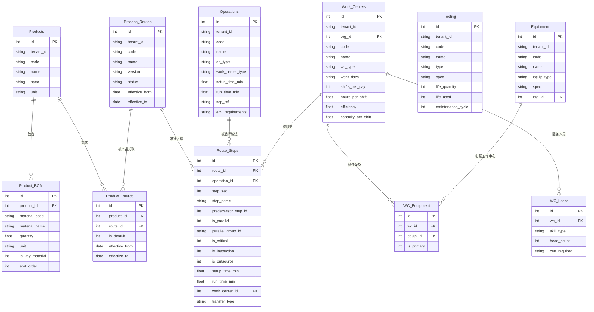
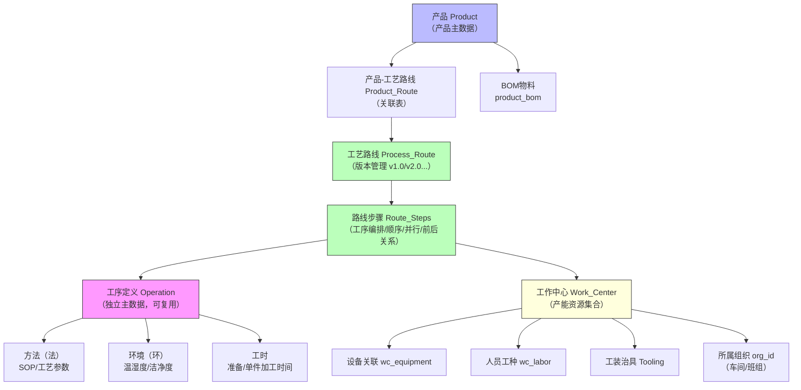
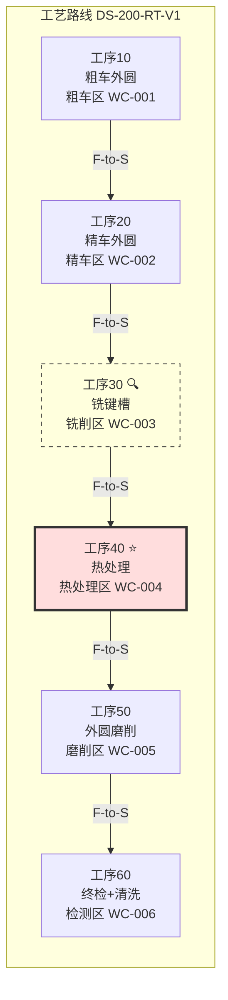
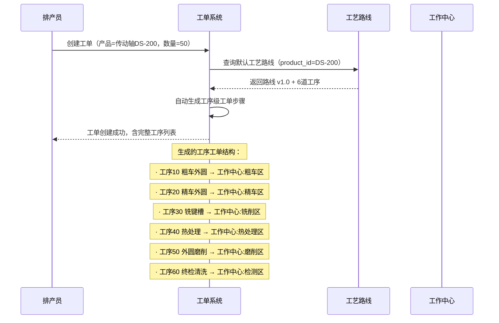
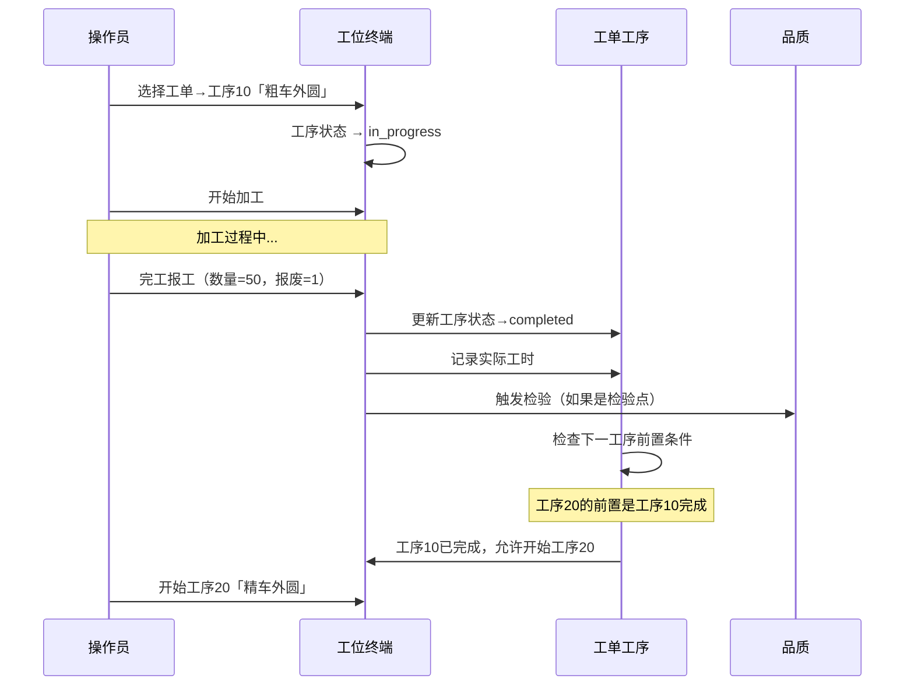

# 产品-工艺路线-产能资源模型设计

> **版本**：v1.0  
> **作者**：Alice（PM）  
> **关联文档**：`tenant-sysadmin-design-v2.md`（组织/角色/权限框架）、`manufacturing-scenario-simulation.md`（场景模拟与覆盖度评估）、`architecture-impact-assessment.md`（架构影响评估）  
> **设计背景**：用户反馈指出当前系统缺失产品主数据、产品-工艺路线关联、工序产能资源（人机料法环）定义。本文档提供完整的数据模型设计，覆盖产品管理→工艺路线编排→工作中心与产能资源→排产集成全链路。

---

## 1. 核心概念关系图



### 数据流转



---

## 2. 产品主数据

### 2.1 设计理念

产品主数据是生产制造的**核心业务对象**。每个产品通过工艺路线关联工序定义，通过 BOM 关联物料需求。产品主数据与组织架构解耦，产品可在全租户范围内共享。

### 2.2 Products 表 DDL

```sql
-- =============================================
-- 产品主数据表
-- =============================================
CREATE TABLE products (
    id          INTEGER PRIMARY KEY AUTOINCREMENT,
    tenant_id   VARCHAR(64) NOT NULL,                          -- 租户隔离
    code        VARCHAR(64) NOT NULL,                          -- 产品编码（如 "DS-200"）
    name        VARCHAR(128) NOT NULL,                         -- 产品名称（如 "传动轴"）
    spec        VARCHAR(256),                                  -- 规格型号
    unit        VARCHAR(32) DEFAULT '件',                      -- 计量单位
    -- 产品属性
    product_type VARCHAR(32) DEFAULT 'discrete',               -- 产品类型：discrete(离散)/process(流程)
    weight_kg   REAL,                                          -- 单件重量（kg）
    -- 图片与附件
    image_url   VARCHAR(256),                                  -- 产品图片
    drawing_ref VARCHAR(256),                                  -- 图纸编号/引用
    description TEXT,                                          -- 产品描述
    -- 控制
    is_active   INTEGER NOT NULL DEFAULT 1,                    -- 1=启用，0=停用
    created_at  TIMESTAMP DEFAULT CURRENT_TIMESTAMP,
    updated_at  TIMESTAMP DEFAULT CURRENT_TIMESTAMP,
    UNIQUE(tenant_id, code)
);

CREATE INDEX idx_products_tenant ON products(tenant_id);
CREATE INDEX idx_products_active ON products(tenant_id, is_active);
```

**字段说明**：

| 字段 | 类型 | 说明 |
|------|------|------|
| `id` | INTEGER PK | 自增主键 |
| `tenant_id` | VARCHAR(64) | 租户隔离字段，所有业务查询自动附加 |
| `code` | VARCHAR(64) | 产品编码，租户内唯一。如 DS-200（传动轴）、AR-200（丙烯酸树脂） |
| `name` | VARCHAR(128) | 产品名称，如"传动轴"、"丙烯酸树脂" |
| `spec` | VARCHAR(256) | 规格型号描述，如"D/T: DS-200" |
| `unit` | VARCHAR(32) | 计量单位，默认"件"；流程型可为"kg"、"吨"、"批" |
| `product_type` | VARCHAR(32) | 产品类型：discrete（离散型，按件加工）、process（流程型，按批次/连续生产） |
| `weight_kg` | REAL | 单件重量，用于物流和成本核算 |
| `image_url` | VARCHAR(256) | 产品图片URL |
| `drawing_ref` | VARCHAR(256) | 图纸编号，用于与PLM/EDM系统集成 |
| `is_active` | INTEGER | 启用/停用标记。停用的产品不可用于新工单 |

### 2.3 Product_BOM 表 DDL

```sql
-- =============================================
-- 产品物料清单（BOM）
-- 单级 BOM：直接物料清单，多级由业务逻辑层拼装
-- =============================================
CREATE TABLE product_bom (
    id              INTEGER PRIMARY KEY AUTOINCREMENT,
    tenant_id       VARCHAR(64) NOT NULL,
    product_id      INTEGER NOT NULL REFERENCES products(id) ON DELETE CASCADE,
    material_code   VARCHAR(64) NOT NULL,                     -- 物料编码（引用外部ERP或内部物料编码）
    material_name   VARCHAR(128) NOT NULL,                    -- 物料名称
    quantity        REAL NOT NULL,                            -- 单件用量
    unit            VARCHAR(32),                              -- 单位
    -- 物料属性
    material_type   VARCHAR(32) DEFAULT 'raw',                -- 物料类型：raw(原材料)/semi(半成品)/pack(包装)/consumable(消耗品)
    is_key_material INTEGER DEFAULT 0,                       -- 关键物料（需要批次追溯）
    -- 损耗与替代
    scrap_rate      REAL DEFAULT 0,                           -- 损耗率（%）
    substitute_codes TEXT,                                    -- 可替代物料编码（逗号分隔）
    -- 排序
    sort_order      INTEGER DEFAULT 0,                        -- 排序序号
    created_at      TIMESTAMP DEFAULT CURRENT_TIMESTAMP,
    UNIQUE(product_id, material_code)
);

CREATE INDEX idx_bom_product ON product_bom(product_id);
CREATE INDEX idx_bom_material ON product_bom(tenant_id, material_code);
```

**字段说明**：

| 字段 | 类型 | 说明 |
|------|------|------|
| `product_id` | INTEGER FK | 关联产品 ID，CASCADE 删除 |
| `material_code` | VARCHAR(64) | 物料编码，可对接外部 ERP 系统或内部编码 |
| `quantity` | REAL | 每件产品所需物料数量。离散型：如 1 个轴体毛坯/件；流程型：如 2.5 kg MMA/件 |
| `is_key_material` | INTEGER | 关键物料标记，标记为关键物料的将纳入批次追溯链 |
| `scrap_rate` | REAL | 损耗率，如 3% 表示100件原料实际可用97件 |
| `substitute_codes` | TEXT | 可替代物料编码列表，用于物料短缺时自动/手动替代 |

### 2.4 API 设计

| 方法 | 路径 | 功能 | 优先级 |
|------|------|------|:------:|
| `GET` | `/api/v1/products` | 产品列表（分页+搜索，按 code/name 模糊匹配） | **P0** |
| `GET` | `/api/v1/products/{id}` | 产品详情（含 BOM 列表） | **P0** |
| `POST` | `/api/v1/products` | 创建产品（含 BOM 物料清单） | **P0** |
| `PUT` | `/api/v1/products/{id}` | 编辑产品基础信息 | **P0** |
| `PUT` | `/api/v1/products/{id}/bom` | 批量更新 BOM 清单（全量替换） | **P0** |
| `DELETE` | `/api/v1/products/{id}` | 删除产品（已有工单关联时禁止删除） | **P1** |
| `GET` | `/api/v1/products/{id}/routes` | 查看产品的所有工艺路线 | **P0** |

### 2.5 前端管理页说明

**产品列表页**（`/production/products`）：
- 表格展示：编码、名称、规格、单位、类型、BOM 物料数、关联路线数、状态
- 搜索过滤：编码/名称模糊搜索、类型下拉过滤、启用/停用状态过滤
- 行操作：编辑、查看详情、启用/停用

**产品详情/编辑页**（弹窗或详情页）：
- Tab 1 — 基本信息：编码、名称、规格、单位、类型、重量、图纸、图片、描述
- Tab 2 — BOM 清单：物料编码、名称、用量、单位、类型、损耗率、替代物料
  - 表格行内编辑或弹窗编辑
  - 支持批量导入 BOM（Excel/CSV）
- Tab 3 — 关联工艺路线：展示该产品关联的所有工艺路线（版本、状态、生效日期）

---

## 3. 工序定义（Operation Master）

### 3.1 工序作为独立主数据的理念与价值

**核心设计**：工序（Operation）是**基础能力单元**，独立于产品定义，可被多个产品的工艺路线引用。

**为什么工序必须是独立主数据？**

```
工序 = 制造能力的原子单位

传统做法：每产品一整套工序定义 → 重复定义、维护困难
本设计：工序集中定义 → 产品工艺路线从工序库中选择编排

示例场景：
  工序「粗车外圆」在工厂中是一台车床+一位车工的固定能力
  ✓ 产品A（传动轴）的工艺路线中用到它，排在步骤10
  ✓ 产品B（齿轮轴）的工艺路线中也用到它，排在步骤20
  ✓ 工序本身只定义一次，工时/参数/SOP统一维护
```

**工序包含的人机法环信息**：

| 维度 | 字段 | 说明 |
|------|------|------|
| 人（Man） | `work_center_type` | 所需工作中心类型 → 工作中心定义了具体人员工种要求（wc_labor） |
| 机（Machine） | 通过 `work_center_id` 关联 | 工序不直接绑定设备，由工艺路线步骤中的 `work_center_id` 指定，或由工作中心提供 |
| 料（Material） | 产品的 BOM | 工序本身不定义物料；BOM 是产品级别的属性 |
| 法（Method） | `sop_ref`, `工艺参数_json` | SOP 文档引用 + 工艺参数（转速/温度/压力等） |
| 环（Environment） | `env_requirements` | 环境要求描述 |

### 3.2 Operations 表 DDL

```sql
-- =============================================
-- 工序定义主表
-- 工序 = 制造能力的原子单位，独立主数据
-- =============================================
CREATE TABLE operations (
    id              INTEGER PRIMARY KEY AUTOINCREMENT,
    tenant_id       VARCHAR(64) NOT NULL,
    code            VARCHAR(64) NOT NULL,                     -- 工序编码（如 "OP-010"）
    name            VARCHAR(128) NOT NULL,                    -- 工序名称（如 "粗车外圆"）
    op_type         VARCHAR(32) NOT NULL,                     -- 工序类型
    description     TEXT,                                     -- 工序描述
    work_center_type VARCHAR(32),                             -- 所需工作中心类型
    -- 工时（默认值，工艺路线步骤可覆盖）
    setup_time_min  REAL DEFAULT 0,                           -- 准备时间（分钟）
    run_time_min    REAL DEFAULT 0,                           -- 单件加工时间（分钟）
    -- 法（Method）
    sop_ref         VARCHAR(256),                             -- SOP 文档引用（URL/文档编号）
    工艺参数_json    TEXT,                                     -- JSON: 转速/温度/压力/速度等参数
    -- 环（Environment）
    env_requirements TEXT,                                    -- 环境要求描述（如"温控 20-25°C，湿度≤60%"）
    -- 质检
    default_inspection_standard VARCHAR(256),                  -- 默认检验标准引用
    -- 控制
    is_active       INTEGER DEFAULT 1,
    created_at      TIMESTAMP DEFAULT CURRENT_TIMESTAMP,
    updated_at      TIMESTAMP DEFAULT CURRENT_TIMESTAMP,
    UNIQUE(tenant_id, code)
);

CREATE INDEX idx_ops_tenant ON operations(tenant_id);
CREATE INDEX idx_ops_type ON operations(op_type);
```

### 3.3 工序类型枚举

| 编码 | 名称 | 说明 | 适用场景 |
|------|------|------|---------|
| `machining` | 机加工 | 车/铣/刨/磨/钻等金属切削 | 离散型 |
| `assembly` | 装配 | 零部件组装 | 离散型 |
| `heat_treat` | 热处理 | 淬火/回火/渗碳/退火 | 离散型 |
| `surface_treat` | 表面处理 | 电镀/喷涂/氧化 | 离散型 |
| `inspect` | 检验 | 尺寸/性能/外观检验 | 通用 |
| `pack` | 包装 | 清洗/防锈/包装/贴标 | 通用 |
| `reaction` | 反应 | 聚合/合成/发酵等化学反应 | 流程型 |
| `blend` | 配比/混合 | 原料称量/配比/混合 | 流程型 |
| `separation` | 分离 | 过滤/离心/蒸馏/萃取 | 流程型 |
| `filling` | 灌装 | 液体/粉体灌装 | 流程型 |
| `transport` | 流转 | 工序间转运/暂存 | 通用 |

### 3.4 API 设计

| 方法 | 路径 | 功能 | 优先级 |
|------|------|------|:------:|
| `GET` | `/api/v1/operations` | 工序列表（分页+按类型/名称搜索） | **P0** |
| `GET` | `/api/v1/operations/{id}` | 工序详情 | **P0** |
| `POST` | `/api/v1/operations` | 创建工序 | **P0** |
| `PUT` | `/api/v1/operations/{id}` | 编辑工序 | **P0** |
| `DELETE` | `/api/v1/operations/{id}` | 删除工序（被工艺路线引用时禁止删除） | **P1** |
| `GET` | `/api/v1/operations/{id}/usages` | 查看该工序被哪些工艺路线引用 | **P1** |

### 3.5 前端管理页说明

**工序库管理页**（`/production/operations`）：
- 卡片/列表展示所有已定义工序，按类型分组
- 搜索过滤：编码/名称、工序类型
- 工序卡片展示：编码、名称、类型、工时、关联路线数

**工序创建/编辑弹窗**：
- 编码、名称（必填）
- 类型下拉选择（上述枚举）
- 工时设置：准备时间、单件加工时间
- 法：SOP 文档上传/链接、工艺参数（JSON 编辑或结构化表单）
- 环：环境要求文本输入
- 默认检验标准（可选关联检验标准）

---

## 4. 工作中心与产能资源

### 4.1 设计理念

**工作中心（Work Center）** = 生产/加工能力的物理载体。它组织了一个生产单元所需的所有资源：

```
工作中心 = 组织节点(车间/班组) + 设备集合 + 人员工种 + 工作日历
                                       + 工装治具(从 Tooling 表引用)
```

工作中心与**组织架构（organizations）**关联，通过 `org_id` 引用到具体的车间或班组。这使得：
- 产能数据自然归属到组织节点
- 数据作用域（L4）可沿组织树层层汇总

### 4.2 WorkCenters 表 DDL

```sql
-- =============================================
-- 工作中心定义表
-- 一个工作中心 = 一个生产单元（产线/工段/班组）
-- =============================================
CREATE TABLE work_centers (
    id              INTEGER PRIMARY KEY AUTOINCREMENT,
    tenant_id       VARCHAR(64) NOT NULL,
    org_id          INTEGER NOT NULL REFERENCES organizations(id),  -- 所属组织（车间/班组）
    code            VARCHAR(64) NOT NULL,                           -- 工作中心编码（如 "WC-001"）
    name            VARCHAR(128) NOT NULL,                          -- 工作中心名称（如 "粗车区"）
    wc_type         VARCHAR(32) NOT NULL,                           -- 类型：production(生产)/inspection(检验)/warehouse(仓储)
    -- 位置
    location        VARCHAR(256),                                   -- 位置描述
    -- 工作日历（默认值，可被排产计划覆盖）
    work_days       VARCHAR(32) DEFAULT '1,2,3,4,5',               -- 工作周：1-7 表示周一到周日
    shifts_per_day  INTEGER DEFAULT 1,                              -- 每天班次
    hours_per_shift REAL DEFAULT 8,                                 -- 每班小时数
    efficiency      REAL DEFAULT 0.85,                              -- 效率因子（85% = 8小时实际6.8小时）
    -- 产能
    capacity_per_shift REAL,                                        -- 每班产能（件/批）
    capacity_unit  VARCHAR(32) DEFAULT '件',                        -- 产能单位
    -- 控制
    is_active       INTEGER DEFAULT 1,
    created_at      TIMESTAMP DEFAULT CURRENT_TIMESTAMP,
    updated_at      TIMESTAMP DEFAULT CURRENT_TIMESTAMP,
    UNIQUE(tenant_id, code)
);

CREATE INDEX idx_wc_tenant ON work_centers(tenant_id);
CREATE INDEX idx_wc_org ON work_centers(org_id);
CREATE INDEX idx_wc_type ON work_centers(wc_type);
```

### 4.3 资源关联表 DDL

```sql
-- =============================================
-- 工作中心-设备关联
-- =============================================
CREATE TABLE wc_equipment (
    id          INTEGER PRIMARY KEY AUTOINCREMENT,
    wc_id       INTEGER NOT NULL REFERENCES work_centers(id) ON DELETE CASCADE,
    equip_id    INTEGER NOT NULL REFERENCES equipment(id) ON DELETE CASCADE,
    is_primary  INTEGER DEFAULT 0,                          -- 1=主设备（用于产能计算基准）
    UNIQUE(wc_id, equip_id)
);

CREATE INDEX idx_wc_eq_wc ON wc_equipment(wc_id);
CREATE INDEX idx_wc_eq_eq ON wc_equipment(equip_id);

-- =============================================
-- 工作中心-人员工种要求
-- =============================================
CREATE TABLE wc_labor (
    id          INTEGER PRIMARY KEY AUTOINCREMENT,
    wc_id       INTEGER NOT NULL REFERENCES work_centers(id) ON DELETE CASCADE,
    skill_type  VARCHAR(64) NOT NULL,                       -- 工种/技能类型（如"车工"、"热处理工"）
    head_count  INTEGER DEFAULT 1,                          -- 所需人数
    cert_required VARCHAR(256),                             -- 资质要求（如"焊工证"、"压力容器操作证"）
    UNIQUE(wc_id, skill_type)
);

CREATE INDEX idx_wc_labor_wc ON wc_labor(wc_id);

-- =============================================
-- 工装治具管理
-- =============================================
CREATE TABLE tooling (
    id              INTEGER PRIMARY KEY AUTOINCREMENT,
    tenant_id       VARCHAR(64) NOT NULL,
    code            VARCHAR(64) NOT NULL,                   -- 工装编码（如 "TL-CNMG120408"）
    name            VARCHAR(128) NOT NULL,                  -- 工装名称（如 "外圆粗车刀片 CNMG120408"）
    type            VARCHAR(32) NOT NULL,                   -- 类型：tool(刀具)/fixture(夹具)/jig(模具)/gauge(量具)
    spec            VARCHAR(256),                           -- 规格参数
    -- 寿命管理
    life_type       VARCHAR(16) DEFAULT 'quantity',         -- 寿命类型：quantity(件数)/time(时间)
    life_quantity   INTEGER,                                -- 寿命（加工件数）
    life_hours      REAL,                                   -- 寿命（加工小时数）
    life_used       INTEGER DEFAULT 0,                      -- 已用次数
    -- 维护
    maintenance_cycle INTEGER,                              -- 保养周期（件数或天数）
    maintenance_type VARCHAR(32),                           -- 保养类型：sharpening(刃磨)/replace(更换)/calibrate(校准)
    -- 关联
    wc_id           INTEGER REFERENCES work_centers(id),   -- 默认归属工作中心（可选）
    -- 控制
    is_active       INTEGER DEFAULT 1,
    created_at      TIMESTAMP DEFAULT CURRENT_TIMESTAMP,
    UNIQUE(tenant_id, code)
);

CREATE INDEX idx_tooling_tenant ON tooling(tenant_id);
CREATE INDEX idx_tooling_type ON tooling(type);
CREATE INDEX idx_tooling_wc ON tooling(wc_id);
```

### 4.4 工作日历与产能计算

**工作日历规则**：

```python
# 产能计算逻辑（伪代码）
def calculate_daily_capacity(wc: WorkCenter, operation: Operation) -> dict:
    """
    计算工作中心针对某工序的日产能
    """
    # 有效工作时间
    daily_hours = wc.shifts_per_day * wc.hours_per_shift * wc.efficiency
    
    if wc.capacity_per_shift:
        # 如果工作中心直接定义了每班产能（如热处理炉每炉50件）
        daily_capacity = wc.capacity_per_shift * wc.shifts_per_day
    else:
        # 根据工序工时计算
        # 日产能 = (日有效分钟 - 准备时间) / 单件加工时间
        daily_minutes = daily_hours * 60
        setup_total = operation.setup_time_min    # 每天一次准备
        capacity = (daily_minutes - setup_total) / operation.run_time_min
        daily_capacity = max(0, int(capacity))
    
    return {
        "daily_capacity": daily_capacity,
        "daily_hours": daily_hours,
        "shifts": wc.shifts_per_day,
        "efficiency": wc.efficiency
    }
```

**工作日历层级**：
- 系统级 → 租户级 → 工作中心级 → 排产计划覆盖
- 工作中心级工作日历为默认值，排产时可按工单调整（如加班/调休）

### 4.5 管理功能

| 功能 | 说明 | 优先级 |
|------|------|:------:|
| 工作中心列表 | 按组织树展示，可查看所属设备/人员/工装 | **P0** |
| 创建/编辑工作中心 | 基本信息 + 工作日历 + 关联组织 | **P0** |
| 设备关联管理 | 从设备库选择设备，标记主设备 | **P0** |
| 人员工种配置 | 添加工种/技能要求，设定人数 | **P1** |
| 工装治具管理 | 工装台账 + 寿命追踪 + 保养提醒 | **P1** |
| 产能看板 | 按工作中心展示实时产能/负荷率 | **P1** |

---

## 5. 工艺路线与工序编排

### 5.1 ProcessRoutes 表 DDL

```sql
-- =============================================
-- 工艺路线主表
-- 一个产品可以有多个版本的工艺路线
-- =============================================
CREATE TABLE process_routes (
    id              INTEGER PRIMARY KEY AUTOINCREMENT,
    tenant_id       VARCHAR(64) NOT NULL,
    code            VARCHAR(64) NOT NULL,                     -- 路线编码（如 "DS-200-RT-V1"）
    name            VARCHAR(128) NOT NULL,                    -- 路线名称（如 "传动轴标准工艺路线"）
    version         VARCHAR(16) NOT NULL DEFAULT 'v1.0',      -- 版本号
    status          VARCHAR(16) NOT NULL DEFAULT 'draft',     -- 状态：draft/published/archived
    -- 工艺类型
    route_type      VARCHAR(16) DEFAULT 'discrete',          -- 路线类型：discrete(离散)/process(流程)
    description     TEXT,                                     -- 路线描述
    -- 有效期
    effective_from  TIMESTAMP,                                -- 生效日期
    effective_to    TIMESTAMP,                                -- 失效日期
    -- 统计
    total_steps     INTEGER DEFAULT 0,                        -- 工序步骤数
    total_setup_min REAL DEFAULT 0,                           -- 总准备时间
    total_run_min   REAL DEFAULT 0,                           -- 总加工时间
    -- 控制
    created_by      INTEGER REFERENCES users(id),
    created_at      TIMESTAMP DEFAULT CURRENT_TIMESTAMP,
    updated_at      TIMESTAMP DEFAULT CURRENT_TIMESTAMP,
    UNIQUE(tenant_id, code, version)
);

CREATE INDEX idx_routes_tenant ON process_routes(tenant_id);
CREATE INDEX idx_routes_status ON process_routes(status);
CREATE INDEX idx_routes_code ON process_routes(tenant_id, code);
```

### 5.2 RouteSteps 表 DDL

```sql
-- =============================================
-- 工艺路线步骤表（工序编排核心）
-- =============================================
CREATE TABLE route_steps (
    id                  INTEGER PRIMARY KEY AUTOINCREMENT,
    route_id            INTEGER NOT NULL REFERENCES process_routes(id) ON DELETE CASCADE,
    operation_id        INTEGER NOT NULL REFERENCES operations(id),  -- 引用的工序
    step_seq            INTEGER NOT NULL,                            -- 步骤序号（10/20/30...留间隔便于插入）
    step_name           VARCHAR(128),                                -- 步骤名称（可覆盖工序名称）
    -- 前后关系
    predecessor_step_id INTEGER REFERENCES route_steps(id),          -- 前置步骤（NULL=起始工序）
    is_parallel         INTEGER DEFAULT 0,                           -- 是否可并行
    parallel_group_id   VARCHAR(32),                                 -- 并行分组标识（同组并行）
    -- 标记
    is_critical         INTEGER DEFAULT 0,                           -- 关键工序
    is_inspection       INTEGER DEFAULT 0,                           -- 检验点
    is_outsource        INTEGER DEFAULT 0,                           -- 外协工序
    -- 配置覆盖（覆盖工序定义的默认值）
    setup_time_min      REAL,                                        -- 覆盖准备时间
    run_time_min        REAL,                                        -- 覆盖单件加工时间
    work_center_id      INTEGER REFERENCES work_centers(id),         -- 指定工作中心
    -- 质检
    inspection_standard_id INTEGER,                                  -- 关联检验标准
    -- 流转
    transfer_type       VARCHAR(16) DEFAULT 'F-to-S',                -- 流转类型：F-to-S(串行)/S-to-S(并行)
    -- 排产
    priority            INTEGER DEFAULT 500,                         -- 排产优先级（越小越优先）
    -- 控制
    created_at          TIMESTAMP DEFAULT CURRENT_TIMESTAMP,
    UNIQUE(route_id, step_seq)
);

CREATE INDEX idx_rs_route ON route_steps(route_id);
CREATE INDEX idx_rs_operation ON route_steps(operation_id);
CREATE INDEX idx_rs_predecessor ON route_steps(predecessor_step_id);
```

### 5.3 工序编排逻辑

#### 串行工序（F-to-S，Finish-to-Start）

```
工序10（粗车外圆）→ 工序20（精车外圆）→ 工序30（铣键槽）→ ...
```

- `predecessor_step_id` 指向上一道工序
- `is_parallel = 0`
- `transfer_type = 'F-to-S'`：前道工序**全部完工**后，后道方可开始

#### 并行工序

```
                ┌→ 工序20A（铣键槽A组）← 并行组 "PG-1"
工序10（粗车）←┤
                └→ 工序20B（铣键槽B组）← 并行组 "PG-1"
```

- `predecessor_step_id` 指向工序10
- `is_parallel = 1`
- `parallel_group_id = 'PG-1'`：同组并行
- 所有并行工序全部完成后，进入下一工序

#### 离散型 + 流程型对比

| 维度 | 离散型（传动轴） | 流程型（丙烯酸树脂） |
|------|----------------|-------------------|
| 工序关系 | 串行为主，可选并行 | 严格的顺序连续流程 |
| 流转 | F-to-S（前道完成→后道开始） | S-to-S（前道开始→后道即可开始） |
| 中间缓存 | 工序间有暂存点 | 管道输送，无物理暂存 |
| 批次 | 批量50件/批 | 连续5000kg/批 |
| 关键工序 | 热处理（工序40） | 预聚合（工序20）+ 聚合（工序30） |

#### 工艺路线图示例 — 传动轴



### 5.4 工序编排交互设计

#### 拖拽式工序编排

```
┌─────────────────────────────────────────────────┐
│  工艺路线名称：[传动轴标准工艺路线]  版本：[v1.0]  │
│  状态：[已发布]  生效日期：[2025-03-01]           │
├─────────────────────────────────────────────────┤
│  ┌─ 工序库 ─────────────────────────────────┐  │
│  │ [粗车外圆] [精车外圆] [铣键槽] [热处理]  │  │
│  │ [外圆磨削] [终检清洗] [去毛刺] ...       │  │
│  └──────────────────────────────────────────┘  │
│                                                 │
│  ┌─ 路线编排画布 ──────────────────────────┐  │
│  │                                          │  │
│  │  [工序10] ──→ [工序20] ──→ [工序30]    │  │
│  │   粗车外圆      精车外圆      铣键槽      │  │
│  │                                          │  │
│  │                     ↓                     │  │
│  │                                          │  │
│  │  [工序40] ←── [工序50] ←── [工序60]    │  │
│  │   热处理        外圆磨削      终检清洗    │  │
│  │                                          │  │
│  └──────────────────────────────────────────┘  │
│                                                 │
│  选中工序30 - 配置面板                          │
│  ┌────────────────────────────────────────┐     │
│  │ · 前置步骤：工序20                     │     │
│  │ · 并行：□ 是（分组ID：[PG-1]）        │     │
│  │ · 关键工序：□                           │     │
│  │ · 检验点：☑                            │     │
│  │ · 外协：□                              │     │
│  │ · 工作中心：[铣削区 WC-003]            │     │
│  │ · 工时覆盖：准备[12]min 单件[5.0]min  │     │
│  └────────────────────────────────────────┘     │
└─────────────────────────────────────────────────┘
```

**交互功能**：
1. 从左侧工序库拖拽工序到右侧画布
2. 连线：从工序 A 拖到工序 B 建立前后关系
3. 双击工序打开配置面板
4. Ctrl+拖拽创建并行工序
5. 右键菜单：插入工序、删除、复制、设为并行组

### 5.5 API 设计

| 方法 | 路径 | 功能 | 优先级 |
|------|------|------|:------:|
| `GET` | `/api/v1/routes` | 工艺路线列表（分页+按产品/状态搜索） | **P0** |
| `GET` | `/api/v1/routes/{id}` | 路线详情（含完整步骤列表，按 step_seq 排序） | **P0** |
| `POST` | `/api/v1/routes` | 创建工艺路线 | **P0** |
| `PUT` | `/api/v1/routes/{id}` | 编辑路线基本信息 | **P0** |
| `PUT` | `/api/v1/routes/{id}/status` | 变更状态（draft→published→archived） | **P0** |
| `DELETE` | `/api/v1/routes/{id}` | 删除路线（已关联产品时禁止） | **P1** |
| `POST` | `/api/v1/routes/{id}/steps` | 批量更新步骤（全量替换——先删后插） | **P0** |
| `PUT` | `/api/v1/routes/{id}/steps/{stepId}` | 编辑单个步骤配置 | **P1** |
| `PUT` | `/api/v1/routes/{id}/steps/reorder` | 重新排序步骤（拖拽后批量更新 step_seq） | **P1** |
| `POST` | `/api/v1/routes/{id}/publish` | 发布新版本（自动 version+1） | **P1** |

---

## 6. 产品-工艺路线关联

### 6.1 Product_Routes 关联表 DDL

```sql
-- =============================================
-- 产品-工艺路线关联表
-- 一个产品可关联多个工艺路线版本，但仅一个默认路线
-- =============================================
CREATE TABLE product_routes (
    id              INTEGER PRIMARY KEY AUTOINCREMENT,
    product_id      INTEGER NOT NULL REFERENCES products(id) ON DELETE CASCADE,
    route_id        INTEGER NOT NULL REFERENCES process_routes(id) ON DELETE CASCADE,
    is_default      INTEGER NOT NULL DEFAULT 0,              -- 1=默认工艺路线（创建工单时自动选用）
    effective_from  TIMESTAMP,                                -- 关联生效日期
    effective_to    TIMESTAMP,                                -- 关联失效日期
    created_at      TIMESTAMP DEFAULT CURRENT_TIMESTAMP,
    UNIQUE(product_id, route_id)
);

CREATE INDEX idx_pr_product ON product_routes(product_id);
CREATE INDEX idx_pr_route ON product_routes(route_id);
CREATE INDEX idx_pr_default ON product_routes(product_id, is_default);
```

### 6.2 多版本策略

**适用场景**：

```
产品：传动轴 DS-200
├── 工艺路线 v1.0（2025-03-01 ~ 2025-06-30）
│   └── 工序：粗车→精车→铣键槽→热处理→磨削→终检
├── 工艺路线 v2.0（2025-07-01 ~ 至今）
│   └── 工序：粗车→精车→铣键槽→热处理→磨削→终检
│       └── 差异：v2.0 精车工序改用了新的高精车床，工时从6.0min缩短到4.5min
└── 工艺路线 v2.1（待发布）
    └── 变更：增加了工序25「去毛刺」，新工艺试验中
```

**版本管理规则**：
1. 一个产品可关联多个工艺路线版本
2. 仅有**一个**默认路线（`is_default=1`），创建工单时自动选用
3. 版本状态机：`draft → published → archived`
4. draft 状态可编辑；published 状态不可编辑，可被工单引用
5. 已发布路线不可删除，只能归档

**创建工单时的路线选择逻辑**：

```python
def select_route(product_id, effective_date=None):
    """自动选择工艺路线"""
    date = effective_date or today()
    
    # 1. 找默认路线且在有效期内的
    route = db.query("""
        SELECT r.* FROM product_routes pr
        JOIN process_routes r ON pr.route_id = r.id
        WHERE pr.product_id = :pid
          AND pr.is_default = 1
          AND r.status = 'published'
          AND (r.effective_from IS NULL OR r.effective_from <= :date)
          AND (r.effective_to IS NULL OR r.effective_to >= :date)
        LIMIT 1
    """, {"pid": product_id, "date": date})
    
    if route:
        return route
    
    # 2. 无默认路线，取最新发布的版本
    route = db.query("""
        SELECT r.* FROM product_routes pr
        JOIN process_routes r ON pr.route_id = r.id
        WHERE pr.product_id = :pid
          AND r.status = 'published'
        ORDER BY r.version DESC
        LIMIT 1
    """, {"pid": product_id})
    
    return route
```

---

## 7. 集成场景

### 7.1 创建工单 → 自动展开为工序级工单



**工序级工单的数据结构**（在 `work_orders` 表中扩展）：

```sql
-- work_orders 表扩展字段
ALTER TABLE work_orders ADD COLUMN route_id INTEGER REFERENCES process_routes(id);
ALTER TABLE work_orders ADD COLUMN current_step_id INTEGER REFERENCES route_steps(id);
ALTER TABLE work_orders ADD COLUMN route_snapshot TEXT;  -- 发布时的路线快照（JSON）

-- 新增：工单工序执行记录
CREATE TABLE work_order_steps (
    id              INTEGER PRIMARY KEY AUTOINCREMENT,
    work_order_id   INTEGER NOT NULL REFERENCES work_orders(id),
    route_step_id   INTEGER REFERENCES route_steps(id),       -- 关联路线步骤定义
    step_seq        INTEGER NOT NULL,                          -- 工序序号
    step_name       VARCHAR(128),                              -- 工序名称
    status          VARCHAR(16) DEFAULT 'pending',             -- pending/in_progress/completed/skipped
    -- 工时
    planned_setup   REAL,                                      -- 计划准备时间(min)
    planned_run     REAL,                                      -- 计划单件时间(min)
    actual_setup    REAL,                                      -- 实际准备时间
    actual_run      REAL,                                      -- 实际单件时间
    -- 排产
    work_center_id  INTEGER REFERENCES work_centers(id),       -- 执行工作中心
    scheduled_start TIMESTAMP,                                 -- 计划开始
    scheduled_end   TIMESTAMP,                                 -- 计划结束
    actual_start    TIMESTAMP,                                 -- 实际开始
    actual_end      TIMESTAMP,                                 -- 实际结束
    -- 执行
    output_qty      INTEGER DEFAULT 0,                         -- 完工数量
    scrap_qty       INTEGER DEFAULT 0,                         -- 报废数量
    -- 质检
    inspection_status VARCHAR(16),                             -- pending/passed/failed
    -- 流转
    transfer_to     INTEGER REFERENCES work_order_steps(id),   -- 流转至下一工序
    -- 控制
    created_at      TIMESTAMP DEFAULT CURRENT_TIMESTAMP,
    updated_at      TIMESTAMP DEFAULT CURRENT_TIMESTAMP
);

CREATE INDEX idx_wos_wo ON work_order_steps(work_order_id);
CREATE INDEX idx_wos_status ON work_order_steps(status);
CREATE INDEX idx_wos_wc ON work_order_steps(work_center_id);
```

### 7.2 排产 → 基于工序工时+工作中心产能

```python
def schedule_work_order(work_order, constraints=None):
    """
    基于工序级工单的排产逻辑
    1. 获取工单的所有工序步骤（按 step_seq 排序）
    2. 对每道工序：
       a. 计算所需时间 = 准备时间 + 单件时间 × 数量
       b. 查找可用工作中心
       c. 在工作中心日历上查找可用时间槽
       d. 考虑前序工序完工时间（F-to-S/S-to-S）
    3. 返回排产甘特图数据
    """
    steps = get_work_order_steps(work_order.id)
    schedule = []
    
    for step in steps:
        wc = get_work_center(step.work_center_id)
        
        # 计算加工时间
        setup = step.planned_setup or step.route_step.setup_time_min
        run_time = step.planned_run or step.route_step.run_time_min
        total_minutes = setup + (run_time * work_order.quantity)
        
        # 考虑前序依赖
        predecessor = get_predecessor_step(step)
        earliest_start = predecessor.actual_end if predecessor else work_order.planned_start
        
        # 查找工作中心可用时间槽
        time_slot = wc_calendar.find_available_slot(
            wc.id, 
            earliest_start,
            total_minutes,
            work_order.quantity
        )
        
        schedule.append({
            "step_id": step.id,
            "step_name": step.step_name,
            "work_center": wc.name,
            "start": time_slot.start,
            "end": time_slot.end,
            "duration_min": total_minutes
        })
    
    return schedule
```

### 7.3 报工 → 工序级报工



**工序流转控制**：

```
F-to-S（默认）:
  工序10 生产中 → 工序20 阻塞
  工序10 完工 → 工序20 可开始
  工序20 开始加工 → 工序30 阻塞
  ...

S-to-S（流程型紧耦合）:
  工序10 开始2分钟后 → 工序20 即可开始
  工序20 开始后 → 工序30 即可开始
  ...

并行组:
  工序10 完工 → 工序20A 可开始（并行1）
                → 工序20B 可开始（并行2）
  工序20A 完工 + 工序20B 完工 → 工序30 可开始
```

---

## 8. 设计决策与待确认问题

### D1：工序复用范围

| 方案 | 描述 | 优缺点 |
|------|------|--------|
| **方案 A（推荐）** | **租户级共享**：工序定义在租户范围内共享，所有产品共用工序库 | ✓ 避免重复定义，维护量小<br>✓ 符合实际工厂场景（车工就是车工）<br>✗ 不同产品可能对同一工序有不同要求 |
| **方案 B** | 产品级私有工序 | ✓ 每产品完全自定义<br>✗ 大量重复定义，维护成本高 |

**推荐方案 A**：工序作为租户级共享主数据。不同产品的特殊要求通过工艺路线步骤（RouteSteps）的覆盖字段（`setup_time_min`、`run_time_min`、`work_center_id`）来满足。

### D2：BOM 层级（单级 vs 多级）

| 方案 | 描述 | 优缺点 |
|------|------|--------|
| **方案 A（推荐）** | **单级 BOM**：仅管理直接物料，多级展开由业务逻辑处理 | ✓ 实现简单，与当前工单物料需求匹配<br>✓ 适合中小型制造企业<br>✗ 无法直接展示产品完整结构树 |
| **方案 B** | 多级 BOM：支持子装配体/半成品递归展开 | ✓ 结构完整<br>✗ 递归运算复杂，超出 MVP 范围 |

**推荐方案 A**：MVP 采用单级 BOM。后续可扩展为多级（通过 `product_bom.material_type = 'semi'` 标记半成品，再递归查询该半成品的 BOM）。

### D3：并行工序管理策略

| 方案 | 描述 | 优缺点 |
|------|------|--------|
| **方案 A（推荐）** | **显式并行组**：通过 `parallel_group_id` 分组标记并行工序，同一组内所有工序完成后才流转到下一步 | ✓ 设计清晰，实现可控<br>✓ 前端可提供分组可视化（框选组） |
| **方案 B** | 隐式并行：同一 predecessor 的多道工序自动视为并行 | ✓ 操作更简单<br>✗ 歧义：可能既有串行又有并行 |

**推荐方案 A**：显式 `parallel_group_id` 分组。注意：并行工序之间不支持再设前后关系。

### D4：工作日历层级

| 方案 | 描述 | 优缺点 |
|------|------|--------|
| **方案 A（推荐）** | **工作中心级日历**：工作日历属于工作中心属性，排产时可临时覆盖 | ✓ 粒度适中，满足排产需求<br>✓ 不增加额外表复杂度 |
| **方案 B** | 独立日历表，支持多级继承（工厂→车间→工作中心） | ✓ 更灵活<br>✗ 增加复杂度，MVP 阶段不需要 |

**推荐方案 A**：工作中心级日历。后续如有排产模块，可引入独立日历表。

### D5：外协工序处理

| 方案 | 描述 | 优缺点 |
|------|------|--------|
| **方案 A（推荐）** | **标记 + 备注**：工序标记 `is_outsource=1`，在 `description` 中填写外协供应商信息 | ✓ 实现简单，MVP 可用<br>✓ 排产时自动跳过外协工序 |
| **方案 B** | 独立外协管理模块：供应商管理 + 外协订单 + 外协报工 | ✓ 功能完整<br>✗ MVP 阶段过度设计 |

**推荐方案 A**：`is_outsource=1` 标记。外协工序的流转控制：到达外协工序时，自动生成外协待办，人工确认完成后继续流转。

### D6：效率因子与产能计算基数

**问题**：产能计算时，效率因子（0.85）是应用于工作时间还是直接应用于产出数量？

**决策**：效率因子应用于工作时间。即：`有效工作时长 = 排班时长 × 效率因子`。这更符合实际：8小时班次 × 0.85 = 6.8小时有效产出时间。

### 设计决策汇总

| 决策项 | 推荐方案 | 影响范围 |
|--------|---------|---------|
| D1 工序复用范围 | 租户级共享 + 步骤覆盖 | operations + route_steps 设计 |
| D2 BOM 层级 | 单级 BOM（后续可扩展） | product_bom 表结构 |
| D3 并行工序管理 | 显式 parallel_group_id | route_steps 表 + 前端交互 |
| D4 工作日历层级 | 工作中心级 | work_centers 表 |
| D5 外协工序 | is_outsource 标记 | route_steps 表 + 工单流转 |
| D6 效率因子 | 应用于工作时间 | 产能计算逻辑 |

---

## 附录 A：权限编码扩展

基于本设计，需新增以下业务模块权限编码：

| 编码 | 说明 | 归属模块 |
|------|------|---------|
| `product:create` | 创建产品 | 产品管理 |
| `product:read` | 查看产品 | 产品管理 |
| `product:update` | 编辑产品 | 产品管理 |
| `product:delete` | 删除产品 | 产品管理 |
| `operation:create` | 创建工序 | 工序管理 |
| `operation:read` | 查看工序 | 工序管理 |
| `operation:update` | 编辑工序 | 工序管理 |
| `operation:delete` | 删除工序 | 工序管理 |
| `route:create` | 创建工艺路线 | 工艺管理 |
| `route:read` | 查看工艺路线 | 工艺管理 |
| `route:update` | 编辑工艺路线 | 工艺管理 |
| `route:delete` | 删除工艺路线 | 工艺管理 |
| `route:publish` | 发布/归档工艺路线 | 工艺管理 |
| `work_center:create` | 创建工作中心 | 资源管理 |
| `work_center:read` | 查看工作中心 | 资源管理 |
| `work_center:update` | 编辑工作中心 | 资源管理 |
| `work_center:delete` | 删除工作中心 | 资源管理 |
| `tooling:create` | 创建工装治具 | 资源管理 |
| `tooling:read` | 查看工装治具 | 资源管理 |
| `tooling:update` | 编辑工装治具 | 资源管理 |
| `tooling:delete` | 删除工装治具 | 资源管理 |

**默认角色预配置建议**：

| 角色 | 新增权限 |
|------|---------|
| admin | 全部新增权限 |
| department_head | `product:read`, `route:read`, `route:update`, `operation:read`, `work_center:read`, `work_center:update` |
| team_leader | `product:read`, `route:read`, `operation:read`, `work_center:read` |
| operator | `product:read` |
| scheduler | `product:read`, `route:read`, `operation:read`, `work_center:read` |
| viewer | `product:read`, `route:read`, `operation:read`, `work_center:read` |
