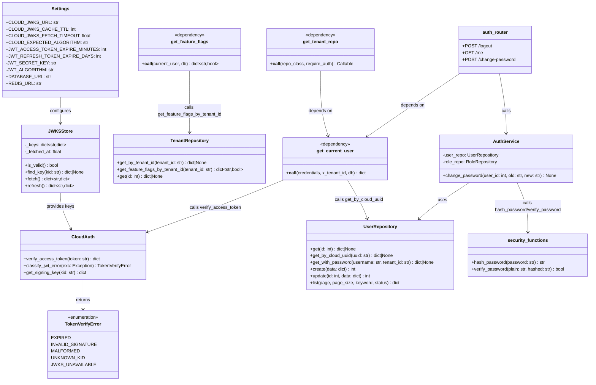
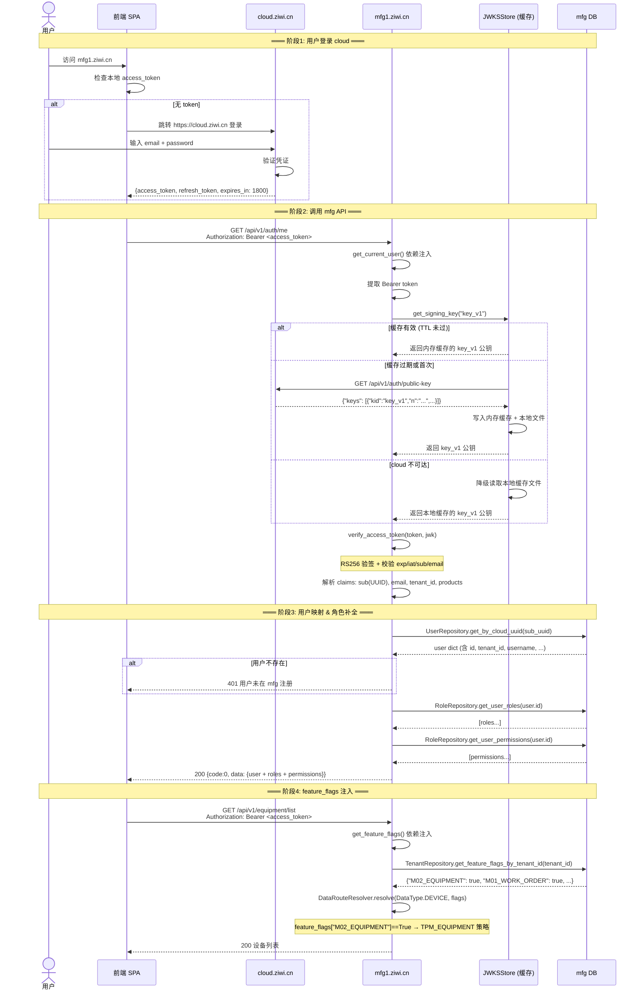
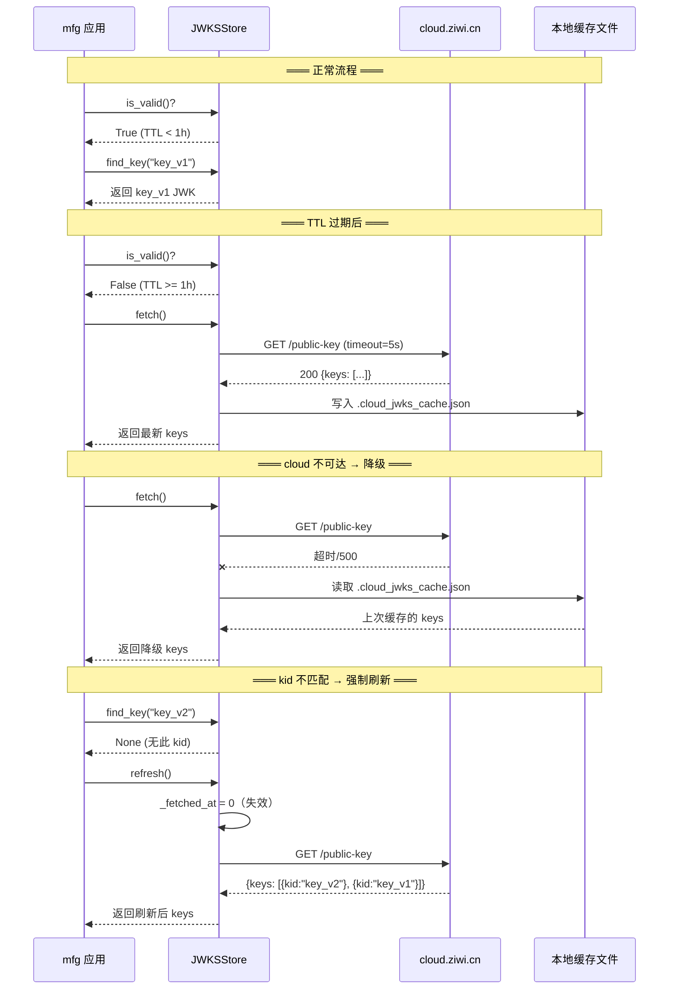
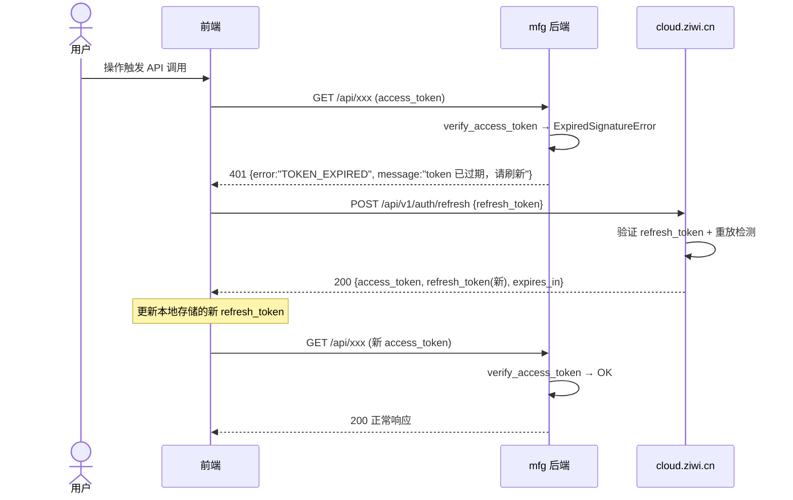
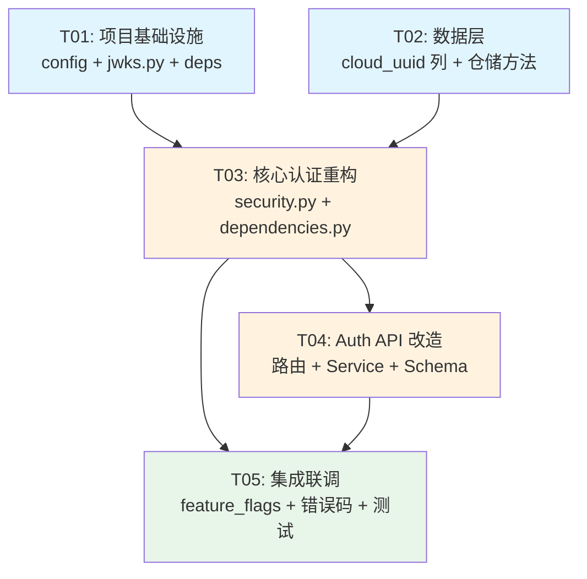

# mfg 制造平台 — cloud.ziwi.cn 统一登录认证改造 · 系统设计

> **作者**: 高见远（架构师）  
> **日期**: 2026-07-10  
> **版本**: v1.0  
> **目标环境**: mfg1.ziwi.cn（预发布，从头部署，无需兼容旧 token）

---

## Part A: 系统设计

### 1. 实现方案

#### 1.1 核心挑战

| 挑战 | 现状 | 目标 |
|:---|:---|:---|
| **JWT 算法** | HS256 对称密钥（本地签发） | RS256 非对称密钥（cloud 签发，mfg 只验签） |
| **用户标识** | 本地自增 int `id` 作为 JWT `sub` | cloud JWT `sub` 是 UUID 字符串，需映射到 mfg 用户表 |
| **feature_flags** | 嵌入本地 JWT 的 `features` 字段 | 从 DB `tenants.package_modules` 查（cloud `products` 粒度太粗） |
| **tenant_id** | 本地 JWT 携带 + Header `X-Tenant-Id` 兜底 | 信任 cloud JWT `tenant_id`，Header 仅作降级 |
| **auth 端点** | 本地 `/login`, `/refresh` 签发 HS256 JWT | 移除登录/刷新，前端直接调 cloud；保留 `/me` 补全本地角色 |
| **向后兼容** | — | 不需要（预发布从头部署） |

#### 1.2 技术选型

| 组件 | 选择 | 理由 |
|:---|:---|:---|
| JWT 验签库 | `python-jose[cryptography]` | 已在 cloud 验证通过，与集成指南一致 |
| HTTP 客户端 | `httpx` (async) | FastAPI 天然异步，JWKS 拉取需 HTTP 调用 |
| JWKS 缓存 | 内存 dict + 本地 JSON 文件降级 | 轻量，无需 Redis 依赖。TTL=1h |
| 用户映射 | `users.cloud_uuid` 列（VARCHAR(36) UNIQUE） | UUID 是 cloud 权威标识，比 email 更稳定 |
| feature_flags 来源 | DB `tenants.package_modules` | cloud `products` 仅含产品名（"mfg"），不包含模块级开关 |

#### 1.3 架构模式

**变更前**（HS256 自签发）：
```
前端 → POST /login (本地账号密码) → mfg 签发 HS256 JWT → 前端持 JWT 调 API
       mfg 验签本地 JWT → get_current_user → 业务
```

**变更后**（信任 cloud RS256 JWT）：
```
前端 → cloud.ziwi.cn 登录 → 获得 RS256 JWT → 前端持 JWT 调 mfg API
       mfg 从 cloud 拉 JWKS 公钥 → 验签 RS256 JWT → get_current_user → 业务
```

---

### 2. 文件列表

| # | 文件路径 | 操作 | 说明 |
|:---|:---|:---|:---|
| 1 | `backend/requirements.txt` | 修改 | 新增 `httpx`；`python-jose` 改为 `python-jose[cryptography]` |
| 2 | `backend/app/core/config.py` | 修改 | 新增 cloud JWT 配置项，废弃 HS256 项 |
| 3 | `backend/app/core/jwks.py` | **新增** | JWKSStore + verify_access_token（从集成指南 §3.3 直接移植） |
| 4 | `backend/app/core/security.py` | 修改 | 移除 `create_access_token`/`create_refresh_token`/`verify_token`；保留 `hash_password`/`verify_password`；新增 `verify_cloud_token` 包装 |
| 5 | `backend/app/core/dependencies.py` | 修改 | `get_current_user` 改用 cloud JWT 验签 + cloud_uuid 查用户；`get_feature_flags` 改为查 DB；`get_tenant_repo` 适配新契约 |
| 6 | `backend/app/api/auth.py` | 修改 | 移除 `POST /login`、`POST /refresh`；保留 `POST /logout`、`GET /me`、`POST /change-password` |
| 7 | `backend/app/services/auth_service.py` | 修改 | 移除 `login()`、`refresh_token()` 方法；保留 `change_password()` |
| 8 | `backend/app/schemas/auth.py` | 修改 | 移除 `LoginRequest`、`RefreshTokenRequest`、`TokenResponse`；保留 `ChangePasswordRequest` |
| 9 | `backend/app/repositories/user_repo.py` | 修改 | 新增 `get_by_cloud_uuid(uuid)` 查询方法 |
| 10 | `backend/app/repositories/tenant_repo.py` | 修改 | 新增 `get_feature_flags_by_tenant_id()` 方法（扁平化 package_modules） |
| 11 | `backend/app/core/route_resolver.py` | 不改 | feature_flags 来源变了但 dict 结构不变，无需修改 |
| 12 | `backend/.env` / `backend/.env.example` | 修改 | 移除 `JWT_SECRET_KEY`，新增 `CLOUD_JWKS_URL` |

---

### 3. 数据结构与接口



---

### 4. 程序调用流程

#### 4.1 主流程：用户登录 → 调用 mfg API



#### 4.2 JWKS 缓存生命周期



#### 4.3 Token 过期 → 前端刷新流程



---

### 5. 待明确事项（UNCLEAR）

| # | 事项 | 当前假设 | 影响范围 | 建议拍板人 |
|:---|:---|:---|:---|:---|
| 1 | **feature_flags 来源** | 从 DB `tenants.package_modules` 查询并扁平化。cloud `products` 仅含 `["mfg"]`，不包含模块级开关，不可用 | `dependencies.py`、`tenant_repo.py` | 产品经理 + 后端负责人 |
| 2 | **cloud `tenant_id` 何时启用** | 当前 cloud JWT `tenant_id`=null。假设 mfg 上线前 cloud 会在 JWT 中填充实际 tenant_id | `dependencies.py` 的 `get_tenant_repo` | cloud 后端团队 |
| 3 | **用户同步机制** | 假设 cloud 用户 UUID 已预同步到 mfg `users.cloud_uuid` 列。首次认证时若无本地用户，返回 401（不允许自动创建） | `user_repo.py`、`dependencies.py` | 运维 + 后端负责人 |
| 4 | **本地 `/login` 透传还是移除** | 假设直接移除（前端调 cloud），不走透传。运营/租户管理员统一通过 cloud 登录 | `auth.py` | 产品经理 |
| 5 | **`/change-password` 保留** | 保留在 mfg 本地，修改的是 mfg 本地 DB 密码（cloud 密码修改走 cloud 自己的接口） | `auth.py`、`auth_service.py` | 产品经理 |
| 6 | **X-Tenant-Id Header 降级** | 保留向后兼容：当 cloud JWT 无 `tenant_id` 时，fallback 到 Header | `dependencies.py` | 架构师 |

---

## Part B: 任务分解

### 6. 依赖包

```
# requirements.txt 变更
python-jose[cryptography]>=3.3.0   # 原 python-jose → 增加 cryptography 后端（RS256 必需）
httpx>=0.27.0                       # 新增：异步 HTTP 客户端，拉取 JWKS
```

> `passlib[bcrypt]` 保留（`/change-password` 仍需密码哈希）。

---

### 7. 任务列表（有序）

| Task ID | 任务名称 | 源文件 | 依赖 | 优先级 | 预估工时 |
|:---|:---|:---|:---|:---|:---|
| **T01** | **项目基础设施：配置 + JWKS 验签模块** | `requirements.txt` (改), `app/core/config.py` (改), `app/core/jwks.py` (新), `.env` / `.env.example` (改) | — | P0 | 1.5h |
| **T02** | **数据层：用户表 cloud_uuid 列 + 仓储方法新增** | `app/repositories/user_repo.py` (改), `app/repositories/tenant_repo.py` (改), DB migration SQL (新) | — | P0 | 1h |
| **T03** | **核心认证重构：security.py + dependencies.py** | `app/core/security.py` (改), `app/core/dependencies.py` (改) | T01, T02 | P0 | 2h |
| **T04** | **Auth API 改造：路由 + Service + Schema** | `app/api/auth.py` (改), `app/services/auth_service.py` (改), `app/schemas/auth.py` (改) | T03 | P0 | 1.5h |
| **T05** | **集成联调：feature_flags 迁移 + 错误码统一 + 端到端测试** | `app/core/route_resolver.py` (不改), `app/core/dependencies.py` (改-微调), 集成测试脚本 (新) | T03, T04 | P0 | 2h |

#### 任务详情

---

#### T01：项目基础设施：配置 + JWKS 验签模块

**范围**：

1. **`requirements.txt`**：`python-jose` → `python-jose[cryptography]`，新增 `httpx>=0.27.0`

2. **`app/core/config.py`**：
   ```python
   # 新增 cloud JWT 配置（替代旧的 HS256 配置）
   CLOUD_JWKS_URL: str = "https://cloud.ziwi.cn/api/v1/auth/public-key"
   CLOUD_JWKS_CACHE_TTL: int = 3600          # 缓存 TTL（秒）
   CLOUD_JWKS_FETCH_TIMEOUT: float = 5.0     # 拉取超时（秒）
   CLOUD_EXPECTED_ALGORITHM: str = "RS256"   # cloud 签名算法
   CLOUD_CLOCK_SKEW_SECONDS: int = 30        # 时钟偏差容忍（秒）
   
   # 以下旧配置标记为废弃（保留字段名避免下游报错，但不使用）
   # JWT_SECRET_KEY — 废弃，不再本地签发 JWT
   # JWT_ALGORITHM — 废弃，固定使用 RS256
   # JWT_ACCESS_TOKEN_EXPIRE_MINUTES — 保留但仅用于文档参考（cloud 控制过期时间）
   # JWT_REFRESH_TOKEN_EXPIRE_DAYS — 保留但仅用于文档参考
   ```

3. **`app/core/jwks.py`**（**新增**）：直接从集成指南 §3.3 移植完整代码：
   - `JWKSStore` 类（内存缓存 + 本地文件降级）
   - `verify_access_token(token: str) → dict`
   - `classify_jwt_error(exc: Exception) → TokenVerifyError`
   - `TokenVerifyError` 枚举
   - 全局单例 `_jwks_store`

4. **`.env` / `.env.example`**：
   ```bash
   # 移除: JWT_SECRET_KEY, JWT_ALGORITHM (或注释标记废弃)
   # 新增:
   CLOUD_JWKS_URL=https://cloud.ziwi.cn/api/v1/auth/public-key
   CLOUD_JWKS_CACHE_TTL=3600
   ```

**验收标准**：
- `pip install -r requirements.txt` 成功
- `from app.core.jwks import JWKSStore, verify_access_token` 可正常 import
- `Settings()` 包含所有新增配置项且默认值正确

---

#### T02：数据层：用户表 cloud_uuid 列 + 仓储方法新增

**范围**：

1. **DB Migration SQL**（新增，如 `backend/migrations/add_cloud_uuid.sql`）：
   ```sql
   -- 为 users 表新增 cloud_uuid 列，存储 cloud.ziwi.cn 的用户 UUID
   ALTER TABLE users ADD COLUMN cloud_uuid VARCHAR(36) UNIQUE;
   CREATE INDEX idx_users_cloud_uuid ON users(cloud_uuid);
   
   -- 为已有用户填充 cloud_uuid（按 email 匹配，若 cloud 侧用户已存在）
   -- 此步骤需运维配合执行，此处仅提供脚本骨架
   ```

2. **`app/repositories/user_repo.py`**：新增方法
   ```python
   async def get_by_cloud_uuid(self, cloud_uuid: str) -> Optional[Dict]:
       """通过 cloud.ziwi.cn 的用户 UUID 查询本地用户"""
       return await self.query_one(
           "SELECT id, tenant_id, cloud_uuid, username, real_name, email, phone, "
           "avatar_url, status, last_login_at, created_at "
           "FROM users WHERE cloud_uuid = :cloud_uuid",
           {"cloud_uuid": cloud_uuid}
       )
   ```

3. **`app/repositories/tenant_repo.py`**：新增方法
   ```python
   async def get_feature_flags_by_tenant_id(self, tenant_id: str) -> Dict[str, bool]:
       """从 tenants.package_modules 查询并扁平化为 feature_flags dict。
       
       package_modules 格式: {"M01": ["WORK_ORDER", "WORK_REPORT"], "M02": ["EQUIPMENT"]}
       扁平化后: {"M01_WORK_ORDER": True, "M01_WORK_REPORT": True, "M02_EQUIPMENT": True}
       """
       tenant = await self.get_by_tenant_id(tenant_id)
       if not tenant:
           return {}
       package_modules = tenant.get("package_modules") or {}
       flags = {}
       for module_code, sub_modules in package_modules.items():
           if isinstance(sub_modules, list):
               for sub in sub_modules:
                   flags[f"{module_code}_{sub}"] = True
       return flags
   ```

**验收标准**：
- users 表 `cloud_uuid` 列创建成功，unique 索引生效
- `repo.get_by_cloud_uuid("test-uuid")` 返回正确用户或 None
- `repo.get_feature_flags_by_tenant_id("t_xxx")` 返回扁平化 dict

---

#### T03：核心认证重构：security.py + dependencies.py

**范围**：

1. **`app/core/security.py`**（**重大修改**）：
   - **移除**：`create_access_token()`, `create_refresh_token()`, `verify_token()`
   - **保留**：`hash_password()`, `verify_password()`, `pwd_context`
   - **新增**：
     ```python
     from app.core.jwks import verify_access_token as _verify_cloud, classify_jwt_error, TokenVerifyError
     
     # 重新导出，供 dependencies 使用
     __all__ = ["hash_password", "verify_password", "verify_cloud_token", "TokenVerifyError"]
     
     async def verify_cloud_token(token: str) -> dict:
         """验签 cloud JWT 并返回 payload（thin wrapper）。"""
         return await _verify_cloud(token)
     ```

2. **`app/core/dependencies.py`**（**重大修改**）：

   **`get_current_user` 新实现**：
   ```python
   async def get_current_user(
       credentials: HTTPAuthorizationCredentials = Depends(security_scheme),
       x_tenant_id: str = Header(default=None, alias="X-Tenant-Id"),
       db: AsyncSession = Depends(get_db),
   ):
       # 1. 验签 cloud JWT
       try:
           payload = await verify_cloud_token(credentials.credentials)
       except Exception as e:
           error_code = classify_jwt_error(e)
           status_map = {
               TokenVerifyError.EXPIRED: (401, "token 已过期，请刷新"),
               TokenVerifyError.JWKS_UNAVAILABLE: (503, "认证服务暂不可用"),
           }
           http_status, message = status_map.get(error_code, (401, "无效的认证凭证"))
           raise HTTPException(status_code=http_status, detail={
               "code": f"401-{http_status}", "message": message
           })
       
       # 2. 从 cloud JWT 提取用户标识
       cloud_uuid = payload.get("sub")
       if not cloud_uuid:
           raise HTTPException(status_code=401, detail={"code": "401-0001", "message": "Token 缺少 sub"})
       
       # 3. 查 mfg 本地用户
       repo = UserRepository(db)
       user = await repo.get_by_cloud_uuid(cloud_uuid)
       if not user:
           raise HTTPException(status_code=401, detail={
               "code": "401-0002", 
               "message": f"用户在 mfg 平台未注册 (cloud_uuid={cloud_uuid})"
           })
       
       # 4. 注入 tenant_id（cloud JWT 优先，Header 降级）
       cloud_tenant = payload.get("tenant_id")
       effective_tenant = cloud_tenant or x_tenant_id
       if effective_tenant and hasattr(repo, "set_tenant_id"):
           repo.set_tenant_id(effective_tenant)
       
       # 5. 将 cloud claims 合并到 user dict（下游可能依赖）
       user["cloud_uuid"] = cloud_uuid
       user["cloud_email"] = payload.get("email")
       user["cloud_products"] = payload.get("products", [])
       user["tenant_id"] = effective_tenant
       
       return user
   ```

   **`get_feature_flags` 新实现**：
   ```python
   async def get_feature_flags(
       current_user: dict = Depends(get_current_user),
       db: AsyncSession = Depends(get_db),
   ) -> Dict[str, bool]:
       """从 DB tenants.package_modules 查询当前租户的 feature_flags。
       
       替代旧实现（旧实现从本地 JWT 的 features 字段读取）。
       """
       tenant_id = current_user.get("tenant_id")
       if not tenant_id:
           return {}
       tenant_repo = TenantRepository(db)
       return await tenant_repo.get_feature_flags_by_tenant_id(tenant_id)
   ```

   **`get_tenant_repo` 适配**：
   - 内部继续依赖 `get_current_user`，`tenant_id` 从 `current_user["tenant_id"]` 取
   - 逻辑不变，仅 tenant_id 来源从「本地 JWT」变为「cloud JWT + Header 降级」
   - **无需修改 `get_tenant_repo` 源码**（tenant_id 路径保持不变）

**验收标准**：
- `get_current_user` 用 valid cloud JWT 测试 → 返回 user dict
- `get_current_user` 用过期 token 测试 → 401 `TOKEN_EXPIRED`
- `get_current_user` 用未知 cloud_uuid 测试 → 401 用户未注册
- `get_feature_flags` 返回正确的扁平化 flags dict

---

#### T04：Auth API 改造：路由 + Service + Schema

**范围**：

1. **`app/schemas/auth.py`**：
   - **移除**：`LoginRequest`, `TokenResponse`, `RefreshTokenRequest`
   - **保留**：`ChangePasswordRequest`

2. **`app/services/auth_service.py`**：
   - **移除**：`login()` 方法、`refresh_token()` 方法
   - **保留**：`change_password()` 方法
   - 构造函数简化（不再需要 `tenant_repo` 参数）

3. **`app/api/auth.py`**：
   - **移除**：`POST /login`、`POST /refresh` 两个路由
   - **保留**：`POST /logout`、`GET /me`、`POST /change-password`
   - **`GET /me` 适配**：`current_user["id"]` → 继续用本地 int ID（cloud_uuid 已用于 lookup，但本地 user dict 保留了 id）
   - **清理 import**：移除不再使用的 `LoginRequest`、`RefreshTokenRequest`、`AuthService.login` 相关引用

   ```python
   # auth.py 变更后骨架
   router = APIRouter(prefix="/api/v1/auth", tags=["M00-认证"])

   @router.post("/logout")
   async def logout():
       """登出（客户端本地清理 token 即可，服务端无状态）"""
       return {"code": 0, "message": "退出成功"}

   @router.get("/me")
   async def get_me(
       current_user: dict = Depends(get_current_user),
       repo: UserRepository = Depends(get_tenant_repo(UserRepository)),
       role_repo: RoleRepository = Depends(get_tenant_repo(RoleRepository)),
   ):
       """获取当前用户完整信息（含角色和权限）"""
       user_id = current_user["id"]
       user = await repo.get(user_id)
       if not user:
           return {"code": 0, "message": "success", "data": current_user}
       roles = await role_repo.get_user_roles(user_id)
       permissions = await role_repo.get_user_permissions(user_id)
       user["roles"] = roles
       user["permissions"] = permissions
       user["cloud_uuid"] = current_user.get("cloud_uuid")
       return {"code": 0, "message": "success", "data": user}

   @router.post("/change-password")
   async def change_password(
       req: ChangePasswordRequest,
       current_user: dict = Depends(get_current_user),
       repo: UserRepository = Depends(get_tenant_repo(UserRepository)),
       role_repo: RoleRepository = Depends(get_tenant_repo(RoleRepository)),
   ):
       svc = AuthService(repo, role_repo)
       await svc.change_password(current_user["id"], req.old_password, req.new_password)
       return {"code": 0, "message": "密码修改成功"}
   ```

**验收标准**：
- `POST /login` → 404（路由已移除）
- `POST /refresh` → 404（路由已移除）
- `GET /me` → 200 返回 user + roles + permissions + cloud_uuid
- `POST /logout` → 200 返回成功
- `POST /change-password` → 正常修改密码

---

#### T05：集成联调：feature_flags 迁移 + 错误码统一 + 端到端测试

**范围**：

1. **`app/core/route_resolver.py`**（**不改**）：
   - `DataRouteResolver.resolve()` 接收 `feature_flags: Dict[str, bool]`，新实现的 `get_feature_flags` 返回相同结构，无需修改

2. **错误码统一映射**（在 `dependencies.py` 中完成，T03 已做）

3. **集成测试脚本**（新增 `backend/tests/test_cloud_auth_integration.py`）：
   ```python
   # 测试用例概要：
   # 1. 用有效 cloud JWT 调 /me → 200 + 完整用户信息
   # 2. 用过期 token 调任意 API → 401 TOKEN_EXPIRED
   # 3. 用无效签名 token 调 API → 401 INVALID_SIGNATURE
   # 4. 用未知 cloud_uuid 调 API → 401 用户未注册
   # 5. 无 token 调受保护 API → 401 MISSING_TOKEN
   # 6. 调 /api/v1/equipment/list → 200（feature_flags 正确注入）
   # 7. cloud JWKS 不可达时降级到本地缓存
   ```

4. **全量回归检查清单**：
   - 25 个 API 模块的 `get_current_user` 依赖不受影响
   - `get_tenant_repo()` 的 tenant_id 注入正常
   - `get_feature_flags()` 返回正确的模块开关
   - `/change-password` 正常工作
   - WebSocket 连接（如有）的 token 验证正常

**验收标准**：
- 集成测试全部通过
- 所有现有 API 模块正常工作（回归通过）
- JWKS 降级场景验证通过（手动断网测试）

---

### 8. 共享知识

#### 8.1 JWKS 缓存单例模式

```python
# app/core/jwks.py 顶部
_jwks_store = JWKSStore()  # 模块级单例

# 所有调用方通过此函数获取，不直接访问 _jwks_store
async def get_signing_key(kid: str) -> dict: ...
async def verify_access_token(token: str) -> dict: ...
```

#### 8.2 错误码规范

| 错误码 | HTTP | 含义 | 触发条件 |
|:---|:---|:---|:---|
| `TOKEN_EXPIRED` | 401 | Token 过期 | `ExpiredSignatureError` |
| `INVALID_SIGNATURE` | 401 | 签名无效 | `JWTError`（验签失败） |
| `MALFORMED_TOKEN` | 401 | Token 格式损坏 | JWT 解析失败 |
| `UNKNOWN_KID` | 401 | 未知密钥 ID | kid 不在 JWKS 中（刷新后仍不匹配） |
| `JWKS_UNAVAILABLE` | 503 | cloud 不可达 | 网络错误 + 本地缓存为空 |
| `MISSING_TOKEN` | 401 | 缺少 Authorization | Header 无 Bearer token |

> 所有 HTTPException 的 `detail` 格式统一为 `{"code": "...", "message": "..."}`，与现有 API 规范一致。

#### 8.3 API 响应格式

所有 mfg API 沿用现有格式：
```json
{
  "code": 0,        // 0=成功，非0=错误
  "message": "...",
  "data": { ... }
}
```

#### 8.4 Token 安全约定

- **不落日志**：`access_token` 禁止出现在应用日志中（打印 payload 前脱敏）
- **不本地签发**：mfg 后端不再调用任何 JWT 签发逻辑
- **HTTPS only**：所有涉及 token 传输的端点强制 HTTPS

#### 8.5 cloud JWT claims 映射速查

| cloud claim | mfg 使用方式 |
|:---|:---|
| `sub` (UUID) | → `users.cloud_uuid` 查本地用户 |
| `email` | → 存入 `current_user["cloud_email"]`，日志/审计用 |
| `tenant_id` | → `current_user["tenant_id"]`，注入多租户 Repo |
| `products` | → 存入 `current_user["cloud_products"]`，可用于产品级鉴权 |
| `iat` / `exp` | → RS256 验签时自动校验 |

#### 8.6 feature_flags 数据结构约定

```json
// tenants.package_modules (DB 存储)
{
  "M01": ["WORK_ORDER", "WORK_REPORT"],
  "M02": ["EQUIPMENT"],
  "M05": ["ANDON_CALL"]
}

// 扁平化后的 feature_flags (内存)
{
  "M01_WORK_ORDER": true,
  "M01_WORK_REPORT": true,
  "M02_EQUIPMENT": true,
  "M05_ANDON_CALL": true
}
```

---

### 9. 任务依赖图



**说明**：
- T01 和 T02 可**并行开发**（无相互依赖）
- T03 依赖 T01+ T02 完成
- T04 依赖 T03（需要新 `get_current_user`）
- T05 依赖 T03+ T04（需要完整认证链路）
- 总工时估计：**~8h**（1 人天）

---

> **文档维护**: cloud.ziwi.cn JWT 变更时同步更新 `app/core/jwks.py`。  
> **联系方式**: 知微平台架构组
