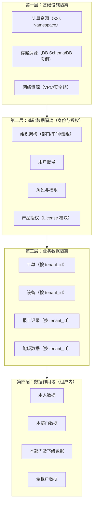
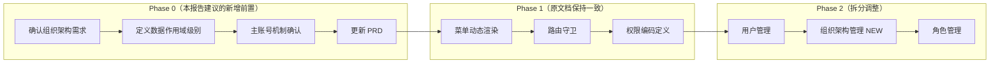

# 租户系统管理设计 — 专家评审报告

> **评审背景**：对照 SaaS 多租户行业最佳实践（含 ERP 领域）及腾讯云多租户架构，对 `tenant-sysadmin-design.md` 进行结构化评审。
>
> **评审角色**：ERP 领域产品专家 + 腾讯云端工作台产品专家（联合评审）

---

## 1. 总体评价

### 1.1 设计文档的优点（与行业实践的契合点）

| # | 优点 | 对应行业实践 | 说明 |
|---|------|------------|------|
| 1 | **平台/租户职责分层清晰** | SaaS 行业共识 | 与"平台不介入租户内部"的行业最佳实践完全一致，分层表格定义准确 |
| 2 | **后端 API 已覆盖核心管理能力** | ERP RBAC 标准 | 用户/角色/权限/字典的 CRUD API 完整，符合 RBAC 模型的基本要求 |
| 3 | **菜单动态渲染方向正确** | 主流 SaaS 方案 | 基于角色过滤菜单是最小可行方案，且文档预留了 `permission-codes.ts` 的扩展方向 |
| 4 | **权限编码标准化** | `module:action` 命名惯例 | 文档中提出的 `user:create`、`role:edit` 等命名规则与行业标准一致 |
| 5 | **隐私意识清晰** | 数据隔离要求 | 明确租户管理员不能查看其他租户数据，符合多租户隔离原则 |

### 1.2 设计文档的差距或风险点

| # | 差距/风险 | 严重性 | 说明 |
|---|----------|--------|------|
| 1 | **缺少"主账号/子账号"概念** | 中 | 当前将"系统管理员 (admin)"定位于内置角色，但行业实践通常将租户管理员视为"主账号"(Owner)，普通员工为"子账号"(Member)，两者有本质区别——主账号不可被删除、不可被降权 |
| 2 | **未引入组织架构(Organization)建模** | 高 | ERP 系统普遍采用"组织 + 角色"双维度控制。对于生产制造场景，缺乏部门/车间/班组等组织层级，将导致数据权限失控（如操作员能看到其他车间的工单） |
| 3 | **数据作用域(Data Scope)缺失** | 高 | 当前只控制"能否看到菜单"，不控制"能看到哪些数据"。ERP 场景下，这是**致命短板**——报表/工单/报工数据必须按组织范围隔离 |
| 4 | **租户上下文贯穿机制未显式描述** | 低 | JWT 虽已携带 tenant_id，但文档未强调这个机制，后续开发可能忽略租户隔离校验 |
| 5 | **仅考虑扁平角色模型** | 中 | 当前只支持用户 = N 个角色，但未考虑组织归属。实际场景：张三属于"车间A"，角色是"操作员"，只能看到车间A的工单 |

---

## 2. 逐项评审

### 2.1 现状分析（文档第 1 章）

| 维度 | 内容 |
|------|------|
| **专家意见** | 现状分析准确，定位了系统配置页的职责错位问题。与行业实践对比，当前"展示性系统配置页"是 SaaS 产品早期阶段的典型问题——开发团队优先实现业务功能，系统管理被搁置为"信息页"。 |
| **亮点** | 精准指出了 `MainLayout.vue` 第 248 行 `const menuTree = computed(() => allMenuTree)` 作为最小切入点，这个发现对开发团队非常有价值。 |
| **建议改进** | 1. 补充：当前 `SystemConfig.vue` 中的 API 统计信息（"接口端点数 27 个，测试通过率 92%"）在行业实践中通常归属**平台运营监控**，建议迁移到 admin 门户的 PlatformMonitor 页面。<br>2. 补充：数据字典 API 虽已存在，但需要确认字典范围（仅全局字典还是支持租户自定义字典？两者应分开）。 |
| **优先级** | P0 — 结论已充分，无需大改 |

### 2.2 分层职责定义（文档第 2 章）

| 维度 | 内容 |
|------|------|
| **专家意见** | 分层定义清晰。与 Tencent Cloud 三层资源隔离模型对照：<br>• 第一层（基础设施隔离）— 由 K8s/DB 连接层实现，文档未涉及，合理<br>• 第二层（基础数据隔离）— 平台层管理租户，租户层管理用户/角色/权限 ✅<br>• 第三层（业务数据隔离）— 文档未涉及，但这是 ERP 场景的关键需求 |
| **亮点** | 分层原则的三条表述简洁准确，特别是"许可证作为纽带"这一条，清晰连接了平台与租户两层。 |
| **建议改进** | 1. **建议补充第三层（业务数据隔离）说明**：在分层职责表中增加"数据隔离"维度，说明业务数据（工单/报工/设备记录等）以 tenant_id 隔离。<br>2. **建议补充四层隔离模型图**（见下文"关键建议补充"章节）。 |
| **优先级** | P1 — 不影响当前 Phase 1-3 开发，但应在 Phase 4 前补充 |

### 2.3 功能规划（文档第 3 章）

| 维度 | 内容 |
|------|------|
| **专家意见** | 6 大功能模块划分合理，覆盖了租户管理的基本需求。但与 ERP 行业实践对比，缺少以下在制造/ERP 产品中 P0 级别的功能：<br>• **组织架构管理**（部门/车间/班组树）<br>• **数据作用域配置**（用户数据可见范围） |
| **亮点** | 功能详情表结构清晰（功能描述/API/新页面/优先级），与后端 API 的对应关系明确，开发团队可以直接照此排期。 |
| **建议改进** | 1. **Phase 2 增加组织架构管理**：将组织建模列入 P0（非可选），因为在生产制造场景下，没有部门/车间归属，用户管理和数据权限都无法落地。<br>2. **角色-用户关联升至 P0**：当前标记为 P1，但在实际使用中，创建用户后必须分配角色，否则用户无法登录或看到空白菜单，应在 Phase 2 一并实现。<br>3. **操作日志升至 P1**：安全审计是 SaaS 产品的合规要求，建议从 P2 提升到 P1。 |
| **优先级** | P0 — 功能规划需要调整优先级和补充组织管理 |

### 2.4 权限矩阵（文档第 4 章）

| 维度 | 内容 |
|------|------|
| **专家意见** | 矩阵的定义方式合理，但缺少**数据维度**的权限控制。当前只控制了"能否看到菜单项"，没有控制"能看到哪些数据"。 |
| **亮点** | quadrantChart 权限象限图的表达直观，便于非技术人员理解角色定位。 |
| **建议改进** | 1. **补充数据作用域列**：在详细矩阵中为每个菜单项增加"数据作用域"要求，例如：<br>   - 工单管理 → 按班组可见（操作员仅见本班组工单）<br>   - 驾驶舱 → 按部门可见<br>   - 系统管理 → 全局可见（仅管理员）<br>2. **扩展权限模型说明**：从"角色→菜单"升级为"角色→菜单+数据作用域"的描述。 |
| **优先级** | P1 — 可在 Phase 2/3 实现菜单级权限后，Phase 4 再增加数据作用域 |

### 2.5 实施方案（文档第 5 章）

| 维度 | 内容 |
|------|------|
| **专家意见** | Phase 划分合理，技术方案可行。但以下方面需要调整：<br>• 组织架构管理应前置<br>• 菜单动态渲染建议直接采用权限编码方案，而非先做角色名称过滤再重构 |
| **亮点** | 代码示例具体、可直接使用。工作量估算合理（总计 ~16-21 天），符合中小型功能迭代的预期。 |
| **建议改进** | 1. **Phase 2 拆分为两个子阶段**：Phase 2a 用户管理 + Phase 2b 组织架构管理。<br>2. **权限编码方案前置**：虽然文档将权限编码标注为"后续扩展"，但建议在 Phase 1 就定义好 `permission-codes.ts`，菜单过滤直接基于权限编码而非角色名称。理由：<br>   - 从角色名称过滤 → 权限编码过滤需要重构菜单计算逻辑<br>   - 一开始就用权限编码，角色只作为权限集合的容器<br>   - 后续新增角色时无需修改 MainLayout.vue<br>3. **路由守卫方案增强**：当前路由守卫只检查是否 admin 角色，建议改为检查路由 meta 中声明的所需权限（如 `meta: { permissions: ['system:access'] }`）。 |
| **优先级** | P1 — 架构决策层面的建议，不影响 Phase 1 启动 |

### 2.6 待确认问题（文档第 6 章）

| 维度 | 内容 |
|------|------|
| **专家意见** | 4 个问题都是合理的开放式问题，体现了设计者对边界情况的思考。专家推荐方案见第 4 节。 |
| **建议改进** | 建议增加第 5 个问题：**组织架构层级如何定义？**（部门→车间→班组→产线？支持几级？） |
| **优先级** | P1 — 需要用户在产品规划阶段给出方向 |

---

## 3. 关键建议补充

### 3.1 建议引入：四层隔离模型（替代原文两层）

结合 Tencent Cloud 的架构经验，建议在文档第 2 章增加以下四层隔离模型：



| 层次 | 名称 | 说明 | 当前实现状态 |
|------|------|------|------------|
| L1 | 基础设施隔离 | K8s / 数据库层隔离 | ✅ 已在基础设施层实现 |
| L2 | 基础数据隔离 | 组织/用户/角色/权限/授权 | ⚠️ 用户/角色/权限 API 就绪，组织架构缺失 |
| L3 | 业务数据隔离 | 所有业务数据按 tenant_id 隔离 | ✅ 后端已通过 JWT tenant_id 实现 |
| L4 | 数据作用域 | 租户内数据可见范围（本人/本部门/全部） | ❌ 未实现，需在组织中引入 |

### 3.2 建议引入：主账号/子账号模型

在文档第 2 章的职责边界表中，增加对**租户管理员身份**的正式定义：

```
租户管理（客户前端）:
  - 入口: 客户前端 localhost:5173
  - 目标用户: 主账号（租户管理员）/ 子账号（普通用户）
  - 功能范围:
    主账号: 全部（用户/角色/权限/组织/字典/模块/日志）
    子账号: 按角色权限（通常仅业务操作）
  - 管理粒度: 单租户、本租户级别
```

**主账号规则**：
- 每个租户有且仅有一个主账号（在租户开通时由平台创建）
- 主账号不可被删除、不可被降权（系统保护）
- 主账号可创建/管理所有子账号
- 主账号本质是一个拥有 **所有权限** 的特殊 admin 账号，但不是"admin 角色"——admin 角色是系统内置角色，主账号的身份独立于角色系统

### 3.3 建议引入：组织架构（Organization）建模

在文档第 3 章功能规划中，增加"组织管理"模块：

| 功能模块 | 功能描述 | 对应后端 API | 新页面 | 优先级 |
|---------|---------|-------------|-------|--------|
| **组织管理-树结构** | 以树形展示本租户组织架构（部门→车间→班组） | `GET /api/v1/orgs/tree` ❌ 需新增 | 是 | **P0** |
| **组织管理-CRUD** | 创建/编辑/删除组织节点，调整父子关系 | `POST/PUT/DELETE /api/v1/orgs` ❌ 需新增 | 复用 | **P0** |
| **用户归属组织** | 为用户设置所属组织（一个用户一个主组织） | `PUT /api/v1/users/{id}/org` ❌ 需新增 | 复用用户编辑 | **P0** |

**数据模型建议**：

```sql
-- 组织节点表
CREATE TABLE organizations (
    id          INT PRIMARY KEY AUTO_INCREMENT,
    tenant_id   VARCHAR(64) NOT NULL,       -- 租户 ID
    parent_id   INT REFERENCES orgs(id),    -- 父节点 ID
    name        VARCHAR(128) NOT NULL,       -- 组织名称（如"一车间"）
    code        VARCHAR(64),                -- 组织编码
    level       INT NOT NULL DEFAULT 0,     -- 层级深度
    sort_order  INT DEFAULT 0,              -- 同级排序
    created_at  TIMESTAMP DEFAULT CURRENT_TIMESTAMP
);

-- 用户组织归属表（补充，替代 user 表直接记录 org_id，支持多归属扩展）
CREATE TABLE user_organizations (
    user_id     INT NOT NULL,
    org_id      INT NOT NULL,
    is_primary  BOOLEAN DEFAULT TRUE,       -- 是否主组织
    PRIMARY KEY (user_id, org_id)
);
```

### 3.4 建议引入：数据作用域（Data Scope）

在文档第 4 章权限矩阵中，增加数据作用域的说明：

**数据作用域级别定义**：

| 级别 | 编码 | 含义 | 适用场景 |
|------|------|------|---------|
| SELF | `scope:self` | 仅本人数据 | 个人报工记录、个人工单 |
| DEPT | `scope:dept` | 本部门/车间数据 | 班组长查看本班组工单 |
| DEPT_CHILD | `scope:dept_child` | 本部门及下级 | 车间主任查看下辖所有班组 |
| ALL | `scope:all` | 全租户数据 | 系统管理员、报表查看 |

**数据作用域与角色关联**：

```yaml
角色: 操作员
权限:
  - module: work_order
    action: read
    scope: dept        # 操作员只能看本车间工单
  - module: work_order
    action: create
    scope: self        # 创建工单时归属本车间

角色: 车间主任
权限:
  - module: work_order
    action: read
    scope: dept_child  # 可见本车间及下辖班组所有工单
```

### 3.5 租户上下文贯穿机制

在文档第 2 章分层原则中，补充以下说明：

> **租户上下文贯穿机制**：用户登录后，JWT token 中携带 `tenant_id`。前端所有 API 请求通过 `X-Tenant-Id` header 传递该值；后端通过 `get_current_user` 依赖注入校验租户身份。所有业务数据的隔离（L3）依赖此机制实现。
>
> 当前实现已验证：`client.ts` 的 `request interceptor` 已自动附加 `X-Tenant-Id`，后端 `get_tenant_repo` 已按 tenant_id 过滤数据。

### 3.6 未来扩展：子租户能力

在文档末尾增加"未来扩展方向"：

> **子租户（Sub-Tenant）**：对于集团型客户（如集团下有多个独立工厂），未来可支持子租户模式：
> - 每个子租户拥有独立的组织架构、用户集合
> - 集团主账号可跨子租户查看汇总数据
> - 许可证层面支持子租户配额分配
> - 这是 Tencent Cloud 多租户架构中的推荐扩展方向，当前无需实现，但数据模型（如 `organizations.parent_id`）设计时预留扩展空间

---

## 4. 对 4 个待确认问题的专家意见

| 问题 | 专家推荐方案 | 理由 |
|------|------------|------|
| **Q1：系统概览方案** | **推荐方案 A**（归入系统概览页） | 应用名称/版本号/租户 ID 属于基础信息，展示在系统概览页顶部不会造成干扰，反而有利于运维排障。行业实践（Salesforce/飞书管理后台）都在系统概览页展示此类信息。占据区域很小（通常 3-5 行），不喧宾夺主。 |
| **Q2：operator 范围** | **推荐「仅工单+报工，排产员另建角色」** | 行业实践中，一线操作员（Operator）和排产员（Scheduler）是不同职能。排产涉及产能规划、资源调配，需要更高权限。建议：<br>• `operator` 角色保持仅工单+报工<br>• 新建 `scheduler` 角色，开放排产+报表<br>• 数据作用域上，operator 仅见本班组数据，scheduler 可见全车间/全厂数据 |
| **Q3：密码重置** | **推荐新增独立接口** | 行业最佳实践要求：密码重置是**安全敏感操作**，应与普通信息更新分离。独立接口 `PUT /api/v1/users/{id}/reset-password` 的好处：<br>• 可单独记录审计日志（谁在何时重置了谁的密码）<br>• 可增加额外校验（如：主账号才能重置子账号密码）<br>• 不影响普通更新接口的安全性<br>建议同时要求重置时输入新密码 + 确认新密码（前端校验） |
| **Q4：demo 只读** | **推荐「前端+后端双重拦截」** | 纯前端控制存在被绕过风险（Postman/curl 直接调 API）。行业实践中：<br>• 前端控制菜单/按钮可见性（UX 层面防止误操作）<br>• 后端通过鉴权中间件拦截写操作（安全底线）<br>具体实现：在 `get_current_user` 依赖中检查角色权限，demo 角色的所有 POST/PUT/DELETE 请求返回 403。如果后端当前无此逻辑，建议在 Phase 1 的路由守卫改造时同步添加——改动量很小（加一个中间件或者装饰器）。 |

---

## 5. 评审结论

### 综合评级：**B+**（良好，有个别关键补充建议）

| 维度 | 评分 | 说明 |
|------|:----:|------|
| 问题定位准确度 | ★★★★★ | 精准识别了系统配置页职责错位、菜单无权限过滤等核心问题 |
| 分层设计合理性 | ★★★★★ | 平台/租户分层边界清晰，符合行业共识 |
| 功能规划完整性 | ★★★★☆ | 覆盖了用户/角色/权限基础，但缺少组织架构和字段级权限 |
| 实施方案可行性 | ★★★★★ | 代码示例具体、Phase 划分合理、工作量估算务实 |
| 行业实践对齐度 | ★★★☆☆ | RBAC 方向正确，但缺少数据作用域(Data Scope)和组织架构(Organization)这两个 ERP 场景的关键要素 |

### 建议的后续行动



1. **优先处理**（在开发启动前）：与用户确认组织架构需求（部门/车间/班组层级数、数据作用域级别），更新 PRD
2. **Phase 1 调整**：权限编码方案前置定义，菜单直接基于权限编码过滤
3. **Phase 2 调整**：增加组织架构管理，角色-用户关联升至 P0
4. **准备迭代**：本报告涉及的数据作用域和组织架构可以作为 Phase 2.5 或 Phase 3.5 的增强项，不必阻塞当前开发

---

## 附录：评审参考来源

- SaaS 多租户最佳实践（含 ERP 领域）— RBAC + 组织架构双维度模型、主账号/子账号体系
- 腾讯云多租户架构 — 三层资源隔离模型（基础设施/基础数据/业务数据）、租户身份贯穿机制、子租户扩展方向
- 主流 SaaS 产品对标：Salesforce（组织-角色-权限集）、飞书管理后台（主账号/子账号）、用友/金蝶 ERP（组织+数据作用域）
