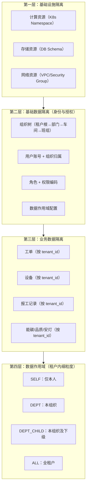
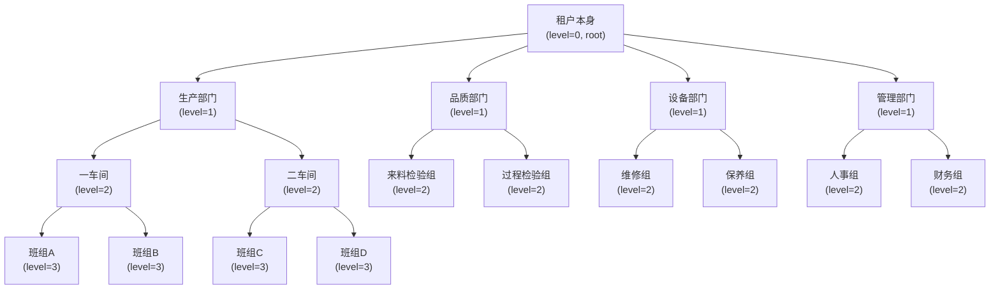
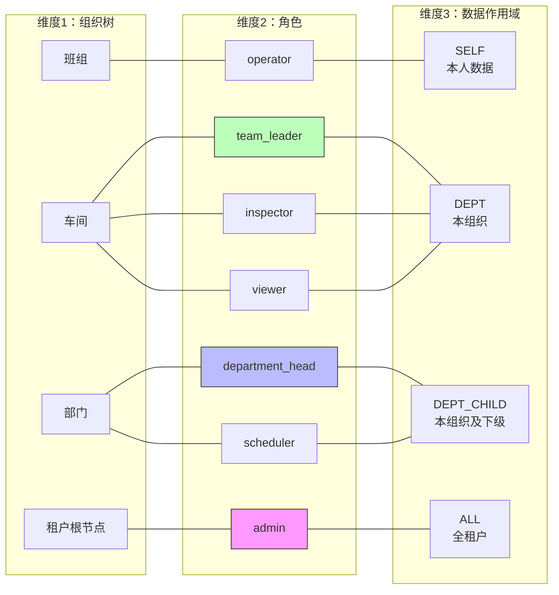
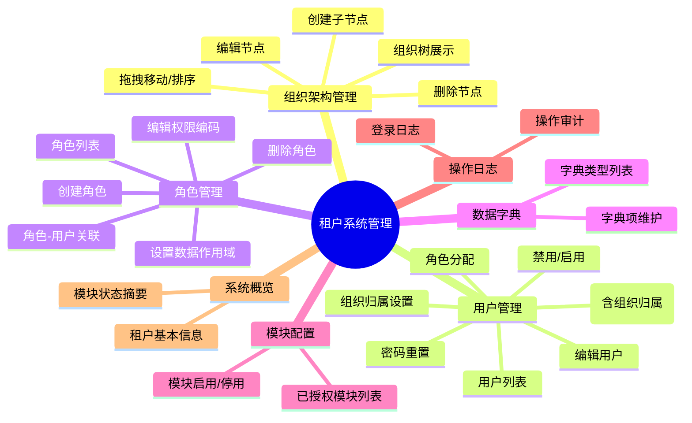
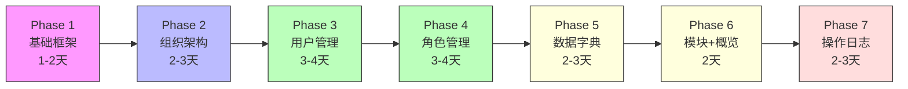
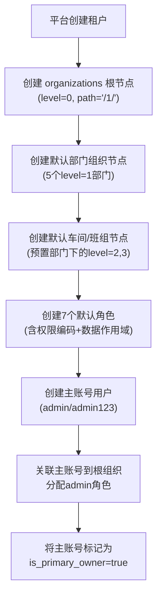

# 租户系统管理设计文档 v2

> **版本说明**：本文档是对 v1 版本（`tenant-sysadmin-design.md`）的全面修订，融合了 SaaS 多租户行业最佳实践专家评审意见及用户反馈。核心变更包括：租户即组织（Tenant=Organization）、组织树+角色+数据作用域三维权限模型、可配置原则、主账号机制。所有设计已从概念层面下沉到数据模型、API 接口和前端组件级别。

---

## 1. 核心设计原则

### 1.1 设计前提

| # | 原则 | 说明 |
|---|------|------|
| P1 | **租户即组织** | 租户本身就是一个最高层级的组织节点。不再区分"租户"和"组织"两个独立概念。每个租户在 `organizations` 表中有一条 `level=0` 的根记录 |
| P2 | **三维权限模型** | 权限控制由三个维度组合决定：**组织树**（属于哪个部门/车间/班组）× **角色**（能做什么操作）× **数据作用域**（能看到哪些范围的数据） |
| P3 | **可配置** | 租户管理端可自行定义组织层级、角色权限、用户归属和角色与数据作用域的绑定关系。平台不干涉租户内部组织设置 |
| P4 | **主账号机制** | 每个租户有且仅有一个主账号，在租户开通时由平台创建。主账号不可被删除、不可被降权、不可被禁用 |
| P5 | **平台不介入租户内部** | 平台负责租户开通/停用/许可证发放；租户管理员（主账号）负责内部组织、用户、角色、权限的全部管理 |

### 1.2 四层隔离模型



| 层次 | 名称 | 职责 | 实现状态 |
|------|------|------|---------|
| L1 | 基础设施隔离 | K8s Namespace / 独立 DB Schema | ✅ 已实现 |
| L2 | 基础数据隔离 | 组织/用户/角色/权限/授权管理 | ⚠️ 组织建模和角色-作用域绑定缺失 |
| L3 | 业务数据隔离 | 所有业务数据按 tenant_id 隔离 | ✅ 后端已通过 JWT 实现 |
| L4 | 数据作用域 | 租户内数据可见范围控制 | ❌ **待实现**（本文档核心新增） |

### 1.3 租户上下文贯穿机制

用户登录后，JWT token 中携带以下上下文：

```json
{
  "sub": "user_xxx",
  "tenant_id": "tenant_abc",
  "org_id": 5,
  "roles": ["department_head"],
  "permissions": ["work_order:read", "work_order:create", "work_order:update"],
  "scope": "dept_child"
}
```

- 前端所有 API 请求自动附加 `X-Tenant-Id` header（已在 `client.ts` 的 request interceptor 中实现）
- 后端通过 `get_current_user` 依赖注入解析 token，校验租户身份
- 所有业务数据查询自动附加 tenant_id 过滤条件（L3 隔离）
- 数据作用域（L4）在后端 Service 层通过 `DataScopeService` 动态注入 WHERE 条件

---

## 2. 组织架构模型

### 2.1 核心概念：租户即组织

每个租户在平台上开通时，自动在 `organizations` 表中创建一条 `level=0` 的根记录，其 `id` 与租户 ID 一一对应（或通过 `tenant_id` 关联）。**整个组织树就是该租户内部的部门/车间/班组层级结构。**

### 2.2 数据模型（DDL，SQLite 兼容语法）

```sql
-- =============================================
-- 组织节点表
-- 租户本身 = level=0 的根组织节点
-- =============================================
CREATE TABLE organizations (
    id          INTEGER PRIMARY KEY AUTOINCREMENT,
    tenant_id   VARCHAR(64) NOT NULL,                          -- 租户 ID（与租户表关联）
    parent_id   INTEGER REFERENCES organizations(id),          -- 父节点 ID（NULL = 根节点）
    name        VARCHAR(128) NOT NULL,                         -- 部门名称/车间名称/班组名称
    code        VARCHAR(64) DEFAULT '',                        -- 组织编码（如 "prod-workshop-1"）
    level       INTEGER NOT NULL DEFAULT 0,                    -- 层级深度：0=租户根，1=部门，2=车间，3=班组
    sort_order  INTEGER DEFAULT 0,                             -- 同级排序序号
    path        VARCHAR(512) NOT NULL DEFAULT '/',             -- 物化路径，如 "/1/5/12/"
    is_active   INTEGER NOT NULL DEFAULT 1,                    -- 1=启用，0=停用
    description VARCHAR(256) DEFAULT '',                       -- 组织描述
    created_at  TIMESTAMP DEFAULT CURRENT_TIMESTAMP,
    updated_at  TIMESTAMP DEFAULT CURRENT_TIMESTAMP
);

CREATE INDEX idx_orgs_tenant ON organizations(tenant_id);
CREATE INDEX idx_orgs_parent ON organizations(parent_id);
CREATE INDEX idx_orgs_path   ON organizations(path);
CREATE UNIQUE INDEX idx_orgs_tenant_code ON organizations(tenant_id, code);

-- =============================================
-- 用户组织归属表（多对多）
-- 一个用户可属于多个组织节点，但仅一个主组织
-- =============================================
CREATE TABLE user_organizations (
    id          INTEGER PRIMARY KEY AUTOINCREMENT,
    user_id     INTEGER NOT NULL REFERENCES users(id) ON DELETE CASCADE,
    org_id      INTEGER NOT NULL REFERENCES organizations(id) ON DELETE CASCADE,
    is_primary  INTEGER NOT NULL DEFAULT 1,                   -- 1=主组织，0=兼任组织
    job_title   VARCHAR(128) DEFAULT '',                      -- 职务名称（如"车间主任"）
    created_at  TIMESTAMP DEFAULT CURRENT_TIMESTAMP,
    UNIQUE(user_id, org_id)
);

CREATE INDEX idx_user_org_user ON user_organizations(user_id);
CREATE INDEX idx_user_org_org  ON user_organizations(org_id);
```

### 2.3 默认组织树结构

租户初始化时自动创建以下组织节点：

```
租户本身 (level=0, root, path="/1/")
│
├── 生产部门 (level=1, path="/1/2/")
│   ├── 一车间 (level=2, path="/1/2/3/")
│   │   ├── 班组A (level=3, path="/1/2/3/4/")
│   │   └── 班组B (level=3, path="/1/2/3/5/")
│   └── 二车间 (level=2, path="/1/2/6/")
│       ├── 班组C (level=3, path="/1/2/6/7/")
│       └── 班组D (level=3, path="/1/2/6/8/")
│
├── 品质部门 (level=1, path="/1/9/")
│   ├── 来料检验组 (level=2, path="/1/9/10/")
│   └── 过程检验组 (level=2, path="/1/9/11/")
│
├── 设备部门 (level=1, path="/1/12/")
│   ├── 维修组 (level=2, path="/1/12/13/")
│   └── 保养组 (level=2, path="/1/12/14/")
│
└── 管理部门 (level=1, path="/1/15/")
    ├── 人事组 (level=2, path="/1/15/16/")
    └── 财务组 (level=2, path="/1/15/17/")
```

**组织树结构图**（Mermaid）：



### 2.4 组织架构管理 API

| 方法 | 路径 | 功能 | 实现状态 |
|------|------|------|---------|
| GET | `/api/v1/orgs/tree` | 获取本租户完整组织树 | ❌ 需新增 |
| GET | `/api/v1/orgs/{id}` | 获取单个组织节点详情 | ❌ 需新增 |
| GET | `/api/v1/orgs/{id}/children` | 获取直接子节点 | ❌ 需新增 |
| POST | `/api/v1/orgs` | 创建组织节点（指定 parent_id） | ❌ 需新增 |
| PUT | `/api/v1/orgs/{id}` | 编辑组织节点 | ❌ 需新增 |
| PUT | `/api/v1/orgs/{id}/move` | 拖拽移动（变更 parent_id + 重建 path） | ❌ 需新增 |
| DELETE | `/api/v1/orgs/{id}` | 删除组织节点（有子节点或挂载用户时禁止删除） | ❌ 需新增 |

**POST /api/v1/orgs 请求体**：
```json
{
  "parent_id": 2,
  "name": "三车间",
  "code": "prod-workshop-3",
  "sort_order": 3,
  "description": "2025年新建车间"
}
```

**PUT /api/v1/orgs/{id}/move 请求体**：
```json
{
  "new_parent_id": 1,
  "new_sort_order": 4
}
```

**前端组件要求**：
- 使用树形组件（如 Element Plus `<el-tree>`）展示组织树
- 支持展开/折叠、拖拽排序
- 右键菜单：新建子节点、编辑、删除、移动
- 组织选择器（Picker）：在创建/编辑用户时选择归属组织

---

## 3. 角色与权限体系

### 3.1 三维权限模型



**鉴权判定流程**：

```
用户请求操作 → 
  1. 获取用户的 org_id（从主组织）+ 角色列表
  2. 检查角色是否包含请求操作的权限编码（module:action）
  3. 检查请求数据的 org_id 是否在角色的数据作用域范围内
  4. 两步均通过 → 允许；否则 → 403
```

### 3.2 默认角色定义

租户初始化时预置 7 个角色，租户管理员可在管理端修改其权限编码组合和数据作用域：

| 角色编码 | 角色名称 | 数据作用域 | 适用岗位 | 管理员可修改？ |
|---------|---------|-----------|---------|:------------:|
| `admin` | 系统管理员 | ALL | 租户主账号 | ❌ 不可修改（系统保护） |
| `department_head` | 部门主管 | DEPT_CHILD | 部门经理/车间主任 | ✅ 可修改 |
| `team_leader` | 小组长 | DEPT | 班组长 | ✅ 可修改 |
| `operator` | 操作员 | SELF | 一线工人 | ✅ 可修改 |
| `scheduler` | 排产员 | DEPT_CHILD | 计划员 | ✅ 可修改 |
| `inspector` | 质检员 | DEPT | 品质检验员 | ✅ 可修改 |
| `viewer` | 只读用户 | DEPT | 演示/参观 | ✅ 可修改 |

> **注意**：`admin` 角色不可修改/删除。其他角色修改后，所有已分配该角色的用户立即生效。

### 3.3 完整权限编码表

所有权限按 `module:action` 格式命名。以下为完整清单（系统管理 + 全部业务模块）：

#### 系统管理权限

| 编码 | 说明 | 归属模块 |
|------|------|---------|
| `system:access` | 访问系统管理区 | 系统管理 |
| `system:config` | 系统配置（概览/模块启停） | 系统管理 |
| `org:create` | 创建组织节点 | 组织管理 |
| `org:edit` | 编辑组织节点 | 组织管理 |
| `org:delete` | 删除组织节点 | 组织管理 |
| `org:move` | 拖拽移动组织节点 | 组织管理 |
| `user:create` | 创建用户 | 用户管理 |
| `user:edit` | 编辑用户 | 用户管理 |
| `user:delete` | 删除用户 | 用户管理 |
| `user:disable` | 禁用/启用用户 | 用户管理 |
| `user:reset_password` | 重置用户密码 | 用户管理 |
| `role:create` | 创建角色 | 角色管理 |
| `role:edit` | 编辑角色权限 | 角色管理 |
| `role:delete` | 删除角色 | 角色管理 |
| `role:assign` | 为用户分配角色 | 角色管理 |
| `dictionary:create` | 创建字典类型 | 数据字典 |
| `dictionary:edit` | 编辑字典项 | 数据字典 |
| `dictionary:delete` | 删除字典项 | 数据字典 |
| `audit:read` | 查看操作日志 | 审计管理 |

#### 业务模块权限

| 编码 | 说明 | 归属模块 |
|------|------|---------|
| `work_order:create` | 创建工单 | 工单管理 |
| `work_order:read` | 查看工单 | 工单管理 |
| `work_order:update` | 编辑工单 | 工单管理 |
| `work_order:delete` | 删除工单 | 工单管理 |
| `work_order:release` | 下达工单（派工） | 工单管理 |
| `work_order:close` | 关闭工单（完工确认） | 工单管理 |
| `work_report:create` | 创建报工记录 | 报工管理 |
| `work_report:read` | 查看报工记录 | 报工管理 |
| `work_report:update` | 编辑报工记录 | 报工管理 |
| `work_report:approve` | 审批报工 | 报工管理 |
| `equipment:create` | 创建设备档案 | 设备管理 |
| `equipment:read` | 查看设备信息 | 设备管理 |
| `equipment:update` | 编辑设备信息 | 设备管理 |
| `equipment:delete` | 删除设备档案 | 设备管理 |
| `equipment:maintain` | 发起设备保养 | 设备管理 |
| `equipment:repair` | 发起设备维修 | 设备管理 |
| `andon:create` | 发起安灯呼叫 | 安灯管理 |
| `andon:read` | 查看安灯记录 | 安灯管理 |
| `andon:action` | 处理安灯呼叫（到场确认） | 安灯管理 |
| `andon:response` | 回复安灯 | 安灯管理 |
| `quality:create` | 创建检验记录 | 品质管理 |
| `quality:read` | 查看检验记录 | 品质管理 |
| `quality:update` | 编辑检验记录 | 品质管理 |
| `quality:judge` | 判定检验结论（合格/不合格） | 品质管理 |
| `energy:read` | 查看能碳数据 | 能碳管理 |
| `energy:config` | 配置能碳参数 | 能碳管理 |
| `collect:read` | 查看采集数据 | 数据采集 |
| `collect:config` | 配置采集规则 | 数据采集 |
| `report:read` | 查看报表 | 报表管理 |
| `schedule:read` | 查看排产计划 | 排产管理 |
| `schedule:create` | 创建排产计划 | 排产管理 |
| `schedule:update` | 调整排产计划 | 排产管理 |
| `dashboard:read` | 查看驾驶舱 | 首页 |
| `dashboard:workshop` | 查看车间大屏 | 首页 |

### 3.4 默认角色权限预配置

以下为每个默认角色在初始化时绑定的权限编码集合：

| 角色 | 权限编码集合 |
|------|------------|
| **admin** | 全部 40+ 权限编码 |
| **department_head** | `work_order:read`, `work_order:update`, `work_order:release`, `work_order:close`, `work_report:read`, `work_report:approve`, `equipment:read`, `equipment:maintain`, `equipment:repair`, `andon:read`, `andon:action`, `andon:response`, `quality:read`, `quality:judge`, `energy:read`, `collect:read`, `report:read`, `schedule:read`, `dashboard:read`, `dashboard:workshop`, `user:read` |
| **team_leader** | `work_order:read`, `work_order:update`, `work_report:read`, `work_report:approve`, `andon:read`, `andon:action`, `quality:read`, `dashboard:read`, `user:read` |
| **operator** | `work_order:read`, `work_report:create`, `work_report:read`, `andon:create`, `andon:read`, `dashboard:read` |
| **scheduler** | `work_order:read`, `work_order:create`, `work_order:update`, `schedule:read`, `schedule:create`, `schedule:update`, `report:read`, `dashboard:read` |
| **inspector** | `work_order:read`, `quality:create`, `quality:read`, `quality:update`, `quality:judge`, `dashboard:read` |
| **viewer** | `work_order:read`, `work_report:read`, `equipment:read`, `andon:read`, `quality:read`, `energy:read`, `collect:read`, `report:read`, `dashboard:read` |

### 3.5 角色管理 API

| 方法 | 路径 | 功能 | 实现状态 |
|------|------|------|---------|
| GET | `/api/v1/roles` | 获取角色列表 | ✅ 已有 |
| GET | `/api/v1/roles/{id}` | 获取角色详情（含权限列表 + 数据作用域） | ✅ 已有（需扩展作用域字段） |
| POST | `/api/v1/roles` | 创建自定义角色 | ✅ 已有 |
| PUT | `/api/v1/roles/{id}` | 编辑角色基础信息 | ✅ 已有 |
| PUT | `/api/v1/roles/{id}/permissions` | 更新角色权限编码集合 | ✅ 已有 |
| PUT | `/api/v1/roles/{id}/scope` | 设置角色的数据作用域 | ❌ 需新增 |
| DELETE | `/api/v1/roles/{id}` | 删除角色（admin 角色不可删除） | ✅ 已有 |
| GET | `/api/v1/roles/{id}/users` | 查看角色下用户 | ✅ 已有 |
| POST | `/api/v1/roles/{id}/users` | 为用户分配角色 | ✅ 已有 |

---

## 4. 数据作用域（Data Scope）设计

### 4.1 四级作用域定义

| 级别 | 编码 | 含义 | SQL 实现（伪代码） |
|------|------|------|-------------------|
| SELF | `scope:self` | 仅本人数据 | `WHERE created_by = :current_user_id` |
| DEPT | `scope:dept` | 所属组织及直属子组织 | `WHERE org_id IN (:current_org_id, :direct_child_ids)` |
| DEPT_CHILD | `scope:dept_child` | 所属组织及所有下级 | `WHERE org_id IN (SELECT id FROM organizations WHERE path LIKE :prefix || '%')` |
| ALL | `scope:all` | 全租户数据 | 无需追加 scope 条件 |

### 4.2 数据作用域实现方案

在后端 Service 层通过统一的 `DataScopeService` 实现：

```python
# 伪代码 — DataScopeService 核心逻辑
class DataScopeService:
    def apply_scope(self, query, user, scope_code, org_id_field='org_id'):
        """
        根据用户角色数据作用域，自动追加 WHERE 条件
        - query: SQLAlchemy Query 对象
        - user: 当前用户对象（含 org_id, roles）
        - scope_code: 请求操作对应的作用域级别
        - org_id_field: 目标表的组织 ID 字段名
        """
        if scope_code == 'scope:all':
            return query                      # 全租户，不追加
        elif scope_code == 'scope:dept_child':
            prefix = user.org.path
            return query.filter(
                org_id_field.in_(
                    select(Organization.id).where(
                        Organization.path.like(f'{prefix}%')
                    )
                )
            )
        elif scope_code == 'scope:dept':
            child_ids = get_direct_child_ids(user.org_id)
            return query.filter(
                org_id_field.in_([user.org_id] + child_ids)
            )
        elif scope_code == 'scope:self':
            return query.filter(org_id_field == user.org_id)
```

### 4.3 业务表与组织的关联设计

所有业务表必须包含 `org_id` 字段（或通过关联间接获得），以便数据作用域过滤：

| 业务表 | 组织关联字段 | 说明 |
|--------|------------|------|
| `work_orders` | `org_id` | 工单归属车间/班组 |
| `work_reports` | `org_id`(通过 work_order 关联) | 报工按工单归属继承 |
| `equipment` | `org_id` | 设备归属车间 |
| `andon_records` | `org_id` | 安灯呼叫归属车间 |
| `quality_checks` | `org_id` | 检验记录归属部门 |
| `energy_records` | `org_id` | 能碳数据归属组织 |

---

## 5. 租户管理端功能规划

### 5.1 功能全景图



### 5.2 功能详情表

| 序号 | 功能模块 | 功能描述 | 对应 API | 新页面 | 优先级 |
|:----:|---------|---------|---------|:------:|:------:|
| 1 | **系统概览** | 展示租户名称/编码/版本/组织树高度/用户数/角色数；模块授权状态摘要 | `GET /api/v1/system/overview` ❌ 需新增 | 是（替代原 `/system/config`） | **P0** |
| 2 | **组织架构管理** | 树形展示（`<el-tree>`）；右键新建/编辑/删除/拖拽移动；批量导入 | `GET /api/v1/orgs/tree` ❌ 需新增<br>`POST/PUT/DELETE /api/v1/orgs` ❌ 需新增<br>`PUT /api/v1/orgs/{id}/move` ❌ 需新增 | 是 | **P0** |
| 3 | **用户管理-列表** | 分页展示用户；搜索（姓名/用户名/组织路径）；按状态/组织筛选 | `GET /api/v1/users` ✅ 已有 | 是 | **P0** |
| 4 | **用户管理-创建** | 表单：用户名/姓名/邮箱/手机/密码/组织归属（组织选择器）+ 角色分配（多选） | `POST /api/v1/users` ✅ 已有（需扩展 org_id 字段） | 弹窗 | **P0** |
| 5 | **用户管理-编辑** | 编辑用户基础信息；变更组织归属；变更角色分配 | `PUT /api/v1/users/{id}` ✅ 已有 | 弹窗 | **P0** |
| 6 | **用户管理-禁用/启用** | 切换用户状态（active/disabled）；被禁用的用户无法登录 | `PUT /api/v1/users/{id}` ✅ 已有 | 行内按钮 | **P0** |
| 7 | **用户管理-密码重置** | 主账号重置任意子账号密码；记录审计日志（操作人/操作时间/目标用户） | `PUT /api/v1/users/{id}/reset-password` ❌ 需新增 | 弹窗 | **P1** |
| 8 | **角色管理-列表** | 分页展示角色；区分系统内置角色（可编辑不可删）和自定义角色（可删） | `GET /api/v1/roles` ✅ 已有 | 是 | **P0** |
| 9 | **角色管理-创建** | 表单：角色名称/编码/描述 + 权限勾选树（按 module 分组） | `POST /api/v1/roles` ✅ 已有 | 弹窗 | **P0** |
| 10 | **角色管理-编辑权限** | 树形勾选权限编码；已选/未选状态清晰可辨 | `PUT /api/v1/roles/{id}/permissions` ✅ 已有 | 弹出页/抽屉 | **P0** |
| 11 | **角色管理-设置作用域** | 为角色选择数据作用域级别（SELF/DEPT/DEPT_CHILD/ALL） | `PUT /api/v1/roles/{id}/scope` ❌ 需新增 | 复用编辑权限 | **P0** |
| 12 | **角色管理-删除** | 删除自定义角色（已分配用户的角色给出警告） | `DELETE /api/v1/roles/{id}` ✅ 已有 | 确认弹窗 | **P1** |
| 13 | **角色-用户关联** | 角色详情页展示已关联用户列表；添加/移除用户 | `GET/POST /api/v1/roles/{id}/users` ✅ 已有 | 集成在角色详情 | **P0** |
| 14 | **数据字典-列表** | 分页展示字典类型（如工单类型/报工类型/安灯类型） | `GET /api/v1/dictionaries` ✅ 已有 | 是 | **P1** |
| 15 | **数据字典-详情** | 查看字典项；创建/编辑/删除/排序字典项 | `GET /api/v1/dictionaries/code/{code}/items` ✅ 已有<br>`POST/PUT/DELETE` ✅ 已有 | 弹出页 | **P1** |
| 16 | **模块配置** | 展示已授权模块列表；启用/停用开关；模块启用状态影响左侧菜单可见性 | `PUT /api/v1/tenant/modules` ❌ 需新增 | 是 | **P1** |
| 17 | **操作日志** | 分页展示操作审计记录；按操作人/操作类型/时间筛选；敏感操作（密码重置/用户停用）特殊标记 | `GET /api/v1/audit-logs` ❌ 需新增 | 是 | **P1** |

### 5.3 用户与组织、角色的关联逻辑

```
创建用户流程:
  1. 填写基础信息（用户名/密码/姓名/邮箱/手机）
  2. 选择【归属组织】（组织选择器 → 单选主组织）
  3. 勾选【分配角色】（多选，可选 1-N 个角色）
  4. 保存 → 调用 POST /api/v1/users（含 org_id + role_ids）
  5. 后端：
     a. 创建 users 表记录（含 primary_org_id）
     b. 写入 user_organizations 表（is_primary=1）
     c. 写入 user_roles 表（每个 role_id 一条记录）

编辑用户组织归属:
  - 变更主组织：更新 users.primary_org_id + user_organizations.is_primary
  - 添加兼任组织：新增 user_organizations 记录（is_primary=0）
  - 移除兼任组织：删除 user_organizations 记录（不允许删除 is_primary=1 的记录）
```

---

## 6. 菜单与路由权限

### 6.1 菜单动态渲染规则

完整的 7 角色 × 18 菜单项可见性矩阵：

| 菜单分组 | 菜单子项 | 路由 | admin | dept_head | team_leader | operator | scheduler | inspector | viewer |
|---------|---------|------|:----:|:---------:|:-----------:|:--------:|:---------:|:---------:|:------:|
| **首页** | 驾驶舱 | `/dashboard` | ✅ | ✅ | ✅ | ✅ | ✅ | ✅ | ✅ |
| | 车间大屏 | `/dashboard/workshop` | ✅ | ✅ | ❌ | ❌ | ❌ | ❌ | ❌ |
| **生产管理** | 工单管理 | `/production/work-orders` | ✅ | ✅ | ✅ | ✅ | ❌ | ❌ | ✅ |
| | 报工管理 | `/production/work-reports` | ✅ | ✅ | ✅ | ✅ | ❌ | ❌ | ✅ |
| | 生产报表 | `/production/reports` | ✅ | ✅ | ❌ | ❌ | ✅ | ❌ | ✅ |
| | 生产排产 | `/production/schedule` | ✅ | ✅ | ❌ | ❌ | ✅ | ❌ | ❌ |
| **设备管理** | 设备管理 | `/equipment` | ✅ | ✅ | ❌ | ❌ | ❌ | ❌ | ✅ |
| **安灯管理** | 安灯管理 | `/andon` | ✅ | ✅ | ✅ | ✅ | ❌ | ❌ | ✅ |
| **品质管理** | 品质管理 | `/quality` | ✅ | ✅ | ❌ | ❌ | ❌ | ✅ | ✅ |
| **能碳管理** | 能碳管理 | `/energy` | ✅ | ✅ | ❌ | ❌ | ❌ | ❌ | ✅ |
| **数据采集** | 数据采集 | `/collect` | ✅ | ✅ | ❌ | ❌ | ❌ | ❌ | ✅ |
| **系统管理** | 系统概览 | `/system/overview` | ✅ | ❌ | ❌ | ❌ | ❌ | ❌ | ❌ |
| | 组织架构 | `/system/orgs` | ✅ | ❌ | ❌ | ❌ | ❌ | ❌ | ❌ |
| | 用户管理 | `/system/users` | ✅ | ❌ | ❌ | ❌ | ❌ | ❌ | ❌ |
| | 角色管理 | `/system/roles` | ✅ | ❌ | ❌ | ❌ | ❌ | ❌ | ❌ |
| | 数据字典 | `/system/dictionaries` | ✅ | ❌ | ❌ | ❌ | ❌ | ❌ | ❌ |
| | 模块配置 | `/system/modules` | ✅ | ❌ | ❌ | ❌ | ❌ | ❌ | ❌ |
| | 操作日志 | `/system/audit-logs` | ✅ | ❌ | ❌ | ❌ | ❌ | ❌ | ❌ |

> 系统管理所有子路由统一要求 `system:access` 权限编码，仅 admin 角色拥有该权限。

### 6.2 权限编码 → 菜单映射

每项菜单绑定一个或多个权限编码，用户在角色中拥有对应编码即可看到菜单：

```typescript
// 菜单定义结构（含权限编码映射）
const menuTreeWithPermissions = [
  {
    id: 'home',
    name: '首页',
    children: [
      { id: 'cockpit', name: '驾驶舱', path: '/dashboard', permissions: ['dashboard:read'] },
      { id: 'workshop', name: '车间大屏', path: '/dashboard/workshop', permissions: ['dashboard:workshop'] },
    ]
  },
  {
    id: 'production',
    name: '生产管理',
    children: [
      { id: 'work_orders', name: '工单管理', path: '/production/work-orders', permissions: ['work_order:read'] },
      { id: 'work_reports', name: '报工管理', path: '/production/work-reports', permissions: ['work_report:read'] },
      { id: 'reports', name: '生产报表', path: '/production/reports', permissions: ['report:read'] },
      { id: 'schedule', name: '生产排产', path: '/production/schedule', permissions: ['schedule:read'] },
    ]
  },
  {
    id: 'system',
    name: '系统管理',
    permissions: ['system:access'],  // 系统管理分组整体需要 system:access
    children: [
      { id: 'overview', name: '系统概览', path: '/system/overview', permissions: ['system:access'] },
      { id: 'orgs', name: '组织架构', path: '/system/orgs', permissions: ['org:create', 'org:edit', 'org:delete'] },
      { id: 'users', name: '用户管理', path: '/system/users', permissions: ['user:create', 'user:edit'] },
      // ...
    ]
  },
  // ...
]

// 菜单过滤逻辑（基于权限编码的交集判断）
const menuTree = computed(() => {
  const userPermissions = authStore.user?.permissions ?? []
  return allMenuTree
    .filter(group => {
      // 检查组整体权限
      if (group.permissions && group.permissions.length > 0) {
        return group.permissions.some(p => userPermissions.includes(p))
      }
      return true
    })
    .map(group => ({
      ...group,
      children: group.children?.filter(item => {
        if (item.permissions && item.permissions.length > 0) {
          return item.permissions.some(p => userPermissions.includes(p))
        }
        return true
      })
    }))
    .filter(group => group.children?.length > 0)
})
```

### 6.3 路由守卫规则

```typescript
// router/index.ts
router.beforeEach((to, from, next) => {
  const token = localStorage.getItem('access_token')
  if (to.path !== '/login' && !token) return next('/login')

  // 权限守卫：检查路由 meta 中声明的所需权限
  const requiredPermissions = to.meta?.permissions as string[] ?? []
  if (requiredPermissions.length > 0) {
    const userInfo = localStorage.getItem('user_info')
    if (!userInfo) return next('/login')
    
    const user = JSON.parse(userInfo)
    const userPermissions = user.permissions ?? []
    
    const hasPermission = requiredPermissions.some(p => userPermissions.includes(p))
    if (!hasPermission) return next('/')  // 无权访问，跳首页
  }

  next()
})
```

**路由 meta 配置示例**：
```typescript
{
  path: '/system/users',
  component: () => import('@/views/system/UserManagement.vue'),
  meta: {
    permissions: ['user:create', 'user:edit'],  // 拥有任一即可访问
    title: '用户管理'
  }
}
```

---

## 7. 实施方案

### 7.1 开发阶段划分



| Phase | 内容 | 前置依赖 | 工作量 | 产出物 |
|-------|------|---------|--------|--------|
| **Phase 1** | 基础框架：定义 `permission-codes.ts`、菜单动态渲染（基于权限编码）、路由守卫、`/system/config` → `/system/overview` 重定向、扩展用户 `user_info` 中返回 permissions 数组 | 无 | **1-2 天** | 菜单按角色动态渲染、非 admin 用户无法访问系统管理页 |
| **Phase 2** | 组织架构管理：`organizations` 表建表 DDL 并迁移、后端 CRUD API（含 tree / move / path 重建）、前端树组件 `<OrgTree.vue>`（含拖拽、右键菜单） | Phase 1 | **2-3 天** | 组织树可展示、可管理；用户创建时可选择主组织 |
| **Phase 3** | 用户管理：`users` 表扩展 `primary_org_id` 字段、`user_organizations` 表建表、前端用户列表/创建/编辑（含组织选择器 Picker + 角色多选）、密码重置独立接口 + 弹窗 | Phase 2 | **3-4 天** | 用户管理完整 CRUD + 组织归属 + 角色分配 |
| **Phase 4** | 角色管理：`roles` 表扩展 `scope` 字段、`role_permissions` 表存储权限编码集合、后端 `PUT /api/v1/roles/{id}/scope` API、前端权限勾选树组件 `<PermissionTree.vue>`、数据作用域选择器 | Phase 1 + Phase 3 | **3-4 天** | 角色创建/编辑/删除、权限勾选、数据作用域设置 |
| **Phase 5** | 数据字典管理：字典列表页、字典项管理弹窗（复用现有 API） | Phase 1 | **2-3 天** | 字典完整 CRUD（后端已有，仅前端） |
| **Phase 6** | 模块配置 + 系统概览：模块启停页、`GET /system/overview` API、概览页信息展示 | Phase 1 | **2 天** | 模块启停开关正常工作、概览页展示租户基本信息 |
| **Phase 7** | 操作日志：后端审计日志 API（含敏感操作记录）、前端日志查询页（按操作人/时间/类型筛选） | Phase 1 | **2-3 天** | 操作审计日志可查询、密码重置等敏感操作有记录 |

### 7.2 需要新增的后端 API 汇总

| API | 归属 Phase | 说明 |
|-----|:---------:|------|
| `PUT /api/v1/users/{id}/reset-password` | Phase 3 | 独立密码重置接口（与普通更新分离，单独审计） |
| `PUT /api/v1/roles/{id}/scope` | Phase 4 | 设置角色数据作用域 |
| `GET/POST/PUT/DELETE /api/v1/orgs/*` | Phase 2 | 组织架构完整 CRUD（6 个 API） |
| `GET /api/v1/system/overview` | Phase 6 | 系统概览数据（租户信息 + 模块状态 + 统计摘要） |
| `PUT /api/v1/tenant/modules` | Phase 6 | 模块启停配置 |
| `GET /api/v1/audit-logs` | Phase 7 | 操作审计日志查询 |
| `PUT /api/v1/users/{id}/org` | Phase 3 | 用户组织归属变更 |

### 7.3 需要扩展的已有 API

| 已有 API | 扩展内容 | 归属 Phase |
|---------|---------|:---------:|
| `POST /api/v1/users` | 增加 `org_id`（主组织 ID）+ `role_ids`（角色 ID 数组）字段 | Phase 3 |
| `PUT /api/v1/users/{id}` | 支持修改 `org_id` | Phase 3 |
| `GET /api/v1/roles/{id}` | 返回值增加 `scope`（数据作用域）+ `permissions`（权限编码数组）字段 | Phase 4 |
| `POST /api/v1/roles` | 创建一个同时指定 permissions + scope | Phase 4 |
| `GET /api/v1/users` | 返回值增加 `org_id` + `org_name` + `org_path` 字段 | Phase 3 |
| `GET /api/v1/roles/{id}/users` | 返回值增加用户的 `org_name` | Phase 4 |

### 7.4 需要新建的前端组件

| 组件名 | 功能 | 归属 Phase |
|--------|------|:---------:|
| `<OrgTree.vue>` | 组织树展示：展开/折叠、拖拽移动、右键菜单（新建/编辑/删除） | Phase 2 |
| `<OrgPicker.vue>` | 组织选择器：树形下拉弹窗，单选主组织（创建/编辑用户时使用） | Phase 2 |
| `<PermissionTree.vue>` | 权限编码勾选树：按 module 分组，checkbox 勾选，已选/未选/半选状态 | Phase 4 |
| `<ScopeSelector.vue>` | 数据作用域选择器：SELF/DEPT/DEPT_CHILD/ALL 单选 | Phase 4 |
| `<RolePicker.vue>` | 角色选择器：多选下拉，显示角色名称 + 简要说明 | Phase 3 |
| `<UserForm.vue>` | 用户表单：集成 OrgPicker + RolePicker，创建/编辑复用 | Phase 3 |
| `<AuditLogTable.vue>` | 审计日志表格：筛选条件（操作人/时间/类型）、敏感操作高亮标记 | Phase 7 |
| `<ModuleToggle.vue>` | 模块启停开关：展示模块名称 + 状态开关 + License 状态指示 | Phase 6 |

---

## 8. 种子数据初始化方案

### 8.1 租户开通初始化流程



### 8.2 初始化 SQL（SQLite 兼容语法）

```sql
-- =============================================
-- 1. 创建租户根组织节点
-- tenant_id 由平台分配，org_id = 1 为示例值
-- =============================================
INSERT INTO organizations (id, tenant_id, parent_id, name, code, level, sort_order, path, description)
VALUES (1, 'tenant_abc', NULL, '示例工厂', 'demo-factory', 0, 0, '/1/', '租户根组织');

-- =============================================
-- 2. 创建默认部门 (level=1)
-- =============================================
INSERT INTO organizations (tenant_id, parent_id, name, code, level, sort_order, path, description)
VALUES
  ('tenant_abc', 1, '生产部门', 'production-dept', 1, 1, '/1/2/', '负责生产计划与执行'),
  ('tenant_abc', 1, '品质部门', 'quality-dept',    1, 2, '/1/3/', '负责品质检验与管控'),
  ('tenant_abc', 1, '设备部门', 'equipment-dept',  1, 3, '/1/4/', '负责设备维护与保养'),
  ('tenant_abc', 1, '管理部门', 'management-dept', 1, 4, '/1/5/', '人事与财务'),
  ('tenant_abc', 1, '能碳部门', 'energy-dept',     1, 5, '/1/6/', '负责能源与碳排放管理');

-- =============================================
-- 3. 创建默认车间/班组 (level=2, 3)
-- 此处省略具体 INSERT，按默认组织树结构预置
-- =============================================

-- =============================================
-- 4. 创建 7 个默认角色
-- =============================================
-- roles 表需扩展 scope 和 is_system 字段
-- INSERT INTO roles (tenant_id, name, code, scope, is_system, description) ...

-- =============================================
-- 5. 创建主账号用户
-- =============================================
-- users 表需扩展 primary_org_id 和 is_primary_owner 字段
-- 密码 admin123 应 bcrypt 加密后存储
-- INSERT INTO users (tenant_id, username, password_hash, display_name, primary_org_id, is_primary_owner, is_active) ...

-- =============================================
-- 6. 关联主账号到根组织 + 分配 admin 角色
-- =============================================
-- INSERT INTO user_organizations (user_id, org_id, is_primary, job_title) VALUES (...);
-- INSERT INTO user_roles (user_id, role_id) VALUES (...);
```

### 8.3 users 表扩展字段

```sql
ALTER TABLE users ADD COLUMN primary_org_id INTEGER REFERENCES organizations(id);
ALTER TABLE users ADD COLUMN is_primary_owner INTEGER NOT NULL DEFAULT 0;  -- 1=主账号
ALTER TABLE users ADD COLUMN is_system INTEGER NOT NULL DEFAULT 0;         -- 1=系统内置用户（主账号）

CREATE INDEX idx_users_org ON users(primary_org_id);
CREATE INDEX idx_users_owner ON users(tenant_id, is_primary_owner);
```

### 8.4 roles 表扩展字段

```sql
ALTER TABLE roles ADD COLUMN scope VARCHAR(32) NOT NULL DEFAULT 'scope:self';  -- 数据作用域
ALTER TABLE roles ADD COLUMN is_system INTEGER NOT NULL DEFAULT 0;              -- 1=系统内置角色（不可删除）

CREATE INDEX idx_roles_system ON roles(is_system);
```

### 8.5 角色-权限关联表（新增）

```sql
-- role_permissions 表：存储每个角色拥有的权限编码集合
CREATE TABLE role_permissions (
    id          INTEGER PRIMARY KEY AUTOINCREMENT,
    role_id     INTEGER NOT NULL REFERENCES roles(id) ON DELETE CASCADE,
    permission_code VARCHAR(64) NOT NULL,     -- 如 'work_order:read'
    created_at  TIMESTAMP DEFAULT CURRENT_TIMESTAMP,
    UNIQUE(role_id, permission_code)
);

CREATE INDEX idx_role_perm_role ON role_permissions(role_id);
```

---

## 9. 待确认问题

### Q1：组织层级深度限制

**问题**：组织树是否需要限制最大层级深度？目前预置结构为 4 级（租户根→部门→车间→班组）。

| 方案 | 描述 | 优缺点 |
|------|------|--------|
| **方案 A（推荐）** | 固定 4 级深度限制（level 0-3），超出需联系平台方 | 实现简单、物化路径可预测、前端树组件无需动态适配 |
| **方案 B** | 不限制深度，支持 N 级嵌套 | 灵活但前端树组件和数据作用域查询逻辑更复杂 |

**专家意见**：推荐方案 A。生产制造企业的组织架构通常不超过 4 级。固定深度有利于物化路径查询优化和前端组件标准化。

### Q2：角色自定义范围

**问题**：租户管理员能否自定义角色与数据作用域的绑定？还是只能使用预置的 7 个角色？

| 方案 | 描述 | 优缺点 |
|------|------|--------|
| **方案 A（推荐）** | 管理员可创建自定义角色、可修改预置角色（admin 除外）的权限编码和作用域 | 灵活度最高，适应不同工厂的管理需求 |
| **方案 B** | 仅可使用 7 个预置角色，不可修改 | 安全但僵化，无法适配细分场景 |

**专家意见**：推荐方案 A。用户需求明确要求"允许租户管理端可配置"，方案 B 违背可配置原则。建议将 `is_system=1` 的 admin 角色设为保护态，其余 6 个角色允许编辑；管理员还可创建完全自定义的角色（`is_system=0`）。

### Q3：用户多组织兼任

**问题**：同一用户能否分配到多个组织节点担任不同角色？

| 方案 | 描述 | 优缺点 |
|------|------|--------|
| **方案 A（推荐）** | 一个用户可属于多个组织，一个主组织（primary）+ 多个兼任组织；在不同组织可担任不同角色 | 灵活覆盖交叉任职场景（如张三是一车间主任兼公司安全员） |
| **方案 B** | 一个用户仅属一个组织 | 实现简单但无法覆盖现实中的交叉任职 |

**专家意见**：推荐方案 A。`user_organizations` 表已设计为多对多关系，支持此场景。数据作用域计算时，取用户在所有组织中**最大范围**作为最终作用域（安全原则：取最大可见范围）。

### Q4：操作日志存储策略

**问题**：操作日志是否需要长期存储和归档策略？

| 方案 | 描述 | 优缺点 |
|------|------|--------|
| **方案 A** | 日志存储在业务数据库，保留 90 天；超出部分自动清理 | 实现简单，但 90 天以上历史数据不可查 |
| **方案 B（推荐）** | 活跃日志在业务库（保留 90 天）+ 归档到冷存储（如对象存储或 ES），支持历史查询 | 成本可控且满足合规审计要求 |
| **方案 C** | 无限期保留在业务库 | 实现最简单但数据库膨胀不可控 |

**专家意见**：推荐方案 B。ERP 场景通常需要保留 6-12 个月的审计日志用于合规检查。建议 Phase 7 先走方案 A（90 天），上线后根据实际使用情况再决定是否引入归档方案。

---

## 附录 A：关于待确认问题的索引

以下为架构师/开发者在实现过程中需要决策的 4 个问题，推荐方案已在上述章节中给出。如无争议，可按推荐方案直接实施。

| 问题 | 推荐方案 | 影响范围 |
|------|---------|---------|
| Q1：组织层级深度 | 方案 A（固定 4 级 0-3） | Phase 2 组织架构设计 |
| Q2：角色自定义范围 | 方案 A（完全自定义，admin 保护） | Phase 4 角色管理 |
| Q3：用户多组织兼任 | 方案 A（多对多，主+兼任） | Phase 3 用户管理 |
| Q4：操作日志存储 | 方案 B（活跃 90 天 + 可归档） | Phase 7 操作日志 |

---

## 附录 B：文档版本变更记录

| 版本 | 日期 | 变更内容 | 作者 |
|:----:|------|---------|:----:|
| v1 | — | 初始版本：平台/租户分层、6 大模块规划、4 个待确认问题 | Alice |
| v2 | — | **全面修订**：<br>• 引入"租户=组织"核心概念<br>• 新增组织架构建模（`organizations` + `user_organizations` 表 DDL）<br>• 三维权限模型（组织树×角色×数据作用域）<br>• 7 个默认角色 + 完整权限编码表（40+ 编码）<br>• 四级数据作用域设计 + `DataScopeService` 实现方案<br>• 更新 7 角色 × 18 菜单完整矩阵<br>• 增加 8 个前端组件清单<br>• 增加种子数据初始化方案<br>• 新增第 9 章（Q1-Q4 更新） | Alice |
