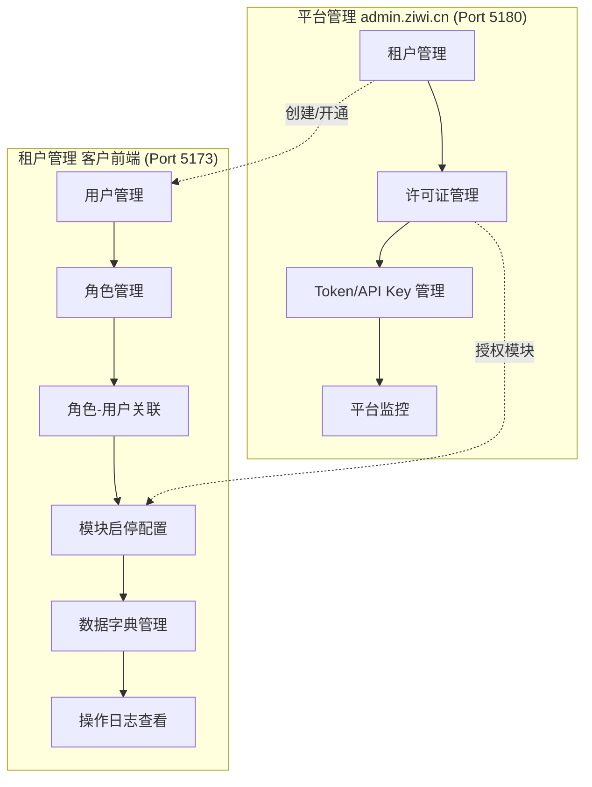
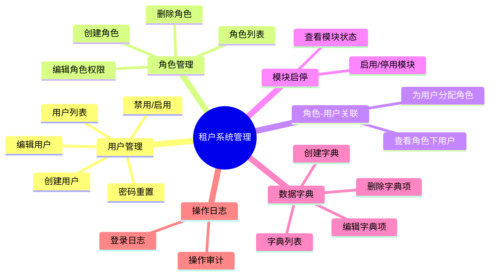
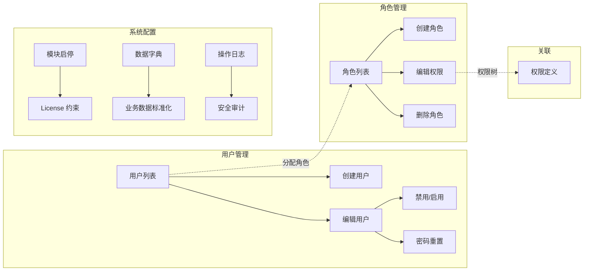
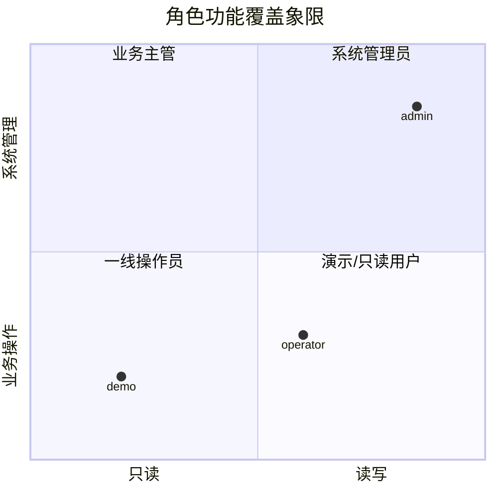

# 租户系统管理设计文档

> 本文档分析当前知微 SaaS 系统中系统管理职责的混淆问题，明确定义平台管理层与租户管理层的边界，并规划租户系统管理员的完整功能集。

---

## 1. 现状分析

### 1.1 系统配置页的职责错位

当前客户前端（`localhost:5173`）`/system/config` 页面被命名为"系统配置"，但实际内容为：

- **应用信息**：应用名称、版本号、数据库类型、租户 ID
- **模块状态**：各业务模块的启用状态列表（硬编码，仅展示性）
- **API 状态**：接口统计信息（展示性、静态数据）

这三个板块既不涉及平台级运营管理（租户、许可证、Token），也不是真正的租户级系统管理（用户、角色、权限）。该页面当前处于**信息展示而非管理操作**的定位尴尬区。

### 1.2 平台管理 vs 租户管理的混淆

| 混淆点 | 现状 | 问题 |
|--------|------|------|
| 许可证展示 | 客户前端 `/system/license` 以硬编码方式展示许可证信息 | 许可证应由平台管理后台统一发放，租户仅需在开通时知晓详情，无需单独查看页 |
| 模块状态 | 客户前端 `SystemConfig.vue` 展示模块 enabled 状态 | 模块授权状态是平台颁发 license 的结果，租户不应在此查看（应通过 license 信息间接获得） |
| API 状态统计 | 客户前端展示 API 端点数、测试通过率等 | 这些属于平台运维/开发视角，不属于租户系统管理员的关注范围 |

### 1.3 关键缺失：租户级管理 UI 全部未实现

后端 API **已完整实现**以下租户级管理能力：

```yaml
用户管理:  GET/POST/PUT/DELETE  /api/v1/users          # 完整 CRUD
角色管理:  GET/POST/PUT/DELETE  /api/v1/roles           # 完整 CRUD
角色权限:  GET/PUT              /api/v1/roles/{id}/permissions  # 权限分配
角色用户:  GET/POST             /api/v1/roles/{id}/users       # 用户关联
数据字典:  GET/POST/PUT/DELETE  /api/v1/dictionaries/*  # 完整 CRUD
```

但客户前端**没有任何对应 UI** — 这些能力完全不可被租户管理员使用。

### 1.4 菜单与权限现状

- 左侧菜单在 `MainLayout.vue` 中通过静态数组 `allMenuTree` 定义（8 个分组，13 个子项）
- 菜单渲染无任何权限过滤：`const menuTree = computed(() => allMenuTree)`
- 路由 `router/index.ts` 仅在 beforeEach 中检查 token 是否存在，无角色/权限守卫
- 用户登录后 `user_info` 中已包含 `roles` 数组，但前端未使用该数据做任何权限判断
- 种子数据已有两个角色：`admin`（系统管理员）、`operator`（操作员）

---

## 2. 分层职责定义（核心）



### 职责边界表

| 层面 | 入口 | 目标用户 | 功能范围 | 管理粒度 |
|------|------|---------|---------|---------|
| **平台管理** | `admin.ziwi.cn` (Port 5180) | 平台运营人员 / 超管 | 租户全生命周期管理、许可证发放与续期、API Key 发放与吊销、平台健康监控、全局数据统计 | 跨租户、全局级别 |
| **租户管理** | 客户前端 `localhost:5173` | 租户系统管理员 | 本租户用户/角色/权限管理、模块启停配置、数据字典维护、操作日志审计 | 单租户、本租户级别 |

### 分层原则

1. **平台管理不干涉租户内部**：平台负责"谁可以用这个系统"（租户开通、授权），不负责"租户内部谁做什么"（用户、角色）
2. **租户管理不越权**：租户管理员只能管理本租户的资源（用户、角色、字典），不能看到其他租户的数据
3. **许可证作为纽带**：平台通过 license 控制租户可用模块，租户管理员在授权范围内决定内部是否启用

---

## 3. 租户系统管理功能规划

### 3.1 功能全景图



### 3.2 功能详情表

| 功能模块 | 功能描述 | 对应后端 API | 新页面 | 优先级 |
|---------|---------|-------------|-------|--------|
| **用户管理-列表** | 分页展示本租户用户列表，支持搜索、按状态筛选 | `GET /api/v1/users` ✅ 已有 | 是 | **P0** |
| **用户管理-创建** | 新建用户（用户名、密码、姓名、邮箱、手机、角色选择） | `POST /api/v1/users` ✅ 已有 | 是 | **P0** |
| **用户管理-编辑** | 编辑用户基本信息 | `PUT /api/v1/users/{id}` ✅ 已有 | 是 | **P0** |
| **用户管理-禁用/启用** | 切换用户状态（active/disabled） | `PUT /api/v1/users/{id}` ✅ 已有 | 复用编辑 | **P0** |
| **用户管理-密码重置** | 管理员重置用户密码 | `PUT /api/v1/users/{id}`（或新增独立重置接口） | 复用编辑 | **P1** |
| **角色管理-列表** | 分页展示本租户角色列表 | `GET /api/v1/roles` ✅ 已有 | 是 | **P0** |
| **角色管理-创建** | 创建角色（名称、编码、描述） | `POST /api/v1/roles` ✅ 已有 | 是 | **P0** |
| **角色管理-编辑权限** | 以树形/列表方式勾选权限，保存到角色 | `GET/PUT /api/v1/roles/{id}/permissions` ✅ 已有 | 是 | **P0** |
| **角色管理-删除** | 删除角色（非系统内置角色） | `DELETE /api/v1/roles/{id}` ✅ 已有 | 复用列表 | **P1** |
| **角色-用户关联** | 查看角色下用户 / 添加用户到角色 | `GET/POST /api/v1/roles/{id}/users` ✅ 已有 | 是（或集成到角色详情） | **P1** |
| **模块启停配置** | 查看本租户已授权模块列表，手动启用/停用 | 需新增 `PUT /api/v1/tenant/modules` | 是 | **P1** |
| **数据字典-列表** | 分页展示字典类型列表 | `GET /api/v1/dictionaries` ✅ 已有 | 是 | **P1** |
| **数据字典-详情** | 查看字典项列表（code/value/sort） | `GET /api/v1/dictionaries/code/{code}/items` ✅ 已有 | 是 | **P1** |
| **数据字典-维护** | 创建/编辑/删除字典项 | `POST/PUT/DELETE` ✅ 已有 | 是 | **P1** |
| **操作日志** | 查看本租户用户的操作审计日志 | 需新增日志查询 API | 是 | **P2** |

### 3.3 功能关系图



---

## 4. 角色与菜单权限矩阵

### 4.1 权限模型

当前按"角色 → 可见菜单"的粗粒度模型，后续可扩展为"角色 → 权限集合 → 菜单 + API 操作"的细粒度模型。

### 4.2 菜单可见性矩阵

| 角色 | 可见分组 | 可见子菜单 | 说明 |
|------|---------|-----------|------|
| **系统管理员 (admin)** | 全部 8 组 | 全部 13 个子项 | 完整权限，含系统管理 |
| **操作员 (operator)** | 首页、生产管理 | 驾驶舱、工单管理、报工管理 | 一线操作，无管理入口 |
| **演示用户 (demo)** | 首页 | 仅驾驶舱（只读） | 仅浏览，无操作入口 |
| **自定义角色** | 按权限分配 | 按权限分配 | 动态组合 |

### 4.3 详细矩阵

| 菜单分组 | 菜单子项 | admin | operator | demo |
|---------|---------|:-----:|:--------:|:----:|
| **首页** | 驾驶舱 | ✅ | ✅ | ✅ |
| | 车间大屏 | ✅ | ❌ | ❌ |
| **生产管理** | 工单管理 | ✅ | ✅ | ❌ |
| | 报工管理 | ✅ | ✅ | ❌ |
| | 生产报表 | ✅ | ❌ | ❌ |
| | 生产排产 | ✅ | ❌ | ❌ |
| **设备管理** | 设备管理 | ✅ | ❌ | ❌ |
| **安灯管理** | 安灯管理 | ✅ | ❌ | ❌ |
| **品质管理** | 品质管理 | ✅ | ❌ | ❌ |
| **能碳管理** | 能碳管理 | ✅ | ❌ | ❌ |
| **数据采集** | 数据采集 | ✅ | ❌ | ❌ |
| **系统管理** | 系统配置 → *（改造为租户管理首页）* | ✅ | ❌ | ❌ |
| | 用户管理 *（新增）* | ✅ | ❌ | ❌ |
| | 角色管理 *（新增）* | ✅ | ❌ | ❌ |
| | 数据字典 *（新增）* | ✅ | ❌ | ❌ |

### 4.4 权限象限图



---

## 5. 实施方案

### 5.1 需要新增的前端页面

| 页面 | 路由 | 对应菜单入口 | 优先级 |
|------|------|------------|--------|
| 租户管理首页（替代系统配置） | `/system/overview` | 系统管理 → 系统概览 | **P0** |
| 用户管理列表 | `/system/users` | 系统管理 → 用户管理 | **P0** |
| 用户创建/编辑（弹窗或页面） | `/system/users/create` + `/system/users/:id/edit` | 从用户列表跳转 | **P0** |
| 角色管理列表 | `/system/roles` | 系统管理 → 角色管理 | **P0** |
| 角色权限编辑 | `/system/roles/:id/permissions` | 从角色列表跳转 | **P0** |
| 数据字典列表 | `/system/dictionaries` | 系统管理 → 数据字典 | **P1** |
| 字典项管理 | `/system/dictionaries/:id/items` | 从字典列表跳转 | **P1** |
| 模块启停配置 | `/system/modules` | 系统管理 → 模块配置 | **P1** |
| 操作日志 | `/system/audit-logs` | 系统管理 → 操作日志 | **P2** |

### 5.2 系统管理菜单结构调整

当前系统管理分组有 2 个子项，改造后变为：

```yaml
系统管理（admin 可见）:
  - 系统概览    /system/overview       # 替代原 SystemConfig，展示租户基本信息
  - 用户管理    /system/users           # 新增
  - 角色管理    /system/roles           # 新增
  - 数据字典    /system/dictionaries    # 新增
  - 模块配置    /system/modules         # 新增（P1）
  - 操作日志    /system/audit-logs      # 新增（P2）
```

> 注意：原 `/system/license` 许可证页建议移除，许可证信息合并到"系统概览"页底部展示（只读，数据来源为 license API）。

### 5.3 菜单动态渲染技术方案

#### 方案选型：基于角色名称的过滤

当前阶段推荐**基于角色名称的简单过滤**，后续扩展为**基于权限编码的细粒度控制**。

**代码改动要点：**

1. **MainLayout.vue** — 从 `allMenuTree` 改为计算属性，根据用户角色动态过滤

```typescript
// 替换：const menuTree = computed(() => allMenuTree)
// 改为：
const authStore = useAuthStore()

const menuTree = computed(() => {
  const user = authStore.user
  if (!user?.roles?.length) return []
  
  const roleCodes = user.roles.map(r => r.code)
  
  // 系统管理员：完整菜单
  if (roleCodes.includes('admin')) return allMenuTree
  
  // 操作员：仅首页 + 生产管理（工单+报工）
  if (roleCodes.includes('operator')) {
    return allMenuTree.filter(g => ['home', 'production'].includes(g.id))
      .map(g => {
        if (g.id === 'home') return g  // 首页全保留
        if (g.id === 'production') {
          return {
            ...g,
            children: g.children?.filter(c =>
              ['work_orders', 'work_reports'].includes(c.id)
            )
          }
        }
        return g
      })
  }
  
  // 演示用户：仅驾驶舱
  if (roleCodes.includes('demo')) {
    return allMenuTree.filter(g => g.id === 'home')
      .map(g => ({
        ...g,
        children: g.children?.filter(c => c.id === 'cockpit')
      }))
  }
  
  // 默认：无菜单
  return []
})
```

2. **路由守卫** — 在 `router/index.ts` 的 beforeEach 中增加角色校验

```typescript
router.beforeEach((to, from, next) => {
  const token = localStorage.getItem('access_token')
  if (to.path !== '/login' && !token) return '/login'
  
  // 新增：检查系统管理页面的权限
  if (to.path.startsWith('/system/')) {
    const userInfo = localStorage.getItem('user_info')
    if (userInfo) {
      const user = JSON.parse(userInfo)
      const roles = user.roles || []
      const isAdmin = roles.some((r: any) => r.code === 'admin')
      if (!isAdmin) return '/'  // 非管理员访问系统管理 => 跳首页
    }
  }
})
```

3. **后续扩展：权限编码方案**

当需要细粒度到 API 级别时，定义权限编码表：

```typescript
// permission-codes.ts
export const PERMISSIONS = {
  USER_CREATE: 'user:create',
  USER_EDIT: 'user:edit',
  USER_DELETE: 'user:delete',
  USER_DISABLE: 'user:disable',
  ROLE_CREATE: 'role:create',
  ROLE_EDIT: 'role:edit',
  ROLE_DELETE: 'role:delete',
  DICT_MANAGE: 'dict:manage',
  MODULE_CONFIG: 'module:config',
  // ... 按 module:action 命名
}
```

### 5.4 建议开发顺序

| 阶段 | 内容 | 工作量估算 |
|------|------|-----------|
| **Phase 1 — 基础框架** | 菜单动态渲染（角色过滤）+ 路由守卫 + 系统管理重定向（`/system/config` → `/system/overview`） | 1-2 天 |
| **Phase 2 — 用户管理** | 用户列表页 + 创建/编辑弹窗 + 禁用/启用 + 密码重置（与角色选择联动） | 3-4 天 |
| **Phase 3 — 角色管理** | 角色列表页 + 创建弹窗 + 权限编辑页（勾选树） + 删除 | 3-4 天 |
| **Phase 4 — 角色-用户关联** | 角色详情下的用户列表 + 添加/移除用户 | 1-2 天 |
| **Phase 5 — 数据字典** | 字典列表 + 字典项管理（嵌套增删改） | 2-3 天 |
| **Phase 6 — 模块配置** | 模块启停配置页 + 对接 License 数据 | 2 天 |
| **Phase 7 — 操作日志** | 日志查询页 + 后端审计日志收集 | 2-3 天 |

---

## 6. 待确认问题

### Q1：系统配置页拆分的边界

当前 `/system/config` 的信息性内容（应用名称、版本号）在新体系下归属何处？建议方案：
- **方案 A**：归入"系统概览"新页 `/system/overview` 的顶部展示区
- **方案 B**：去除这些展示性内容，仅保留管理操作功能

**请决策：采用方案 A 还是方案 B？**

### Q2：操作员是否需要看到"生产报表"和"生产排产"？

当前种子数据中 operator（操作员）的定义主体是一线执行角色。但如果客户工厂排产员也使用同一系统，是否需要细分"排产员"角色，或直接将排产/报表权限开放给 operator？

**请决策：operator 的可见范围是仅工单+报工，还是包含报表+排产？**

### Q3：密码重置的实现方式

后端当前 `PUT /api/v1/users/{id}` 的 `UpdateUserRequest` schema 是否包含 password 字段？如不包含，需要：
- 新增独立接口 `PUT /api/v1/users/{id}/reset-password`
- 或在更新接口中增加 password 字段支持

**请确认：是否需要后端配合新增密码重置接口？**

### Q4：演示用户 (demo) 角色的数据处理

演示用户"仅查看"的需求涉及后端数据权限。菜单层面虽好控制，但后端 API 层面是否需要对 demo 角色做**只读拦截**（拒绝 POST/PUT/DELETE 操作）？

**请决策：demo 角色的只读限制在后端 API 层是否已实现，还是仅前端控制即可？**
