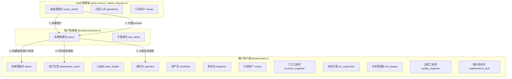

# 三端角色-功能全平台统一矩阵文档

> **文档编号**：ZIWI-MATRIX-v1.0  
> **文档状态**：定稿  
> **适用范围**：知微云 SaaS 制造执行系统全平台（SaaS管理端/租户管理端/租户用户端）  
> **编制人**：Alice（产品经理）

---

## 第1章 三端整体架构概述

### 1.1 三端定位

知微 ziwi SaaS 平台采用**三端分离**架构，每端的用户群体、访问入口和职责各不相同：

| 端 | 访问域名 | 目标用户 | 职责范围 |
|:--:|:---------|:---------|:---------|
| **SaaS管理端** | `admin.ziwi.cn`（→ 制造线 `admin.mfg.ziwi.cn`） | 知微平台运营团队 | 管理所有租户生命周期（开通/停用/许可证）、平台监控、数据看板、Token/API Key 管理 |
| **租户管理端** | `{tenant}.cloud.ziwi.cn` 或 `manage.mfg.ziwi.cn` | 租户主账号/admin | 管理租户内部的组织架构、用户、角色、权限、字典、模块启停、操作日志审计 |
| **租户用户端** | `{tenant}.cloud.ziwi.cn` 或 `mfg.ziwi.cn` | 租户所有业务用户 | 日常生产执行、品质管理、设备管理、安灯管理、能碳管理、仓储管理等全业务操作 |

### 1.2 三端数据流与权限继承关系



**关键权限原则**：

1. **完全隔离**：SaaS管理端角色 ≠ 租户侧角色，两者是完全独立的角色体系
2. **租户管理端 admin = 租户用户端 admin**：同一用户在不同菜单区域操作，共享同一身份
3. **SaaS管理端只管理租户级操作**：不介入租户内部组织架构和业务数据
4. **租户管理端负责基础数据配置**：组织/用户/角色/字典/模块，为租户用户端提供运行基础
5. **租户用户端负责业务执行**：所有生产制造业务操作在此端完成

### 1.3 整体角色体系总览

| 所属端 | 角色编码 | 角色名称 | 数据作用域 | 是否系统保护 |
|:------:|:---------|:---------|:----------:|:------------:|
| **SaaS管理端** | `super_admin` | 超级管理员 | 全平台 | ⚠️ 不可删除 |
| | `operations` | 运营人员 | 租户管理+License | ❌ |
| | `viewer` | 只读用户 | 仅查看 | ❌ |
| **租户管理端** | `admin` | 系统管理员 | ALL（全租户） | ⚠️ 不可删除/降权 |
| | `org_admin` | 子管理员 | DEPT_CHILD（可选） | ❌ |
| | `key_user` | 关键用户 | DEPT_CHILD（可选） | ❌ |
| **租户用户端** | `admin` | 系统管理员 | ALL | ⚠️ 不可删除/降权 |
| | `department_head` | 部门主管 | DEPT_CHILD | ✅ 可修改 |
| | `team_leader` | 小组长 | DEPT | ✅ 可修改 |
| | `operator` | 操作员 | SELF | ✅ 可修改 |
| | `scheduler` | 排产员 | DEPT_CHILD | ✅ 可修改 |
| | `inspector` | 质检员 | DEPT | ✅ 可修改 |
| | `viewer` | 只读用户 | DEPT | ✅ 可修改 |
| | `process_engineer` | 工艺工程师 | DEPT | ✅ 可修改 |
| | `wh_supervisor` | 仓库主管 | DEPT_CHILD | ✅ 可修改 |
| | `wh_keeper` | 仓库管理员 | DEPT | ✅ 可修改 |
| | `quality_engineer` | 品质工程师 | DEPT | ✅ 可修改 |
| | `maintenance_tech` | 维护技术员 | DEPT | ✅ 可修改 |

---

## 第2章 SaaS管理端 — Platform Admin（admin.ziwi.cn / admin.mfg.ziwi.cn）

### 2.1 角色定义

| 角色编码 | 角色名称 | 职责描述 | 页面访问范围 |
|:--------:|:---------|:---------|:------------|
| `super_admin` | 超级管理员 | 平台全功能操作，含平台配置和系统参数 | 全部页面 |
| `operations` | 运营人员 | 租户管理+License 管理+Token 管理，无平台配置 | 租户管理、License、Token、平台监控（查看） |
| `viewer` | 只读用户 | 仅查看租户列表和平台监控，不可编辑 | 租户列表（只读）、平台监控（只读） |

### 2.2 功能模块分解

#### 2.2.1 平台概览与产品选择

| 功能ID | 功能名称 | 功能描述 | super_admin | operations | viewer |
|:------:|:---------|:---------|:-----------:|:----------:|:------:|
| SA-01 | 登录认证 | 平台运营人员登录 admin.ziwi.cn，后台账号认证 | ✅ | ✅ | ✅ |
| SA-02 | 产品选择首页 | 登录后 Dashboard 展示多产品线选择（知微云/教育等），点击进入对应管理后台 | ✅ | ✅ | ✅ |
| SA-03 | 知微云管理首页 | CloudDashboard 展示知微云产品线概要信息、租户总数、运行状态等 | ✅ | ✅ | ✅ |

#### 2.2.2 租户管理

| 功能ID | 功能名称 | 功能描述 | super_admin | operations | viewer |
|:------:|:---------|:---------|:-----------:|:----------:|:------:|
| SA-04 | 租户列表查看 | 分页展示所有租户，按名称/状态/创建时间筛选，查看租户详情 | ✅ | ✅ | ✅ |
| SA-05 | 创建租户 | 开通新租户，填写租户名称/编码/域名前缀/联系人/联系方式，自动创建根组织和主账号 | ✅ | ✅ | ❌ |
| SA-06 | 编辑租户 | 修改租户基础信息（名称/联系人/备注等） | ✅ | ✅ | ❌ |
| SA-07 | 启用租户 | 将已停用租户恢复为启用状态 | ✅ | ✅ | ❌ |
| SA-08 | 停用租户 | 停用租户，停用后所有用户无法登录，业务数据保留 | ✅ | ✅ | ❌ |
| SA-09 | 删除租户 | 删除租户（软删除），需确认无有效 License 和运行中的业务 | ✅ | ❌ | ❌ |

#### 2.2.3 License 管理

| 功能ID | 功能名称 | 功能描述 | super_admin | operations | viewer |
|:------:|:---------|:---------|:-----------:|:----------:|:------:|
| SA-10 | License 列表查看 | 分页展示所有 License 记录，按租户/状态/到期时间筛选 | ✅ | ✅ | ❌ |
| SA-11 | 创建 License | 为指定租户创建 License，选择授权模块、用户数上限、有效期 | ✅ | ✅ | ❌ |
| SA-12 | License 续期 | 为已有 License 延长有效期 | ✅ | ✅ | ❌ |
| SA-13 | License 升级 | 升级 License 授权模块范围或用户数上限 | ✅ | ✅ | ❌ |
| SA-14 | 吊销 License | 吊销租户 License，吊销后对应模块功能不可用 | ✅ | ✅ | ❌ |
| SA-15 | License 审计 | 查看 License 使用情况统计（激活数/剩余数/即将到期列表） | ✅ | ✅ | ❌ |

#### 2.2.4 Token/API Key 管理

| 功能ID | 功能名称 | 功能描述 | super_admin | operations | viewer |
|:------:|:---------|:---------|:-----------:|:----------:|:------:|
| SA-16 | API Key 列表查看 | 分页展示所有 API Key，按租户/状态/创建时间筛选 | ✅ | ✅ | ❌ |
| SA-17 | 创建 API Key | 为租户创建 API Key，设置权限范围和有效期 | ✅ | ✅ | ❌ |
| SA-18 | 吊销 API Key | 吊销指定 API Key，吊销后该 Key 不可使用 | ✅ | ✅ | ❌ |
| SA-19 | API Key 审计 | 查看 API Key 调用记录和使用统计 | ✅ | ✅ | ❌ |

#### 2.2.5 平台监控

| 功能ID | 功能名称 | 功能描述 | super_admin | operations | viewer |
|:------:|:---------|:---------|:-----------:|:----------:|:------:|
| SA-20 | 系统运行状态 | 展示平台整体运行状态（服务健康/数据库连接/缓存状态等） | ✅ | ✅ | ✅ |
| SA-21 | 资源使用监控 | 展示 CPU/内存/磁盘/网络等资源使用情况 | ✅ | ✅ | ✅ |
| SA-22 | 租户资源排行 | 按资源消耗排行展示 Top N 租户 | ✅ | ✅ | ✅ |
| SA-23 | 告警管理 | 查看/确认/处理平台告警（服务异常/资源超限等） | ✅ | ✅ | ✅ |
| SA-24 | 告警规则配置 | 配置监控告警阈值和通知方式 | ✅ | ❌ | ❌ |

#### 2.2.6 平台配置

| 功能ID | 功能名称 | 功能描述 | super_admin | operations | viewer |
|:------:|:---------|:---------|:-----------:|:----------:|:------:|
| SA-25 | 全局参数配置 | 配置平台级全局参数（登录策略/会话超时等） | ✅ | ❌ | ❌ |
| SA-26 | SMTP 配置 | 配置邮件服务器参数（发件地址/SMTP 服务器/端口/认证信息） | ✅ | ❌ | ❌ |
| SA-27 | 短信通道配置 | 配置短信服务商参数（AccessKey/Secret/SignName） | ✅ | ❌ | ❌ |
| SA-28 | 平台品牌配置 | 配置平台 Logo/名称/登录页背景等品牌信息 | ✅ | ❌ | ❌ |

#### 2.2.7 操作日志

| 功能ID | 功能名称 | 功能描述 | super_admin | operations | viewer |
|:------:|:---------|:---------|:-----------:|:----------:|:------:|
| SA-29 | 平台操作日志 | 查看平台层所有操作审计记录（租户创建/停用/License 变更等） | ✅ | ✅ | ✅ |
| SA-30 | 操作日志导出 | 按筛选条件导出操作日志（Excel/CSV） | ✅ | ✅ | ✅ |

---

## 第3章 租户管理端 — Tenant Admin（{tenant}.ziwi.cn/system）

### 3.1 角色定义

| 角色编码 | 角色名称 | 数据作用域 | 适用岗位 | 是否系统保护 |
|:--------:|:---------|:----------:|:---------|:------------:|
| `admin` | 系统管理员（主账号） | ALL | 租户主账号/IT 主管 | ⚠️ 不可删除/降权 |
| `org_admin` | 子管理员（可选新增） | DEPT_CHILD | 子部门管理员 | ❌ 可修改/删除 |

> **说明**：租户管理端 `admin` 与租户用户端 `admin` 为**同一用户身份**，只是访问的菜单区域不同。租户用户端 admin 角色拥有 `system:access` 权限，因此可在顶部导航切换到租户管理端。

### 3.2 功能模块分解

#### 3.2.1 系统概览

| 功能ID | 功能名称 | 功能描述 | admin | org_admin |
|:------:|:---------|:---------|:-----:|:---------:|
| TA-01 | 租户信息展示 | 展示租户名称/编码/版本/创建时间/主账号信息 | ✅ | ✅ |
| TA-02 | 组织模块摘要 | 展示组织树高度、总用户数、角色数 | ✅ | ✅ |
| TA-03 | 模块状态摘要 | 展示各模块授权状态和启停状态 | ✅ | ✅ |
| TA-04 | 系统版本信息 | 展示当前系统版本号和最近更新时间 | ✅ | ✅ |

#### 3.2.2 组织架构管理

| 功能ID | 功能名称 | 功能描述 | admin | org_admin |
|:------:|:---------|:---------|:-----:|:---------:|
| TA-05 | 组织树查看 | 树形展示租户内部组织层级（租户根→部门→车间→班组），支持展开/折叠 | ✅ | ✅ |
| TA-06 | 创建子组织 | 在指定父节点下创建子组织，填写名称/编码/排序号/描述 | ✅ | ✅ |
| TA-07 | 编辑组织 | 修改组织节点名称/编码/排序号/启用状态 | ✅ | ✅ |
| TA-08 | 拖拽移动 | 通过拖拽变更组织节点的父级归属和同级排序，自动重建物化路径 | ✅ | ❌ |
| TA-09 | 删除组织 | 删除无子节点和无关联用户的组织节点 | ✅ | ✅ |
| TA-10 | 组织编码管理 | 为每个组织节点设置唯一编码，支持编码重复校验 | ✅ | ✅ |
| TA-11 | 组织启用/禁用 | 切换组织节点的启用/禁用状态，禁用后下级组织不可用 | ✅ | ✅ |

#### 3.2.3 用户管理

| 功能ID | 功能名称 | 功能描述 | admin | org_admin |
|:------:|:---------|:---------|:-----:|:---------:|
| TA-12 | 用户列表查看 | 分页展示用户列表，按用户名/姓名/组织/状态筛选搜索，含组织路径和角色信息 | ✅ | ✅ |
| TA-13 | 创建用户 | 填写用户名/密码/姓名/邮箱/手机/归属组织（组织选择器），分配角色（多选），记录操作审计 | ✅ | ✅ |
| TA-14 | 编辑用户 | 修改用户基础信息、变更组织归属、变更角色分配 | ✅ | ✅ |
| TA-15 | 禁用用户 | 禁用用户账号，禁用后无法登录 | ✅ | ✅ |
| TA-16 | 启用用户 | 恢复已禁用用户 | ✅ | ✅ |
| TA-17 | 重置密码 | 重置用户登录密码，强制下次登录修改 | ✅ | ✅ |
| TA-18 | 删除用户 | 删除用户账号（非物理删除，标记为删除状态） | ✅ | ❌ |
| TA-19 | 批量导入用户 | 通过 Excel 模板批量导入用户（含组织归属和角色分配） | ✅ | ✅ |
| TA-20 | 批量导出用户 | 将用户列表导出为 Excel（含组织路径和角色信息） | ✅ | ✅ |

#### 3.2.4 角色管理

| 功能ID | 功能名称 | 功能描述 | admin | org_admin |
|:------:|:---------|:---------|:-----:|:---------:|
| TA-21 | 角色列表查看 | 分页展示角色列表，区分系统内置角色（不可删除）和自定义角色（可删除） | ✅ | ✅ |
| TA-22 | 创建角色 | 填写角色名称/编码/描述，勾选权限编码树（按模块分组），选择数据作用域级别 | ✅ | ❌ |
| TA-23 | 编辑角色权限 | 树形勾选权限编码，已选/未选/半选状态清晰可辨 | ✅ | ❌ |
| TA-24 | 设置数据作用域 | 为角色选择数据作用域级别（SELF/DEPT/DEPT_CHILD/ALL） | ✅ | ❌ |
| TA-25 | 删除角色 | 删除自定义角色（已分配用户的角色给出警告），系统角色不可删除 | ✅ | ❌ |
| TA-26 | 角色-用户关联查看 | 在角色详情中查看已关联用户列表 | ✅ | ✅ |
| TA-27 | 为用户分配角色 | 在角色详情中添加/移除用户 | ✅ | ✅ |

#### 3.2.5 数据字典

| 功能ID | 功能名称 | 功能描述 | admin | org_admin |
|:------:|:---------|:---------|:-----:|:---------:|
| TA-28 | 字典类型列表 | 分页展示字典类型（工单类型/报工类型/安灯类型/试产类型等） | ✅ | ✅ |
| TA-29 | 创建字典类型 | 创建字典类型编码和名称 | ✅ | ❌ |
| TA-30 | 编辑字典类型 | 修改字典类型信息 | ✅ | ❌ |
| TA-31 | 删除字典类型 | 删除未被业务引用的字典类型 | ✅ | ❌ |
| TA-32 | 字典项列表 | 在字典类型下查看所有字典项（编码/名称/排序号/启用状态） | ✅ | ✅ |
| TA-33 | 添加字典项 | 在字典类型下添加字典项 | ✅ | ✅ |
| TA-34 | 编辑字典项 | 修改字典项信息 | ✅ | ✅ |
| TA-35 | 删除字典项 | 删除未被引用的字典项 | ✅ | ✅ |
| TA-36 | 字典项排序 | 调整字典项排序 | ✅ | ✅ |
| TA-37 | 引用查询 | 查询某字典项被哪些业务模块引用 | ✅ | ✅ |

#### 3.2.6 模块配置

| 功能ID | 功能名称 | 功能描述 | admin | org_admin |
|:------:|:---------|:---------|:-----:|:---------:|
| TA-38 | 模块列表查看 | 展示已授权模块列表（含模块名称/编码/版本/当前状态） | ✅ | ✅ |
| TA-39 | 模块启用/停用 | 切换模块启用/停用状态，影响前端菜单可见性和后端 API 访问 | ✅ | ❌ |
| TA-40 | 模块排序 | 调整模块在菜单中的显示顺序 | ✅ | ❌ |
| TA-41 | 模块版本管理 | 查看模块版本号和更新记录 | ✅ | ❌ |

#### 3.2.7 操作日志审计

| 功能ID | 功能名称 | 功能描述 | admin | org_admin |
|:------:|:---------|:---------|:-----:|:---------:|
| TA-42 | 操作日志查询 | 分页查询用户操作审计记录，按操作人/操作类型/时间筛选 | ✅ | ✅ |
| TA-43 | 登录日志查询 | 查看用户登录记录（登录时间/IP/设备/结果） | ✅ | ✅ |
| TA-44 | 敏感操作标记 | 密码重置/用户禁用/角色删除等敏感操作特殊高亮标记 | ✅ | ✅ |
| TA-45 | 操作日志导出 | 按筛选条件导出审计日志（Excel/CSV） | ✅ | ✅ |

#### 3.2.8 个人中心

| 功能ID | 功能名称 | 功能描述 | admin | org_admin |
|:------:|:---------|:---------|:-----:|:---------:|
| TA-46 | 修改密码 | 修改当前登录用户的登录密码 | ✅ | ✅ |
| TA-47 | 基本信息查看 | 查看当前用户的基本信息（用户名/姓名/邮箱/手机/归属组织/角色） | ✅ | ✅ |
| TA-48 | 安全设置 | 设置 MFA 双因素认证、登录 IP 限制等安全策略 | ✅ | ✅ |
| TA-49 | 登录历史 | 查看本人的登录历史记录 | ✅ | ✅ |

---

## 第4章 租户用户端 — Tenant User（{tenant}.ziwi.cn）

### 4.1 角色总览

| 角色编码 | 角色名称 | 数据作用域 | 适用岗位 | 职责简述 |
|:--------:|:---------|:----------:|:---------|:---------|
| `admin` | 系统管理员 | ALL | 租户主账号 | 全权限，包含系统管理区和所有业务模块 |
| `key_user` | 关键用户 | DEPT_CHILD | 业务模块负责人 | 模块级全功能操作与审批，可跨部门管理授权模块 |
| `department_head` | 部门主管 | DEPT_CHILD | 部门经理/车间主任 | 本部门及下级所有数据的管理、审批与查看 |
| `team_leader` | 小组长 | DEPT | 班组长 | 本班组及直属子组数据的操作与审批 |
| `operator` | 操作员 | SELF | 一线工人 | 工单执行、报工、安灯呼叫等本人操作 |
| `scheduler` | 排产员 | DEPT_CHILD | 计划员 | 排产计划编制与调整、工单管理 |
| `inspector` | 质检员 | DEPT | 品质检验员 | 检验执行、判定、记录管理 |
| `viewer` | 只读用户 | DEPT | 演示/参观 | 仅查看各模块数据，不可操作 |
| `process_engineer` | 工艺工程师 | DEPT | 工艺人员 | 产品/BOM/工艺路线/工序等基础数据维护 |
| `wh_supervisor` | 仓库主管 | DEPT_CHILD | 仓库经理 | 仓库配置、入库/出库审核、盘点审批、预警管理 |
| `wh_keeper` | 仓库管理员 | DEPT | 仓管员 | PDA/PC 现场执行入库/出库/盘点/移库操作 |
| `quality_engineer` | 品质工程师 | DEPT | SPC 分析 | 品质数据分析、SPC 控制图、质量改进 |
| `maintenance_tech` | 维护技术员 | DEPT | 设备维护 | 执行设备保养/维修任务、备件领用 |

### 4.2 功能模块矩阵（M01-M20）

#### 4.2.1 M01 产品管理

| 功能点 | 功能子项 | admin | dept_head | team_leader | operator | scheduler | inspector | viewer | process_eng | wh_supervisor | wh_keeper | quality_eng | maintenance_tech |
|:------:|:--------:|:-----:|:---------:|:-----------:|:--------:|:---------:|:---------:|:------:|:-----------:|:------------:|:---------:|:-----------:|:---------------:|
| **产品列表** | 分页展示产品列表 | ✅ | ✅ | ❌ | ❌ | ❌ | ❌ | ✅ | ✅ | ❌ | ❌ | ❌ | ❌ |
| | 按编码/名称模糊搜索 | ✅ | ✅ | ❌ | ❌ | ❌ | ❌ | ✅ | ✅ | ❌ | ❌ | ❌ | ❌ |
| | 按类型/分类/状态筛选 | ✅ | ✅ | ❌ | ❌ | ❌ | ❌ | ✅ | ✅ | ❌ | ❌ | ❌ | ❌ |
| | 查看产品基础信息 | ✅ | ✅ | ❌ | ❌ | ❌ | ❌ | ✅ | ✅ | ❌ | ❌ | ❌ | ❌ |
| **创建产品** | 填写产品编码/名称/规格/单位/类型 | ✅ | ❌ | ❌ | ❌ | ❌ | ❌ | ❌ | ✅ | ❌ | ❌ | ❌ | ❌ |
| | 设置产品分类/重量/图纸附件 | ✅ | ❌ | ❌ | ❌ | ❌ | ❌ | ❌ | ✅ | ❌ | ❌ | ❌ | ❌ |
| **编辑产品** | 修改产品基础信息 | ✅ | ❌ | ❌ | ❌ | ❌ | ❌ | ❌ | ✅ | ❌ | ❌ | ❌ | ❌ |
| **删除产品** | 删除产品（有关联工单时禁止删除） | ✅ | ❌ | ❌ | ❌ | ❌ | ❌ | ❌ | ❌ | ❌ | ❌ | ❌ | ❌ |
| **产品详情** | 查看完整产品信息含 BOM 清单 | ✅ | ✅ | ❌ | ❌ | ❌ | ❌ | ✅ | ✅ | ❌ | ❌ | ❌ | ❌ |
| | 查看关联工艺路线 | ✅ | ✅ | ❌ | ❌ | ❌ | ❌ | ✅ | ✅ | ❌ | ❌ | ❌ | ❌ |

#### 4.2.2 M02 BOM 管理

| 功能点 | 功能子项 | admin | dept_head | team_leader | operator | scheduler | inspector | viewer | process_eng | wh_supervisor | wh_keeper | quality_eng | maintenance_tech |
|:------:|:--------:|:-----:|:---------:|:-----------:|:--------:|:---------:|:---------:|:------:|:-----------:|:------------:|:---------:|:-----------:|:---------------:|
| **BOM 清单查看** | 在产品详情中查看 BOM 物料清单 | ✅ | ✅ | ❌ | ❌ | ❌ | ❌ | ✅ | ✅ | ❌ | ❌ | ❌ | ❌ |
| | 按物料类型/工序筛选 | ✅ | ✅ | ❌ | ❌ | ❌ | ❌ | ✅ | ✅ | ❌ | ❌ | ❌ | ❌ |
| **BOM 物料添加** | 添加物料到 BOM，填写用量/单位/损耗率 | ✅ | ❌ | ❌ | ❌ | ❌ | ❌ | ❌ | ✅ | ❌ | ❌ | ❌ | ❌ |
| | 设置替代物料 | ✅ | ❌ | ❌ | ❌ | ❌ | ❌ | ❌ | ✅ | ❌ | ❌ | ❌ | ❌ |
| **BOM 批量更新** | 全量替换产品 BOM 清单 | ✅ | ❌ | ❌ | ❌ | ❌ | ❌ | ❌ | ✅ | ❌ | ❌ | ❌ | ❌ |
| | Excel/CSV 批量导入 BOM | ✅ | ❌ | ❌ | ❌ | ❌ | ❌ | ❌ | ✅ | ❌ | ❌ | ❌ | ❌ |
| **BOM 工序关联** | 指定物料在哪个工序投入 | ✅ | ❌ | ❌ | ❌ | ❌ | ❌ | ❌ | ✅ | ❌ | ❌ | ❌ | ❌ |
| | 工序级齐套性检查预览 | ✅ | ❌ | ❌ | ❌ | ❌ | ❌ | ❌ | ✅ | ❌ | ❌ | ❌ | ❌ |

#### 4.2.3 M03 工艺路线管理

| 功能点 | 功能子项 | admin | dept_head | team_leader | operator | scheduler | inspector | viewer | process_eng | wh_supervisor | wh_keeper | quality_eng | maintenance_tech |
|:------:|:--------:|:-----:|:---------:|:-----------:|:--------:|:---------:|:---------:|:------:|:-----------:|:------------:|:---------:|:-----------:|:---------------:|
| **工艺路线列表** | 分页展示工艺路线 | ✅ | ✅ | ❌ | ❌ | ❌ | ❌ | ✅ | ✅ | ❌ | ❌ | ❌ | ❌ |
| | 按产品/状态/版本搜索 | ✅ | ✅ | ❌ | ❌ | ❌ | ❌ | ✅ | ✅ | ❌ | ❌ | ❌ | ❌ |
| **创建工艺路线** | 填写路线编码/名称/版本/有效期 | ✅ | ❌ | ❌ | ❌ | ❌ | ❌ | ❌ | ✅ | ❌ | ❌ | ❌ | ❌ |
| | 从已有路线载入修改 | ✅ | ❌ | ❌ | ❌ | ❌ | ❌ | ❌ | ✅ | ❌ | ❌ | ❌ | ❌ |
| **工序编排** | 从工序库拖拽工序到路线画布 | ✅ | ❌ | ❌ | ❌ | ❌ | ❌ | ❌ | ✅ | ❌ | ❌ | ❌ | ❌ |
| | 设置步骤序号/前后关系/并行属性 | ✅ | ❌ | ❌ | ❌ | ❌ | ❌ | ❌ | ✅ | ❌ | ❌ | ❌ | ❌ |
| | 分配工作中心/工时覆盖/工序物料 | ✅ | ❌ | ❌ | ❌ | ❌ | ❌ | ❌ | ✅ | ❌ | ❌ | ❌ | ❌ |
| **状态管理** | draft → published → archived | ✅ | ❌ | ❌ | ❌ | ❌ | ❌ | ❌ | ✅ | ❌ | ❌ | ❌ | ❌ |
| **版本对比** | 并排显示版本差异，高亮变更 | ✅ | ❌ | ❌ | ❌ | ❌ | ❌ | ❌ | ✅ | ❌ | ❌ | ❌ | ❌ |
| **产品关联** | 为产品关联工艺路线，设置默认路线 | ✅ | ❌ | ❌ | ❌ | ❌ | ❌ | ❌ | ✅ | ❌ | ❌ | ❌ | ❌ |
| **删除路线** | 删除草稿状态路线 | ✅ | ❌ | ❌ | ❌ | ❌ | ❌ | ❌ | ✅ | ❌ | ❌ | ❌ | ❌ |

#### 4.2.4 M04 工序定义

| 功能点 | 功能子项 | admin | dept_head | team_leader | operator | scheduler | inspector | viewer | process_eng | wh_supervisor | wh_keeper | quality_eng | maintenance_tech |
|:------:|:--------:|:-----:|:---------:|:-----------:|:--------:|:---------:|:---------:|:------:|:-----------:|:------------:|:---------:|:-----------:|:---------------:|
| **工序列表** | 卡片/列表展示工序库 | ✅ | ✅ | ❌ | ❌ | ❌ | ❌ | ✅ | ✅ | ❌ | ❌ | ❌ | ❌ |
| | 按类型分组/按编码名称搜索 | ✅ | ✅ | ❌ | ❌ | ❌ | ❌ | ✅ | ✅ | ❌ | ❌ | ❌ | ❌ |
| **创建工序** | 定义工序编码/名称/类型 | ✅ | ❌ | ❌ | ❌ | ❌ | ❌ | ❌ | ✅ | ❌ | ❌ | ❌ | ❌ |
| | 设置工时（准备时间+单件加工时间） | ✅ | ❌ | ❌ | ❌ | ❌ | ❌ | ❌ | ✅ | ❌ | ❌ | ❌ | ❌ |
| | 配置人机料法环参数 | ✅ | ❌ | ❌ | ❌ | ❌ | ❌ | ❌ | ✅ | ❌ | ❌ | ❌ | ❌ |
| **编辑工序** | 修改工序定义信息 | ✅ | ❌ | ❌ | ❌ | ❌ | ❌ | ❌ | ✅ | ❌ | ❌ | ❌ | ❌ |
| **删除工序** | 删除未被引用的工序 | ✅ | ❌ | ❌ | ❌ | ❌ | ❌ | ❌ | ✅ | ❌ | ❌ | ❌ | ❌ |
| **引用查询** | 查看工序被哪些工艺路线引用 | ✅ | ✅ | ❌ | ❌ | ❌ | ❌ | ✅ | ✅ | ❌ | ❌ | ❌ | ❌ |

#### 4.2.5 M05 工作中心与产能

| 功能点 | 功能子项 | admin | dept_head | team_leader | operator | scheduler | inspector | viewer | process_eng | wh_supervisor | wh_keeper | quality_eng | maintenance_tech |
|:------:|:--------:|:-----:|:---------:|:-----------:|:--------:|:---------:|:---------:|:------:|:-----------:|:------------:|:---------:|:-----------:|:---------------:|
| **工作中心列表** | 按组织树展示工作中心 | ✅ | ✅ | ❌ | ❌ | ✅ | ❌ | ✅ | ✅ | ❌ | ❌ | ❌ | ❌ |
| | 查看所属设备/人员/工装 | ✅ | ✅ | ❌ | ❌ | ✅ | ❌ | ✅ | ✅ | ❌ | ❌ | ❌ | ❌ |
| **创建/编辑工作中心** | 定义编码/名称/类型/所属组织 | ✅ | ✅ | ❌ | ❌ | ❌ | ❌ | ❌ | ❌ | ❌ | ❌ | ❌ | ❌ |
| | 设置工作日历/班次/效率因子/产能 | ✅ | ✅ | ❌ | ❌ | ❌ | ❌ | ❌ | ❌ | ❌ | ❌ | ❌ | ❌ |
| **设备关联管理** | 从设备库选择设备关联到工作中心 | ✅ | ✅ | ❌ | ❌ | ❌ | ❌ | ❌ | ❌ | ❌ | ❌ | ❌ | ❌ |
| **人员工种配置** | 添加工种/技能要求/人数/资质要求 | ✅ | ✅ | ❌ | ❌ | ❌ | ❌ | ❌ | ❌ | ❌ | ❌ | ❌ | ❌ |
| **工装治具管理** | 工装台账创建/编辑/寿命追踪 | ✅ | ✅ | ❌ | ❌ | ❌ | ❌ | ❌ | ✅ | ❌ | ❌ | ❌ | ❌ |
| **产能看板** | 按工作中心展示实时产能/负荷率 | ✅ | ✅ | ❌ | ❌ | ✅ | ❌ | ✅ | ❌ | ❌ | ❌ | ❌ | ❌ |
| **基础数据配置** | 车间-线别-工站-工序层级配置 | ✅ | ✅ | ❌ | ❌ | ❌ | ❌ | ❌ | ✅ | ❌ | ❌ | ❌ | ❌ |
| | 工序-设备关联与标准产能节拍配置 | ✅ | ✅ | ❌ | ❌ | ❌ | ❌ | ❌ | ✅ | ❌ | ❌ | ❌ | ❌ |
| | 开机预备工时损耗配置 | ✅ | ✅ | ❌ | ❌ | ❌ | ❌ | ❌ | ✅ | ❌ | ❌ | ❌ | ❌ |
| **工作班组管理** | 班组 CRUD/成员配置/关联产线 | ✅ | ✅ | ❌ | ❌ | ❌ | ❌ | ❌ | ❌ | ❌ | ❌ | ❌ | ❌ |
| **排班计划** | 班次模板/排班计划/排班甘特图 | ✅ | ❌ | ❌ | ❌ | ✅ | ❌ | ❌ | ❌ | ❌ | ❌ | ❌ | ❌ |
| **产品-路线-BOM关联** | 统一配置产品生产链路关联 | ✅ | ❌ | ❌ | ❌ | ❌ | ❌ | ❌ | ✅ | ❌ | ❌ | ❌ | ❌ |
| **补数原因配置** | 补数原因项 CRUD | ✅ | ✅ | ❌ | ❌ | ❌ | ❌ | ❌ | ❌ | ❌ | ❌ | ❌ | ❌ |
| **数据导入导出** | 基础数据批量导入/导出 Excel | ✅ | ✅ | ❌ | ❌ | ❌ | ❌ | ❌ | ✅ | ❌ | ❌ | ❌ | ❌ |

#### 4.2.6 M06 工厂日历

| 功能点 | 功能子项 | admin | dept_head | team_leader | operator | scheduler | inspector | viewer | process_eng | wh_supervisor | wh_keeper | quality_eng | maintenance_tech |
|:------:|:--------:|:-----:|:---------:|:-----------:|:--------:|:---------:|:---------:|:------:|:-----------:|:------------:|:---------:|:-----------:|:---------------:|
| **年度日历视图** | 年度日历展示全年工作日/休息日 | ✅ | ❌ | ❌ | ❌ | ✅ | ❌ | ❌ | ❌ | ❌ | ❌ | ❌ | ❌ |
| **节假日/调休配置** | 配置法定节假日/调休日/周末规则 | ✅ | ❌ | ❌ | ❌ | ❌ | ❌ | ❌ | ❌ | ❌ | ❌ | ❌ | ❌ |
| | 批量设置调休日 | ✅ | ❌ | ❌ | ❌ | ❌ | ❌ | ❌ | ❌ | ❌ | ❌ | ❌ | ❌ |
| **日历导入/导出** | 导入/导出日历配置 Excel | ✅ | ❌ | ❌ | ❌ | ❌ | ❌ | ❌ | ❌ | ❌ | ❌ | ❌ | ❌ |

#### 4.2.7 M07 生产排产

| 功能点 | 功能子项 | admin | dept_head | team_leader | operator | scheduler | inspector | viewer | process_eng | wh_supervisor | wh_keeper | quality_eng | maintenance_tech |
|:------:|:--------:|:-----:|:---------:|:-----------:|:--------:|:---------:|:---------:|:------:|:-----------:|:------------:|:---------:|:-----------:|:---------------:|
| **工单列表** | 分页展示工单，按状态/日期/产品筛选 | ✅ | ✅ | ✅ | ✅ | ✅ | ❌ | ✅ | ✅ | ❌ | ❌ | ❌ | ❌ |
| | 查看工单详情 | ✅ | ✅ | ✅ | ✅ | ✅ | ❌ | ✅ | ✅ | ❌ | ❌ | ❌ | ❌ |
| **创建工单** | 选择产品/数量/交付日期创建工单 | ✅ | ❌ | ❌ | ❌ | ✅ | ❌ | ❌ | ❌ | ❌ | ❌ | ❌ | ❌ |
| | 系统自动展开工艺路线为工序级 | ✅ | ❌ | ❌ | ❌ | ✅ | ❌ | ❌ | ❌ | ❌ | ❌ | ❌ | ❌ |
| **编辑工单** | 修改计划数量/时间/路线 | ✅ | ✅ | ✅ | ❌ | ✅ | ❌ | ❌ | ❌ | ❌ | ❌ | ❌ | ❌ |
| **下达工单（派工）** | 派工到班组/工作中心 | ✅ | ✅ | ❌ | ❌ | ❌ | ❌ | ❌ | ❌ | ❌ | ❌ | ❌ | ❌ |
| **关闭工单** | 完工确认后关闭工单 | ✅ | ✅ | ❌ | ❌ | ❌ | ❌ | ❌ | ❌ | ❌ | ❌ | ❌ | ❌ |
| **删除工单** | 删除未下达工单 | ✅ | ❌ | ❌ | ❌ | ❌ | ❌ | ❌ | ❌ | ❌ | ❌ | ❌ | ❌ |
| **排产甘特图** | 按工作中心/时间维度查看 | ✅ | ✅ | ❌ | ❌ | ✅ | ❌ | ❌ | ❌ | ❌ | ❌ | ❌ | ❌ |
| | 日/周/月视图切换 | ✅ | ✅ | ❌ | ❌ | ✅ | ❌ | ❌ | ❌ | ❌ | ❌ | ❌ | ❌ |
| **排产生成** | 正向/倒推排产策略选择 | ✅ | ❌ | ❌ | ❌ | ✅ | ❌ | ❌ | ❌ | ❌ | ❌ | ❌ | ❌ |
| | 可行性检查与提示 | ✅ | ❌ | ❌ | ❌ | ✅ | ❌ | ❌ | ❌ | ❌ | ❌ | ❌ | ❌ |
| **排产编辑-插单** | 在已有排产中插入新工单 | ✅ | ❌ | ❌ | ❌ | ✅ | ❌ | ❌ | ❌ | ❌ | ❌ | ❌ | ❌ |
| **排产拖拽调整** | 拖拽工序条带调整时间/工作中心 | ✅ | ❌ | ❌ | ❌ | ✅ | ❌ | ❌ | ❌ | ❌ | ❌ | ❌ | ❌ |
| **负荷甘特图** | 按工作中心展示产能负荷 | ✅ | ✅ | ❌ | ❌ | ✅ | ❌ | ❌ | ❌ | ❌ | ❌ | ❌ | ❌ |
| **排产配置** | 工厂日历关联/标准节拍调整/策略选择 | ✅ | ❌ | ❌ | ❌ | ✅ | ❌ | ❌ | ❌ | ❌ | ❌ | ❌ | ❌ |
| **派工单新建** | 选择工单→指定线别班组→填数量 | ✅ | ❌ | ✅ | ❌ | ✅ | ❌ | ❌ | ❌ | ❌ | ❌ | ❌ | ❌ |
| **派工单列表** | 按派工单号/产品/状态筛选 | ✅ | ✅ | ✅ | ✅ | ✅ | ❌ | ✅ | ❌ | ❌ | ❌ | ❌ | ❌ |
| **派工单详情** | 查看派工单完整信息和操作记录 | ✅ | ✅ | ✅ | ✅ | ✅ | ❌ | ✅ | ❌ | ❌ | ❌ | ❌ | ❌ |
| **派工单-报开工** | 操作员报开工填写实际时间 | ✅ | ❌ | ✅ | ✅ | ❌ | ❌ | ❌ | ❌ | ❌ | ❌ | ❌ | ❌ |
| **派工单-确认开工** | 班组长确认开工 | ✅ | ✅ | ✅ | ❌ | ❌ | ❌ | ❌ | ❌ | ❌ | ❌ | ❌ | ❌ |
| **派工单-全检/入库/取消** | 全检完成/入库完成/取消操作 | ✅ | ✅ | ✅ | ❌ | ❌ | ❌ | ❌ | ❌ | ❌ | ❌ | ❌ | ❌ |

#### 4.2.8 M08 报工管理

| 功能点 | 功能子项 | admin | dept_head | team_leader | operator | scheduler | inspector | viewer | process_eng | wh_supervisor | wh_keeper | quality_eng | maintenance_tech |
|:------:|:--------:|:-----:|:---------:|:-----------:|:--------:|:---------:|:---------:|:------:|:-----------:|:------------:|:---------:|:-----------:|:---------------:|
| **报工列表** | 按工单/派工单/日期/人员筛选 | ✅ | ✅ | ✅ | ✅ | ❌ | ❌ | ✅ | ❌ | ❌ | ❌ | ❌ | ❌ |
| | 查看报工详情 | ✅ | ✅ | ✅ | ✅ | ❌ | ❌ | ✅ | ❌ | ❌ | ❌ | ❌ | ❌ |
| **创建报工** | 选择派工单→工序，输入产出/工时/不良数 | ✅ | ❌ | ❌ | ✅ | ❌ | ❌ | ❌ | ❌ | ❌ | ❌ | ❌ | ❌ |
| | 移动端扫码报工 | ✅ | ❌ | ❌ | ✅ | ❌ | ❌ | ❌ | ❌ | ❌ | ❌ | ❌ | ❌ |
| **编辑报工** | 修改报工记录（未审批前） | ✅ | ❌ | ❌ | ❌ | ❌ | ❌ | ❌ | ❌ | ❌ | ❌ | ❌ | ❌ |
| **审批报工** | 通过/驳回报工记录 | ✅ | ✅ | ✅ | ❌ | ❌ | ❌ | ❌ | ❌ | ❌ | ❌ | ❌ | ❌ |
| **工序流转控制** | 前序报工完成后自动解锁后序工序 | ✅ | ✅ | ✅ | ✅ | ❌ | ❌ | ✅ | ❌ | ❌ | ❌ | ❌ | ❌ |
| **当日报工实时看板** | 实时展示当日所有产线报工汇总 | ✅ | ✅ | ✅ | ✅ | ❌ | ❌ | ✅ | ❌ | ❌ | ❌ | ❌ | ❌ |
| **按派工单维度** | 按派工单展示当日报工明细 | ✅ | ✅ | ✅ | ✅ | ❌ | ❌ | ✅ | ❌ | ❌ | ❌ | ❌ | ❌ |
| **按产线维度** | 按产线/工作中心展示报工汇总 | ✅ | ✅ | ✅ | ❌ | ❌ | ❌ | ✅ | ❌ | ❌ | ❌ | ❌ | ❌ |
| **往日报工查询** | 切换日期查询历史报工 | ✅ | ✅ | ✅ | ❌ | ❌ | ❌ | ✅ | ❌ | ❌ | ❌ | ❌ | ❌ |
| **生产报表-产量与达成率** | 日/周/月/年周期统计 | ✅ | ✅ | ❌ | ❌ | ✅ | ❌ | ✅ | ❌ | ❌ | ❌ | ❌ | ❌ |
| **生产报表-不良率分析** | 不良率统计/趋势/对比 | ✅ | ✅ | ❌ | ❌ | ❌ | ❌ | ✅ | ❌ | ❌ | ❌ | ✅ | ❌ |
| **生产报表-总耗能分析** | 总能耗/单位能耗/碳排放估算 | ✅ | ✅ | ❌ | ❌ | ❌ | ❌ | ✅ | ❌ | ❌ | ❌ | ❌ | ❌ |
| **生产报表-多维筛选** | 产品/线别/车间/日期自由组合筛选 | ✅ | ✅ | ❌ | ❌ | ✅ | ❌ | ✅ | ❌ | ❌ | ❌ | ❌ | ❌ |
| **生产报表-导出** | 导出 Excel/CSV/PDF | ✅ | ✅ | ❌ | ❌ | ✅ | ❌ | ✅ | ❌ | ❌ | ❌ | ❌ | ❌ |

#### 4.2.9 M09 MES 概览

| 功能点 | 功能子项 | admin | dept_head | team_leader | operator | scheduler | inspector | viewer | process_eng | wh_supervisor | wh_keeper | quality_eng | maintenance_tech |
|:------:|:--------:|:-----:|:---------:|:-----------:|:--------:|:---------:|:---------:|:------:|:-----------:|:------------:|:---------:|:-----------:|:---------------:|
| **通知汇总** | 待执行生产任务/待处理报警/待审批 | ✅ | ✅ | ✅ | ✅ | ✅ | ❌ | ✅ | ❌ | ❌ | ❌ | ❌ | ❌ |
| | 点击跳转至对应功能页面 | ✅ | ✅ | ✅ | ✅ | ✅ | ❌ | ✅ | ❌ | ❌ | ❌ | ❌ | ❌ |
| **当日生产实时数据** | 仪表盘展示计划/实际/达成率 | ✅ | ✅ | ✅ | ✅ | ✅ | ❌ | ✅ | ❌ | ❌ | ❌ | ❌ | ❌ |
| | 各产线实时产出柱状图 | ✅ | ✅ | ✅ | ✅ | ✅ | ❌ | ✅ | ❌ | ❌ | ❌ | ❌ | ❌ |
| **人员出勤实时** | 应到/实到/休假/旷工概览 | ✅ | ✅ | ✅ | ✅ | ❌ | ❌ | ✅ | ❌ | ❌ | ❌ | ❌ | ❌ |
| | 按车间/产线下钻出勤明细 | ✅ | ✅ | ✅ | ❌ | ❌ | ❌ | ✅ | ❌ | ❌ | ❌ | ❌ | ❌ |
| **设备工况实时** | 运行/停机/维修/离线设备数量 | ✅ | ✅ | ❌ | ❌ | ❌ | ❌ | ✅ | ❌ | ❌ | ❌ | ❌ | ✅ |
| | 二维工厂布局图入口 | ✅ | ✅ | ❌ | ❌ | ❌ | ❌ | ✅ | ❌ | ❌ | ❌ | ❌ | ✅ |
| **实时不良率** | 当日综合不良率/各产线排行 | ✅ | ✅ | ✅ | ❌ | ❌ | ❌ | ✅ | ❌ | ❌ | ❌ | ✅ | ❌ |
| **物料状况实时** | 已齐套/缺料工单数/齐套率 | ✅ | ✅ | ❌ | ❌ | ✅ | ❌ | ✅ | ❌ | ❌ | ❌ | ❌ | ❌ |

#### 4.2.10 M10 品质管理（QMS）

| 功能点 | 功能子项 | admin | dept_head | team_leader | operator | scheduler | inspector | viewer | process_eng | wh_supervisor | wh_keeper | quality_eng | maintenance_tech |
|:------:|:--------:|:-----:|:---------:|:-----------:|:--------:|:---------:|:---------:|:------:|:-----------:|:------------:|:---------:|:-----------:|:---------------:|
| **检验记录列表** | 按类型/状态/日期筛选 | ✅ | ✅ | ✅ | ❌ | ❌ | ✅ | ✅ | ❌ | ❌ | ❌ | ✅ | ❌ |
| | 查看检验详情 | ✅ | ✅ | ✅ | ❌ | ❌ | ✅ | ✅ | ❌ | ❌ | ❌ | ✅ | ❌ |
| **创建检验记录** | 选择质检点类型/关联工单工序 | ✅ | ❌ | ❌ | ❌ | ❌ | ✅ | ❌ | ❌ | ❌ | ❌ | ✅ | ❌ |
| | 填写检验标准 | ✅ | ❌ | ❌ | ❌ | ❌ | ✅ | ❌ | ❌ | ❌ | ❌ | ✅ | ❌ |
| **录入检验数据** | 按项目模板逐项填写实测值 | ✅ | ❌ | ❌ | ❌ | ❌ | ✅ | ❌ | ❌ | ❌ | ❌ | ✅ | ❌ |
| | 上传检验附件 | ✅ | ❌ | ❌ | ❌ | ❌ | ✅ | ❌ | ❌ | ❌ | ❌ | ✅ | ❌ |
| **判定检验结论** | ACC/REJ/UAI 判定 | ✅ | ✅ | ❌ | ❌ | ❌ | ✅ | ❌ | ❌ | ❌ | ❌ | ✅ | ❌ |
| | UAI 特采审批 | ✅ | ✅ | ❌ | ❌ | ❌ | ❌ | ❌ | ❌ | ❌ | ❌ | ❌ | ❌ |
| **NCR 处理** | 不合格品评审/处置/验证关闭 | ✅ | ✅ | ❌ | ❌ | ❌ | ✅ | ❌ | ❌ | ❌ | ❌ | ✅ | ❌ |
| **编辑检验记录** | 修改未判定检验记录 | ✅ | ❌ | ❌ | ❌ | ❌ | ✅ | ❌ | ❌ | ❌ | ❌ | ✅ | ❌ |
| **检验点联动** | 工艺路线标记检验点在报工后自动创建 | ✅ | ❌ | ❌ | ❌ | ❌ | ✅ | ❌ | ❌ | ❌ | ❌ | ✅ | ❌ |
| **品质概览-通知汇总** | 待检验/质量报警/待判定 | ✅ | ✅ | ❌ | ❌ | ❌ | ✅ | ❌ | ❌ | ❌ | ❌ | ✅ | ❌ |
| **品质概览-当日实况** | 不良率/各产线不良柱状图 | ✅ | ✅ | ✅ | ❌ | ❌ | ✅ | ✅ | ❌ | ❌ | ❌ | ✅ | ❌ |
| **品质概览-不良率趋势** | 周/月不良率趋势折线图 | ✅ | ✅ | ❌ | ❌ | ❌ | ✅ | ✅ | ❌ | ❌ | ❌ | ✅ | ❌ |
| **品质概览-TOP5不良** | 月度TOP5不良柱状图 | ✅ | ✅ | ❌ | ❌ | ❌ | ✅ | ✅ | ❌ | ❌ | ❌ | ✅ | ❌ |
| **合格证管理** | 成品抽检筛选/查看/打印 | ✅ | ✅ | ❌ | ❌ | ❌ | ✅ | ✅ | ❌ | ❌ | ❌ | ✅ | ❌ |
| **记录与统计** | 日报/周报/月报/自定义报表 | ✅ | ✅ | ❌ | ❌ | ❌ | ✅ | ✅ | ❌ | ❌ | ❌ | ✅ | ❌ |
| | 多维汇总/报表导出 | ✅ | ✅ | ❌ | ❌ | ❌ | ✅ | ✅ | ❌ | ❌ | ❌ | ✅ | ❌ |
| **质控点配置** | IQC/IPQC/FQC/OQC 启用与配置 | ✅ | ❌ | ❌ | ❌ | ❌ | ❌ | ❌ | ❌ | ❌ | ❌ | ❌ | ❌ |
| **基础配置** | 检验团队/标准/判定准则/模板管理 | ✅ | ❌ | ❌ | ❌ | ❌ | ❌ | ❌ | ❌ | ❌ | ❌ | ❌ | ❌ |
| **SPC 分析** | 控制图/过程能力分析 | ✅ | ❌ | ❌ | ❌ | ❌ | ❌ | ❌ | ❌ | ❌ | ❌ | ✅ | ❌ |

#### 4.2.11 M11 安灯管理

| 功能点 | 功能子项 | admin | dept_head | team_leader | operator | scheduler | inspector | viewer | process_eng | wh_supervisor | wh_keeper | quality_eng | maintenance_tech |
|:------:|:--------:|:-----:|:---------:|:-----------:|:--------:|:---------:|:---------:|:------:|:-----------:|:------------:|:---------:|:-----------:|:---------------:|
| **安灯列表** | 按状态/类型/日期范围筛选 | ✅ | ✅ | ✅ | ✅ | ❌ | ❌ | ✅ | ❌ | ❌ | ❌ | ❌ | ✅ |
| | 查看安灯详情（含响应记录） | ✅ | ✅ | ✅ | ✅ | ❌ | ❌ | ✅ | ❌ | ❌ | ❌ | ❌ | ✅ |
| **发起安灯呼叫** | 选择呼叫类型/优先级/发生源 | ✅ | ❌ | ❌ | ✅ | ❌ | ❌ | ❌ | ❌ | ❌ | ❌ | ❌ | ✅ |
| | 填写问题描述，关联工单/设备 | ✅ | ❌ | ❌ | ✅ | ❌ | ❌ | ❌ | ❌ | ❌ | ❌ | ❌ | ✅ |
| **响应安灯（确认）** | 确认接单，记录响应时间 | ✅ | ✅ | ✅ | ❌ | ❌ | ❌ | ❌ | ❌ | ❌ | ❌ | ❌ | ✅ |
| **处理安灯** | 填写处理说明/方式/更换备件 | ✅ | ✅ | ✅ | ❌ | ❌ | ❌ | ❌ | ❌ | ❌ | ❌ | ❌ | ✅ |
| **关闭/取消安灯** | 关闭安灯/标记误报取消 | ✅ | ✅ | ✅ | ❌ | ❌ | ❌ | ❌ | ❌ | ❌ | ❌ | ❌ | ✅ |
| **概览-实时报警图示** | 工序点阵图/颜色编码 | ✅ | ✅ | ✅ | ✅ | ❌ | ❌ | ✅ | ❌ | ❌ | ❌ | ❌ | ✅ |
| **概览-数显看板** | 今日呼叫/当前报警/待响应 | ✅ | ✅ | ✅ | ✅ | ❌ | ❌ | ✅ | ❌ | ❌ | ❌ | ❌ | ✅ |
| **概览-故障时长柱状图** | 故障总时长/各产线对比 | ✅ | ✅ | ❌ | ❌ | ❌ | ❌ | ✅ | ❌ | ❌ | ❌ | ❌ | ✅ |
| **概览-分类百分比分析** | 异常类型分布饼图 | ✅ | ✅ | ❌ | ❌ | ❌ | ❌ | ✅ | ❌ | ❌ | ❌ | ❌ | ✅ |
| **概览-响应超时统计** | 平均响应时长/超时比例 | ✅ | ✅ | ❌ | ❌ | ❌ | ❌ | ✅ | ❌ | ❌ | ❌ | ❌ | ✅ |
| **统计-呼叫次数趋势** | 日/月维度趋势折线图 | ✅ | ✅ | ❌ | ❌ | ❌ | ❌ | ✅ | ❌ | ❌ | ❌ | ❌ | ✅ |
| **统计-异常大类分析** | 按大类聚合频次与占比 | ✅ | ✅ | ❌ | ❌ | ❌ | ❌ | ✅ | ❌ | ❌ | ❌ | ❌ | ✅ |
| **配置管理** | 异常大类/通知对象/消息通道/升级规则 | ✅ | ❌ | ❌ | ❌ | ❌ | ❌ | ❌ | ❌ | ❌ | ❌ | ❌ | ❌ |

#### 4.2.12 M12 设备管理（TPM）

| 功能点 | 功能子项 | admin | dept_head | team_leader | operator | scheduler | inspector | viewer | process_eng | wh_supervisor | wh_keeper | quality_eng | maintenance_tech |
|:------:|:--------:|:-----:|:---------:|:-----------:|:--------:|:---------:|:---------:|:------:|:-----------:|:------------:|:---------:|:-----------:|:---------------:|
| **设备列表** | 按分类/状态/位置/组织筛选 | ✅ | ✅ | ❌ | ❌ | ❌ | ❌ | ✅ | ❌ | ❌ | ❌ | ❌ | ✅ |
| | 查看设备详情/维保履历 | ✅ | ✅ | ❌ | ❌ | ❌ | ❌ | ✅ | ❌ | ❌ | ❌ | ❌ | ✅ |
| **创建设备档案** | 填写设备全部档案信息 | ✅ | ❌ | ❌ | ❌ | ❌ | ❌ | ❌ | ❌ | ❌ | ❌ | ❌ | ❌ |
| **编辑设备** | 修改设备信息（编码不可修改） | ✅ | ✅ | ❌ | ❌ | ❌ | ❌ | ❌ | ❌ | ❌ | ❌ | ❌ | ❌ |
| **删除设备** | 删除设备档案（有关联任务时禁止） | ✅ | ❌ | ❌ | ❌ | ❌ | ❌ | ❌ | ❌ | ❌ | ❌ | ❌ | ❌ |
| **保养任务-新建** | 基于模板或手动创建保养任务 | ✅ | ✅ | ❌ | ❌ | ❌ | ❌ | ❌ | ❌ | ❌ | ❌ | ❌ | ✅ |
| **维修任务-新建** | 创建维修任务（支持安灯联动） | ✅ | ✅ | ❌ | ❌ | ❌ | ❌ | ❌ | ❌ | ❌ | ❌ | ❌ | ✅ |
| **维修任务-列表** | 按状态/设备/责任人筛选 | ✅ | ✅ | ❌ | ❌ | ❌ | ❌ | ❌ | ❌ | ❌ | ❌ | ❌ | ✅ |
| **维修任务-详情** | 查看完整信息及状态流转日志 | ✅ | ✅ | ❌ | ❌ | ❌ | ❌ | ✅ | ❌ | ❌ | ❌ | ❌ | ✅ |
| **保养任务-列表** | 按状态/保养级别/责任人筛选 | ✅ | ✅ | ❌ | ❌ | ❌ | ❌ | ❌ | ❌ | ❌ | ❌ | ❌ | ✅ |
| **保养任务-详情** | 查看完整信息及延期审批记录 | ✅ | ✅ | ❌ | ❌ | ❌ | ❌ | ✅ | ❌ | ❌ | ❌ | ❌ | ✅ |
| **保养延期申请** | 发起延期审批 | ❌ | ❌ | ❌ | ❌ | ❌ | ❌ | ❌ | ❌ | ❌ | ❌ | ❌ | ✅ |
| **维修记录-新建** | 维修完成后填写记录闭环 | ❌ | ❌ | ❌ | ❌ | ❌ | ❌ | ❌ | ❌ | ❌ | ❌ | ❌ | ✅ |
| **保养记录-新建** | 保养完成后填写记录闭环 | ❌ | ❌ | ❌ | ❌ | ❌ | ❌ | ❌ | ❌ | ❌ | ❌ | ❌ | ✅ |
| **维修/保养记录列表** | 按设备/时间筛选查看历史记录 | ✅ | ✅ | ❌ | ❌ | ❌ | ❌ | ✅ | ❌ | ❌ | ❌ | ❌ | ✅ |
| **TPM概览-通知汇总** | 待确认维修/到期保养/备件预警 | ✅ | ✅ | ❌ | ❌ | ❌ | ❌ | ❌ | ❌ | ❌ | ❌ | ❌ | ✅ |
| **TPM概览-工况实时** | 设备工况看板/OEE 仪表盘 | ✅ | ✅ | ❌ | ❌ | ❌ | ❌ | ✅ | ❌ | ❌ | ❌ | ❌ | ✅ |
| **TPM概览-统计分析** | OEE/稼动率/MTBF/MTTR 简报 | ✅ | ✅ | ❌ | ❌ | ❌ | ❌ | ✅ | ❌ | ❌ | ❌ | ❌ | ✅ |
| **工装/模具管理** | 工装模具 CRUD/寿命追踪/预警 | ✅ | ✅ | ❌ | ❌ | ❌ | ❌ | ❌ | ❌ | ❌ | ❌ | ❌ | ❌ |
| **备品备件-档案管理** | 备件档案 CRUD/安全库存管理 | ✅ | ❌ | ❌ | ❌ | ❌ | ❌ | ❌ | ❌ | ❌ | ❌ | ❌ | ❌ |
| **备品备件-入库/出库/盘点** | 库存操作/库存流水 | ✅ | ❌ | ❌ | ❌ | ❌ | ❌ | ❌ | ❌ | ❌ | ✅ | ❌ | ❌ |
| **备品备件-领用/换领** | 领用登记/旧件回收 | ❌ | ❌ | ❌ | ❌ | ❌ | ❌ | ❌ | ❌ | ❌ | ❌ | ❌ | ✅ |
| **团队配置** | 维修小组/维护小组配置 | ✅ | ❌ | ❌ | ❌ | ❌ | ❌ | ❌ | ❌ | ❌ | ❌ | ❌ | ❌ |
| **基础配置** | 设备分类/故障项/保养模板/作业指导书 | ✅ | ✅ | ❌ | ❌ | ❌ | ❌ | ❌ | ❌ | ❌ | ❌ | ❌ | ❌ |
| **设备台账导出** | 导出设备台账/打印二维码标签 | ✅ | ✅ | ❌ | ❌ | ❌ | ❌ | ❌ | ❌ | ❌ | ❌ | ❌ | ❌ |
| **设备维保履历查询** | 完整维保履历报告含图表 | ✅ | ✅ | ❌ | ❌ | ❌ | ❌ | ✅ | ❌ | ❌ | ❌ | ❌ | ✅ |

#### 4.2.13 M13 能碳管理

| 功能点 | 功能子项 | admin | dept_head | team_leader | operator | scheduler | inspector | viewer | process_eng | wh_supervisor | wh_keeper | quality_eng | maintenance_tech |
|:------:|:--------:|:-----:|:---------:|:-----------:|:--------:|:---------:|:---------:|:------:|:-----------:|:------------:|:---------:|:-----------:|:---------------:|
| **能碳设备列表** | 查看已接入能耗监测设备 | ✅ | ✅ | ❌ | ❌ | ❌ | ❌ | ✅ | ❌ | ❌ | ❌ | ❌ | ❌ |
| **KPI 摘要视图** | 能耗/碳排放关键指标（日/周/月） | ✅ | ✅ | ❌ | ❌ | ❌ | ❌ | ✅ | ❌ | ❌ | ❌ | ❌ | ❌ |
| **碳排放核算** | 基于能耗数据和排放因子自动计算 | ✅ | ✅ | ❌ | ❌ | ❌ | ❌ | ✅ | ❌ | ❌ | ❌ | ❌ | ❌ |
| **能耗告警** | 查看/确认告警 | ✅ | ✅ | ❌ | ❌ | ❌ | ❌ | ✅ | ❌ | ❌ | ❌ | ❌ | ❌ |
| **配置能碳参数** | 设置排放因子/告警阈值/核算规则 | ✅ | ❌ | ❌ | ❌ | ❌ | ❌ | ❌ | ❌ | ❌ | ❌ | ❌ | ❌ |

#### 4.2.14 M14 数据采集

| 功能点 | 功能子项 | admin | dept_head | team_leader | operator | scheduler | inspector | viewer | process_eng | wh_supervisor | wh_keeper | quality_eng | maintenance_tech |
|:------:|:--------:|:-----:|:---------:|:-----------:|:--------:|:---------:|:---------:|:------:|:-----------:|:------------:|:---------:|:-----------:|:---------------:|
| **采集任务列表** | 查看所有采集任务及数据源状态 | ✅ | ✅ | ❌ | ❌ | ❌ | ❌ | ✅ | ❌ | ❌ | ❌ | ❌ | ❌ |
| **查看采集数据** | 查看已采集的设备/能碳数据 | ✅ | ✅ | ❌ | ❌ | ❌ | ❌ | ✅ | ❌ | ❌ | ❌ | ❌ | ✅ |
| **配置采集规则** | 创建/编辑数据源/采集频率 | ✅ | ❌ | ❌ | ❌ | ❌ | ❌ | ❌ | ❌ | ❌ | ❌ | ❌ | ❌ |
| **数据源管理** | IoT 网关/MQTT/Modbus 通道配置 | ✅ | ❌ | ❌ | ❌ | ❌ | ❌ | ❌ | ❌ | ❌ | ❌ | ❌ | ❌ |

#### 4.2.15 M15 实验室管理

| 功能点 | 功能子项 | admin | dept_head | team_leader | operator | scheduler | inspector | viewer | process_eng | wh_supervisor | wh_keeper | quality_eng | maintenance_tech |
|:------:|:--------:|:-----:|:---------:|:-----------:|:--------:|:---------:|:---------:|:------:|:-----------:|:------------:|:---------:|:-----------:|:---------------:|
| **实验委托列表** | 按状态/类型/优先级/来源筛选 | ✅ | ✅ | ❌ | ❌ | ❌ | ✅ | ❌ | ✅ | ❌ | ❌ | ❌ | ❌ |
| **创建实验委托** | 填写委托信息/样品/检测项 | ✅ | ✅ | ❌ | ❌ | ❌ | ✅ | ❌ | ✅ | ❌ | ❌ | ❌ | ❌ |
| **接收样品** | 实验室确认接收样品 | ✅ | ❌ | ❌ | ❌ | ❌ | ✅ | ❌ | ❌ | ❌ | ❌ | ❌ | ❌ |
| **分派检测人员** | 指定检测负责人 | ✅ | ❌ | ❌ | ❌ | ❌ | ✅ | ❌ | ❌ | ❌ | ❌ | ❌ | ❌ |
| **执行检测** | 录入检测项实测值/上传附件 | ✅ | ❌ | ❌ | ❌ | ❌ | ✅ | ❌ | ❌ | ❌ | ❌ | ❌ | ❌ |
| **审核实验数据** | 主管复核检测数据 | ✅ | ✅ | ❌ | ❌ | ❌ | ❌ | ❌ | ❌ | ❌ | ❌ | ❌ | ❌ |
| **发布报告** | 完成实验报告并发布 | ✅ | ❌ | ❌ | ❌ | ❌ | ✅ | ❌ | ❌ | ❌ | ❌ | ❌ | ❌ |
| **检验标准库管理** | 创建/编辑检测标准方法 | ✅ | ❌ | ❌ | ❌ | ❌ | ✅ | ❌ | ✅ | ❌ | ❌ | ❌ | ❌ |
| **实验室设备管理** | 实验室专用检测设备台账/校准 | ✅ | ❌ | ❌ | ❌ | ❌ | ✅ | ❌ | ❌ | ❌ | ❌ | ❌ | ❌ |
| **测试任务单管理** | 查询/排序/新建测试任务单 | ✅ | ❌ | ❌ | ❌ | ❌ | ✅ | ❌ | ❌ | ❌ | ❌ | ❌ | ❌ |
| **检测数据录入** | 自动采集+手动录入检测数据 | ✅ | ❌ | ❌ | ❌ | ❌ | ✅ | ❌ | ❌ | ❌ | ❌ | ❌ | ❌ |
| **检测报表生成** | 图表渲染/导出 PDF/打印 | ✅ | ❌ | ❌ | ❌ | ❌ | ✅ | ❌ | ❌ | ❌ | ❌ | ❌ | ❌ |
| **测试报告管理** | 查询/发送/打印/下载报告 | ✅ | ✅ | ❌ | ❌ | ❌ | ✅ | ❌ | ✅ | ❌ | ❌ | ❌ | ❌ |
| **导出实验报告** | 导出 PDF/Excel 报告 | ✅ | ✅ | ❌ | ❌ | ❌ | ✅ | ❌ | ✅ | ❌ | ❌ | ❌ | ❌ |
| **主管-统计与分析** | 测试数量/通过率/设备利用率统计 | ✅ | ✅ | ❌ | ❌ | ❌ | ❌ | ❌ | ❌ | ❌ | ❌ | ❌ | ❌ |
| **配置管理** | 测试项分类/能力/项目/角色/设备/工装配置 | ✅ | ❌ | ❌ | ❌ | ❌ | ❌ | ❌ | ❌ | ❌ | ❌ | ❌ | ❌ |

#### 4.2.16 M16 试产管理（NPI）

| 功能点 | 功能子项 | admin | dept_head | team_leader | operator | scheduler | inspector | viewer | process_eng | wh_supervisor | wh_keeper | quality_eng | maintenance_tech |
|:------:|:--------:|:-----:|:---------:|:-----------:|:--------:|:---------:|:---------:|:------:|:-----------:|:------------:|:---------:|:-----------:|:---------------:|
| **试产工单列表** | 按类型/阶段/状态筛选 | ✅ | ✅ | ❌ | ❌ | ❌ | ❌ | ❌ | ✅ | ❌ | ❌ | ❌ | ❌ |
| **创建试产工单** | 选择试产类型/产品/数量/方案 | ✅ | ❌ | ❌ | ❌ | ❌ | ❌ | ❌ | ✅ | ❌ | ❌ | ❌ | ❌ |
| **试产BOM管理** | JSON 灵活管理/从正式 BOM 载入 | ✅ | ❌ | ❌ | ❌ | ❌ | ❌ | ❌ | ✅ | ❌ | ❌ | ❌ | ❌ |
| **试产工艺路线** | 创建/编辑试产专用路线 | ✅ | ❌ | ❌ | ❌ | ❌ | ❌ | ❌ | ✅ | ❌ | ❌ | ❌ | ❌ |
| **阶段推进** | 规划→小试→中试→小批量→评审 | ✅ | ✅ | ❌ | ❌ | ❌ | ❌ | ❌ | ✅ | ❌ | ❌ | ❌ | ❌ |
| **提交评审** | 汇总试产数据提交评审 | ✅ | ✅ | ❌ | ❌ | ❌ | ❌ | ❌ | ✅ | ❌ | ❌ | ❌ | ❌ |
| **评审决策** | 通过/有条件/终止/调整 | ✅ | ✅ | ❌ | ❌ | ❌ | ❌ | ❌ | ❌ | ❌ | ❌ | ❌ | ❌ |
| **一键转量产** | 试产BOM/路线一键导出为正式版 | ✅ | ✅ | ❌ | ❌ | ❌ | ❌ | ❌ | ✅ | ❌ | ❌ | ❌ | ❌ |
| **终止试产** | 终止并保留数据/记录终止原因 | ✅ | ✅ | ❌ | ❌ | ❌ | ❌ | ❌ | ✅ | ❌ | ❌ | ❌ | ❌ |

#### 4.2.17 M17 数据字典

| 功能点 | 功能子项 | admin | dept_head | team_leader | operator | scheduler | inspector | viewer | process_eng | wh_supervisor | wh_keeper | quality_eng | maintenance_tech |
|:------:|:--------:|:-----:|:---------:|:-----------:|:--------:|:---------:|:---------:|:------:|:-----------:|:------------:|:---------:|:-----------:|:---------------:|
| **字典类型列表** | 分页展示字典类型 | ✅ | ❌ | ❌ | ❌ | ❌ | ❌ | ❌ | ❌ | ❌ | ❌ | ❌ | ❌ |
| **创建字典类型** | 创建字典类型编码和名称 | ✅ | ❌ | ❌ | ❌ | ❌ | ❌ | ❌ | ❌ | ❌ | ❌ | ❌ | ❌ |
| **编辑字典类型** | 修改字典类型信息 | ✅ | ❌ | ❌ | ❌ | ❌ | ❌ | ❌ | ❌ | ❌ | ❌ | ❌ | ❌ |
| **删除字典类型** | 删除未被引用的字典类型 | ✅ | ❌ | ❌ | ❌ | ❌ | ❌ | ❌ | ❌ | ❌ | ❌ | ❌ | ❌ |
| **字典项维护** | 添加/编辑/删除/排序字典项 | ✅ | ❌ | ❌ | ❌ | ❌ | ❌ | ❌ | ❌ | ❌ | ❌ | ❌ | ❌ |

#### 4.2.18 M18 系统管理

| 功能点 | 功能子项 | admin | dept_head | team_leader | operator | scheduler | inspector | viewer | process_eng | wh_supervisor | wh_keeper | quality_eng | maintenance_tech |
|:------:|:--------:|:-----:|:---------:|:-----------:|:--------:|:---------:|:---------:|:------:|:-----------:|:------------:|:---------:|:-----------:|:---------------:|
| **系统概览** | 租户信息/版本/组织统计/模块状态 | ✅ | ❌ | ❌ | ❌ | ❌ | ❌ | ❌ | ❌ | ❌ | ❌ | ❌ | ❌ |
| **模块配置** | 查看已授权模块/启停开关 | ✅ | ❌ | ❌ | ❌ | ❌ | ❌ | ❌ | ❌ | ❌ | ❌ | ❌ | ❌ |
| **操作日志** | 查询操作审计记录/按条件筛选 | ✅ | ❌ | ❌ | ❌ | ❌ | ❌ | ❌ | ❌ | ❌ | ❌ | ❌ | ❌ |
| **登录日志** | 查看用户登录记录 | ✅ | ❌ | ❌ | ❌ | ❌ | ❌ | ❌ | ❌ | ❌ | ❌ | ❌ | ❌ |

#### 4.2.19 M19 综合看板

| 功能点 | 功能子项 | admin | dept_head | team_leader | operator | scheduler | inspector | viewer | process_eng | wh_supervisor | wh_keeper | quality_eng | maintenance_tech |
|:------:|:--------:|:-----:|:---------:|:-----------:|:--------:|:---------:|:---------:|:------:|:-----------:|:------------:|:---------:|:-----------:|:---------------:|
| **生产看板-工单进度** | 在产工单进度/甘特条/即将到期提醒 | ✅ | ✅ | ❌ | ❌ | ✅ | ❌ | ✅ | ❌ | ❌ | ❌ | ❌ | ❌ |
| **生产看板-产量达成** | 计划/实际/达成率环形图 | ✅ | ✅ | ❌ | ❌ | ✅ | ❌ | ✅ | ❌ | ❌ | ❌ | ❌ | ❌ |
| **生产看板-人员出勤** | 出勤总览/各车间对比/缺勤告警 | ✅ | ✅ | ❌ | ❌ | ❌ | ❌ | ✅ | ❌ | ❌ | ❌ | ❌ | ❌ |
| **设备看板-实时工况** | 设备运行状态/OEE仪表盘/异常列表 | ✅ | ✅ | ❌ | ❌ | ❌ | ❌ | ✅ | ❌ | ❌ | ❌ | ❌ | ✅ |
| **设备看板-OEE分析** | OEE趋势/三要素分解/MTBF/MTTR | ✅ | ✅ | ❌ | ❌ | ❌ | ❌ | ✅ | ❌ | ❌ | ❌ | ❌ | ✅ |
| **质量看板-不良率趋势** | 不良率数值/趋势/各产线对比/SPC | ✅ | ✅ | ❌ | ❌ | ❌ | ❌ | ✅ | ❌ | ❌ | ❌ | ✅ | ❌ |
| **质量看板-TOP5不良** | TOP5柱状图/趋势/对比矩阵 | ✅ | ✅ | ❌ | ❌ | ❌ | ❌ | ✅ | ❌ | ❌ | ❌ | ✅ | ❌ |
| **能碳看板-能耗趋势** | 总能耗/趋势/分车间占比/单位能耗 | ✅ | ✅ | ❌ | ❌ | ❌ | ❌ | ✅ | ❌ | ❌ | ❌ | ❌ | ❌ |
| **能碳看板-碳排放** | 排放总量/趋势/各车间占比/碳强度 | ✅ | ✅ | ❌ | ❌ | ❌ | ❌ | ✅ | ❌ | ❌ | ❌ | ❌ | ❌ |
| **大屏模式** | 全屏自动轮播/布局自定义/模板管理 | ✅ | ✅ | ❌ | ❌ | ❌ | ❌ | ✅ | ❌ | ❌ | ❌ | ❌ | ❌ |

#### 4.2.20 M20 仓储管理（WMS）

| 功能点 | 功能子项 | admin | dept_head | team_leader | operator | scheduler | inspector | viewer | process_eng | wh_supervisor | wh_keeper | quality_eng | maintenance_tech |
|:------:|:--------:|:-----:|:---------:|:-----------:|:--------:|:---------:|:---------:|:------:|:-----------:|:------------:|:---------:|:-----------:|:---------------:|
| **仓库/库区/库位主数据** | 树形视图展示三级层级 | ✅ | ❌ | ❌ | ❌ | ❌ | ❌ | ✅ | ❌ | ✅ | ❌ | ❌ | ❌ |
| | 仓库/库区/库位 CRUD | ✅ | ❌ | ❌ | ❌ | ❌ | ❌ | ❌ | ❌ | ✅ | ❌ | ❌ | ❌ |
| | 库位批量生成/状态看板 | ✅ | ❌ | ❌ | ❌ | ❌ | ❌ | ❌ | ❌ | ✅ | ❌ | ❌ | ❌ |
| **物料主数据管理** | 物料 CRUD/分类管理 | ✅ | ❌ | ❌ | ❌ | ❌ | ❌ | ✅ | ✅ | ✅ | ❌ | ❌ | ❌ |
| | 物料批量导入导出 | ✅ | ❌ | ❌ | ❌ | ❌ | ❌ | ❌ | ✅ | ✅ | ❌ | ❌ | ❌ |
| **入库管理** | 创建入库单/收货登记 | ✅ | ❌ | ❌ | ❌ | ❌ | ❌ | ❌ | ❌ | ✅ | ✅ | ❌ | ❌ |
| | IQC联动/上架确认/库存更新 | ✅ | ❌ | ❌ | ❌ | ❌ | ❌ | ❌ | ❌ | ✅ | ✅ | ❌ | ❌ |
| **出库管理** | 创建出库单/领料申请/审批 | ✅ | ❌ | ❌ | ❌ | ❌ | ❌ | ❌ | ❌ | ✅ | ✅ | ❌ | ❌ |
| | 拣料任务/扫码下架/出库确认 | ✅ | ❌ | ❌ | ❌ | ❌ | ❌ | ❌ | ❌ | ✅ | ✅ | ❌ | ❌ |
| **库存查询** | 现存量/可用量/在途量多维查询 | ✅ | ❌ | ❌ | ❌ | ✅ | ❌ | ✅ | ❌ | ✅ | ✅ | ❌ | ❌ |
| **库存移动** | 库内移库/跨仓库转库 | ✅ | ❌ | ❌ | ❌ | ❌ | ❌ | ❌ | ❌ | ✅ | ✅ | ❌ | ❌ |
| **库存盘点** | 创建盘点单/PDA扫码/差异审核 | ✅ | ❌ | ❌ | ❌ | ❌ | ❌ | ❌ | ❌ | ✅ | ✅ | ❌ | ❌ |
| **批次管理** | 批次列表/锁定/追溯/到期预警 | ✅ | ❌ | ❌ | ❌ | ❌ | ❌ | ✅ | ✅ | ✅ | ❌ | ❌ | ❌ |
| **库存预警** | 安全库存/最高库存/呆滞料/到期预警 | ✅ | ❌ | ❌ | ❌ | ❌ | ❌ | ❌ | ❌ | ✅ | ❌ | ❌ | ❌ |
| **库存报表** | 收发存汇总/周转率/呆滞料分析 | ✅ | ❌ | ❌ | ❌ | ❌ | ❌ | ✅ | ❌ | ✅ | ❌ | ❌ | ❌ |
| **物料凭证查询** | 交易流水全量查询/反向追溯 | ✅ | ❌ | ❌ | ❌ | ❌ | ❌ | ✅ | ❌ | ✅ | ✅ | ❌ | ❌ |
| **PDA-收货上架** | 扫码入库单→IQC结果→上架确认 | ❌ | ❌ | ❌ | ❌ | ❌ | ❌ | ❌ | ❌ | ❌ | ✅ | ❌ | ❌ |
| **PDA-拣料下架** | 扫码领料单→按路径导航→下架确认 | ❌ | ❌ | ❌ | ❌ | ❌ | ❌ | ❌ | ❌ | ❌ | ✅ | ❌ | ❌ |
| **PDA-库存盘点** | 扫码盘点/实盘录入/差异计算 | ❌ | ❌ | ❌ | ❌ | ❌ | ❌ | ❌ | ❌ | ❌ | ✅ | ❌ | ❌ |
| **PDA-库存移库** | 扫码物料→源库位→目标库位 | ❌ | ❌ | ❌ | ❌ | ❌ | ❌ | ❌ | ❌ | ❌ | ✅ | ❌ | ❌ |
| **PDA-库存查询** | 扫码查询库存/库位物料清单 | ❌ | ❌ | ❌ | ❌ | ❌ | ❌ | ❌ | ❌ | ✅ | ✅ | ❌ | ❌ |
| **PDA-批次查询** | 扫码批次查询完整信息 | ❌ | ❌ | ❌ | ❌ | ❌ | ❌ | ❌ | ❌ | ✅ | ✅ | ❌ | ❌ |

---

## 第5章 跨端角色对应关系

### 5.1 角色体系隔离原则

三个端的角色体系是完全独立的，遵循以下原则：

1. **SaaS管理端角色 ≠ 租户侧角色**：SaaS管理端（super_admin / operations / viewer）和租户侧（admin / department_head 等）不属于同一个角色体系，没有直接映射关系

2. **租户管理端 admin = 租户用户端 admin**：这是**同一用户身份**在两个菜单区域的切换。租户管理端（`/system` 路径）和租户用户端（业务模块路径）共享同一登录 session、同一 JWT token

3. **数据作用域完全独立**：SaaS管理端看到的是所有租户的平台级数据；租户管理端看到的是本租户的组织/用户/角色等配置数据；租户用户端看到的是本租户的业务执行数据

### 5.2 跨端映射关系表

| SaaS管理端 | 租户管理端 | 租户用户端 | 关系说明 |
|:----------:|:----------:|:----------:|:---------|
| `super_admin` | — | — | 平台超级管理员，不进入租户内部 |
| `operations` | — | — | 平台运营人员，管理租户级操作 |
| `viewer` | — | — | 平台只读用户，仅查看租户列表 |
| — | `admin` | `admin` | **同一用户**，`system:access` 权限控制是否显示系统管理菜单 |
| — | `org_admin` | — | 可选子管理员，可管理部分组织和用户（DEPT_CHILD 范围） |
| — | — | `department_head` | 业务角色，部门级管理 |
| — | — | `key_user` | 业务角色，模块级管理（介于 admin 和 dept_head 之间） |
| — | — | `team_leader` | 业务角色，班组长级管理操作 |
| — | — | `operator` | 业务角色，一线操作执行 |
| — | — | `scheduler` | 业务角色，排产计划 |
| — | — | `inspector` | 业务角色，品质检验 |
| — | — | `viewer` | 业务角色，租户内只读 |
| — | — | `process_engineer` | 业务角色，工艺基础数据 |
| — | — | `wh_supervisor` | 业务角色，仓库管理 |
| — | — | `wh_keeper` | 业务角色，仓储现场执行 |
| — | — | `quality_engineer` | 业务角色，品质工程/SPC |
| — | — | `maintenance_tech` | 业务角色，设备维护执行 |

### 5.3 访问路径与导航切换

```
用户登录 {tenant}.ziwi.cn
  │
  ├── JWT 解析用户角色
  │
  ├── 角色包含 system:access 权限？
  │     ├── YES → 顶部导航显示 "系统管理" 入口 → 跳转 {tenant}.ziwi.cn/system/*
  │     └── NO  → 不显示系统管理入口
  │
  └── 根据角色权限动态渲染业务菜单
        ├── 生产管理（工单/报工/排产/报表）
        ├── 基础数据（产品/BOM/工序/路线/工作中心/日历）
        ├── 制造执行（品质/设备/安灯/能碳/试产/实验室/仓储/采集）
        └── ──
```

---

## 第6章 附录

### 6.1 权限编码总表（按模块分组）

#### 系统管理权限（20个）

| 权限编码 | 说明 | 归属模块 |
|:---------|:-----|:---------|
| `system:access` | 访问系统管理区 | M18 系统管理 |
| `system:config` | 系统配置（概览/模块启停） | M18 |
| `org:create` | 创建组织节点 | M00 组织权限 |
| `org:edit` | 编辑组织节点 | M00 |
| `org:delete` | 删除组织节点 | M00 |
| `org:move` | 拖拽移动组织节点 | M00 |
| `user:create` | 创建用户 | M00 |
| `user:edit` | 编辑用户 | M00 |
| `user:delete` | 删除用户 | M00 |
| `user:disable` | 禁用/启用用户 | M00 |
| `user:reset_password` | 重置用户密码 | M00 |
| `role:create` | 创建角色 | M00 |
| `role:edit` | 编辑角色权限 | M00 |
| `role:delete` | 删除角色 | M00 |
| `role:assign` | 为用户分配角色 | M00 |
| `dictionary:create` | 创建字典类型 | M17 数据字典 |
| `dictionary:edit` | 编辑字典项 | M17 |
| `dictionary:delete` | 删除字典项 | M17 |
| `audit:read` | 查看操作日志 | M18 |
| `dashboard:read` | 查看驾驶舱 | 首页 |
| `dashboard:workshop` | 查看车间大屏 | 首页 |
| `dashboard:mes_overview` | 查看 MES 概览 | M09 |
| `dashboard:comprehensive` | 查看综合看板 | M19 |

#### 产品/基础数据权限（34个）

| 权限编码 | 说明 | 归属模块 |
|:---------|:-----|:---------|
| `product:create` | 创建产品 | M01 |
| `product:read` | 查看产品 | M01 |
| `product:update` | 编辑产品 | M01 |
| `product:delete` | 删除产品 | M01 |
| `operation:create` | 创建工序 | M04 |
| `operation:read` | 查看工序 | M04 |
| `operation:update` | 编辑工序 | M04 |
| `operation:delete` | 删除工序 | M04 |
| `route:create` | 创建工艺路线 | M03 |
| `route:read` | 查看工艺路线 | M03 |
| `route:update` | 编辑工艺路线 | M03 |
| `route:delete` | 删除工艺路线 | M03 |
| `route:publish` | 发布/归档路线 | M03 |
| `work_center:create` | 创建工作中心 | M05 |
| `work_center:read` | 查看工作中心 | M05 |
| `work_center:update` | 编辑工作中心 | M05 |
| `work_center:delete` | 删除工作中心 | M05 |
| `tooling:create` | 创建工装治具 | M05 |
| `tooling:read` | 查看工装治具 | M05 |
| `tooling:update` | 编辑工装治具 | M05 |
| `tooling:delete` | 删除工装治具 | M05 |
| `calendar:config` | 配置工厂日历 | M06 |
| `team:create` | 创建/编辑工作班组 | M05-B |
| `team:read` | 查看工作班组 | M05-B |
| `team:delete` | 删除工作班组 | M05-B |
| `shift:config` | 配置排班计划 | M05-B |
| `shift:read` | 查看排班计划 | M05-B |
| `takt:config` | 配置标准节拍/产能 | M05-B |
| `takt:read` | 查看标准节拍/产能 | M05-B |
| `hierarchy:config` | 配置生产层级结构 | M05-B |
| `hierarchy:read` | 查看生产层级结构 | M05-B |
| `config:import_export` | 基础数据导入/导出 | M05-B |
| `config:audit` | 查看基础数据变更日志 | M05-B |

#### 生产执行权限（18个）

| 权限编码 | 说明 | 归属模块 |
|:---------|:-----|:---------|
| `work_order:create` | 创建工单 | M07 |
| `work_order:read` | 查看工单 | M07 |
| `work_order:update` | 编辑工单 | M07 |
| `work_order:delete` | 删除工单 | M07 |
| `work_order:release` | 下达工单（派工） | M07 |
| `work_order:close` | 关闭工单 | M07 |
| `work_report:create` | 创建报工记录 | M08 |
| `work_report:read` | 查看报工记录 | M08 |
| `work_report:update` | 编辑报工记录 | M08 |
| `work_report:approve` | 审批报工 | M08 |
| `schedule:read` | 查看排产计划 | M07 |
| `schedule:create` | 创建排产计划 | M07 |
| `schedule:update` | 调整排产计划 | M07 |
| `plan:create` | 创建生产计划 | M07 |
| `plan:read` | 查看生产计划 | M07 |
| `plan:update` | 编辑生产计划 | M07 |
| `plan:dispatch` | 下发生产计划 | M07 |
| `report:read` | 查看报表 | M08 |

#### 制造执行权限（15个）

| 权限编码 | 说明 | 归属模块 |
|:---------|:-----|:---------|
| `equipment:create` | 创建设备档案 | M12 |
| `equipment:read` | 查看设备信息 | M12 |
| `equipment:update` | 编辑设备信息 | M12 |
| `equipment:delete` | 删除设备档案 | M12 |
| `equipment:maintain` | 发起设备保养 | M12 |
| `equipment:repair` | 发起设备维修 | M12 |
| `andon:create` | 发起安灯呼叫 | M11 |
| `andon:read` | 查看安灯记录 | M11 |
| `andon:action` | 处理安灯呼叫 | M11 |
| `andon:response` | 回复安灯 | M11 |
| `quality:create` | 创建检验记录 | M10 |
| `quality:read` | 查看检验记录 | M10 |
| `quality:update` | 编辑检验记录 | M10 |
| `quality:judge` | 判定检验结论 | M10 |
| `energy:read` | 查看能碳数据 | M13 |
| `energy:config` | 配置能碳参数 | M13 |
| `collect:read` | 查看采集数据 | M14 |
| `collect:config` | 配置采集规则 | M14 |

#### 试产/实验室权限（34个）

| 权限编码 | 说明 | 归属模块 |
|:---------|:-----|:---------|
| `trial:create` | 创建试产工单 | M16 |
| `trial:read` | 查看试产工单 | M16 |
| `trial:update` | 编辑试产工单 | M16 |
| `trial:delete` | 删除试产工单 | M16 |
| `trial:phase` | 推进试产阶段 | M16 |
| `trial:review` | 提交/审批评审 | M16 |
| `trial:transfer` | 转量产 | M16 |
| `trial:terminate` | 终止试产 | M16 |
| `lab:create` | 创建实验委托 | M15 |
| `lab:read` | 查看实验委托 | M15 |
| `lab:update` | 编辑委托信息 | M15 |
| `lab:delete` | 删除委托 | M15 |
| `lab:receive` | 接收样品 | M15 |
| `lab:assign` | 分派检测人员 | M15 |
| `lab:execute` | 执行检测+录入结果 | M15 |
| `lab:review` | 审核实验数据 | M15 |
| `lab:complete` | 完成/发布报告 | M15 |
| `lab:standard:manage` | 管理检验标准库 | M15 |
| `lab:task:manage` | 管理测试任务单 | M15 |
| `lab:task:template` | 管理测试任务模板 | M15 |
| `lab:record:view` | 查看测试记录 | M15 |
| `lab:data:input` | 录入检测数据 | M15 |
| `lab:report:generate` | 生成检测报表 | M15 |
| `lab:report:export` | 导出/打印/发送检测报告 | M15 |
| `lab:maintenance:view` | 查看保养通知与点检任务 | M15 |
| `lab:calibration:execute` | 执行设备校对 | M15 |
| `lab:requester:create` | 创建测试申请单（需求方） | M15 |
| `lab:requester:view` | 查看本人创建的测试任务 | M15 |
| `lab:supervisor:viewall` | 查看全部测试报告（主管） | M15 |
| `lab:supervisor:stats` | 查看统计与分析（主管） | M15 |
| `lab:supervisor:config` | 配置实验室人员与工装（主管） | M15 |
| `lab:meter:task` | 处理计量任务 | M15 |
| `lab:meter:record` | 查看/录入计量记录 | M15 |
| `lab:config:category` | 配置测试项分类与能力 | M15 |
| `lab:config:items` | 配置测试项目 | M15 |
| `lab:config:equipment` | 配置测试设备与工装 | M15 |
| `lab:config:calibration` | 配置计量规则 | M15 |

#### 仓储管理权限（12个）

| 权限编码 | 说明 | 归属模块 |
|:---------|:-----|:---------|
| `warehouse:read` | 查看仓库模块 | M20 |
| `warehouse:config` | 配置仓库/库区/库位主数据 | M20 |
| `warehouse:material` | 管理物料主数据 | M20 |
| `warehouse:receipt` | 执行入库操作（收货/上架） | M20 |
| `warehouse:issue` | 执行出库操作（拣料/出库确认） | M20 |
| `warehouse:transfer` | 执行库存移动/转库 | M20 |
| `warehouse:count` | 执行/管理库存盘点 | M20 |
| `warehouse:batch` | 管理批次 | M20 |
| `warehouse:alert` | 管理库存预警 | M20 |
| `warehouse:report` | 查看库存报表 | M20 |
| `warehouse:pda` | 使用 PDA 终端操作 | M20 |

### 6.2 菜单树形结构（三端合并）

```
知微 ziwi SaaS 全平台菜单结构
│
├── SaaS管理端 (admin.ziwi.cn)
│   ├── 登录页                         /login
│   ├── 产品选择首页                   /dashboard
│   ├── 知微云管理首页                 /cloud/dashboard
│   ├── 租户管理                       /cloud/tenants
│   ├── License 管理                   /cloud/licenses
│   ├── Token/API Key 管理             /cloud/tokens
│   ├── 平台监控                       /cloud/monitor
│   └── 平台配置                       /cloud/config
│
├── 租户管理端 ({tenant}.ziwi.cn/system)
│   ├── 系统概览                       /system/overview
│   ├── 组织架构                       /system/orgs
│   ├── 用户管理                       /system/users
│   ├── 角色管理                       /system/roles
│   ├── 数据字典                       /system/dictionaries
│   ├── 模块配置                       /system/modules
│   ├── 操作日志                       /system/audit-logs
│   └── 个人中心                       /system/profile
│
└── 租户用户端 ({tenant}.ziwi.cn)
    ├── 🏠 首页
    │   ├── 驾驶舱                     /dashboard
    │   ├── 车间大屏                   /dashboard/workshop
    │   ├── MES 概览                   /dashboard/mes-overview
    │   └── 综合看板                   /dashboard/comprehensive
    │
    ├── 📊 生产管理
    │   ├── 工单管理                   /production/work-orders
    │   ├── 报工管理                   /production/work-reports
    │   ├── 生产报表                   /production/reports
    │   └── 生产排产                   /production/schedule
    │
    ├── 📋 基础数据
    │   ├── 产品管理                   /basics/products
    │   ├── BOM 管理                   /basics/bom
    │   ├── 工序定义                   /basics/operations
    │   ├── 工艺路线                   /basics/routes
    │   ├── 工作中心                   /basics/work-centers
    │   ├── 工厂日历                   /basics/calendar
    │   └── 基础数据配置               /basics/config
    │
    ├── 🔧 制造执行
    │   ├── 品质管理                   /manufacturing/quality
    │   ├── 设备管理                   /manufacturing/equipment
    │   ├── 安灯管理                   /manufacturing/andon
    │   ├── 能碳管理                   /manufacturing/energy
    │   ├── 试产管理                   /manufacturing/trial
    │   ├── 实验室管理                 /manufacturing/lab
    │   ├── 仓储管理                   /manufacturing/warehouse
    │   └── 数据采集                   /manufacturing/collect
```

### 6.3 数据作用域说明

| 级别 | 编码 | 含义 | SQL 过滤逻辑 |
|:----:|:----:|:-----|:-------------|
| SELF | `scope:self` | 仅本人数据 | `WHERE created_by = :current_user_id` |
| DEPT | `scope:dept` | 所属组织及直属子组织 | `WHERE org_id IN (:current_org_id, :direct_child_ids)` |
| DEPT_CHILD | `scope:dept_child` | 所属组织及所有下级 | `WHERE org_id IN (SELECT id FROM organizations WHERE path LIKE :prefix || '%')` |
| ALL | `scope:all` | 全租户数据 | 不追加 scope 条件 |

### 6.4 各角色默认数据作用域示例

| 角色 | 典型归属组织 | 数据范围 |
|:----:|:-----------:|:---------|
| admin | 租户根节点（level=0） | 全租户 |
| key_user | 各业务模块（level=1-2） | 授权模块的全部门数据（跨部门配置） |
| department_head | 生产部门（level=1） | 生产部 + 一车间 + 二车间 + 各班组 |
| team_leader | 一车间（level=2） | 一车间 + 班组A + 班组B |
| operator | 班组A（level=3） | 仅本人 |
| scheduler | 生产部门（level=1） | 生产部 + 一车间 + 二车间 |
| inspector | 品质部门（level=2） | 品质部门 + 来料检验组 + 过程检验组 |
| viewer | 任意组织 | 所属组织及直属子组织（只读） |
| process_engineer | 工艺部门（level=2） | 工艺部门及其下级组织 |
| wh_supervisor | 仓库部门（level=1） | 仓库部门及下属库区 |
| wh_keeper | 仓库库区（level=2） | 所属库区及直属子级 |
| quality_engineer | 品质部门（level=2） | 品质部门及下属检验组 |
| maintenance_tech | 设备部门（level=2） | 设备部门及下属维修组/保养组 |

### 6.5 文档版本历史

| 版本 | 日期 | 修订内容 | 作者 |
|:----:|:----:|:---------|:----:|
| v1.0 | 2026-06 | 初始版本：整合 SaaS 管理端（7 大功能模块 × 3 角色）、租户管理端（8 大功能模块 × 2 角色）、租户用户端（20 个业务模块 × 12 角色）的完整三端角色-功能矩阵 | Alice |
| | | 第2章：SaaS 管理端 30 个功能点 × 3 角色 | |
| | | 第3章：租户管理端 49 个功能点 × 2 角色 | |
| | | 第4章：租户用户端 M01-M20 模块完整矩阵（各模块 3-10 个功能点 × 12 角色） | |
| | | 第6章：权限编码总表（133+ 个编码按模块分组） | |

---

> **参考文档**
> - `product-functional-specification.md` — 产品功能规格书（M00-M20 完整定义）
> - `tenant-sysadmin-design-v2.md` — 租户系统管理设计 v2（三维权限模型）
> - `role-permission-matrix-full.md` — 租户用户端角色-功能矩阵（8 角色详细）
> - `admin/src/pages/` — SaaS 管理端前端页面代码
