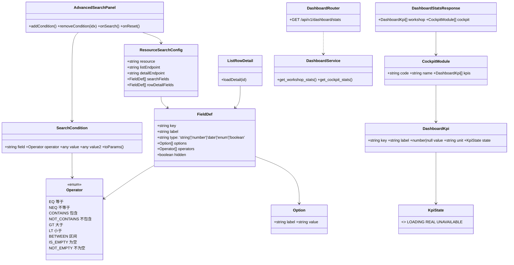
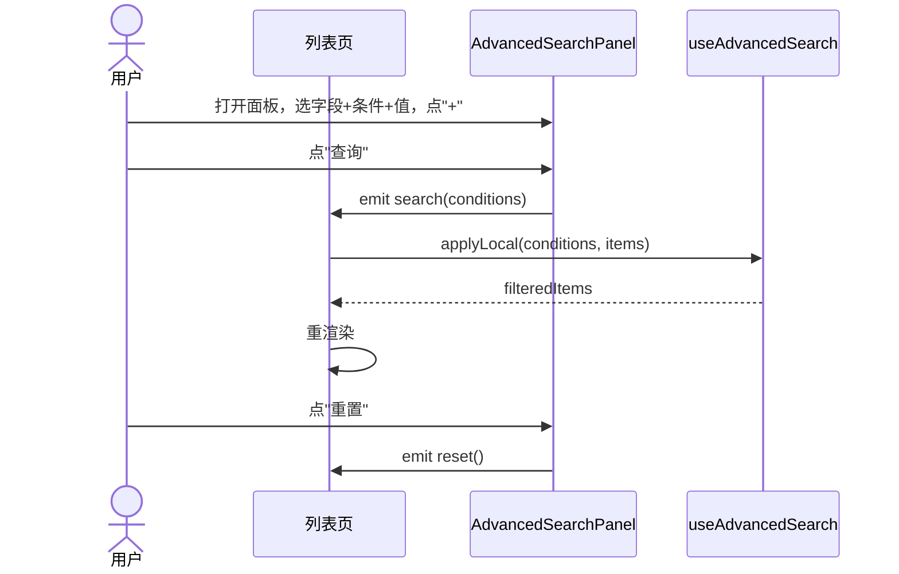
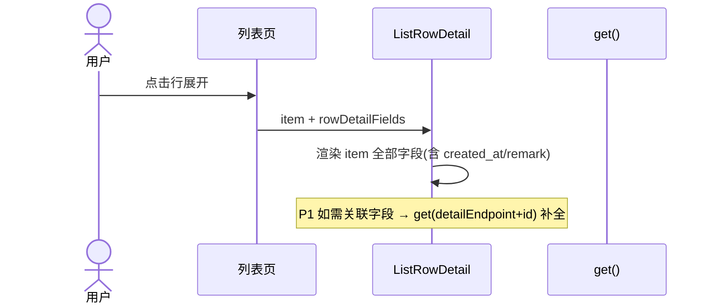
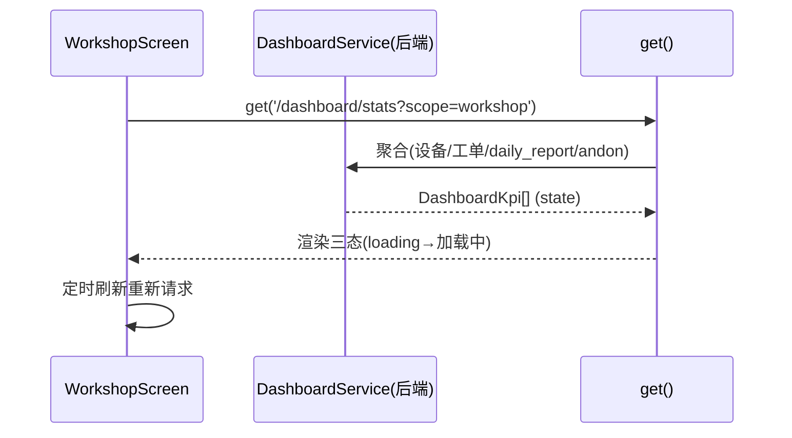
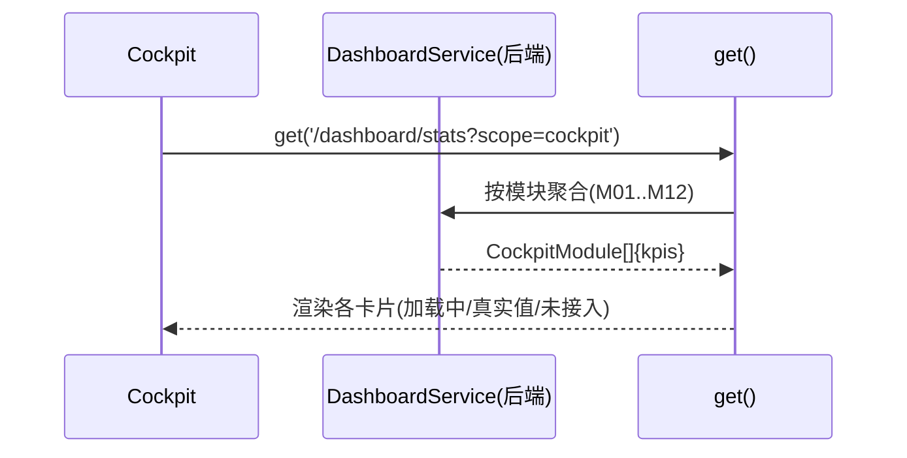
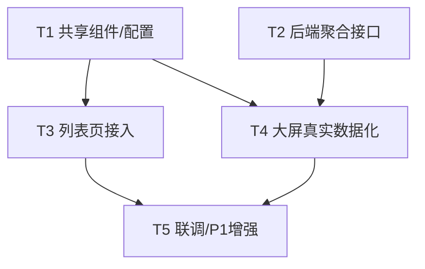

# 知微 ziwi · UI 增强（P0 列表页行展开 + 高级检索 + 大屏真实数据化）— 系统架构设计 + 任务分解

> 作者：架构师 高见远（software-architect）
> 输入：PRD《知微 ziwi 前端 UI 增强 简单 PRD》（作者：许清楚）+ 现状代码事实
> 约束：不修改任何代码文件，仅产出设计与任务分解；遵守"只改必要文件、不引入新类型错误"原则

---

## 0. 调研结论摘要（基于实际读码）

### 0.1 列表页共性结构 & 差异点（已读 OperationList / ProductList / WorkOrderList / StockQuery 及路由）

**共性**
- 每个列表页都在 `<script setup>` 内自管：`list/loading/keyword` + 自有 `fetchData()`；
- 顶部都是"关键字 + 1~3 个固定筛选项 + 搜索/重置按钮"；
- 数据来自 `get('/{resource}', { page, page_size, keyword, ... })`，`res.items` 渲染到 `van-cell` 或 `van-list`；
- 列表接口**已返回隐藏字段**（如 Operation 的 `created_at / remark / labor_cert`，Product 的 `created_at / remark` 均在 list 响应中），只是 UI 未展示；
- 所有资源均有 `GET /{resource}/{id}` 详情接口，返回完整对象（含关联字段）。

**差异点（统一改造的切入点）**
| 维度 | 现状 | 统一目标 |
|---|---|---|
| 容器组件 | OperationList/ProductList 用 `van-cell-group`；WorkOrderList/StockQuery 用 `van-list` | 行展开组件与容器无关，二者均可挂 |
| 搜索栏 | 各页手写字段+选项（如 `OP_TYPE_OPTIONS`） | 抽成 `<AdvancedSearchPanel>` + `searchFields.ts` 配置 |
| 行交互 | 仅编辑/删除/跳转详情 | 新增"点击行展开"展示全部字段 |
| 选项常量 | 散落各 .vue | 收敛进 `searchFields.ts` |
| 类型 | 各页内联 `interface`，与 `types/index.ts` 部分重复 | 复用 `types/index.ts` 实体，新增类型进 `types/search.ts` |

**结论**：抽 **2 个共享组件** + **1 个字段配置** + **1 个 composable**，即可让 13 个列表页以"机械式接入"完成 P0-3/P0-4，互不影响、不碰无关文件。

### 0.2 后端接口能力矩阵（已读 basic_data / production / tpm / andon / energy / data_collection / wms / quality / trial / lab）

| 能力 | 现状 | 是否满足需求 |
|---|---|---|
| 列表分页 `page/page_size` | ✅ 全部支持 | ✅ |
| `keyword` 模糊搜 | ✅ 多数支持 | ✅ |
| 个别字段过滤（op_type/status/product_type/category/warehouse_id…） | ✅ 各端点零散支持 | ⚠️ 非通用、不可叠加 |
| **通用 field/operator/value 组合过滤** | ❌ 无 | ❌ 需前端本地或新增后端参数 |
| 日期范围 / 区间 | ❌ 仅 `report_date` 精确、`carbon/accounting` 需起止 | ❌ |
| 多条件叠加 / AND | ❌ | ❌ |
| 详情 `/{id}`（含隐藏字段/关联） | ✅ 全覆盖 | ✅ 行展开可用 |
| 统一 `stats/metrics/dashboard` 聚合 | ❌ 不存在 | ❌ 需新增 |
| 计数（count） | ⚠️ 仅能以 `page_size=1` 读 `total` 近似 | ⚠️ 可行但脆弱 |
| 既有聚合：`/reports/daily`、`/reports/monthly`、`/energy/carbon/accounting`、`/wms/reports/*`、`/collect/health-overview` | ✅ | 部分 KPI 可复用 |

**KPI 数据源结论（Q3 依据）**
- **可零后端改动复用**：工单总数/已完成（`/work-orders` + status）、报工总数（`/work-reports`）、设备在线/总数（`/equipment` + status）、当日产出/不良（`/reports/daily?date=today` 的 `total_output/total_scrap`）、能碳（`/energy/carbon/accounting` 需日期）、安灯呼叫/未处理（`/andon/calls` + status）。
- **需服务端聚合/无现成入口**：今日计划产量、达成率、设备在线率、品质不良数（reject 计数）、数据采集设备/导入数、能碳当月总量（无日期时）。→ **推荐新增一个聚合接口**统一供给（详见 Q3）。

### 0.3 四个待确认问题 — 一锤定音（详见第 8 节）

- **Q1 过滤执行位置**：MVP **前端本地过滤**（零后端改动，全量落地）；增强路径补后端通用 `filters` 参数。
- **Q2 行展开字段来源**：P0 直接渲染**列表项已返回字段**（含隐藏字段，零请求）；P1 对需关联字段的记录懒加载 `/{id}` 补全。
- **Q3 大屏 KPI 数据源**：**新增一个后端聚合接口** `GET /api/v1/dashboard/stats?scope=workshop|cockpit`，每项带 `state`(real|unavailable) 支撑三态；若本期无后端排期则用 MVP 备选（部分 KPI 标"未接入"）。
- **Q4 检索字段清单维护**：**前端静态 schema 配置** `config/searchFields.ts`（按 resource 声明）；P1 可演进为后端字段元数据动态驱动。

---

## 1. 实现方案与框架选型

- **统一组件策略**
  - `<ListRowDetail>`：受控组件，`props: { item, fields: FieldDef[] }`，按 schema 渲染记录全部字段（含隐藏字段）；P1 增加 `props.detailEndpoint` 触发懒加载补全。
  - `<AdvancedSearchPanel>`：受控组件，`props: { config: ResourceSearchConfig }`，内部维护 `SearchCondition[]`，提供"+/− 条件行、字段/条件/值、查询、重置"，`emit('search', conditions)` / `emit('reset')`。
  - `composables/useAdvancedSearch.ts`：持有条件状态 + 客户端求值（9 种算子），对当前已加载 items 过滤；暴露 `applyLocal / clear`。
- **状态管理**：**不引入 Pinia/Vuex**。列表页各自 `ref` 状态即可；跨页共享的只有"字段 schema 配置"（静态 import）与"高级检索条件持久化（P1，用 `localStorage` 按 route 存）。避免新增全局状态带来的类型/构建风险。
- **过滤执行位置**：见 Q1 —— MVP 前端本地过滤。
- **技术栈 / 依赖**：保持 Vue3 + Vite + TS + Vant4 + dayjs（已装）。**不新增任何第三方库**，高级检索的值输入全部复用 Vant 现有组件（`van-field` 文本/数字、`van-picker` 枚举、`van-date-picker`/`van-calendar` 日期与区间、`van-popup` 承载面板）。
- **三态规范**：大屏与模块卡片统一三态 —— `loading`(加载中) / `real`(真实值，含真实 0) / `unavailable`(未接入)。复用现有 `KpiCard.vue`（已支持 title/value/unit/trend/color），扩展 `state` 视觉。

---

## 2. 文件列表（相对路径）

### 2.1 新增（共享组件 / 配置 / 类型 / composable）
```
frontend/src/types/search.ts                 # Operator 枚举、SearchCondition、FieldDef、ResourceSearchConfig、KpiState
frontend/src/config/searchFields.ts          # 各 resource 的 searchFields + rowDetailFields（核心配置）
frontend/src/composables/useAdvancedSearch.ts# 条件状态 + 客户端 9 算子求值
frontend/src/components/ListRowDetail.vue     # 行展开：渲染全部字段（含隐藏字段）
frontend/src/components/AdvancedSearchPanel.vue # 高级检索组合面板
```

### 2.2 需改造的列表页（P0-3 行展开 + P0-4 高级检索，共 13 个）
```
frontend/src/pages/basics/OperationList.vue
frontend/src/pages/basics/ProductList.vue
frontend/src/pages/basics/WorkCenterList.vue
frontend/src/pages/basics/RouteList.vue
frontend/src/pages/production/WorkOrderList.vue
frontend/src/pages/wms/ReceiptOrderList.vue
frontend/src/pages/wms/IssueOrderList.vue
frontend/src/pages/wms/StockQuery.vue
frontend/src/pages/quality/InspectionList.vue
frontend/src/pages/trial/TrialList.vue
frontend/src/pages/lab/RequestList.vue
frontend/src/pages/equipment/EquipmentList.vue
frontend/src/pages/andon/AndonList.vue
```
> 改造方式统一：顶部插入 `<AdvancedSearchPanel :config="cfg" @search=... @reset=...>`；行容器包裹 `<ListRowDetail>`（点击展开）。各页仅引入组件 + 本 resource 的 `searchFields` 配置，**不改动既有 fetch/CRUD 逻辑**。

### 2.3 需改造的大屏页（P0-1 / P0-2）
```
frontend/src/pages/dashboard/WorkshopScreen.vue   # 移除硬编码模拟值，改调真实接口
frontend/src/pages/dashboard/Cockpit.vue          # 各模块补接口，三态渲染
frontend/src/components/KpiCard.vue                # 扩展 state 视觉（loading/real/unavailable）
```

### 2.4 可能新增的后端接口文件（Q3 主方案）
```
backend/app/api/dashboard.py                 # GET /api/v1/dashboard/stats?scope=workshop|cockpit
backend/app/services/dashboard_service.py    # 复用现有 repo/service 聚合各 KPI，输出 DashboardKpi[]
backend/app/repositories/dashboard_repo.py   # 必要计数 SQL（设备状态、工单状态、不良决策等）
# 路由需在 backend/app/main.py（或 api 聚合处）注册 dashboard router；tenant 隔离沿用现有依赖
```
> 若本期无后端排期 → 走 MVP 备选：前端并行调 `/work-orders`、`/work-reports`、`/equipment`、`/reports/daily` 等现有接口拼 KPI（见 Q3）。

---

## 3. 数据结构与接口（类图，详见 `docs/ui-enhance-class-diagram.mermaid`）



**关键类型（伪代码）**
```ts
// frontend/src/types/search.ts
export type Operator = 'EQ'|'NEQ'|'CONTAINS'|'NOT_CONTAINS'|'GT'|'LT'|'BETWEEN'|'IS_EMPTY'|'NOT_EMPTY'
export interface FieldDef { key:string; label:string; type:'string'|'number'|'date'|'enum'|'boolean'; options?:{label:string;value:string}[]; operators?:Operator[]; hidden?:boolean }
export interface SearchCondition { field:string; operator:Operator; value?:any; value2?:any }
export interface ResourceSearchConfig { resource:string; listEndpoint:string; detailEndpoint:string; searchFields:FieldDef[]; rowDetailFields:FieldDef[] }
export type KpiState = 'loading'|'real'|'unavailable'
export interface DashboardKpi { key:string; label:string; value:number|null; unit?:string; state:KpiState }
```
```jsonc
// 后端 GET /api/v1/dashboard/stats?scope=workshop 响应（data 部分）
{
  "workshop": [
    {"key":"equipmentOnline","label":"设备在线","value":12,"unit":"台","state":"real"},
    {"key":"equipmentTotal","label":"设备总数","value":15,"unit":"台","state":"real"},
    {"key":"todayOutput","label":"今日产出","value":1280,"unit":"件","state":"real"},
    {"key":"todayPlanned","label":"今日计划","value":1600,"unit":"件","state":"real"},
    {"key":"outputRate","label":"达成率","value":80,"unit":"%","state":"real"},
    {"key":"defectRate","label":"不良率","value":2.1,"unit":"%","state":"real"},
    {"key":"ordersCompleted","label":"已完成工单","value":18,"state":"real"},
    {"key":"ordersTotal","label":"工单总数","value":24,"state":"real"}
  ],
  "cockpit": [
    {"code":"M01","name":"生产管理","kpis":[{"key":"orders","label":"工单","value":24,"state":"real"},{"key":"reports","label":"报工","value":131,"state":"real"}]},
    {"code":"M02","name":"TPM设备","kpis":[{"key":"equipment","label":"设备","value":15,"state":"real"},{"key":"tasks","label":"待保养","value":3,"state":"real"}]},
    {"code":"M11","name":"能碳管理","kpis":[{"key":"energy","label":"设备","value":8,"state":"real"},{"key":"carbon","label":"碳排放","value":null,"state":"unavailable"}]}
  ]
}
```

---

## 4. 程序调用流程（时序图，详见 `docs/ui-enhance-sequence-diagram.mermaid`）









---

## 5. 任务列表（有序、含依赖、P0/P1、可并行）

| 任务 | 名称 | 源文件 | 依赖 | 优先级 | 并行说明 |
|---|---|---|---|---|---|
| **T1** | 抽离共享组件与配置（前端基础设施） | `types/search.ts`、`config/searchFields.ts`、`composables/useAdvancedSearch.ts`、`components/ListRowDetail.vue`、`components/AdvancedSearchPanel.vue` | 无 | P0 | 与 T2 **并行**；本任务完成为 T3/T4 前提 |
| **T2** | 后端新增大屏聚合接口 | `backend/app/api/dashboard.py`、`services/dashboard_service.py`、`repositories/dashboard_repo.py`、main.py 注册 | 无 | P0 | 与 T1 **并行**（独立仓库层） |
| **T3** | 全量列表页接入行展开 + 高级检索 | 13 个列表页（见 §2.2） | T1 | P0 | 13 页可**按模块分组并行**（basics 组 / wms 组 / quality·trial·lab 组 / equipment·andon 组），各组仅依赖 T1 |
| **T4** | 大屏真实数据化（车间 + 驾驶舱） | `WorkshopScreen.vue`、`Cockpit.vue`、`KpiCard.vue` | T1, T2 | P0 | 车间可在 T2 前用 MVP 备选先行；完整体验等 T2 |
| **T5** | 联调与 P1 增强 | 跨上述文件 | T3, T4 | P1 | 行展开懒加载详情、检索条件持久化、字段预置、大屏容错、E2E |

> 依赖图（Mermaid）：T1 ─┬→ T3 ─┐; T2 ─┴→ T4 ─┤; T3+T4 → T5。
> 关键并行点：**T1 与 T2 互不影响，应同时开工**；T3 内部 13 页由各负责人按组并行，不互相阻塞。



---

## 6. 依赖包列表

**无新增第三方依赖。** 全部复用既有栈：
- `vant@^4`（已有）：`van-field`(文本/数字)、`van-picker`(枚举)、`van-date-picker`/`van-calendar`(日期/区间)、`van-popup`(面板容器)、`van-cell`/`van-list`、`van-tag`、`van-empty`、`van-loading`、`van-dialog`、`van-button` —— 高级检索全部值输入与行展开容器均由此实现。
- `dayjs`（已有，WorkshopScreen 已用）：日期格式化与区间比较。
- `vue` / `vue-router` / `vite` / `typescript`：既有，不升级。

---

## 7. 共享知识（跨文件约定）

1. **字段 schema 约定**：所有可按字段检索 / 可展开展示的字段集中在 `config/searchFields.ts`，按 `resource` 导出 `ResourceSearchConfig`；`searchFields` 用于高级检索下拉，`rowDetailFields` 用于行展开展示（含 `hidden:true` 的隐藏字段如 `created_at/remark`）。新增/调整字段只改此文件。
2. **Operator 枚举（9 种，全前端统一）**：`EQ/NEQ/CONTAINS/NOT_CONTAINS/GT/LT/BETWEEN/IS_EMPTY/NOT_EMPTY`。`IS_EMPTY/NOT_EMPTY` 不取 value；`BETWEEN` 取 `value`+`value2`。
3. **三态视觉规范**：`loading`→骨架/`van-loading`；`real`→真实数字（**含真实 0**，与占位区分）；`unavailable`→灰色"未接入"标签（`KpiCard` 扩展 `state` 样式）。前端 `loading` 由请求态控制，后端只回 `real|unavailable`。
4. **tenant 注入**：`api/client.ts` 已自动从 `localStorage` 注入 `X-Tenant-Id` 与 `Authorization`，所有接口无需手动传 tenant。
5. **响应解包**：后端统一 `{code,message,data}`；列表为 `data:{items,total,page,page_size}`；前端 `get()` 已解包 `data.data`，列表页直接 `res.items / res.total`。
6. **行展开字段来源**：P0 直接用列表项已返回字段（零请求）；P1 才对需关联对象的记录懒加载 `/{resource}/{id}`。
7. **高级检索 MVP 语义**：前端本地过滤作用于"当前已加载 items"；为保证分页内完整，列表页初次加载可 `page_size` 调大或提供"加载全部"；超大数据集的精确过滤留待 P1 后端下推。
8. **类型纪律**：复用 `types/index.ts` 已有实体接口；**新增类型只放 `types/search.ts`**；不触碰无关既有 .vue 类型错误；实际打包走 `vite build`（esbuild 绕过 `vue-tsc` 门禁）。

---

## 8. 四个待确认问题 — 明确技术决策

### Q1 高级检索过滤执行位置（前端本地 vs 后端 query）
- **现状**：后端各列表仅支持 `keyword` + 个别字段过滤（op_type/status/product_type/category/warehouse_id…），**无通用 field/operator/value 组合、无日期范围、无多条件叠加**。
- **MVP 决策：前端本地过滤。**
  - 理由：① 零后端改动，P0 即可 13 页统一落地；② 列表多为主数据、体量小，本地过滤即时且无需分页纠结；③ 避免为 13 个接口各加通用 filter 的庞大改动与回归风险。
  - 实现：`<AdvancedSearchPanel>` 产出 `SearchCondition[]` → `useAdvancedSearch.applyLocal` 在已加载 items 上求值（9 种算子全覆盖，区间/为空/不为空/包含均支持）→ 重渲染。
- **增强路径（P1/P2）**：后端新增通用 `filters` 参数（JSON 数组或 `field/op/value` 重复参数），前端优先下推服务端过滤；本地过滤作为 fallback（数据量大/字段多时切换）。字段预置适配、条件持久化同属 P1。

### Q2 行展开隐藏字段数据来源（列表已返回 vs 需详情接口）
- **决策：P0 直接渲染列表项已返回字段（含隐藏字段，零请求）；P1 对需关联对象的记录懒加载 `/{resource}/{id}` 补全。**
- 理由：实测列表接口已返回 `created_at/remark/审计与关联 id` 等隐藏字段，UI 只是没展示；零请求即满足"展开显示全部字段含隐藏字段"。详情接口（`/{id}` 全覆盖）用于更深关联字段，避免首屏 N+1。

### Q3 大屏各模块 KPI 真实数据源（现有接口 vs 需新增聚合接口）
- **决策：新增一个后端聚合接口 `GET /api/v1/dashboard/stats?scope=workshop|cockpit`**（与 PRD P0-2"补接口"一致），由 `DashboardService` 复用现有 repo/service 计算，每项带 `state: real|unavailable` 支撑三态；前端按 `loading/real/unavailable` 渲染。
  - **车间 workshop**：设备在线/总数（设备状态聚合）、今日产出/不良率（`/reports/daily?date=today` 的 `total_output/total_scrap` 算得）、工单已完成/总数（工单状态聚合）、今日计划产量/达成率（**新增聚合**：今日计划=`work_orders` 计划量汇总，达成率=产出/计划）、异常告警（andon 未处理）。
  - **驾驶舱 cockpit**：M01 生产（工单/报工 total）、M02 TPM（设备 total/running、待保养任务）、M03 品质（检验单 total、不良 `decision=reject` 计数）、M05 安灯（呼叫 total、未处理）、M11 能碳（设备 total；碳排放需日期→先 `unavailable` 或取当月）、M12 数据采集（数据源 total、导入任务 total）。
- **MVP 备选（零后端改动，仅当本期无后端排期时采用）**：车间大屏并行调 `/work-orders`、`/work-reports`、`/equipment`(status)、`/reports/daily` 四个现有接口拼 KPI；"今日计划/达成率"暂标 `unavailable`。此路径不推荐为终态，仅作兜底。

### Q4 高级检索字段清单维护方式（动态元数据 vs 前端静态 schema）
- **决策：MVP 用前端静态 schema 配置 `config/searchFields.ts`**（按 resource 导出 `ResourceSearchConfig`，含 `searchFields` + `rowDetailFields`），各列表页 import 即用，并收敛既有散落的 `OP_TYPE_OPTIONS` 等常量。
- 理由：零后端改动、与 UI 展示完全一致、易评审、易在 Code Review 中核对字段口径。
- 增强（P1）：可演进为后端字段元数据接口 `/meta/fields?resource=` 动态驱动（动态元数据作为增强，非 MVP 必需）。

---

## 9. 待明确事项（需用户/PM 再确认）

1. **后端聚合接口是否本期排期**？若无 backend 资源，大屏改走 MVP 备选（部分 KPI 标"未接入"），T2 顺延。
2. **高级检索 MVP 是否接受"前端本地过滤（分页内生效）"**，还是必须后端精确过滤？影响 T1 内 composable 设计与是否追加 T2 类后端改动。
3. **"今日计划产量"口径**：按 `work_orders.scheduled_start_at = 今日` 的计划量汇总？还是其它口径？需 PM 确认，否则 T2 聚合 SQL 不确定。
4. **列表页范式统一**：是保持 `van-cell-group` 与 `van-list` 两种现状分别接入，还是借机统一为 `van-list` 懒加载？影响 T3 工作量与分页行为（涉及本地过滤的"加载全部"策略）。
5. **驾驶舱"未接入"模块呈现**：灰显占位卡片 vs 直接隐藏？需 PM/UI 确认视觉。
6. **行展开"全部字段"范围**：是否包含审计字段（`created_at/updated_at`）与关联 id？建议**包含**（满足"含隐藏字段"），请 PM 确认。
7. **三态中的"真实 0"语义**：是否要与"无数据/未接入"在视觉上区分（如 0 用正常色、未接入用灰）？KpiCard 扩展样式需 UI 给规范。

---
> 附：详细 Mermaid 图已抽取至 `docs/ui-enhance-class-diagram.mermaid` 与 `docs/ui-enhance-sequence-diagram.mermaid`。
