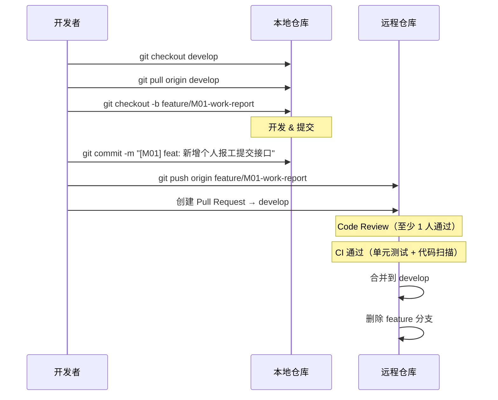

# Git 分支管理策略

> **版本**：v1.0 | **适用范围**：知微 ziwi SaaS 全仓库

---

## 一、分支模型

```
main（生产环境 · 只读）
  │
  └── develop（集成环境 · 默认开发分支）
        │
        ├── feature/xxx（功能分支，从 develop 拉取）
        ├── bugfix/xxx（修复分支）
        └── release/v1.x（发布准备分支）
```

### 分支说明

| 分支 | 名称 | 用途 | 生命周期 | 谁可合并 |
|------|------|------|---------|---------|
| `main` | 生产分支 | 线上运行版本 | 永久 | Tech Lead / 架构师 |
| `develop` | 集成分支 | 日常开发集成 | 永久 | 所有开发者（MR 通过后） |
| `feature/*` | 功能分支 | 新功能开发 | 功能完成即删除 | 不直接合并 |
| `bugfix/*` | 修复分支 | Bug 修复 | 修复完成即删除 | 不直接合并 |
| `release/v*` | 发布分支 | 版本发布准备 | 发布完成即删除 | Tech Lead |

---

## 二、分支命名规范

```
feature/{模块}-{功能简述}
```

| 类型 | 格式 | 示例 |
|------|------|------|
| 新功能 | `feature/{模块}-{功能简述}` | `feature/M01-work-report` |
| Bug 修复 | `bugfix/{模块}-{问题简述}` | `bugfix/M01-work-order-status` |
| 紧急修复 | `hotfix/{模块}-{问题简述}` | `hotfix/M0-tenant-login` |
| 发布准备 | `release/v{major}.{minor}` | `release/v1.0`, `release/v1.1` |
| 技术改进 | `chore/{描述}` | `chore/upgrade-fastapi` |

> **命名规则**：小写字母 + 连字符 `-`，禁止中文、禁止空格、禁止特殊字符。

---

## 三、开发流程

### 3.1 日常开发



### 3.2 提交流程

1. **同步最新代码**：`git checkout develop && git pull`
2. **创建功能分支**：`git checkout -b feature/{模块}-{功能}`
3. **开发 & 本地提交**
4. **推送远程**：`git push origin feature/{模块}-{功能}`
5. **创建 Pull Request** → 目标分支 `develop`
6. **Code Review**：至少 1 人批准
7. **CI 通过**：单元测试 + 代码扫描
8. **合并 & 删除分支**

### 3.3 Commit 规范

```
[{模块}] {类型}: {描述}
```

| 类型 | 说明 | 示例 |
|------|------|------|
| `feat` | 新功能 | `[M01] feat: 新增个人报工提交接口` |
| `fix` | Bug 修复 | `[M01] fix: 修复报工数量负数问题` |
| `docs` | 文档 | `[M0] docs: 更新 API 接口文档` |
| `refactor` | 重构 | `[M02] refactor: 提取设备状态枚举` |
| `style` | 代码风格 | `[M0] style: 格式化代码` |
| `test` | 测试 | `[M01] test: 增加报工单元测试` |
| `chore` | 工程配置 | `[M0] chore: 升级 FastAPI 版本` |
| `perf` | 性能优化 | `[M12] perf: 优化时序数据查询` |

**Commit 规范说明**：
- 标题不超过 **72 字符**
- 正文（可选）用空行分隔，每行不超过 **80 字符**
- 关联任务编号可在正文中标注

---

## 四、Code Review 规则

### 4.1 基本要求

- **至少 1 人** Code Review 通过后方可合并
- **禁止** 自行合并自己的 PR（即使是小修改）
- **紧急修复** 可以事后补 Review（需在 PR 描述中说明）

### 4.2 Review 检查项

- [ ] 业务逻辑正确性
- [ ] 代码是否符合规范
- [ ] 测试是否覆盖核心场景
- [ ] 是否存在安全隐患（SQL 注入/XSS/越权）
- [ ] 是否存在性能问题（N+1 查询/无分页）
- [ ] 日志是否完整
- [ ] 错误处理是否完善

### 4.3 Review 评论礼仪

- **建议使用 `suggestion` 模式**（GitHub 的代码建议功能）
- 评论聚焦代码本身，不针对人
- 标注类型：`nit:`（小问题）/ `blocking:`（阻塞合并）/ `question:`（疑问）

---

## 五、合并策略

| 场景 | 合并方式 | 说明 |
|------|---------|------|
| feature → develop | **Squash merge** | 将 feature 的所有 commit 压缩为 1 个，保持历史整洁 |
| develop → release | **Merge commit** | 保留完整提交历史 |
| release → main | **Merge commit** | 保留发布历史，打 tag |
| hotfix → main + develop | **Merge commit** | 同时合并到两个分支 |

### Squash merge 提交信息格式

```
[{模块}] {功能简述} (#{PR 号})

详细描述（可选）
```

---

## 六、版本号规范

遵循 **语义化版本**（SemVer）：`MAJOR.MINOR.PATCH`

| 版本 | 说明 | 示例 |
|------|------|------|
| `MAJOR` | 不兼容的 API 变更 | v2.0.0 |
| `MINOR` | 向下兼容的新功能 | v1.1.0 |
| `PATCH` | 向下兼容的 Bug 修复 | v1.0.1 |

### Tag 规范

```
v{major}.{minor}.{patch}
```

示例：`v1.0.0`、`v1.1.0`、`v1.0.1`

---

## 七、CI/CD 门禁

合并到 `develop` / `main` 前必须通过：

| 检查项 | 工具 | 说明 |
|--------|------|------|
| ✅ 单元测试 | pytest / Vitest | 所有测试通过 |
| ✅ 代码风格 | Ruff（Python）/ ESLint（JS） | 无风格错误 |
| ✅ 类型检查 | mypy（Python）/ tsc（TypeScript） | 无类型错误 |
| ✅ 构建验证 | pip install / npm build | 项目可构建 |
| ✅ 覆盖率 | pytest-cov / vitest --coverage | 不低于基线 |

---

## 八、FAQ

**Q：可以在 develop 上直接提交吗？**
A：不可以。所有变更必须通过 feature/bugfix 分支 + PR 进入 develop。

**Q：feature 分支需要同步 develop 的最新代码吗？**
A：需要。如果 feature 分支开发周期超过 2 天，建议每天 rebase 或 merge develop。

**Q：合并冲突怎么处理？**
A：在 feature 分支上 `git merge develop` 解决冲突后继续。

**Q：hotfix 和 bugfix 有什么区别？**
A：bugfix 是修复 develop 上未发布的 bug；hotfix 是修复已发布到 main 的生产 bug，需要同时合并到 main 和 develop。
