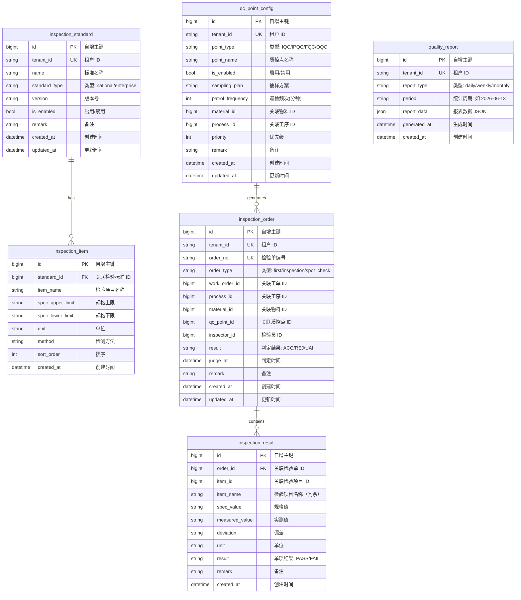

# S7-M03 品质管理模块 架构设计文档

> 模块代号：M03-Quality
> 对应 Phase：Phase 1
> 设计日期：2026-06-13
> 参考模块：S6-M02-TPM

---

## 1. 实现方案 — 四层架构

严格遵循项目中已有的 `models / schemas / repositories / api` 四层架构模式，所有数据访问采用**原生 SQL + SQLAlchemy async session** 方式（与 TPM 模块一致，不使用 ORM Session Query API）。

### 1.1 分层职责

| 层 | 目录 | 职责 | TPM 对标 |
|---|---|---|---|
| **models** | `app/models/quality.py` | SQLAlchemy `Base` 模型定义，ORM 表映射、字段类型、默认值、注释 | `models/tpm.py` |
| **schemas** | `app/schemas/quality.py` | Pydantic 请求/响应模型，`from_attributes = True` 配置 | `schemas/tpm.py` |
| **repositories** | `app/repositories/quality_repo.py` | 继承 `MultiTenantRepository`，写原生 SQL CRUD + 分页查询 | `repositories/tpm_repo.py` |
| **api** | `app/api/quality.py` | FastAPI `APIRouter`，依赖注入 `get_db`，统一 JSON 响应格式 | `api/tpm.py` |

### 1.2 关键约定

- **响应格式**：一律返回 `{"code": 0, "message": "success", "data": ...}`
- **错误响应**：`raise HTTPException(404, detail={"code": "404-0000", "message": "xxx不存在"})`
- **租户 ID**：当前通过 `tenant_id = "default"` 硬编码注入（与 TPM 一致）
- **分页参数**：`page` 默认 1，`page_size` 默认 20，最大 100
- **模型主键**：`BigInteger` 自增，统一字段名 `id`

---

## 2. 文件列表

### 2.1 需要新建的文件

| 序号 | 文件路径 | 说明 |
|------|----------|------|
| 1 | `app/models/quality.py` | 品质管理 6 张表的 SQLAlchemy 模型 |
| 2 | `app/schemas/quality.py` | 品质管理所有请求/响应 Schema |
| 3 | `app/repositories/quality_repo.py` | 品质管理数据访问层（原生 SQL） |
| 4 | `app/api/quality.py` | 品质管理 API 路由 |

### 2.2 需要修改的文件

| 序号 | 文件路径 | 修改内容 |
|------|----------|----------|
| 1 | `app/models/__init__.py` | 导入 `quality.py` 中所有模型类，加入 `__all__` |
| 2 | `app/main.py` | 导入 `quality` 路由模块，调用 `app.include_router(quality.router)` |

---

## 3. 数据模型（ER 图）



### 3.1 表关系说明

| 主表 | 子表 | 关系类型 | 外键字段 |
|------|------|----------|----------|
| `inspection_standard` | `inspection_item` | 1:N | `inspection_item.standard_id → inspection_standard.id` |
| `qc_point_config` | `inspection_order` | 1:N | `inspection_order.qc_point_id → qc_point_config.id` |
| `inspection_order` | `inspection_result` | 1:N | `inspection_result.order_id → inspection_order.id` |

### 3.2 字段设计要点

- **inspection_order.order_no**：系统自动生成，格式 `QC-{yyyyMMdd}-{4位流水号}`，如 `QC-20260613-0001`
- **inspection_order.result**：枚举 `ACC(合格) / REJ(不合格) / UAI(待判定)`
- **inspection_order.order_type**：枚举 `first(首检) / inspection(巡检) / spot_check(抽检)`
- **qc_point_config.point_type**：枚举 `IQC(来料检) / IPQC(过程检) / FQC(完工检) / OQC(出货检)`
- **inspection_item.spec_upper_limit / spec_lower_limit**：使用 `String` 类型以兼容数字、文本型规格
- **quality_report.report_data**：使用 `JSON` 类型，存储灵活的统计聚合结果

---

## 4. API 接口设计表

### 4.1 质控点配置 API

| 方法 | 路径 | 参数 | 返回值 | 功能说明 |
|------|------|------|--------|----------|
| GET | `/api/v1/qc-points` | `page`, `page_size`, `point_type`, `is_enabled` | 分页列表 | 分页查询质控点 |
| GET | `/api/v1/qc-points/{id}` | `id` | 单条详情 | 获取质控点详情 |
| POST | `/api/v1/qc-points` | `CreateQcPointRequest` | `{"code":0,"message":"创建成功"}` | 创建质控点 |
| PUT | `/api/v1/qc-points/{id}` | `id`, `UpdateQcPointRequest` | `{"code":0,"message":"更新成功"}` | 更新质控点 |
| DELETE | `/api/v1/qc-points/{id}` | `id` | `{"code":0,"message":"删除成功"}` | 删除质控点 |

### 4.2 检验标准 API

| 方法 | 路径 | 参数 | 返回值 | 功能说明 |
|------|------|------|--------|----------|
| GET | `/api/v1/inspection-standards` | `page`, `page_size`, `name`, `standard_type`, `is_enabled` | 分页列表 | 分页查询检验标准 |
| GET | `/api/v1/inspection-standards/{id}` | `id` | 单条详情 | 获取检验标准详情 |
| POST | `/api/v1/inspection-standards` | `CreateStandardRequest` | 创建成功 | 创建检验标准 |
| PUT | `/api/v1/inspection-standards/{id}` | `id`, `UpdateStandardRequest` | 更新成功 | 更新检验标准 |
| DELETE | `/api/v1/inspection-standards/{id}` | `id` | 删除成功 | 删除检验标准 |

### 4.3 检验项目 API

| 方法 | 路径 | 参数 | 返回值 | 功能说明 |
|------|------|------|--------|----------|
| GET | `/api/v1/inspection-items` | `page`, `page_size`, `standard_id` | 分页列表 | 分页查询检验项目 |
| GET | `/api/v1/inspection-items/{id}` | `id` | 单条详情 | 获取检验项目详情 |
| POST | `/api/v1/inspection-items` | `CreateInspectionItemRequest` | 创建成功 | 创建检验项目 |
| PUT | `/api/v1/inspection-items/{id}` | `id`, `UpdateInspectionItemRequest` | 更新成功 | 更新检验项目 |
| DELETE | `/api/v1/inspection-items/{id}` | `id` | 删除成功 | 删除检验项目 |

### 4.4 检验单 API

| 方法 | 路径 | 参数 | 返回值 | 功能说明 |
|------|------|------|--------|----------|
| GET | `/api/v1/inspection-orders` | `page`, `page_size`, `order_type`, `result`, `start_date`, `end_date` | 分页列表 | 分页查询检验单 |
| GET | `/api/v1/inspection-orders/{id}` | `id` | 单条详情（含明细列表） | 获取检验单详情 |
| POST | `/api/v1/inspection-orders` | `CreateOrderRequest` | 创建成功 | 创建检验单 |
| PUT | `/api/v1/inspection-orders/{id}` | `id`, `UpdateOrderRequest` | 更新成功 | 更新检验单基本信息 |
| PUT | `/api/v1/inspection-orders/{id}/judge` | `id`, `JudgeRequest(result, remark)` | 判定成功 | 判定检验单（ACC/REJ/UAI） |
| DELETE | `/api/v1/inspection-orders/{id}` | `id` | 删除成功 | 删除检验单 |

### 4.5 检验结果明细 API

| 方法 | 路径 | 参数 | 返回值 | 功能说明 |
|------|------|------|--------|----------|
| GET | `/api/v1/inspection-orders/{order_id}/results` | `order_id` | 列表 | 查询某检验单的所有明细 |
| POST | `/api/v1/inspection-orders/{order_id}/results` | `order_id`, `CreateResultRequest` | 创建成功 | 添加一条检验明细 |
| PUT | `/api/v1/inspection-results/{id}` | `id`, `UpdateResultRequest` | 更新成功 | 更新检验明细 |
| DELETE | `/api/v1/inspection-results/{id}` | `id` | 删除成功 | 删除检验明细 |

### 4.6 品质报表 API

| 方法 | 路径 | 参数 | 返回值 | 功能说明 |
|------|------|------|--------|----------|
| GET | `/api/v1/quality-reports` | `page`, `page_size`, `report_type`, `period` | 分页列表 | 分页查询报表 |
| GET | `/api/v1/quality-reports/{id}` | `id` | 单条详情 | 获取报表详情 |
| POST | `/api/v1/quality-reports/generate` | `GenerateReportRequest(report_type, period)` | 生成结果 | 手动触发报表生成 |

> **所有查询类接口**统一返回 `{"code": 0, "message": "success", "data": {"items": [...], "total": N, "page": N, "page_size": N}}`
> **所有创建/更新/删除类接口**统一返回 `{"code": 0, "message": "操作成功提示"}`

---

## 5. 编码优先顺序

### Batch 1 — 基础 CRUD（纯数据维护，无业务逻辑）

| 优先级 | 实体 | 包含 API | 预估文件 |
|--------|------|----------|----------|
| P0 | `qc_point_config` | 质控点 5 个 API（CRUD + list） | 4 个文件 |
| P0 | `inspection_standard` | 检验标准 5 个 API（CRUD + list） | 4 个文件 |
| P0 | `inspection_item` | 检验项目 5 个 API（CRUD + list） | 4 个文件 |

**完成标志**：3 个基础数据维护模块可运行，提供单元测试覆盖

### Batch 2 — 核心业务逻辑

| 优先级 | 实体 | 包含 API | 说明 |
|--------|------|----------|------|
| P1 | `inspection_order` | 创建/查询/更新/判定/删除（6 个 API） | 核心流程，含编号自动生成 |
| P1 | `inspection_result` | 按检验单增删改查（4 个 API） | 依赖检验单 ID |
| P1 | 判定业务规则 | 判定时自动汇总明细结果 | 逻辑在 repo 或 api 层实现 |

**完成标志**：检验单完整流程可用（创建 → 录入明细 → 判定）

### Batch 3 — 报表与扩展

| 优先级 | 实体 | 包含 API | 说明 |
|--------|------|----------|------|
| P2 | `quality_report` | 报表生成/查询（3 个 API） | 统计聚合，操作 quality_report 表 |
| P2 | 数据看板 | 后续扩展 | 待与前端对齐 |

**完成标志**：报表可生成和查询

---

## 6. 与 S6 TPM 的代码风格对比

以下是从 TPM 模块提炼、可直接复用于 M03 的模式清单：

### 6.1 可复用的模式

| 模式 | TPM 实现 | M03 复用方式 |
|------|----------|-------------|
| **模型定义** | Declarative `Base` + Column 显式声明，`__tablename__` 小写复数下划线 | 完全一致，6 个模型写在 `quality.py` |
| **多租户** | `MultiTenantRepository` 基类，所有查询自动拼接 `tenant_id` 过滤 | 直接继承 `MultiTenantRepository` |
| **Repository 写法** | 原生 SQL 字符串，`query_one` / `query_page` / `execute` | 完全一致，写在 `quality_repo.py` |
| **分页查询** | `query_page(sql, params, page, page_size)` 返回 `{"items","total","page","page_size"}` | 完全一致 |
| **API 响应格式** | `{"code": 0, "message": "success", "data": ...}` | 完全一致 |
| **错误处理** | `raise HTTPException(404, detail={"code": "404-0000", "message": "xxx不存在"})` | 完全一致 |
| **路由前缀** | `APIRouter(prefix="/api/v1", tags=["M02-TPM"])` | 使用 `tags=["M03-Quality"]` |
| **依赖注入** | `db: AsyncSession = Depends(get_db)` | 完全一致 |
| **Schema 命名** | `CreateXxxRequest` / `UpdateXxxRequest` / `XxxResponse` | 完全一致 |
| **租户 ID 注入** | `{**req.model_dump(), "tenant_id": "default"}` | 完全一致 |
| **目录组织** | 各自独立文件：`models/tpm.py`, `schemas/tpm.py`, `repositories/tpm_repo.py`, `api/tpm.py` | 完全一致 |
| **路由注册** | `main.py` 中 `from app.api import tpm` → `app.include_router(tpm.router)` | 完全一致 |

### 6.2 M03 特有的差异与新增约定

| 差异点 | TPM 做法 | M03 做法 | 原因 |
|--------|---------|----------|------|
| **业务操作 API** | 无专门的"判定"类 API | 新增 `PUT /.../judge` 判定专用接口 | 检验单有明确的流程状态变更 |
| **子资源路由** | 无嵌套资源 | `GET /inspection-orders/{id}/results` 嵌套路由 | 检验结果从属于检验单 |
| **报表触发** | 无 | `POST /quality-reports/generate` 手动触发 | 报表需要按需或定时生成 |
| **编号生成** | 无编号规则 | 检验单编号 `QC-{yyyyMMdd}-{4位流水号}` | 检验单需要唯一可追踪编号 |

### 6.3 模型字段风格对照

```python
# TPM 风格 (models/tpm.py)
class Equipment(Base):
    __tablename__ = "equipment"
    id = Column(BigInteger, primary_key=True, autoincrement=True)
    tenant_id = Column(String(50), nullable=False)
    equipment_name = Column(String(200), nullable=False)
    status = Column(String(20), default="idle", comment="running/idle/maintenance/fault/scrapped")
    created_at = Column(DateTime(timezone=True), server_default=func.now())
    updated_at = Column(DateTime(timezone=True), server_default=func.now(), onupdate=func.now())

# M03 风格 (models/quality.py) — 完全对齐
class InspectionOrder(Base):
    __tablename__ = "inspection_orders"
    id = Column(BigInteger, primary_key=True, autoincrement=True)
    tenant_id = Column(String(50), nullable=False)
    order_no = Column(String(100), nullable=False)
    order_type = Column(String(20), nullable=False, comment="first/inspection/spot_check")
    result = Column(String(10), comment="ACC/REJ/UAI")
    created_at = Column(DateTime(timezone=True), server_default=func.now())
    updated_at = Column(DateTime(timezone=True), server_default=func.now(), onupdate=func.now())
```

---

## 附录：数据库建表 DDL（PostgreSQL）

```sql
-- 1. 检验标准
CREATE TABLE inspection_standard (
    id BIGSERIAL PRIMARY KEY,
    tenant_id VARCHAR(50) NOT NULL,
    name VARCHAR(200) NOT NULL,
    standard_type VARCHAR(20) NOT NULL DEFAULT 'enterprise',  -- national/enterprise
    version VARCHAR(50) DEFAULT '1.0',
    is_enabled BOOLEAN DEFAULT true,
    remark TEXT,
    created_at TIMESTAMPTZ DEFAULT NOW(),
    updated_at TIMESTAMPTZ DEFAULT NOW()
);
CREATE INDEX idx_inspection_standard_tenant ON inspection_standard(tenant_id);

-- 2. 检验项目
CREATE TABLE inspection_item (
    id BIGSERIAL PRIMARY KEY,
    standard_id BIGINT NOT NULL REFERENCES inspection_standard(id) ON DELETE CASCADE,
    item_name VARCHAR(200) NOT NULL,
    spec_upper_limit VARCHAR(100),
    spec_lower_limit VARCHAR(100),
    unit VARCHAR(20),
    method VARCHAR(200),
    sort_order INT DEFAULT 0,
    created_at TIMESTAMPTZ DEFAULT NOW()
);
CREATE INDEX idx_inspection_item_standard ON inspection_item(standard_id);

-- 3. 质控点配置
CREATE TABLE qc_point_config (
    id BIGSERIAL PRIMARY KEY,
    tenant_id VARCHAR(50) NOT NULL,
    point_type VARCHAR(20) NOT NULL,  -- IQC/IPQC/FQC/OQC
    point_name VARCHAR(200) NOT NULL,
    is_enabled BOOLEAN DEFAULT true,
    sampling_plan VARCHAR(200),
    patrol_frequency INT,
    material_id BIGINT,
    process_id BIGINT,
    priority INT DEFAULT 0,
    remark TEXT,
    created_at TIMESTAMPTZ DEFAULT NOW(),
    updated_at TIMESTAMPTZ DEFAULT NOW()
);
CREATE INDEX idx_qc_point_config_tenant ON qc_point_config(tenant_id);

-- 4. 检验单
CREATE TABLE inspection_order (
    id BIGSERIAL PRIMARY KEY,
    tenant_id VARCHAR(50) NOT NULL,
    order_no VARCHAR(100) NOT NULL,
    order_type VARCHAR(20) NOT NULL,  -- first/inspection/spot_check
    work_order_id BIGINT,
    process_id BIGINT,
    material_id BIGINT,
    qc_point_id BIGINT REFERENCES qc_point_config(id),
    inspector_id BIGINT,
    result VARCHAR(10),  -- ACC/REJ/UAI
    judge_at TIMESTAMPTZ,
    remark TEXT,
    created_at TIMESTAMPTZ DEFAULT NOW(),
    updated_at TIMESTAMPTZ DEFAULT NOW()
);
CREATE UNIQUE INDEX idx_inspection_order_no ON inspection_order(order_no);
CREATE INDEX idx_inspection_order_tenant ON inspection_order(tenant_id);
CREATE INDEX idx_inspection_order_type ON inspection_order(order_type);

-- 5. 检验结果明细
CREATE TABLE inspection_result (
    id BIGSERIAL PRIMARY KEY,
    order_id BIGINT NOT NULL REFERENCES inspection_order(id) ON DELETE CASCADE,
    item_id BIGINT REFERENCES inspection_item(id),
    item_name VARCHAR(200),
    spec_value VARCHAR(100),
    measured_value VARCHAR(100),
    deviation VARCHAR(100),
    unit VARCHAR(20),
    result VARCHAR(10),  -- PASS/FAIL
    remark TEXT,
    created_at TIMESTAMPTZ DEFAULT NOW()
);
CREATE INDEX idx_inspection_result_order ON inspection_result(order_id);

-- 6. 品质报表
CREATE TABLE quality_report (
    id BIGSERIAL PRIMARY KEY,
    tenant_id VARCHAR(50) NOT NULL,
    report_type VARCHAR(20) NOT NULL,  -- daily/weekly/monthly
    period VARCHAR(20) NOT NULL,
    report_data JSONB,
    generated_at TIMESTAMPTZ,
    created_at TIMESTAMPTZ DEFAULT NOW()
);
CREATE INDEX idx_quality_report_tenant ON quality_report(tenant_id);
CREATE INDEX idx_quality_report_period ON quality_report(report_type, period);
```

---

> **文档版本记录**
>
> | 版本 | 日期 | 变更内容 | 作者 |
> |------|------|----------|------|
> | v1.0 | 2026-06-13 | 初稿：完整架构设计 | architect-research |
